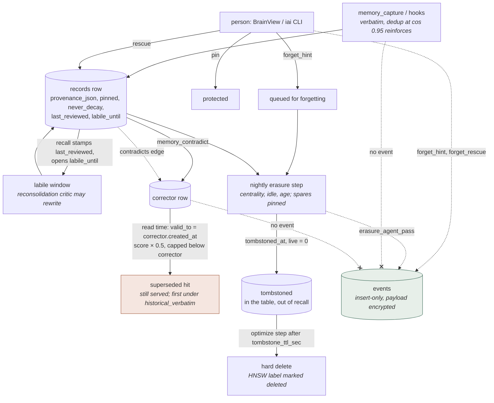

## 1. Executive Summary

iai-pme is an MIT-licensed personal memory engine for one person's coding
assistants: 132,421 lines of Python, Rust, TypeScript and TSX under `src/`,
`crates/`, `rust/`, `mcp-wrapper/src` and `desktop/src` across 357 files, with
725 test files holding 5,954 test functions in 194,710 lines. 249 commits from
ten authors since 6 May 2026, read at
[`1043a41f025b64a2fea51634a56c1ee5bdf95edd`](https://github.com/CodeAbra/iai-personal-memory-engine/commit/1043a41f025b64a2fea51634a56c1ee5bdf95edd),
dated 23 August 2026, the day of release 3.0.8; releases 3.0.0 through 3.0.8
landed between 8 and 23 August. It is local-only, encrypts every text field
at rest with AES-256-GCM under the record's own id as associated data, sends no
telemetry, and speaks MCP over stdio to fifteen named clients.

**Its correction model is supersession with both versions kept.**
`memory_contradict` never edits the contradicted row: it inserts the corrector
as a new record, links the two with a `contradicts` edge, and the read path
derives a `valid_to` for the old row from the corrector's `created_at`, then
multiplies the old row's score by 0.5 and caps it just below the corrector
(`src/iai_mcp/retrieve.py:346-417,:504-572,:583-664`). A cue with the
`historical_verbatim` intent turns both off and gets the superseded wording
back. That is a coherent design and it is not a trust state: *stale* is a
discount, never a refusal, and a restated stale fact is folded back into the
stale row by the capture dedup gate as a reinforcement.

**Forgetting is a queue with an undo and a tombstone with a clock.**
`forget_hint` queues a row for the sleep cycle and `rescue` pulls it back; the
nightly erasure step tombstones low-centrality rows nobody has reviewed in the
window, sparing `pinned` and `never_decay`; the optimize step hard-deletes
tombstones older than a TTL. Every one of those transitions writes an
`events` row, and nothing in the tree deletes from that table.

**The benchmark section is where the project's two documents disagree.** The
README says the LongMemEval-S comparison was *"validated in a single harness
against mempalace on the identical 500 cleaned questions"*; `BENCHMARKS.md`
says of the same table that *"the baseline numbers are published and
config-matched (not re-run on this host)"*, and `bench/longmemeval_blind.py`
has no option that runs anything but iai. The matched-embedder row is iai on
`all-MiniLM-L6-v2` beside MemPalace's published `all-MiniLM-L6-v2` figure —
still a fair control against a named number, but not the same-harness run the
README describes. The contradiction benchmark is the better artifact: seven
result sets are committed with environment tables, and the Markdown of the
latest two records a failing gate — ΔMRR of −0.035 against plain cosine on the
classical metric — beside the passing ones, with a note explaining why that
metric is not the promise. Neither the README nor `BENCHMARKS.md` mentions it.

Three marks. `audit_log` on the insert-only `events` table. `human_review` on
pin, forget-hint, rescue and teach in the desktop view and CLI.
`negative_eval` on temporal-recall and quarantine tests that assert exclusion
with the positive control in the same case. Withheld: `tombstone` — the
project's tombstone is a record-level soft delete with a TTL; `trust_state` —
a float and a window; `bitemporal` — validity is derived from another record's
record time and the as-of query walks `created_at`; `scope_enforced` — one
store, and the project says to use something else for more than one person.

## 2. Mental Model

A memory is a **verbatim row**: the stated style is *"verbatim over
paraphrase, precise cues, rare events kept rare"*, and `memory_capture`'s own
description says *"Auto-dedups at cos>=0.95 (reinforces)"*. The row is treated
as true from the moment it lands. Its states are columns and edges, not a
status field.

- **Captured.** A row in a tier — `working`, `episodic`, `semantic`,
  `procedural`, `parametric` — with a provenance list holding the capture's
  timestamp, cue and session. Every later recall appends the session id to
  that list.
- **Reinforced.** A second capture within cosine 0.95 of an existing row is
  not inserted; the existing row is reinforced and reported as
  `"reinforced"` (`src/iai_mcp/capture.py:121`).
- **Labile.** A retrieval stamps `last_reviewed` and opens `labile_until`
  for `labile_window_sec` (`src/iai_mcp/store/_store.py:3466-3480`); inside
  the window the sleep cycle's reconsolidation critic may ask a model to score
  the row's *"prediction error"* from 0.0 to 1.0
  (`src/iai_mcp/reconsolidation_critic.py:15-20`).
- **Superseded.** A `contradicts` edge from the old row to a new one. The old
  row keeps its text, gets a derived `valid_from` of its own `created_at` and
  a `valid_to` of the oldest newer corrector's `created_at`, is scored at half
  weight and capped below the corrector, and is still served — first, if the
  cue asks for historical wording.
- **Protected.** `pinned` or `never_decay`, both excluded from erasure by the
  predicate itself.
- **Queued for forgetting**, by a person's `forget_hint`; **rescued** by the
  same person before the cycle runs.
- **Tombstoned.** `tombstoned_at` set and `live = 0`, by the erasure step
  (centrality below threshold, not reviewed in the window, older than the age
  cutoff), by `blob-quarantine`, or by `idem-dedup`. The row stays in the
  table and out of recall.
- **Dropped.** The optimize step deletes tombstones older than
  `tombstone_ttl_sec`; the HNSW label is marked deleted and journaled.

Nothing moves a row from *superseded* to *wrong*. A wrong memory that nobody
contradicts, pins, or hints away is exactly as authoritative as a right one,
and one that is contradicted is still half as authoritative as its corrector.



## 3. Architecture

A Python package (`src/iai_mcp`, the bulk of the code) with Rust beside it in
two places: `crates/` holds `lillibrain` (a pager and write-ahead log),
`lilliengine` (a SQL parser, executor and catalog of the project's own — CI
runs the suite against it as the storage engine), `lilli-hd` (hypervector
arithmetic) and a parity crate; `rust/` holds the PyO3 bindings for embedding
(`bge-small-en-v1.5` in-process), graph algorithms and a vector core. A
long-running daemon owns the store and serves a socket; a TypeScript
`mcp-wrapper` translates MCP over stdio to that socket and falls back to
direct store reads when the daemon is down; per-client shell and PowerShell
hooks capture turns into an encrypted spool the daemon drains; a Tauri desktop
app renders BrainView.

**Persistence.** One `hippo` table layer (`src/iai_mcp/hippo/_table.py`)
over either the stdlib SQLite driver or the native engine's file format,
holding `records`, `edges`, `events`, `record_tags`, two ledgers and a meta
table. Text columns are encrypted per row with the record id as associated
data; the key lives at `~/.iai-mcp/.crypto.key` at mode 0600, with rotation
and prior-key recovery. The capture spool is encrypted line by line under the
same key. An exact-cosine matrix of the active corpus lives in process memory
and is *"never serialized to disk"*; an HNSW index is a boot accelerator whose
disk file *"is not the source of truth"*.

**Background.** `sleep_pipeline/` has twenty-two steps — cluster replay,
cluster summary, compaction, crisis, curiosity mining, dream decay, embedding
integrity, entity linking, erasure, essential-variable tracking, knob tuning,
memory relief, optimize, recall-index rebuild, reconsolidation, an RSS probe,
schema mining, topic naming and a user model among them. The quiet window is
derived from OS input idle with a persisted 48-hour starvation backstop. One
`claude -p` call per REM cycle, through the user's subscription, capped at 1%
of daily quota; a Codex or Gemini CLI can carry it instead.

### Deployment and ergonomics

`pip install iai-pme`, then `iai-mcp crypto init`, `capture-hooks install`
and `daemon install`; a one-command installer script and a Claude Code plugin
do the same. Nothing else has to run. Fully local and offline apart from the
optional nightly model call; the embedder is bundled and runs in process; no
API key is needed to store anything and a doctor row asserts the paid SDK is
absent. The store is one directory a person can back up, but not one they can
repair by hand: every text field is ciphertext, and losing `.crypto.key` loses
the memories, which the README says in those words. `doctor` runs 33 checks
and its `--apply` mode renames corrupt state aside rather than deleting it.

The screen at this reading reported one auto-run surface —
`.claude-plugin/marketplace.json`, the Claude Code plugin manifest — four
build-time execution paths (`setup.py`, the Tauri `build.rs`, two
`conftest.py`) and two unpinned manifests, with every lockfile at least thirteen
days old. Nothing was installed, built or run.

## 4. Essential Implementation Paths

### Capture (`src/iai_mcp/capture.py`, `capture_queue.py`, hooks)

`memory_capture` embeds the cue or the text, runs the dedup gate at
`DEDUP_COS_THRESHOLD = 0.95` (`capture.py:121`, overridable by environment),
and either inserts a `MemoryRecord` or reinforces the existing one. Turns
captured by hooks go through a spool the daemon drains on every entry into
sleep — release 3.0.5 fixed a path where turns captured just before a forced
sleep stranded there while `doctor` reported green. Entity anchors — backticked
identifiers, handles, CamelCase, proper nouns including Cyrillic — become
`entity:` tags on the row (`src/iai_mcp/entity_anchors.py`).

### Contradict (`src/iai_mcp/retrieve.py:346-417`)

`contradict(store, original_id, new_fact, new_embedding)` flushes the buffer,
embeds the corrector if the caller sent no vector, builds a new row inheriting
the original's tier, community and detail level with provenance
`{"cue": "contradict"}` and the tag `contradict`, inserts it, refuses if the
dedup gate folded it into the contradicted row itself — *"the correction
cannot be the belief it corrects"* — and adds the `contradicts` edge. No event
is written.

### Recall (`src/iai_mcp/pipeline.py`, `retrieve.py`, `store/_exact_index.py`)

Candidates come from the exact-cosine authority — a normalised float32 matrix
scanned under a lock, *"a sub-millisecond hold at tens of thousands of rows"*
— and the HNSW lane, joined by a warm BM25 lane whose top hits add an
additive rank-fusion bonus and enter as scored candidates only
(`pipeline.py:1042-1067,:1269`). Community membership and Hebbian edge weights
are rank inputs; `_find_anti_hits` reads `contradicts` edges incident to the
served hits and returns the other side as `anti_hits`
(`pipeline.py:676-697`). Then `derive_temporal_validity` fills `valid_from`
and `valid_to`, `apply_stale_downweight` multiplies a past-`valid_to` hit by
`STALE_DOWNWEIGHT_FACTOR = 0.5` (`retrieve.py:35`), and `apply_supersede_cap`
sets a superseded hit's score to its best in-window corrector's score minus
10⁻⁴, iterating to a fixpoint for chains (`retrieve.py:607-664`). Every
returned row is stamped `last_reviewed` in the same write, which release 3.0.2
added after finding that the forgetting sweep had treated every retrieved
memory as never used.

### Temporal recall (`mcp-wrapper/src/tools.ts:580-626`)

`memory_temporal_recall(as_of, changed_since)` bounds rows by
`created_at <= as_of`, excluding rows whose `tombstoned_at` precedes `as_of`
and including rows tombstoned after it, and filters `events.ts >
changed_since` on the other side. It is a point-in-time view over record time.

### Forgetting (`src/iai_mcp/brainview.py`, `sleep_pipeline/_erasure.py`, `_optimize.py`)

`forget_hint_direct` appends a `user-forget-hint` provenance entry and writes
a `forget_hint` event; `rescue_direct` does the reverse with `forget_rescue`
(`brainview.py:1408-1458,:1649-1658`). The erasure step builds one predicate —
`centrality < threshold AND (last_reviewed IS NULL OR last_reviewed < window)
AND created_at < age_cutoff AND pinned = false AND never_decay = false AND
tombstoned_at IS NULL` — counts, and if not in dry run updates the matching
rows to `tombstoned_at = now, live = 0` in one statement, invalidates the
active count and the exact matrix, and writes `erasure_agent_pass` with the
counts (`_erasure.py:38-115`). The optimize step drops tombstones older than
`tombstone_ttl_sec`, which `test_aged_tombstones_dropped_after_second_pass`
pins by freezing the clock and fast-forwarding past the TTL.

### Events (`src/iai_mcp/events.py:89-127`)

`write_event` makes a UUID, serialises the payload, encrypts it with the UUID
as associated data, and inserts. A kind listed in the STC config also fires a
synaptic-tagging trigger. The `events_query` tool serves a whitelist of kinds;
`changed_since` bypasses the whitelist.

## 5. Memory Data Model

`records` (`src/iai_mcp/hippo/_table.py:117-155`), abridged:

```sql
CREATE TABLE IF NOT EXISTS records (
    vec_label       INTEGER PRIMARY KEY AUTOINCREMENT,
    id              TEXT NOT NULL UNIQUE,
    tier            TEXT NOT NULL,
    literal_surface TEXT,            -- encrypted
    embedding       BLOB NOT NULL,
    structure_hv    BLOB,
    community_id    TEXT,
    centrality      REAL,
    pinned          INTEGER,
    stability       REAL,
    difficulty      REAL,
    last_reviewed   TEXT,
    never_decay     INTEGER,
    never_merge     INTEGER,
    tombstoned_at   TEXT,
    labile_until    TEXT,
    provenance_json TEXT,            -- encrypted
    created_at      TEXT NOT NULL,
    updated_at      TEXT,
    tags_json       TEXT,
    language        TEXT,
    s5_trust_score  REAL,
    embedding_pending INTEGER NOT NULL DEFAULT 0,
    role            TEXT,
    live            INTEGER
)
```

`edges(src, dst, edge_type, weight, updated_at)` with `contradicts`,
`invariant_anchor` and Hebbian co-activation edges among the types.
`events(id, kind, severity, domain, ts, data_json, session_id,
source_ids_json)`. `record_tags(record_id, tag)` mirrors `tags_json` for the
`entity:` lookups, and a hard delete removes its rows while a soft tombstone
deliberately does not (`_table.py:401-416`).

**Scope.** None. There is no owner, tenant, project or agent column; a
`session_id` is written into provenance and events for traceability, and
`episodes_recent` is documented as *"GLOBAL across all projects"*. The README
says who this is for: *"If you need multi-tenant memory for an app you're
shipping, use one of them — honestly."*

**Provenance** is a per-row JSON list: the capture, then every recall's
session id, then any `user-forget-hint` or rescue. That is a record-level touch
log, encrypted, appended on the read path — which is why a recall is a write.

**Temporal fields** are all record time: `created_at`, `updated_at`,
`last_reviewed`, `labile_until`, `tombstoned_at`. `valid_from` and `valid_to`
exist only on the served hit (`src/iai_mcp/types.py:134`), derived at read
time from `contradicts` edges and the *corrector's* `created_at`. When a fact
stopped being true is, in this model, when its correction was recorded — the
two axes the `bitemporal` mark asks to see apart are one axis here, and the
mark is withheld for that reason rather than for want of machinery.

**Trust** is `s5_trust_score`, a float defaulting to 0.5, read back with a
range check, bound into the structural hypervector as a `CERTAINTY` role
(`src/iai_mcp/tem.py:59`), and consulted by `check_identity_anchor_on_write`:
a row scoring 0.9 or above is an identity-tier write, refused unless it
carries the `s5_consensus` tag that only a three-of-five agreement across
sessions confers and it passes the injection shield's hard block
(`src/iai_mcp/s5.py:15-18,:95-200`). A threshold on a float that gates one
write path is the nearest thing here to a state, and it still answers *how
sure* rather than *may this be acted on*: nothing on the read path filters on
it. `labile_until` is a window, not a status.

## 6. Retrieval Mechanics

Three arms and two post-passes, all tool-mediated: the agent calls
`memory_recall` with a cue, and hooks call it at session start and per turn
with the assembled *memory pack*. Nothing in the engine injects memory into a
prompt on its own; the hooks do, bounded by `budget_tokens` (default 1,500 for
a recall, ≤3,000 for the session-start pack the README measures at 1,629
minimum). Per-turn refresh renders only records newer than the session's
watermark since 3.0.2, after a defect in which every turn re-injected the
whole session-start brief.

**Vector.** The exact matrix is the authority; the HNSW lane is a candidate
source whose `k` degrades by halving on a fragmented index rather than
returning nothing (`hippo/_table.py:1050-1086`). Two stores that disagree
about which embedder wrote their vectors refuse to open together since 3.0.0
— *"the state it blocks is a semantic lane that returns nothing while keyword
matching hides the loss"*.

**Lexical.** A BM25 lane over the warm corpus, fused by rank with a bonus
that applies only when the top lexical hit's terms are rare in the corpus
(`pipeline.py:159-194`); `memory_search` fuses BM25 and cosine by reciprocal
rank because *"any score-first sort degrades hybrid to lexical-first"*
(`core/__init__.py:1242-1272`). Non-Latin scripts get no lexical contribution;
the changelog says so.

**Graph.** Community membership and centrality as rank inputs, Hebbian edges
reinforced by `memory_reinforce` and by co-retrieval, and a structural recall
tool over role-filler hypervectors.

**The post-passes are where correction lives**, and they are ranking: a
superseded hit is halved and capped below its corrector, its `reason` string
gains `| capped-below-superseder`, and the corrector's contradicted
counterpart is listed in `anti_hits` so the model can see both. Under
`cue_intent == "historical_verbatim"` both passes are skipped.

**Failure modes.** A user who restates the superseded fact in a new session
hits the 0.95 dedup gate and reinforces the superseded row rather than
creating a fresh one — the design's own `contradict` guard against folding a
corrector into the contradicted row shows the authors know the gate's shape.
A corrector that ranks outside the top-10 window does not cap its predecessor
at all, by design, so a stale hit on a cue the corrector does not match is
served at half weight with no anti-hit. And the vector arm's authority is a
full in-memory scan: fine for a personal store, and the README's own latency
section says the rank and centrality stage dominates at large N.

## 7. Write Mechanics

**Creation** is by the model (`memory_capture`, `memory_contradict`,
`memory_reinforce`, `memory_consolidate`) and by hooks that capture user and
assistant turns per client, with a `[tools: …]` trailer on assistant turns.
There is no LLM extraction on the capture path: what is stored is what was
said, deduplicated by cosine.

**Hot path.** `memory_capture` embeds in process and inserts; the hook path
appends to the spool and returns. A captured row is retrievable after the
next buffer flush; the temporal-recall test named `test_flush_at_entry_visible`
exists because that lag was observable.

**Consolidation** is the sleep cycle, unattended. The reconsolidation critic
asks a model to score labile rows for prediction error; cluster summaries are
written as `semantic`-tier rows; dream decay lowers stability; erasure
tombstones; knob tuning adjusts a sealed ten-entry behavioural profile from
usage — and release 3.0.2 made an explicit `profile_get_set` pin the knob so
the tuner cannot move a value the owner set.

**Deletion** is soft, then hard, then journaled: tombstone with `live = 0`,
drop after the TTL, mark the HNSW label deleted and journal it so an in-flight
index rebuild cannot resurrect the row. Release 3.0.2 closed two resurrection
paths of its own — `blob-quarantine` and `idem-dedup` had soft-deleted rows
without clearing `live`, so recall kept serving them, and
`crypto recover-prior-key` rebuilt every row through the insert serialiser and
dropped the deletion timestamp, bringing deleted rows back as findable. The
changelog states that stores recovered under the old behaviour *"cannot be
repaired (the deletion timestamp was erased)"*.

**Malicious input** is screened in one place: `check_identity_anchor_on_write`
runs the injection shield at `HARD_BLOCK` on identity-tier rows. An ordinary
episodic capture of a prompt-injected turn is stored verbatim like any other.

### Operational cost

- **Write:** one in-process embedding per capture; no model call.
- **Read:** an in-memory exact scan, an HNSW query, a BM25 query, the edge and
  community lookups, the temporal maps (bounded by the number of contradictions,
  cached and invalidated per contradict), and a `last_reviewed` write per hit.
  A recall is a write to every row it returns.
- **Background:** a full sleep pipeline per quiet window; one model call per
  REM cycle at ≤1% of quota; the reconsolidation critic scores at most 100 rows
  per call.
- **Prompt cache:** the session-start pack is a bounded delta since 3.0.2; a
  per-turn refresh that re-injected the whole brief was the defect that release
  fixed.

## 8. Agent Integration

Fourteen MCP tools: `memory_recall`, `memory_search`,
`memory_recall_structural`, `memory_reinforce`, `memory_contradict`,
`memory_capture`, `memory_consolidate`, `profile_get_set`,
`curiosity_pending`, `schema_list`, `events_query`, `topology`,
`episodes_recent`, `memory_temporal_recall` (`mcp-wrapper/src/tools.ts:11-26`).
Release 3.0.2 removed a fifteenth, `camouflaging_status`, after a
contributor's analysis showed its knob sitting at seed defaults on a real
33,000-record store.

Hooks are installed per client and differ by what the client allows: Claude
Code gets session-start recall, per-turn recall and turn capture; Cursor gets
recall at session start and capture but no per-turn slice because its
pre-submit event cannot inject text; OpenClaw gets the MCP server and no
ambient capture. `memory_recall`'s description tells the model to *"call before
a repository search"* and `memory_search`'s says its hints *"never replace a
repository search"*.

The person's surfaces are BrainView — search, pin, fade, rescue, teach a file
— the `iai` CLI (`last`, `lang`, `reflect provider`, `upload`), and
`iai-mcp doctor`, `blob-quarantine`, `idem-dedup`, `entity-backfill`,
`crypto rotate` and `recover-prior-key`. Adapting the engine to another host
means writing a hook pair; the wrapper and socket are host-agnostic.

## 9. Reliability, Safety, and Trust

**Provenance and audit.** Per-row provenance lists and an events table that
only grows, both encrypted. What the events table does not hold: captures,
contradictions and reinforcements. A person asking *why does the store believe
this* gets the row's own touch history; asking *what changed last night* gets
the erasure counts, the quarantines, the tier upgrades and the identity
commits, and not the new rows.

**Encryption and locality** are stated and checkable: per-field AES-256-GCM
with the record id as associated data, so a ciphertext moved to another row
fails to decrypt; an encrypted spool; a doctor row asserting no API-key SDK is
installed; `cargo deny` and CodeQL in CI since 3.0.7.

**Concurrency and consistency** are where the changelog is most candid. 3.0.1
lists six defects *"found by running the engine at production scale on a live
box rather than by testing it"*, four ending with a dead daemon while every
health surface reported green — the MCP wrapper killing a busy daemon on a
one-second probe miss among them. 3.0.2 fixed a torn read-only snapshot that
served a truncated view of the write-ahead log as current, a stale row count
paired with a current generation, and the two resurrection paths above.

**The marks.** `audit_log`, `human_review` and `negative_eval` are earned as
the frontmatter states. `tombstone` is withheld: `tombstoned_at` is keyed on
the record, and re-capturing the same text after the drop inserts it afresh —
nothing remembers the value that was removed. `trust_state` is withheld: a
float, a threshold on one write path, and a window. `bitemporal` is withheld
as section 5 explains. `scope_enforced` is withheld because there is nothing
to enforce.

**Uncertainty** is representable in one direction only: a row can be
superseded, and a superseded row is served at half weight. It cannot be
*unverified*, and a contradiction the model notices at recall time
(`s4.on_read_check`) becomes a hint and an event, not a state on either row.

## 10. Tests, Evals, and Benchmarks

725 test files, 5,954 test functions, 194,710 lines — more test than source by
half again — run by CI against both storage engines. Nothing was run for this
report.

**What is asserted, and can fail.** `tests/test_active_forgetting.py`
fixtures three cohorts and asserts, after one erasure pass, that the
low-utility cohort is tombstoned and the high-utility and protected cohorts
are not, that the table's row count is unchanged (*"tombstoning sets a column,
must not delete rows"*), and after a TTL fast-forward that the tombstoned ids
are gone. `tests/test_temporal_recall.py` asserts inclusion and exclusion
from one call around a boundary and around a tombstone time.
`tests/test_blob_quarantine.py` asserts a quarantined row is absent from hits
and anti-hits under its own embedding as the cue, and — in two neighbouring
cases — that it is *still served* on the direct-recency rail and from the
warm caches, which is the kind of honest negative-of-the-negative this corpus
rarely sees. `tests/test_rank_score_honesty.py`,
`test_rank_signal_liveness.py` and `test_rank_degeneracy_and_replay.py` are
new since 3.0.0 and guard the served score against reporting arithmetic that
did not happen.

**Committed artifacts.** `bench/results/` holds seven
`contradiction_longitudinal_*` runs from 2 May to 17 June 2026 as JSON, CSV
and Markdown, each with a full environment table (CPU, RAM, Python, embedder,
git sha and a `git_dirty` flag), one `personal_fact_drift` run and a
compression-ratio file. The latest honest-scale run — 1,000 sessions, 250
probes each side, three seeds, 656.8 s — reports metric A, verbatim
preservation, at hit@10 1.000 for the pipeline against 0.692–0.740 for plain
cosine, and metric B-classical, *"rank current above cosine"*, at ΔMRR −0.040,
−0.034 and −0.032 with confidence intervals that exclude zero and a
cross-seed robust gate of **FAIL**. The Markdown says why the verdict is still
PASS: B-classical *"tests an expectation the system does not promise"*, and
the contract metric — a contradiction hint or anti-hits on at least 80% of
probes — passes at 100%. That is a defensible argument and it is only in the
artifact: the README's benchmark table cites Rescue@10 and historical-verbatim
at 1.000, `BENCHMARKS.md`'s *"Honest gaps"* lists two others, and neither
mentions that the classical ranking metric got worse between the 3 May run
(ΔMRR 0.000) and the 4 June run (−0.040) at the same seeds.

**The head-to-head.** The README's table has three rows — iai on its product
embedder at R@5 0.962, iai on `all-MiniLM-L6-v2` at 0.966, MemPalace v3.3.6 on
`all-MiniLM-L6-v2` at 0.966 — under the sentence *"Validated in a single
harness against mempalace"*. `BENCHMARKS.md` describes the same comparison as
*"against a published baseline"* whose numbers *"are published and
config-matched (not re-run on this host)"*, and `rg -n -i mempalace bench/`
returns nothing: `bench/longmemeval_blind.py` runs iai with a choice of
embedder and no competitor. The matched-embedder row is therefore a control
against a published figure rather than a same-harness run of two systems, and
no LongMemEval result file is committed for either row. The number is
reproducible for iai through the committed harness and unrecomputable from
anything in the tree.

**No paper.** `rg -n -i 'arxiv|bibtex|@article|@misc|citation|doi\.org'
README.md docs BENCHMARKS.md` finds nothing and there is no `CITATION.cff`.

What a reader would want before trusting the numbers: a LongMemEval result file
committed the way the contradiction runs are, a sentence in `BENCHMARKS.md`
about the B-classical regression, and one test that restates a superseded
fact through `memory_capture` and asserts which row was reinforced.

## 11. For Your Own Build

### Steal

- **Keep the contradicted row and derive its validity from the corrector.**
  One edge, no edit, both versions retrievable, and a read-time
  `valid_from`/`valid_to` that costs a query bounded by the number of
  contradictions rather than the corpus. Then decide, explicitly, whether
  *stale* is a discount or a refusal — this project chose discount and says
  so in the code.
- **Give forgetting a queue and an undo, and a tombstone a clock.** A hint a
  person can cancel, a soft delete that leaves the row and a hard delete on a
  TTL, each writing an event. The test that fast-forwards the clock past the
  TTL is the one to copy.
- **Make the events table insert-only and encrypt its payload with the event
  id as associated data**, so a row cannot be moved or edited without failing
  to decrypt.
- **Commit the losing gate.** A results file that records FAIL beside PASS,
  with the environment and the git dirty flag, is worth more than a README
  badge, and the project's own artifact shows the discipline its prose does
  not.
- **Refuse to open a store under a different embedder.** Two 384-dimension
  models pass a dimension check and read as noise against each other; a
  vector-identity stamp checked at open closes a silent failure.
- **Assert the negative of the negative.** A quarantined row absent from
  recall and present on the recency rail, in adjacent tests, states the
  boundary exactly.

### Avoid

- **Describing a comparison against a published number as a same-harness
  run.** The two documents in this repository disagree, and the code settles
  it. If the competitor was not run, the table should say so where the table
  is.
- **A dedup gate that cannot tell a restated stale fact from a new one.** At
  cosine 0.95 the superseded row absorbs its own re-assertion as
  reinforcement; the fix is to check the `contradicts` edge before folding.
- **A recall that is a write.** Stamping `last_reviewed` on every served row
  is right for forgetting and wrong for auditing; keep the two apart or every
  read changes the thing being read.
- **Confidence as a float with one threshold.** `s5_trust_score` gates one
  write path at 0.9 and nothing on the read path; a state that withheld would
  cost the same column.
- **Health surfaces that report green while the daemon is dead.** 3.0.1's list
  is the reference case: four of six defects were invisible to every check the
  project had.

### Fit

This is a memory for one person and their coding assistants, and it is built
like a product for that person: encrypted, local, hooked into fifteen hosts,
with a desktop view, a doctor, and a changelog that names its own resurrection
bugs. The maintenance budget it assumes is a daemon, a spool and a nightly
cycle on the owner's machine, and a willingness to reinstall hooks in lockstep
when the formats move — 3.0.0 says so in its first line. Adopt it if you want
verbatim recall of your own sessions with correction as supersession and
forgetting you can take back. Walk away if more than one person shares the
store, if a correction must hold against the same fact being restated, if you
need to read the store without the key, or if you need the head-to-head number
to mean what the README's sentence says.

## 12. Open Questions

- Does the project intend the README's *"single harness"* sentence to mean
  what `BENCHMARKS.md`'s *"not re-run on this host"* denies? A MemPalace mode
  in `longmemeval_blind.py`, or a rewording, would settle it.
- Is the B-classical regression from ΔMRR 0.000 on 3 May to −0.040 on 4 June
  intended, and will `BENCHMARKS.md` carry it?
- Should the dedup gate consult `contradicts` edges before reinforcing a row
  that has a corrector?
- What does the reconsolidation critic write back inside the labile window,
  and is a rewrite recorded as an event?
- Will a LongMemEval result file be committed for the iai rows?
- Is `s5_trust_score` ever raised for a non-identity row, or is it a constant
  0.5 for the episodic tier?

## Appendix: File Index

**Storage / schema** — `src/iai_mcp/hippo/_table.py` (DDL `:117-244`, add
`:640-698`, hard delete `:830-864`, ANN fetch `:1011-1146`),
`src/iai_mcp/hippo/_db.py`, `src/iai_mcp/store/_store.py`,
`src/iai_mcp/store/_exact_index.py`, `src/iai_mcp/store/_buffers.py`,
`crates/lilliengine/`, `crates/lillibrain/`.

**Write path** — `src/iai_mcp/capture.py` (`DEDUP_COS_THRESHOLD` `:121`),
`capture_queue.py`, `entity_anchors.py`, `retrieve.py` (`contradict`
`:346-417`), `s5.py` (`check_identity_anchor_on_write` `:176-200`).

**Retrieval path** — `src/iai_mcp/pipeline.py` (lexical lane `:159-194,:1042-1067`,
anti-hits `:676-697`), `retrieve.py` (`STALE_DOWNWEIGHT_FACTOR` `:35`,
`build_temporal_validity_maps` `:444-501`, `derive_temporal_validity`
`:504-572`, `apply_stale_downweight` `:583-600`, `apply_supersede_cap`
`:607-664`), `s4.py` (`on_read_check` `:32`), `core/__init__.py`
(`memory_search` fusion `:1242-1272`), `tem.py:59`.

**Forgetting** — `src/iai_mcp/brainview.py` (`rescue_direct` `:1408`,
`pin_direct` `:1467`, `forget_hint_direct` `:1649`),
`src/iai_mcp/lilli/cycle/sleep_pipeline/_erasure.py`, `_optimize.py`,
`_reconsolidation.py`, `reconsolidation_critic.py`.

**Events** — `src/iai_mcp/events.py` (`write_event` `:89-127`),
`lifecycle_event_log.py`.

**MCP / hooks / desktop** — `mcp-wrapper/src/tools.ts` (tool list `:11-26`,
`memory_contradict` `:154-199`, `memory_capture` `:200-258`,
`memory_temporal_recall` `:580-626`), `mcp-wrapper/src/lifecycle.ts`,
`plugin/hooks/`, `src/iai_mcp/_deploy/hooks/`, `desktop/`.

**Tests / benchmarks** — `tests/test_active_forgetting.py`,
`tests/test_temporal_recall.py`, `tests/test_blob_quarantine.py`,
`tests/test_rank_score_honesty.py`, `tests/test_bench_lme_blind_preflight.py`,
`bench/longmemeval_blind.py`, `bench/contradiction_longitudinal.py`,
`bench/results/`, `BENCHMARKS.md`, `CHANGELOG.md`.

**Searches behind the absence claims in this report**, run at the tree root:

```sh
rg -n -i mempalace bench/
grep -n -i 'add_argument\|--system\|baseline' bench/longmemeval_blind.py
grep -n -i 'delta_mrr\|-0\.04\|rr_at_1\|regress' README.md BENCHMARKS.md
rg -n 'DELETE FROM events|open_table\("events"\)\.delete|prune_events' src/iai_mcp --glob '*.py'
rg -n 'write_event\(' src/iai_mcp --glob '*.py'
rg -n 'kind="(capture|record_inserted|insert|contradict)' src/iai_mcp --glob '*.py'
rg -n -i 'user_id|tenant|scope' src/iai_mcp/hippo/_table.py
rg -n 's5_trust' src/iai_mcp --glob '*.py'
rg -n 'valid_to' src/iai_mcp --glob '*.py'
rg -n -i 'arxiv|bibtex|@article|@misc|citation|doi\.org' README.md docs BENCHMARKS.md
ls CITATION*
find tests -name 'test_*.py' | wc -l
grep -rh '^def test_\|^    def test_' tests | wc -l
```

## History

**2026-09-03** — [`1043a41f025b64a2fea51634a56c1ee5bdf95edd`](https://github.com/CodeAbra/iai-personal-memory-engine/commit/1043a41f025b64a2fea51634a56c1ee5bdf95edd) — 38 commits on, at release 3.0.8. Screened before reading: **1 auto-run surface** (`.claude-plugin/marketplace.json`, a Claude Code plugin manifest present since 29 July 2026), 4 build-time execution paths (`setup.py`, the Tauri `build.rs`, two `conftest.py`), 2 unpinned manifests (`mcp-wrapper/package.json` behind a lockfile, `rust/iai_mcp_native/pyproject.toml` with none), every lockfile at least 13 days old; nothing installed, built or run. The mechanism moved little — 3.0.x fixed two resurrection paths, a torn snapshot, a `last_reviewed` that recall never stamped and a per-turn refresh that re-injected the whole brief — and the reading moved a great deal, because the previous entry was written from the README and the file index and not from the schema or the results directory. Four published claims were wrong at the previous pin and are corrected in the body: the head-to-head was described as run in one harness with MemPalace, where `BENCHMARKS.md` said at both pins that the baseline was a published number not re-run and the harness has no competitor mode; the report said no trust, provenance, tombstone or epistemic field existed, where `s5_trust_score`, `provenance_json`, `tombstoned_at` and `labile_until` were in the schema and `valid_to` was derived on the read path; it said the committed JSON covered only embedder comparisons, where seven contradiction-benchmark runs with environment tables were in `bench/results/`; and it withheld `audit_log` from an insert-only, encrypted `events` table that records every forgetting-side mutation. Direction: the benchmark posture was overstated and the mechanisms understated. One mark added, `audit_log`; `stack_source` promoted from seeded to reviewed with a lexical arm added and the native engine named. The B-classical gate in the two latest committed runs reads FAIL, which neither README nor `BENCHMARKS.md` mentions.

**2026-08-07** — [`f555013dfccfc2c3d17ea78c15e038f7c8abd6a6`](https://github.com/CodeAbra/iai-personal-memory-engine/commit/f555013dfccfc2c3d17ea78c15e038f7c8abd6a6) — first reading. Screened before reading: `pyproject.toml` changed inside the seven-day cooldown, plus build-time execution in `setup.py`, the Tauri `build.rs` and three `conftest.py` files; no auto-run surfaces. Nothing was installed, built or run, and the published LongMemEval figures were read from the README and the committed harness rather than reproduced — running them requires embedding a 500-question set locally.
