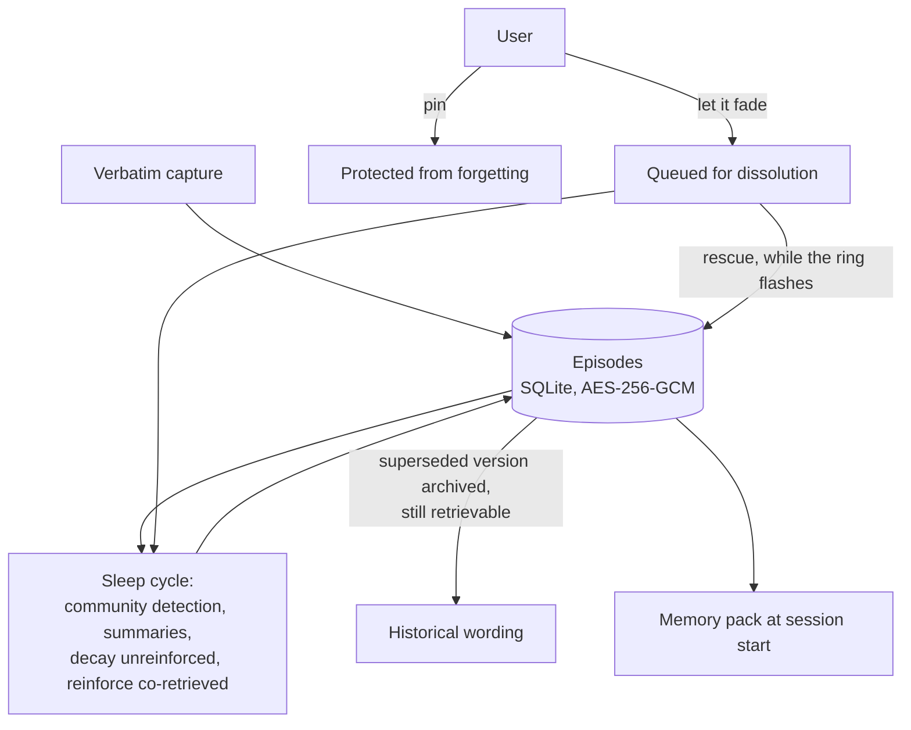

## 1. Executive Summary

iai-pme is an MIT-licensed personal memory engine — roughly 115,600 lines across
a Python core, a Rust `lillibrain` crate, a Tauri desktop app and an MCP wrapper,
with **702 test files against 264 source files**. It is local-only, encrypted at
rest with AES-256-GCM, sends no telemetry, and speaks MCP over stdio to fifteen
named clients.

**The benchmark section is the reason to read it, and it is the best of its kind
in this atlas.** The project ran LongMemEval-S head-to-head against
[MemPalace](../mempalace/) — another system reviewed here — *"in a single
harness on the identical 500 cleaned questions, session granularity,
`recall_any@k`, raw (no rerank)"*, and published a table with three rows: its own
product configuration at R@5 0.962, itself on the competitor's embedder at 0.966,
and MemPalace at 0.966.

Then it says what that means: *"it's an **exact tie** on the matched embedder …
Our product embedder scores 0.962 R@5, a 2-question-in-500 difference (noise).
**No win claimed** — an honest tie is the strong, defensible statement."*

Three things make that unusual rather than merely polite. The **matched-embedder
row is a control** — running its own system on the competitor's embedder isolates
the retrieval design from the embedding model, which is the variable most
published comparisons in this field quietly leave confounded. The comparison is
against a **named system a reader can check**, not an unnamed baseline. And the
project then names the limit of the benchmark it just used: *"LongMemEval is a
cold, one-shot retrieval test; it doesn't exercise cross-session memory, which is
where the design's real edge is."* Declaring a tie, controlling for the obvious
confounder, and criticising your own favourable instrument is a standard almost
nothing in this corpus meets.

**The second contribution is the forgetting interface.** Pin protects a memory
from ever being forgotten; *fade* queues one for the sleep cycle to dissolve; and
*rescue* cancels the fade *"while the ring is still flashing"* — an undo window on
forgetting, surfaced in the UI, rather than a confirmation dialog before it. The
README reports Rescue@10 at 1.000 and historical-wording retrieval at 1.000, so a
superseded fact's old version is archived **and still retrievable** rather than
overwritten.

## 2. Mental Model

Capture verbatim, consolidate at night, forget with an undo.

**Capture is verbatim by policy.** The stated memory style is *"verbatim over
paraphrase, precise cues, rare events kept rare"*, which is the opposite of the
extraction-first default and puts this system in the same family as the
verbatim-drawer designs already here.

**Consolidation happens in sleep cycles.** A periodic pass clusters episodes with
the project's own community-detection implementation, builds semantic summaries,
decays unreinforced connections and reinforces frequently co-retrieved paths.

**The nightly model call has a budget and a proof.** One step per night may make
a single call *"through your existing Claude subscription (`claude -p`) — no
separate API key, capped at ≤1% of your daily quota"*, and `iai-mcp doctor` has a
row that *"verifies there's no API-key SDK path installed at all"*. A cost claim
with a check that the expensive path is absent is a shape this atlas keeps asking
for and rarely finds.

**Forgetting is a queue with a cancel.**

The rescue edge is the mechanism: forgetting is a queued intention with a window,
not an immediate act.

## 3. Architecture

A Python package (`src/iai_mcp`) with a Rust crate (`crates/lillibrain`) for the
hot paths, a Tauri desktop app, an MCP wrapper in TypeScript, and `bench/` as a
first-class directory. Everything is local: SQLite, encryption at rest, no
network calls except the optional nightly `claude -p` invocation through the
user's own subscription.

The screen reported `pyproject.toml` changed inside the seven-day cooldown, plus
build-time execution in `setup.py`, the Tauri `build.rs` and three `conftest.py`
files. Nothing was installed, built or run.

The project is explicit about what it is not for: *"If you need multi-tenant
memory for an app you're shipping, use one of them — honestly. If you want* your
*assistant to remember* you*, that's this repo."* That sentence is why this
report withholds `scope_enforced` without treating the absence as a defect.

## 4. Essential Implementation Paths

- **Capture** — `src/iai_mcp/capture.py`, `capture_queue.py` (with an audit path
  for drops).
- **Consolidation** — `bedtime.py`, `community.py`, `centrality_approx.py`,
  `compress.py`.
- **Forgetting** — `tests/test_active_forgetting.py` is the fastest way in.
- **Native core** — `crates/lillibrain/src/store.rs`.
- **Benchmarks** — `bench/longmemeval_blind.py`, `bench/lme500/aggregate.py`,
  `bench/contradiction_longitudinal.py`, `bench/personal_fact_drift.py`,
  `bench/sleep_ablation.py`, with committed JSON for embedder latency and recall.
- **Install verification** — `iai-mcp doctor`.

## 5. Memory Data Model

Episodes captured verbatim, linked into a graph the sleep cycle operates on, with
superseded versions archived rather than replaced. There is no epistemic status
field: pinning is a *user's* protection, fading is a *user's* intention, and the
system does not record its own judgement about whether a memory is true.

That is coherent with the design's stated purpose — a personal assistant's memory
of one person, where the user is the authority — and it is the reason the
correction machinery this atlas usually looks for is absent by choice rather than
by oversight.

## 6. Retrieval Mechanics

Embedding recall over the episode graph, assembled into a memory pack at session
start. The README's cost claim — a pack costs *"≈88% less than the agent search
it displaces"* — is the kind of figure the atlas normally flags as unsupported,
and here `bench/tokens.py` is the named harness for it, with committed embedder
latency and recall JSON beside it.

The committed artifacts are worth their own sentence: `embedder_recall_compare.pytorch.json`
and `.rust.json`, `embedder_latency.pytorch.json` and `.rust.json`, an
`embedder_baseline/` with its texts and metadata, and `bench/lme500/env-snapshot.txt`.
A comparison between two implementations of the same embedder, committed as data
with the environment captured, is the reproducibility posture this atlas asks for
in its benchmarks page.

## 7. Write Mechanics

Capture is queued and the queue audits what it drops (`_audit_drop`), so a
capture that never became a memory leaves a trace — the recoverable-background-work
shape, applied to ingestion.

The sleep cycle is where the store changes shape: clustering, summarising,
decaying and reinforcing. It is unattended, and the user's controls over it are
pin and fade rather than review — a person cannot approve a summary before it
lands, only protect an episode from being dissolved.

## 8. Agent Integration

MCP over stdio, with fifteen clients named including Claude Code, Cursor, Codex
CLI, Zed, Goose, Aider and OpenClaw. A Tauri desktop app provides the brain view
the demo shows — search, pin, fade, rescue, teach it a file — and a `doctor`
command verifies the install, including the absence of an API-key path.

## 9. Reliability, Safety, and Trust

**The editing surface earns `human_review`.** Pin, fade, rescue and the brain
view are a person acting directly on the stored rows the agent reads, which is
the [memory as an editing surface](../../patterns/memory-as-an-editing-surface/)
pattern rather than an approval queue over a candidate list.

**Forgetting is reversible for a window and measured.** Rescue@10 at 1.000 says
every one of ten fading memories could be pulled back; historical wording at
1.000 says the superseded version was still there to retrieve.

**Encryption and locality are stated and checkable.** AES-256-GCM at rest, no
telemetry, and a doctor row asserting no API-key SDK path is installed — a claim
about what is *absent*, which is the harder kind to make and the easier kind to
verify.

**What is missing is any notion of the system being wrong.** No trust state, no
tombstone, no provenance beyond the episode itself. If an extraction — or the
user — puts a wrong fact in, the remedies are fade and re-teach. For a
single-user assistant that is a defensible line, and it means this design offers
nothing to a reader who needs a correction to hold against re-derivation.

## 10. Tests, Evals, and Benchmarks

**702 test files against 264 source files** is the highest ratio in this corpus,
and the names show what is defended: `test_active_forgetting.py`,
`test_bridge_no_spawn_path.py`, `test_capture_transcript_no_spawn.py`,
`test_cli_crypto_redact.py`, `test_continuous_audit_no_window_compaction.py`,
`test_profile_no_dead_knobs.py`. Several are absence assertions — no spawn path,
no window compaction, no dead configuration knobs, redaction holding — and they
earn `negative_eval` on the forgetting and redaction cases in particular.

The benchmark harness is itself tested: `test_bench_lme_blind_preflight.py` and
`test_bench_lme_blind_checkpoint.py` guard the LongMemEval runner. Testing the
instrument that produces your published numbers is rare enough that only a
handful of systems here do it.

Seven benchmark entry points are documented as runnable commands, covering raw
retrieval, longitudinal contradiction, fact drift, a sleep-consolidation
ablation, token cost, recall latency and memory footprint. No result of the
head-to-head is committed as a scored artifact — the JSON in `bench/` covers the
embedder comparisons — so the LongMemEval table is reproducible through the
committed harness rather than recomputable from committed output.

## 11. Patterns Worth Stealing

### Steal

**Publish the tie.** Run the comparison in one harness on identical data, add a
matched-configuration row so the reader can see which variable you controlled,
and say plainly when the result is noise. Then name what your favourable
benchmark does not measure.

**Give forgetting an undo window rather than a confirmation.** Fade queues,
rescue cancels, and the window is visible in the interface. A confirmation dialog
asks a person to be certain at the worst moment; a window lets them change their
mind after seeing the consequence.

**Cap the background model call against the user's own quota, and check that the
expensive path is absent.** One call per night through an existing subscription,
≤1% of quota, with a doctor row verifying no API-key SDK is installed.

**Test the benchmark harness.** A preflight and a checkpoint test around the
runner that produces your published numbers.

### Avoid

**Do not let pin and fade stand in for a trust model.** They record what a person
wants kept, not what the system believes; a wrong memory that nobody fades stays
exactly as authoritative as a right one.

**Do not read the 88% figure as measured until the harness output is committed.**
The command exists; the artifact does not.

### Fit

This is built for one person on one machine and says so, which makes the fit
question unusually easy to answer. If you want a coding assistant that remembers
you verbatim, locally, encrypted, with a visible brain you can pin and prune, it
is the most complete instance of that in the atlas and the tests suggest it is
maintained like a product.

It is the wrong reference for anything multi-user — the project agrees and points
elsewhere — and for anything where a correction must hold against an extractor
re-deriving the old value.

## 12. Antipatterns / Risks

- **No scope key of any kind**, which is a design decision here and a hard limit
  on reuse.
- **No trust or provenance state**, so wrong and stale are indistinguishable.
- **The head-to-head is reproducible but not recomputable** — the harness is
  committed, the run output is not.
- **The sleep cycle rewrites the store unattended**, and the user's controls are
  protection and dissolution rather than review.

## 13. Build-vs-Borrow Takeaways

Borrow the benchmark posture wholesale: one harness, a matched-configuration
control, a published tie, and a stated limitation of the instrument. Borrow the
fade-and-rescue window. Both are independent of the rest of the architecture and
both raise the standard of anything they are added to.

## 14. Open Questions

- Will a scored LongMemEval artifact be committed, so the table is recomputable
  rather than reproducible?
- What is the rescue window in wall-clock terms, and what happens to a fade whose
  ring stopped flashing while the machine was asleep?
- Does the sleep cycle's summarisation retain a pointer to the episodes it
  summarised, so a wrong summary can be traced back?

## 15. Appendix: File Index

| Path | Role |
| --- | --- |
| `src/iai_mcp/capture.py`, `capture_queue.py` | Verbatim capture and the drop audit |
| `src/iai_mcp/bedtime.py`, `community.py`, `compress.py` | Sleep cycle: clustering, summarising, decay |
| `crates/lillibrain/src/store.rs` | Native store |
| `bench/longmemeval_blind.py`, `bench/lme500/` | The head-to-head harness and its environment snapshot |
| `bench/embedder_recall_compare.*.json` | Committed PyTorch-versus-Rust embedder comparison |
| `tests/test_active_forgetting.py` | The forgetting assertions |
| `tests/test_bench_lme_blind_preflight.py` | A test of the benchmark harness itself |

## History

**2026-08-07** — [`f555013dfccfc2c3d17ea78c15e038f7c8abd6a6`](https://github.com/CodeAbra/iai-personal-memory-engine/commit/f555013dfccfc2c3d17ea78c15e038f7c8abd6a6) — first reading. Screened before reading: `pyproject.toml` changed inside the seven-day cooldown, plus build-time execution in `setup.py`, the Tauri `build.rs` and three `conftest.py` files; no auto-run surfaces. Nothing was installed, built or run, and the published LongMemEval figures were read from the README and the committed harness rather than reproduced — running them requires embedding a 500-question set locally.
