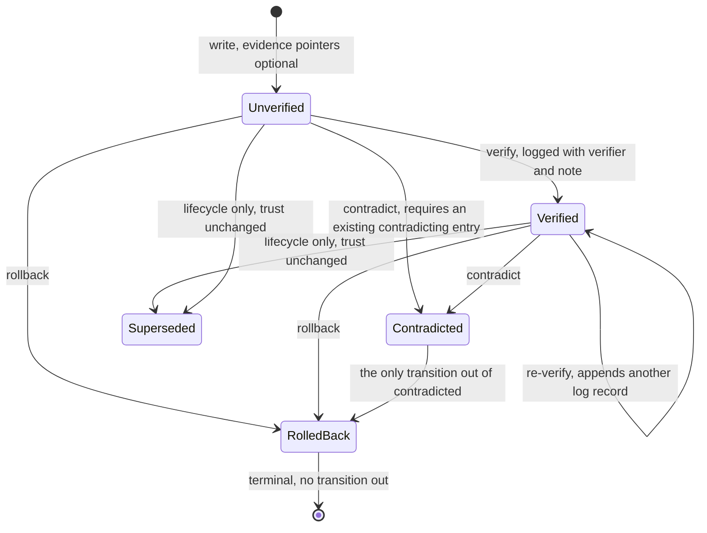

## 1. Executive Summary

Icarus is about 3,000 lines of Python — the smallest system in this batch by two
orders of magnitude — and it is here because of a design decision stated as a
comment in `schema.py`:

> Lifecycle is orthogonal to verified: verified is about provenance/trust,
> lifecycle is about freshness. A fact can be unverified-and-active or
> verified-and-superseded. They live in separate fields so callers can combine
> them without overloading either.

`verified` is `unverified | verified | contradicted | rolled_back`. `lifecycle`
is `active | superseded`. Most systems in this atlas collapse these into one
status column and then discover they cannot express "I trust this and it is out
of date". Icarus separates them at the schema and says why.

Three more things follow from taking the distinction seriously.

**The transitions are a table, and one state is terminal.**
`_LEGAL_TRANSITIONS` in `validation.py` allows `unverified → {verified,
contradicted, rolled_back}`, `verified → {verified, contradicted,
rolled_back}`, `contradicted → {rolled_back}` and `rolled_back → {}`. A
rolled-back entry cannot be rehabilitated. Every transition goes through
`_check_transition` before the write.

**Rollback taints descendants.** `plan_rollback` walks the `revises` chain back
to the last verified ancestor, and `_with_descendants` attaches every entry
derived from the intermediate chain as `tainted_descendants`. Reverting a bad
decision surfaces what was built on top of it rather than leaving the derived
claims standing.

**And the taint is tested from the read side.**
`tests/test_taint_safe_retrieval.py` seeds four populations — three verified,
three unverified, two contradicted, two rolled back through a real
revise-contradict-rollback sequence — and asserts
`found == set(verified + unverified)`. The contradicted and rolled-back entries
must not come back, the safe ones must, and `audit_search` must still return
everything. That is a negative retrieval case with its own positive control, in
a project small enough to read in an afternoon.

The weakness is one line. `verify(entry_id, *, verifier: str = "manual")` takes
the verifier as a free-text string with a default of `"manual"`, and the same
call is an MCP tool the agent can invoke. So the verification log records *that*
something was verified and cannot distinguish a person from the model that wrote
the entry.

## 2. Mental Model

An entry is a typed claim written by a named agent on a named platform, carrying
evidence pointers (`file`, `url`, `fabric_ref`, `tool_output`, `message`, each
with an optional excerpt and an optional SHA-256), and two independent state
fields.

The workflow is session-shaped rather than query-shaped. `start_session(agent,
task)` returns a briefing assembled from the shared wiki and the agent's own
archive — the README's example output is "Last week you tried adding an index on
orders.user_id; that didn't help." — and `end_session` archives what happened and
promotes findings.

The two lower arrows are the point. Superseding does not touch `verified`, and
verifying does not touch `lifecycle`; a verified-and-superseded entry is a
sentence the model can say.

## 3. Architecture

No database and no server. Entries are Markdown files with YAML frontmatter
under a root directory, written through `atomic_write_text`, and the project's
recommended shape is a git repository so the store is versioned and reviewable.

Three layers: a working memory per agent, a session archive, and a shared wiki
that findings are promoted into. Retrieval offers keyword, embedding and hybrid
modes, with embeddings optional.

The operational cost is close to zero — `pip install`, a directory, Python
3.10+. There is no worker, no queue and no index to rebuild; briefings are
computed on demand and cached as JSON.

## 4. Essential Implementation Paths

**Write** — `IcarusMemory.write` → Pydantic validation (`model_config =
ConfigDict(extra="forbid")` on every model, so an unknown key is an error rather
than silently dropped) → `validate_for_write` → `MarkdownStore.write`.

**Verify / contradict** — `__init__.py:340` and `:356`. Both call
`_check_transition` first and append a `VerificationRecord` to the entry's
`verification_log`. `contradict` refuses self-contradiction and refuses a
`contradicted_by` that does not resolve to an existing entry.

**Rollback** — `rollback.py`: `plan_rollback` computes the plan without touching
disk, detecting cycles in the `revises` chain and returning them as an error
rather than looping; `_find_descendants` (`lineage.py`) collects the taint;
applying the plan appends to the verification logs of everything it moves.

**Recall** — `retrieval.py`: a status filter of `safe` (the default), `all` or
`verified_only`, an `include_superseded` flag, and an optional `project_id`.

## 5. Memory Data Model

One Pydantic model does the work:

| Field | Role |
| --- | --- |
| `verified` | `unverified \| verified \| contradicted \| rolled_back` |
| `lifecycle` | `active \| superseded` — deliberately not the same axis |
| `verification_log` | Append-only list of `(verifier, timestamp, status, note)` |
| `evidence` | Typed pointers with an optional 500-character excerpt and a validated SHA-256 |
| `revises`, `supersedes`, `superseded_by`, `contradicted_by` | Four distinct relations, never conflated |
| `review_of` | A pointer for a review entry about another entry |
| `training_value` | `high \| normal \| low` — a hint about what this is worth learning from |
| `project_id`, `session_id`, `agent`, `platform` | Attribution and optional filters |
| `artifact_paths`, `source_tool` | What the claim touched and what produced it |

Four separate relation fields is unusual and it is the right call.
`revises` is lineage, `supersedes` is replacement, `contradicted_by` is refutation
and `superseded_by` is the back-pointer — systems that use one `parent_id` for
all four cannot answer "was this replaced or disproved", which is exactly the
question a briefing needs.

Validation is strict throughout: `id` must match `^icarus:[0-9a-f]{12}$`, a hash
must be lowercase hex of exactly 64 characters, `summary` is capped at 200
characters, timestamps are normalised to UTC with microseconds stripped, and
every model forbids extra keys.

## 6. Retrieval Mechanics

Keyword, embedding or hybrid, ranked, with three filters composed in
`_passes_filters`:

- `status_filter="safe"` (the default) excludes `contradicted` and
  `rolled_back`;
- `include_superseded` defaults to false, so stale-but-trusted entries are out
  of the normal path;
- `project_id`, when supplied, is compared against the entry's.

`audit_search` is a deliberate second door: "Raw audit search that includes
contradicted, rolled-back, and superseded entries." Separating the safe read
path from the audit read path — rather than adding a flag to one function that
somebody will eventually default wrong — is a small structural decision with a
large blast radius, and the test file asserts both behaviours side by side.

The briefing assembles what is current, what was recently superseded (a bounded
window, capped at ten) and what has failed before, so an agent starts with the
negative history rather than rediscovering it.

## 7. Write Mechanics

Writes are synchronous, local and cheap; an entry is retrievable as soon as the
file lands.

Nothing is ever overwritten. A revision is a new entry with `revises` set; a
replacement sets `supersedes` and `superseded_by`; a refutation sets
`contradicted_by` and moves `verified`. The old file stays on disk with its own
log.

The three guards worth copying are all refusals. `contradict` refuses when
`entry_id == contradicted_by` — self-contradiction is not a state the model
should be able to reach. It refuses when the contradicting entry does not exist,
so a refutation always points at something readable. And `plan_rollback` returns
an error rather than recursing when the `revises` chain contains a cycle.

## 8. Agent Integration

A Python library, a CLI, and an MCP server with ten tools: `memory_write`,
`memory_get`, `memory_recall`, `memory_search`, `memory_audit_search`,
`memory_verify`, `memory_contradict`, `memory_rollback`, `memory_lineage`,
`memory_pending`. The server installs an "unknown argument guard" that rejects a
tool call carrying a parameter the tool does not declare, rather than ignoring
it — a small hardening against a model inventing arguments.

Exposing `memory_audit_search` and `memory_lineage` as agent tools is a
deliberate choice: the agent can ask what was rolled back and why, not only what
is currently true.

## 9. Reliability, Safety, and Trust

**Trust state — awarded, and it is one of the cleanest in the atlas.** Four
values, an explicit legal-transition table, a terminal state, enforcement before
every write, and a separate freshness axis with the reasoning written down.

**Audit log — awarded, with the shape stated.** `verification_log` is a list on
the entry that only ever grows: three call sites append (`verify`, `contradict`,
`rollback`) and no code path truncates or rewrites it. It is per-record rather
than a store-level event table, which means a full history requires reading every
file — but each mutation to an entry's trust state is durably recorded with its
verifier, timestamp, resulting status and note.

**Negative eval — awarded**, for `test_taint_safe_retrieval.py` as described in
section 1. `test_three_layer_adversarial.py` and `test_rollback_cascade.py` cover
the same ground from other angles.

**Scope — withheld.** `project_id` is a real predicate in `_passes_filters` and
is optional, defaulting to `None` and matching everything. `agent` and
`session_id` are attribution fields. There is no default scope and no tenancy.

**Human review — withheld, and the near-miss is one parameter.**
`verify(entry_id, *, verifier: str = "manual")` looks like a human gate: the
default value is literally `"manual"`, and the `VerificationRecord` keeps who did
it. But `verifier` is an unvalidated free string, and `memory_verify` is an MCP
tool, so the agent that wrote an entry can verify it and record `"manual"` doing
so. The field is the right field; a validated actor identity would turn this into
a real review surface, and the change is small.

**Tombstone — no.** A rolled-back entry is terminal and excluded from safe
retrieval, which protects the agent. Nothing is keyed on the value, so
re-asserting the same claim as a fresh entry succeeds.

**Bitemporal — no.** One `timestamp` per entry, and no validity axis.

## 10. Tests, Evals, and Benchmarks

**No paper.** No arXiv reference, DOI or citation file.

23 test files against 17 source files — a ratio no other system in this batch
comes close to — and they are named after invariants rather than modules:
`test_state_machine`, `test_supersession`, `test_taint_safe_retrieval`,
`test_rollback_cascade`, `test_three_layer_adversarial`,
`test_three_layer_integration`, `test_input_validation`, `test_lineage`.

**I did not run them.** The screen flagged `tests/conftest.py` as executing on
collection and `pyproject.toml` as declaring unpinned dependencies; the tree was
read, not installed.

There is no benchmark, no committed evaluation result, and no retrieval-quality
claim anywhere in the repository — which, for a project whose entire argument is
about correctness of state rather than quality of ranking, is a consistent
position rather than a gap. The README says "PyPI release pending".

## 11. For Your Own Build

### Steal

- **Put trust and freshness in different fields, and write the comment.**
  "A fact can be unverified-and-active or verified-and-superseded" is the
  sentence that stops the next person collapsing them, and it costs one column.
- **Make the transition table explicit and make one state terminal.** Four
  states, a dict of legal moves, a check before every write, and `rolled_back`
  mapping to the empty set. Twenty lines that make an illegal history
  unrepresentable.
- **Taint the descendants when you roll something back.** The claims built on a
  bad decision are the ones that will bite; surfacing them as
  `tainted_descendants` is the difference between reverting a fact and reverting
  a belief.
- **Split the safe read path from the audit read path.** Two functions, not one
  function with a flag. Nobody can default the audit door open by accident, and
  the test file can assert both in adjacent cases.
- **Test the negative case with a positive control.** Seed all four statuses,
  assert exactly the safe set comes back. Without the control, an empty result
  passes.
- **Use four relation fields instead of one parent pointer.** `revises`,
  `supersedes`, `superseded_by` and `contradicted_by` answer different questions,
  and a briefing needs to tell "replaced" from "disproved".
- **Forbid extra keys everywhere.** `extra="forbid"` on every model turns a typo
  in a field name into an error instead of a silently dropped value — the same
  reasoning [ClawMem](../clawmem/) gives for its strict gold-file schema.
- **Refuse self-contradiction and dangling refutations.** Two `if` statements
  that keep the contradiction graph readable.

### Avoid

- **Do not let the verifier be a free string.** `verifier="manual"` as a default,
  reachable from a tool the agent calls, means the audit trail records a
  ceremony rather than a fact. Validate the actor or drop the word "manual".
- **Do not assume a terminal state protects the store.** `rolled_back` is
  terminal for that entry; the same claim written fresh is a new entry with no
  memory of the rollback.
- **Do not expect a per-record log to answer store-level questions.**
  "What changed last Tuesday" requires reading every file.

### Fit

This suits a small team that wants agent memory it can review in a pull request
and reason about formally, and that cares more about never acting on a
rolled-back decision than about retrieval quality. At 3,000 lines it is one of
the few systems in this atlas that a reader can adopt *and* fully understand, and
the state machine is worth lifting even by teams that will never run it.

It is not a retrieval engine. There is no ranking research here, no benchmark,
and no tenancy — a multi-tenant deployment would need the scope work done first.

## 12. Open Questions

- **Who is meant to call `verify`?** The default verifier string says "manual"
  and the MCP surface says "the agent". The design intent is not recoverable
  from the code.
- **What happens to a tainted descendant nobody addresses?** The rollback plan
  lists them; whether applying the plan changes their state or only reports them
  was not traced end to end.
- **How does the briefing behave when the archive is large?** The recent
  superseded window is capped at ten entries and the working set is scanned per
  briefing, with a JSON cache in front — the point where that stops being cheap
  is not established.
- **Is there a story for two agents writing the same entry id?** Ids are
  12 hex characters and the store is files; concurrent writes are handled
  atomically per file, and collision behaviour was not traced.

## Appendix: File Index

**The two axes and the schema** — `src/icarus_memory/schema.py`
(`VerifiedStatus` at `:12`, the orthogonality comment `:13-16`, `Lifecycle`
`:17`, `VerificationRecord` `:47`, `Entry` `:57`, `RollbackPlan` `:93`)

**The transition table** — `src/icarus_memory/validation.py:22`
(`_LEGAL_TRANSITIONS`), `_check_transition`, `tests/test_state_machine.py`

**Verification and contradiction** — `src/icarus_memory/__init__.py:340`
(`verify`), `:356` (`contradict`), `tests/test_supersession.py`

**Rollback and taint** — `src/icarus_memory/rollback.py`
(`plan_rollback`, `_with_descendants`, cycle detection),
`src/icarus_memory/lineage.py` (`_find_descendants`),
`tests/test_rollback_cascade.py`, `tests/test_lineage.py`

**The negative retrieval case** — `tests/test_taint_safe_retrieval.py`
(`_seed_statuses`, `test_search_defaults_to_safe_statuses`,
`test_audit_search_returns_everything`)

**Retrieval** — `src/icarus_memory/retrieval.py` (`_passes_filters` at `:38`,
`audit_search` `:108`, `recall` `:142`), `src/icarus_memory/_embeddings.py`

**Layers and storage** — `src/icarus_memory/_layers.py` (`atomic_write_text`,
`SAFE_ID_RE`), `store.py`, `wiki.py`, `working_memory.py`,
`session_archive.py`, `hashing.py`

**Briefing** — `src/icarus_memory/briefing.py` (`_recent_superseded` at `:154`)

**Integration** — `src/icarus_memory/mcp_server.py` (ten tools, the unknown
argument guard at `:24`), `src/icarus_memory/cli.py`

## History

**2026-08-09** — [`6e348708dcddb7cf1ad47726cb287cd4c9183c40`](https://github.com/esaradev/icarus-memory-infra/commit/6e348708dcddb7cf1ad47726cb287cd4c9183c40) — first reading. Screened before reading: no auto-run surface, build-time execution in `tests/conftest.py`, one unpinned dependency surface in `pyproject.toml`. The tree was read, never installed, and no test was run.
