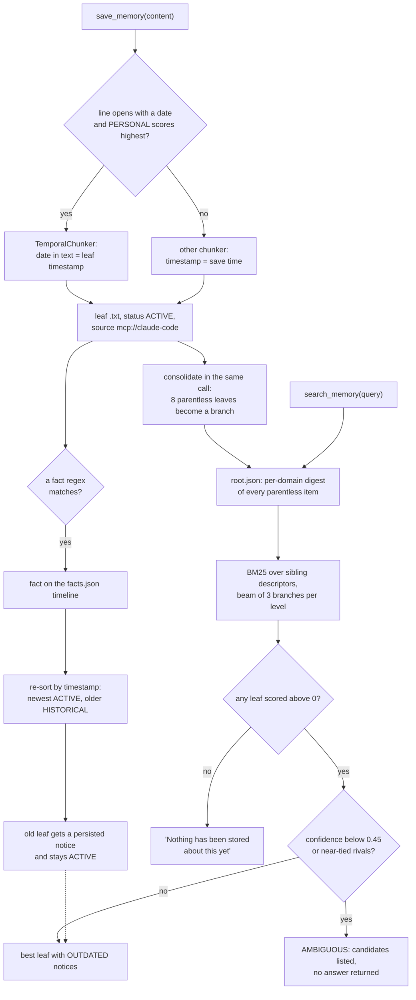

## 1. Executive Summary

IHMT ("Infinite Hierarchical Memory Tree") is a long-term memory for coding
agents served as a stdio MCP server over a directory of plain files. The agent
calls `save_memory` with text and `search_memory` with words. Text becomes leaf
files, consolidation groups leaves into summary branches, and a search walks
from `root.json` down the branches with BM25.

What is notable is the restraint. The core is the Python standard library, every
leaf describes itself so the index can be rebuilt from the files, and a search
whose top matches are near-tied returns `AMBIGUOUS` and asks for a clue instead
of picking one. Corrections are dated: a regex extractor turns sentences such as
*"I moved to Valencia"* into facts on a per-attribute timeline, and the older
value's source text is served with an `OUTDATED` notice.

What is weak is that the correction stops at the notice. Leaf ranking ignores
the timeline, so the project's own roadmap records that *"where do I live?"*
returns `AMBIGUOUS` between the old and new address (`GUIDE.md:1404-1405`).
The beam descent can miss a stored leaf and report that nothing is stored. The
README invites several agents to share one store while its design notes assume
one writer.

The memory is the leaf store and the fact timeline under
`$IHMT_HOME/ihmt_memory`. The per-project code index (`project_map`,
`find_code`), the `read_file` diff cache and the session scratch store (`note`,
`recall`, `digest_output`) sit on the same engine. They are caches of files or
of one session, and this report covers them only where they share code with
the memory.

No marks. Section 9 names the seven withheld and the near-miss behind each.

## 2. Mental Model

A memory is a chunk of text the agent chose to save. It becomes a belief the
moment `save_memory` returns: there is no candidate state, no model call on the
default path, and no review. It is never deleted through the agent's tools.

**A date in the text is the memory's time, when the right chunker sees it.** A
line opening with an ISO or numeric date adds 3.0 to the detector's `PERSONAL`
score (`ihmt/detectors.py:106`, `:177`), `PERSONAL` and `CLINICAL` route to the
`TemporalChunker` (`ihmt/chunkers/__init__.py:48-51`), and its extracted date
becomes the leaf's `timestamp` (`ihmt/universal_ingestor.py:284`). Undated text
goes to another chunker and is stamped with the save time. The usage template
tells the agent to start a dated memory with its date for this reason
(`templates/memory-instructions.md`).

**Facts are a second layer, and only six attributes have one.** Thirteen regexes
lift `location`, `employer`, `stack`, `diagnosis`, `treatment` and `medication`
values out of English and Spanish sentences (`ihmt/conflict_resolver.py:55-69`).
Each `(subject, attribute)` timeline is re-sorted on every new fact: the newest
timestamp is `ACTIVE`, each older one `HISTORICAL` with `superseded_by` and a
`valid_to` equal to its successor's timestamp (`:210-237`). A changed value
writes a persisted notice into the old fact's source leaf, and that leaf stays
`ACTIVE` (`:239-264`). Anything outside the six attributes has no timeline, so
two contradictory memories about it are both current.

**A memory stops being current only in a narrow case.** Leaf `status` becomes
`HISTORICAL` when the CLI re-ingests a file whose content changed
(`universal_ingestor.py:198-233`, `:332-347`), and the navigator then skips it
(`ihmt/semantic_navigator.py:554-555`). `save_memory` never sets that flag, so
on the agent's path a corrected memory keeps ranking beside its correction and
is distinguished only by the notice.

## 3. Architecture

Everything lives under one directory, `$IHMT_HOME/ihmt_memory`, which defaults
to the checkout's own folder when `IHMT_HOME` is unset (`mcp_server.py:76-80`).
Leaves are `layer_0/<domain>/<leaf_id>.txt`, a JSON header between
`<<<IHMT-META` and `IHMT-META>>>` followed by the raw text
(`ihmt/models.py:102-180`). Branches are `layers/<n>/<node_id>.json`, each
embedding its children's title, excerpt, keywords and tags so a level can be
ranked without opening the children (`models.py:239-285`). `root.json` holds a
digest per domain. `state/catalog.json` maps ids to paths, parents and status;
`state/facts.json` holds the timeline.

`MemoryStore` is the only module that touches disk. Every write goes through
`write_atomic`, a temporary file, `fsync` and `os.replace`
(`ihmt/storage.py:249-261`). The catalog is an index that `rebuild_catalog`
recreates by scanning the files under a cooperative lock (`:527-568`), and
`rebuild` re-extracts every fact from the leaves (`conflict_resolver.py:360-372`).

The MCP server is one process per agent session over stdio. It caches one
facade and drops the cached catalog and timeline at the start of each call so
another writer's changes are seen (`mcp_server.py:118-136`). The session store
is a `TemporaryDirectory` removed at exit (`:152-159`).

Consolidation runs inside every ingest. The default `HeuristicSummarizer` is
extractive and offline. `summarizer_backend = "anthropic"` sends child titles
and excerpts to the Anthropic API and falls back to the heuristic on any failure
(`ihmt/summarizers.py:153-160`, `:202-240`, `:255-264`).

### Deployment and ergonomics

Nothing has to run besides the MCP server; the core needs Python 3.10 and no
packages, and the server needs `mcp[cli]>=2.0` (`requirements-mcp.txt`). No API
key is needed. The store is readable and editable with a text editor, and
`main.py rebuild` restores the catalog, timeline and trunk after a hand edit.
`INSTALL.md` is written for an agent to follow, including registering the server
with the agent's own CLI. A loopback GUI (`gui.py`) browses the tree, runs
diagnostic searches and shows the timeline; its only writes are store creation
and agent registration (`ihmt_gui/handlers.py:398-410`).

## 4. Essential Implementation Paths

**Save.** `save_memory` (`mcp_server.py:276-344`) normalises `domain` and
`content_type`, snapshots the current contradictions, and calls `ingest_text`
with `source="mcp://claude-code"` and the tag `source:claude-code` whichever
agent is calling (`:310-316`). It then reports any contradiction that was not
there before (`:335-343`).

**Ingest.** `UniversalIngestor.ingest_text` (`universal_ingestor.py:129-196`)
detects type and domain, chunks without cutting a logical block, builds each
leaf, saves it inside `store.batch()`, and calls `extract_from_leaf` per leaf.
Leaf ids hash source, position and content (`:326-330`), so identical text saved
twice rewrites one leaf. `_save_preserving_parent` keeps the earlier parent
link and status (`:349-368`) and does not keep `ingested_at`, which
`_build_leaf` sets to the save time (`:314`). After the batch, `consolidate()`
runs (`:193-194`).

**Consolidate.** `RecursiveSummarizer.consolidate` (`recursive_summarizer.py:93-115`)
groups parentless entries per domain in timestamp order, writes a branch for
every full group of `branch_factor` (8), and only then stamps the children's
`parent_id` (`:138-167`). `rebuild_root` then summarises every parentless item
of every domain into `root.json` (`:239-289`).

**Search.** `search_memory` → `_search` (`mcp_server.py:235-246`) →
`SemanticNavigator.search` (`semantic_navigator.py:287-398`). Domains are ranked
first and, if none scores above zero, all stay in play (`:469-509`). Each level
ranks the frontier, pools admissible leaves with a positive score, and expands
the top `beam_width` branches (`:338-381`). `_admissible` checks catalog status
and the project-index filters (`:546-561`). `_materialize` loads the leaf and
attaches `notices_for_leaf` (`:590-622`).

**Disambiguate.** `_confidence` is `0.6 × coverage + 0.4 × margin`
(`:637-653`). `_maybe_clue_request` fires on confidence below 0.45, on near-tied
rivals in different branches, or on near-tied rivals under a query of one or two
terms (`:655-705`). The MCP reply then lists candidates and returns no memory
(`mcp_server.py:217-232`).

**Timeline.** `record_fact` (`conflict_resolver.py:136-181`), `_resolve_key`
(`:210-237`), `_flag_leaf` (`:239-264`), `notices_for_leaf` (`:332-348`).
`state_at` answers "what was true on a date" (`:283-303`); its callers are the
CLI demo (`main.py:339`) and the tests.

## 5. Memory Data Model

| Field | Where | Notes |
| --- | --- | --- |
| `leaf_id` | leaf header | `L-<domain>-<index>-<hash>`, the hash over source, index and content |
| `timestamp` | leaf header | date found by the temporal chunker, file mtime for a CLI file, else save time |
| `ingested_at` | leaf header | save time; overwritten when identical text is saved again; read only by the GUI |
| `domain`, `data_type` | leaf header | detector output or caller override; `domain` is also the directory |
| `source`, `tags` | leaf header | `mcp://claude-code` and `source:claude-code` for every MCP save |
| `status`, `superseded_by` | leaf header and catalog | `ACTIVE` or `HISTORICAL`; set `HISTORICAL` only by CLI file re-ingest |
| `extra.superseded_facts` | leaf header | notices written when a fact this leaf sourced is superseded |
| fact `value`, `timestamp`, `valid_from`, `valid_to`, `status` | `facts.json` | recomputed from timestamps on each new fact |

The fact's `timestamp` is the source leaf's, so it is the date in the text when
there is one. `valid_to` is the successor's timestamp, not the time the
supersession was recorded, and no fact carries a record time of its own.

**Scope is the directory.** A leaf has no user, project or agent key
(`models.py:102-130`). Every agent whose server points at the same `IHMT_HOME`
reads and writes one store, which is what the README advertises
(`README.md:12-13`); a separate `IHMT_HOME` is a separate memory.

**There is no delete on the agent's path.** `delete_leaf` exists for the
derived project indexes and its docstring says long-term memories are never
deleted (`storage.py:472-485`). A person can remove a file and run `rebuild`.
`initialize(force=True)` keeps leaves and empties the timeline, which `rebuild`
re-extracts from the leaves (`storage.py:185-211`); a fact recorded through the
Python `record_fact` with no source leaf does not come back.

## 6. Retrieval Mechanics

Retrieval is lexical: accent-folded, CamelCase-split terms scored by BM25 with
field weights (title and keywords 3, tags 2, excerpt 1) and document
frequencies computed over the siblings at each level (`semantic_navigator.py:193-262`).
There is no query rewriting and no embedding.

**The beam bounds cost and also bounds recall.** Only the top three branches per
level are opened, chosen on their embedded descriptors: a title, a 320-character
excerpt, ten keywords and eight tags per child (`recursive_summarizer.py:193-225`).
A leaf whose words are not in its ancestors' descriptors sits under a branch
that loses at some level and is never scored. The descent then ends with no
leaf, and the agent is told *"Nothing has been stored about this yet — consider
save_memory"* (`mcp_server.py:242-243`, `:269-270`). An under-recall therefore
reads as an absence and invites a duplicate save. This is read from the code,
not reproduced; the GUIDE's troubleshooting answer is to search with the words
used when saving (`GUIDE.md:1362-1364`).

**Corrections attach to results but do not rank them.** `notices_for_leaf`
returns the leaf's persisted notices plus a live check of each `HISTORICAL` fact
it sourced (`conflict_resolver.py:332-348`). Nothing in `_rank` or
`_adjust_for_code` reads the fact timeline, so the old and new statements score
on their words alone. A query of one or two terms with near-tied matches then
triggers the clue request, and the agent gets candidates rather than the current
value. Persisted notices are never retracted, so a value that later reverts still
carries the earlier "updated to" text.

**Output is bounded.** The compact form returns the best leaf's full text up to
6,000 characters and one line for each of two rivals (`mcp_server.py:83-87`,
`:194-214`). Nothing is injected without a tool call.

## 7. Write Mechanics

Writes are explicit tool calls. Chunking keeps logical blocks whole and flags an
oversized one rather than cutting it. Facts come only from the thirteen regexes;
the extracted value is the up-to-80-character run after the trigger phrase
(`conflict_resolver.py:51`), so *"I live in Valencia now"* stores `Valencia now`,
which the GUIDE states (`GUIDE.md:1387-1389`). A fact repeated at a later date
is a confirmation, not a contradiction (`:306-330`).

Ordering is by the date in the text, not by arrival. A dated save older than the
current value is filed as history at once. An undated wrong value saved today
outranks a correction whose text carries an earlier date, so the correction is
demoted on arrival. This follows from `_resolve_key` and was not run.

Agent-written content is treated like a person's. The template asks the agent
not to store secrets (`templates/memory-instructions.md`); nothing in the code
checks.

**Concurrency.** `catalog.json` and `facts.json` are each rewritten whole on
every change (`storage.py:438-446`; `conflict_resolver.py:116-122`), and the
only lock is taken by `rebuild_catalog` (`storage.py:533`). Two agents sharing
one `IHMT_HOME` run two server processes, and the README and GUIDE both say the
store assumes one writer (`README.md:521-522`; `GUIDE.md:1313-1314`, `:1390`).
Two overlapping saves can therefore lose one catalog or timeline entry while its
leaf file stays on disk. That is an inference from the code; `rebuild` would
restore the catalog and re-extract the facts.

### Operational cost

- Write: synchronous. One `save_memory` chunks, extracts, consolidates and
  rewrites `root.json` before returning; on the default backend no model is
  called.
- With the Anthropic backend, `rebuild_root` summarises every domain on every
  save (`recursive_summarizer.py:112`, `:264-269`), so each save makes one model
  call per domain plus one per new branch.
- Lag: none. A saved leaf is reachable from the trunk as soon as the call
  returns, because `rebuild_root` lists every parentless item (`:251-264`).
- Read: a search opens `root.json`, at most three branches per level and the
  returned leaves. Nothing is injected per turn, so a provider's prefix cache is
  untouched.

## 8. Agent Integration

The server registers eight tools (`mcp_server.py:250-545`) and an
`instructions` string that tells the model to search before answering, never
guess on `AMBIGUOUS`, and always relay `OUTDATED` (`:89-102`). The agent-run
installer appends `templates/memory-instructions.md` to `~/.claude/CLAUDE.md`,
`~/.codex/AGENTS.md` or opencode's `AGENTS.md` (`INSTALL.md:369-376`). There is no SessionStart,
PreCompact or prompt hook, so every recall depends on the model deciding to
call `search_memory`.

The agent holds save and search and nothing that edits or removes. Codex needs
`default_tools_approval_mode = "approve"` to call the tools at all
(`README.md:102-104`). Adapting it to another MCP client is a registration
line; `INSTALL.md` carries untested ones for six more clients.

## 9. Reliability, Safety, and Trust

**Recoverability is the strongest property.** Every leaf is self-describing,
writes are atomic, a branch is durable before its children point at it, and the
catalog, trunk and timeline can all be rebuilt from the leaf files.

**Provenance is one label.** Every MCP save is `mcp://claude-code`, so in a
store shared by Claude Code, Codex and opencode nothing records which agent or
session wrote a memory.

**Prompt-injected memories are stored like any other.** Text the agent saves
from a tool result becomes a leaf and, if it matches a regex, a fact that can
supersede the user's own statement by carrying a later date.

**Privacy.** Nothing leaves the machine on the default backend. The memory
reaches the model as tool output.

Capability marks:

- `tombstone` — withheld. No verb removes or rejects a value, and re-saving an
  old value with a newer date makes it `ACTIVE` again (`conflict_resolver.py:210-237`).
- `trust_state` — withheld. Fact `ACTIVE`/`HISTORICAL` is recomputed from
  timestamps, a lifecycle order and not an epistemic status. Leaf `HISTORICAL` is
  filtered on read (`semantic_navigator.py:554-555`) but marks a superseded file
  version and is produced only by CLI re-ingest.
- `bitemporal` — withheld. Facts carry a validity interval that starts at the
  date in the text and ends at the successor's date, and no record time. The
  record clock `ingested_at` sits on the leaf, is overwritten by a repeat save,
  and is read only by the GUI.
- `scope_enforced` — withheld. The boundary is the `IHMT_HOME` directory, a
  physical partition with no key on a leaf. The `scope` and `path_prefix`
  filters are caller-supplied predicates on a project index's source paths, and
  domain pruning widens to every domain on a zero score
  (`semantic_navigator.py:505`).
- `audit_log` — withheld. `facts.json` and the catalog are rewritten whole, and
  `SummarizationEvent` records are returned to the caller and not stored
  (`recursive_summarizer.py:33-53`).
- `human_review` — withheld. Saves land live, and the GUI only displays memory.
- `negative_eval` — withheld; the near-misses are in section 10.

## 10. Tests, Evals, and Benchmarks

Nothing was installed, built or run for this report; everything below is from
reading the tests at the pin. The tree has no CI configuration.

The suite is 191 `unittest` functions in ten modules. It pins byte-exact
reconstruction of chunked code, block atomicity, header round-trips, catalog
recovery, consolidation idempotence, reachability of every leaf from the root,
node reads bounded by beam times depth (`tests/test_navigator.py:49-53`), the
clue loop, and the timeline. `tests/test_mcp_server.py` holds 25 cases behind
`skipUnless(HAS_MCP, ...)` (`:29`, `:159`, `:284`), so a run without the SDK
reports them as skipped.

**Four negative cases, none of which earns `negative_eval`:**

- `test_notes_are_recalled_and_stay_out_of_long_term_memory`
  (`tests/test_mcp_server.py:260-266`) has the right shape: a note recalled
  through `recall`, then `search_memory` with the same words must return
  `No memory found`. The long-term store holds nothing else, so a search that
  never finds anything also passes.
- `test_an_unrelated_query_reports_nothing_rather_than_guessing` (`:122-127`)
  stores one memory and asserts an unrelated query does not return it, with no
  positive control in the case.
- `test_reingesting_a_changed_file_demotes_its_previous_version`
  (`tests/test_project_index.py:243-255`) asserts that no superseded leaf id
  appears by looping over `response.results`, and passes on an empty result.
  One `assertTrue` that a new-version leaf is returned would make it the mark's
  case.
- `test_a_query_matching_nothing_returns_nothing` (`tests/test_navigator.py:65-74`)
  asserts an empty result for nonsense terms, which guards over-recall rather
  than excluding particular material.

`test_retrieving_outdated_material_surfaces_the_correction`
(`tests/test_conflicts.py:109-114`) asserts the notice arrives with old
material. No test asks for a current value and checks which leaf ranks first,
which is the case the roadmap records as failing.

**Benchmarks are prose.** `GUIDE.md` §11 reports token savings on generated
corpora up to 5,000 notes, query latency, and a 22-session A/B run in which
forcing the project tools made sessions 42–71% more expensive
(`GUIDE.md:1201-1262`). No corpus generator, harness or result file is
committed. No paper or citation is in the tree.

## 11. For Your Own Build

### Steal

- **Make every record self-describing and the index disposable.** A JSON header
  in each leaf file lets the catalog, trunk and timeline be rebuilt from a
  directory listing after a crash or a hand edit.
- **Write the parent before the children point at it.** An interrupted
  consolidation re-processes a group instead of orphaning it.
- **Refuse to answer on a tie.** A confidence built from coverage and margin,
  plus a tie test for one- and two-word queries, turns *"which Luis?"* into a
  question instead of a fabrication.
- **Date facts by the text, not by arrival.** A backfilled memory then lands in
  history where it belongs.
- **Carry the correction with the stale text.** A notice on the old leaf means a
  retrieval of it cannot silently read as current.

### Avoid

- **A timeline the ranker cannot see.** Supersession that only annotates leaves
  ties the old and new values on the next query; feed the fact status into
  scoring or demote the source leaf.
- **Reporting an unexplored branch as an empty store.** A pruned descent should
  say what it did not search, or fall back to a scan, before telling the agent
  to save again.
- **One hard-coded provenance label for every client.** Sharing a store across
  agents is the feature; record which agent wrote what.
- **Advertising shared writes on a single-writer store.** Lock the
  read-modify-write of every whole-file index, or say per client that only one
  may write.

### Fit

This suits one developer who wants memory they can read, copy and fix by hand,
saved deliberately and searched with the words they used, at a few hundred to a
few thousand entries. The engineering around the files is careful and small
enough to audit in an afternoon. It does not suit anyone who needs memories
found by meaning, corrections that change the answer rather than annotate it,
several agents writing at once, or attribution of who wrote what.

## 12. Open Questions

- How often does the beam miss a stored leaf at a few thousand entries? No
  committed test or result measures recall against a known answer set.
- Does the MCP SDK run synchronous tools concurrently within one server
  process? If so, the lost-update window exists inside a single agent too.
- Will the roadmap's "prefer the current version of a fact" demote source
  leaves, or rank on fact status?
- What did the 22 A/B sessions measure as quality, and can they be re-run?

## Appendix: File Index

- **Storage/schema:** `ihmt/models.py`, `ihmt/storage.py`, `ihmt/config.py`.
- **Write path:** `mcp_server.py:276-344`, `ihmt/universal_ingestor.py`,
  `ihmt/detectors.py`, `ihmt/chunkers/`.
- **Timeline:** `ihmt/conflict_resolver.py`.
- **Consolidation:** `ihmt/recursive_summarizer.py`, `ihmt/summarizers.py`.
- **Retrieval:** `ihmt/semantic_navigator.py`, `mcp_server.py:163-273`.
- **Integration:** `mcp_server.py`, `templates/memory-instructions.md`,
  `INSTALL.md`, `main.py`, `ihmt_gui/`.
- **Tests:** `tests/test_mcp_server.py`, `tests/test_navigator.py`,
  `tests/test_conflicts.py`, `tests/test_project_index.py`, `tests/test_tree.py`,
  `tests/test_storage.py`.

### Recorded searches

Checked against the checkout at the pinned revision.

- `grep -rniE 'renamed|formerly|arxiv|bibtex|@article|@misc|doi\.org|zenodo|citation' --exclude-dir=.git .` — two matches: `GUIDE.md:1239` (a task description) and `mcp_server.py:48` (the MCP SDK's rename); no paper, and no `CITATION.cff`.
- `rg -n -i 'sessionstart|hook|PreCompact|UserPromptSubmit' .` — no match; no injection hook.
- `rg -n 'replace_previous' -g '*.py' -g '!tests/**' .` — default `False` on `ingest_text`, `True` on `ingest_file`; `save_memory` passes neither, so only file ingest demotes leaves.
- `rg -n 'state_at|active_state|ingested_at|record_fact\(' -g '*.py' -g '*.js' .` — `ingested_at` is read only in `ihmt_gui/handlers.py:230`; `state_at` is called from `main.py:339` and tests.
- `rg -n '_FileLock|lock' -g '*.py' .` — the lock class and its one use in `rebuild_catalog`.
- `rg -n 'delete_leaf|unlink\(|rmtree' -g '*.py' -g '!tests/**' .` — `delete_leaf` is called only from `ihmt/project_index.py:246`.
- `rg -n -i 'audit|\.jsonl|append-only' -g '*.py' -g '!tests/**' .` — no match.
- `rg -n -i 'user_id|project_id|tenant|agent_id|namespace' -g '*.py' -g '!tests/**' .` — only code-chunker keywords and `argparse.Namespace`; no scope key.
- `git ls-files | grep -iE 'bench|eval|corpus|experiment'` — no match; `git ls-files .github` — empty.
- `rg -n 'assertNotIn|assertFalse|assertIsNone|No memory found|assertEqual\(\[\]|skipUnless' tests/` — the negative cases listed in section 10 and the three skip guards.

## History

**2026-10-03** — [`ba0c45579c3a59a24ec6b0aea1185eee072b6825`](https://github.com/gonzaroman/IHMT-MEMORY/commit/ba0c45579c3a59a24ec6b0aea1185eee072b6825) — first reading, at the head of `main`, a commit dated 30 September 2026. No marks. Screened before reading: 4 files scanned, no auto-run surface, 1 build-time execution point (`ihmt_gui/setup.py`, a GUI module named like a setuptools script), and `requirements-mcp.txt` both inside the cooldown and unpinned (`mcp[cli]>=2.0`), the repository having been created on 30 September 2026; `CLAUDE.md` was treated as data. Read from a full clone with `grep` and `sed`; nothing installed, built or run.
