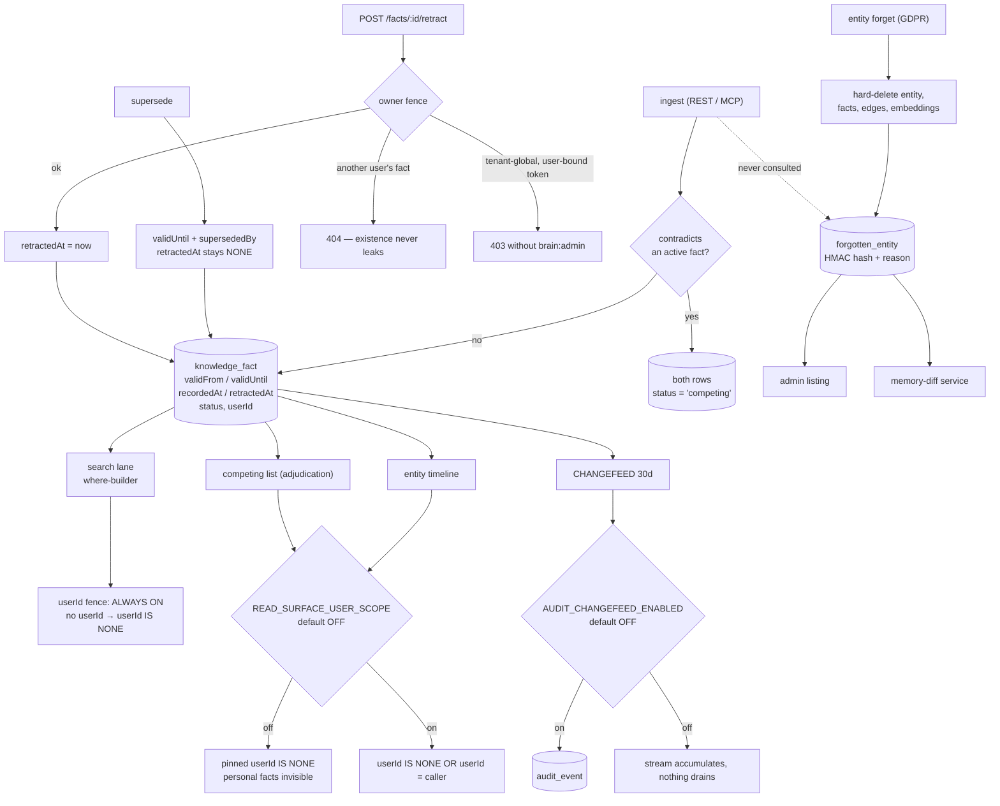

## 1. Executive Summary

INITE Brain is an agent memory service: a NestJS application over SurrealDB,
published under AGPL-3.0-or-later at version 2.2.0, with 1,129 commits since
5 May 2026 across 154,197 lines of TypeScript in `src/` against 156,194 lines
in 747 test files. Its own description calls it an "[o]pen-source bitemporal
knowledge graph — long-term memory for AI agents", and the bitemporal claim is
the one that holds up best under reading.

A memory is a `knowledge_fact`: a subject entity, a predicate and an object
value, carrying two independent pairs of timestamps. `validFrom` and
`validUntil` say when the claim was true in the world. `recordedAt` and
`retractedAt` say when this system believed it. The distinction is not
decoration — a committed test asserts that an `asOf` read gates validity and
retraction and deliberately does **not** bound `recordedAt`, because bounding
knowledge time there "made a BACKDATED fact appear in search and vanish from
the profile for the very same asOf".

Each fact also carries a `status` from a fixed set of six, and every read path
names the subset it excludes. That is a stored discrete state filtering the
read path rather than a computed one, and it earns `trust_state` alongside
`bitemporal`.

The scope story is where the system divides against itself. On the search
lane, the per-user fence is unconditional and fail-closed: no `userId` on the
request narrows to tenant-global memory, one widens to global plus that user's
own rows, and a caller can widen by argument but cannot omit the clause. On
the entity timeline, the competing-pair list and entity reads, the same fence
sits behind `READ_SURFACE_USER_SCOPE`, which is off unless an operator sets it
to `1` or `true`. The consequence is written into the code's own comments:
with the flag off, "a personal fact never produced a timeline event" and "a
user-scoped COMPETING pair was invisible to adjudication". This is not a leak
— the default is the narrower fence — but it means the system's contradiction
machinery does not see per-user memory in the configuration it ships with.

Two other mechanisms look stronger in the README than in the tree. The GDPR
forget path writes an HMAC-hashed `forgotten_entity` row, and the MCP tool
description calls it a "tombstone"; its only readers are an admin listing and
the memory-diff service, and no ingest or entity-create path consults it, so
it proves an erasure happened and does nothing to stop the same entity being
recreated by the next ingest. And the data-change audit mirror — a SurrealDB
`CHANGEFEED` declared in migration 0002, unread until migration 0023 added a
consumer — is gated by `AUDIT_CHANGEFEED_ENABLED`, which is default off.

Four marks: `bitemporal`, `trust_state`, `scope_enforced` and `negative_eval`.

## 2. Mental Model

A **tenant** is a SurrealDB database named `co_<companyId>`. Nothing crosses
that boundary; every service call opens a connection pinned to one company.

A **fact** is one claim with four timestamps:

- `validFrom` / `validUntil` — the world's clock. When was this true?
- `recordedAt` / `retractedAt` — the system's clock. When did we believe it?

A **status** is the fact's standing, one of `active`, `competing`,
`retracted`, `superseded`, `compacted` or `corroborating`. A supersede sets
`validUntil` and `supersededBy` and pointedly leaves `retractedAt` unset,
because a superseded fact whose interval still covers the present *is* the
current value while its successor is future-dated.

A **scope** is a `userId` stamped on a fact or edge. Absent means tenant-global.

A **fence** is a clause the read path appends. The codebase writes them as
named, commented blocks and marks the fail-closed ones in the comment itself.

## 3. Architecture

| Area | Role |
| --- | --- |
| `src/db` | `schema.surql` plus 146 ordered migrations, the authoritative schema; each migration's header names the failure it fixes |
| `src/facts`, `src/entities` | The memory core: ingest, retract, the entity profile closure, the timeline, competing adjudication, provenance closure |
| `src/search` | The hybrid retrieval lane — `internals/where-builder.ts` composes the fences, `internals/edge-fence.ts` guards graph expansion |
| `src/audit` | The changefeed consumer, its leader lease, the per-tenant drain and PII redaction |
| `src/admin` | Admin controllers behind `brain:admin`, the operator-action interceptor and store, the config catalog and health components |
| `src/mcp` | The native MCP server: read tools and write tools, including the forget tool |
| `src/policy`, `src/keys`, `src/auth` | ABAC policies, API keys and scopes, the row policy filter |
| `src/dreams`, `src/compaction`, `src/jobs` | Background consolidation, compaction and the scheduler |
| `test` | 747 files, `*.unit-spec.ts` and `*.e2e-spec.ts`, run against a real database for the e2e set |

### Deployment shape

Docker Compose for the service and SurrealDB; per-tenant databases created on
demand; a leader lease so multi-pod deploys do not double-drain the changefeed.
Configuration is catalogued in `src/admin/config-catalog.data.ts`, and
`src/common/env-validation.ts` splits flags into two idioms that matter when
reading defaults: `envFlagEnabled` is opt-in (only `1` or `true` turn it on)
and `envFlagNotDisabled` is opt-out. Both flags discussed in this report use
the first.

## 4. Essential Implementation Paths

- `src/search/internals/where-builder.ts:85-115` — the fence stack, with each
  block commented and the fail-closed ones labelled.
- `src/entities/entity-read-helpers.ts` — `activeFactWhere`, the profile's
  believed-and-valid closure, and its `asOf` branch.
- `src/facts/facts.service.ts:751-800` — retract, with the ownership fence.
- `src/facts/facts.service.ts:955-1060` — `listCompeting`, the knowledge-time
  as-of surface.
- `src/entities/entity-forget.service.ts:432` — the transaction that deletes
  the entity and writes the tombstone together.
- `src/audit/changefeed-consumer.service.ts` — the cron shell and the lease.
- `src/admin/operator-action.interceptor.ts` — the always-on admin log.

## 5. Memory Data Model

`knowledge_fact` is the unit. Beyond the two clocks and the status, it carries:

- `supersededBy` — the fact that replaced it;
- `derivedFrom` — provenance for a derived claim;
- `confidence` — a per-fact number;
- `userId` — the scope key, absent for tenant-global memory;
- `source` — an object naming the recorder, used both for provenance and for
  insight-row arbitration (`source.recorder != $insightRecorder` keeps the
  aggregate composer from reading its own output back in).

`knowledge_entity` is the subject; `knowledge_edge` is a typed relation with
its own `invalidatedAt` and `userId`. `fact_usage` records retrieval, kept off
the fact row so per-search stamps stay out of the changefeed audit stream — a
deliberate separation the schema comments out loud. `ingest_dead_letter` holds
failed ingests. `forgotten_entity` holds erasure proof.

## 6. Retrieval Mechanics

Search composes a WHERE from independent, commented fences: retraction
(`retractedAt IS NONE`), contest (`status != 'competing'`), insight-row
arbitration, the user scope, the scope-tag fence, and — under `asOf` — the
validity window. The profile closure in `activeFactWhere` mirrors it and is
tested for parity.

The `asOf` semantics are the subtle part, and the test states the rule
plainly: on these surfaces `asOf` is **valid** time. It emits
`(retractedAt IS NONE OR retractedAt > $asOf)`, `validFrom <= $asOf` and
`(validUntil IS NONE OR validUntil > $asOf)`, and no `recordedAt` bound at
all. Knowledge time keeps its own parameter and its own surface:
`listCompeting` filters `recordedAt` and `retractedAt` to answer what the
system believed at a moment, which is the other half of a bitemporal store.

Graph expansion runs behind `edge-fence.ts`, which applies
`invalidatedAt IS NONE AND userId IS NONE` when the request carries no user —
the same fail-closed shape as the row fence.

## 7. Write Mechanics

Ingest is conflict-aware: a contradiction sets both rows to `competing` rather
than overwriting, deferring the decision to adjudication. A supersede closes
the old interval and links forward without stamping `retractedAt`, preserving
the distinction between "no longer true" and "we stopped believing it".

Retract is the one mutation with a documented history. A comment at
`src/facts/facts.service.ts:770` records that retract "used to mutate with no
ownership fence at all — a user-bound brain:write token could retract any fact
by id", attributes the finding to a dated release-blocking audit, and states
the replacement semantics: another user's fact is a 404 so existence never
leaks; a tenant-global fact is a 403 for a user-bound token without
`brain:admin`, because that row is already readable so the 403 leaks nothing
new. The controller comment explains why the scope check cannot live there:
the predicate is unknown until the row is read.

Entity forget is a hard delete of the entity with its facts, edges and
embeddings in a single transaction that "commits together or not at all",
writing the `forgotten_entity` row in the same statement.

## 8. Agent Integration

REST under `/v1` and a native MCP server. The write tools include the forget
tool, whose description is unusually explicit: it names the operation
destructive and irreversible, restricts it to a GDPR Article 17 request or
operator-grade cleanup, and requires a reason and a request id. Admin routes
sit under `/v1/admin` behind `brain:admin`, and every call to them is recorded.

## 9. Reliability, Safety, and Trust

Three gaps are worth stating precisely, because each is narrower than it first
looks and none is a leak.

**The user fence stops at the search lane.** `READ_SURFACE_USER_SCOPE` is
`envFlagEnabled`, so off unless explicitly set. With it off, the entity
timeline and `listCompeting` pin `userId IS NONE`: they show tenant-global
rows and hide personal ones. The failure mode is invisibility, not exposure —
but the code names the cost itself, at
`src/entities/entities.service.ts:450` ("a personal fact never produced a
timeline event") and `src/facts/facts.service.ts:991` ("a user-scoped
COMPETING pair was invisible to adjudication"). A system whose central
correctness story is contradiction handling ships with contradiction handling
blind to per-user memory.

**The tombstone proves erasure and does not prevent return.**
`forgotten_entity` carries an HMAC of the entity id under a UNIQUE index, so a
second forget of the same entity collides. Searching the tree for readers
finds an admin listing (`src/admin/admin.service.ts:568`, `:804`, `:880`), the
memory-diff service (`src/diff/memory-diff.service.ts:123`) and nothing else;
`src/ingest`, `src/entities` and `src/facts` contain no check against it
outside the forget service that writes it. The atlas withholds `tombstone`
here: the record is a rejected *event*, not a rejected value consulted on
write, and a re-ingest of the same entity recreates it.

**The data-change audit is default off.** Migration 0002 declared
`CHANGEFEED 30d INCLUDE ORIGINAL` on the three memory tables, and the
consumer's own header records that "the audit flagged that NOTHING ever read
them, so the 30-day pre-image stream sat as unbounded rocksdb storage growth +
compaction load". Migration 0023 added the consumer and the `audit_event`
table, gated by `AUDIT_CHANGEFEED_ENABLED` and documented as
"[l]azy / disabled-by-default". What runs unconditionally is
`operator_action`: an interceptor recording every `/v1/admin/*` HTTP call with
actor, scopes, method, path, status and a truncated body. That is a log of
human actions, not of memory mutations, and the migration comment says so —
the two tables are designed as complements. `audit_log` is withheld because
the half that covers write paths is opt-in.

**Human review is read-only.** `admin-memory-decisions.controller.ts` exposes
`@Get()` and `@Get('stats')` and nothing else, and no admin route edits or
deletes an individual fact. Retraction is an API action on `/v1/facts`, not a
reviewer's surface. `human_review` is withheld on the atlas's rule that a
display-only surface does not count.

## 10. Tests, Evals, and Benchmarks

747 test files, roughly line-for-line with the source. The set that matters
for this report:

- `test/entity-read-helpers.unit-spec.ts:104-165` pins the two-clock semantics
  and then pins *parity*: a backdated fact must be visible on the profile for
  the same `asOf` as on search, asserted by checking that neither clause
  mentions `recordedAt` and that both contain the same three validity axes.
  That cross-surface assertion is the strongest single test in the tree.
- `test/abac-row-filter.e2e-spec.ts:167-227` is a proper negative eval:
  a golden case fixing the pre-ABAC response byte-for-byte, then a deny rule
  with a present-and-absent pair asserted on search, on the entity profile and
  on the entity timeline.
- `test/read-surface-user-scope.unit-spec.ts` pins both sides of the flag,
  including "flag off: historical clause byte-identical, userId ignored" —
  which is how the default behaviour is guaranteed rather than assumed.
- `test/revive-after-retract.e2e-spec.ts`, `test/retract-auth.e2e-spec.ts`,
  `test/entities-forget.e2e-spec.ts` cover the mutation paths.

## 11. For Your Own Build

### Steal

- **Two clocks, and a test that makes two surfaces agree about one instant.**
  Most stores that claim bitemporality test each surface alone. Asserting that
  the profile and the search lane gate the *same three axes and no more* is
  what stops them drifting apart.
- **Name each fence and label the fail-closed ones in the comment.** The
  where-builder reads as a list of independent, individually justified
  clauses. It is the clearest example of this shape the atlas has read.
- **Migration headers that name the failure.** Migration 0023's header records
  that a changefeed had been accumulating unread for twenty-one migrations.
  Migration 0027 explains why two audit tables exist rather than one.
- **A 404 where a 403 would leak existence, and a comment saying why the other
  case is a 403.** The retract fence reasons about what each status code
  reveals, not just about permission.

### Avoid

- **Shipping a correctness mechanism behind a default-off flag.** The
  invisibility of per-user facts to adjudication is a behaviour, not a
  performance knob, and the flag's default decides it.
- **Calling a proof-of-erasure record a tombstone.** If no write path reads
  it, it does not stop the value coming back, and the MCP tool description
  invites the opposite reading.

### Fit

Reach for this if you need real bitemporal memory with tenant isolation and an
ABAC row policy, and you are prepared to read the flag defaults before trusting
a surface. Look elsewhere if you need an always-on mutation audit or a
reviewer's console that can act.

## 12. Open Questions

- Is `READ_SURFACE_USER_SCOPE` intended to become default-on, and what blocks
  it? The comments read as a staged migration with no stated end.
- Should ingest consult `forgotten_entity`? A GDPR erasure that a re-ingest
  silently undoes is a weaker guarantee than the tool description implies.
- `pinUserScope(undefined)` in retract resolves through ambient request
  context; what happens on an in-process caller is documented as
  "unrestricted, as before", which is the one place the fail-closed idiom
  inverts.

## Appendix: File Index

| Path | What to read it for |
| --- | --- |
| `src/db/schema.surql` | The fact, entity, edge and forgotten-entity shapes |
| `src/db/migrations/0023_changefeed_audit.surql` | The audit mirror and why it exists |
| `src/db/migrations/0027_operator_action.surql` | The human-action log and its complement |
| `src/search/internals/where-builder.ts` | The fence stack |
| `src/search/internals/edge-fence.ts` | The graph-expansion fence |
| `src/entities/entity-read-helpers.ts` | The profile closure and its as-of branch |
| `src/entities/entity-forget.service.ts` | The erasure transaction |
| `src/facts/facts.service.ts` | Retract and competing adjudication |
| `src/audit/changefeed-consumer.service.ts` | The drain, its lease and its gate |
| `src/common/env-validation.ts` | `envFlagEnabled` versus `envFlagNotDisabled` |
| `test/entity-read-helpers.unit-spec.ts` | The bitemporal parity test |
| `test/abac-row-filter.e2e-spec.ts` | The negative eval |

## History

**2026-09-16** — [`3ed9e528e9ab5fa71bd1105d72cfe5a4ffac7410`](https://github.com/inite-ai/inite-brain-service/commit/3ed9e528e9ab5fa71bd1105d72cfe5a4ffac7410) — first reading, at a commit dated 11 September 2026. Screened before opening, from a shallow clone: two auto-run surfaces, three build-time execution points, five unpinned surfaces, seven dependency files inside the cooldown across fifteen scanned files, and `AGENTS.md` read as data. Nothing was installed, built or run.
