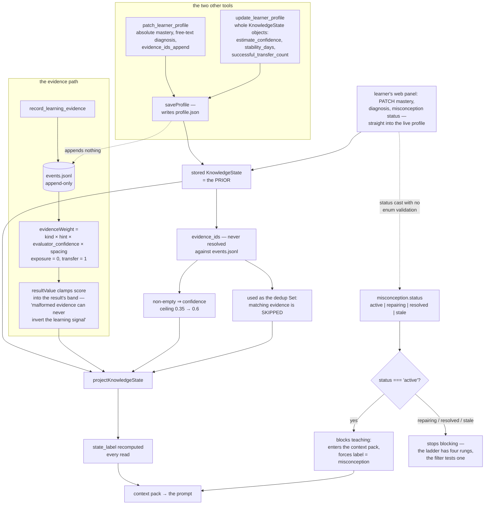

## 1. Executive Summary

Inno Agent is a personal learning agent — MIT, TypeScript, 84,072 lines across
90 test files, built on the Pi coding-agent SDK with the kernel deliberately
unmodified. It ships as an Electron app, a React web UI and a terminal CLI over
one runtime state, and it organises memory into three declared layers: an L1
learner profile, an L2 Markdown wiki, and L3 session records with
cross-conversation recall.

The README states the stance plainly: "Durable facts go to tools, not replies —
anything that affects future teaching is written to L1/L2 via tools, so
personalization is evidence-driven and traceable," and "unevidenced labels are
forbidden."

The evidence model behind that claim is the best-argued one in this family.
`evidence.ts` types a piece of evidence by kind and weights it: `exposure` is
worth zero, `recognition` 0.25, `guided_recall` 0.45, `free_recall` 0.75,
`application` 0.85, `transfer` 1, and a learner's `self_report` 0.1. That is
multiplied by a hint-level factor that drops to 0.1 at three hints, by the
evaluator's confidence, and by a spacing factor that pays 1.25 for a
week-delayed success and 0.75 for one inside five minutes. Mastery moves by
`LEARNING_RATE * weight * (observed - mastery)`, so being shown something moves
nothing at all.

The guard on top of it is the kind of detail that only gets written by someone
who has watched a model produce contradictory output. `resultValue` clamps the
optional numeric score into the band its categorical result allows, with the
reason in the comment: "A model can accidentally emit contradictory fields (for
example, result=incorrect with score=1); constrain the optional score to the
selected result band so malformed evidence can never invert the learning
signal."

Then there are two other tools.

`patch_learner_profile` takes an absolute `mastery`, a free-text `diagnosis`,
and `evidence_ids_append`. `update_learner_profile` takes whole knowledge-state
objects, including `estimate_confidence`, `stability_days`,
`successful_transfer_count` and an optional `state_label`. Both call
`saveProfile` directly. Neither appends anything to `events.jsonl`. And nothing
anywhere resolves an id in `evidence_ids` against the event log.

That matters more than it looks, because `evidence_ids` is doing three jobs at
once. It is the provenance list shown to the learner. It is a confidence gate —
`state-engine.ts:111` reads a non-empty array as licence to raise the
estimate-confidence ceiling from 0.35 to 0.6. And it is the dedup key:
`state-engine.ts:123` builds a `Set` from it, and any evidence whose id is
already in that set is skipped outright. The array is also not a coherent key
space — `auto-profile.ts:273` pushes `event.event_id` into it while
`state-engine.ts:267` pushes `evidence.evidence_id`, two different id
namespaces in one field.

So the careful path cannot be faked and the other path does not need to be.

## 2. Mental Model

**Evidence** is the atom. It has a kind, a categorical result, a hint level, an
evaluator and that evaluator's confidence. It is appended to `events.jsonl` and
never edited.

A **knowledge state** is not stored truth. `projectKnowledgeState` takes the
stored state as a *prior* and replays evidence over it, producing a
`DerivedKnowledgeState` with a `state_label` of unknown, learning, fragile,
review_due, stable or misconception. The label is recomputed on every read; the
stored `state_label` field is written by tools and never read back.

A **misconception** is the one genuinely stored status. `active` blocks
teaching. Leaving `active` requires a linked, hint-free, confidently evaluated
correct retrieval.

The **wiki** is Markdown with frontmatter. Its pages also carry a status —
draft, reviewed, outdated — and that one is decorative.

## 3. Architecture

| Area | Role |
| --- | --- |
| `memory/learner/evidence.ts` | Evidence typing and the weight function |
| `memory/learner/state-engine.ts` | The projection, the misconception gate, the FSRS-style stability model |
| `memory/learner/profile-store.ts` | `profile.json`, the append-only `events.jsonl`, and its rotation |
| `memory/learner/profile-updater.ts` | `patchProfile` and `updateProfile` — the direct write paths |
| `memory/learner/context-pack.ts` | What actually reaches the prompt |
| `memory/learner/prerequisite-resolver.ts` | Prerequisite assessment feeding the teaching gate |
| `memory/learner/teaching-entry-gate.ts` | Diagnose, teach, repair or answer directly |
| `memory/l2/` | The wiki: ingest, chunking, summarising, linking, linting, graph and overview |
| `memory/l3/` | Session indexing into SQLite FTS5, and recall |
| `server/routes/learner.ts` | The learner-facing edit API |

## 4. Essential Implementation Paths

Read `evidence.ts` and `state-engine.ts:100-200` first — that is the argument
the project is making, and it is worth the time regardless of what you conclude
about the rest.

Then read `profile-updater.ts:117-182` immediately afterwards. The contrast is
the whole report.

Then `state-engine.ts:250-281` for the misconception gate, which is the part
that got it right.

## 5. Memory Data Model

L1 is one JSON file plus one JSONL log. The profile holds goals, knowledge
states, misconceptions, preferences and a summary; the log holds learning
events, each optionally carrying a structured `evidence` object.

A stored `KnowledgeState` and a computed `DerivedKnowledgeState` are different
types with overlapping fields. The stored one carries `mastery`, `confidence`
and `stability` on a 0–1 scale; the derived one carries `mastery`,
`estimate_confidence`, `stability_days`, `retrievability`, `next_review_at`,
counts of exposures, retrievals, lapses and successful transfers, and the
`state_label`. The tool schema exposes the derived fields as optional inputs on
the stored type, which is how a caller ends up able to submit
`successful_transfer_count` directly — one of the four conditions for the
`stable` label.

L2 is a Markdown tree. A page's frontmatter carries `status`, `confidence`,
`sources`, `source_ids`, an optional `concept_id` linking it to L1's concept
space, explicit `prerequisites` with a relation and a source, and optional
`contested` and `contradictions` fields. The distinction between a typed
prerequisite and a plain wikilink is drawn deliberately: "Explicit teaching
dependencies. Ordinary wikilinks remain non-directional relatedness."

L3 is `chunks` and `chunks_fts` in SQLite, one row per user or assistant turn.

## 6. Retrieval Mechanics

L1 is not retrieved. `buildContextPack` projects every concept, sorts by a
fixed state priority — misconception, review_due, unknown, learning, fragile,
stable — takes five, collects the active misconceptions, and renders them as
lines in the prompt. There is no query and no threshold, which for a
single-learner profile is the right call.

L2 search is keyword matching over manifest fields, falling back to page body
content, with an embedding-backed path when configured.

L3 is FTS5 with an `excludeSessionId` option so cross-session recall does not
return the conversation you are already in — a small thing that many systems in
this corpus get wrong.

The retrieval finding is what *isn't* filtered. `WikiPageStatus` is
`draft | reviewed | outdated`, and the only place a status value is compared in
L2 is `l2-tools.ts:182`, where `status === "indexed"` on a *manifest* entry
guards re-archiving. No read path tests a page's review status:
`wiki-page-model-view.ts:161` normalises it for rendering and that is the end
of it. An `outdated` page is retrieved and presented exactly like a `reviewed`
one. `contested` is the same — the maintainer counts contested pages into the
overview for a human to read, and nothing withholds them.

Two statuses in one system, and only the L1 one is enforced.

## 7. Write Mechanics

`record_learning_evidence` builds a structured evidence object, appends it, and
folds the deterministic signals into the profile — with a `dedupe_key` check
that scans the existing log before appending.

The two profile tools are the finding. `patchProfile` creates the knowledge
state if absent, then applies whatever the caller sent: `mastery` absolute or
by delta, `confidence`, a `stability_delta`, a `diagnosis` string, appended
`next_actions`, appended `evidence_ids`, `last_practiced_at` and
`review_due_at`. `updateProfile` merges whole objects by id. Both end at
`saveProfile`, which bumps a version counter and writes the file.

Nothing validates that an appended evidence id exists. Nothing records that the
write happened. The version counter increments, and it is the only trace.

The consequence is not that mastery can be set — a personal agent has every
right to let a learner assert what they know. It is that an *asserted* value is
stored in the same field, with the same shape, as a *derived* one, and the
provenance field that would tell them apart is itself free text. The projection
then treats the asserted value as a prior and moves it by 35% of one weighted
step per piece of real evidence, so a fabricated 0.95 survives several honest
failures.

The web panel is a correction surface and not a review one, which is why this
report does not carry `human_review`: `PATCH /api/learner/profile/knowledge/:conceptId`
(`learner.ts:136`) and `.../misconceptions/:miscId` (`:161`) write straight into
the profile the next turn reads, and the edited knowledge state becomes the
`base` the next projection builds on. Nothing is held anywhere pending a
decision. The panel also writes through a second door with a different
validation posture.
The tool path declares `status` as a `StringEnum` of four values; the HTTP
handler at `learner.ts:173` does `(body.status as Misconception["status"]) ??
current.status` — a bare TypeScript cast, which erases at runtime. A PATCH
carrying any string stores it, and since the read path tests only
`status === "active"`, an unrecognised value silently stops the misconception
from blocking.

## 8. Agent Integration

The SDK kernel is not modified; memory is registered tools plus one extension
hook, and the README makes that a stated design constraint. That is the right
instinct for staying upstream-compatible, and it is visible in the code rather
than only in the prose.

`formatTeachingEntryDecision` is worth reading as an artifact in its own right:
when the gate decides to diagnose, it emits a protocol block instructing the
next reply to ask exactly one observable question, give no hints or answers,
and stop and wait. It is prompt engineering, not enforcement — nothing checks
that the model complied — but the decision of what to constrain is well made.

## 9. Reliability, Safety, and Trust

The misconception gate is the system's best mechanism and deserves the credit.
Its comment states the rule and the code keeps it: a correct answer on the
concept does not clear a misconception; only an evidence record explicitly
carrying that `misconception_id`, produced by a retrieval-kind interaction, at
hint level 0 or 1, with an evaluator at least 0.7 confident and a computed
weight of at least 0.25, moves it out of `active`. A later linked failure sets
it straight back.

The gap is at the other end. That careful transition moves `active` to
`repairing` — never to `resolved`, which no code path sets. And both read
filters test `status === "active"`. So the moment a misconception becomes
`repairing` it stops entering the context pack and stops forcing the
`misconception` state label, even though `repairing` plainly means the repair is
underway rather than done. A four-value vocabulary is being consumed as a
boolean, and the value the careful gate produces is on the permissive side of
it.

`events.jsonl` is append-only and rotates at 10 MB, and `loadEvents` — which
`rebuildProfileFromEvents` uses — reads only the current segment. The code says
so: "older segments stay on disk as archives." A rebuild after a rotation
therefore replays a truncated history. `rebuildProfileFromEvents` also starts
from the *current* profile rather than a default, so it is a replay-on-top, not
a reconstruction; a value written by `patch_learner_profile` survives it
untouched.

There is no scope key anywhere, which is a stated non-goal rather than an
oversight — the README lists multi-user support under "Non-goals" and the
architecture is consistent with that. Workspaces are separated by data
directory only.

## 10. Tests, Evals, and Benchmarks

Ninety test files, and the memory ones are real. `l3.test.ts` seeds a session
whose assistant turn carries a `thinking` block and a visible `text` block,
then asserts the chunk count is 2, the visible text is findable, and the
reasoning is not — a negative with its positive control and an exact count in
the same test, against the real store. `state-engine.test.ts:216-254` is titled "moves only an explicitly linked,
reliably repaired misconception out of active" and asserts the status lands on
`repairing` after the good repair and returns to `active` after a later linked
failure — which is also the clearest confirmation that `repairing`, not
`resolved`, is what the careful path produces. `wiki-linker.test.ts` asserts a hallucinated page
name does not end up in a page body and that the graph reports no missing
targets. `server.smoke.test.ts` drives the learner API end to end over a real
HTTP server, including the delete.

What is not tested is the seam this report is about: no test writes a knowledge
state through `patch_learner_profile` and then asserts anything about how the
projection treats it, and no test appends a fabricated evidence id and checks
what happens to the confidence ceiling or the dedup set.

## 11. For Your Own Build

Take `evidence.ts` more or less whole. Typing evidence by what the learner
actually did — recognised, recalled with hints, recalled freely, applied,
transferred — and weighting `exposure` at exactly zero is the single most
useful idea here, and it generalises past education to any memory that records
how strongly something was confirmed.

Take `resultValue`'s guard, and take the reason with it. When a model supplies
both a category and a number, let the category constrain the number's range.
The comment naming the failure it prevents is what makes the guard survive the
next refactor.

Take the misconception rule: a blocker is not cleared by success on the general
topic, only by a check explicitly linked to the blocker itself, and a later
linked failure reinstates it.

Do not let a field be provenance, a confidence gate and a dedup key at once.
`evidence_ids` is all three, and because the first job is descriptive nobody
validates it, while the second and third are load-bearing. Split them: a
provenance list can be free-form, but anything that raises a confidence or
suppresses a record must be resolved against the store that would confirm it.

If you have a derived value and an asserted one, do not store them in the same
field. Keep the assertion beside the derivation with its own provenance, and
decide explicitly which one the read path uses.

Make the status vocabulary and the read filter agree. Four values and one
`=== "active"` check is a decision about `repairing` that nobody wrote down.

## 12. Open Questions

Whether `resolved` and `stale` are intended to be reachable. No code path sets
either; both are in the type, the tool schema and the web PATCH. If the model
is expected to set them through `update_learner_profile`, the careful gate in
`applyEvidenceToLinkedMisconception` can be bypassed by the same call.

Whether the stored `state_label` is meant to be authoritative anywhere. It is
writable through the tool schema and the projection never reads it.

Whether the technical report — `docs/inno-agent.pdf`, described in the README
as an arXiv paper from June 2026 — describes the evidence model as implemented
or as designed. It was not read here.

## Appendix: File Index

| Path | What to read it for |
| --- | --- |
| `apps/inno-agent/src/memory/learner/evidence.ts` | The weighting, and why exposure is worth zero |
| `apps/inno-agent/src/memory/learner/state-engine.ts` | The projection, the dedup set, and the misconception gate |
| `apps/inno-agent/src/memory/learner/profile-updater.ts` | The two write paths that skip the log |
| `apps/inno-agent/src/memory/learner/context-pack.ts` | The `status === "active"` filter |
| `apps/inno-agent/src/server/routes/learner.ts` | The human edit surface, and the unchecked cast |
| `apps/inno-agent/src/memory/l3/l3.test.ts` | Thinking blocks excluded, asserted both ways |
| `apps/inno-agent/src/memory/l2/types.ts` | A page status nothing filters on |

## History

**2026-09-19** — re-pinned to [`4fe5cc9fd4f4953347e7716d7e5006c0e6385b88`](https://github.com/hhyqhh/inno-agent/commit/4fe5cc9fd4f4953347e7716d7e5006c0e6385b88). `human_review` is **withdrawn**, and the withdrawn record described the disqualifying shape itself: the panel writes *"straight into the profile the next turn reads"*, and the edited state *"becomes the `base` that `projectKnowledgeState` builds the next projection on, so the person's edit is authoritative rather than advisory."* Authoritative editing is authoring, not a gate — nothing waits. The two PATCH routes were re-verified at `learner.ts:136` and `:161`, and the tree carries no pending, proposed or approval state on a memory at this pin. The panel keeps its credit in section 7, including the finding that matters more than the mark: its `status` handling is a bare TypeScript cast, so a PATCH carrying any string stores it and an unrecognised value silently stops a misconception from blocking. `trust_state` and `negative_eval` stand. Screened again first; nothing was installed and no suite was run.

**2026-09-16** — [`fdd95ccd44ac237444dd3bc12572f6b17ea132c7`](https://github.com/hhyqhh/inno-agent/commit/fdd95ccd44ac237444dd3bc12572f6b17ea132c7) — first reading, at a commit dated 16 September 2026. Screened before opening, from a shallow clone: ten files scanned, no auto-run surfaces, five dependency files inside the seven-day cooldown, six unpinned surfaces including two `package.json` files with no lockfile beside them and a `xlsx` dependency from a vendored tarball, and the `CLAUDE.md` read as data. Nothing was installed, built or run.
