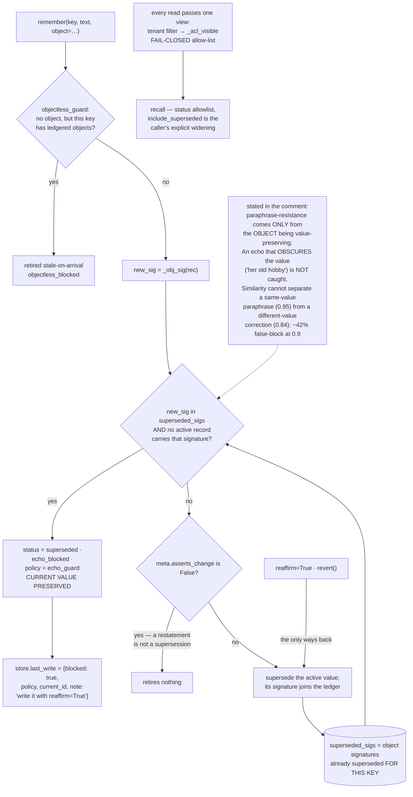

## 1. Executive Summary

inspeximus is "the agent memory that takes it back" — MIT, Python, version
2.35.0, 129,806 lines with 294 test files and 2,837 test functions, built around
one claim: "Your agent's most expensive failure is not forgetting. It is
confidently remembering the old answer."

The mechanism is the clearest tombstone in this corpus, and the writing around
it is the most rigorous.

On the write path, `remember()` builds the set of object signatures already
superseded for the incoming key:

```
superseded_sigs = {self._obj_sig(r) for r in same_key if r.get("status") == "superseded"}
```

If the incoming record's signature is in that set and no active record carries
it, the write is retired on arrival — status `superseded`, `echo_blocked`,
`superseded_by_policy = "echo_guard"` — and the current value is preserved. That
is a durable record of a rejected *value*, keyed on the value, consulted on
write so a later assertion cannot silently re-instate it. A companion
`objectless_guard` closes the obvious hole: a write with no explicit object
against a key whose values are ledgered is blocked, so an echo cannot slip past
the signature check by omitting the field it would be matched on.

The bypass is explicit and named. `remember(..., reaffirm=True)` or `revert()`,
"because the guard cannot un-supersede on its own" — and the caller is told:
`store.last_write` carries `blocked: True`, the policy, the current record's id,
and a note saying to use `reaffirm=True` if the value has genuinely returned.
That reporting was added for a reason the comment states: `remember()` returns an
id whether the write landed or was retired, so "a legitimate reversal (A -> B ->
A, third write true) silently left the store on B while the call looked like a
success … one defect reached through seven doors, all of them 'a demoted write
reported as a landed one'."

What lifts this above a good implementation is the sixteen-line comment above
it, which does four things almost nothing else here does.

It **cites its own probe** — `inspeximus/probes/echo_attack_probe_v2.py`, on a
MemBench echo fixture — and gives comparative stale rates for recency, mem0-v1, a
bi-temporal-Graphiti-faithful policy and a verbatim-hash policy, noting that the
verbatim-hash policy "holds against verbatim (0.21) but is destroyed by
paraphrase (1.00)".

It **states its own defeat condition**, under the heading "LOAD-BEARING LIMIT
(measured, not assumed)": paraphrase resistance "comes ONLY from the OBJECT being
value-preserving", because embedding near-duplicate cannot separate a same-value
paraphrase (cos mean 0.95) from a different-value correction (0.84) — they
overlap at "~42% false-block at a 0.9 threshold" — so the guard is object- and
text-based, not similarity-based, and "an echo that OBSCURES the value
(coreferent 'her old hobby') is NOT caught."

It **records a shipped bug**: the guard was off by default, so every product
surface had to re-enable it and "the adapters missed it for ten releases — a
correction made through the CLI was undone by a restatement through an adapter,
and then the honest re-correction was refused as an echo, so the store could not
be put right through the surface that broke it."

And it **records a second one**: the documented off-switch was dead.
`INSPEXIMUS_ECHO_GUARD=0` was silently ignored by a direct API user — "measured,
all three of =0, =1 and unset produced an identical guarded store. A switch that
reports nothing when it fails to take effect is worse than no switch."

A project that writes its own failures into the file, with numbers, is giving a
reader the thing an atlas normally has to reconstruct.

## 2. Mental Model

A **record** has a key and, ideally, an explicit `object` — the value, separate
from the prose that states it.

A **supersession** retires a value for a key; the retired object's signature
stays in the ledger.

An **echo** is a later write of a value that is already retired. It is retired
on arrival.

A **reaffirm** is the only way a retired value comes back, and it is a different
call.



## 3. Architecture

| Area | Role |
| --- | --- |
| `inspeximus/core.py` | 15,891 lines: the store, the guards, the view, recall, receipts |
| `inspeximus/probes/` | Self-audits with committed results, including the tombstone probe |
| `inspeximus/merkle.py`, `cose.py`, `scitt.py`, `transparency.py`, `witness_*.py` | The transparency-log half: signing, anchoring, co-signature |
| `inspeximus/deletion_manifest.py`, `erasure_auditor.py`, `subject_rights.py` | Erasure with receipts |
| `inspeximus/mcp_server.py`, `integrations/`, `packages/langgraph-*` | The surfaces |
| `tests/` | 294 files, 2,837 test functions |

## 4. Essential Implementation Paths

`core.py:2105-2121` — the echo-guard comment. Read it before the code; it is the
design document, the measurement and the post-mortem in one place.

`core.py:5924-5962` — the two guards on the write path, and the caller-facing
verdict.

`core.py:7940-7958` and `:8377-8394` — the single filtered view, and why it is
an allow-list.

`core.py:239-257` — `_serving_class`, and the argument for committing a class
rather than a status.

## 5. Memory Data Model

A record carries a key, an optional explicit `object`, a status, a tenant, an
owning agent, validity timestamps and receipt material. The separation of
`object` from text is what the whole guard rests on: the object is the value,
the text is a way of saying it, and only the first can be compared across
paraphrases.

`_serving_class` is worth reading as a design argument. Rather than committing
the raw `status` string into the receipt chain, it commits a two-value class —
`withheld` or `served` — because status "is written at fourteen call sites, most
of them mechanical and high-volume … Committing the raw string would demand an
amendment receipt at every one of them — chain churn proportional to
housekeeping, and fourteen chances to miss one and raise a tamper alarm on an
honest store." Only three transitions cross the boundary, "each a deliberate,
low-volume act by someone vouching for a record", and `confirmed_by` rides in
the same hash "so stamping a fabricated reviewer onto a record is caught by the
same check as flipping its status."

That is a genuinely good answer to a problem every append-only store hits: what
to commit when most state changes are bookkeeping.

## 6. Retrieval Mechanics

Lexical recall over the filtered view. Two filters matter.

The view is the scope boundary and it is applied once: tenant, then
`_acl_visible` for an agent handle, "so a method added tomorrow is
access-controlled by construction rather than by review." The allow-list is
fail-closed in both directions — an unevaluable grant authorises nothing, and an
agent handle with no usable identity reads nothing, because "[r]eturning the
rows unfiltered here would be the whole feature failing open on a falsy value."
ACL records are never visible through an agent handle, and `can_read(agent, id)`
explains a single decision without having to run a recall.

The status filter is an allow-list for a reason the code states: "a denylist only
knows the statuses somebody remembered to add. `discard_provisional()` set
status='discarded' and that fell straight through to `return include_superseded`
— a REJECTED record, surfaced by a flag named for supersession, minutes after the
denylist above it was written."

## 7. Write Mechanics

Both write paths — `remember()` and `route()` — pass the guards. One detail is
easy to miss and is the difference between a working guard and an unusable one:

> "A record that does not ASSERT A CHANGE never retires anything. It is the
> store's only way to tell 'your address remains 742 Birchwood Lane, Unit 4A'
> (agreement, possibly at a different granularity) from 'actually it's Unit 3A
> now' (a correction). Without it, keying the echoes of a value makes the echoes
> supersede each other and the current answer disappears from recall."

Agreement is not correction. Most systems that key on a subject treat every
restatement as a new assertion and lose the current value to its own echoes.

## 8. Agent Integration

A zero-dependency core, an MCP server, one-line installs for five coding agents,
and LangGraph checkpoint and store packages. The adapter story is also where the
ten-release default bug lived, which is the argument for the resolution rule the
comment lands on: one posture, resolved in one place, explicit argument beating
environment beating default.

## 9. Reliability, Safety, and Trust

The second half of the package is a transparency-log system: Ed25519
attestation, receipt chains, Merkle anchoring, COSE and SCITT, witness
co-signature, deletion manifests and an erasure auditor. The name is explained
in the README and the explanation is also a limit: a medieval *inspeximus*
"attested that the copy faithfully matched the original, not that the original
was true. Same guarantee here, and `provenance()` says so in a `limits` field
rather than leaving you to find out."

Two limits are stated plainly and both survive scrutiny. The guard cannot catch
an echo that obscures the value. And `remember(agent_id="*")` stores `*`
unchecked, "because `_check_agent_id` guards the GRANT path and `remember()`
never calls it" — a note that itself corrects an earlier version of the same
comment: "An earlier version of this note said the route 'reaches the SAME
validated path it skipped'. That was false and a control caught it."

The probes are self-audits rather than demos.
`forget_emits_tombstone_probe.py` opens: "Found by running the published wheel in
a clean room and checking the claim 'erasure with signed receipts' against what
the API actually does: the record was gone, the bytes were gone, and the receipt
count was zero."

## 10. Tests, Evals, and Benchmarks

2,837 test functions across 294 files, probes with committed result JSON, and a
"Claims audit" CI workflow beside the ordinary one.

`tests/test_core.py:20` is the negative eval in a single line —
`assert "eu-west" in texts and "us-east" not in texts   # a corrected fact stops
being recalled` — the surviving value and the excluded one asserted together
against a real `recall`. The ACL suite does the same for isolation, with the
failure message "{label} widened the ACL" repeated across parameter variations.

The README's comparison chart should be read as what it is. It reports
correction-recurrence rates for inspeximus, Graphiti and mem0 at n=30 per
system, measured by this project, and none of those numbers was reproduced here.
What distinguishes it from the usual vendor chart is the fourth column:
inspeximus with its own guard disabled, at 100%. Publishing your own ablation
beside your own result is the control that makes the other three legible, and it
is rare.

## 11. For Your Own Build

Key the tombstone on the value, not the record. A deletion marker keyed on an id
stops that row coming back; a ledger of retired object signatures stops the
*value* coming back however it is restated. The difference is the whole
mechanism.

Separate the value from the sentence. None of this works without an explicit
`object` field, and the guard that blocks objectless writes against a ledgered
key is what stops callers opting out by accident.

Distinguish agreement from correction. A restatement that asserts no change must
retire nothing, or a subject's echoes supersede each other and the current
answer vanishes.

Tell the caller when a write was demoted. A function that returns an id whether
the write landed or was retired will produce "a demoted write reported as a
landed one" in every surface that wraps it.

And write the limit into the comment. "An echo that OBSCURES the value is NOT
caught", with the measured overlap that explains why a similarity threshold
cannot fix it, is worth more to a reader than any benchmark — it is the sentence
that tells you whether this mechanism fits your problem.

## 12. Open Questions

Whether `agent_id="*"` should be accepted by `remember()`. The code names the
gap and explicitly declines to answer it in that release.

How the guard behaves against coreferent echoes in practice. The limit is
stated; no probe in the tree measures how often real agent output takes that
form.

Whether the comparison figures reproduce. The probes are committed and the
fixtures named, so the question is answerable by anyone who runs them; it was
not answered here.

## Appendix: File Index

| Path | What to read it for |
| --- | --- |
| `inspeximus/core.py:2105-2121` | The guard's measurement, its defeat condition, and two shipped bugs |
| `inspeximus/core.py:5924-5962` | The value-keyed ledger consulted on write, and the caller's verdict |
| `inspeximus/core.py:239-257` | Committing a class rather than a status, and why |
| `inspeximus/core.py:7940-7958`, `:8377-8394` | One filtered view, fail-closed in both directions |
| `inspeximus/probes/forget_emits_tombstone_probe.py` | A project auditing its own published wheel |
| `tests/test_core.py:20` | A negative eval and its positive control in one assertion |

## History

**2026-09-19** — [`d9efe84a79d19d5f22d5012c94f8df36fe1b07a2`](https://github.com/DanceNitra/inspeximus/commit/d9efe84a79d19d5f22d5012c94f8df36fe1b07a2) — `trust_state` re-tested. The mark holds; anchors shifted by about four hundred lines and are re-mapped — `_WITHHELD` at `inspeximus/core.py:175-176`, `_serving_class` at `:239-257`, and the recall gate at `:11550-11581` rather than `:11107-11160`. The comment beside the gate says more than the record quoted, and the extra half is the better finding. It gives two reasons for the allowlist, and each is a bug that happened. The one already recorded is polarity: a denylist only knows the statuses somebody remembered to add, and `discard_provisional()` set status `discarded`, which fell through to `return include_superseded` — a rejected record surfaced by a flag named for supersession, minutes after the denylist above it was written. The one not recorded is placement: *a denylist below the bitemporal branch is not a gate*, because that branch returns True before any status check runs, so `recall(as_of=...)` returned provisional records. A predicate that exists and is unreachable on one branch is the same defect this sweep has found by hand in several systems, and here it is written down by the project that hit it. Both halves are now in the record, and `_serving_class` is named for what the digest at `:3301` commits to: the serving class rather than the raw status. Screened again first; nothing was installed and no suite was run.

**2026-09-16** — [`d9efe84a79d19d5f22d5012c94f8df36fe1b07a2`](https://github.com/DanceNitra/inspeximus/commit/d9efe84a79d19d5f22d5012c94f8df36fe1b07a2) — first reading, at a commit dated 16 September 2026. Screened before opening, from a shallow clone: eighteen files scanned, five auto-run surfaces, one build-time execution point, five unpinned surfaces and six dependency files inside the seven-day cooldown. The README's comparative figures against other systems are the project's own measurements and were not reproduced. Nothing was installed, built or run.
