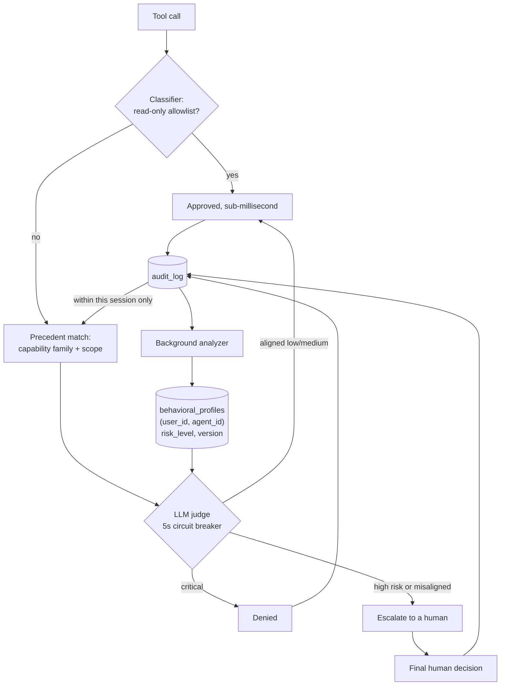

## 1. Executive Summary

Intaris is a Business Source License 1.1 guardrails service — 212 files, 261
commits — that sits between an agent and its tools and evaluates every call
before execution: default-deny, a read-only allowlist fast-pathed under a
millisecond, everything else through an LLM safety evaluation behind a five-second
circuit breaker. It is the guard in a three-service platform by one author,
beside [Cognis](../cognis/) as controller and [Mnemory](../mnemory/) as memory.

A guard is normally outside this atlas: what it durably holds is decisions, and a
decision about an action is not a claim that can be wrong. **Intaris is in scope
for one table.** `behavioral_profiles` is keyed on `(user_id, agent_id)` and
holds a `risk_level` from 1 to 10, `active_alerts`, a `context_summary`, a
`profile_version` and the id of the analysis that produced it. A background
analyzer derives it from the audit history; the evaluator reads it back before
the next decision and acts on it — `if (profile.get("risk_level") or 0) >= 9:` is
a live branch in `evaluator.py`.

That is a durable belief with an identity, replaced by a later version, that
changes what the system does. **Its subject is the agent itself.** Every other
memory in this atlas is about the world, the user, or a task; this one is a
system's accumulated opinion of the actor it is policing, and no other system
here has that shape.

The second mechanism is `precedent.py`, and it is a careful piece of work.
When a human finally approves a call, that approval should generalise — but
generalising by tool name turns one *yes* into blanket approval for every future
call to that tool. So a call is mapped into a coarse capability family and scope
— `web_search` and `web_fetch` land together, a Todoist lookup with other lookup
verbs, mutating verbs kept apart from lookup verbs, read-only bash commands
enumerated. A human's approval then applies across the family. The doc comment
states the balance exactly: apply the approval across equivalent low-risk tools
*"without turning into blanket approval for all calls to the same tool name."*

The limit on that mechanism is the finding a reader most needs. `get_user_decisions`
takes a `session_id`: precedent is **within-session only**. Approve a
web fetch today, and tomorrow's session asks again.

## 2. Mental Model

Two clocks run over the same audit trail.

**Within a call, evaluation is layered and cheap-first.** Classification splits
read-only from everything else; the allowlist resolves in under a millisecond;
what survives goes to an LLM judge with a circuit breaker, and the decision
matrix is priority-ordered — critical risk auto-denies, aligned low and medium
approve, high risk and misalignment escalate to a person.

**Within a session, human decisions are authoritative and only human ones.**
`get_user_decisions` returns final human resolutions and *excludes
judge-authored decisions*, so what the evaluator treats as authoritative guidance
cannot be something the model decided earlier and then read back as if a person
had said it. That exclusion is the whole reason the data can be trusted, and it
is one line of SQL.

**Across sessions, the analyzer builds a profile.** Behavioural analyses run as
scheduled tasks over the audit history and write a new `behavioral_profiles` row,
version incremented. That profile is the only thing that survives the session.

The two edges out of `audit_log` are the design: one feeds the current session
and expires with it, the other feeds a profile that does not.

## 3. Architecture

A single Python process, SQLite or Postgres, no dependency beyond an LLM API key.
The schema is dual-dialect — the migration helpers build `behavioral_profiles`,
`behavioral_analyses`, `analysis_tasks` and `session_summaries` in both SQLite and
Postgres forms, with `TIMESTAMPTZ` where Postgres wants it — which is unusual care
for a service that could reasonably have picked one.

Sessions are hierarchical with parent/child links, intention tracking, lifecycle
states and an idle sweep. WebSocket streaming carries live decisions to a
monitor. The licence is BSL 1.1: readable and analysable, with the change date
and additional-use grant worth checking before building on it.

The screen found unpinned dependency surfaces and files inside the seven-day
cooldown, so nothing was installed, built or run.

## 4. Essential Implementation Paths

- **Precedent** — `intaris/precedent.py`: `PrecedentSignature`,
  `build_precedent_signature`, verb and command sets; consumed by
  `evaluator.py:_apply_authoritative_user_precedent` and by `judge.py`.
- **Authoritative decisions** — `intaris/audit.py:get_user_decisions`, session
  scoped, judge-authored rows excluded.
- **Profile write** — `intaris/analyzer.py:3187` inserts, with `profile_version`
  read back at `:3213`.
- **Profile read** — `intaris/evaluator.py:747-770`, and the risk branch at `:403`.
- **Schema** — `intaris/db.py`: table creation from `:1097`, dual-dialect
  migrations from `:505`.
- **Redaction** — `intaris/redactor.py` with `tests/test_redactor.py`.

## 5. Memory Data Model

The profile is the memory unit and it is small: a tenant, an agent, a risk level
bounded 1–10 by a `CHECK` constraint, alerts, a summary, a version, and the
analysis id it came from. `PRIMARY KEY (user_id, agent_id)` means one current
profile per pair — history lives in `behavioral_analyses`, not in the profile
table.

What it lacks is an epistemic status: a profile is a number and a summary, so
*this agent is risky* and *we have not yet analysed this agent* are told apart
only by the default of 1. Nothing records that a profile was disputed, corrected
by a person, or overridden — the next analysis simply replaces it.

The audit row is the evidence layer, carrying `args_redacted`, the decision, the
human decision, a note, who resolved it, the risk, the reasoning, the evaluation
path, the intention and an `args_hash`.

## 6. Retrieval Mechanics

There is no query language here — retrieval is two keyed lookups. The profile is
fetched by `(user_id, agent_id)`. Human decisions are fetched by `(user_id,
session_id)`, newest first, capped at five, and then matched by signature rather
than by equality: the precedent family is what turns a lookup into a
generalisation.

`args_hash` sits on the audit row beside `args_redacted`, so an identical call
can be recognised without keeping the raw arguments — the same instinct as a
digest-keyed record elsewhere in this atlas, used here for matching rather than
for suppression.

## 7. Write Mechanics

Every evaluated call writes a row, and the row is **updated in place when a human
resolves it** — `UPDATE audit_log` appears twice in `audit.py`. That is the right
shape for a work queue and the wrong shape for an audit, and it is why this report
withholds the `audit_log` mark: the record the profile is derived from can change
after the fact, and nothing preserves what it said before.

Profile writes are background and unattended. A new analysis replaces the current
profile wholesale; the version increments; the previous one is recoverable only
through `behavioral_analyses`.

## 8. Agent Integration

MCP-compatible, with named support for OpenCode, Claude Code and OpenClaw. The
service is in the path of every tool call, which is the strongest integration
position a guard can have and the reason the profile is worth building at all —
it sees everything the agent tried, not only what it succeeded at.

## 9. Reliability, Safety, and Trust

**The exclusion of judge-authored decisions is the best single line here.** A
system that reads its own past model outputs back as authoritative guidance is
the harness-output-as-evidence antipattern this atlas records elsewhere; one
`WHERE` clause prevents it, and the docstring says why.

**Precedent generalises deliberately and stops deliberately.** Families group
equivalent low-risk capabilities; mutating verbs are kept out of lookup families;
read-only bash commands are enumerated rather than pattern-matched. The design
resists the two easy errors — approving a tool name forever, and refusing to
generalise at all.

**Escalation earns `human_review` outright.** A person adjudicates, their
decision is stored with a note and an actor, and it is treated as outranking the
model's.

**Scope reaches every query.** `user_id` is threaded through as a tenant
identifier and sits in the profile's primary key beside `agent_id`.

**What is missing is a record that anything was ever wrong.** A profile can be
too high or too low and nothing says so; there is no dispute, no correction and
no expiry. `risk_level >= 9` gates behaviour, so a profile that drifts high is a
standing brake with no released path other than the next analysis disagreeing
with the last.

## 10. Tests, Evals, and Benchmarks

Tests cover the redactor, path policy, search, the API and the classifier;
`tools/benchmark/` holds scenario worlds for exercising the guard.

`negative_eval` is **withheld**, and the near-miss is specific.
`tests/test_redactor.py` asserts an OpenAI key, an AWS key and a GitHub token are
absent from redacted commands and environments — genuinely valuable, and an
assertion about what enters the store rather than about what a read path returns.
`tests/test_api.py` has one assertion that `args_redacted` is absent or null in a
listing, which is closer, and one assertion is thinner than this mark should
rest on. A committed case asserting that one tenant's audit or profile is
unreachable under another `user_id` would earn it immediately, and the schema is
already shaped for it.

## 11. Patterns Worth Stealing

### Steal

**Keep a profile of the actor, not only of the content.** A durable, versioned
opinion about the agent — derived from what it tried, read back before the next
decision — is a memory shape this atlas has one instance of, and the instance is
cheap: six columns and a background job.

**Exclude your own model's past decisions from the evidence you call
authoritative.** One `WHERE`, and it stops a system laundering its own judgement
into a human's.

**Generalise an approval by capability family, not by tool name.** Map the call
into a family and a scope, keep mutating verbs apart from lookups, and enumerate
the read-only commands.

**Store a hash of the arguments beside the redacted ones.** Matching without
retention.

### Avoid

**Do not update audit rows in place if a profile derives from them.** The
resolution overwrites the record of what was originally decided, which is exactly
the history the analyzer is summarising.

**Do not let precedent die with the session** unless you mean to. Asking a person
the same question every session is how approvals become reflexive, which is the
failure the whole default-deny posture exists to prevent.

**Do not gate on a number nothing can dispute.** `risk_level >= 9` is a strong
behavioural consequence attached to a value with no correction path.

### Fit

This is the right shape for one operator running agents with real tool access who
wants a default-deny gate and a record of what was allowed. Take the precedent
families and the judge-exclusion rule regardless of the rest — both are small and
both address failures that show up anywhere a human approval is reused.

It is not a memory system for an agent's knowledge, and the platform does not
pretend otherwise: that is Mnemory's job. Read this one for the profile and for
what it costs to build a memory whose subject is the actor.

## 12. Antipatterns / Risks

- **A mutable audit trail underneath a derived profile.**
- **Session-bound precedent**, so the same human judgement is re-requested.
- **A risk level with no dispute path** driving a hard behavioural gate.
- **No test that one tenant cannot read another's history**, in a service whose
  whole schema is tenant-keyed.
- **BSL 1.1**, which constrains use rather than reading.

## 13. Build-vs-Borrow Takeaways

Borrow `precedent.py` — it is self-contained, model-free, and the balance it
strikes is the hard part of reusing human approvals. Borrow the judge-exclusion
clause.

The profile is worth *copying the idea of* rather than the implementation: give
it a status, a way for a person to disagree with it, and an append-only trail
underneath, and it becomes the mechanism this atlas has been looking for on the
action side.

## 14. Open Questions

- Was session-scoped precedent a deliberate limit or an artefact of where the
  data was easiest to read?
- Can a person correct a behavioural profile directly, or only by waiting for the
  next analysis?
- What does the idle sweep do to sessions whose decisions have not been resolved?

## 15. Appendix: File Index

| Path | Role |
| --- | --- |
| `intaris/precedent.py` | Capability families, scopes, signature matching |
| `intaris/audit.py` | `get_user_decisions`, the human-only clause, in-place resolution updates |
| `intaris/analyzer.py` | Behavioural analysis and profile writes with versioning |
| `intaris/evaluator.py` | Profile read, the `risk_level >= 9` branch, precedent application |
| `intaris/db.py` | Dual-dialect schema and migrations |
| `tests/test_redactor.py` | Secret redaction assertions |

## History

**2026-08-07** — [`d07ea183ff637c0208e87357d51aa097dd3fced0`](https://github.com/fpytloun/intaris/commit/d07ea183ff637c0208e87357d51aa097dd3fced0) — first reading. Screened before reading: unpinned dependency surfaces and files inside the seven-day cooldown, so nothing was installed, built or run. Licensed BSL 1.1, recorded as a caveat rather than an exclusion. Admitted on `behavioral_profiles` alone: a guard's decision record is not a belief, but a versioned profile of the agent that the evaluator reads back and acts on is one, and it is the only memory in this atlas whose subject is the actor.
