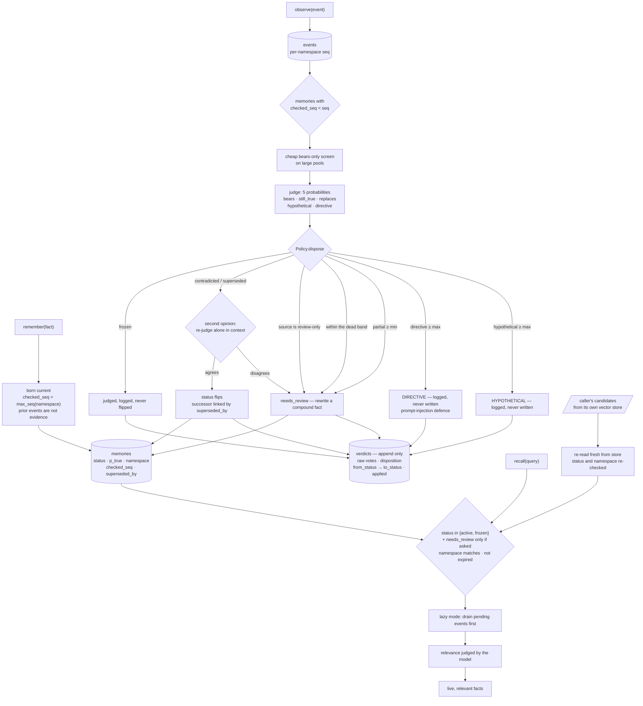

## 1. Executive Summary

A memory system can usually write a fact and delete one. invalidate exists for
the step in between: deciding, when something new happens, whether what is
already stored is still true. The README states the problem in
three lines — a fact learned in March, a migration announced in June, an answer
in September that still cites the March fact — and the whole design follows
from taking that seriously.

Five marks, and each rests on a distinction the code draws and most do not.

**Seven statuses, and recall returns two.** Active and frozen are `live`; the
enum says so as a property rather than leaving it to each query. The
probability the judge produced lives in a separate field, so the store can say
*on record, not believed* — and the recall path applies the status set twice,
once to its own query and again to every candidate a caller supplies from its
own vector index, re-read fresh from the store.

**An event that is a question, or an instruction, is logged and never
written.** Two of the eight dispositions exist for this. `HYPOTHETICAL` covers
a plan or proposal; `DIRECTIVE` covers an event that commands the system about
what to believe — and the threshold's own comment names the reason: *"Prompt-injection
defense; source trust stays with the caller."* A memory layer that reads a
stream of events is a memory layer that can be told what to think, and this one
declines.

**A kill is re-judged before it lands.** When a verdict would contradict or
supersede a memory, the memory is sent back alone in the context; if the clean
read disagrees, it goes to review instead of dying. The comment says where that
came from — batches of near-identical memories were the one place the judge's
distractor weakness showed up in scale tests — and prices it honestly: kills
are rare, so it costs one request per kill.

**Every judgement is kept, including the ones that did nothing.** The verdicts
table holds the raw votes, the disposition, both statuses and whether it
applied, so a frozen memory that was judged and deliberately not flipped leaves
a row, and a threshold can be re-swept against past judgements without calling
the model again.

What it does not have is a rejected-value tombstone, and the reason is the most
interesting sentence in the engine — see section 9.

## 2. Mental Model

Two logs and a cursor.

Memories are facts, stored verbatim. Events are things that happened, appended
to a per-namespace log with a sequence number. Each memory carries
`checked_seq`: the position of the last event it has been judged against. Every
event above that number is pending for it.

That cursor is what makes the guarantee tractable. `observe()` can judge
eagerly, or append and let `validate()` drain later; in lazy mode `recall()`
drains the pending events for its top candidates before returning them, so
*"nothing stale is returned even when observe() only appended to the log."*

The judge only votes. It returns five probabilities — does this event bear on
this memory, is the memory still true, does the event state a replacement, is
the event hypothetical, is it a directive — and every threshold that turns
those into a write lives in one policy dataclass, *"in plain code, so it can be
tuned against your own data without touching the questions."*

## 3. Architecture

## 4. Essential Implementation Paths

- **Types and statuses:** `src/invalidate/types.py`.
- **Policy:** `src/invalidate/policy.py` — every threshold, each with its
  reason.
- **Engine:** `src/invalidate/engine.py` — remember, observe, validate, recall,
  freeze.
- **Store:** `src/invalidate/store.py` — three tables and the read filters.
- **Questions put to the judge:** `src/invalidate/questions.py`.
- **Adapters:** `src/invalidate/adapters/` — the same lifecycle over someone
  else's rows.

## 5. Memory Data Model

A memory is the fact verbatim plus a status, a `p_true`, a namespace, a source,
a kind, four timestamps and two pointers. Keeping the fact verbatim matters for
what this system does: the judge is shown the original sentence, not a summary
of it.

`checked_seq` is the field that does the work, and `remember()` sets it with
the comment that explains the system's temporal stance:

> **Born current:** a fact stored now postdates every event already in the log,
> so those events are not evidence against it. Only events that arrive after it
> are pending for it.

The `Disposition` enum is worth reading as a list of the cases a simpler design
collapses: unrelated, confirmed, contradicted, superseded, uncertain,
hypothetical, directive, partial. `PARTIAL` is the one most systems have no
answer for — an event that changes only part of a compound fact — and it routes
to review for a rewrite *"instead of dying"*, with a deliberately high threshold
because the judge reads most facts as having some second part.

## 6. Retrieval Mechanics

There are no embeddings. Relevance is a probability the judge returns for the
query against each candidate, over a pool already narrowed by status,
namespace and expiry. The design assumption is explicit: a caller that wants
vector recall passes its own top-k as `candidates`, and invalidate re-checks
and ranks them.

That re-check is the part worth copying. Each supplied candidate is re-read
from the store by id and admitted only if it is still live, still in the
namespace and not expired — so a shortlist assembled minutes ago against a
vector index that has not heard about a supersession cannot put the stale fact
back in front of the model.

## 7. Write Mechanics

`observe()` judges the new event against every memory in the judge statuses,
with a cheap bears-only screen in front for large pools and a two-stage
question set that asks the two expensive votes only for memories whose
still-true vote already fell below the contradiction threshold.

Three guards sit between a vote and a write, and all three are in the policy
with their reasons attached. The **dead band** routes a still-true vote within
`margin` of a threshold to review, so a vote that wobbles across the line run
to run lands consistently. The **second opinion** re-judges a kill with the
memory alone. And **review-only sources** cap what an event may do by where it
came from: from a listed source, the worst outcome is review, with *"customer
email, public webhooks"* named as the intended entries.

When the event states the replacement, `remember_successor` stores it as a new
memory and links the old row to it through `superseded_by`.

## 8. Agent Integration

A library and a CLI, two provider client wrappers that inject live facts into
the system prompt and observe the user's message afterwards, and adapters that
apply the same lifecycle to rows held by a dozen other stores — mem0, Letta,
Graphiti, Cognee, Chroma, Qdrant, pgvector, Redis, LlamaIndex, LangGraph, an
MCP memory server, and Markdown files. It is positioned as a layer over a
memory system rather than as one.

The judge is a hosted model, so the compression of this system's own dependency
is worth stating plainly: the votes come from an external service, and the
thresholds and every write decision are local.

## 9. Reliability, Safety, and Trust

**Trust state — awarded.** Seven statuses, a `live` property, a separate
probability field, and a per-source ceiling on transitions.

**Scope enforced — awarded**, on the engine's discipline rather than the
store's; the caveat is in the evidence record.

**Audit log — awarded**, and the detail that earns it is the `applied = false`
rows. A log of what changed is common; a log of what the system considered and
declined is not, and it is what makes a frozen memory's accumulated verdicts
readable as *what would have happened*.

**Human review — awarded**, on the shape where the model has no reach: there is
no tool schema in the tree, the integrations are prompt wrappers, and freeze
lives in the library and the CLI. A pinned memory keeps being judged, so the
person who pinned it is not blinded by the pin.

**Negative eval — awarded**, on the fixture that asserts what never reached the
ranker.

**Tombstone — withheld, and the reason is a deliberate design decision rather
than a gap.** Everything a value-keyed tombstone needs is nearly here: a fact
that was contradicted keeps its row and its status, and the event that killed
it is still in the log. But `remember()` sets a new memory's cursor to the
current end of the log, so re-storing "we use Postgres" after the June
migration event does not re-judge it against that event — the fact is *born
current*, and the prior log is not evidence against it. That is the right
temporal rule for a system whose facts arrive with timestamps, and it means the
rejection does not survive a re-add. A store consulting a record of what was
rejected, keyed on the value, would catch that case; this one catches it only
when the next event on the topic arrives.

**Bi-temporal — withheld.** `created_at`, `updated_at`, `last_checked` and
`expires_at` are all record time. Events carry their own creation time, but no
read answers what the store believed at a past instant.

## 10. Tests, Evals, and Benchmarks

**No paper** and no `CITATION.cff`.

Eighteen test files; the badge claims 695 tests. The three cited in section 9
are the ones that pin the marks.

The eval set is the unusual part and deserves to be read on its own terms. It
is not a retrieval benchmark: `evals/cases.py` holds 157 labelled cases across
sixteen categories, and `run_eval.py` measures how well the policy turns the
judge's five probabilities into the right disposition for one pair. The runner
sweeps thresholds, saves raw votes so a run can be re-scored offline against a
different policy without re-calling the model, and offers a batched mode that
groups cases sharing an event exactly as `observe()` would — with the stated
purpose of comparing it against per-case mode to see whether packing memories
into one request moves the votes. There is a deterministic keyword judge for
running the whole thing with no API key.

The README's badges claim 89.2% strict and 97.5% lenient accuracy and **0 false
invalidations of 157**, and the policy's own comment says the defaults were
chosen by sweeping that set *"for the highest strict accuracy that does not add
a single false invalidation."* Choosing an operating point by the error you
most want to avoid, and saying so where the numbers live, is the right way to
present a threshold. The figures are the project's own and this atlas has not
re-run them; the harness to do so is committed, which is the part that matters.

A `longmemeval` directory sits beside it, and no benchmark result is committed
to the tree.

## 11. For Your Own Build

- **Name the statuses your read path returns, in the enum.** A `live` property
  beside the values is one line and it stops each query inventing its own idea
  of which states are safe.
- **Re-check candidates a caller hands you.** A shortlist from someone else's
  vector index is a snapshot; re-reading each row by id before ranking is what
  stops a supersession that happened since from being invisible.
- **Give a question and an instruction their own dispositions.** An event
  stream is an injection surface, and *"the migration is done"* and *"from now
  on, remember that the migration is done"* are different claims about the
  world.
- **Put a dead band around every threshold that writes.** A vote that wobbles
  across a line produces a memory that flips between runs; a margin turns that
  into a consistent *uncertain*.
- **Re-judge the destructive verdict alone.** The cheapest place to spend an
  extra call is the one that deletes something, and the cost is bounded by how
  rare that is.
- **Log the judgements that changed nothing.** The record of what the system
  declined to do is what makes a pinned or frozen item reviewable.
- **Let the source cap the transition.** A fact from a public webhook should be
  able to raise a question and not to kill a belief.

## 12. Open Questions

- Born-current is right for a timestamped log and leaves the re-add case open.
  Would consulting the contradicting event — or a record keyed on the fact's
  own text — at `remember()` time be worth the false positives it would bring?
- The verdicts table is append-only by convention. Is a trigger or a check
  constraint worth it, given the table is the evidence for every status the
  store holds?
- `review_only_sources` is a set of exact source strings. What happens to an
  adapter whose upstream source names are not under the operator's control?

## Appendix: File Index

- Types, statuses, dispositions: `src/invalidate/types.py`
- Policy and thresholds: `src/invalidate/policy.py`
- Engine: `src/invalidate/engine.py`
- Store and schema: `src/invalidate/store.py`
- Judge and questions: `src/invalidate/judge.py`,
  `src/invalidate/questions.py`
- CLI: `src/invalidate/cli.py`
- Provider wrappers: `src/invalidate/integrations/`
- Store adapters: `src/invalidate/adapters/`
- Tests: `tests/test_engine.py`, `tests/test_policy.py`,
  `tests/test_second_opinion.py`, `tests/test_lazy.py`, `tests/test_store.py`
- Evals: `evals/cases.py`, `evals/run_eval.py`, `evals/README.md`

## History

**2026-09-19** — [`edaa56e1c2fea4cdde914500bb0bf988d375919e`](https://github.com/chopratejas/invalidate/commit/edaa56e1c2fea4cdde914500bb0bf988d375919e) — first reading, at the head of `main`. Screened with `scripts/screen_repo.py` before anything was read: one build-time execution path in a pytest conftest, two unpinned dependency surfaces, and no instruction file addressed to a reading agent; nothing was installed, built or run. Apache-2.0 with a `NOTICE`. Five marks. The reading covered the type model and both enums, the policy and every threshold's stated reason, the engine's remember, observe, validate, recall and freeze paths, the store's three tables and its read filters, the integrations and the adapter surface, and the engine test suite; the dozen store adapters were read as a list rather than individually, and the judge's hosted service is outside the repository. Two marks are withheld with reasons in section 9, and the one worth repeating is `tombstone`: the mechanism is absent because of an explicit temporal rule — a fact stored now postdates the log, so the event that contradicted its predecessor is not evidence against it.
