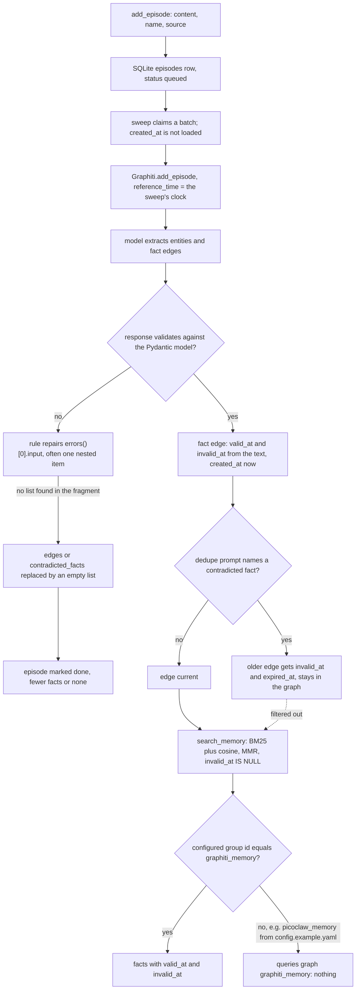

## 1. Executive Summary

**Janus-Graph is a local memory service for agents that puts a durable queue and an MCP surface in front of [Graphiti](../graphiti/) on an embedded FalkorDB.** It is not the Apache JanusGraph database. An agent calls `add_episode`; the text lands in a SQLite WAL table in one insert; a sweep run from cron, or from the daemon when `daemon.cron_enabled` is set, hands each episode to `Graphiti.add_episode`, which extracts entities and dated fact edges with a model; `search_memory` runs Graphiti's BM25-plus-cosine edge search with MMR reranking, restricted to facts whose `invalid_at` is null. Apache-2.0, 25 commits between 28 August and 7 September 2026, 24 of them by one author; 6,416 lines of Python and 2,705 lines of tests. `uv.lock` pins graphiti-core 0.29.3, whose package is 36,684 lines — the memory model lives in the dependency, and this report reads it at that tag.

What the repository itself adds is plumbing around an LLM-heavy ingest: a queue with a stuck-row reaper, a per-episode timeout and a dead-letter table; a wrapper around the LLM client that repairs responses failing Graphiti's Pydantic models; a daemon with a circuit breaker around FalkorDB; and a nightly *dream* run. The `bitemporal` mark is earned by Graphiti's edges, which this wrapper reaches on its write path and filters on in `search_memory`.

**Three findings decide whether it works as memory.** The repair wrapper hands each rule the input at the *first* validation error, which for a malformed item is that item rather than the response, and every rule's fallback is an empty list — so one bad edge empties the episode's whole extraction, and one bad index empties the contradiction list that would have invalidated an older fact. The episode is then marked done. `search_memory` reads a graph named by a hardcoded driver default while writes go to a graph named by the configured group id; the two agree at the code default and disagree under `config.example.yaml`, which the loader uses whenever no `config.yaml` exists. And dream mode's clustering, deduplication and orphan-pruning phases set status strings without touching the graph, which the committed test asserts.

## 2. Mental Model

The episode is evidence; the belief is a Graphiti fact edge — a sentence, a relation type between two entity nodes, a `valid_at` and `invalid_at` the model extracted from the text, and a `created_at` from the clock. There is no candidate stage: whatever the extraction returns and Graphiti resolves is believed, and every read path treats it as ground truth. The agent controls what is enqueued; extraction and resolution are background work.

A fact stops being current in one way. When Graphiti's edge-dedupe prompt names an existing fact as contradicted, and both facts carry a `valid_at` with the existing one earlier, the older edge's `invalid_at` is set to the newer fact's `valid_at` and its `expired_at` to now (`edge_operations.py:546-571` in graphiti-core 0.29.3; `:822-838` handles a new fact that arrives already superseded); the edge stays in the graph and `search_memory`'s `invalid_at IS NULL` filter hides it. Nothing else ends a belief. There is no delete or forget tool, and the dream phases that claim to deduplicate and prune do nothing.

Two paths keep a statement from ever reaching recall, and the agent is told about neither: the repair wrapper's empty-list fallback, below, which means the fact is never written, and the filter itself, which hides a stored fact whose *future* end date was extracted from the text — "the lease runs to June 2027" is invisible to `search_memory` from the moment it is written, because the predicate is `IS NULL` rather than a comparison with now.



## 3. Architecture

Four things have to be running besides the Python package: FalkorDB (a `redis-server` with the `falkordb.so` module on port 6379), an OpenAI-compatible chat endpoint (the default is a LiteLLM proxy on port 4000, called in `json_object` mode with the schema pasted into the prompt), an OpenAI-compatible embeddings endpoint (port 8081, 768 dimensions), and something that runs the sweep — a crontab line from `docs/operations.md` or the daemon with `daemon.cron_enabled: true`. The MCP server is a separate stdio process. Nothing works without the two model endpoints, but both can be local.

The engine binaries are not in the tree. `bin/install.sh` copies them from `$LEGACY_BIN_DIR` if set and otherwise prints a warning; `bin/build.sh` checks for `git` and `make` and prints a sentence about CI (`build.sh:16`), which the CI job named "FalkorDB Cross-Arch Build" runs and passes. `FalkorDBServerManager.start` (`engine/server.py:50-78`) launches the engine without `--save` or `--maxmemory`, so `save_interval_sec` and `max_memory_mb` in `EngineConfig` are keys nothing reads.

The daemon (`python -m janus_graph.daemon`) is an aiohttp server on 8765 with `/health`, `/shutdown`, `POST /episodes` and `/search/graph`, a three-state circuit breaker around the engine probe, and the optional cron loop. `POST /episodes` is refused with 409 by default: `DaemonLockSettings.mode` defaults to `mcp_only` (`daemon/phase3_settings.py:44`).

**Backups cover the queue, not the memory.** `janus-graph snapshot` and `rollback` (`migrate.py:140-253`) and the two shell scripts copy `episodes.db` and a `checkpoints` directory. Nothing in the tree snapshots or restores the FalkorDB graph, and rolling back the queue alone leaves `done` rows describing a graph that has moved on.

## 4. Essential Implementation Paths

- **Enqueue.** `add_episode` (`mcp/server.py:67-95`) takes content, a name and a source description, pins the group to `cfg.graphiti.group_id`, and calls `EpisodeQueue.enqueue` (`pipeline/queue.py:129-163`): one `INSERT` with status `queued`. The HTTP path, `EpisodeQueueAdapter.enqueue_guarded` (`daemon/episode_queue_adapter.py:151-206`), adds a sha256 over content, group and source and refuses a duplicate only while the earlier row is `queued` or `processing` (`:262-276`). It also stamps `claimed_by`, which the lock-mode docstring says the other writer skips (`phase3_settings.py:35-37`); no claim query reads the column.
- **Sweep.** `run_cron_sweep` (`pipeline/cron.py:29-136`) reaps rows stuck in `processing` past the timeout (`queue.py:310-370`), claims a batch (`:165-222`), and runs `EpisodeWorker.process_record` under a semaphore. `_execute_ingestion` (`pipeline/worker.py:48-81`) builds a fresh Graphiti instance per episode and calls `add_episode` with `reference_time` taken from `record.created_at` — which `claim_next_batch` neither selects nor sets (`queue.py:175-176`, `:205-217`), so the fallback `datetime.now()` at `worker.py:66` is always the value used.
- **Failure routing.** `should_retry` (`pipeline/retry.py:28-49`) sends `TypeError`, `ValueError`, `KeyError` and any `ValidationError` straight to the dead-letter table; others become `failed`. Nothing requeues a `failed` row except `reap_failed_or_aborted` (`queue.py:372-398`), called by the dream run and by `janus-graph queue reap`. `compute_backoff_seconds` (`retry.py:22-25`), the README's "exponential backoff", has no caller outside `tests/test_queue.py`.
- **Graph partition.** Graphiti on FalkorDB turns a group id into a graph name: `add_episode` clones the driver with `database=group_id` whenever the two differ (`graphiti_core/graphiti.py:1079-1082` at v0.29.3), and every query runs against the driver's database (`driver/falkordb_driver.py:238-239`). Janus-Graph constructs the driver with `database` from `cfg.database.graph_name`, a field `JanusSettings` does not have, so it is always `"graphiti_memory"` (`core/instance.py:68-77`).
- **Repair.** `SchemaRepairingLLMClient.generate_response` (`heuristics/repairing_client.py:79-133`) validates the inner client's dict against the requested model; on failure it takes `err.errors()[0]["input"]` (`:114-116`), finds the first active rule for the schema name, returns the rule's output if it validates, and logs the fragment and the repair to `llm_schema_quirks.jsonl`. The three rules active by default (`config.py:80-82`) are `edge_duplicate`, `extracted_edges` and `node_resolutions`.
- **Recall.** `search_memory` (`mcp/server.py:169-257`) deep-copies `EDGE_HYBRID_SEARCH_MMR`, applies `sim_min_score` and `mmr_lambda` from config, adds `SearchFilters(invalid_at IS NULL)` (`:219-221`), and calls Graphiti's module-level `search` with `group_ids=[cfg.graphiti.group_id]` against the lazily built instance's driver (`:226-233`). It returns fact, relation name, `valid_at` and `invalid_at`.
- **Structural search.** `SearchEngine.search` (`daemon/search_engine.py:267-331`) probes the seeds by exact name, runs a variable-length BFS in the hardcoded graph `graphiti_memory` (`:348`, `:381`), embeds every returned fact and the query through its own client, drops rows under `min_cosine`, and orders by a hop-penalised score.
- **Dream.** `run_dream_consolidation` (`pipeline/dream.py:72-146`) is described below.

## 5. Memory Data Model

The queue schema (`queue.py:18-70`) is `episodes` (id, status, `payload_json`, attempt counters, `last_error`, `checkpoint`, timestamps; the daemon adds `payload_hash` and `claimed_by`), `dead_letter` (payload, error, attempts, `failed_at`, `recovered_at`), and two tables for dream mode, `dream_runs` and `dream_entity_undo_log`, with columns for a source node snapshot and the redirected edge ids. Nothing inserts into either. Episode payloads are kept after `done`, so `episodes.db` holds every episode ever enqueued.

The graph is Graphiti's: `Episodic` nodes with content and `valid_at = reference_time` (`graphiti.py:1100-1111`), `Entity` nodes with a model-written summary, `MENTIONS` edges from episodes to entities, and `RELATES_TO` fact edges built at `edge_operations.py:250-313` with `valid_at`/`invalid_at` parsed from the model's ISO strings, `created_at = utc_now()`, and the episodes that asserted them. Every node and edge carries `group_id`, which on FalkorDB is also its graph's name. There is no owner, agent, session or confidence field on any of them, and nothing Janus-Graph writes into the graph beyond what `add_episode` produces.

## 6. Retrieval Mechanics

`search_memory` is the semantic path: BM25 over Graphiti's fulltext index and cosine over edge embeddings, fused and reranked by MMR with λ 0.5 and a 0.6 similarity floor by default, `limit` 5, current facts only. It returns sentences with their validity ends and no entity context. **It reads the graph the driver default names, not the one the configured group writes to.** Under the code default (`group_id = "graphiti_memory"`, `config.py:55`) the two coincide. Under `config.example.yaml`, which sets `group_id: "picoclaw_memory"` (`:16`) and is what `_resolve_default_yaml_file` loads when no `config.yaml` exists (`config.py:195-203`), the sweep writes to graph `picoclaw_memory` and `search_memory` queries graph `graphiti_memory` for group `picoclaw_memory`, which holds nothing. `get_entity`, `list_entities` and `cypher_query` select the graph by the group id (`mcp/server.py:269`, `:307`, `:358`) and do see the data, so the store looks healthy through every tool except recall.

`/search/graph` is a different mechanism and does less than its docstring says. Its Cypher (`search_engine.py:129-143`) filters `rel.invalid_at IS NULL OR true`, which admits every relationship; every row is built with `invalid_at=None` (`:412`), so the Python filter at `:315` admits them again; the request's `edge_types` and `include_episodes` are validated and never used in the query; and the fact text is `[n IN ns | n.summary][0]` (`:139`) — the first node of the path, which is the seed — so every row from one seed carries the seed's own summary line with a different path attached. The source comment dated 7 September 2026 explains the design: the author's live graph held only `MENTIONS` relationships, so facts were read from node summaries (`:119-122`).

No retrieval path injects context automatically; every read is a tool call.

## 7. Write Mechanics

**Writes do not block the agent.** `add_episode` returns after one SQLite insert. The lag before a fact is retrievable is the sweep interval — five minutes in the documented crontab, ten in the daemon's default — plus Graphiti's extraction, which makes several model calls per episode. A failed episode waits for the next dream run or a manual `queue reap`; a dead-lettered one for the next dream run, a manual `retry_dlq_episode`, or `queue reap`.

**The time an episode is dated by is when the sweep ran, not when it was said.** Graphiti resolves relative expressions against `reference_time` and stamps the episode's `valid_at` with it; because `worker.py:66` always falls back to now, a day-relative phrase in an episode that sat in the queue over a weekend, or was replayed from the dead-letter table, resolves to the wrong day. No MCP or HTTP parameter lets a caller supply the time.

**The repair wrapper deletes by fallback.** For a missing field, Pydantic v2 reports as `input` the object at the failing location — one edge dict, not the `{"edges": [...]}` response — and for a wrong type, the bad value itself. `ExtractedEdgesRule.repair` given an edge dict finds no `edges`, `facts`, `fact_triples`, `edges_list` or `relations` key and returns `{"edges": []}` (`heuristics/rules/extracted_edges.py:34-54`); given a scalar, it returns the same at `:37-38`. The empty response validates, `generate_response` returns it, and Graphiti proceeds with no edges. `EdgeDuplicateRule` returns `{"duplicate_facts": [], "contradicted_facts": []}` for any non-dict input (`edge_duplicate.py:69-70`), so a single non-integer in `contradicted_facts` means the contradiction the model found is not applied and the older fact stays current. The quirks log records the fragment rather than the response, with `episode_id` `"unknown"` because the wrapper is never told which episode it serves. The rules do what they claim for the shapes their tests feed them — a whole response under a wrong key or a `properties` wrapper — and nothing in the tree feeds them what `errors()[0]["input"]` produces for a nested error. The 7 September observation above, a live graph with no fact edges, is what this path would produce; I did not run it, and nothing in the tree says whether it was the cause.

No background pass rewrites the store. Graphiti's community builder is never called, and dream mode writes nothing to the graph.

## 8. Agent Integration

The stdio MCP server registers eleven tools: `add_episode`, `search_memory`, `get_entity`, `list_entities`, `cypher_query`, `queue_status`, `retry_dlq_episode`, `run_dream_maintenance`, `graphiti_health`, `cache_stats` and `report_stats`. The group is fixed by configuration for all of them; the docstrings give the reason as keeping PicoClaw's MCP tools in one memory tenant. `cypher_query` rejects any query containing a mutating keyword by word-boundary regex (`mcp/server.py:33-44`). `docs/mcp-protocol.md` lists a `group_id` parameter on `add_episode`, `search_memory` and `run_dream_maintenance` that the code removed. Adapting it to another agent is a configuration exercise; the agent must decide what to write and when to search.

## 9. Reliability, Safety, and Trust

**Extraction failures are silent by construction.** See section 7. The one place an operator would see them is `llm_schema_quirks.jsonl`, and it records the fragment that failed, not the facts that were discarded.

**Dream mode reports work it does not do.** Phase 1 sets `"DONE"` when forced or when the queue's episode count reaches 50 (`dream.py:104-114`), phases 2 and 3 set `"DONE"` unconditionally (`:116-120`), and `bounded_label_propagation` (`:29-69`) is called only from a test. The `group_id` argument the CLI passes is never read. Phase 4 calls `reap_failed_or_aborted(limit=100)` (`:124`), which requeues dead-lettered episodes without resetting `attempt_count` and without setting `dead_letter.recovered_at` — so an episode that failed on a schema error is retried through the model once a night, returns to the dead-letter table on its first failure, and if it ever succeeds, its dead-letter row stays open, `graphiti_health` counts it, and the status stays `degraded`. `docs/operations.md` describes the same run as Leiden clustering, entity deduplication and orphan pruning.

**Scope is a partition, and a single one.** Each group id is a FalkorDB graph, every MCP tool uses one group, and `/search/graph` hardcodes one graph. That isolates two deployments with different group ids; it gives no per-user, per-agent or per-session boundary inside one.

**No correction a person can make.** There is no update, delete or forget path for an episode, node or edge, and `cypher_query` is read-only by design.

**Marks.** `bitemporal` is awarded on Graphiti's edges, and passes the Helm diagnostic: a fact whose text dates it — "moved to Berlin in 2019" — is written with a `valid_at` years before its own `created_at`, a contradiction closes the older interval instead of overwriting it, and `search_memory` reads the validity axis on every call. The mechanism is the dependency's; what this tree contributes is that it forwards the reference time and applies the filter, and the reference time it forwards is the wrong clock. `scope_enforced` is withheld: on FalkorDB a group id is a graph, so the `group_id` predicate Graphiti adds to its search excludes rows only in the mismatch described in section 6, where it excludes all of them, and the other read paths select a graph with no predicate at all — a partition, described above. `tombstone` is withheld: invalidation is keyed on the edge, and a re-extracted fact is a new edge that dedupe may or may not match. `trust_state` is withheld: the only status fields are the queue's `queued`/`processing`/`done`/`failed`/`aborted`, which describe processing, not belief. `audit_log` is withheld: `llm_schema_quirks.jsonl` records repairs to model responses and `janus_report.jsonl` records sweep and dream summaries, neither records a mutation of the memory, and `dream_entity_undo_log`, the table that would have, is declared and unwritten. `human_review` is withheld: `queue_status` and `retry_dlq_episode` operate the pipeline, `get_entity` and `cypher_query` only display, and no surface lets a person confirm, correct or reject a fact. `negative_eval` is withheld for the reason in section 10.

**The queue itself is sound.** WAL mode, a busy timeout, an asyncio write lock per queue object, a reaper that aborts rows stuck past the timeout after three attempts, and an online SQLite backup for snapshots. The circuit breaker keeps a dead engine from being restarted in a loop.

## 10. Tests, Evals, and Benchmarks

133 test functions in 18 files, plus `tests/smoke_phase2.sh`, which starts and kills the engine and the daemon. CI runs ruff and pytest on Python 3.12 and 3.13. I ran none of it; the lockfile and manifest are inside the seven-day cooldown.

The suite is thorough about the queue, the HTTP handlers, configuration precedence, the circuit breaker and the report sinks, and every test that reaches Graphiti replaces it with a mock. Three things in it cannot fail on the behaviour they name. `test_dream_consolidation` (`tests/test_pipeline.py:126-146`) asserts that phases 2 and 3 equal `"DONE"`, which `dream.py` hardcodes. `test_worker_process_success` (`:31-55`) asserts `reference_time=ANY`, so the always-now fallback is invisible to it. `test_mmr_mixed_changes_order` (`tests/test_search_graph.py:217-243`) says in its docstring that the mixed ordering differs from *both* extremes and asserts `mixed != pure_rel or mixed != pure_div`, which holds when it equals either one.

The repair rules are tested only on whole-response payloads (`tests/test_heuristics.py`), and `test_edge_duplicate_rule_basics` pins the empty-list fallback as intended behaviour (`:24-27`). `SchemaRepairingLLMClient` is covered by one `isinstance` check (`tests/test_scaffolding.py:38`). No test writes an episode through a real or stubbed Graphiti and reads a fact back, and no test asserts that an invalidated fact is kept out of `search_memory`, which is why `negative_eval` is withheld.

No benchmark, no retrieval evaluation, and no paper.

## 11. For Your Own Build

### Steal

- **A durable queue between the agent and extraction.** Enqueue in one insert, extract in a sweep, reap stuck rows, cap attempts, keep a dead-letter table with a replay verb. It turns a multi-call LLM ingest into something an agent can call on every turn.
- **Reading the validity axis on the default recall path.** Passing `invalid_at IS NULL` into every `search_memory` call is what makes Graphiti's invalidation reach the agent: `Graphiti.search` defaults to an empty `SearchFilters()` (`graphiti.py:1580` at v0.29.3) and returns closed facts beside current ones. Compare with now rather than testing for null, or a fact with a future end date disappears too.

### Avoid

- **Repairing from the first error's `input`.** Repair the whole response, validate item by item, drop only the items that fail, and count them where the operator will see it. A fallback to an empty list is a delete.
- **Naming the same graph from two settings.** The write path and every read path should derive the graph from one value, and a test should write under a non-default group and read it back.
- **Status fields that say DONE before the code does.** A phase that is not implemented should report `NOT_IMPLEMENTED`, and a test that asserts the string it hardcodes proves nothing.
- **Dating an episode by when it was processed.** Store the time it was said at enqueue and pass that as the reference time.

### Fit

For someone already running Graphiti on FalkorDB for one agent who wants an MCP front door and a queue, the queue layer is worth reading and the rest is thin. As memory at this commit it needs three fixes before it can be trusted: the repair fallback, the graph name on the recall path, and the dream run. A reader who wants Graphiti's temporal graph should start from [Graphiti](../graphiti/) directly and borrow the queue.

## 12. Open Questions

- Whether the author's graph lacked fact edges because of the repair fallback, the LiteLLM proxy's `json_object` responses, or something else; answering it needs the quirks log from a live run.
- What PicoClaw's hook path does — the `search_memory` docstring describes a separate "hook Falkor path" racing the MCP path for a budget, and it is not in this repository.

## Appendix: File Index

- Queue and dead-letter: `janus_graph/pipeline/queue.py`, `retry.py`, `worker.py`, `cron.py`. Daemon ingest: `janus_graph/daemon/episode_queue_adapter.py`.
- Graphiti wiring: `janus_graph/core/instance.py`. Repair: `janus_graph/heuristics/repairing_client.py`, `registry.py`, `rules/*.py`, `quirks_logger.py`.
- Recall: `janus_graph/mcp/server.py`. Structural search: `janus_graph/daemon/search_engine.py`, `embedding_client.py`, `http_server.py`.
- Background: `janus_graph/pipeline/dream.py`, `janus_graph/daemon/cron_loop.py`, `lifespan.py`.
- Config and backups: `janus_graph/config.py`, `config.example.yaml`, `janus_graph/migrate.py`, `bin/*.sh`.
- Tests: `tests/`. CI: `.github/workflows/ci.yml`.
- Engine anchors are in graphiti-core at tag `v0.29.3` (`021d3a57d511f21b10adaf7fa923bd5c1fce5e9d`), the version `uv.lock` pins: `graphiti_core/graphiti.py`, `driver/falkordb_driver.py`, `utils/maintenance/edge_operations.py`, `prompts/extract_edges.py`, `prompts/dedupe_edges.py`, `search/search_filters.py`.

**Searches recorded for the negative claims** (run at the janus-graph tree root unless noted)

```sh
rg -n 'compute_backoff_seconds' .                                   # defined in retry.py; called only by tests/test_queue.py
rg -n 'dream_runs|dream_entity_undo_log' .                          # CREATE TABLE only: no INSERT, no reader
rg -n 'bounded_label_propagation\(' janus_graph                     # the definition only; called from tests/test_pipeline.py
rg -n 'group_id' janus_graph/pipeline/dream.py                      # the parameter only: never read
rg -n 'claimed_by' janus_graph | grep -v episode_queue_adapter      # a settings docstring and the HTTP response: no claim query reads it
rg -n -i 'remove_episode|\bdelete\b|detach' janus_graph             # only the Cypher blocklist: no delete path
rg -n 'build_communities|update_communities' .                      # 0: Graphiti's community builder is never called
rg -n 'edge_types|include_episodes' janus_graph/daemon/search_engine.py   # validated and returned, never used in the Cypher
rg -n 'save_interval_sec|max_memory_mb' janus_graph                 # declared in config.py, never read
rg -n 'created_at' janus_graph/pipeline/queue.py                    # claim_next_batch neither selects nor sets it; get_record does
rg -n 'SchemaRepairingLLMClient|generate_response' tests            # one isinstance check: the repair path is untested
rg -n 'not in .*results|not in .*facts' tests                       # 0: no exclusion asserted on a search result
rg -n -i 'verified|candidate|rejected|approve|confidence' janus_graph   # two dated source comments and dream's label-propagation locals: no trust or review state
rg -n -i 'arxiv|bibtex|@article|@misc|citation|doi\.org' -g '!uv.lock' .   # 0: no paper
# in graphiti-core v0.29.3:
rg -n 'clone\(database' graphiti_core/graphiti.py                   # add_episode and add_episode_bulk switch graph by group id; search does not
```

## History

**2026-09-11** — [`987c34c0c488f8e16b350aea16b1e281d6248d3e`](https://github.com/Maple-Aikon/janus-graph/commit/987c34c0c488f8e16b350aea16b1e281d6248d3e) — first reading. Screened with `scripts/screen_repo.py`: no auto-running configuration, one `tests/conftest.py`, `pyproject.toml` and `uv.lock` inside the seven-day cooldown, and no unpinned surface. Read only, nothing built or run. graphiti-core was read at tag `v0.29.3`, the version `uv.lock` pins, for the graph schema, the group-to-graph mapping and the edge invalidation path.
