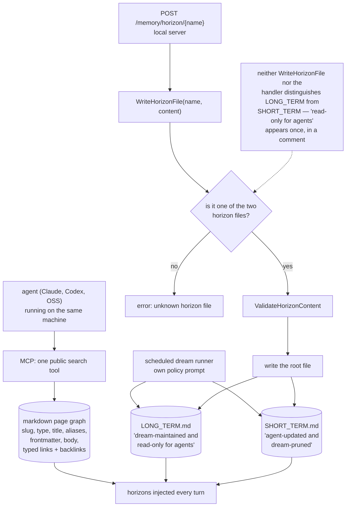

## 1. Executive Summary

Jaz is "a personal AI on machines you own — any agent, loops that run overnight,
boards, memory, and git control": an Electron desktop app over a Go backend,
driving Claude, Codex and open-source agents, Apache-2.0, 2,770 commits since 6
June 2026, 161,184 lines across the tree with 290 Go test files. One of its
stated principles is "[u]nified memory that you control and can export."

The memory is not in this repository. `backend/internal/memoryservice` is
"the single owner of jaz's embedded memory: the jazmem instance, the live
enabled gate, the maintenance scheduler, and the MCP surface", and the engine
is `github.com/gluonfield/jazmem`, pinned at
`v0.0.0-20260912084437-4d801b950d2b`. This report reads that module at exactly
that commit — `4d801b950d2b9a47e196b1f1db823d0efe3349b0`, dated 12 September
2026, 12,028 lines of Go across 21 test files — because a report on the wrapper
would describe none of the mechanism.

The model is a markdown page graph: a page has a slug, a type, a title,
aliases, frontmatter, a body, and typed links with backlinks — "the link type
(reference, mention, or a typed relationship such as `works_at`)". Agents reach
it over MCP through a single public search tool.

The design idea worth examining is the **horizons**. Two root-level files are
"injected into agent context every turn, not indexed pages", and the comment
that introduces them states a division of authority:

> `LONG_TERM.md` is dream-maintained and read-only for agents;
> `SHORT_TERM.md` is agent-updated and dream-pruned.

That is a good split. The long horizon is the store's considered view,
maintained by a scheduled pass with its own policy prompt; the short horizon is
the agent's scratch, pruned by the same pass. Separating what an agent may
write from what it may only read is the distinction most memory systems in this
corpus blur.

It is not enforced. `WriteHorizonFile` validates only that the name is one of
the two horizon files and that the content passes a shape check, then writes;
it draws no distinction between them. Jaz's own
`handleMemoryHorizon` takes the file name from the URL path and passes it
straight through. Searching the engine for the phrase finds "read-only for
agents" exactly once, in that doc comment. Both write paths accept
`LONG_TERM.md`.

Whether that matters depends on who can reach the local HTTP server, and on a
single-user desktop app the honest answer is that anything running on the
machine can — which includes the agents the product exists to run. The
boundary is a convention the dream policy describes, not a constraint the code
holds.

With no scope inside the store, no status on a page, no validity window and no
record of a rejected value, no marks follow. The page graph with typed links
and backlinks is real and useful; the governance is a comment.

## 2. Mental Model

A **page** is markdown with frontmatter, addressed by slug, linked to other
pages by typed edges that are queryable in both directions.

A **horizon** is one of two root files injected into every turn:
`LONG_TERM.md`, maintained by the dream; `SHORT_TERM.md`, written by the agent
and pruned by the dream.

A **dream** is a scheduled pass with its own prompt template that rewrites the
long horizon and prunes the short one.

The **memory service** owns the engine instance, the enabled gate and the
scheduler, so "[e]verything that consumes memory takes this service instead of
re-deriving its own gate."

## 3. Architecture

| Area | Role |
| --- | --- |
| `backend/internal/memoryservice` | The single owner: engine instance, enabled gate, scheduler, MCP surface |
| `backend/internal/memorydream` | The dream runner that maintains and prunes the horizons |
| `backend/internal/memorysource`, `internal/templates/memory*prompt` | Sources and the prompt templates that carry the policy |
| `backend/internal/server/memory.go` | The HTTP endpoints, including the horizon write |
| `jazmem/pkg/jazmem` (pinned dependency) | The model: pages, horizons, retrieval, scheduler, eval, tasks, render |
| `frontend/`, `dist/` | The Electron app |

## 4. Essential Implementation Paths

- `jazmem/pkg/jazmem/horizons.go:10-13` — the division of authority, as prose.
- `:38-46` — `WriteHorizonFile`, which does not implement it.
- `jaz/backend/internal/server/memory.go:238-258` — the endpoint that passes the
  name through.
- `jaz/backend/internal/memoryservice/service.go:1-4` — the single-owner
  comment, which is the right instinct applied elsewhere.
- `jazmem/pkg/jazmem/types.go` — the page and link model.

## 5. Memory Data Model

Pages with typed links and backlinks, and a `LinkRef` that names the link type
rather than treating every edge as the same — reference, mention, or a typed
relationship such as `works_at`. Alongside them, the two horizon files, which
are not pages and are not indexed: they are text injected verbatim each turn.

What is absent is any per-page governance. No status, no validity, no owner, no
supersession link, no record of a deletion.

## 6. Retrieval Mechanics

Search plus graph neighbourhood, exposed to agents as one public search tool.
The horizons bypass retrieval entirely by being injected, which is a legitimate
design — it guarantees the long-term view is present without depending on a
query matching it — and it is why who may write them matters.

## 7. Write Mechanics

Pages through the engine; horizons through the HTTP endpoint or the dream. The
validation on a horizon write is that the name is one of two and the content
passes a shape check.

## 8. Agent Integration

The product is the integration: boards, overnight loops, git control,
connectors to Telegram, WhatsApp, Gmail, Calendar and Slack, and the explicit
principle of reusing the major coding agents rather than reinventing them. The
memory is the shared context those pieces write into.

## 9. Reliability, Safety, and Trust

The gap between the comment and the code is the whole of this section, and it
is worth being precise rather than alarmist. Jaz is a single-user personal
host; there is no other principal to protect against, and an agent overwriting
the long-term horizon damages its owner's memory rather than someone else's.
The failure is a correctness one: the dream's considered long-term view is the
thing injected into every turn, and an agent that rewrites it — by mistake,
or because a prompt injection in one of those connected inboxes told it to —
changes what every future turn believes, with no record that it happened.

Two one-line changes would close it: refuse `LONG_TERM.md` in
`WriteHorizonFile` unless a caller-supplied flag marks the write as the dream's,
or split the endpoint. The rest of this codebase shows the instinct — the
memory service exists precisely so that nothing "re-deriv[es] its own gate" —
which is why the horizon gate being absent reads as an oversight rather than a
decision.

Also worth stating: the engine is a separate module, so what Jaz's memory does
is pinned only as tightly as the Go dependency. This report reads the pinned
commit; a `go get -u` moves it.

## 10. Tests, Evals, and Benchmarks

290 Go test files in Jaz, 21 in the engine, and the engine ships `eval.go` with
a `default_eval.json` — a committed evaluation configuration alongside the
retrieval code. `deep_horizons_test.go` exercises the horizon round-trip
including the rejection of a non-horizon name and a content-shape failure, so
the validations that *do* exist are tested; there is no test asserting that an
agent cannot write the long-term file, because there is no such rule to test.

## 11. For Your Own Build

### Steal

- **Inject the considered view rather than retrieving it.** A long-term horizon
  that is present every turn does not depend on a query matching it.
- **Split what the agent may write from what it may only read**, and give each
  its own maintenance policy. The idea is right even where the enforcement is
  missing.
- **Name one owner for the engine, the gate and the scheduler.** The comment —
  everything that consumes memory takes this service "instead of re-deriving
  its own gate" — is the pattern that keeps a feature flag from being
  reimplemented four times.
- **Type your links.** `reference`, `mention`, and a named relationship are
  three different things, and backlinks make the graph answerable in both
  directions.

### Avoid

- **A write boundary that exists only in a doc comment.** If one file is
  read-only to a caller, the function that writes it should say so; a sentence
  above the constants cannot refuse a request.

### Fit

Reach for this if you want a personal always-on host that drives your existing
agent subscriptions and keeps a markdown memory you can export. Look elsewhere
if you need the store to enforce who may write what, or to model belief.

## 12. Open Questions

- Should `WriteHorizonFile` distinguish the two files, or should the dream have
  a separate entrypoint the HTTP surface cannot reach?
- With connectors to several inboxes, what stops content arriving through them
  from reaching the horizon write path?
- The engine is pinned by Go module version. Is there a policy for moving that
  pin, given the memory model lives there?

## Appendix: File Index

| Path | What to read it for |
| --- | --- |
| `jazmem/pkg/jazmem/horizons.go` | The division of authority, and its absence in code |
| `jazmem/pkg/jazmem/types.go` | Pages and typed links |
| `jaz/backend/internal/server/memory.go` | The horizon write endpoint |
| `jaz/backend/internal/memoryservice/service.go` | The single-owner comment |
| `jaz/backend/internal/memorydream/runner.go` | The dream pass |
| `jazmem/pkg/jazmem/deep_horizons_test.go` | What the horizon round-trip does check |

## History

**2026-09-16** — [`a99018abab31920a3c134a5868eb6342c574530f`](https://github.com/gluonfield/jaz/commit/a99018abab31920a3c134a5868eb6342c574530f) — first reading, at a commit dated 15 September 2026, with the `jazmem` engine read at [`4d801b950d2b9a47e196b1f1db823d0efe3349b0`](https://github.com/gluonfield/jazmem/commit/4d801b950d2b9a47e196b1f1db823d0efe3349b0), the exact commit its `go.mod` pins. Screened before opening, from shallow clones: eight files, no auto-run surfaces, one build-time execution point, one unpinned surface, four dependency files inside the cooldown. Nothing was installed, built or run.
