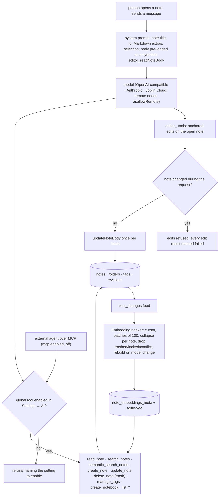

## 1. Executive Summary

Joplin is a note-taking application with sync, nine years old at this
commit — 15,728 commits since 16 January 2017 by the GitHub count, a
`dev` default branch, release 3.7.16 on 6 September 2026, AGPL-3.0-or-later
— and since 12 June 2026 it carries an AI service under
`packages/lib/services/ai/`: 4,250 lines of TypeScript with 130 test cases
in sixteen files, 41 commits in, plus a 147-line MCP server with 26 tests.
The screen found an `.envrc` and a VS Code settings file that run on open
and a long list of manifests inside the seven-day cooldown; nothing was
installed or run, and the clone was shallow, so every count of history here
comes from the GitHub API rather than from `git log`.

The notes are the memory. What the report is about is what the machine may
do to them and how it finds them. A chat is opened on a note; the note's
body is pre-loaded into the transcript as a synthetic `editor_readNoteBody`
tool call so the first turn costs no round trip
(`noteChat.ts:88-110`); the assistant edits through anchored `editor_`
tools whose changes are applied to the body once, after the whole tool
batch, and refused outright if the note changed underneath the request
(`noteChat.ts:300-330`). Beyond the open note there are eleven global tools
— read, search by keyword with Joplin's filter grammar, search by meaning,
create, update, trash, tag, list notebooks and tags, create a notebook, view
an image — and every one of them is a setting that defaults to off
(`builtInMetadata.ts:872-940`), with a refusal that tells the model which
setting to ask the user to flip (`ToolIndex.ts:47-60`). The semantic side
is a background `EmbeddingIndexer` that follows the application's own
`item_changes` feed with a durable cursor, chunks and embeds each modified
note on device, stores the vectors in sqlite-vec, removes them when a note
is trashed, locked or in conflict, and wipes and rebuilds the whole index
when the embedding model's id changes (`EmbeddingIndexer.ts:200-330`).

What is strong is the posture. `ai.enabled` is off; remote providers need a
second opt-in and a LAN address counts as remote; each tool is a switch; a
conversation that outgrows an 80,000-token budget is refused rather than
truncated; an MCP server exposes the same gated tools to outside agents and
is off too. What is weak, in the atlas's terms, is that nothing here is
epistemic: a note has no state the assistant can set, no provenance
distinguishes a sentence the model wrote from one the person did, the only
history is the app's `revisions` table with its ten-minute collapse and
ninety-day expiry, and the chat's own memory is Redux state that a restart
empties. Logseq is the comparison — a human knowledge base agents can write
to — and Joplin's answer to the same question is narrower and more
switchable.

## 2. Mental Model

A memory is a note, and a note is what the person wrote plus what the
assistant was allowed to change. There is no candidate state, no
verification and no decay: a note is true because it is in the notebook.
The assistant reaches a note three ways — the open one, pre-loaded whole;
a keyword hit through `search_notes`, which returns ids, titles and a
240-character snippet anchored on the match; or a chunk through
`semantic_search_notes`, which returns the chunk text and a cosine score
and tells the model to `read_note` for the rest. It changes a note two
ways — the open one through anchored edits collected and applied once per
tool batch, or any note through `update_note`'s partial operations
(`append`, `prepend`, a single-match `replace_text`, a full `body`), each
of which is a normal `Note.save` that enters the change feed, the sync
queue and the revision history exactly as a keystroke would. A note stops
being reachable by `delete_note`, which is the trash — `deleted_time`, a
person restores — and the indexer drops its vectors at the next tick.

The index is a derived view with its own lifecycle. It starts when
`ai.embedding.enabled` is on and sqlite-vec loaded, walks the vault in
batches of a hundred until `initialScanDone`, then reads
`item_changes` from `lastProcessedChangeId`, collapsing repeated edits to
one note per tick, embedding the title twice into the first chunk so
title-anchored queries hit, and advancing the cursor only after the batch
finishes so a crash reprocesses rather than skips. A note that throws
during the initial scan is remembered for the session and retried next
launch. A change of `modelId` clears everything and starts over, because
vectors from two models are not comparable.

Trust is a set of switches a person holds. Whether the assistant may see
anything beyond the open note, whether it may write, whether a remote
model may see the text at all, and whether an outside agent may reach the
tools over MCP are four separate settings, each off. The assistant's
memory of the conversation is the panel's state, separated by a marker
when the person switches notes and gone when the app closes.

## 3. Architecture

Everything runs inside the application process: the desktop app's
`ChatPanel` (`packages/app-desktop/gui/ChatPanel/ChatPanel.tsx`) calls
`runNoteChat` in `packages/lib`, which calls `AiService` for the model and
`ToolIndex` for the tools; the tools call the same `Note`, `Folder`, `Tag`
and `SearchEngineUtils` models the rest of the app uses; the indexer is a
singleton with a timer. `AiService` (`AiService.ts`) builds one provider
from settings — `OpenAiCompatibleProvider` with a classification of local
or remote derived from the base URL's host, where only loopback hosts are
local and *"LAN traffic still requires the user's ai.allowRemote opt-in"*
(`classification.ts:3-6`), `AnthropicProvider`, `JoplinCloudProvider`, which
reads a `tokens_budget` from the response and reports usage to the UI, and
a `TestProvider` for the suite — and re-builds it when any of four settings
change. `LocalEmbeddingProvider` runs multilingual-e5-small through
`OnnxRuntime` after `EmbeddingModelDownloader` fetches it; `SqliteVec.ts`
loads the extension, and `NoteEmbedding.vectorSearchAvailable()` is the one
check every vector path gates on.

Storage is Joplin's SQLite: migration 52 adds `note_embeddings_meta`
(`note_id`, `chunk_index`, `chunk_text`, `model_id`, `created_time`) and the
`note_embeddings_vec` vec0 table is created lazily, joined by rowid. The
embeddings are local state — they are not sync items — while the notes they
index are. `McpServer.ts` is a JSON-RPC router for `initialize`,
`tools/list`, `tools/call` and `ping` over the app's HTTP transport, built on
the same `ToolIndex` without an editor context, so an outside agent gets the
global tools and nothing else. `JoplinAi.ts` gives plugins `chat`,
`search`, `getEmbeddings` (paged by an opaque `v1:<rowid>` cursor, with a
model-consistency check per page) and `getIndexStatus`.

### Deployment and ergonomics

Nothing to stand up: the user installs Joplin, turns on AI in settings,
picks a provider, and optionally lets the embedding model download. Fully
local operation is a local OpenAI-compatible endpoint plus the on-device
embedder; the search and the index need no key. Repair is the app's own —
the trash, the note history, and a settings toggle that clears the index by
changing the model. What degrades without sqlite-vec is stated: the indexer
refuses to start and `semantic_search_notes` reports the configuration
problem to the model.

## 4. Essential Implementation Paths

**Chat loop.** `runNoteChat` (`noteChat.ts:139-170`) builds the history
with `createHistory` — system prompt from `systemPrompt(note)` (`:44-75`),
prior turns minus any old system message, the new message, and on a new
chat the synthetic read — then loops `stepNoteChat` while the last message
is an undelivered tool result, disabling tools after five consecutive
failed rounds. `stepNoteChat` (`:180-220`) asserts the budget
(`assertWithinTokenBudget`, `:225-255`, 80,000 tokens at four characters
each, an error naming the remedy), builds `ToolIndex` for the current
note, calls `AiService.instance().chat(messages, { tools })`, appends the
reply, and runs the tools.

**Tools.** `runTools` (`:270-360`): each call goes through a fresh
`ToolIndex` whose `updateNoteBody` writes into a local `body`; a disabled or
unknown tool gets `describeToolNotFoundFailure`; a `ToolError` is returned
to the model as `failed: <reason>`; after the batch, if any edit succeeded
and the body differs from the initial one, `hadExternalBodyChanges` is
checked and the whole batch of edits is marked failed when the note moved,
otherwise `commands.updateNoteBody(body, initialBody)` writes once.
`ToolIndex.ts:11-27` merges `globalTools` with `buildEditorTools` and reads
`ai.tool.<id>.enabled` per tool, `ai.tool.edit_current.enabled` for the
editor set. `tools/global/updateNote.ts:60-120` loads the note, refuses a
conflict or trashed one, validates a target notebook, and applies title,
notebook, to-do state and one of the body operations; `deleteNote.ts`
calls `Note.batchDelete([id], { toTrash: true })`;
`searchNotes.ts:15-75` runs `SearchEngineUtils.notesForQuery` and anchors a
snippet on the keywords; `semanticSearchNotes.ts:15-70` maps a notebook or
tag to a scope and a relevance name to `SearchService.search`.

**Index.** `EmbeddingIndexer.ts`: `runInBackground` (`:60-80`) with the
sqlite-vec gate, `scheduleNextTick` (`:90-100`) at 30 seconds or 3
minutes, `maintenance` (`:150-175`) → `handleModelChange` (`:180-195`) →
`runInitialScanBatch` (`:240-270`) or `processChangeBatch` (`:200-235`) →
`indexNote` (`:272-320`): load, drop if locked, conflict, trashed or empty,
`chunkText`, title doubled into chunk 0, `provider.embed`, and
`NoteEmbedding.saveChunks`, which deletes the note's chunks first so a
retry is idempotent.

**Search.** `SearchService.search` (`SearchService.ts:150-200`): provider
required, `RELEVANCE_DEFAULTS` (`:24-28`), query vectors from text or from
an indexed note's own chunks, scope resolved to note ids with an empty
scope meaning search nothing, `NoteEmbedding.similaritySearch` at `k`,
cosine from L2 distance (`:55-60`), a floor at `minScore`, best score per
chunk, sorted and cut at `k`.

**Surfaces.** `packages/app-desktop/gui/ChatPanel/ChatPanel.tsx`
(disclosure acknowledgement, Redux history per window, a separator on
note switch at `:137-154`), `packages/lib/services/plugins/api/JoplinAi.ts`,
`packages/lib/services/mcp/McpServer.ts`, `availability.ts` (nine reasons
a feature is unavailable, mirrored before the user types).

**Tests.** `SearchService.test.ts`, `EmbeddingIndexer.test.ts`,
`noteChat.test.ts`, `noteChat.tools.test.ts`, `AiService.test.ts`,
`availability.test.ts`, `chunker.test.ts`, `LocalEmbeddingProvider.test.ts`,
`OnnxRuntime.test.ts`, `SqliteVec.test.ts`, `EmbeddingModelDownloader.test.ts`,
`aiSettingsTransition.test.ts`, the provider tests, `McpServer.test.ts`.

## 5. Memory Data Model

The note is Joplin's: `id`, `title`, `body`, `parent_id`, `is_todo`,
`todo_completed`, `deleted_time`, `is_conflict`, `is_locked`, timestamps,
tags through `note_tags`, resources by id in the body, encryption state.
`item_changes` records every create, update and delete with a type and a
source, and is the feed both sync and the indexer read from. `revisions`
holds diffs the `RevisionService` collects from the same feed, no more often
than `intervalBetweenRevisions` (ten minutes) per note and expiring after
`revisionService.ttlDays` (ninety), so an assistant's edit is versioned the
way a person's is and not more finely. `note_embeddings_meta` and the vec0
table hold one row per chunk with the `model_id`; `Setting` holds the
indexer's three cursors.

Scope is the profile. A notebook and a tag are properties a search may
filter on. Provenance is absent at the note level: nothing records that a
sentence came from `update_note`, and the chat transcript that would show
it is not persisted. Time is the app's `created_time` and `updated_time`,
the revision timestamps and the trash timestamp; there is no validity, no
TTL on content and no pin.

## 6. Retrieval Mechanics

Two arms the model chooses between, both explicit. The keyword arm is
Joplin's search engine with its filter grammar — `notebook:`, `tag:`,
`title:`, `body:`, `type:`, `iscompleted:`, `created:` and `updated:` with
`day-N` shorthands, `due:`, `sourceurl:`, `resource:` — described to the
model in the tool text with examples, returning up to a capped number of
notes with a snippet. The semantic arm is chunk-level cosine over
sqlite-vec with three presets: strict `k=5, minScore 0.86`, normal
`10, 0.83`, loose `20, 0.74`, tuned for multilingual-e5-small whose scores
*"usually"* land in `[0.7, 1]`; a notebook or a tag narrows the candidate
ids first, and an empty scope returns nothing. Results are chunks with
scores, not notes, and the model is told to read the note for the rest.
There is no fusion, no reranker, no automatic injection and no budget on
what the model reads back: `read_note` pages a long body by offset and
character count at the model's discretion, inside the 80,000-token
ceiling the whole transcript is held to.

Failure modes: a keyword query that names a filter wrong returns nothing
with no hint beyond the tool text; a semantic query under `strict` may
return nothing at all, which the test suite treats as legitimate; a note
trashed by mistake is out of both arms until restored; a chunk boundary
can split the fact a query wanted, and the title-doubling is the one
mitigation.

## 7. Write Mechanics

Writes are the model's tool calls, applied synchronously in the chat turn,
under a person's switches. Editor edits are anchored on exact substrings
of the current body and applied together; global writes are ordinary
model saves. Nothing extracts, summarises or consolidates: the assistant
does not learn from the conversation, and the conversation is not stored.
Deduplication, conflict handling and TTL are the app's — a sync conflict
produces a conflict note the tools refuse to touch, `replace_text` errors
when its anchor matches twice or not at all, and nothing expires. Malicious
input is the note itself: a note that instructs the assistant is read into
the transcript whole, and the only defence is the switch set.

### Operational cost

A turn costs one model call plus one per tool round; the indexer costs one
embedding per changed note per tick, batched at a hundred, and a full
re-embed on a model change. A saved note is searchable by meaning within
the next tick — three minutes in steady state — and by keyword at once. The
chat pre-loads the whole note, so the prompt prefix changes with every note
the person opens and the budget is spent on the note before the
conversation.

## 8. Agent Integration

The assistant is a chat panel on a note. Its agency is exactly the enabled
tools, and the default set is one: edit the open note. A person who wants
it to search, read or write elsewhere turns each capability on in
Settings → AI, and the model is told, when it tries a disabled one, which
setting to ask for. Plugins get `joplin.ai.chat`, `search`, `getEmbeddings`
and `getIndexStatus`, so a plugin can build its own memory over the index.
An external agent gets `joplin-mcp` over HTTP JSON-RPC when `mcp.enabled`
is on, with the same tool list and the same switches and, at this commit,
no editor context — it can `update_note` but not anchor-edit. There is no
session boundary in the atlas's sense, because nothing persists across
one: the chat's memory is the panel.

## 9. Reliability, Safety, and Trust

**Provenance.** None on the note; the transcript shows each tool call with
a user-facing description while the panel is open.

**Verification.** None. The note is the truth.

**Injection.** A note's body enters the transcript verbatim and the system
prompt asks the model to keep Joplin's Markdown conventions; there is no
sanitiser. The mitigations are structural — a disabled tool cannot be
called however the note asks — and the disclosure the panel requires
before first use.

**Concurrency.** An edit batch is applied once against the body the turn
started from, and refused when the note changed in the meantime, with
every edit result rewritten as a failure so the model does not believe a
change it did not make. The indexer never overlaps two maintenance runs
and advances its cursor after the batch.

**Data loss.** `delete_note` is the trash. A trashed note's vectors are
gone from the index until it is restored and re-indexed. A model change
drops the entire index and rebuilds from the notes, which are the
canonical store, so the index is always recoverable.

**Privacy.** `ai.enabled` and `ai.allowRemote` are two separate opt-ins,
loopback is the only local host, Joplin Cloud is a remote provider that
reports a token budget, and the disclosure setting gates the panel.

**Uncertainty.** Not represented; a semantic hit carries a score the model
sees and nothing else does.

## 10. Tests, Evals, and Benchmarks

130 cases in sixteen files under `services/ai/`, with the vector cases
skipping where sqlite-vec is absent and saying so. `SearchService.test.ts`
covers the missing provider, ranking, the empty query, folder and tag
scopes, the empty tag, query-by-note-id, the strict-versus-loose monotonic
property, the embeddings pager's cursor, limits, model consistency and
malformed cursor, and sub-chunk narrowing. `EmbeddingIndexer.test.ts`
covers the provider gate, end-to-end indexing, ranking, removal for
deleted and locked notes, skipping trashed and conflict notes, empty
notes, title-only notes, title weighting, cursor advance, model-change
rebuild, non-overlapping maintenance, backfill past the cursor, per-session
failure skipping, the sqlite-vec gate and the status mapping.
`noteChat.test.ts` and `noteChat.tools.test.ts` cover the budget, tool
identifiers, the settings gate and the refusal text. The folder-scope case
is written against vacuity — it queries by the note's own id *"so the
'scope restricts results' check below is non-vacuous"* — and is the case
the `negative_eval` mark rests on.

There is no retrieval-quality evaluation of the semantic index beyond
ranking one note above another with the test provider's bigram embedding,
no benchmark, and no paper; `rg -n -i 'arxiv|bibtex' readme.md` finds no
citation of the AI service. The tests one would want are a prompt-injection
case — a note whose body asks for a disabled tool, asserting the refusal —
and a case that an anchored edit is refused when the note changed, which
`runTools` implements and no test named exercises.

## 11. For Your Own Build

### Steal

- **Tools as settings, with a refusal that names the switch.** Ship every
  capability beyond the current document off, and make the model's failed
  call return the exact setting a user can enable.
- **Pre-load the working document as a tool result.** A synthetic read in
  the transcript saves a round trip and keeps the model's view of the note
  honest about where it came from.
- **Apply an edit batch once, and refuse it when the document moved.**
  Collect edits against the body the turn began with, write once, and mark
  every edit failed when an external change intervened.
- **Ride the application's change feed with a durable cursor,** collapse
  repeated edits per item per tick, advance the cursor after the batch, and
  rebuild the whole index when the model id changes.
- **Write the non-vacuous scope test** and say in the comment why the
  query is by the note's own id.
- **Refuse an oversized conversation rather than truncating it,** and tell
  the user the two remedies.

### Avoid

- **Treating a notebook filter as scope.** An optional narrowing the model
  chooses is not a boundary; anything with a `read_note` and a search sees
  the whole profile.
- **Chunk results without note results.** A semantic hit that returns a
  chunk and asks the model to read the rest spends a tool round on every
  answer.
- **Version history as the only audit.** A ten-minute collapse and a
  ninety-day expiry record what changed, not who or why.
- **An MCP server with the app's switches and none of its own.** The
  tools an outside agent gets are the tools the person enabled for the
  panel.

### Fit

This suits a person who already keeps their life in Joplin and wants an
assistant that can touch it under explicit switches, with a local model
and a local index, and who does not need the assistant to remember
anything between conversations. It is an application feature, not a
library: the tool index, the indexer and the search service are separable
in principle and written against Joplin's models in practice. Walk away if
you need the assistant to learn, to attribute what it wrote, to hold a
belief in a state, or to be confined to a subset of the notes; the design
offers switches, not scopes.

## 12. Open Questions

- Whether the MCP transport gains authentication or a per-client tool
  allow-list; at this commit `mcp.enabled` and the app's shared tool
  switches are the whole policy.
- Whether the chat history will persist per note, and if so where and
  under what deletion; today it is Redux state per window.
- How `read_note`'s paging interacts with the 80,000-token budget on a
  vault of long notes, which no test exercises.
- Whether `revisionService` will record the assistant as the author of a
  revision, which would be the cheapest provenance available.
- What the Joplin Cloud provider's `tokens_budget` is, and whether it
  gates anything client-side beyond the status toast.

## Appendix: File Index

- Chat: `packages/lib/services/ai/noteChat.ts` (system prompt `:44-75`,
  `createHistory` `:77-115`, `runNoteChat` `:139-170`, `stepNoteChat`
  `:180-220`, `assertWithinTokenBudget` `:225-255`, `runTools` `:270-360`),
  `AiService.ts`, `classification.ts`, `availability.ts`,
  `providers/OpenAiCompatible.ts`, `providers/Anthropic.ts`,
  `providers/JoplinCloud.ts`, `aiSettingsTransition.ts`.
- Tools: `packages/lib/services/ai/tools/ToolIndex.ts`, `buildEditorTools.ts`,
  `types.ts`, `utils/settings.ts`, `utils/buildTool.ts`, `global/` (eleven
  tools), `packages/lib/models/settings/builtInMetadata.ts:645-940` (the
  `ai.*` settings and per-tool defaults).
- Index and search: `packages/lib/services/ai/EmbeddingIndexer.ts`,
  `SearchService.ts`, `chunker.ts`, `LocalEmbeddingProvider.ts`,
  `EmbeddingModelDownloader.ts`, `OnnxRuntime.ts`, `SqliteVec.ts`,
  `packages/lib/models/NoteEmbedding.ts`,
  `packages/lib/services/database/types.ts:711-719`.
- Surfaces: `packages/app-desktop/gui/ChatPanel/ChatPanel.tsx`,
  `packages/lib/services/plugins/api/JoplinAi.ts`,
  `packages/lib/services/mcp/McpServer.ts`, `packages/lib/services/RevisionService.ts`.
- Tests: the sixteen files under `packages/lib/services/ai/` named in
  section 4, and `packages/lib/services/mcp/McpServer.test.ts`.
- Searches behind the absence claims: `rg -n -i 'memor' packages/lib/services/ai --glob '!*.test.ts'`
  (the embedding provider and indexer only, as vocabulary); `rg -n 'persist|localStorage|Setting.setValue' packages/app-desktop/gui/ChatPanel/ChatPanel.tsx`
  (the disclosure flag only); `rg -n 'author|source' packages/lib/services/RevisionService.ts`
  (no author on a revision); `rg -n -i 'sanitize|injection' packages/lib/services/ai/noteChat.ts`
  (none); `rg -n 'hadExternalBodyChanges' packages/lib/services/ai/*.test.ts`
  (none); `rg -n -i 'arxiv|bibtex' readme.md` (none).

## History

**2026-09-07** — [`7e73a2a271a1f71a7877a972677b5d588241e552`](https://github.com/laurent22/joplin/commit/7e73a2a271a1f71a7877a972677b5d588241e552) — first reading, at the head of `dev`, the day of release 3.7.16. Read from a shallow clone with the commit counts taken from the GitHub API; screened, with an `.envrc` and a VS Code settings file that run on open and many manifests inside the cooldown; nothing installed or run. One mark, `negative_eval`, for the scope and exclusion cases on the index. `scope_enforced` withheld: a notebook or tag is an optional filter. `audit_log` withheld: `revisions` collapses ten minutes and expires at ninety days, with no author. `human_review`, `trust_state`, `tombstone` and `bitemporal` withheld: edits apply as the tool runs, a note has no state, the trash is a soft delete of the note, and the only times are record times.
