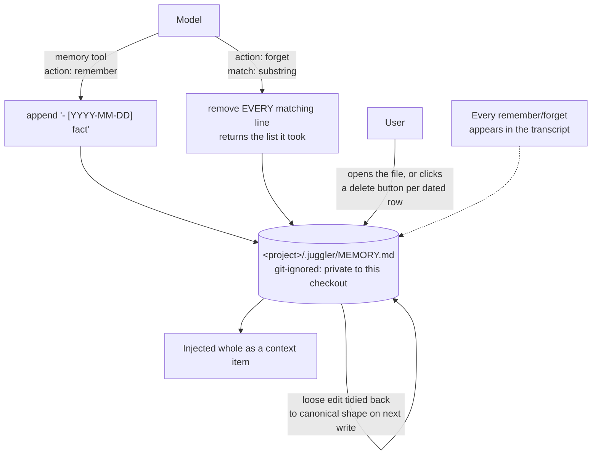

## 1. Executive Summary

Juggler is an AGPL-3.0 coding assistant, and its project memory is 772 lines —
a 637-line context item and a 135-line formatter — with 43 test cases across
five test files against them.

The design is stated plainly in its own documentation and the framing is worth
quoting because it names a distinction this atlas cares about: memory *"is not a
replacement for your agent instructions file (`CLAUDE.md` / `AGENTS.md`): that
file is the instructions **you** write for the assistant; memory is the notes
the **assistant** keeps for itself."* Two artifacts, two authors, one directory —
the atlas's fifth divergence written into a docs page.

**The storage decision is the interesting one.** Memory lives at
`<project>/.juggler/MEMORY.md`, and `.juggler/` is git-ignored, so memory is
*"private to your checkout — never committed, never shared with your team, and
per-machine."* Every other Markdown-notebook system in this corpus —
[Basic Memory](../basic-memory/), [claude-mem](../claude-mem/),
[TigrimOSR](../tigrimosr/) — puts the file somewhere a team could share it, and
several treat git history as the audit trail. Juggler deliberately gives that up
to make the file private, which trades away provenance for a guarantee that the
assistant's notes about a codebase never reach a colleague's review.

The format is strict — `- [YYYY-MM-DD] one fact per bullet` under a single
heading, order preserved — and self-healing: *"if you edit it loosely (extra
blank lines, a missing date), the assistant tidies it back to this canonical
shape the next time it writes."* A hand-editable file that a machine
re-normalises is a real design commitment, and the 185-line `memory-format-test.js`
is where it is defended.

Three affordances put the file in front of the person: it is plain Markdown they
can open, the Memory context item renders each fact on a dated row **with a
delete button**, and every `remember` and `forget` appears in the conversation
transcript as it happens. None of them is a gate, and the report carries no
capability mark — see section 9.

## 2. Mental Model

There is no epistemology. A bullet is true because it is in the file; it stops
being true when a substring match removes it. There is no status, no confidence,
no provenance beyond a date, and no ranking — the whole file goes into context.

What the design *does* model is a discipline about what belongs there. The tool
description tells the assistant to record only things that stay true **across**
sessions — commands, conventions, corrections, architectural constraints — and
explicitly not ephemeral within-task state. That is the write policy most systems
leave to an extraction prompt, stated as a tool contract instead, which makes it
auditable: `memory-system-prompt-test.js` exists to check what the assistant is
told.

Revision is `forget` then `remember`, so a corrected fact is a deletion and an
insertion with a new date rather than an edit. The old text is gone; only the
transcript remembers it existed.

## 3. Architecture

Nothing to run. A Markdown file in a git-ignored directory, read as a context
item, written by one tool. No database, no embedding, no service, no index — and
consequently no operational failure mode more complex than a missing file, which
`lastGoodMemory` guards with a per-path fallback.

## 4. Essential Implementation Paths

- `web/extensions/juggler-core/context-items/memory-context-item.js` (637) —
  the tool schema, validation, execution, badges, seeding.
- `web/extensions/juggler-core/context-items/memory/memory-format.js` (135) —
  the canonical format and its re-tidying.
- `web/js-tests/unit-tests/memory-item-test.js` (229),
  `memory-format-test.js` (185), `memory-system-prompt-test.js` (134),
  `memory-seed-test.js` (114), `integration-tests/memory-tests.js` (200).
- `docs/memory.md` — the model, stated for users.

## 5. Memory Data Model

A line. `- [2026-06-14] Build is \`make build\`, never \`go build\`` is the whole
unit, and the examples in the documentation are unusually good at showing what
the format is for: a build command, a prohibition the user issued, a
non-obvious architectural constraint.

The date is a record date — when the assistant wrote the line, not when the fact
became true — so there is one clock and no bi-temporality. Order is preserved as
written rather than sorted, which means the file reads as a log and a reader can
see what the assistant learned recently without a timestamp comparison.

## 6. Retrieval Mechanics

There are none to speak of, and that is coherent at this size: the file is
injected whole as a context item once it exists. No search, no embedding, no
relevance, no budget beyond whatever the file has grown to. The design's implicit
bet is that a memory file curated by a strict write policy and a delete button
stays small enough to read entirely, and nothing in the repository enforces or
measures that.

## 7. Write Mechanics

Writes block and are the assistant's own tool calls. `remember` appends one
dated fact; `forget` takes a `match` string, validated as required, and removes
*"the entry/entries"* matching it case-insensitively. Validation rejects any
action that is not one of the two and rejects a `forget` with no match string.
Seeding is best-effort with an explicit comment that a failed seed *"must never
fail the remember/forget tool"*.

**The substring match is still the risk, and the receipt is the mitigation.**
`forget` with `match: "build"` removes every line containing "build". What
changed is that `removeMatching` collects the text of each entry it drops and the
tool returns it — `{ action: 'forget', match, removed, entryCount }` — so the
transcript that already showed the call now shows the three unrelated facts that
matched with it. That does not narrow the blast radius; it makes it visible at
the moment it happens, to the person who can still retype what was lost. A
deletion primitive whose reach is decided by a model's choice of substring is
the one place this otherwise careful design trusts the model with something
sharp, and a receipt is the cheapest thing that makes the trust recoverable.

**There is now a precise deletion path beside the fuzzy one.**
`pins/memory-pin.js` renders the file as a card with a delete control per entry,
and that control calls `removeEntry`, which matches on date *and* exact text
rather than on a substring — one bullet, named exactly. The card re-reads the
file before each write, under a comment giving the reason: *"Each deletion reads
the file again before writing, so it preserves changes made since the card was
drawn."* For a memory that is a file two processes and a human can all edit, that
is the correct amount of care, and it is where `human_review` now rests.

## 8. Agent Integration

The memory tool is one context item among Juggler's extension surface, following
the `plan` plugin's idiom for tool-action badges. Writes are visible in the
transcript as they happen, which is a small and effective transparency
mechanism: the user does not have to open the file to know it changed.

## 9. Reliability, Safety, and Trust

**`human_review` was withdrawn on the 2026-09-19 re-read**, and the previous
reading had already described why in the same breath as awarding it: the review
is *"in its post-hoc form: a person inspects and deletes rather than approves in
advance."* When the rubric narrowed on 2026-09-18 to require that a memory wait
in a state until an actor the producing agent cannot be resolves it, that
sentence became the verdict. The delete control is real — the pin re-reads the
file, calls `removeEntry` on an exact date-and-text match and writes back, so a
concurrent change survives (`web/extensions/juggler-core/pins/memory-pin.js:170-192`)
— and what it removes is a fact the assistant wrote and has already been serving.
The transcript visibility is the same shape: a person watches a write land, not a
write wait. For a per-project notebook whose only writer is the assistant in
conversation in front of the user, that is a reasonable design; it is not this
mark.

**No tombstone.** A forgotten fact leaves no trace, and the assistant is free to
re-record it next session having been told the same thing again. For a per-project
notebook with no extraction pipeline the exposure is small — the only writer is
the assistant, in conversation, in front of the user — but the mechanism is
absent.

**No trust state, no bi-temporality, no scope filter, no audit log.** The
gitignore decision is worth reading as a governance choice rather than an
omission: it forgoes git history as an audit trail on purpose, in exchange for
the file never being shared.

## 10. Tests, Evals, and Benchmarks

43 test cases across five files against 772 lines of implementation, none run
here. The distribution is the interesting part — separate suites for the item,
the format, the seed and the **system prompt**. Testing the text the model is
told about a tool is rare in this corpus and is exactly right for a design whose
write policy lives in a prompt rather than in a gate.

No benchmark, no retrieval measurement, no published numbers, and none claimed.
No negative assertion was found; the one this design invites is that a `forget`
with a match string does not remove a non-matching neighbour.

## 11. For Your Own Build

### Steal

- **Separate the file the user writes from the file the assistant writes,** and
  say so in the documentation. Conflating instructions with memory is how a
  user's directive quietly becomes an assistant's guess.
- **Pick a canonical line format and re-tidy on write.** A file a human can edit
  loosely and a machine normalises is more durable than one that requires either
  party to be careful.
- **Put a delete control on each fact.** It is the cheapest human-review surface
  in this atlas and it converts "the assistant knows something wrong" from a
  support question into a click.
- **Show every write in the transcript.** Memory that changes silently is memory
  the user stops trusting.
- **Test the system prompt.** If your write policy lives in prose handed to a
  model, that prose is code.

### Avoid

- **Deleting by substring.** Match on an identifier, or return what you removed
  so the transcript carries it. A model choosing a short match string is a
  multi-fact deletion with no receipt.
- **Assuming the file stays small.** Whole-file injection with no budget has one
  failure mode and it arrives gradually.

### Fit

This is the right shape for a single-developer coding assistant where memory is
a handful of project conventions and the user is present to correct it. The
privacy decision — gitignored, per-machine — makes it a good fit for a codebase
where an assistant's notes might contain things nobody wants in a pull request,
and a bad fit for a team that wants shared conventions to propagate.

Look elsewhere if memory has to hold anything you will need to prove you
deleted, or anything a second person should see.

## 12. Open Questions

- **How large do these files get in practice?** Whole-file injection with no cap
  and no ranking is the design's one unbounded quantity.
- **What does `forget` actually remove?** The tool returns without enumerating
  its casualties; whether the UI shows them was not traced.
- **Does the re-tidy ever lose a hand-edit?** The format is normalised on the
  next write, and what happens to a line a user wrote in a shape the formatter
  does not recognise was not established.

## Appendix: File Index

| Path | Lines | What it holds |
| --- | --- | --- |
| `web/extensions/juggler-core/context-items/memory-context-item.js` | 637 | Tool schema, validation, execution, badges |
| `web/js-tests/unit-tests/memory-item-test.js` | 229 | Item behaviour |
| `web/js-tests/integration-tests/memory-tests.js` | 200 | End-to-end |
| `web/js-tests/unit-tests/memory-format-test.js` | 185 | The canonical format |
| `web/js-tests/unit-tests/memory-system-prompt-test.js` | 134 | What the model is told |
| `web/extensions/juggler-core/context-items/memory/memory-format.js` | 135 | Formatting and re-tidying |
| `web/js-tests/unit-tests/memory-seed-test.js` | 114 | Seeding |

## Appendix: Recorded Searches

Run from the root of the checkout at the pinned commit.

| Claim | Command | Result at this pin |
| --- | --- | --- |
| `forget` is still a substring match | read `removeMatching` at `web/extensions/juggler-core/lib/memory-format.js:138-151` | `e.text.toLowerCase().includes(needle)` |
| The tool returns what it removed | read `memory-context-item.js:382-385` | `{ action: 'forget', match, removed, entryCount }` |
| The pin deletes by exact match | read `removeEntry` at `memory-format.js:122-130` | `entry.date === targetDate && entry.text === targetText` |
| The pin re-reads before each write | read `pins/memory-pin.js:72-73` and `:182` | The comment states it; `removeEntry` is called on freshly read content |
| Nothing else records a deletion | `grep -rn "removed" --include="*.js" web/extensions/juggler-core \| grep -v _tests` | The tool return value only; no durable log |

## History

**2026-09-19** — re-pinned to [`4908d8d0098f1aebacdf060ab11404b8a2fbe457`](https://github.com/juggler-ai/juggler/commit/4908d8d0098f1aebacdf060ab11404b8a2fbe457). **`human_review` is withdrawn, and the report now carries no capability mark.** The first reading was made on 2026-09-17, a day before the rubric narrowed, and it named the finding while awarding the mark — *"in its post-hoc form: a person inspects and deletes rather than approves in advance."* The delete control is unchanged and still careful: it re-reads the file, removes one entry on an exact date-and-text match and writes back, so a concurrent edit is preserved. What it acts on is a fact already in the file and already being served. The three affordances in section 1 are re-described as what they are — the file is open, the row has a button, the write is visible in the transcript — none of which holds a memory pending a decision. Screened again first; nothing installed or run.

**2026-09-17** — [`7d8a860df9e8f5815108869f8868eaa961061e38`](https://github.com/juggler-ai/juggler/commit/7d8a860df9e8f5815108869f8868eaa961061e38) — re-read after 48 commits. `memory-pin.js` is byte-identical, so the mark rests on unchanged code — the per-entry delete control still calls `removeEntry` on an exact match at `:182`. Only its test file moved. Nothing was installed, built or run.

**2026-09-11** — [`7d8a860df9e8f5815108869f8868eaa961061e38`](https://github.com/juggler-ai/juggler/commit/7d8a860df9e8f5815108869f8868eaa961061e38) — re-read, 1,348 files and 210,633 insertions past the previous pin in a single commit; the memory paths took about a thousand of those. **`human_review` re-verified and its basis strengthened.** The previous edition's *"nothing records what it removed"* is stale: `removeMatching` collects the text of every entry it drops and `memory-context-item.js:385` returns it as `removed` alongside the match string, so a substring `forget` that takes three unrelated facts says so in the transcript. The substring semantics are unchanged, so the reach is still the model's choice; what changed is that the over-reach is visible at the moment it happens. **A precise deletion path was added beside the fuzzy one**: `pins/memory-pin.js` renders the file as a card with a per-entry delete that calls `removeEntry`, matching date *and* exact text, and re-reads the file before each write under a comment giving the reason — *"so it preserves changes made since the card was drawn."* For a memory that is a file two processes and a person can all edit, that is the right amount of care, and it is where the mark now rests. Screened before reading: ten findings; nothing was installed or run.

**2026-07-30** — [`bf81e61087a6e6af24e5ffd225d66c74135a4faa`](https://github.com/juggler-ai/juggler/commit/bf81e61087a6e6af24e5ffd225d66c74135a4faa) — first reading.
