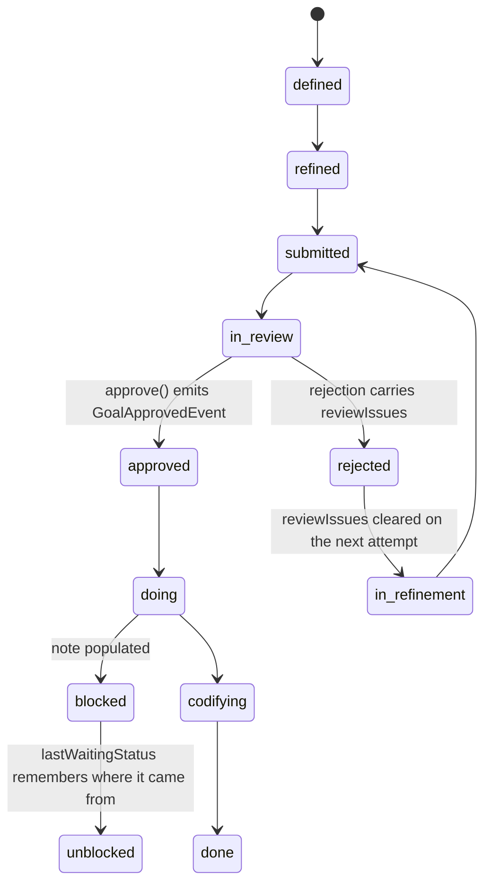

## 1. Executive Summary

Jumbo Context is a harness-agnostic CLI that gives coding agents project memory:
"Agents shouldn't have to be re-taught your project every session." AGPL-3.0,
roughly 150,000 lines of TypeScript with **587 test files**, working across
Claude, Codex, Antigravity and Copilot.

**It is the cleanest event-sourced memory in this atlas.**

`FsEventStore.append` writes one JSON file per event into a per-aggregate stream
directory, named `000001.GoalApproved.json` — zero-padded sequence, then the
event type — and it writes it correctly: to a temp file first, then `fs.move`,
with the reason in the comment, "Atomic write: write to temp file then rename to
prevent corruption from concurrent processes or interrupted writes."

`BaseEvent` requires `type`, `aggregateId` (the stream id), `version` ("event
version within the stream (optimistic concurrency)") and `timestamp`. Twelve
domain aggregates — goals, decisions, invariants, dependencies, relations,
audiences, audience-pains, value-propositions, components, guidelines,
architecture, project — each with an `EventIndex`, and every single SQLite table
in the schema is named `*_views`: `goal_views`, `decision_views`,
`invariant_views`, `relation_views`, `session_summary_views`. There is no table
holding state that is not derived.

That is the [log-and-projection](../../patterns/) shape argued for rather than
approximated, and it is the third position on it in this batch:
[Vibe Cognition](../vibe-cognition/) journals before mutating a graph;
[CortexGraph](../cortexgraph/) argues in a spec for abandoning its log entirely;
Jumbo has no state to abandon it for.

**And there is one field that would make the log answer the question the atlas
cares most about, set by nothing.** `BaseEvent` declares:

```ts
readonly loggedBy?: "human" | "machine";
```

A search of the whole tree for `loggedBy` returns exactly one line — the
declaration. Every event in every stream is silent about whether a person or an
agent produced it, in a system whose entire design is built to answer questions
about the past.

## 2. Mental Model

There is no memory row. There is a stream per aggregate, and the current state
of a goal or a decision is the fold of its events. A correction is not an edit;
it is another event whose application changes the fold.

The goal aggregate is the richest and shows what that buys. `GoalStatus` has
fourteen values — `defined`, `refined`, `doing`, `blocked`, `paused`, `done`,
`in-review`, `approved`, `in-refinement`, `rejected`, `unblocked`, `submitted`,
`codifying` — with `WAITING_STATES` and `IN_PROGRESS_STATES` as declared sets
rather than inline conditions, and rules as their own classes (`CanSubmitRule`,
`CanCodifyRule`, `CanCloseRule`).



Two details on that machine are the kind of thing event sourcing makes cheap and
most state columns get wrong. `reviewIssues` is "populated when rejected with
review findings" and explicitly cleared on the next attempt, so a stale rejection
reason cannot survive a resubmission. And `lastWaitingStatus` "tracks the waiting
state entered from when transitioning to in-progress", so unblocking returns to
the right place rather than a default.

## 3. Architecture

A clean layered separation — `domain/`, `application/`, `infrastructure/`,
`presentation/` — with the event store behind an `IEventStore` interface and
`FsEventStore` as the filesystem implementation.

An in-process event bus (`InProcessEventBus`) and a `ProjectionBusFactory` drive
the SQLite projections; `SqliteWorkerIdentityRegistry` and a worker table support
the concurrent-agent claim, and daemons run the background side.

The operational shape is a CLI over a directory: the events are files a person
can read with `cat`, and the database is disposable. `schema_migrations` exists
for the projections, which is the right place for migrations in this design —
the log never migrates.

## 4. Essential Implementation Paths

**Append** — `infrastructure/persistence/FsEventStore.ts:24-41`: ensure the
stream directory, count files for the next sequence, stamp `seq`, write to a
temp path, `fs.move` with overwrite.

**Read** — `readStream` folds a stream's files in filename order, which is why
the zero-padding matters.

**Project** — `messaging/InProcessEventBus.ts` → `ProjectionBusFactory` →
per-aggregate projections into `*_views`.

**Decide** — `domain/goals/Goal.ts`, with `approve()` at `:798` emitting a
`GoalApprovedEvent`, and the rules classes gating transitions.

**Surface** — `presentation/cli/banner/BannerContextGatherer.ts` assembles the
session-start context.

## 5. Memory Data Model

The event is the model. `BaseEvent` is six fields and everything else is a
payload, which is the correct minimum: type, stream, version, timestamp, the
unset `loggedBy`, and the payload.

`StoredEvent` adds `seq` and is explicitly scoped — "This type exists only in
the infrastructure layer" — so the domain never sees a storage concern. That
separation is why the store could be replaced with a database without touching
a single aggregate.

The projection tables are wide and denormalised by design, one per aggregate
type plus `search_index_entries`. A projection bug is not data loss here; it is
a rebuild.

`Goal` carries `branch` and `worktree` — "git branch for multi-agent
collaboration", "git worktree path" — so a goal knows which working tree it
belongs to. For concurrent agents on one project that is the field that stops two
of them believing they are working on the same thing.

## 6. Retrieval Mechanics

Queries run against projections and a `search_index_entries` table, and the
primary read is not a query at all: `BannerContextGatherer` assembles what the
agent needs at session start, which is the same "bootstrap rather than search"
position [Empirica](../empirica/) takes.

Scope is per-project. There is no tenant key and no cross-project boundary on
the read path, which is right for a CLI operating in a working directory and is
why `scope_enforced` is withheld.

## 7. Write Mechanics

Appends carry a `version` for optimistic concurrency, and the write is atomic at
the filesystem level. Concurrent agents are a first-class concern — the worker
identity registry exists for it — and the failure mode the atomic write prevents
is named in the comment.

Correction is structurally sound and epistemically silent. Because nothing is
mutated, the history of a goal or a decision is complete and replayable: what it
was, when it changed, and to what. What the log cannot tell you is **who** —
`loggedBy` is unset, so an event recorded by an agent and one recorded by a
person are indistinguishable after the fact.

That matters more here than in most systems, because the whole value proposition
is that the log is trustworthy. A rejected goal with `reviewIssues` populated
reads as a considered human judgement; it may equally have been an agent's.

There is no rejected-value record. A decision reversed by a later event can be
re-made by a third, and the stream will show all three.

## 8. Agent Integration

Harness-agnostic by design — one CLI, four named agent families — plus a
`JUMBO.md` project file, automatic goal specification, and extended context
handling. The banner is the integration surface: an agent starts and receives
the project's current state assembled from projections.

## 9. Reliability, Safety, and Trust

**Audit log — awarded, in its strongest possible form.** The append-only event
store is not a record beside the memory; it *is* the memory. Every state is a
fold, every change is a file, ordering is explicit in the filename, and the
write is atomic against interruption and concurrency. Nothing here can be
mutated without leaving an event.

**Human review — awarded.** `in-review`, `approved` and `rejected` are
first-class states in a fourteen-value machine, `approve()` emits its own event,
rejection carries `reviewIssues`, and the rules classes gate whether a
transition is legal. This is a review workflow with a durable record of every
verdict.

The caveat belongs in the same paragraph: with `loggedBy` unset, the record
cannot show that a human made the human review. The workflow is real and its
actor is not recorded.

**Trust state — withheld.** The status machine is rich and it is about *work*,
not about belief: `approved` means a goal was accepted for execution, not that a
claim is true. Invariants and decisions are stored as facts about the project
with no verification field.

**Scope, bitemporal, tombstone, negative eval — no.**

## 10. Tests, Evals, and Benchmarks

**No paper.** 587 test files against roughly 150,000 lines is the highest test
density in this pass, and for an event-sourced system it is the right investment
— projections are where the bugs live, and they are pure functions of a stream.

A `benchmarks/` directory exists. No committed result, dataset or score was
found, and no retrieval-quality claim appears in the README — the pitch is
continuity and token cost, not recall accuracy.

**I ran nothing.** The screen flagged build-time execution in `package.json` and
one unpinned dependency surface; the tree was read.

## 11. For Your Own Build

### Steal

- **Make every table a projection and name it so.** `goal_views`,
  `decision_views`, `relation_views` — a reader can tell at a glance that the
  database holds nothing authoritative, and a projection bug is a rebuild rather
  than a data-loss incident.
- **Write events to a temp file and rename.** Two lines, and it is the
  difference between a torn write on interruption and a store that is always
  consistent.
- **Zero-pad the sequence into the filename.** `000001.GoalApproved.json` sorts
  correctly in every tool, and the type in the name means `ls` is a readable
  history.
- **Keep `seq` in the infrastructure type only.** "This type exists only in the
  infrastructure layer" is why the store is replaceable.
- **Declare the state sets, don't inline them.** `WAITING_STATES` and
  `IN_PROGRESS_STATES` as named sets stop fourteen states becoming fourteen
  scattered conditionals.
- **Clear the rejection reason on resubmission.** `reviewIssues` explicitly
  cleared is a one-line guard against a stale verdict outliving the thing it was
  about.
- **Remember where a blocked item came from.** `lastWaitingStatus` means
  unblocking returns to the real prior state rather than a default.
- **Put the worktree on the work item.** For concurrent agents, `branch` and
  `worktree` on the goal are what stop two of them colliding.

### Avoid

- **Do not declare `loggedBy` and never set it.** This is one field, on the base
  type every event extends, in a system whose entire value is a trustworthy
  history — and it is the field that would separate a human decision from an
  agent's. Setting it is a constructor argument; not setting it means the log
  answers "what and when" and never "who".
- **Do not read an approval workflow as human oversight without checking the
  actor.** The states are real, the verdicts are durable, and nothing records
  that a person cast them.

### Fit

This suits a developer or small team who want project context to survive
sessions and agent changes, and who are comfortable with a CLI and a directory
of JSON. The harness-agnostic claim is genuine and the concurrency work behind
it is real.

The architecture is the thing to steal even if the product is not for you.
`FsEventStore.ts` is under a hundred lines and is the clearest small event store
in this atlas; the twelve aggregates around it show what a domain model looks
like when nothing is mutable.

## 12. Open Questions

- **Was `loggedBy` ever set?** It is declared as optional in the base type,
  which suggests it was intended for events where the distinction was known.
- **How does the projection rebuild handle a schema change?**
  `schema_migrations` exists for the views; whether a rebuild-from-log path is
  exercised, or only forward migration, was not traced.
- **What happens when two agents append to one stream concurrently?** `version`
  is documented as optimistic concurrency and `nextSeq` is computed from a
  directory listing; whether the append rejects on a version mismatch, and where,
  was not traced.
- **What is in `benchmarks/`?** A directory with no committed result.

## Appendix: File Index

**Event store** — `src/infrastructure/persistence/FsEventStore.ts` (`append`
`:24-41`, the atomic-write comment `:35-36`, `StoredEvent` and its layer note
`:8-14`), `src/application/persistence/IEventStore.ts`

**The base event** — `src/domain/BaseEvent.ts` (the six fields, `loggedBy` at
`:14`)

**Aggregates** — `src/domain/` (twelve `EventIndex.ts` files),
`src/domain/goals/Goal.ts` (state `:35-53`, `approve()` `:798`, the rejection
and clearing logic `:200-266`), `src/domain/goals/Constants.ts:35-53`
(`GoalStatus`), `:121-132` (the state sets), `src/domain/goals/rules/`

**Projections** — `src/infrastructure/messaging/InProcessEventBus.ts`,
`ProjectionBusFactory.ts`, `src/domain/relations/RelationProjection.ts`,
`src/domain/value-propositions/ValuePropositionProjection.ts`

**Schema** — the `*_views` tables plus `search_index_entries`, `workers`,
`schema_migrations`

**Concurrency** — `src/infrastructure/host/workers/SqliteWorkerIdentityRegistry.ts`,
`src/infrastructure/host/HostBuilder.ts`, `src/infrastructure/daemons/`

**Presentation** — `src/presentation/cli/banner/BannerContextGatherer.ts`,
`src/cli.ts`, `JUMBO.md`

**Tests** — `tests/` (587 files)

## History

**2026-08-09** — [`6800f0530068168522d6cf3d854b2d0bc5fa4bb6`](https://github.com/jumbocontext/jumbo.cli/commit/6800f0530068168522d6cf3d854b2d0bc5fa4bb6) — first reading. Screened before reading: no auto-run surface, build-time execution declared in `package.json`, one unpinned dependency surface. The tree was read, never installed, and no test was run.
