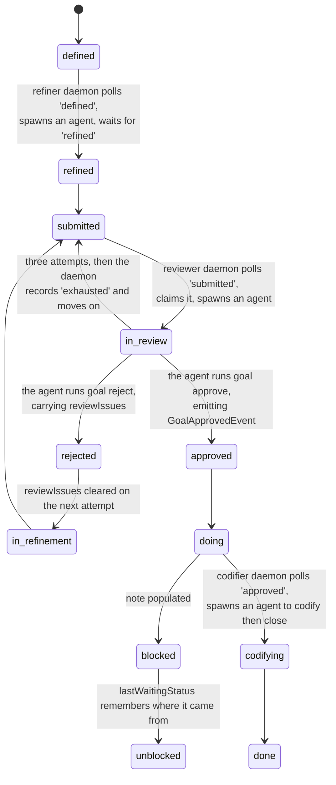

## 1. Executive Summary

Jumbo Context is a harness-agnostic CLI that gives coding agents project memory:
"Agents shouldn't have to be re-taught your project every session." AGPL-3.0,
79,759 lines of TypeScript under `src/` against 72,618 under `tests/` across
**664 test files** — near one-to-one — working across Claude, Codex, Antigravity
and Copilot.

**It is the cleanest event-sourced memory in this atlas.**

`FsEventStore.append` writes one JSON file per event into a per-aggregate stream
directory, named `000001.GoalApproved.json` — zero-padded sequence, then the
event type — and it writes it correctly: to a temp file first, then `fs.move`,
with the reason in the comment, "Atomic write: write to temp file then rename to
prevent corruption from concurrent processes or interrupted writes."

`BaseEvent` requires `type`, `aggregateId` (the stream id), `version` ("event
version within the stream (optimistic concurrency)") and `timestamp`. Thirteen
domain aggregates — goals, decisions, invariants, dependencies, relations,
audiences, audience-pains, value-propositions, components, guidelines,
architecture, sessions, project — each with an `EventIndex`, and fourteen of the
seventeen SQLite tables are named `*_views`: `goal_views`, `decision_views`,
`invariant_views`, `relation_views`, `session_summary_views`.

That is the [log-and-projection](../../patterns/) shape argued for rather than
approximated, and it is the third position on it in this batch:
[Vibe Cognition](../vibe-cognition/) journals before mutating a graph;
[CortexGraph](../cortexgraph/) argues in a spec for abandoning its log entirely;
Jumbo has almost no state to abandon it for.

**And the rebuild is a command, not a claim.** `jumbo heal` — "Rebuild database
projections from the event store" — closes the connection, builds a fresh
database at `jumbo.db.rebuild`, runs every namespace migration, replays all
persisted events through **projection-only** handlers, and swaps it in. The
projection-only part is the detail worth having: cascades and maintenance
registrars are excluded because "their output events are already in the event
store from original execution and are replayed naturally", which is the trap a
naive replay falls into.

One value does not survive that trip. Three tables are not views;
`schema_migrations` and `search_index_entries` are bookkeeping, and `workers`
is fed by a `WorkerIdentifiedEvent` projector that inserts `event.payload.mode`
— but `SqliteWorkerIdentityRegistry.setMode` writes
`UPDATE workers SET mode = ? WHERE hostSessionKey = ?` directly, and the workers
aggregate has exactly one event type. A worker's mode is the one value here
mutated without an event, so `jumbo heal` returns it to whatever it was at
identification.

**And there is one field that would make the log answer the question the atlas
cares most about, set by nothing.** `BaseEvent` declares:

```ts
readonly loggedBy?: "human" | "machine";
```

A search of the whole tree for `loggedBy` returns exactly one line — the
declaration. Every event in every stream is silent about whether a person or an
agent produced it, in a system whose entire design is built to answer questions
about the past.

**The question has an answer, and it is the one the field exists to record.**
`jumbo work review --agent claude` is a shipped command: "Long-running daemon that
continuously polls for goals in 'submitted' state and delegates their QA review
to an agent subprocess. Runs until killed." It claims a submitted goal, moves it
into review, and hands an agent the prompt "If the implementation passes QA, run:
`jumbo goal approve --id …`", retrying three times before recording the goal as
exhausted. Two sibling daemons do the same for refinement and codification. The
protocol the reviewer follows ships as an agent skill. So the approvals in the
log were, by design, cast by a machine — and `loggedBy` is the field that would
say so.

## 2. Mental Model

There is no memory row. There is a stream per aggregate, and the current state
of a goal or a decision is the fold of its events. A correction is not an edit;
it is another event whose application changes the fold.

The goal aggregate is the richest and shows what that buys. `GoalStatus` has
fourteen members and thirteen distinct values — `defined`, `refined`, `doing`,
`blocked`, `paused`, `done`, `in-review`, `approved`, `in-refinement`,
`rejected`, `unblocked`, `submitted`, `codifying` — because `COMPLETED` and
`DONE` are both `'done'`, which the file itself flags: "Note: DONE and COMPLETED
both resolve to 'done' — single entry covers both". `TERMINAL_STATES` is
declared with both and is a one-member `Set` at runtime.

Four state sets are declared rather than inlined — `WAITING_STATES`,
`IN_PROGRESS_STATES`, `TERMINAL_STATES` and `SATISFIED_PREREQUISITE_STATUSES`,
the last encoding "a prerequisite goal must be at SUBMITTED or later to allow
dependent goals to start" — alongside a reset-target map that documents its own
gap ("DOING is excluded because it has multiple entry points"). Rules are their
own classes (`CanSubmitRule`, `CanCodifyRule`, `CanCloseRule`).



Two details on that machine are the kind of thing event sourcing makes cheap and
most state columns get wrong. `reviewIssues` is "populated when rejected with
review findings" and explicitly cleared on the next attempt, so a stale rejection
reason cannot survive a resubmission. And `lastWaitingStatus` "tracks the waiting
state entered from when transitioning to in-progress", so unblocking returns to
the right place rather than a default.

## 3. Architecture

A clean layered separation — `domain/`, `application/`, `infrastructure/`,
`presentation/` — with the event store behind an `IEventStore` interface and
`FsEventStore` as the filesystem implementation.

An in-process event bus (`InProcessEventBus`) and a `ProjectionBusFactory` drive
the SQLite projections; `SqliteWorkerIdentityRegistry` and a worker table support
the concurrent-agent claim.

The background side is three daemons, and they are the operating model rather
than an accessory. `refiner.daemon.ts`, `reviewer.daemon.ts` and
`codifier.daemon.ts` share one shape: a `PollingLoop` over an `IntervalTicker`
(30 seconds by default), `selectEligibleGoals` filtered through `GoalClaimPolicy`
against this worker's id, a prompt built for the goal, `AgentCliGateway.invoke`,
and up to three attempts before the goal is recorded `exhausted` and the loop
moves on. Each polls a different status — `defined`, `submitted`, `approved` —
so the three of them walk a goal from definition to closure without a person in
the loop. The default agent in `reviewer.daemon.ts` is `codex`.

The operational shape is a CLI over a directory: the events are files a person
can read with `cat`, and the database is disposable. `schema_migrations` exists
for the projections, which is the right place for migrations in this design —
the log never migrates.

## 4. Essential Implementation Paths

**Append** — `infrastructure/persistence/FsEventStore.ts:24-41`: ensure the
stream directory, count files for the next sequence, stamp `seq`, write to a
temp path, `fs.move` with overwrite.

**Read** — `readStream` folds a stream's files in filename order, which is why
the zero-padding matters.

**Project** — `messaging/InProcessEventBus.ts` → `ProjectionBusFactory` →
per-aggregate projections into `*_views`.

**Decide** — `domain/goals/Goal.ts`, with `approve()` at `:798` emitting a
`GoalApprovedEvent`, and the rules classes gating transitions.

**Adjudicate** — `jumbo work review --agent <id>` →
`ReviewerProcessManager.selectEligibleGoals` (goals at `submitted` this worker
can claim) → `ReviewGoalController` moves the goal into review →
`AgentCliGateway.invoke` with `buildPrompt` → the agent runs `jumbo goal approve`
or `jumbo goal reject`, and the manager polls until the status is one of those
two.

**Surface** — `presentation/cli/banner/BannerContextGatherer.ts` assembles the
session-start context.

## 5. Memory Data Model

The event is the model. `BaseEvent` is six fields and everything else is a
payload, which is the correct minimum: type, stream, version, timestamp, the
unset `loggedBy`, and the payload.

`StoredEvent` adds `seq` and is explicitly scoped — "This type exists only in
the infrastructure layer" — so the domain never sees a storage concern. That
separation is why the store could be replaced with a database without touching
a single aggregate.

The projection tables are wide and denormalised by design — one per aggregate
type, two for sessions, plus `search_index_entries`. A projection bug is not
data loss here; it is `jumbo heal`.

`Goal` carries `branch` and `worktree` — "git branch for multi-agent
collaboration", "git worktree path" — so a goal knows which working tree it
belongs to. For concurrent agents on one project that is the field that stops two
of them believing they are working on the same thing.

## 6. Retrieval Mechanics

Queries run against projections and a `search_index_entries` table, and the
primary read is not a query at all: `BannerContextGatherer` assembles what the
agent needs at session start, which is the same "bootstrap rather than search"
position [Empirica](../empirica/) takes.

`SqliteGoalContextAssembler` is the assembly step and it filters:
`allRelations.filter(r => r.status === 'active')` at `:51`, so a removed relation
does not put its entity into the goal's context. The committed tests for that
line are the reason this report carries `negative_eval` — see section 9. Jumbo
also ships `jumbo decision show <id>`, a direct read of one architectural
decision record through `LocalShowDecisionGateway`, in text or JSON.

Scope is per-project. There is no tenant key and no cross-project boundary on
the read path, which is right for a CLI operating in a working directory and is
why `scope_enforced` is withheld.

## 7. Write Mechanics

Appends carry a `version` for optimistic concurrency, and the write is atomic at
the filesystem level. Concurrent agents are a first-class concern — the worker
identity registry exists for it — and the failure mode the atomic write prevents
is named in the comment.

Correction is structurally sound and epistemically silent. Because nothing is
mutated, the history of a goal or a decision is complete and replayable: what it
was, when it changed, and to what. What the log cannot tell you is **who** —
`loggedBy` is unset, so an event recorded by an agent and one recorded by a
person are indistinguishable after the fact.

That matters more here than in most systems, because the whole value proposition
is that the log is trustworthy. A rejected goal with `reviewIssues` populated
reads as a considered human judgement; it may equally have been an agent's.

There is no rejected-value record, and the project decided that explicitly.
`AddRelationCommandHandler` is idempotent: it asks `findByEntities` whether the
same connection exists and returns the existing id if so. The question that
matters is whether a *removed* relation counts as existing, and the port states
the answer in its own doc comment — "Removed relations are historical connections
and must not prevent a new add." It is enforced twice: the reader carries
`AND status != 'removed'`, and a partial unique index,
`... WHERE status != 'removed'`, sits under a comment reading "Removed
connections retain their rows; a subsequent add has a new relation ID." Both
arrived as a bug fix, because a removed relation had satisfied the check and
re-adding a connection returned the dead relation's id, created nothing, and
discarded the guidance the caller supplied.

That is the inverse of a tombstone. The removed row is durable, it is keyed on
the value, and it *is* consulted on the next write — to be ignored. A decision
reversed by a later event can be re-made by a third, and the stream will show all
three.

The same change turned the projector's `INSERT OR REPLACE` into
`INSERT ... ON CONFLICT(relationId) DO NOTHING`, which is the correct idempotency
for a projector: replaying a stream must be a no-op, and under the new partial
index `OR REPLACE` would have deleted a conflicting row rather than leaving it.

## 8. Agent Integration

Harness-agnostic by design — one CLI, four named agent families — plus a
`JUMBO.md` project file, automatic goal specification, and extended context
handling. The banner is the integration surface: an agent starts and receives
the project's current state assembled from projections.

**The best engineering in this repository is in how that claim is kept honest.**
Codex 0.153.4's hook engine treats stdout beginning with `{` or `[` as a
hook-control JSON envelope. Jumbo's managed `PreCompact` hook ran
`jumbo work pause --format text`, whose non-TTY success line is
`[OK] Work paused` — so Codex read the bracket, failed to parse, and reported the
hook as failed. The hook that saves an agent's work before a compaction was being
rejected because the success message started with a square bracket.

The fix is a `--quiet` mode and a migration that rewrites both legacy command
strings in existing configs. What makes it worth reading is the test. The repo
carries a `Codex01534HookContract` fixture that ports Codex's own output-parser
semantics into TypeScript, citing the upstream repository at commit
`3d2ee51ca2d5db578f328aa75e20aa22c0197c9a` and naming the four functions it
mirrors. Its header records that the decisive Rust functions were extracted into
a harness, compiled against `serde 1.0.229`/`serde_json 1.0.151`, and fed the
compiled Jumbo's actual stdout, with a `verifyCodex01534Parser.mjs` script
committed so a reader can reproduce it. Then it states its own limits: "This is a
versioned contract fixture, not a replacement for running Codex or a claim about
other versions. It covers synchronous exit/stdout/stderr interpretation, not hook
execution, trust, timeouts, control-effect permissions, or context spilling." The
test that uses it marks the failing line
`// The reported wire-level failure trigger.` The documentation carries the same
boundary: "Compatibility was verified against Codex 0.153.4; other versions
require revalidation."

## 9. Reliability, Safety, and Trust

**Audit log — awarded, in its strongest possible form.** The append-only event
store is not a record beside the memory; it *is* the memory. Every state is a
fold, every change is a file, ordering is explicit in the filename, and the
write is atomic against interruption and concurrency. No written event can be
altered or removed by any code path in the tree.

**Human review — withheld.** The workflow is real: `in-review`, `approved` and
`rejected` are first-class states, `approve()` emits its own event, rejection
carries `reviewIssues`, and the rules classes gate whether a transition is legal.
Every verdict is durable. What the mark requires is that a person casts it, and
in the workflow this project ships, nobody does.

`jumbo work review --agent claude` polls for submitted goals and "delegates their
QA review to an agent subprocess"; the protocol the reviewer follows is an agent
skill (`assets/skills/review-jumbo-goal/SKILL.md`, whose description begins "Use
when a Jumbo goal needs QA review after implementation"); the reviewer's prompt
is "If the implementation passes QA, run: `jumbo goal approve`"; the cockpit
describes the daemon as "Orchestrate background agents to automatically review
goal implementations as soon as they submitted", with approvals flowing on to the
codifier daemon. A person can of course type `jumbo goal approve` — it is the
same command the agent runs, and because `loggedBy` is unset the resulting event
is identical either way. A review surface a person *may* use, in a loop designed
to run without one, and a log that cannot tell the two apart, is not a record of
human review.

**Negative eval — awarded.** Committed cases seed material that must not come
back and assert a populated result without it. `SqliteGoalContextAssembler`
filters `status === 'active'` at `:51`, and its test "should filter out inactive
relations" seeds one active and one removed relation against the same goal and
asserts the assembled context has exactly one component, the active one; the
neighbouring "should return only related entities when explicit relations exist"
seeds two components with one relation and asserts the same shape. On the search
path, `LocalSearchGateway`'s "filters aggregated hits by category" returns two
hits from the provider and asserts the response is exactly the decision hit, and
"limits aggregated hits" does the same for the lower-scored one. None of these
passes on an empty result, which is the test the mark exists to survive.

The relation integration test adds a fifth: after two relations are removed and
one re-added, `assembleContextForGoal` is asserted equal to a single-element
array carrying the new relation's description — the two removed connections must
not appear.

**Trust state — withheld.** The status machine is rich and it is about *work*,
not about belief: `approved` means a goal was accepted for execution, not that a
claim is true. Invariants and decisions are stored as facts about the project
with no verification field.

**Scope, bitemporal, tombstone — no.** Section 7 explains why the tombstone is
not merely absent but designed against.

**One table escapes the log.** The audit-log mark rests on the event store, and
it should: nothing mutates a written event. The claim that *everything* in SQLite
is a projection does not hold for `workers.mode`, which
`SqliteWorkerIdentityRegistry.setMode` writes with a bare `UPDATE` against a
single-event aggregate. It is operational state rather than memory, and it is the
one value a rebuild would lose.

## 10. Tests, Evals, and Benchmarks

**No paper.** 664 test files, 72,618 lines of test against 79,759 of source — a
near one-to-one ratio, and for an event-sourced system it is the right investment
because projections are where the bugs live and they are pure functions of a
stream.

Two of those tests are worth naming as method. `relation-add-after-removal.integration.test.ts`
replays a real stream into a fresh in-memory database with the migrations applied
and asserts the rebuilt `relation_views` equals the live one, which is the
rebuild property the architecture claims, tested rather than asserted; it also
drives the compiled `dist/cli.js` as a subprocess and checks both text and JSON
output. And `work.pause.test.ts` runs the compiled CLI against the ported
Codex parser described in section 8.

A `benchmarks/` directory exists. No committed result, dataset or score was
found, and no retrieval-quality claim appears in the README — the pitch is
continuity and token cost, not recall accuracy.

**I ran nothing.** The screen flagged a `prepublishOnly` build hook in
`package.json`, twenty-six floating dependency ranges against a committed
lockfile, and an `AGENTS.md` addressed to a reading agent, which is data here and
not an instruction. The tree was read, never installed.

## 11. For Your Own Build

### Steal

- **Make every table a projection and name it so.** `goal_views`,
  `decision_views`, `relation_views` — a reader can tell at a glance that the
  database holds nothing authoritative, and a projection bug is a rebuild rather
  than a data-loss incident. Then check the exceptions: one column here is
  written outside the log and the naming convention does not flag it.
- **Ship the rebuild as a command and test it as an equality.** `jumbo heal`
  replays every event into a fresh database through projection-only handlers —
  excluding cascades because their output events are already in the store — and
  `relation-add-after-removal.integration.test.ts` replays a real stream into an
  in-memory database and asserts the result *equals* the live one. The command
  makes "the database is disposable" usable; the test makes it true.
- **Port the other tool's parser into a versioned fixture.** When your output has
  to satisfy a harness you do not own, mirror its parser in a test-only class,
  cite the upstream commit and the functions you mirrored, say how you validated
  the port, and state which version it covers. `Codex01534HookContract` is the
  model, down to the sentence listing what it does not cover.
- **Write events to a temp file and rename.** Two lines, and it is the
  difference between a torn write on interruption and a store that is always
  consistent.
- **Zero-pad the sequence into the filename.** `000001.GoalApproved.json` sorts
  correctly in every tool, and the type in the name means `ls` is a readable
  history.
- **Keep `seq` in the infrastructure type only.** "This type exists only in the
  infrastructure layer" is why the store is replaceable.
- **Declare the state sets, don't inline them.** Four named sets —
  `WAITING_STATES`, `IN_PROGRESS_STATES`, `TERMINAL_STATES`,
  `SATISFIED_PREREQUISITE_STATUSES` — stop thirteen states becoming thirteen
  scattered conditionals, and the reset-target map documents the one state it
  deliberately excludes.
- **Let a removal be history, not a veto.** A partial unique index
  `WHERE status != 'removed'` plus an idempotency check that skips removed rows
  is two lines, and it is the difference between "you already had this
  connection" and a connection you cannot restore.
- **Clear the rejection reason on resubmission.** `reviewIssues` explicitly
  cleared is a one-line guard against a stale verdict outliving the thing it was
  about.
- **Remember where a blocked item came from.** `lastWaitingStatus` means
  unblocking returns to the real prior state rather than a default.
- **Put the worktree on the work item.** For concurrent agents, `branch` and
  `worktree` on the goal are what stop two of them colliding.

### Avoid

- **Do not declare `loggedBy` and never set it.** This is one field, on the base
  type every event extends, in a system whose entire value is a trustworthy
  history — and it is the field that would separate a human decision from an
  agent's. Setting it is a constructor argument; not setting it means the log
  answers "what and when" and never "who".
- **Do not read an approval workflow as human oversight without checking the
  actor.** The states are real, the verdicts are durable, the daemon that casts
  them spawns an agent, and nothing records which of the two ran the command.
- **Do not print a success prefix your harness will parse.** `[OK] Work paused`
  on stdout is a string a hook engine can read as a JSON envelope, and the
  failure is silent in exactly the place you least want it: the hook that saves
  work before a compaction.
- **Do not use `INSERT OR REPLACE` in a projector.** Replay must be a no-op;
  `OR REPLACE` deletes whatever conflicts, which under a partial unique index is
  a row you meant to keep.

### Fit

This suits a developer or small team who want project context to survive
sessions and agent changes, and who are comfortable with a CLI and a directory
of JSON. The harness-agnostic claim is genuine and the concurrency work behind
it is real.

The architecture is the thing to steal even if the product is not for you.
`FsEventStore.ts` is a hundred and two lines and is the clearest small event
store in this atlas; the thirteen aggregates around it show what a domain model
looks like when no event can be rewritten.

Know what you are adopting, though. The daemons are the product, not a feature of
it: a goal moves from definition to closure through three agent subprocesses, and
the log records what happened without recording who decided it. If you want a
person in that loop, the states are there and the actor field is not.

## 12. Open Questions

- **Was `loggedBy` ever set?** It is declared as optional in the base type,
  which suggests it was intended for events where the distinction was known. The
  daemons make the distinction knowable at the only place it matters: the
  reviewer knows it is an agent.
- **Does anything verify a `jumbo heal` rebuild against the live database?** The
  relation integration test does exactly that comparison for one namespace; the
  command itself swaps the rebuilt file in without a diff, so a projector whose
  output depends on anything but the stream would fail silently.
- **What happens when two agents append to one stream concurrently?** `version`
  is documented as optimistic concurrency and `nextSeq` is computed from a
  directory listing; whether the append rejects on a version mismatch, and where,
  was not traced.
- **What does a rejected review cost?** The reviewer records `exhausted` after
  three attempts and moves on, leaving the goal at `submitted` for the next poll;
  whether a goal can cycle indefinitely, and whether anything surfaces that, was
  not traced.
- **What is in `benchmarks/`?** A directory with no committed result.

## Appendix: File Index

**Event store** — `src/infrastructure/persistence/FsEventStore.ts` (`append`
`:24-41`, the atomic-write comment `:35-36`, `StoredEvent` and its layer note
`:8-14`), `src/application/persistence/IEventStore.ts`

**The base event** — `src/domain/BaseEvent.ts` (the six fields, `loggedBy` at
`:14`)

**Aggregates** — `src/domain/` (thirteen `EventIndex.ts` files),
`src/domain/goals/Goal.ts` (state `:35-53`, `approve()` `:798`, the rejection
and clearing logic `:200-266`), `src/domain/goals/Constants.ts:35-50`
(`GoalStatus`, fourteen members and thirteen values), `:121-154` (the four state
sets and the reset-target note), `src/domain/goals/rules/`

**The review loop** — `src/presentation/cli/commands/work/review/work.review.ts`
(the daemon's own description `:1-12`, the `--agent` option `:29-35`),
`src/presentation/work/reviewer.daemon.ts` (`codex` by default `:13`, three
retries `:14`, a thirty-second poll `:15`),
`src/application/context/goals/review/ReviewerProcessManager.ts`
(`selectEligibleGoals` `:137-144`, `buildPrompt` `:145-153`, the `exhausted`
outcome `:133`), the sibling managers under `goals/refine/` and `goals/codify/`,
`assets/skills/review-jumbo-goal/SKILL.md`,
`src/presentation/tui/cockpit/daemons/ReviewerDaemonConstants.ts`

**Relations** — `src/application/context/relations/add/AddRelationCommandHandler.ts`
(the idempotency check `:19-32`), `IRelationAddedReader.ts:1-8` (the principle),
`src/infrastructure/context/relations/add/SqliteRelationAddedProjector.ts`
(`ON CONFLICT DO NOTHING` `:20-24`, the `status != 'removed'` filter `:57`),
`src/infrastructure/context/relations/migrations/002-unique-non-removed-relations.sql`

**The Codex hook contract** —
`tests/presentation/cli/commands/work/pause/fixtures/Codex01534HookContract.ts`
(the provenance header `:1-21`), `verifyCodex01534Parser.mjs`,
`tests/presentation/cli/commands/work/pause/work.pause.test.ts:78-106`,
`assets/agent-files/json/codex-hooks.fragment.json`,
`src/infrastructure/context/project/init/CodexConfigurer.ts` (the parser note
`:12-14`, the migration map `:50-56`), `docs/reference/project-initialization.md:105-107`

**Projections** — `src/infrastructure/messaging/InProcessEventBus.ts`,
`ProjectionBusFactory.ts`, `src/domain/relations/RelationProjection.ts`,
`src/domain/value-propositions/ValuePropositionProjection.ts`

**Schema and rebuild** — fourteen `*_views` tables plus `search_index_entries`,
`workers` and `schema_migrations`;
`src/infrastructure/persistence/migrations.config.ts:25-47` (the sixteen
namespaces), `src/infrastructure/local/LocalDatabaseRebuildService.ts` (the
projection-only note `:1-12`, the replay `:60-90`),
`src/presentation/cli/commands/heal/heal.ts:7` (`jumbo heal`),
`src/infrastructure/host/workers/migrations/001-create-workers.sql`,
`SqliteWorkerIdentityRegistry.ts:111-119` (`setMode`, the one bare `UPDATE`),
`src/infrastructure/host/workers/identify/SqliteWorkerIdentifiedProjector.ts:26-35`

**Concurrency** — `src/infrastructure/host/workers/SqliteWorkerIdentityRegistry.ts`,
`src/infrastructure/host/HostBuilder.ts`, `src/infrastructure/daemons/`

**Presentation** — `src/presentation/cli/banner/BannerContextGatherer.ts`,
`src/cli.ts`, `JUMBO.md`

**Tests** — `tests/` (664 files), `tests/infrastructure/context/SqliteGoalContextAssembler.test.ts:382-452`
and `tests/application/context/search/LocalSearchGateway.test.ts:36-103` (the
negative cases), `tests/integration/relation-add-after-removal.integration.test.ts`
(the rebuild comparison `:57-69`)

## History

**2026-09-11** — [`30e7947a8a0afac627c82755be0a6c8ff71106a2`](https://github.com/jumbocontext/jumbo.cli/commit/30e7947a8a0afac627c82755be0a6c8ff71106a2) — re-read at v3.23.0, fifty-six files past the previous pin. Screened again: a `prepublishOnly` build hook, twenty-six floating dependency ranges against a committed lockfile, an `AGENTS.md` addressed to a reading agent. The tree was read, never installed, and no test was run. **`human_review` withdrawn** and **`negative_eval` awarded**, both first-reading corrections rather than upstream changes. The review workflow's reviewer is `jumbo work review --agent <id>`, a shipped daemon that polls for submitted goals and "delegates their QA review to an agent subprocess", following a protocol that ships as an agent skill; two sibling daemons do the same for refinement and codification, so a goal moves from `defined` to `done` through three agent subprocesses, and with `loggedBy` unset the log cannot distinguish an agent's approval from a person's. The negative cases were there to be found: `SqliteGoalContextAssembler`'s "should filter out inactive relations" and its neighbour, plus two in `LocalSearchGateway`, each asserting a populated result that excludes seeded material. Counting corrections: thirteen aggregates not twelve, `GoalStatus` has fourteen members and thirteen distinct values because `COMPLETED` and `DONE` are both `'done'`, four declared state sets not two, 664 test files, and fourteen of seventeen tables are `*_views` — `workers.mode` is written by a bare `UPDATE` outside the log. `jumbo heal` was traced this time and answers the rebuild question the previous entry left open: it replays every event into a fresh database through projection-only handlers. Since the pin: the relation idempotency check and its unique index now exclude removed rows so a removed connection cannot veto a new one, the projector's `INSERT OR REPLACE` became `ON CONFLICT DO NOTHING`, `jumbo decision show` arrived, and the managed Codex `PreCompact` hook gained `--quiet` because Codex 0.153.4 read the `[OK]` success prefix as a JSON envelope and failed the hook — shipped with a versioned contract fixture that ports the upstream parser and cites its commit. The `loggedBy` search was re-run and still returns one line.

**2026-08-09** — [`6800f0530068168522d6cf3d854b2d0bc5fa4bb6`](https://github.com/jumbocontext/jumbo.cli/commit/6800f0530068168522d6cf3d854b2d0bc5fa4bb6) — first reading. Screened before reading: no auto-run surface, build-time execution declared in `package.json`, one unpinned dependency surface. The tree was read, never installed, and no test was run.
