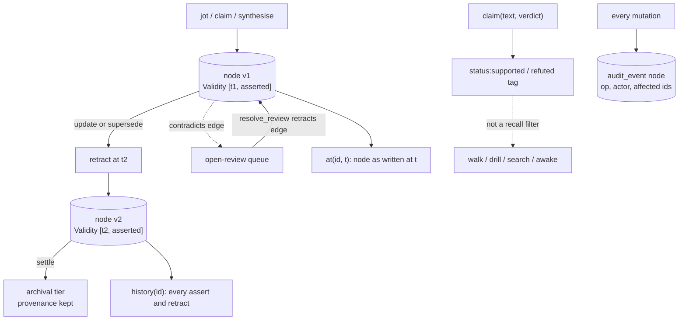

## 1. Executive Summary

kaeru is a memory engine for LLM agents written in Rust, version 0.7.3, 188
commits since 7 May 2026, about 39,000 non-test lines across `kaeru-core`
(19,700), `kaeru-mcp` (12,100), `kaeru-rig` (5,000) and `kaeru-cloud` (2,100),
with 365 tests. It is licensed under the Business Source License 1.1 with a grant
for production use and embedding, excluding offering kaeru as a hosted service,
and converts to Apache-2.0 on 28 August 2030.

It is not a store of extracted facts. It is a typed property graph the agent
works in: an agent jots episodes, formulates hypotheses and records verdicts on
them, links causes, synthesises summaries from nodes, saves reasoning chains as
trails, fills role slots such as `handoff`, and `settle`s work that stopped
changing into an archival tier. About seventy verbs are exposed as MCP tools. On
re-entry, `awake` restores an initiative's working set by memory layer and what
is still owed — open tasks, claims awaiting verdicts, saved trails.

Two properties hold throughout, and both are well built:

- **Nothing is overwritten.** Every node and edge carries a CozoDB `Validity` in
  its key. An update retracts the prior validity and asserts a new one, so
  `history` lists every revision and `at` returns a node in full as it stood at
  any past second.
- **Every mutation writes an audit node** into the same graph, so the agent can
  query its own changes.

The documentation calls the graph bi-temporal, and that is where the code parts
from the README. A Cozo `Validity` is one timestamp with an assertion flag.
Every writer in `kaeru-core/src/mutate/` stamps it with the current time
(`now_validity_seconds`), and no field records when a claim held in the world
rather than when it was written. `at` is time travel over record time. That is
real and useful, and it is not the second axis the atlas's `bitemporal` mark asks
for.

Two marks: `audit_log`, `negative_eval`.

## 2. Mental Model

A node has a **tier** — operational ("hippocampus", where thinking happens) or
archival ("cortex", settled) — and a **memory layer**: Core is always injected,
Hot next, Warm by default, Cold and Frozen only on explicit recall. Hygiene moves
nodes between layers by age and references; `settle` moves them between tiers,
carrying provenance.

Knowledge changes through edges with meaning. `derived_from` is provenance.
`supersedes` retracts the older node's validity and links the successor.
`contradicts` flags a target and puts it in the open-review queue until
`resolve_review` retracts the flag. A hypothesis carries `status:open`,
`status:supported`, `status:refuted` or `status:inconclusive` as a tag, set with
the claim or later with an optional `verifies` or `falsifies` edge.

Belief is recorded but not enforced. A refuted hypothesis and a node under review
are returned by `walk`, `drill`, `search` and `awake` like any other; statuses
feed the board, `reflect` and re-entry summaries (`recall/board.rs`,
`recall/reflect.rs:331-338`). So `trust_state` is withheld. Nothing records a
rejected value that a later write is checked against, so `tombstone` is withheld.
`bitemporal` is withheld for the single time axis described above.

## 3. Architecture

| Crate | Role |
| --- | --- |
| `kaeru-core` | Store, schema and migrations, graph types, `mutate/` verbs, `recall/` reads, temporal reads, hygiene, secret guard, export |
| `kaeru-mcp` | The `kaeru-mcp` daemon: MCP tools grouped by capture, lookup, chain, hypothesis, review, slots, tasks, board, temporal, consolidation, hygiene, cloud and vault |
| `kaeru-rig` | The curator verbs as `rig` framework tools over an embedded store |
| `kaeru-cloud` | An Axum REST service over `kaeru-core` holding shared nodes |
| `kaeru-viz` | A JavaScript galaxy visualisation that reads nodes over HTTP |

The schema (`kaeru-core/src/store.rs:246-360`) is `node` and `edge`, both keyed
with `Validity`, and non-temporal junctions and bookkeeping: `node_initiative`,
`edge_initiative`, `initiative` with a `share_policy`, `chain_member`,
`session_pin`, `slot_occupant`, `initiative_hygiene`, `initiative_cloud`.
Initiative membership is a junction rather than a column, so a scoped read is a
RocksDB prefix scan.

### Deployment and ergonomics

- **What has to run:** the `kaeru-mcp` binary, built from source; the vault is a
  directory under the platform's data path, overridable with `KAERU_VAULT_PATH`.
- **No model and no key.** kaeru calls no LLM and computes no embeddings; the
  agent does the thinking and kaeru stores its structure.
- **The cloud tier** is a separate service behind one bearer token, refusing to
  start without a token on a non-loopback address.
- **Hand-repairable:** not directly — it is a RocksDB-backed Cozo database — but
  any initiative exports to Obsidian-friendly Markdown.
- **Pre-1.0 alpha;** the README warns the schema may change between minor
  versions.

The screen of this checkout found one auto-run surface (a `.gitmodules` entry
for the benchmarks submodule, not initialised), three manifests inside the
seven-day cooldown, one unpinned surface, and `AGENTS.md` and `CLAUDE.md` read as
data. Nothing was installed, built or run.

## 4. Essential Implementation Paths

- **Temporal reads** — `graph/temporal.rs`: `at` (`:50`) queries
  `*node{… validity @ t}`; `history` (`:106`) lists assertions and retractions.
- **Write stamping** — `now_validity_seconds()` in every `mutate/` module; whole
  seconds, which is why the hypothesis writer records a known verdict in one write
  rather than create-then-update within the same second
  (`mutate/hypothesis.rs:36-47`).
- **Audit** — `graph/audit.rs:25-57`, a node of type `audit_event` in tier
  `operational` with `{op, actor, affected_refs}`.
- **Review** — `mutate/review.rs`: `mark_under_review`, `resolve_review`,
  `mark_resolved`; `recall/under_review.rs` lists targets of current
  `contradicts` edges, joined to the current initiative when one is set.
- **Supersession** — `mutate/supersedes.rs:34`.
- **Initiative scope** — `store.use_initiative` / `clear_initiative`; recall
  modules join `node_initiative` when `current_initiative()` is `Some`.
- **Sharing gates** — `initiative.share_policy` (Gate 1) and
  `guard.rs` (Gate 2), a deterministic scanner for API keys, tokens and private
  keys that runs before content leaves for a cloud.
- **Hygiene** — `hygiene.rs`, triggered by write counts, Core growth and elapsed
  time, changing only a node's layer.

## 5. Memory Data Model

`node`: `id`, `validity` ⇒ `type`, `tier`, `name`, `body`, `tags`,
`initiatives`, `properties` (JSON), `visibility` (`local` or shared),
`layer`. `edge`: `src`, `dst`, `edge_type`, `validity` ⇒ `weight`,
`properties`, `dst_store` (local or a cloud).

**Statuses are tags.** Tasks and hypotheses carry `status:<key>`; boards bucket
by it and `reflect` flags overdue and stale items.

**Provenance** is structural: `derived_from` edges from summaries to their seeds,
chains as ordered member lists with an agent-written summary, and audit nodes
naming the affected ids. The actor on most audit nodes is the literal `system`;
the README's "who did it and why" is aspirational at this commit — there is no
reason field, and only layer moves distinguish the caller.

**Scope.** Initiatives are named partitions of one graph with many-to-many
membership. Reads honour the store's current initiative, which the MCP tools set
from the initiative the agent names; a cleared initiative sees everything, and
the kaeru-cloud tier is one shared team space whose README defers per-user
isolation. `scope_enforced` is withheld.

## 6. Retrieval Mechanics

Retrieval is structural first: resolve a name exactly, then traverse — `walk` by
edge types to a depth, `drill` into a node, `trace` provenance, `between` two
nodes. Cozo full-text search is the fallback when a name is forgotten, and a
failed lookup says whether the name exists in another initiative, something close
exists, or nothing does. There is no embedding or vector search; the README says
so.

Reads are excerpt-first and point onward: an excerpt names `at` for the full
body, a changed node names `history`, a node inside a trail names `why`.

`awake` is the injection surface: an initiative's Core, Hot and Warm nodes, the
archival cortex, open work with overdue tasks first, pending claims, and saved
trails. On a shared initiative it warns that the local view may be incomplete.

## 7. Write Mechanics

Every verb is synchronous and local: a Cozo script that retracts and re-asserts
as needed, a junction insert for initiative membership, and an audit node. There
is no model call, so writes are fast and retrievable immediately.

Whole-second validities are a real constraint: two writes to one node inside the
same second produce an assertion and a retraction that cannot be ordered, and
the code works around it in several places.

Hygiene runs in the background of the MCP daemon by default since 0.7.3, off the
request path and in batches, and only moves layers; `hygiene <initiative>`
previews what it would move. In the rig adapter it is opt-in.

Sharing to the cloud passes the initiative's policy, which names whether and to
which clouds it may go, and the secret guard; `unshare` withdraws a mistake.

## 8. Agent Integration

The MCP daemon is the main surface, with a portable skill describing a re-entry
ritual (`awake`, `overview`) and habits for capture and hypothesis cycles. The
`rig` adapter gives a Rust agent the same verbs as tools over an embedded store.
`kaeru-viz` renders a vault as a galaxy and replays reasoning chains; it reads and
does not edit. No person-facing surface adjudicates memory — the daemon "hints
but doesn't block", and escalations go back to the agent's user in conversation —
so `human_review` is withheld.

## 9. Reliability, Safety, and Trust

**History is intact by construction.** No code path removes a `node` row; the
only `:rm` statements delete initiative junctions, initiative rows and chain
positions. A mistaken supersession or merge can be read around with `at` and
`history`.

**The secret guard is a hard floor** on the share path regardless of what the
agent believes, silent on clean content and specific on a hit.

**Contradiction is flagged, not acted on.** A `contradicts` edge queues a review;
nothing lowers the flagged node in recall or keeps it out of `awake` until the
review is resolved.

**Injection.** Nodes are whatever the agent writes; nothing distinguishes an
instruction copied from a tool result from a fact.

## 10. Tests, Evals, and Benchmarks

365 Rust tests, mostly inline in `kaeru-core` and `kaeru-mcp`, covering the
temporal reads, supersession, chains and rechaining, hygiene (including that a
pass never stalls concurrent writers), slots, sharing gates and MCP parameter
handling. None was run for this report.

`lib.rs:425` is the retrieval-exclusion case: a chain, its summary and its
provenance in initiative alpha are asserted invisible from beta — empty walk,
NotFound summary, empty provenance, and a lint whose orphans include beta's node
and not alpha's — and then visible again with the initiative cleared. `:1495`
asserts an unlinked node drops out of a walk that reached it a second earlier.
That earns `negative_eval`.

**Benchmarks** live in the `kaeru-benchmarks` repository, referenced as a
submodule and not checked out here; no result is in this tree.

## 11. For Your Own Build

### Steal

- **Put the version in the key.** A validity-keyed node makes every update a
  retraction plus assertion, and `at` and `history` come for free.
- **Write an audit node into the same graph** so the agent can reason about its
  own changes with the same queries it uses on memory.
- **Save reasoning as trails.** A chain with an agent-authored summary, folded on
  duplicates and refreshable after the graph moves, is recall of *why*, not only
  *what*.
- **Slots for singular roles.** A `handoff` slot that archives its previous holder
  prevents three competing "current" handoffs.
- **A deterministic secret scanner as the floor before sharing.**
- **Make re-entry list what is owed**, not only what was touched.

### Avoid

- **Calling a single time axis bi-temporal.** Readers will assume they can record
  when something was true separately from when it was learned.
- **Statuses that recall ignores.** A refuted hypothesis should not read like a
  supported one on re-entry.
- **Scope the agent can clear.** Initiatives organise, and a cleared initiative
  shows everything.
- **An audit actor that is almost always `system`.**

### Fit

This suits an agent — or a small team of agents with people — doing long,
multi-session analytical work where the structure of the reasoning matters as
much as the facts: research, debugging campaigns, design decisions with
hypotheses and verdicts. It asks the agent to use verbs deliberately and offers no
extraction or embedding to do it for them. For multi-tenant isolation or
automatic fact capture, it is the wrong shape at this commit.

## 12. Open Questions

- **Will validity ever carry world time**, for example a backdated assertion from
  a supplied event date?
- **Should `refuted` or an open review exclude or demote a node in `awake`?**
- **What do the benchmarks in `kaeru-benchmarks` measure?**

## Appendix: File Index

- `kaeru-core/src/store.rs` — schema
- `kaeru-core/src/graph/temporal.rs`, `graph/audit.rs`, `graph/node.rs`
- `kaeru-core/src/mutate/` — `hypothesis.rs`, `review.rs`, `supersedes.rs`, `consolidate.rs`, `slot.rs`, `sharing.rs`, `initiative.rs`, `layer.rs`
- `kaeru-core/src/recall/` — `walk.rs`, `by_name.rs`, `fts.rs`, `layered.rs`, `under_review.rs`, `reflect.rs`, `board.rs`
- `kaeru-core/src/hygiene.rs`, `guard.rs`, `lib.rs` (integration tests)
- `kaeru-mcp/src/tools/`, `kaeru-rig/`, `kaeru-cloud/src/lib.rs`

**Searches behind the absence claims**

- `rg -n "validity" kaeru-core/src/mutate` — every writer stamps `now_validity_seconds()`
- `rg -n ":rm" kaeru-core/src` — junctions, initiative rows and chain members only
- `rg -n "status:" kaeru-core/src/recall` — board and reflect, no recall filter

## History

**2026-09-15** — [`566b6c6efbc2a080e64059609c7423f38d6892be`](https://github.com/LamantinAI/kaeru/commit/566b6c6efbc2a080e64059609c7423f38d6892be) — first reading, at a commit dated 14 September 2026. Screened before opening: one auto-run surface (an uninitialised submodule), three manifests inside the seven-day cooldown, one unpinned surface, and two agent-instruction files read as data. Nothing was installed, built or run.
