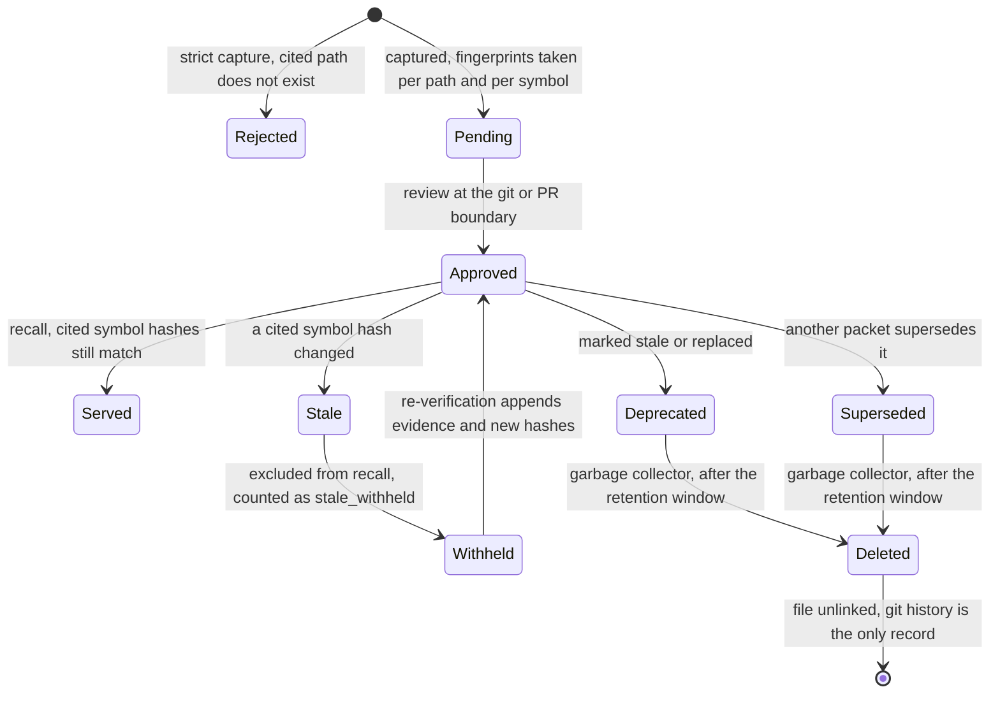

## 1. Executive Summary

Kage is a memory framework for coding agents built on top of Google's
**Open Knowledge Format** — plain Markdown concept files in the repository,
vendor-neutral, committed to git. The README states the division of labour
exactly: OKF "standardizes the store and stops there. Verification, freshness,
and staleness are explicitly *out of scope* for v0.1. Kage is the framework that
maintains it." GPL-3.0, roughly 108,000 lines of TypeScript, of which
`mcp/kernel.ts` is 24,000.

**The mechanism is verification against the code the memory is about, and the
verdict path carries no model.** Two rules do most of the work:

- A capture in strict mode whose cited paths do not exist is **rejected at write
  time**. No memory that hallucinated its own citation reaches the store.
- A memory whose cited code changed after it was last verified is marked stale
  and **withheld from recall** until re-verified.

The second rule is where the design earns its report, because of how staleness
is computed. A packet's `freshness.path_fingerprints` holds a SHA-256 per cited
file, and — when resolvable — a `symbols` array of per-symbol fingerprints,
each with a name, a kind and its own hash. The comment states the point: symbols
are "resolved by name from the file's current symbols, not by line number, so
moving a symbol down does not trip it", and "an edit elsewhere in the same file
no longer invalidates a memory whose cited symbols are untouched". Most
freshness mechanisms in this atlas are a timestamp and a TTL. This one is a
content hash of the specific thing the claim is about.

**And it is tested by deletion.** `benchmarkTrust` (`mcp/kernel.ts:16745`) builds
a sandbox, writes eight memories grounded in eight real files, confirms each is
recallable, deletes the files, and asserts each is no longer surfaced —
counting only the ones that were recallable beforehand. That positive control is
what separates a real negative case from a broken query, and it is the same
discipline the atlas credits [Omi](../omi/) for. A first gate in the same
function attempts eight captures citing files that never existed and counts the
rejections.

Two absences are worth stating up front. `scope` and `visibility` are stored
fields with a validated vocabulary and **no read-path predicate anywhere** —
isolation between personal, repo and team memory comes entirely from three
different directories. And `appendOrgAudit`, `orgAuditPath` and `orgAuditCount`
define an append-only org audit log that **nothing in the tree calls**.

## 2. Mental Model

A Kage memory is a *packet*: a typed engineering claim — `decision`, `bug_fix`,
`gotcha`, `proposal` and others — with a title, a body, a structured context
(`fact`, `why`, `trigger`, `action`, `verification`, `risk_if_forgotten`,
`stale_when`, `rejected_alternatives`), a list of cited paths, and a freshness
block.

What makes it different from a note is that the packet keeps a **chain of
re-verifications**. Each `source_refs` entry after the initial capture records
`at`, `verified_by` (usually a test result), an `evidence` paragraph in prose,
and `changed_paths` carrying `prior_sha256` and `sha256` for each file. So a
packet does not just say "still true"; it says which files moved underneath it
since the last check and why the claim survived them.

The repository dogfoods this: `.agent_memory/packets/` in the checkout contains
Kage's own memories, including one whose current state is
`"stale": true, "stale_reasons": ["linked path changed since memory was
verified: mcp/kernel.ts, mcp/kernel.test.ts"], "suggested_action": "update"`.
The system's own store demonstrates its own withholding.

The loop from `Withheld` back to `Approved` is the design: staleness is not a
demotion in ranking, it is removal from the result set with an explicit count in
the receipt, and the way back is evidence.

## 3. Architecture

No database, no account, no API key. Packets are files under `.agent_memory/` in
the repository, so the memory travels with the code, merges through git, and is
reviewed in a pull request.

That choice creates a problem most file-backed systems here never hit —
concurrent writers producing merge conflicts — and Kage answers it with a git
merge driver. `mergePacketFiles` sniffs content rather than trusting the file
extension, because, per the project's own packet about the bug, `.md`-named
packets holding raw JSON were routing to the wrong parser and "punted every
sync-bot race to manual conflict markers". When both sides genuinely diverge,
the losing side is written to `.agent_memory/conflicts/` instead of discarded.

Three memory tiers live in three places: `.agent_memory/packets` for the repo,
`~/.kage/memory/packets` for personal, and `.agent_memory/team/packets` for the
pulled team cache.

Around the store sit an MCP server (advertised for fifteen-plus clients), a CLI,
a proxy that measures token savings, a daemon, a structural worker and a web
viewer.

## 4. Essential Implementation Paths

**Capture** — `capture()` in `mcp/kernel.ts`: validate the type and scope
vocabulary, resolve cited paths, hash each file and each named symbol, refuse
under `strictCitations` when no cited path resolves, write the packet.

**Recall** — `recall()`: BM25 over packets, an injection gate deciding whether
to inject at all, semantic expansion, then the freshness check that withholds
stale packets and increments `stale_withheld` in the value receipt.

**Freshness** — `packetVerificationLabel` (`:10413`) returns `verified`,
`unverified` or `stale`; the per-path and per-symbol comparison is the
`source_hash_staleness` policy recorded on the packet itself.

**Review** — `reviewDir` (`:2580`), the `review` CLI command (`cli.ts:3557`),
and a quality report classifying each packet as `high_signal`, `needs_review`,
`duplicate`, `stale` or `too_generic` with a `suggested_action` of `approve`,
`reject`, `merge`, `mark_stale` or `keep`.

**Garbage collection** — `gcProject` (`:10277`) deletes deprecated and
superseded packets older than `KAGE_GC_RETENTION_DAYS` (default 30).

## 5. Memory Data Model

The packet is the whole model, and its shape is the report:

| Field | What it carries |
| --- | --- |
| `status` | `pending` \| `approved` \| `deprecated` \| `superseded` |
| `scope` / `visibility` | `session\|personal\|repo\|org\|public` and `private\|team\|org\|public` — validated, never filtered on |
| `context` | The eight structured fields, including `stale_when` and `rejected_alternatives` |
| `paths` | The code the claim is about |
| `freshness.path_fingerprints` | Per-file SHA-256 and size, plus per-symbol name, kind and SHA-256 |
| `freshness.last_verified_at`, `ttl_days` | Time-based freshness, as a floor beneath the hash check |
| `source_refs` | `explicit_capture` then a chain of `reverification` entries with evidence and hash deltas |
| `quality` | Reviewer, vote counts, 30-day uses, `reports_stale`, `promotion_requires_review`, `discovery_tokens`, `stale_reasons`, `suggested_action` |
| `edges` | Typed relations including `supersedes`, each with its own evidence string |
| `author_name` | Git `user.name` at capture — "who on the team wrote this, surfaced in recall and `kage review` so teammates see whose claim they're trusting, not just when" |

Two fields deserve naming on their own. `rejected_alternatives` records what was
considered and not chosen, which is the part of a decision that is hardest to
reconstruct later and that almost nothing in this atlas stores. And `stale_when`
lets the author state the condition under which the memory stops being true —
a human-authored invalidation predicate beside the machine-computed one.

## 6. Retrieval Mechanics

BM25 over packet text with distinct-term-match counting, a code graph and
optional semantic expansion, then an **injection gate**: `decideRecallInjection`
takes the score distribution and decides whether anything is injected at all,
rather than always returning a top-*k*.

The freshness filter runs after ranking and removes stale packets from
`results`. What makes this more than a filter is that the removal is *reported*:
`value_receipt` carries `tokens_saved`, `stale_withheld` and `replay_tokens`, and
a ledger accumulates `recall_served`, `stale_withheld`, `stale_caught`,
`caller_answered` and `injection_gate` events. A caller can tell that something
was suppressed and how much — which is exactly the query-time signal
[ClawMem](../clawmem/) documents itself as lacking.

Personal and team packets are returned in separate top-level sections
(`personal`, `team`) rather than merged into `results`, with the reason in the
comment: "kept OUT of `results` so repo flows (pr-check, stale-catch, refresh,
access tracking) never see personal packets". The isolation is by construction
rather than by predicate, which is both stronger than a `WHERE` clause in
practice and invisible to the field that names it.

## 7. Write Mechanics

Capture is synchronous and cheap — hashing files and symbols, no model on the
verdict path, which the README states as a property rather than a limitation.

The write gate is the interesting part. Under `strictCitations`, a capture whose
every cited path is missing fails. The benchmark comment claims the novelty
plainly — "No competitor validates citations at write time" — and, on the
evidence of this atlas, the claim is close to true: several systems here check
that a memory is grounded in *the user's words*, and this is the first that
checks it is grounded in *the repository's code*.

Correction is a status transition plus an edge. `supersedes` edges carry their
own evidence string. Deprecated and superseded packets are retained for 30 days
and then unlinked, and the code records why the retention exists: dead packets
"used to be immortal — 32% of the store was deprecated weight every teammate
cloned forever". The comment says "the audit trail keeps the tombstone" — and
the audit trail is git. That is a real durability guarantee and it is a different
mechanism from a rejected-value record in the store; nothing consults git before
accepting a new packet, so a deleted claim can be re-captured.

## 8. Agent Integration

An MCP server installed with one `npx` command and advertised for Claude Code,
Codex, Cursor, Windsurf, Gemini CLI, Cline, Goose, Roo Code, Kilo Code,
OpenCode, Aider, Claude Desktop, Copilot, OpenClaw, Hermes "and any MCP client".
Beside it a CLI, a proxy that sits in front of the model API to measure what
injection saved, a daemon, a skills directory and a web viewer.

The review boundary is `git_or_pr`: because packets are files, promotion to
approved is a code review. That is the cheapest possible review surface for a
team that already reviews code, and it is why `promotion_requires_review: true`
is a workable default here where it would be a bottleneck elsewhere.

## 9. Reliability, Safety, and Trust

**Trust state — awarded.** `MemoryStatus` is a four-value field
(`pending | approved | deprecated | superseded`) written on the packet,
consulted on the read path (`loadOrgApprovedPackets` filters to `approved`), and
moved by review. Beside it `packetVerificationLabel` computes a second,
orthogonal axis — `verified | unverified | stale` — from the hash comparison
rather than from the stored status, which is the two-axis separation this atlas
credits [Magic Context](../magic-context/) for, reached by a different route.

**Human review — awarded.** `promotion_requires_review: true` on packet quality,
a `review` CLI command, a review directory, a `reviewer` field, up and down
votes, `reports_stale`, and a classification with an `approve | reject | merge |
mark_stale | keep` action. The boundary being a pull request means the review is
a real gate rather than a dashboard.

**Negative eval — awarded**, for `benchmarkTrust` Gate 2 as described in section
1: eight memories, verified recallable, their files deleted, asserted absent
from recall. `benchmarks/staleness-kage.mjs` covers the same ground as a
standalone harness.

**Scope — withheld, and this is the sharpest near-miss in the batch.** The
packet carries `scope` and `visibility` with validated five- and four-value
vocabularies. Searching `mcp/kernel.ts` for a comparison against either field
returns nothing: no read path branches on them. What actually isolates personal
from repo from team memory is that they live in three directories and are loaded
by three different functions into three different result sections. The boundary
holds; the field that describes it is metadata for a viewer.

**Audit log — withheld, and the reason is a second unwired mechanism.**
`orgAuditPath`, `appendOrgAudit` and `orgAuditCount` (`mcp/kernel.ts:21748-21769`)
implement an append-only JSONL audit for the org tier. A search of every `.ts`,
`.mjs` and `.md` file in the checkout finds no call site for any of the three.
Had it been wired, `appendOrgAudit` reads the entire file and rewrites it on
every append, which is quadratic in the number of events.

**Tombstone — no.** Deletion is `unlinkSync` after a retention window, with git
history as the record. Nothing is keyed on a rejected value and nothing is
consulted before a capture.

**Bitemporal — no.** `valid_from` exists in a derived structure and is assigned
`packet.updated_at`, so the validity axis and the record axis are the same
column.

## 10. Tests, Evals, and Benchmarks

**No paper.** The intellectual anchor is a standard rather than a publication:
Google Cloud's Open Knowledge Format, with `OKF_STANDARD.md` committed and
`mcp/okf.ts` implementing the conversion.

19 test files under `mcp/`, with `kernel.test.ts` alone carrying 299 test
declarations across 7,400 lines, plus dedicated suites for the MCP surface, the
proxy, the daemon, cosine dedup, derivability, injection decisions, OKF
round-tripping and tool coverage. **I did not run them** — the screen flagged
`server.json` and `smithery.yaml` as auto-run manifests and build-time execution
in `benchmark/Makefile` and `mcp/package.json`, so the tree was read and never
installed.

`benchmarks/` holds sixteen harnesses — LoCoMo and LongMemEval retrieval with a
BM25 baseline beside them, MemoryArena answer and context runs, SWE-bench
context, capture quality, compression, injection relevance, scale, staleness and
a live reuse A/B. `evals/agent-trajectory/` records and replays agent
trajectories against a rubric. This is one of the broader evaluation surfaces in
the atlas, and no summary result table is committed to the repository, so the
harnesses are reproducible and the numbers are not published here.

## 11. For Your Own Build

### Steal

- **Verify a memory against the artifact it describes, not against a clock.**
  Hashing the cited files at capture and comparing at recall turns "is this still
  true" from a guess into a check, with no model in the path.
- **Fingerprint the symbols, not the file.** Resolving symbols by name and
  hashing each one means moving a function down a file does not invalidate a
  memory about it, and an unrelated edit in the same file does not either. This
  is the single highest-value idea here.
- **Refuse a capture whose citation does not resolve.** A memory that
  hallucinated its own evidence is worse than no memory, and the check is a
  filesystem stat.
- **Withhold rather than demote, and say you withheld.** `stale_withheld` in the
  value receipt means the caller knows something was suppressed — the query-time
  signal that turns a silent filter into an accountable one.
- **Keep the re-verification chain, with evidence in prose.** Each entry naming
  what changed, which hashes moved, and why the claim still holds makes "still
  true" auditable rather than asserted.
- **Store `rejected_alternatives` and `stale_when`.** The road not taken, and
  the author's own invalidation condition, are the two things nobody can
  reconstruct later.
- **Let the author state the invalidation predicate beside the computed one.**
  `stale_when` and the hash check answer different questions and both are cheap.
- **Write the losing side of a merge to a conflicts directory.** When two agents
  genuinely diverge, discarding one silently is the failure; keeping it as a file
  costs nothing.
- **Record the author's git name on the packet.** "Whose claim they're trusting,
  not just when" is a one-line change with real value on a team.

### Avoid

- **Do not let a scope field be decorative.** Five scope values and four
  visibility values, validated on write and never read, describe a boundary that
  is actually held by the directory layout. A refactor that merged the loaders
  would remove the isolation without touching the field.
- **Do not ship an audit log nothing calls.** Three functions, one append-only
  format, zero call sites. This is the second such case in this batch after
  [Memory Palace](../memory-palace/), and it is the specific hazard the atlas's
  own house rules were written against.
- **Do not append by read-modify-write.** If the org audit is ever wired,
  rewriting the whole file per event makes the log quadratic in its own length.
- **Do not treat git history as a tombstone.** It is a durable record and it is
  not consulted before a write, so a deleted claim can be re-captured
  immediately.

### Fit

This suits a team whose memory is *about their code* and who already review pull
requests. The verification model only works where the claim cites an artifact the
system can hash — it has nothing to offer a companion app, a user profile, or any
memory whose subject is a person rather than a file. Within that scope it is the
strongest freshness mechanism in this atlas, and the GPL-3.0 licence is worth
noting for anyone considering embedding rather than adopting it.

## 12. Open Questions

- **How often does symbol resolution fail?** `symbols` is optional on a path
  fingerprint, and when absent the check falls back to whole-file hashing, which
  is the coarse behaviour the design exists to avoid. Nothing reports the ratio.
- **What happens to a withheld packet nobody re-verifies?** It survives the
  garbage collector — which only touches `deprecated` and `superseded` — so a
  stale approved packet is retained and unusable indefinitely.
- **Was the org audit removed or never written?** Three functions, no call
  sites, no test.
- **Does the injection gate ever suppress everything?** `decideRecallInjection`
  can return no injection at all; how often that happens on a real store is the
  number that would say whether the gate is doing work.

## Appendix: File Index

**The packet model** — `mcp/kernel.ts` (`MemoryStatus` at `:47`, `MemoryScope`
and `MemoryVisibility` `:48-49`, `MemorySymbolFingerprint` `:97`,
`EngineeringMemoryContext` `:110`)

**Verification and staleness** — `mcp/kernel.ts:10117`
(`staleSuggestedAction`), `:10413` (`packetVerificationLabel`), `:13982` (the
`verified | drifted | gone` path status), `mcp/check.ts`,
`mcp/structural-worker.ts`

**The write gate and the negative benchmark** — `mcp/kernel.ts:16745`
(`benchmarkTrust`, Gate 1 hallucinated citations, Gate 2 stale exclusion with
its positive control, Gate 3 live grounding), `benchmarks/staleness-kage.mjs`

**Recall and receipts** — `mcp/kernel.ts:255-262` (the personal/team split and
`value_receipt`), `:3237-3350` (the event ledger), `:21778`
(`recallFromPackets`), `mcp/metrics-math.ts`

**Review** — `mcp/kernel.ts:834-837` (classification and suggested action),
`:2580` (`reviewDir`), `:4760` (`suggestedAction`), `:18134`
(`review_boundary`), `mcp/cli.ts:3557`

**Garbage collection** — `mcp/kernel.ts:10275-10300` (`gcProject`,
`GC_DEAD_PACKET_RETENTION_DAYS`)

**The unwired org audit** — `mcp/kernel.ts:21748` (`orgAuditPath`), `:21752`
(`appendOrgAudit`), `:21765` (`orgAuditCount`)

**OKF conformance** — `OKF_STANDARD.md`, `mcp/okf.ts`, `mcp/okf.test.ts`

**Integration** — `mcp/index.ts`, `mcp/cli.ts`, `mcp/proxy.ts`,
`mcp/daemon.ts`, `mcp/cloud-client.ts`, `mcp/cloud-server.ts`, `skills/`,
`plugin/`, `platform/web/`

**Evaluation** — `benchmarks/` (sixteen harnesses including
`locomo-kage-retrieval.mjs`, `longmemeval-kage-retrieval.mjs` with a BM25
baseline, `memoryarena-kage-answer.mjs`, `swebench-kage-context.mjs`,
`reuse-ab-live.mjs`), `evals/agent-trajectory/`

**Its own memory** — `.agent_memory/packets/` (the repository dogfoods the
format; one packet is currently `"stale": true` against `mcp/kernel.ts`)

## History

**2026-08-09** — [`d22cad56b28a26bb514ecede4ee0dbd509a46c3f`](https://github.com/kage-core/kage/commit/d22cad56b28a26bb514ecede4ee0dbd509a46c3f) — first reading. Screened before reading: two auto-run surfaces (`server.json`, `smithery.yaml`), build-time execution in `benchmark/Makefile` and `mcp/package.json`, three unpinned dependency surfaces. The tree was read, never installed, and no test or benchmark was run.
