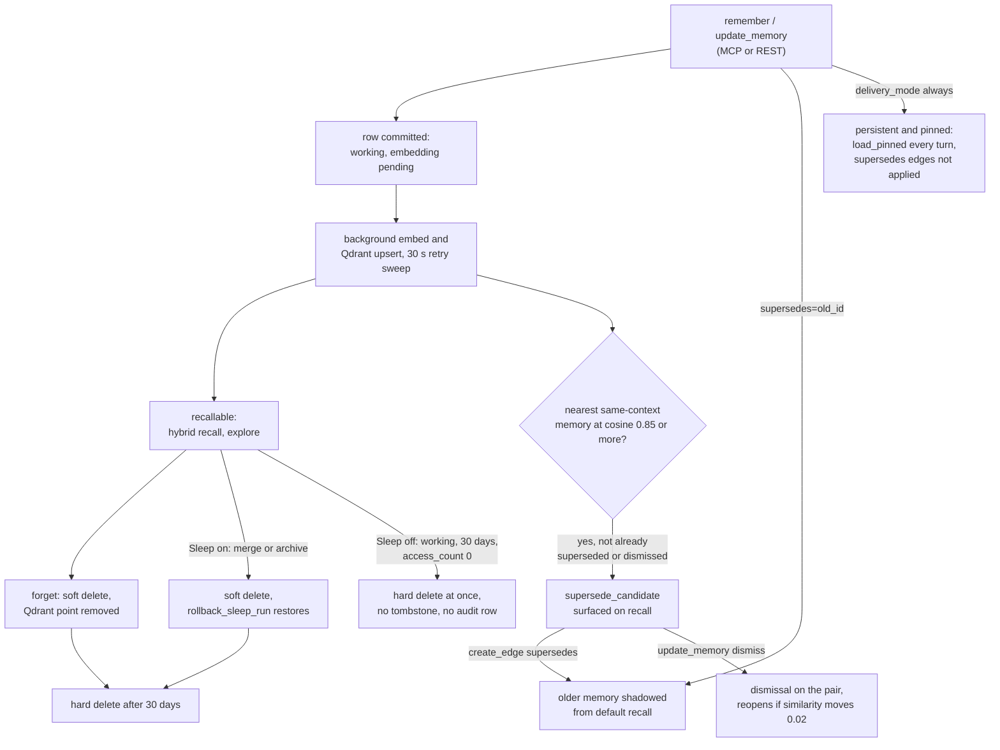

## 1. Executive Summary

Kagura Memory Cloud is a self-hosted, multi-tenant memory server for AI agents:
FastAPI over Postgres and Qdrant, exposed as a Streamable-HTTP MCP server with
64 tools, a REST API and a Next.js dashboard. A memory is a three-layer row
(summary, context summary, full content) that the agent writes explicitly with
`remember` and finds with hybrid dense-plus-BM25 `recall`. Every recall also
strengthens Hebbian edges between co-retrieved memories, which `explore` walks.

What is notable is the discipline around boundaries. Every search call must
carry workspace, context and user keys, and the tests assert the boundary with
positive controls. Predicates such as "pinned" and "tool guardrail" are defined
once and reused by the reader and by every automated deleter. Correction is
non-destructive: a `supersedes` edge shadows the older fact out of default
recall, and a server-detected near-duplicate surfaces as a suggestion with
accept and dismiss verbs. The dismissal records the similarity at rejection, so
a real edit can reopen it.

What is weak sits in the defaults and in the lanes the correction does not
reach. With `SLEEP_ENABLED` unset, as in `.env.example`, a legacy daily task
hard-deletes working memories not surfaced in 30 days, with no soft delete and
no audit row, and it only ever considers the 100 newest per user. The pinned
lane injected every turn ignores `supersedes` edges. The audit table covers
agent-bound keys only, and the documented plugin setup uses a user key.

Three marks: `scope_enforced`, `audit_log` and `negative_eval`. Section 9 names
the four withheld and why.

The licence file is Apache-2.0, copyright Kagura AI, Inc.; the Claude Code
plugin manifest declares MIT. `server.json` points at a hosted endpoint,
`memory.kagura-ai.com`; this report covers only the code in the tree.

## 2. Mental Model

A memory is what an agent or person chose to store; nothing is extracted from
conversation. It becomes a belief the moment `remember` commits the row with
`scope='working'` and `embedding_status='pending'`
(`backend/src/services/memory_service.py:722-760`). It becomes findable by
`recall` once a background task has embedded it and upserted the Qdrant point;
`reference` by id works at once. It becomes `persistent` when a consolidation
pass promotes it, or immediately when written with `delivery_mode='always'`,
which also puts it in the pinned lane loaded every turn (`:324-336`).

**Supersession hides and does not delete.** A `supersedes` edge from a newer
memory to an older one removes the older one from recall's candidate pool before
the top-k slice, provided the newer memory is not soft-deleted (`:2465-2573`).
Deleting the edge or the superseder restores it. `include_superseded=true` and
`explore` still reach it. A `contradicts` edge never hides anything; both sides
are annotated for the caller to arbitrate.

**The server proposes supersession and the agent decides.** At embedding time
the k-NN seeding finds the nearest same-context memory at cosine 0.85 or more
and stores it in a server-only `supersede_candidate` column (`:5575`,
`:5725-5760`). Recall and reference surface it.
`create_edge(edge_type='supersedes')` accepts it, and
`update_memory(dismiss_supersede_candidate=true)` rejects it. The rejection is
stored as `{"dismissed": {memory_id, similarity, dismissed_at}}`. The detector
re-proposes the pair only if the recomputed similarity moves by 0.02 or more
(`backend/src/services/supersede_dismissal.py:48-108`), so a mechanical reindex
does not resurrect it and a content edit does.

**Three ways a memory stops.** `forget` soft-deletes and removes the Qdrant
point, and a daily sweep hard-deletes the row 30 days later. Sleep Maintenance,
when enabled, merges near-duplicates and archives stale rows as soft deletes that
`rollback_sleep_run` can restore. With Sleep off, the legacy consolidation task
deletes the row outright (section 7).

Trust is a property of the context, not of the memory. A context provisioned for
an external connector is stamped `trust_tier='external'`, and a recall filter can
exclude it. Nothing inside a context distinguishes a verified memory from a
guessed one.

## 3. Architecture

The backend is one FastAPI process (`backend/src/api/main.py`) that serves REST,
the MCP transport (`backend/src/mcp_server/`) and an in-process APScheduler
(`backend/src/tasks/scheduler.py`). Postgres holds memories, contexts,
workspaces, members, API keys, edges, audit tables and Sleep reports, defined by
124 Alembic migrations. Qdrant holds one collection, `kagura_memories`, with a
dense vector and a BM25 sparse vector per point, isolated by payload filters
rather than by collection (`backend/src/db/qdrant.py:381-388`). Redis carries
sessions and caches. Embeddings come from OpenAI or a self-hosted Ollama or vLLM
endpoint; rerankers from Voyage, Cohere or a self-hosted model.

`KAGURA_VECTOR_BACKEND=lance` swaps Qdrant for an embedded LanceDB store, marked
preview and single-writer in its own header (`backend/src/db/lance_store.py:1-30`).
Japanese text is tokenized by Sudachi on both the write and the query side, with
synonym expansion, because the BM25 arm is a sparse vector the application
builds itself.

The jobs registered at startup (`backend/src/api/main.py:113-124`) are the
embedding sweep every 30 seconds, edge weight decay every hour, and the daily
soft-delete purge at 04:00 UTC. Beside them runs either the legacy consolidation
at 03:00 UTC, when `SLEEP_ENABLED` is not `true`, or Sleep Maintenance at 02:00
UTC, when it is (`backend/src/tasks/neural_tasks.py:344-384`;
`backend/src/tasks/sleep_tasks.py:345-352`).

### Deployment and ergonomics

`./setup.sh` and `docker-compose.yml` stand up the API, Postgres, Qdrant and
Redis, with the dashboard beside them. A memory needs an embedding provider to
become recallable, though a self-hosted one satisfies it, and the row itself
commits without one. The store is readable by SQL and through the dashboard. A
wrong memory is fixed with `update_memory`, a supersedes edge or `forget`. This
is four services and a scheduler, sized for a team rather than a laptop.

## 4. Essential Implementation Paths

**Write.** `handle_remember` (`backend/src/mcp_server/tools/memory.py`) calls
`MemoryService.remember` (`backend/src/services/memory_service.py:560-827`). It
resolves and authorizes the context for write, checks the count and daily quotas
against the context's workspace, and caps content at 1 MB. It validates
`details.trigger`, `details.location` and `details.tool_trigger`, builds and
commits the row, and creates declared links and a `supersedes` edge if asked
(`:2141-2191`). Then it starts `process_pending_embedding` as a task, emits the
audit event (`:783-793`), and returns advisory write-lint hints.

**Embed.** `process_pending_embedding` (`:6334`) builds the point with
`build_memory_point` (`:6269`), upserts it, marks the row `success`, and runs
`_create_knn_seed_edges` (`:5578`), which also writes the supersede suggestion.

**Recall.** `MemoryService.recall` (`:4090-4406`) checks agent bindings, runs
`SearchService.hybrid_search` (`backend/src/services/search_service.py:60-418`),
and hydrates from Postgres with `deleted_at IS NULL` and the trust and source
filters (`memory_service.py:3398-3475`). It applies the binding row filter,
supersede shadowing (`:4320`), the optional reinforce rerank and graph boost,
builds responses, runs Hebbian learning on the returned set (`:3668`) and
commits.

**Pinned and guardrails.** `load_pinned` (`:4408`) reads
`MemoryRepository.list_pinned` (`backend/src/repositories/memory.py:455-521`), an
indexed SQL scan ordered by importance. `load_guardrails` (`memory_service.py:4553`)
reads rows carrying `details.tool_trigger` for the client hook.

**Forget.** `MemoryService.forget` (`:4697-4956`), by id, authorizes for write,
refuses a guardrail to a non-editor, soft-deletes, deletes the Qdrant point and
deletes the node's edges. By query, it runs a recall with
`include_superseded=true` and soft-deletes every result, refusing when the
search degraded to keyword-only (`:4837-4870`).

**Sleep.** `SleepOrchestrator.run` (`backend/src/services/sleep/orchestrator.py`)
runs edge discovery, dedup merge, merge retention, forget retention, importance
re-evaluation and consolidation. Each records `sleep_actions` rows that
`backend/src/services/sleep/undo.py` reverses.

**MCP registry.** `backend/src/mcp_server/tools/__init__.py:216-294` maps the 64
tool names to handlers.

## 5. Memory Data Model

| Field | Notes |
| --- | --- |
| `user_id`, `workspace_id`, `context_id` | the three isolation keys, mirrored into the Qdrant payload |
| `summary`, `context_summary`, `content`, `details` | the three layers; only the first two are normalized for search |
| `type`, `tags`, `importance`, `confidence` | caller-supplied; `confidence` is a float with a range CHECK |
| `scope` | `working` or `persistent`, a consolidation lifecycle, not an isolation key |
| `delivery_mode` | `on_recall`, `always` (pinned), `on_trigger` |
| `source_type` | `file`, `url`, `vault`, `api`, `manual`, and server-only `connector` |
| `supersede_candidate` | server-only JSON: a suggestion or a dismissal |
| `access_count`, `reference_count` | surfacing versus deliberate fetch, kept apart |
| `created_at`, `updated_at`, `deleted_at`, `deleted_by` | `updated_at` moves only on an edit path |

The model is `backend/src/models/memory.py:106-545`. Generated columns extract
`trigger_from` and `trigger_until` for time memories and `location_lat` and
`location_lon` for geo memories, each with a CHECK and a partial index. Every
enum-like column is a CHECK derived from a Python tuple, and a test pins the
literal against the migration.

Edges live in `neural_memory_edges` with `edge_type` (including `supersedes` and
`contradicts`), `weight`, `confidence` and `origin` (`hebbian`, `semantic`,
`declared`). A declared edge outranks a machine one on upsert. The repository
refuses any edge whose endpoints are not live memories in the edge's own
workspace and context (`backend/src/repositories/neural_edge.py:74-115`).

There is no validity time. `trigger_from` and `trigger_until` are a delivery
window for reminders, not the period a fact held. `updated_at` is overwritten in
place, and no revision of the prior text is kept.

## 6. Retrieval Mechanics

`recall` is hybrid by default. The dense arm and the BM25 sparse arm each query
Qdrant under the same isolation filter (`backend/src/db/qdrant.py:205-287`), and
`_merge_results` normalizes each arm to its top hit and fuses them 0.6 and 0.4
(`backend/src/services/search_service.py:420-505`). The raw cosine is carried
beside the fused score, so the service can tell a strong match from the
least-bad one. If the dense arm fails, a hybrid search degrades to keyword-only
and says so in the response; an explicit semantic search raises instead.

With neural memory enabled the pool is over-fetched at four times `k`. After
hydration and shadowing, a per-context reinforce rerank may reorder by adoption
and feedback, and a graph boost, off by default, multiplies by a bounded
co-activation term. Rerankers are plan-gated.

`load_pinned` is the deterministic counterpart: every `always` memory in the
context, ordered by importance, capped, with the true total reported so a
truncation is never silent. `explore` spreads activation over the Hebbian graph
and serves the relations recall deliberately leaves out.

The main failure mode is one the design accepts. Memories are whatever the agent
wrote, so recall quality rests on how the agent crafted `summary` and `tags`.
The write-lint hints exist for that reason and never block.

## 7. Write Mechanics

Writes are explicit and synchronous to Postgres. The agent does not wait on an
embedding: the row commits, the call returns, and a task embeds it. The lag
before `recall` can find a new memory is one embedding call and one upsert,
roughly a second; a failed embedding is retried by the 30-second sweep up to a
bounded count. No model call sits on the write path.

**Deduplication is advisory at write time and automatic only under Sleep.** The
k-NN seeding proposes a supersession and changes nothing. Sleep's dedup phase
clusters by cosine and asks an LLM to judge merge versus keep-both,
soft-deleting losers and recording `supersedes` edges. With the LLM off it
auto-merges only at similarity 0.98 or more.

**The legacy consolidation deletes.** When `SLEEP_ENABLED` is not `true`,
`consolidation_task` runs daily over users with a `graph_memory` row, which the
first neural recall creates. For each user it lists working memories and
hard-deletes any 30 days old with `access_count == 0`, from Qdrant and then
Postgres (`backend/src/tasks/neural_tasks.py:121-255`, deletion at `:211-233`).
`.env.example` sets `ENABLE_NEURAL_MEMORY=true` and leaves `SLEEP_ENABLED` unset;
the production example under `terraform/` sets it `true`. The project's
`docs/sleep-maintenance.md` states that the legacy path deletes with no
tombstone or audit row.

Two defects sit inside that task. `memory_repo.list` is called without a limit,
so it returns the default 100 rows ordered newest first
(`backend/src/repositories/memory.py:62-106`). A user with more than 100 working
memories therefore never has the oldest ones considered. The list also carries
no `deleted_at` predicate, and the Qdrant delete passes no collection name,
where `forget` resolves the context's routed collection (`memory_service.py:4807`).

**Pins are the agent's to set.** `delivery_mode='always'` is a `remember`
argument, and one shared predicate exempts a pinned row from every automated
deleter (`backend/src/models/memory.py:547-563`).

### Operational cost

- Write: one Postgres commit on the request; embedding deferred by seconds.
- Read: every non-keyword recall writes edge updates and access statistics in
  the same request, so reads are writes.
- Background: Sleep, when enabled, is LLM-judged per context on a plan-limited
  set of contexts, with per-run budgets and cost logging. The legacy task walks
  up to 1,000 users and 100 memories each.
- Injection: `load_pinned` and the bootstrap call are bounded by caps and a
  character budget, and report truncation.

## 8. Agent Integration

The MCP server exposes 64 tools, among them `remember`, `update_memory`,
`recall`, `recall_upcoming`, `recall_nearby`, `load_pinned`, `load_guardrails`,
`forget`, `reference`, `explore`, `create_edge`, `rollback_sleep_run` and an
agent bootstrap call. The tool descriptions carry the operating instructions:
pass `supersedes` when updating a fact, accept or dismiss suggestions, and pass
`trust_tier='trusted'` when results will inform an action
(`backend/src/mcp_server/tools/_definitions.py:68`, `:234`, `:270`).

The Claude Code plugin (`.claude-plugin/`, `claude-hooks/hooks.json`,
`claude-skills/`) adds skills for session start, recall, remember and setup, and
a hook script that fetches guardrail memories and can block a tool call.
Guardrails can be authored only with a user credential at context editor level
or above (`memory_service.py:475-513`), so an agent-bound key cannot plant one.
The plugin's configuration asks for a user API key.

The agent has full authority over its memories. It writes, pins, supersedes,
dismisses and deletes, including delete by semantic query.

## 9. Reliability, Safety, and Trust

**Isolation is enforced where it is cheapest to get wrong.** Both search
functions refuse to run without all three keys and UUID-validate them
(`backend/src/db/qdrant.py:541-555`, `:743-755`). Cross-context recall passes an
explicit list. The supersede suggestion is re-checked against the source
memory's workspace and context before its target's summary is shown.

**Shadowing crosses authors on purpose.** The shadowing join is not scoped to
the calling user, so one member's correction hides a stale fact for the team
(`memory_service.py:2511-2523`). The cost is that any non-viewer member of a
shared context can hide another member's memory from default recall. The MCP
handler checks the caller is not a viewer (`backend/src/mcp_server/tools/edge.py:281`)
and the repository checks the endpoints' context; neither checks who wrote the
target.

**The pinned lane is outside supersession.** `list_pinned` filters on
workspace, context, pin, liveness and optionally trust, and has no edge join
(`backend/src/repositories/memory.py:482-510`). A pinned memory that a newer one
supersedes is still injected every turn by `load_pinned` and the bootstrap call.

**Trust is provenance, stamped once.** The one writer of `trust_tier` is
connector provisioning (`backend/src/services/connector_provisioning.py:327`).
Recall excludes external contexts only when asked; the bootstrap lanes always do.

**Delete semantics.** `forget` removes the vector at once and the row after 30
days, and Sleep soft deletes are restorable until the same sweep. Nothing stops
the same content being remembered again.

Capability marks:

- `scope_enforced` — awarded; evidence above and in section 6.
- `audit_log` — awarded, for agent-bound credentials only. Rows record
  operation, memory id, agent, session and outcome, and SQL triggers refuse
  update, delete and truncate. User-key, session and OAuth writes leave no row.
  `sleep_actions` records maintenance mutations separately, and the legacy
  hard-delete records nothing.
- `negative_eval` — awarded; evidence in section 10.
- `tombstone` — withheld. The dismissal record is keyed on a pair of memory ids
  and suppresses a suggestion, not a value. `forget` and every Sleep deletion key
  on the row, and the row is purged after 30 days.
- `trust_state` — withheld. `trust_tier` is a fixed provenance class on the
  container, written once at provisioning, with no transition and no per-memory
  state. `confidence` is a float that no read filters on.
- `bitemporal` — withheld. A memory has no validity interval; the trigger window
  is delivery time.
- `human_review` — withheld. No memory waits for a person. Supersede acceptance,
  dismissal, pinning and Sleep rollback are verbs on the agent's own tool
  surface.

## 10. Tests, Evals, and Benchmarks

I installed, built and ran nothing for this report; everything below is from
reading the tests and CI workflows at the pin.

**The negative case.** `test_trusted_filter_excludes_all_external_context_rows`
(`backend/tests/integration/test_recall_trust_tier_filter_e2e.py:155-181`) seeds
a trusted manual memory, an external connector memory and an external manual
memory. It asserts a trusted-only recall returns exactly the first and neither
of the others; the companion case asserts all three return without the filter
(`:184-206`). The search backend is stubbed, so it asserts the hydration
predicate against real Postgres rows. It runs in the CI integration job
(`.github/workflows/ci.yml:444`).

**Scope, with positive controls, locally only.** `test_cross_workspace_isolation`
and `test_cross_context_isolation_within_same_workspace`
(`backend/tests/test_single_collection_isolation.py:190-330`) write in two
scopes and assert the caller's own memory is present and the other absent. They
need Postgres, Qdrant and an embedding provider. The CI unit job that collects
them has only Redis, and the `async_engine` fixture skips when the database is
absent (`backend/tests/conftest.py:137-152`).

**Shadowing, mocked.** `backend/tests/services/test_supersede_shadowing.py`
asserts a superseded memory leaves the pool while an unrelated one stays
(`:49-64`), and that only the linked memory drops among several (`:121-137`),
against a mocked edge query.

**Evals.** `backend/tests/eval/` is a retrieval regression harness with a
leakage gate, placebo arms, and CI contracts over nightly live runs
(`backend/tests/eval/README.md`). One contract, `update.stale_only_zero`, bounds
at zero the runs where a judged merge deletes the current fact. The README calls
its numbers drift signals, not a quality claim. Twenty-four result files are
committed under `results/`. `docs/search-quality-benchmark.md` reports P@1 as
85/96 on a 129-memory Japanese set; the README's 96% is that set's Hit@5.

**Not covered.** No test of the legacy consolidation deletion was traced in this
reading, and no test asserts that a superseded pinned memory leaves
`load_pinned`. No paper describes the system; source comments cite background
papers only.

## 11. For Your Own Build

### Steal

- **Make every isolation key a required argument of the search function, and
  refuse to run without it.** The check belongs where the filter is built, not in
  the route.
- **Define each lane predicate once and use it on both sides.** The reader
  selects with `pinned_predicate()` and every automated deleter excludes with its
  complement, so "maintenance never removes a pin" is one line.
- **Propose supersession on write, let the writer accept or reject, and key the
  rejection on the pair and the similarity.** A reindex that reproduces the score
  stays suppressed, and a real edit earns a fresh judgement.
- **Shadow instead of deleting, behind a liveness join.** Deleting the
  superseder restores the old fact without a repair step.
- **Enforce append-only in the database.** A trigger outlives every code path
  that might forget the convention.

### Avoid

- **A fallback maintenance path harsher than the one it stands in for.** The
  path that runs when the flag is unset is the only one here that hard-deletes
  without a record.
- **An age-based sweep over a paginated list.** A default limit with
  newest-first order produces a sweep that never reaches the old rows.
- **A correction mechanism that skips one injection lane.** The lane loaded
  every turn is the one that most needs the filter.
- **An audit population defined by credential type.** A trail that exists for
  one kind of key answers "who changed this" only for that kind.

### Fit

This suits a team or a product running agents against shared project knowledge,
with an operator willing to run Postgres, Qdrant, Redis and an embedding
provider, and to set `SLEEP_ENABLED` deliberately. The engineering is dense and
self-aware: comments name the incident each guard came from. A single developer
wanting local memory will find four services and a scheduler more than the
problem needs, and the LanceDB backend is a preview. Anyone needing memories
verified before an agent acts on them will find provenance by context and no
review gate.

## 12. Open Questions

- Does the hosted service run with `SLEEP_ENABLED=true`, and do self-hosters
  know the legacy path deletes?
- Is the 100-row cap in the legacy consolidation known upstream?
- Should `list_pinned` join `supersedes` edges, or is a pinned memory meant to
  be exempt from supersession?
- How many deployments issue agent-bound keys, the only credential the audit
  table records?

## Appendix: File Index

- **Schema:** `backend/src/models/memory.py`, `backend/src/models/memory_access_event.py`,
  `backend/src/models/sleep.py`, `backend/src/models/auth.py` (`Context.trust_tier`),
  `backend/alembic/versions/e66_1278_memory_access_events.py`.
- **Write:** `backend/src/services/memory_service.py` (`remember`, `update_memory`,
  `process_pending_embedding`, `_create_knn_seed_edges`),
  `backend/src/services/supersede_dismissal.py`, `backend/src/services/write_lint.py`.
- **Retrieval:** `backend/src/services/search_service.py`, `backend/src/db/qdrant.py`,
  `backend/src/db/lance_store.py`, `backend/src/repositories/memory.py`.
- **Correction and deletion:** `memory_service.py` (`forget`,
  `_apply_supersede_shadowing`), `backend/src/services/edge_service.py`,
  `backend/src/repositories/neural_edge.py`, `backend/src/tasks/neural_tasks.py`.
- **Background:** `backend/src/services/sleep/`, `backend/src/tasks/`.
- **MCP and plugin:** `backend/src/mcp_server/tools/`, `.claude-plugin/`,
  `claude-hooks/hooks.json`, `plugins/kagura-memory/hooks/kagura_guardrails.py`.
- **Audit:** `backend/src/services/memory_access_event_writer.py`.
- **Tests:** `backend/tests/integration/test_recall_trust_tier_filter_e2e.py`,
  `backend/tests/test_single_collection_isolation.py`,
  `backend/tests/services/test_supersede_shadowing.py`,
  `backend/tests/integration/test_memory_access_events_trigger.py`,
  `backend/tests/eval/`, `.github/workflows/ci.yml`.

### Recorded searches

Checked against the checkout at the pinned revision, from `backend/`.

- `sed -n 455,522p src/repositories/memory.py | grep -ci supersed` and `sed -n 4408,4552p src/services/memory_service.py | grep -ci supersed` — 0 and 0: no supersede handling in `list_pinned` or `load_pinned`.
- `rg -n '_apply_supersede_shadowing\(' src | grep -v 'def '` — one caller, `memory_service.py:4320`, in `recall`.
- `rg -n 'trust_tier\s*=' src --type py | grep -v filters` — one writer, `connector_provisioning.py:327`; the rest are reads.
- `rg -n -i 'valid_from|valid_until|valid_at|invalid_at|event_time' src/models/memory.py src/services/memory_service.py` — no match.
- `rg -n 'awaiting|pending_review|needs_review|approve' src/models/memory.py src/services/memory_service.py` — no match.
- `rg -n 'SLEEP_ENABLED' ../.env.example ../docker-compose.yml` — only four commented `PLAN_*_SLEEP_ENABLED_CONTEXTS_LIMIT` lines; `SLEEP_ENABLED=true` appears in `terraform/single-server/.env.prod.example:156`.
- `rg -n 'pytest' ../.github/workflows/ci.yml` — the unit job at `:225` ignores `tests/integration`; the integration job at `:444` runs it with Postgres and no Qdrant.
- `rg -n 'emit_memory_access_event\(' src/services/memory_service.py | grep -v def` — eight emit sites; the writer returns early without an agent scope (`memory_access_event_writer.py:187-188`).
- `grep -rliE 'arxiv|bibtex|@article|@misc|doi\.org' . --exclude-dir=.git --exclude-dir=node_modules`, from the repository root — `backend/src/neural/` citing background papers and `docs/chunking-guide.md`; no `CITATION.cff`.

## History

**2026-09-30** — [`adefcff416b1459a0fb3e729e9867d09c548bb6d`](https://github.com/kagura-ai/memory-cloud/commit/adefcff416b1459a0fb3e729e9867d09c548bb6d) — first reading, at the head of `main`, the v0.82.0 release commit dated 28 September 2026. Three marks: `scope_enforced`, `audit_log`, `negative_eval`. Screened before reading: four auto-run surfaces (`.claude-plugin/`, `.claude/settings.json` with formatter, secret-guard and memory-sync hooks, `.github/copilot-instructions.md`, `server.json`), nine build-time execution points (`Makefile` and eight `conftest.py`), four dependency files inside the cooldown, every file in a depth-1 clone dating to the tip, one unpinned surface (`frontend/package.json`, lockfile present), and `CLAUDE.md` recorded as data. Read with `grep`, `sed` and `rg`; nothing installed, built or run.
