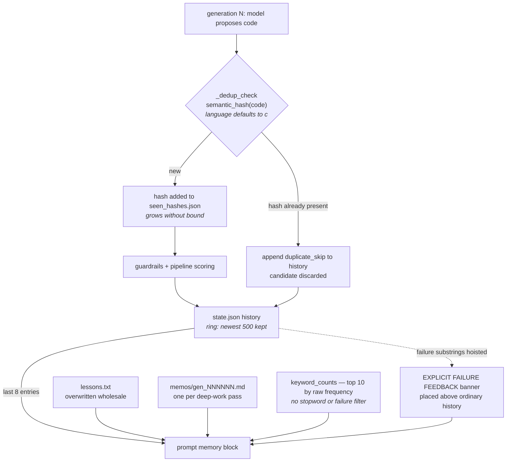

## 1. Executive Summary

KAISEN is an evolutionary coding harness — MIT, 15,315 lines of Python across 41
files, 9 commits since 4 August 2026 — that takes a program description, runs a
swarm of local or frontier models through a build → verify → score pipeline, and
keeps a champion. It ships a node-editor dashboard, a multi-turn agent loop, and
**KAI**, a line-oriented stdio protocol that lets another LLM spawn KAISEN as an
optimization sidecar and collect improved code later.

Its memory is four plain files per project, and their asymmetry is the finding.

`lessons.txt` is one blob, overwritten each time. `memos/gen_NNNNNN.md` is one
file per deep-work generation. `history` lives inside `state.json`. And
`seen_hashes.json` holds a semantic hash of every candidate the engine has ever
scored: `_dedup_check` refuses a candidate whose hash is already present,
records `duplicate_skip`, and moves on.

That visited set is the closest thing here to a value-keyed refusal, and the
distance between it and a real one is instructive. It is keyed on the content, it
is durable, and it does prevent a later generation from silently re-proposing the
same code — but it contains the *accepted* candidates too, including the
champion. It says "already tried", not "rejected", so it cannot tell a consumer
which of the two a hash represents, and the atlas's tombstone mark is withheld on
exactly that distinction.

The asymmetry underneath it is worse than the ambiguity. **`seen_hashes.json`
grows without bound, and `history` is truncated to the newest 500 entries.** The
`duplicate_skip` record naming which hash was refused — `{"generation": gen,
"outcome": "duplicate_skip", "detail": h[:16]}` — ages out; the refusal itself is
permanent. After enough generations the system is declining candidates for
reasons no longer written down anywhere, and the only durable artifact is a
sorted list of hex strings.

**One half of that asymmetry is a stated design decision, and the docstring
saying so makes the other half sharper.** `snapshots.py` opens with a note that
`seen_hashes.json` is *deliberately* excluded from a snapshot, because *"reverting
a project to an earlier state does NOT reset the visited set, so the engine never
re-evaluates code it has already scored (the memory that a candidate was tried
survives the undo of everything else)."* That is a defensible rule for the block —
re-scoring is the expensive thing, and not paying for it twice is the point. It
is not a rule about the *reason*, and nothing extends the same durability to the
history entry. So the design that keeps the refusal alive through a full revert
leaves its justification in a ring buffer that a busy afternoon empties.

The gap this leaves is one file. A `seen_hashes.json` that stored
`{hash: {gen, reason}}` rather than a sorted list of strings would cost nothing
in either the write path or the snapshot policy, and would make a
`duplicate_skip` answerable months later.

## 2. Mental Model

KAISEN is a loop with a champion. Each generation, the engine builds a prompt
from the project's memory, asks the models for a candidate, guards it, scores it
against a real pipeline, and keeps it if it wins.

Memory exists to stop the loop repeating itself, and it does that three ways at
three different strengths.

**Hard**: the visited hash set, which refuses a byte-equivalent candidate outright.

**Prompted**: the lesson and the memo, prose the model is shown.

**Statistical**: the keyword frequency line, meant to convey repetition without
the model reading everything.

Only the first is enforced. The second and third are text in a prompt, and the
third is currently noise.

## 3. Architecture

`engine.py` is the generation loop. `memory.py` is 110 lines and holds the whole
memory model. `state.py` is the per-project state with the bounded history.
`skills.py` carries `normalize_code` and `semantic_hash`. `snapshots.py` keeps up
to 25 full project copies. `guardrails.py` and `linters.py` police candidates,
`autofix.py` repairs mechanical errors, `swarm.py` runs parallel agents,
`kai.py` is the LLM-facing protocol, and `server.py` serves the dashboard.

## 4. Essential Implementation Paths

`kaisen/memory.py` is short enough to read in full and is where the design is.

`build_history_blob` is the part worth copying. It walks the recent history and
builds two things at once: a plain line per entry, and a separate list of
failures, detected by testing the outcome string against ten substrings —
`fail`, `error`, `timeout`, `rejected`, `skip`, `crash`, `violat`,
`no_metrics`, `no_code`, `cancelled`. If any failures were found, the blob is
assembled with them **first**, under an `--- EXPLICIT FAILURE FEEDBACK ---`
banner, above the ordinary chronology.

That is a real idea. The information was already in the history; the model would
have had to notice it among seven other lines. Hoisting negative outcomes to the
top of the block is a cheap way to make a repeated mistake the first thing read,
and it costs nothing but the ordering.

`engine.py:608-619` is `_dedup_check`, and `engine.py:790-800` is the prompt
assembly where the lesson, memo, keyword line and history blob are concatenated.

## 5. Memory Data Model

There is no schema. A lesson is a string in a file; a memo is markdown named by
generation; a history entry is a dict with `generation`, `outcome` and `detail`,
truncated to 500 characters for the line and 800 for the failure form; a visited
hash is a hex string in a sorted JSON array.

Nothing carries a timestamp, a source, a confidence or a status. The generation
number in a memo filename is the only ordering key in the memory layer, and
history entries carry a `generation` field that serves the same purpose.

## 6. Retrieval Mechanics

None, in any sense this atlas measures — the retrieval stack is recorded empty,
which here is an accurate description rather than a gap. The prompt builder takes
the whole lesson (truncated to 2,000 characters), the whole latest memo
(likewise), the keyword line, and the last eight history entries. Nothing is
selected by relevance to the current candidate, nothing is ranked, and nothing is
searched.

For a loop that works on one program with one champion, that is a defensible
choice: the corpus is small and the relevant material is recent by construction.
It also means the keyword counter is the only mechanism that compresses anything,
and it does filter: a hardcoded stopword set removes English function words and
generic code tokens, and a user-supplied `keywords.txt` overrides it as an
explicit allowlist, so the line reads as technique frequency rather than prose
word count. The docstring gives the constraint that shapes it — *"the counter
must never cost an LLM call"* — which is why the vocabulary is a literal in the
module rather than something learned.

## 7. Write Mechanics

Synchronous, and mostly wholesale. `save_lesson` writes the file, replacing
whatever was there. A memo is written once under its generation's name and never
revised. `append_history` appends and then truncates the list to `MAX_HISTORY =
500`. `_dedup_check` adds a hash and rewrites the sorted array.

The snapshot system is the safety net for all of it: `.kaisen_snapshots/` keeps
up to 25 full project copies, each carrying `meta.json` with `{created, reason,
kind}`, described in the module docstring as *"the 'unified standard we can
always revert back to'."* A snapshot carrying a **reason** rather than only a
timestamp is the right shape, and it means a lesson overwritten by mistake is
recoverable for 25 snapshots — a coarse undo, but a real one, and the only
history the lesson file has.

## 8. Agent Integration

A local dashboard, a `Ctrl+K` natural-language command surface whose actions are
described as *"always revertible"*, and an agent tool loop that reads the spec,
history, champion and lessons, runs the pipeline, and edits the spec with
validation — snapshotting before every mutation.

**KAI** is the interesting surface: a line-oriented stdio protocol
(`python main.py --kai`) where another LLM sends `BASELINE`, `GOAL`, and then
`ACCEPT <id>` to instantiate. The prompt for that step is *"review the spec JSON,
then ACCEPT `<id>` (or CREATE `<id>` `<spec-json>` to edit it first)"* — a
draft-then-confirm gate before a project exists. It is a gate on configuration
rather than on memory content, and the party reviewing is the calling model
rather than a person, so the human-review mark does not apply; but the shape —
generate a spec, show it, require an explicit accept — is the right one for an
agent handing work to another agent.

## 9. Reliability, Safety, and Trust

There is no epistemic state. A candidate is scored or it is not; a lesson is
whatever prose the last pass wrote.

The nearest thing to a trust signal is the failure vocabulary, and it is applied
in one place only. `FAILURE_KEYWORDS` drives the banner in `build_history_blob`
and is not consulted by `keyword_counts`, whose own vocabulary is a separate
stopword set. The two halves of the "how many times did X fail" idea are in the
same file and are not connected — the counter reports how often a technique
*came up*, which is what its docstring claims, and no function reports how often
one failed.

Guardrails do real work on the write path: an edit-scope check refuses a
candidate that changes functions outside an allowed set, with the message naming
them, and `_check_baseline_source` hashes the baseline file and warns loudly when
it has changed since the champion was measured — *"instead of silently scoring
against the wrong reference."* That second one is a genuine staleness check on a
stored artifact, and it is the sort of thing most harnesses discover the hard way.

No capability mark is carried. That is a real answer rather than an omission:
history is a ring rather than an audit log; the visited set is a visited set
rather than a tombstone, because it stores the hash of a candidate that was
*tried* rather than of a value that was *rejected*, and it is consulted to avoid
re-scoring rather than to refuse a claim; there is no status field; every path is
derived from `project.path`, which is a partition rather than a scope key on a
record; and there is no human gate on memory content.

**`negative_eval` is the near-miss and is worth naming, because a reader may well
reach the other conclusion.** `test_keyword_counts_filters_stopwords` writes a
lesson reading `"the and simd unroll the cache_line simd"`, calls
`keyword_counts`, and asserts `counts["simd"] == 2` alongside `"the" not in
counts and "and" not in counts` — a paired exclusion on a populated result, in
the correct shape. What it excludes is a token from a frequency line rather than
a record from a result: no lesson, memo or history entry is asserted to stay out
of anything. The mark tracks what the memory must not hand back, and this tracks
what the counter must not count.

## 10. Tests, Evals, and Benchmarks

489 test functions across 28 files — autofix, budget, campaigns, capability
checks, deep work, the KAI protocol, LLM resilience, resource controls, routing,
the server API, Windows compatibility, worker resizing, and two release-specific
suites. The autofix tests are the most detailed, asserting both directions of
mechanical repairs, including that an include is not added twice.

**The dedup path is tested, and the tests are written against the failure mode
rather than the happy path.** `test_semantic_hash_language_aware` asserts
that `semantic_hash("x = a // b", "python")` differs from
`semantic_hash("x = a", "python")` while the same pair *collides* under `"c"` —
one assertion pinning each side of the language branch.
`test_engine_dedup_uses_project_language` goes through the engine, under a
docstring reading *"Engine dedup must hash with the project language, not the C
default"*, and asserts both Python candidates pass `_dedup_check`.
`test_semantic_hash_file_infers_language` pins the extension inference.
`test_keyword_counts_filters_stopwords` and `test_keyword_counts_user_allowlist`
cover the counter's two modes.

What still has no test is the asymmetry: nothing asserts that a `duplicate_skip`
history entry survives long enough to explain the block it records, and nothing
could, because it does not.

There is no benchmark and no measurement of whether the memory helps. For a
system whose premise is measurable improvement — every candidate is scored by a
real pipeline — the absence is notable: the machinery to A/B a prompt-memory
change against a fixed baseline is already built and pointed at the code instead.

## 11. Patterns Worth Stealing

**Hoist failures above chronology.** The information is usually already in the
history; putting it first under its own banner costs an ordering and changes what
the model reads first.

**Put a reason on a snapshot.** `{created, reason, kind}` turns a backup
directory into something a person can navigate six weeks later.

**Hash the baseline your champion was measured against.** Detecting that the
reference moved is cheaper than discovering it through a mysteriously improved
score.

**Do not let a permanent block outlive its explanation.** If a decision is
enforced forever, the record of why belongs in a store with the same lifetime —
otherwise the system accumulates refusals it cannot justify. KAISEN is the clean
case: the block is excluded from snapshots on purpose so a revert cannot undo it,
and the explanation sits in a 500-entry ring that nothing protects.

**Pass the language to your normalizer, and say why in the docstring.** A
content hash that folds comments has to know which token starts one; the same
`//` is a comment in C and floor division in Python, and the default is where
the bug lives. The docstring on `semantic_hash` names the failure — *"floor
division would be stripped before hashing and distinct candidates could
collide"* — which is the version of this warning that survives a refactor,
because it travels with the function rather than with the caller.

**Give a token-frequency line a vocabulary.** Counting every token of three or
more characters returns function words; a stopword set makes the same line read
as technique frequency, and letting the user name the tokens outright makes it
read as *their* techniques. Both are literals, so neither costs a model call.

## 12. Open Questions

- How many hashes are in a mature `seen_hashes.json`, and how many of them
  still have a history entry? The two numbers are both cheap to print and
  neither is, so the size of the gap the design creates is unmeasured on any
  real run.
- Would a `{hash: {gen, reason}}` map break the snapshot policy? The note says
  the visited set is excluded so a revert cannot make the engine re-score; a map
  carrying the reason has the same property and answers the question the list
  cannot.
- Does a user reverting a project expect the visited set to come back with it?
  The module note settles the intent — never re-score — but a person clicking
  "revert to this snapshot" is asking for an earlier state, and the one thing
  they do not get back is the record of what has already been tried.
- Does anything ever shrink `seen_hashes.json`? For a system designed to run
  *"forever by default"*, an unbounded set read and rewritten every generation
  is the one structure whose cost grows without a stated bound.

## Appendix: File Index

| Path | What it carries |
| --- | --- |
| `kaisen/memory.py` | All four memory kinds, the failure vocabulary, and the keyword counter |
| `kaisen/state.py` | Project state and the 500-entry history ring |
| `kaisen/engine.py` | `_dedup_check`, the baseline-drift check, and prompt assembly |
| `kaisen/skills.py` | `normalize_code` and `semantic_hash`, with the language branch |
| `kaisen/snapshots.py` | Up to 25 full project copies, each with a reason |
| `kaisen/guardrails.py` | Edit-scope enforcement on candidates |
| `kaisen/kai.py` | The line-oriented sidecar protocol and the ACCEPT gate |
| `docs/KAI.md` | The LLM-facing protocol reference |

## Appendix: Recorded Searches

Run from the root of the checkout at the pinned commit.

| Claim | Command | Result at this pin |
| --- | --- | --- |
| The dedup hash is language-aware and wired | `grep -rn "normalize_code(\|semantic_hash(" --include="*.py" kaisen tools` | Four hits; `engine.py:848` passes `self._code_lang` |
| The visited set has no bound | `grep -n "seen_hashes" kaisen/engine.py` and read `_dedup_check` | `seen.add(h)` then `save_json(seen_file, sorted(seen))`; no cap, no eviction, no expiry |
| History is a ring | `grep -rn "MAX_HISTORY" kaisen` | Defined at `state.py:15`, applied at `:73-74` as a tail slice |
| The visited set survives a revert by design | `sed -n '1,15p' kaisen/snapshots.py` | The exclusion note, and `seen_hashes.json` in `_IGNORE` at `:29` |
| The keyword allowlist is wired | `grep -rn "load_keywords\|keywords.txt" --include="*.py" kaisen` | Read at `memory.py:134` into `keyword_counts`, with `_STOPWORDS` as the fallback |
| No capability mark applies | `grep -rniE "status\|append.*log\|audit\|approve\|reject" --include="*.py" kaisen/memory.py kaisen/state.py` | One hit, the `FAILURE_KEYWORDS` tuple |
| Test tree size | `grep -rc "def test_" tests/*.py` summed, and `ls tests/*.py \| wc -l` | 489 functions across 28 files |

## History

**2026-09-11** — [`d961bc5ddb0a8cbe2d66c0f7146084c737ea1246`](https://github.com/RAZZULLIX/KAISEN/commit/d961bc5ddb0a8cbe2d66c0f7146084c737ea1246) — re-read, 86 files and 18,697 insertions past the previous pin, 1,516 of them in the memory paths, **arriving in a single commit** whose message describes a worker-telemetry fix — the log is no guide to what moved here, and the diff has to be read directly. The package went from 15,315 lines across 41 files to 23,230 across 58. **Three of the four defects the first reading named are closed upstream, and the fixes name the failures they close.** `normalize_code` takes a `language` argument and branches — hash-comment languages get a whitespace-and-comment pass, C-family keeps the brace-aware normalizer — and `semantic_hash`'s docstring states the collision it prevents: *"floor division would be stripped before hashing and distinct candidates could collide."* `_dedup_check` passes `self._code_lang`, the argument the report noted was already in scope, under a comment at the call site saying the same thing. `keywords.txt` has a caller: `keyword_counts` reads it as an explicit allowlist and falls back to a hardcoded stopword set, so the frequency line is no longer prose word count. Four committed tests cover the three fixes, including one asserting that the C path still folds `// comment` while the Python path does not. **The asymmetry the eyebrow names is unchanged and is now explicit**: `snapshots.py` gained a note that `seen_hashes.json` is deliberately excluded from a snapshot so a revert cannot make the engine re-score — a defensible rule for the block, extended to nothing that explains it, while `MAX_HISTORY` stays at 500. Marks remain none, and `negative_eval` is named as the near-miss: `test_keyword_counts_filters_stopwords` has the right shape over the wrong object, excluding a token from a frequency line rather than a record from a result. Test tree 206 functions across ten files to 489 across 28. Screened before reading: one dependency manifest inside the cooldown, five unpinned ranges, a `tests/conftest.py` executing on collection; nothing was installed or run.

**2026-08-19** — [`f56a980bdd9daa8395e56a91eeb50bdbc625cd78`](https://github.com/RAZZULLIX/KAISEN/commit/f56a980bdd9daa8395e56a91eeb50bdbc625cd78)
— first reading. Screened before reading: no auto-run surface, one dependency
manifest inside the seven-day cooldown, one unpinned range, and a
`tests/conftest.py` that executes on collection. Nothing was installed and no
test was run.
