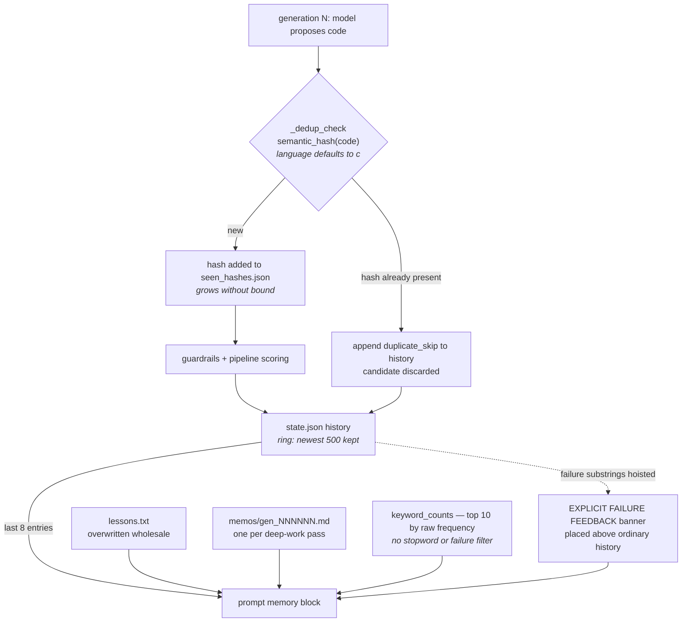

## 1. Executive Summary

KAISEN is an evolutionary coding harness — MIT, 15,315 lines of Python across 41
files, 9 commits since 4 August 2026 — that takes a program description, runs a
swarm of local or frontier models through a build → verify → score pipeline, and
keeps a champion. It ships a node-editor dashboard, a multi-turn agent loop, and
**KAI**, a line-oriented stdio protocol that lets another LLM spawn KAISEN as an
optimization sidecar and collect improved code later.

Its memory is four plain files per project, and their asymmetry is the finding.

`lessons.txt` is one blob, overwritten each time. `memos/gen_NNNNNN.md` is one
file per deep-work generation. `history` lives inside `state.json`. And
`seen_hashes.json` holds a semantic hash of every candidate the engine has ever
scored: `_dedup_check` refuses a candidate whose hash is already present,
records `duplicate_skip`, and moves on.

That visited set is the closest thing here to a value-keyed refusal, and the
distance between it and a real one is instructive. It is keyed on the content, it
is durable, and it does prevent a later generation from silently re-proposing the
same code — but it contains the *accepted* candidates too, including the
champion. It says "already tried", not "rejected", so it cannot tell a consumer
which of the two a hash represents, and the atlas's tombstone mark is withheld on
exactly that distinction.

The asymmetry underneath it is worse than the ambiguity. **`seen_hashes.json`
grows without bound, and `history` is truncated to the newest 500 entries.** The
`duplicate_skip` record naming which hash was refused ages out; the refusal
itself is permanent. After enough generations the system is declining candidates
for reasons no longer written down anywhere, and the only durable artifact is a
sorted list of hex strings.

Two smaller defects are checkable and both sit on the same path. `_dedup_check`
calls `semantic_hash(code)` with no language argument, so `normalize_code`
defaults to `language="c"` — and its C-family branch strips `//` to end of line
as a comment. On a Python project that is the floor-division operator, so `x = a
// b` normalizes to `x = a` before hashing, and two genuinely different
candidates can collide into a false duplicate that is silently skipped. The
engine has `self._code_lang` in scope at the call site.

And the keyword counter, which the prompt presents to the model as `KEYWORD
FREQUENCIES (lessons/memos)`, filters by nothing. Its docstring says it *"lets
the model see how often a technique failed without reading everything"*, but the
implementation counts every token of three or more characters and returns the top
ten by raw frequency, so on English prose the model receives function words. The
module defines a ten-entry `FAILURE_KEYWORDS` tuple used elsewhere, and a
`load_keywords` reader for a user-supplied `keywords.txt` — which **has no caller
anywhere in the repository**. Both of the things that would have made the counter
mean what its docstring says are present and unused.

## 2. Mental Model

KAISEN is a loop with a champion. Each generation, the engine builds a prompt
from the project's memory, asks the models for a candidate, guards it, scores it
against a real pipeline, and keeps it if it wins.

Memory exists to stop the loop repeating itself, and it does that three ways at
three different strengths.

**Hard**: the visited hash set, which refuses a byte-equivalent candidate outright.

**Prompted**: the lesson and the memo, prose the model is shown.

**Statistical**: the keyword frequency line, meant to convey repetition without
the model reading everything.

Only the first is enforced. The second and third are text in a prompt, and the
third is currently noise.

## 3. Architecture

`engine.py` is the generation loop. `memory.py` is 110 lines and holds the whole
memory model. `state.py` is the per-project state with the bounded history.
`skills.py` carries `normalize_code` and `semantic_hash`. `snapshots.py` keeps up
to 25 full project copies. `guardrails.py` and `linters.py` police candidates,
`autofix.py` repairs mechanical errors, `swarm.py` runs parallel agents,
`kai.py` is the LLM-facing protocol, and `server.py` serves the dashboard.

## 4. Essential Implementation Paths

`kaisen/memory.py` is short enough to read in full and is where the design is.

`build_history_blob` is the part worth copying. It walks the recent history and
builds two things at once: a plain line per entry, and a separate list of
failures, detected by testing the outcome string against ten substrings —
`fail`, `error`, `timeout`, `rejected`, `skip`, `crash`, `violat`,
`no_metrics`, `no_code`, `cancelled`. If any failures were found, the blob is
assembled with them **first**, under an `--- EXPLICIT FAILURE FEEDBACK ---`
banner, above the ordinary chronology.

That is a real idea. The information was already in the history; the model would
have had to notice it among seven other lines. Hoisting negative outcomes to the
top of the block is a cheap way to make a repeated mistake the first thing read,
and it costs nothing but the ordering.

`engine.py:608-619` is `_dedup_check`, and `engine.py:790-800` is the prompt
assembly where the lesson, memo, keyword line and history blob are concatenated.

## 5. Memory Data Model

There is no schema. A lesson is a string in a file; a memo is markdown named by
generation; a history entry is a dict with `generation`, `outcome` and `detail`,
truncated to 500 characters for the line and 800 for the failure form; a visited
hash is a hex string in a sorted JSON array.

Nothing carries a timestamp, a source, a confidence or a status. The generation
number in a memo filename is the only ordering key in the memory layer, and
history entries carry a `generation` field that serves the same purpose.

## 6. Retrieval Mechanics

None, in any sense this atlas measures — the retrieval stack is recorded empty,
which here is an accurate description rather than a gap. The prompt builder takes
the whole lesson (truncated to 2,000 characters), the whole latest memo
(likewise), the keyword line, and the last eight history entries. Nothing is
selected by relevance to the current candidate, nothing is ranked, and nothing is
searched.

For a loop that works on one program with one champion, that is a defensible
choice: the corpus is small and the relevant material is recent by construction.
It also means the keyword counter is the only mechanism that compresses anything,
which makes its being unfiltered the more costly.

## 7. Write Mechanics

Synchronous, and mostly wholesale. `save_lesson` writes the file, replacing
whatever was there. A memo is written once under its generation's name and never
revised. `append_history` appends and then truncates the list to `MAX_HISTORY =
500`. `_dedup_check` adds a hash and rewrites the sorted array.

The snapshot system is the safety net for all of it: `.kaisen_snapshots/` keeps
up to 25 full project copies, each carrying `meta.json` with `{created, reason,
kind}`, described in the module docstring as *"the 'unified standard we can
always revert back to'."* A snapshot carrying a **reason** rather than only a
timestamp is the right shape, and it means a lesson overwritten by mistake is
recoverable for 25 snapshots — a coarse undo, but a real one, and the only
history the lesson file has.

## 8. Agent Integration

A local dashboard, a `Ctrl+K` natural-language command surface whose actions are
described as *"always revertible"*, and an agent tool loop that reads the spec,
history, champion and lessons, runs the pipeline, and edits the spec with
validation — snapshotting before every mutation.

**KAI** is the interesting surface: a line-oriented stdio protocol
(`python main.py --kai`) where another LLM sends `BASELINE`, `GOAL`, and then
`ACCEPT <id>` to instantiate. The prompt for that step is *"review the spec JSON,
then ACCEPT <id> (or CREATE <id> <spec-json> to edit it first)"* — a
draft-then-confirm gate before a project exists. It is a gate on configuration
rather than on memory content, and the party reviewing is the calling model
rather than a person, so the human-review mark does not apply; but the shape —
generate a spec, show it, require an explicit accept — is the right one for an
agent handing work to another agent.

## 9. Reliability, Safety, and Trust

There is no epistemic state. A candidate is scored or it is not; a lesson is
whatever prose the last pass wrote.

The nearest thing to a trust signal is the failure vocabulary, and it is applied
in one place only. `FAILURE_KEYWORDS` drives the banner in `build_history_blob`
and is not consulted by `keyword_counts`, which is the function whose docstring
claims to report how often a technique failed. The two halves of the "how many
times did X fail" idea are in the same 110-line file and are not connected.

Guardrails do real work on the write path: an edit-scope check refuses a
candidate that changes functions outside an allowed set, with the message naming
them, and `_check_baseline_source` hashes the baseline file and warns loudly when
it has changed since the champion was measured — *"instead of silently scoring
against the wrong reference."* That second one is a genuine staleness check on a
stored artifact, and it is the sort of thing most harnesses discover the hard way.

No capability mark is carried. That is a real answer rather than an omission:
history is a ring rather than an audit log, the visited set is a visited set
rather than a tombstone, there is no status field, no scope key inside any
record, no human gate on memory content, and the 206 committed test functions
assert things about autofix, routing, gates and the KAI protocol rather than
about what memory must not return.

## 10. Tests, Evals, and Benchmarks

206 test functions across ten files — autofix, KAI, LLM repair, routing, safe
flight, the server API, skill stats, suggest gates, and two release-specific
suites. The autofix tests are the most detailed, asserting both directions of
mechanical repairs, including that an include is not added twice.

`test_failure_feedback_includes_constraint_violations` is the only test touching
the memory path, and it asserts the positive: a constraint violation *does* reach
the failure feedback. Nothing asserts a negative — that a duplicate is skipped,
that a lesson does not leak between projects, that the keyword line contains
anything useful. The dedup path, which is the one mechanism with permanent
consequences, has no test at all.

There is no benchmark and no measurement of whether the memory helps. For a
system whose premise is measurable improvement — every candidate is scored by a
real pipeline — the absence is notable: the machinery to A/B a prompt-memory
change against a fixed baseline is already built and pointed at the code instead.

## 11. Patterns Worth Stealing

**Hoist failures above chronology.** The information is usually already in the
history; putting it first under its own banner costs an ordering and changes what
the model reads first.

**Put a reason on a snapshot.** `{created, reason, kind}` turns a backup
directory into something a person can navigate six weeks later.

**Hash the baseline your champion was measured against.** Detecting that the
reference moved is cheaper than discovering it through a mysteriously improved
score.

**Do not let a permanent block outlive its explanation.** If a decision is
enforced forever, the record of why belongs in a store with the same lifetime —
otherwise the system accumulates refusals it cannot justify.

## 12. Open Questions

- How often does the C normalizer produce a false duplicate on Python projects?
  The mechanism is deterministic and the collision is easy to construct, but
  nothing logs a near-miss, so the rate on a real run is unknown and the symptom
  — a silently discarded candidate — is indistinguishable from a genuine repeat.
- Was `keywords.txt` meant to filter the counter? A reader exists, no caller
  does, and the file name suggests exactly the missing argument to
  `keyword_counts`. Reading the tree cannot tell a dropped intention from an
  unfinished one.
- What happens to the visited set across a snapshot restore? `seen_hashes.json`
  is in the snapshot ignore list, so reverting a project to an earlier snapshot
  keeps every hash learned since — deliberate if the intent is never to
  re-evaluate, surprising if the intent is to return to an earlier state.
- Does anything ever shrink `seen_hashes.json`? For a system designed to run
  *"forever by default"*, an unbounded set read and rewritten every generation
  is the one structure whose cost grows without a stated bound.

## Appendix: File Index

| Path | What it carries |
| --- | --- |
| `kaisen/memory.py` | All four memory kinds, the failure vocabulary, and the keyword counter |
| `kaisen/state.py` | Project state and the 500-entry history ring |
| `kaisen/engine.py` | `_dedup_check`, the baseline-drift check, and prompt assembly |
| `kaisen/skills.py` | `normalize_code` and `semantic_hash`, with the language branch |
| `kaisen/snapshots.py` | Up to 25 full project copies, each with a reason |
| `kaisen/guardrails.py` | Edit-scope enforcement on candidates |
| `kaisen/kai.py` | The line-oriented sidecar protocol and the ACCEPT gate |
| `docs/KAI.md` | The LLM-facing protocol reference |

## History

**2026-08-19** — [`f56a980bdd9daa8395e56a91eeb50bdbc625cd78`](https://github.com/RAZZULLIX/KAISEN/commit/f56a980bdd9daa8395e56a91eeb50bdbc625cd78)
— first reading. Screened before reading: no auto-run surface, one dependency
manifest inside the seven-day cooldown, one unpinned range, and a
`tests/conftest.py` that executes on collection. Nothing was installed and no
test was run.
