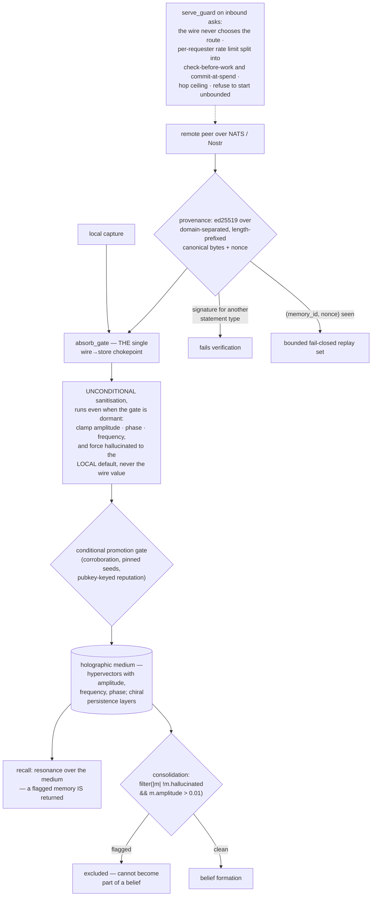

## 1. Executive Summary

kannaka-memory is 119,396 lines of Rust at version 0.16.5 with 1,433 test
functions, presenting itself as "a wave-interference memory system with
bilateral chiral hemispheres, dream consolidation, belief formation, and
multi-agent collective sensemaking" on "the **Holographic Resonance Medium** — a
10,000-dimensional tensor field where recall is matrix multiplication, not
search."

The register is unusual for this corpus and it is worth separating from the
engineering, because the two are not the same and only one of them is the reason
to read it.

The substrate is real. `encoding.rs` is a text→embedding→hypervector pipeline
with a pluggable `TextEncoder`, a `SimpleHashEncoder` for offline use, a
codebook projection and "HDC algebra" — hyperdimensional computing, a
well-established family that genuinely does recall by vector operations rather
than index lookup, and genuinely does degrade by superposition rather than
deletion. "Memories don't get stored. They resonate" is a florid way to say
that, not a claim without code. What the prose does not do is let a reader tell
which parts are mechanism and which are decoration without opening the files.

The reason to read it is elsewhere. This is a memory that crosses between agents
over NATS and Nostr, so its real problem is not recall — it is that a remote
peer can say anything. Three modules hold that boundary, and all three are
written like a security review.

`provenance.rs` signs memories with ed25519 over domain-separated,
length-prefixed canonical bytes, "so a signature minted for one statement type
fail[s] verification as any other", with a per-message nonce and a bounded
fail-closed replay set — and `verify_mem` "is PURE: it never reads the clock;
the caller passes `now_ms` so tests are deterministic."

`absorb_gate.rs` is "the single write-side chokepoint every wire→store absorb
path routes through", and its first responsibility runs unconditionally, "even
when the gate is dormant": clamp amplitude, phase and frequency to finite
ranges, and

> "**forces `hallucinated` to the local default, NEVER the wire value** (an
> attacker must not be able to set/clear the immune flag over the wire)."

That is the mark this report awards. `hallucinated` is a stored flag that
excludes a memory from consolidation — `.filter(|m| !m.hallucinated && m.amplitude > 0.01)`
at both weaving sites — so a memory a node has judged fabricated cannot be woven
into a belief. The flag is the local node's judgement about a remote node's
claim, and the gate's job is to make sure the remote node cannot write its own
verdict. A test says it in four words: "the wire immune flag is never trusted."

`serve_guard.rs` is the third, and its docstring is the best security writing in
this batch. It names the exposure it closes — before it, "a node configured with
a paid provider was a public, unmetered endpoint for anyone on the bus" — states
the invariant, and then explains where it deliberately departs from the
project's own ADR and why:

> "The ceiling is what matters, not where the ceiling lives."

It derives the route from local config "and from nothing else", collecting any
routing-shaped field on the envelope so `serve` can log that it was ignored —
neither honouring a caller's routing hint nor discarding it silently. It caps
hop count so "two brainless nodes cannot bounce one question between them
forever". And it splits its rate limiter into a check before the work and a
commit at the spend, because metering the hourly ceiling before the resonance
gate meant "[a]n abuse control that a stranger can turn into an outage cheaper
than the abuse is not a control."

The licence needs stating plainly. The SPACE CHILD LICENSE v1.0 grants broad
free permissions for "Peaceful Purpose" and restricts use directed at armed
aggression or the targeting of civilians. Whatever one thinks of the intent, a
field-of-use restriction is not open source under the OSI definition, and a
badge-shaped `LICENSE` file at the root of a Rust project will be read as one
unless someone says otherwise.

## 2. Mental Model

A **memory** is a hypervector with an amplitude, a frequency and a phase. It
fades by interference, not deletion.

A **belief** is what consolidation weaves from memories that survived.

The **hallucination flag** is the local node's verdict, and only the local node
may set it.

The **wire** is the threat model: another agent's signed statement, which may
be a lie.

## 3. Architecture

| Area | Role |
| --- | --- |
| `src/encoding.rs`, `codebook.rs`, `geometry.rs`, `wave.rs` | The hyperdimensional substrate |
| `src/absorb_gate.rs` | One write chokepoint, unconditional sanitisation and a conditional gate |
| `src/provenance.rs` | Ed25519 signing, domain separation, the replay set |
| `src/serve_guard.rs` | What a node will spend answering a stranger |
| `src/reputation.rs` | A pubkey-keyed trust core |
| `src/consolidation.rs` | Dream consolidation and belief formation, where the flag is read |
| `src/medium/`, `hrm_store.rs`, `store.rs` | Persistence and resonance recall |
| `src/collective/`, `hive_*`, `swarm_*`, `nats.rs`, `nostr/` | The swarm |
| `evals/` | Containerised benchmark tasks with Dockerfiles and probes |

## 4. Essential Implementation Paths

`src/absorb_gate.rs:1-16`. Sixteen lines that explain the threat model, the
chokepoint and the one field the wire may never touch.

`src/serve_guard.rs:1-43`. The exposure, the invariant, the deliberate
divergence from the ADR, and four decisions each with the reason it exists.

`src/provenance.rs:1-20` for what is signed and why the verification is pure.

## 5. Memory Data Model

A `HyperMemory` carries an id, a vector, an amplitude, a frequency, a phase and
the `hallucinated` flag, with `LegacyLink` edges holding a strength, a resonance
key and a span, and `MergeRecord` entries recording a merge's timestamp, source
agent, source memory id, merge type, phase difference and the amplitude before
and after.

That merge record is worth noting: a consolidation that changes a memory's
amplitude leaves behind who it merged with and what the amplitude was on each
side. For a store whose forgetting is amplitude decay rather than deletion,
recording the before value is what makes a decay auditable after the fact.

There is no epistemic status vocabulary beyond the single boolean, no validity
interval, and no supersession pointer — correction here is interference, which
is a coherent position for an HDC substrate and a limitation for anything that
needs to say "this was wrong, specifically."

## 6. Retrieval Mechanics

Resonance against the medium with beam expansion, which is the HDC answer: the
query is a vector, recall is a similarity over the field, and nothing is looked
up by key.

The `hallucinated` flag does not participate. It filters consolidation at two
sites and is absent from `store.rs`'s recall path, so a memory a node has
flagged is still returned to a caller that asks for it. That is a defensible
split — the flag withholds a memory from becoming a belief rather than from
being seen — and it means a consumer reading recall output has to check the
field itself.

## 7. Write Mechanics

One chokepoint, two responsibilities, and the ordering matters. Sanitisation is
unconditional and runs even when the corroboration gate is switched off, which
is what closes the "raw-insert gap" the comment names. The gate proper —
corroboration against pinned seeds and a pubkey-keyed reputation core — is
conditional on configuration.

A reader designing something similar should take the split rather than the
policy: the part that must never be skipped is separated from the part an
operator may turn off, and the separation is in the code rather than in a
runbook.

## 8. Agent Integration

A CLI, ACP and MCP surfaces, NATS and Nostr transports, bridges to other agent
systems, and a swarm loop. The `serve_guard` exists because the swarm's
broadcast subject is reachable by an anonymous identity, which is the honest
consequence of building memory on a public bus.

## 9. Reliability, Safety, and Trust

Covered above, with one addition. The recurring pattern across all three
boundary modules is that each names the specific failure it prevents and, in two
cases, the earlier version of the code that had it: the unmetered endpoint, the
rate limiter that could be turned into an outage, the raw-insert gap that let a
wire value set the immune flag. A project that documents its own prior exposures
in the module that fixed them is doing the thing this atlas usually has to do
from the outside.

Against that, the licence and the prose pull the other way. A reader deciding
whether to adopt this has to work out for themselves that "spiral cores in the
phase field" is belief formation over an HDC medium, and has to read a bespoke
licence carefully enough to notice it is not open source.

## 10. Tests, Evals, and Benchmarks

1,433 test functions, an `evals/` tree of containerised tasks —
`recall-paraphrase-regression`, `semantic-encoder`, `zero-overlap-anomaly`, plus
specs — each with a Dockerfile, an instruction, probes and tests, and a
`bench/` directory.

The absorb-gate tests are the ones to read: four separate assertions that the
sanitised output has `hallucinated` at the local default, one of them named
"the wire immune flag is never trusted". A property that matters is asserted
from several directions rather than once.

## 11. For Your Own Build

Separate what may never be skipped from what an operator may disable. The
absorb gate's unconditional sanitisation runs when the conditional gate is
dormant, and that ordering is the whole defence against a raw-insert path.

Never let the wire write your verdict. If a record carries a field that
represents *your* judgement of it — hallucinated, trusted, verified — force it
to the local value on ingest rather than validating the remote one. Validation
can be wrong; overwriting cannot.

Collect and log the fields you ignore. `serve_guard` gathers routing-shaped
fields off the envelope so it can record that they were disregarded, which is
better than honouring them and better than dropping them silently, because the
log is how you find out someone is trying.

Split a rate limiter around the work. Metering before the gate lets a stranger
spend your quota on requests you were going to refuse, which turns an abuse
control into an outage control.

And if your README is written in metaphor, put one paragraph of plain mechanism
beside it. The substrate here is real and a sceptical reader has no cheap way to
find that out.

## 12. Open Questions

Whether `hallucinated` should gate recall as well as consolidation. The split is
defensible and nothing in the tree records it as a decision.

What sets the flag. The gate protects it from the wire; which local process
judges a memory fabricated was not traced here.

How the licence is intended to interact with redistribution. It is bespoke, it
carries field-of-use restrictions, and a reader who assumes a permissive default
from the file's shape would be wrong.

## Appendix: File Index

| Path | What to read it for |
| --- | --- |
| `src/absorb_gate.rs:1-16` | One chokepoint, and the field the wire may never set |
| `src/serve_guard.rs:1-43` | An invariant, a deliberate ADR departure, and four bounded decisions |
| `src/provenance.rs:1-20` | Domain-separated signing and a verification that never reads the clock |
| `src/consolidation.rs:1673`, `:1812` | Where the flag actually excludes something |
| `src/memory.rs` | A merge record that keeps the amplitude on both sides |
| `LICENSE` | A bespoke licence with field-of-use restrictions |

## History

**2026-09-16** — [`0312ad520fe3ac6d389da0656d7955c8073bb7a2`](https://github.com/kannaka-labs/kannaka-memory/commit/0312ad520fe3ac6d389da0656d7955c8073bb7a2) — first reading, at a commit dated 15 September 2026. Licensed under the bespoke SPACE CHILD LICENSE v1.0, which carries field-of-use restrictions and is therefore not an open-source licence under the OSI definition. Screened before opening, from a shallow clone: six files scanned, one auto-run surface, two build-time execution points, no unpinned surfaces and three dependency files inside the seven-day cooldown. Nothing was installed, built or run.
