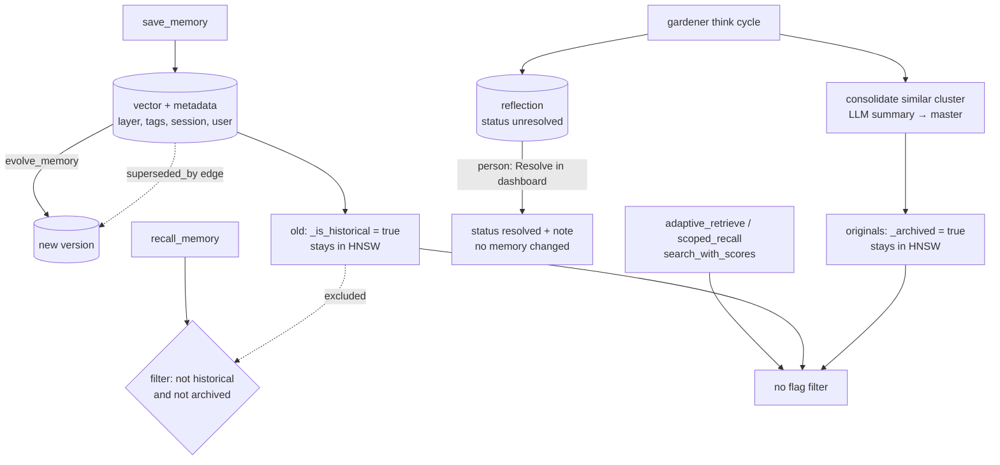

## 1. Executive Summary

KektorDB is a vector database written in Go that presents itself as "the
cognitive memory layer for AI agents". It is Apache-2.0, version 0.6.1, with 374
commits since 5 September 2025, about 46,000 lines of non-test Go and 537 test
functions in 113 files, with a Rust library under `native/compute` beside it.
It runs as a REST server, an embedded Go library, an MCP server, or a RAG proxy
in front of a chat model.

Underneath is a real storage engine:

- HNSW indexes over memory-mapped arenas, with vacuum and connection refinement
- roaring-bitmap metadata filters, B-trees for numeric fields and BM25 postings
- a batched append-only file with CRC-framed records, corruption resync and
  snapshot-based compaction

Above it sit a property graph whose edges carry created and deleted
timestamps, so traversals can be run as of a moment, and a background
**gardener** that calls an LLM to consolidate clusters of similar memories,
summarise episodic memories into semantic ones, and write *reflections* about
contradictions, preference changes and knowledge gaps.

Memory change is recorded as flags on the memory. `evolve_memory` writes a new
version and marks the old one `_is_historical`. The gardener marks consolidated
and summarised memories `_archived` and leaves them in the vector index.
`recall_memory` excludes both flags. `adaptive_retrieve`, `scoped_recall` and
`search_with_scores` apply no such filter, so an agent using them reads
superseded versions and the originals of consolidated clusters as current. The
filter in `recall_memory` also stops applying to all but the last requested
layer when a caller asks for two or more layers.

One mark: `negative_eval`.

## 2. Mental Model

An **index** is a namespace: vectors, their metadata, the text and filter
indexes, and a graph. MCP tools default to `mcp_memory`.

A **memory** is a vector with metadata. The memory layer decides decay (per-layer
half-life and model: exponential, linear, step or Ebbinghaus) and whether it is
pinned by default. Reading a memory can reinforce it.

**Change** happens through flags and edges rather than overwrites:

- `evolve_memory` → new node, `superseded_by` / `evolves_from` edges, old node
  `_is_historical`
- gardener consolidation → master node, `consolidated_into` edges, originals
  `_archived`
- `resolve_conflict` with a discard id → loser `_archived` and deleted from the
  index

**Reflections** are memories of type `reflection` the gardener writes about
what it noticed, with a status, severity and suggested resolution, linked to the
memories involved.

## 3. Architecture

| Package | Role |
| --- | --- |
| `pkg/core` | The database: indexes, metadata filters, BM25, graph adjacency with time filtering, KV store |
| `pkg/core/hnsw`, `pkg/storage/mmap` | HNSW index, optimizer and refinement; memory-mapped arenas and compaction |
| `pkg/persistence` | Lazy AOF writer, framing, snapshot and rewrite |
| `pkg/engine` | Operations (`VAdd`, `VSearch`, `VEvolve`, `VDelete`, `VLink`), fusion search with decay, recovery, epistemic assessment, events |
| `pkg/cognitive` | The gardener and its detectors, consolidation, user profiling |
| `pkg/compiler` | Knowledge artifacts from templates, cached and recompiled by a watcher |
| `pkg/rag`, `pkg/proxy` | Document pipeline, adaptive retriever, OpenAI-compatible RAG gateway |
| `pkg/auth` | ES256 JWT keys with roles and allowed indexes, revocation list |
| `internal/mcp`, `internal/server`, `internal/tui` | MCP service, REST handlers and dashboard, terminal UI |

### Deployment and ergonomics

- **What has to run:** the `kektordb` binary, as REST, MCP (`--mcp
  --tools=agent`) or proxy; `kektordb setup opencode` writes client
  configuration.
- **Models:** a built-in ONNX MiniLM embedder for memories; the gardener,
  profiling and artifact compilation call an LLM (an OpenAI-compatible endpoint or Gemini) when the cognitive configuration enables them.
- **Hand-repairable:** no. The AOF and arenas are binary; the dashboard, TUI and
  REST API are the inspection surfaces.

The screen of this checkout found no auto-run surface, three build-time
execution points (`Makefile`, the Python client's `setup.py` and its test
`conftest.py`), one unpinned surface, and eight dependency files changed within
the seven-day cooldown, including `go.mod`, `go.sum` and the Rust lockfile.
Nothing was installed, built or run.

## 4. Essential Implementation Paths

- **Save** — `internal/mcp/service.go:188-275`: embed, metadata with layer,
  tags, session and user ids, `VAdd`, manual and session links.
- **Recall** — `service.go:358-422`: optional layer filter joined to
  `defaultMemoryFilter` (`:42`, `_is_historical != 'true' AND _archived !=
  'true'`), `VSearch` with alpha 0.5, optional layer weights, optional
  reinforcement.
- **Filter evaluation** — `pkg/core/core.go:1785-1840`: split on `OR` first,
  then on `AND` inside each block, no parentheses; `!=` is all ids minus the
  matches.
- **Scoped and adaptive retrieval** — `service.go:424-554` (graph filter from a
  root, empty metadata filter) and `pkg/rag/adaptive_retriever.go:107`
  (`VSearch` with an empty filter, then graph expansion).
- **Evolution** — `pkg/engine/ops.go:843-895`.
- **Consolidation** — `pkg/cognitive/gardener.go:1110-1124` and `:1286-1298`;
  episodic archiving at `:1682-1698`.
- **Conflict resolution** — `service.go:1053-1092` (MCP) and
  `internal/server/http_handlers.go:1482-1528` (REST).
- **Edge time filtering** — `pkg/core/graph.go:251` onward, comparing
  `CreatedAt` and `DeletedAt` with `atTime`.

## 5. Memory Data Model

A vector's metadata is an open map. Strings go to the inverted index and BM25,
numbers to B-trees, booleans to the inverted index as `"true"` or `"false"`,
arrays element by element (`core.go:1489-1600`). Reserved keys begin with an
underscore: `_created_at`, `_access_count`, `_pinned`, `_is_historical`,
`_archived`, `_consolidated_into`.

**Edges** (`pkg/core/graph.go:20-26`) carry a target, `CreatedAt`, `DeletedAt`,
a weight and properties, with a lighter reverse-edge list for incoming
traversal. Unlinking sets `DeletedAt`; traversal with `atTime > 0` returns
edges that existed then. Both timestamps are the system clock at write
(`pkg/engine/graph.go:75`), and no field records when a relation held in the
world, so `bitemporal` is withheld.

**Epistemic state** — crystallized, stable, volatile or contested — is computed
on demand by `assess_belief` from consensus, stability and friction over the
nearest memories (`pkg/engine/epistemic.go`), and is not stored on memories.
The flags that recall reads mark supersession and consolidation, a lifecycle
rather than a belief, so `trust_state` is withheld.

**Scope.** JWT keys carry a role and a list of allowed index names checked in
the REST middleware (`pkg/auth/rbac.go:113-135`). That is a partition by index.
`user_id` and `session_id` are stored in metadata and read by profiling and
session tools, but no recall tool filters on them, so `scope_enforced` is
withheld.

## 6. Retrieval Mechanics

**Fusion search** (`ops.go:896` onward) runs HNSW and BM25 when there is a text
query, fuses them with `alpha`, restricts candidates with the metadata filter
and an optional graph scope, and multiplies by a decay factor derived from
last access, per-layer half-life and model; pinned memories skip decay.

**The flag filter is on one tool.** `recall_memory` passes
`defaultMemoryFilter`. The others that return memories to an agent do not:

| Tool | Filter on `_is_historical` / `_archived` |
| --- | --- |
| `recall_memory` | yes, with the precedence problem below |
| `assess_belief` | yes (`service.go:2236`) |
| `scoped_recall` | no — a graph filter only (`service.go:457`) |
| `adaptive_retrieve` | no — `VSearch` with `""` (`adaptive_retriever.go:107`) |
| `search_with_scores` | no — `VSearchWithScores` (`service.go:2345`) |

Evolution and gardener consolidation set flags and leave the vectors indexed
(`ops.go:885`, `gardener.go:1118-1124`), so those three tools return a
superseded version beside its successor and the originals of a consolidated
cluster beside the master. Only a conflict resolution with a discard id deletes
the loser from the index.

**Operator precedence in `recall_memory`.** With `layers: ["episodic",
"semantic"]` the filter string becomes `memory_layer='episodic' OR
memory_layer='semantic' AND _is_historical != 'true' AND _archived != 'true'`
(`service.go:379-392`). The evaluator splits on `OR` first and on `AND` within
each block (`core.go:1785-1797`), so the exclusion attaches only to the last
layer. Every historical or archived episodic memory is eligible. The gardener
archives episodic memories after summarising them (`gardener.go:1682-1698`), so
that is the population this reaches. The filter tests cover single-clause and
`AND`-joined expressions, not the combination `recall_memory` builds.

**Adaptive retrieval** seeds with a vector search, then expands along edges
with a density filter up to a token budget, labelled as the default strategy
`graph`.

## 7. Write Mechanics

**Saving** is direct: no extraction, no dedup at write. The gardener finds
near-duplicates later, asks an LLM for a merged summary, creates a master
memory, transfers incoming edges and archives the cluster.

**Contradictions** are detected by the gardener with an LLM over similar
memories and written as reflections. In advanced mode it may resolve minor ones
itself. An agent resolves one with `resolve_conflict`, optionally naming a
memory to discard, which is archived and deleted.

**Evolution** keeps history. The old node remains readable through
`get_memory_evolution` along `superseded_by` edges.

**Persistence** writes each operation to the AOF before applying it, batched
with periodic fsync. Compaction rewrites the AOF from a snapshot. The AOF is a
recovery log, not a history, and the event bus (`pkg/engine/events.go`) feeds
the dashboard and TUI over server-sent events without storing them, so
`audit_log` is withheld.

**Tombstones.** Nothing records a discarded value that later writes are checked
against. A memory archived as the loser of a conflict can be saved again and
recalled.

## 8. Agent Integration

- **MCP** — 49 tools in the `agent` profile and 57 with `--tools=all`: memory
  CRUD, graph traversal and paths, sessions with summaries,
  `check_subconscious` for reflections, user profiles, knowledge artifacts,
  index and KV administration, snapshots and AOF compaction.
- **Setup plugins** for OpenCode and Hermes write client configuration; the
  Hermes setup also installs the skill in `skills/kektordb`.
- **REST** mirrors most operations and serves a dashboard with memories, a
  graph view, a reflection feed and admin pages.
- **RAG proxy** sits between a chat UI and an OpenAI-compatible model, retrieving
  from an index and injecting context.

## 9. Reliability, Safety, and Trust

**Crash safety is the strongest part.** CRC-framed AOF records, resync past a
corrupt region, snapshot-mode compaction and recovery tests.

**A person's review changes no memory.** The dashboard's reflection feed
(`internal/server/ui/static/js/cognitive.js:177-189`) posts a free-text
resolution that sets the reflection's status to resolved. The request carries no
discard id, and `check_subconscious` lists reflections without filtering on
status (`service.go:995-1050`), so resolving in the UI neither changes the
memories involved nor removes the reflection from what the agent is shown. The
dashboard adds memories and deletes whole indexes; it has no per-memory edit or
delete. `human_review` is withheld.

**Authorization is per index.** A read key for `mcp_memory` reads every user's
and session's memories in it. The MCP server takes no credentials.

**Injection.** Saved content, document chunks and gardener summaries are all
memories; an LLM-written consolidation replaces the originals in
`recall_memory` without keeping their wording beside it.

## 10. Tests, Evals, and Benchmarks

537 Go test functions across the core, HNSW, persistence and recovery, filters,
graph time travel, the gardener, compiler, auth and MCP handlers, plus Python
and TypeScript client tests. None was run for this report.

`pkg/engine/roaring_filters_test.go:172` asserts that the `_is_historical`
filter keeps a historical memory out while returning a current one, and `internal/mcp/p2_expansion_test.go:214` asserts a historical reflection is
left out of `list_reflections`. That
earns `negative_eval`. No test exercises `recall_memory` with more than one
layer, or asserts that `adaptive_retrieve` or `scoped_recall` exclude
superseded memories.

**Benchmarks.** `BENCHMARKS.md` reports recall@10 and QPS against Qdrant and
ChromaDB on GloVe and SIFT, measured on version 0.5.x, and engine
micro-benchmarks for 0.6. No agent-memory benchmark is committed.
`test-app-results.json` and `test-plan-results.json` at the root hold
acceptance and load runs.

## 11. For Your Own Build

### Steal

- **Evolve instead of overwrite,** with incoming edges copied to the new version
  and a typed link back to the old one.
- **Soft-deleted edges with timestamps** give traversal as of a moment almost for
  free.
- **Per-layer decay models and pinning** as index configuration rather than
  code.
- **CRC-framed append-only records with resync** so a torn write loses one
  record, not the file.

### Avoid

- **A visibility flag honoured by one read tool.** Put the exclusion in the
  engine's default, or delete superseded vectors from the ANN index.
- **A filter language without grouping,** composed by string concatenation.
- **A review button that changes nothing** the agent reads.

### Fit

KektorDB suits a builder who wants an embeddable Go vector store with graph
edges, decay and crash-safe persistence, and is prepared to own the memory
policy on top. Its agent-memory layer is broad but uneven at this commit.
Where agents must not read superseded or consolidated memories through every
retrieval tool, the flag handling needs to move into the engine first.

## 12. Open Questions

- **Should historical and archived vectors leave the HNSW index,** or should
  `VSearch` exclude them unless asked?
- **Is a dashboard resolution meant to feed back into the gardener,** for
  example as a rule for future contradiction checks?
- **Will `user_id` become a recall filter** for multi-user deployments?

## Appendix: File Index

- `internal/mcp/service.go`, `internal/mcp/server.go`
- `pkg/engine/ops.go`, `pkg/engine/graph.go`, `pkg/engine/epistemic.go`, `pkg/engine/events.go`
- `pkg/core/core.go`, `pkg/core/graph.go`, `pkg/core/hnsw/`
- `pkg/cognitive/gardener.go`, `pkg/rag/adaptive_retriever.go`
- `pkg/auth/rbac.go`, `internal/server/http_handlers.go`, `internal/server/ui/static/js/cognitive.js`
- `pkg/engine/roaring_filters_test.go`, `internal/mcp/p2_expansion_test.go`

**Searches behind the absence claims**

- `grep -rn "defaultMemoryFilter" internal pkg` — `service.go:389`, `:391` and `:2236` only
- `grep -n "historical\|archived\|Filter" pkg/rag/adaptive_retriever.go` — no flag filter
- `grep -rn "_archived" pkg/cognitive/gardener.go` — set by flag, no `VDelete` beside it
- `grep -rn "user_id" internal/mcp/service.go` — written on save, read by profiling and sessions
- `grep -rln -i audit pkg internal` — comments and tool descriptions only

## History

**2026-09-15** — [`addc5f0c4891c185fa584bac4ccb3f209291a7c1`](https://github.com/sanonone/kektordb/commit/addc5f0c4891c185fa584bac4ccb3f209291a7c1) — first reading, at a commit dated 14 September 2026. Screened before opening: no auto-run surface, three build-time execution points, one unpinned surface, and eight dependency files inside the seven-day cooldown. Nothing was installed, built or run.
