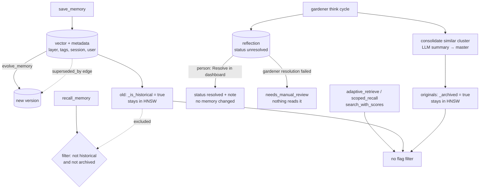

## 1. Executive Summary

KektorDB is a vector database written in Go that presents itself as "the
cognitive memory layer for AI agents", and runs as a REST server, an embedded
Go library, an MCP server, or a RAG proxy in front of a chat model. Its storage
engine is the strongest part. Its memory policy is the weakest: superseded and
consolidated memories stay in the vector index behind flags, one of four recall
tools filters them, and that filter is composed in a language that splits on
`OR` before `AND` and has no grouping.

Underneath is a real storage engine:

- HNSW indexes over memory-mapped arenas, with vacuum and connection refinement
- roaring-bitmap metadata filters, B-trees for numeric fields and BM25 postings
- a batched append-only file with CRC-framed records, corruption resync and
  snapshot-based compaction

Above it sit a property graph whose edges carry created and deleted
timestamps, so traversals can be run as of a moment, and a background
**gardener** that calls an LLM to consolidate clusters of similar memories,
summarise episodic memories into semantic ones, and write *reflections* about
contradictions, preference changes and knowledge gaps.

Memory change is recorded as flags on the memory. `evolve_memory` writes a new
version and marks the old one `_is_historical`. The gardener marks consolidated
and summarised memories `_archived` and leaves them in the vector index.
`recall_memory` excludes both flags. `adaptive_retrieve`, `scoped_recall` and
`search_with_scores` apply no such filter, so an agent using them reads
superseded versions and the originals of consolidated clusters as current. The
filter in `recall_memory` also stops applying to all but the last requested
layer when a caller asks for two or more layers. The same composition defect
recurs in the dashboard's reflection status filter and in the core-fact
detector, whose selector matches no memory.

One mark: `negative_eval`.

## 2. Mental Model

An **index** is a namespace: vectors, their metadata, the text and filter
indexes, and a graph. MCP tools default to `mcp_memory`.

A **memory** is a vector with metadata. The memory layer decides decay (per-layer
half-life and model: exponential, linear, step or Ebbinghaus) and whether it is
pinned by default. Reading a memory can reinforce it.

**Change** happens through flags and edges rather than overwrites:

- `evolve_memory` → new node, `superseded_by` / `evolves_from` edges, old node
  `_is_historical`
- gardener consolidation → master node, `consolidated_into` edges, originals
  `_archived`
- `end_session` → the gardener summarises the session, and its episodic
  memories become `_archived`
- opt-in epistemic resolution → a `consolidated_belief` node, and each
  conflicting memory evolved into the same consolidated text, originals
  `_is_historical`
- `resolve_conflict` with a discard id → loser `_archived` and deleted from the
  index

**Reflections** are memories of type `reflection` the gardener writes about
what it noticed, with a status, severity and suggested resolution, linked to the
memories involved. When the gardener's own resolution attempt fails it sets the
status to `needs_manual_review`.

```mermaid
%% caption: supersession and consolidation are flags on memories that stay in the index; only recall_memory reads the flags
flowchart TB
    SAVE["save_memory"] --> MEM[("vector + metadata<br/>layer, tags, session, user")]
    MEM -->|"evolve_memory"| NEW[("new version")]
    MEM -.->|"superseded_by edge"| NEW
    MEM --> HIST["old: _is_historical = true<br/>stays in HNSW"]
    GARD["gardener think cycle"] --> CONS["consolidate similar cluster<br/>LLM summary → master"]
    CONS --> ARCH["originals: _archived = true<br/>stays in HNSW"]
    GARD --> REFL[("reflection<br/>status unresolved")]
    REFL -->|"person: Resolve in dashboard"| NOTE["status resolved + note<br/>no memory changed"]
    REFL -->|"gardener resolution failed"| ESC["needs_manual_review<br/>nothing reads it"]
    Q1["recall_memory"] --> F1{"filter: not historical<br/>and not archived"}
    Q2["adaptive_retrieve / scoped_recall<br/>search_with_scores"] --> F2["no flag filter"]
    HIST --> F2
    ARCH --> F2
    HIST -.->|"excluded"| F1
```

## 3. Architecture

| Package | Role |
| --- | --- |
| `pkg/core` | The database: indexes, metadata filters, BM25, graph adjacency with time filtering, KV store |
| `pkg/core/hnsw`, `pkg/storage/mmap` | HNSW index, optimizer and refinement; memory-mapped arenas and compaction |
| `pkg/persistence` | Lazy AOF writer, framing, snapshot and rewrite |
| `pkg/engine` | Operations (`VAdd`, `VSearch`, `VEvolve`, `VDelete`, `VLink`), fusion search with decay, recovery, epistemic assessment, events |
| `pkg/cognitive` | The gardener and its detectors, consolidation, user profiling |
| `pkg/compiler` | Knowledge artifacts from templates, cached and recompiled by a watcher |
| `pkg/rag`, `pkg/proxy` | Document pipeline, adaptive retriever, OpenAI-compatible RAG gateway |
| `pkg/auth` | ES256 JWT keys with roles and allowed indexes, revocation list |
| `internal/mcp`, `internal/server`, `internal/tui`, `internal/setup` | MCP service, REST handlers and dashboard, terminal UI, client setup |

### Deployment and ergonomics

- **What has to run:** the `kektordb` binary, as REST, MCP (`--mcp
  --tools=agent`) or proxy; `kektordb setup <client>` writes client
  configuration.
- **Models:** a built-in ONNX MiniLM embedder for memories; the gardener,
  profiling and artifact compilation call an LLM (an OpenAI-compatible endpoint or Gemini) when the cognitive configuration enables them.
- **Hand-repairable:** no. The AOF and arenas are binary; the dashboard, TUI and
  REST API are the inspection surfaces.

A screen of a full clone found no auto-run surface and three build-time
execution points: `Makefile`, the Python client's `setup.py` and its test
`conftest.py`. The TypeScript client's `package.json` carries four floating
ranges beside a lockfile. On 30 September 2026 no dependency file was inside
the seven-day cooldown; the newest, `native/compute/Cargo.toml`, last
changed on 10 September 2026, and `go.mod` and `go.sum` in May 2026. Nothing
was installed, built or run.

## 4. Essential Implementation Paths

- **Save** — `internal/mcp/service.go:188-275`: embed, metadata with layer,
  tags, session and user ids, `VAdd`, manual and session links.
- **Recall** — `service.go:358-422`: optional layer filter joined to
  `defaultMemoryFilter` (`:42`, `_is_historical != 'true' AND _archived !=
  'true'`), `VSearch` with alpha 0.5, optional layer weights, optional
  reinforcement.
- **Filter evaluation** — `pkg/core/core.go:1785-1840`: split on `OR` first,
  then on `AND` inside each block, no parentheses; `!=` is all ids minus the
  matches.
- **Scoped and adaptive retrieval** — `service.go:424-554` (graph filter from a
  root, empty metadata filter) and `pkg/rag/adaptive_retriever.go:107`
  (`VSearch` with an empty filter, then graph expansion).
- **Evolution** — `pkg/engine/ops.go:843-895`.
- **Consolidation** — `pkg/cognitive/gardener.go:1110-1124` and `:1286-1298`;
  session archiving in `SummarizeSession` at `:1682-1698`; epistemic
  consolidation at `:3562-3629`.
- **Conflict resolution** — `service.go:1053-1092` (MCP) and
  `internal/server/http_handlers.go:1482-1528` (REST).
- **Core-fact selection** — `gardener.go:3725-3731`.
- **Edge time filtering** — `pkg/core/graph.go:251` onward, comparing
  `CreatedAt` and `DeletedAt` with `atTime`.

## 5. Memory Data Model

A vector's metadata is an open map. Strings go to the inverted index and BM25,
numbers to B-trees, booleans to the inverted index as `"true"` or `"false"`,
arrays element by element (`core.go:1489-1600`). Reserved keys begin with an
underscore: `_created_at`, `_access_count`, `_pinned`, `_is_historical`,
`_archived`, `_consolidated_into`.

**Edges** (`pkg/core/graph.go:20-26`) carry a target, `CreatedAt`, `DeletedAt`,
a weight and properties, with a lighter reverse-edge list for incoming
traversal. Unlinking sets `DeletedAt`; traversal with `atTime > 0` returns
edges that existed then. Both timestamps are the system clock at write
(`pkg/engine/graph.go:75`), and no field records when a relation held in the
world, so `bitemporal` is withheld.

**Epistemic state** — crystallized, stable, volatile or contested — is computed
on demand by `assess_belief` from consensus, stability and friction over the
nearest memories (`pkg/engine/epistemic.go`), and is not stored on memories.
Friction counts incoming `contradicts` and `invalidates` edges, the second
written by a REST route (`POST /graph/actions/invalidate`); the `invalidated_by`
key conflict resolution sets on a discarded memory is metadata, which friction
does not read. The flags that recall reads mark supersession and consolidation, a
lifecycle rather than a belief, so `trust_state` is withheld.

**Scope.** JWT keys carry a role and a list of allowed index names checked in
the REST middleware (`pkg/auth/rbac.go:113-135`). That is a partition by index.
`user_id` and `session_id` are stored in metadata and read by profiling and
session tools, but no recall tool filters on them, so `scope_enforced` is
withheld.

## 6. Retrieval Mechanics

**Fusion search** (`ops.go:897` onward) runs HNSW and BM25 when there is a text
query, fuses them with `alpha`, restricts candidates with the metadata filter
and an optional graph scope, and multiplies by a decay factor derived from
last access, per-layer half-life and model; pinned memories skip decay.

**The flag filter is on one recall tool.** `recall_memory` passes
`defaultMemoryFilter`. The other tools that return memories to an agent by
similarity do not:

| Tool | Filter on `_is_historical` / `_archived` |
| --- | --- |
| `recall_memory` | yes, with the precedence problem below |
| `assess_belief` | yes (`service.go:2236`) |
| `scoped_recall` | no — a graph filter only (`service.go:457`) |
| `adaptive_retrieve` | no — `VSearch` with `""` (`adaptive_retriever.go:107`) |
| `search_with_scores` | no — `VSearchWithScores` (`service.go:2345`) |

Evolution and gardener consolidation set flags and leave the vectors indexed
(`ops.go:885`, `gardener.go:1118-1124`), so those three tools return a
superseded version beside its successor and the originals of a consolidated
cluster beside the master. Only a conflict resolution with a discard id deletes
the loser from the index.

**Operator precedence in `recall_memory`.** With `layers: ["episodic",
"semantic"]` the filter string becomes `memory_layer='episodic' OR
memory_layer='semantic' AND _is_historical != 'true' AND _archived != 'true'`
(`service.go:379-392`). The evaluator splits on `OR` first and on `AND` within
each block (`core.go:1785-1797`), so the exclusion attaches only to the last
layer. Every historical or archived episodic memory is eligible. Ending a
session archives its episodic memories after summarising them
(`gardener.go:1682-1698`), so that is the population this reaches.

**The same composition fails in two more places, and one caller works around
it.** The dashboard's *Unresolved* button requests
`/reflections?status=unresolved`, and the handler appends the status clause to
an `OR` of four reflection types (`http_handlers.go:1447-1451`). The clause
binds only to `knowledge_evolution`, so the view a person reviews from lists
resolved contradictions beside open ones. The core-fact detector writes a grouped filter,
`(type='user_interaction' OR memory_layer='episodic') AND _archived != 'true'`
(`gardener.go:3727`). The parser keeps the parentheses inside the key `(type`
and the value `episodic')`, neither block matches, and whenever the detector
is enabled it returns before its LLM call. `list_reflections` states the limit in a
comment — "VFilter's parser does not support parentheses" — and filters the
flags in Go instead (`service.go:2540-2575`).

**Adaptive retrieval** seeds with a vector search, then expands along edges
with a density filter up to a token budget, labelled as the default strategy
`graph`.

## 7. Write Mechanics

**Saving** is direct: no extraction, no dedup at write. The gardener finds
near-duplicates later, asks an LLM for a merged summary, creates a master
memory, transfers incoming edges and archives the cluster.

**Contradictions** are detected by the gardener with an LLM over similar
memories and written as reflections. In advanced mode it may resolve minor ones
itself. An agent resolves one with `resolve_conflict`, optionally naming a
memory to discard, which is archived and deleted.

**Epistemic resolution**, off unless `epistemic_resolution_enabled` is set,
takes unresolved reflections, asks an LLM for a consolidated statement, adds a
`consolidated_belief` node, and calls `VEvolve` on each conflicting memory with
that statement as its content and the cluster centroid as its vector
(`gardener.go:3562-3629`). A contradiction among three memories therefore
leaves four live nodes carrying the same text, and recall returns them as
separate hits.

**Evolution** keeps history. The old node remains readable through
`get_memory_evolution` along `superseded_by` edges.

**Persistence** writes each operation to the AOF before applying it, batched
with periodic fsync. Compaction rewrites the AOF from a snapshot. The AOF is a
recovery log, not a history, and the event bus (`pkg/engine/events.go`) feeds
the dashboard, TUI and gardener over in-process channels without storing
events, so `audit_log` is withheld. What survives compaction are the edges and
flags each mutation leaves on the records it touched.

**Tombstones.** Nothing records a discarded value that later writes are checked
against. A memory archived as the loser of a conflict can be saved again and
recalled.

## 8. Agent Integration

- **MCP** — 49 tools in the `agent` profile and 57 with `--tools=all`: memory
  CRUD, graph traversal and paths, sessions with summaries,
  `check_subconscious` for reflections, user profiles, knowledge artifacts,
  index and KV administration, snapshots and AOF compaction.
- **Setup** — `kektordb setup` writes MCP configuration for Claude Code, Cursor,
  Gemini CLI, Codex, OpenCode and Hermes (`internal/setup/setup.go`). OpenCode
  also gets a TypeScript plugin that adds save-and-recall guidance to the system
  prompt and creates the index; Hermes gets a skill from
  `internal/setup/plugins/hermes/SKILL.md`, a file distinct from
  `skills/kektordb/SKILL.md`.
- **REST** mirrors most operations and serves a dashboard with memories, a
  graph view, a reflection feed and admin pages.
- **RAG proxy** sits between a chat UI and an OpenAI-compatible model, retrieving
  from an index and injecting context.

## 9. Reliability, Safety, and Trust

**Crash safety is the strongest part.** CRC-framed AOF records, resync past a
corrupt region, snapshot-mode compaction and recovery tests.

**A person's review changes no memory.** The dashboard's reflection feed
(`internal/server/ui/static/js/cognitive.js:177-189`) posts a free-text
resolution that sets the reflection's status to resolved. The request carries no
discard id, and `check_subconscious` lists reflections without filtering on
status (`service.go:995-1050`), so resolving in the UI neither changes the
memories involved nor removes the reflection from what the agent is shown. The
dashboard adds memories and deletes whole indexes; it has no per-memory edit or
delete.

**The escalation state has no reader.** The gardener's `escalateToManual`
writes `needs_manual_review` (`gardener.go:3632-3641`). No other line in the
tree names that status, and the REST status filter's allowlist omits it
(`http_handlers.go:1424-1430`), so the dashboard cannot select it. The agent's
own profile carries `resolve_conflict` (`internal/mcp/toolnames.go:152`), which
resolves any reflection by id. `human_review` is withheld.

**Authorization is per index.** A read key for `mcp_memory` reads every user's
and session's memories in it. The MCP server runs over stdio and takes no
credentials.

**Injection.** Saved content, document chunks and gardener summaries are all
memories; an LLM-written consolidation replaces the originals in
`recall_memory` without keeping their wording beside it.

## 10. Tests, Evals, and Benchmarks

537 Go test functions across the core, HNSW, persistence and recovery, filters,
graph time travel, the gardener, compiler, auth and MCP handlers, plus Python
and TypeScript client tests. None was run for this report.

`pkg/engine/roaring_filters_test.go:172` asserts that the `_is_historical`
filter keeps a historical memory out of an engine search while returning a
current one. `TestVEvolve` (`:296-306`) evolves a preference, then asserts the
same search excludes the superseded memory and returns its successor. That
earns `negative_eval`, on the engine search under the clause `recall_memory`
composes.

Two nearby cases carry less than their names. `TestListReflectionsHistoricalExcluded`
(`internal/mcp/p2_expansion_test.go:214`) seeds only a historical reflection
and asserts a total of zero, which an empty result also satisfies.
`TestScopedRecallTwoStage_RespectsScope` compares each formatted result, shaped
`[id] content`, with the bare id `out_of_scope` (`scoped_recall_test.go:137`),
so it cannot fail. No test calls the `Recall` handler, so neither the
multi-layer precedence case nor the flag exclusion is asserted at the tool, and
no test reaches `detectCoreFacts`.

**Benchmarks.** `BENCHMARKS.md` reports recall@10 and QPS against Qdrant and
ChromaDB on GloVe and SIFT, measured on version 0.5.x, and engine
micro-benchmarks for 0.6. No agent-memory benchmark is committed.
`test-app-results.json` and `test-plan-results.json` at the root hold
acceptance and load runs. No paper is cited in the README or `docs/`.

## 11. For Your Own Build

### Steal

- **Evolve instead of overwrite,** with incoming edges copied to the new version
  and a typed link back to the old one.
- **Soft-deleted edges with timestamps** give traversal as of a moment almost for
  free.
- **Per-layer decay models and pinning** as index configuration rather than
  code.
- **CRC-framed append-only records with resync** so a torn write loses one
  record, not the file.

### Avoid

- **A visibility flag honoured by one read tool.** Put the exclusion in the
  engine's default, or delete superseded vectors from the ANN index.
- **A filter language without grouping,** composed by string concatenation.
  Once one caller documents the limit, grep the others for it.
- **A review button that changes nothing** the agent reads.

### Fit

KektorDB suits a builder who wants an embeddable Go vector store with graph
edges, decay and crash-safe persistence, and is prepared to own the memory
policy on top. Its agent-memory layer is broad but uneven at this commit.
Where agents must not read superseded or consolidated memories through every
retrieval tool, the flag handling needs to move into the engine first.

## 12. Open Questions

- **Should historical and archived vectors leave the HNSW index,** or should
  `VSearch` exclude them unless asked?
- **Is a dashboard resolution meant to feed back into the gardener,** for
  example as a rule for future contradiction checks?
- **Will `user_id` become a recall filter** for multi-user deployments?
- **Is epistemic resolution meant to leave one node per conflicting memory,**
  or should the evolved copies point at the `consolidated_belief` node instead?

## Appendix: File Index

- `internal/mcp/service.go`, `internal/mcp/server.go`, `internal/mcp/toolnames.go`
- `pkg/engine/ops.go`, `pkg/engine/graph.go`, `pkg/engine/epistemic.go`, `pkg/engine/events.go`
- `pkg/core/core.go`, `pkg/core/graph.go`, `pkg/core/hnsw/`
- `pkg/cognitive/gardener.go`, `pkg/rag/adaptive_retriever.go`
- `pkg/auth/rbac.go`, `internal/server/middleware.go`, `internal/server/http_handlers.go`, `internal/server/ui/static/js/cognitive.js`, `internal/server/ui/static/index.html`
- `internal/setup/setup.go`, `internal/setup/plugins/`
- `pkg/engine/roaring_filters_test.go`, `internal/mcp/p2_expansion_test.go`, `internal/mcp/scoped_recall_test.go`

**Searches behind the absence claims**

- `grep -rn "defaultMemoryFilter" internal pkg` — the definition at `service.go:42`, and uses at `:389`, `:391` and `:2236` only
- `grep -n -E "historical|archived" pkg/rag/adaptive_retriever.go` — nothing
- `grep -n -E "_archived|VDelete" pkg/cognitive/gardener.go` — set by flag at `:1119`, `:1293` and `:1691`, read by the detectors' scans; the gardener never calls `VDelete`
- `git grep -n -E '_is_historical|_archived' -- internal/mcp ':!*_test.go'` — the MCP service excludes flagged memories at `service.go:42` and `:2563-2567` only
- `git grep -n -E '"\([a-z_]+ ?(=|!=)'` — one grouped filter, `gardener.go:3727`
- `git grep -n needs_manual_review` — `gardener.go:3634` only
- `git grep -n '\.Recall(' -- '*_test.go'` and `git grep -n -i corefact -- '*_test.go'` — nothing
- `grep -rn "user_id" internal/mcp/service.go` — written on save, read by profiling and sessions
- `git grep -n -i -E 'valid_?(from|to|at|until)|event_?time|occurred_?at' -- '*.go' ':!*_test.go'` — no validity field
- `git grep -n -i -E 'invalidat|tombstone|denylist|suppress' -- '*.go' ':!*_test.go'` — `invalidated_by` edges and metadata, and the JWT revocation denylist; no value-keyed record
- `git grep -n "EventBus.Subscribe" -- '*.go'` — the SSE handler and the gardener, neither persisting events
- `grep -rln -i audit pkg internal` — comments and tool descriptions only
- `git grep -n -i -E 'arxiv|bibtex|citation|doi\.org' -- '*.md' '*.cff'` — nothing

## History

**2026-09-30** — [`addc5f0c4891c185fa584bac4ccb3f209291a7c1`](https://github.com/sanonone/kektordb/commit/addc5f0c4891c185fa584bac4ccb3f209291a7c1) — audit at the same commit, which is upstream HEAD. No mark moved; the `negative_eval` record cites the evolve-then-search case and drops a `list_reflections` case an empty result passes. Four published claims were wrong. The screen line put eight dependency files inside the cooldown; the full history dates seven of them to November 2025 – August 2026, leaving `native/compute/Cargo.toml`. The version was given as 0.6.1; HEAD is past the v0.6.2 tag. Setup was said to cover OpenCode and Hermes and to install `skills/kektordb`; it covers six clients and installs another file. `ops.go:896` was one line off. Newly described in [section 6](#6-retrieval-mechanics): the same OR-before-AND composition in the dashboard's status filter and a core-fact selector that matches nothing. Screened again: no auto-run, nothing inside the cooldown; nothing installed, built or run.

**2026-09-15** — [`addc5f0c4891c185fa584bac4ccb3f209291a7c1`](https://github.com/sanonone/kektordb/commit/addc5f0c4891c185fa584bac4ccb3f209291a7c1) — first reading, at a commit dated 14 September 2026. Screened before opening: no auto-run surface, three build-time execution points, one unpinned surface, and eight dependency files inside the seven-day cooldown. Nothing was installed, built or run.
