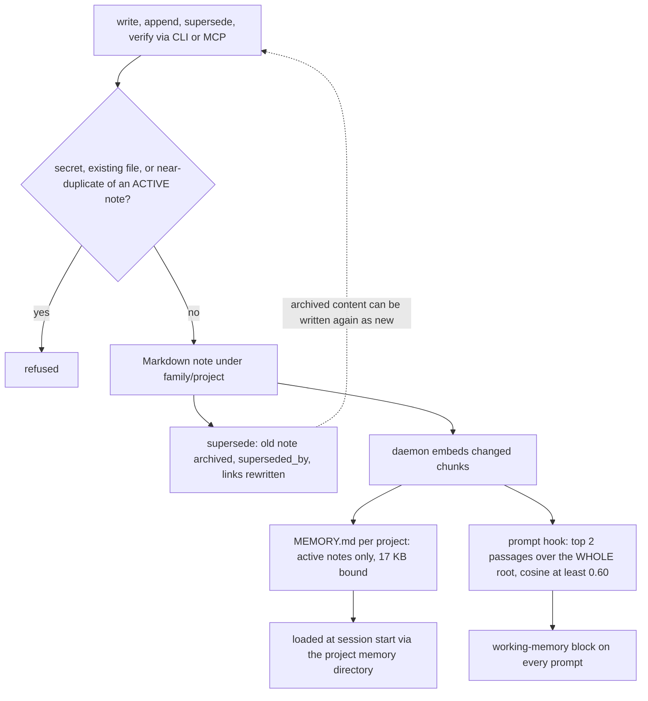

## 1. Executive Summary

Kept is a memory for coding agents that is nothing but Markdown files. One Rust binary embeds them with a small model on the CPU — the README measures 198 MB resident and a tenth of a second per answer — searches them locally with no server and no network at query time, and wires itself into Claude Code as a prompt hook and an MCP server, and into Codex CLI, opencode, Gemini CLI, Cursor, Windsurf and Kandev as an MCP server. MIT or Apache-2.0, twenty-nine commits by one author since 6 September 2026, 6,157 lines of Rust with 1,545 lines of tests and a CI that runs them, clippy and coverage.

A note carries frontmatter — a name, a one-line description, a type, a `status`, a `verified` date — and a body. The agent writes, appends to, supersedes and re-verifies notes through tools; supersession archives the old note with a `superseded_by` link and rewrites every link that pointed at it. Nothing is deleted.

Two read paths reach the model. The prompt hook runs on every request of thirty characters or more, finds the two passages closest to it with a cosine of at least 0.60, and prints them inside a `<working-memory>` block that tells the model they may be off topic and to read the whole note before relying on one. And one generated `MEMORY.md` per project — the *hot index*, bounded to 17 KB, ordered durable knowledge first and projects last, compacting oldest-verified project notes first when it overflows — is what Claude Code loads at session start once its per-project memory directory is linked to the right folder. The hot index excludes archived notes, and a committed test that renders a populated index and asserts the archived note is absent earns the atlas's `negative_eval` mark.

Its two weaknesses are both about what the read and write paths do not consult. The hot index follows the project directory, but the hook and search read the whole root, so a question in one project can be answered with another project's notes — the per-project directory is a physical partition, which the rubric does not count as `scope_enforced`, and the read path that runs on every prompt does not use it. And the write path refuses a near-duplicate only of an *active* note, so a fact that was superseded can be written back as a new note.

## 2. Mental Model

A fact becomes a memory when an agent or a person writes a note and the index embeds it. It is believed as far as its `verified` date suggests — the date is shown beside every passage the hook returns, and `kept curation` lists notes that have gone stale. It stops being current when it is superseded: the old note becomes `status: archived` with `superseded_by: [[new]]`, drops out of search, answers and the hot index, and stays on disk.



## 3. Architecture

A single binary with a daemon mode. The root, `~/kept` by default, holds `<family>/<project>/<note>.md` and the generated `MEMORY.md` files; a state directory beside it holds the vector index, caches, a search journal and the learned feedback table. The daemon keeps the embedding model resident so the hook answers quickly, and re-indexes notes that changed on disk. The tokenizers and the model runtimes — XLM-RoBERTa and ModernBERT — are implemented in the crate rather than pulled from a Python stack; `tokenizer_parity.rs` checks them against the reference tokenizer. There is no database and no model call anywhere on the memory path.

## 4. Essential Implementation Paths

- **Writing.** `create_note` (`src/main.rs:1139-1178`) refuses secrets found by `refuse_secrets`, refuses a file that exists with a pointer to `append` or `supersede`, and unless `--force` is given refuses a note whose name, description and body sit within the duplicate threshold of an existing note — found by `nearest_active_note` (`:1089-1110`), which keeps only hits whose note is active (`:1107`). A new note gets `status: active` and today's `verified` date. `append_note` refuses secrets and re-stamps `verified`.
- **Superseding.** `run_supersede` (`:1234-1260`) sets the old note's `status` to `archived` and `superseded_by` to the new note, and `lifecycle::relink` rewrites every `[[old]]` link in the root to the new name.
- **Answering.** `Engine::answer` (`:604-636`) ranks chunks by cosine plus learned bonuses, skips any note that is not active (`:618`), and returns passages with their path, score and `verified` date within a character budget. `search` does the same with an opt-in for archives (`:577`).
- **The hook.** `run_hook` (`:1746-1773`) reads the prompt, skips short ones and slash or bang commands, queries with its first twelve lines, keeps passages at or above `KEPT_HOOK_MIN` (0.60), and prints them in a `<working-memory>` block with the off-topic caution.
- **The hot index.** `hot::write` renders one `MEMORY.md` per project from that project's active notes plus its family's `common` project, in the order durable knowledge, ways of working, projects, shared, and compacts project notes oldest-verified first past `BOUND` = 17,408 bytes, counting what it left out in a comment (`src/hot.rs`).

## 5. Memory Data Model

| Field | Meaning |
| --- | --- |
| `name`, `description` | identity and the one line the hot index shows |
| `type` | the stratum: durable knowledge, ways of working, project, reference |
| `status` | `active` or `archived`; absent means active |
| `verified` | the date the note was last confirmed, set on write, append and verify |
| `superseded_by`, `depends_on`, `source` | links and provenance, optional |

The body is Markdown with `[[wiki links]]`. There is no per-note owner, agent or session, and no confidence.

## 6. Retrieval Mechanics

Vector only: chunks are embedded by the local model and ranked by cosine, with a bonus from `feedback.rs` for notes a previous, similar query was pointed to by `kept learn`. The README's own comparison against "a well-ranked grep" on its private corpus is the argument for dropping the lexical arm; the committed synthetic corpora in `bench/corpora/` let anyone run the same protocol. Archived notes are excluded from answers and the hook, and from search unless asked. No project or family filter is applied on any of these paths.

## 7. Write Mechanics

A write is a file write plus an incremental embed of the changed note by the daemon, so a note is retrievable seconds after it is written; the hot index is regenerated by `kept index` or `kept regen`. No background pass rewrites notes. The write blocks the caller only for the file write and the duplicate check, which embeds the candidate text once.

## 8. Agent Integration

`kept setup` finds installed tools and wires them: a `UserPromptSubmit` hook and an MCP registration for Claude Code, MCP entries for the others. The MCP tools are `search`, `answer`, `read`, `write`, `append`, `link` and `learn`. The README recommends a short `CLAUDE.md` block telling the model to search before a task and to write, append and supersede rather than edit, and asks the user to link Claude Code's per-project memory directory to the matching Kept project so the hot index loads.

## 9. Reliability, Safety, and Trust

**The hook reads across projects.** The one read path that runs on every prompt ranks every active note in the root. A request in project A can be answered with project B's notes if they are close enough in vector space — the caution in the preamble is the only defence. The hot index does follow the project, because it is built from the project's directory; that is a physical partition, and the rubric counts it in the prose rather than as `scope_enforced`.

**A superseded fact can come back.** `nearest_active_note` keeps only active hits, so a note whose content matches an archived note is not a duplicate and is written. The `superseded_by` link is a record of the replacement, keyed on the note rather than on its content, and nothing on the write path reads it — the same one-predicate gap the [tombstone pattern](../../patterns/rejected-value-tombstone/) documents in MemoryOps AI and Memora Engine.

**Secrets are refused on the way in,** by a scanner with its own tests, and the notes are plain files a person can read, grep and version.

**The benchmark headline is private.** The recall table in the README is measured on 296 private bilingual notes; `docs/BENCHMARKS.md` says so and ships two synthetic corpora and the tooling to reproduce the protocol. I did not run it.

## 10. Tests, Evals, and Benchmarks

Eighteen test files under `tests/`; CI runs `cargo fmt --check`, clippy with warnings as errors, `cargo test --all-targets` and coverage. I did not run any of it.

The case the mark rests on is `strata_archived_and_shared_notes_are_rendered_in_order` (`tests/hot.rs:20-37`): five notes in a project, one archived; the rendered hot index must place the durable-knowledge, ways-of-working, projects and shared sections in order and list the shared note, must not contain the archived `old.md`, and must count one archived note. The exclusion is asserted beside a populated render, and an index that listed every note would fail it. Beside it, `tests/duplicates.rs` asserts an archived note's chunks do not count toward near-duplicate detection, and `tests/frontmatter.rs` that an archived status makes a note inactive. The feedback, secrets, chunking, tokenizer-parity and search suites cover the rest.

What is not tested is the gap above: no test writes a superseded note's content again and asserts a refusal.

## 11. For Your Own Build

### Steal

- **A bounded session index, generated.** One file per project, capped in bytes, ordered so durable knowledge survives compaction and old project notes leave first, with a line saying how many left. It keeps session-start context from growing with the corpus.
- **A `verified` date on every fact, shown with it.** It is not a trust state, but it gives the model and the person a cheap reason to doubt an old note.
- **Refusing duplicates and secrets at write time**, with messages that name the command to use instead.

### Avoid

- **A per-prompt hook over every project.** Filter the hook by the project the session is in, as the hot index already does.
- **A duplicate check that ignores archived notes.** Include them, and refuse — or at least flag — content that matches something superseded.

### Fit

A strong choice for one developer who wants a local, inspectable memory shared across several coding agents, and who is willing to link the per-project memory directory and keep projects' notes apart by hand. Less suitable when several unrelated projects share a root and their notes must not meet in a prompt.

## 12. Open Questions

- How often, on a real root, the hook's 0.60 threshold admits a passage from a different project; the private corpus that sets the default is not available to measure it.

## Appendix: File Index

- Commands, engine, hook, MCP: `src/main.rs`. Note model: `src/note.rs`. Lifecycle edits: `src/lifecycle.rs`.
- Hot index: `src/hot.rs`. Index and similarity: `src/index.rs`, `src/similarity.rs`. Duplicates: `src/duplicates.rs`. Feedback: `src/feedback.rs`. Secrets: `src/secrets.rs`.
- Embedding and tokenizers: `src/embedder.rs`, `src/xlm_roberta.rs`, `src/modernbert.rs`, `src/tokenizer.rs`, `src/bpe.rs`.
- Tests: `tests/`. Benchmarks: `docs/BENCHMARKS.md`, `bench/corpora/`.

**Searches recorded for the negative claims**

```sh
rg -n "fn run_hook|fn answer_text|fn search_text" -A4 src/main.rs | rg project   # 0: no project argument on the hook, answer or search
rg -n "is_active" src/main.rs                                                    # nearest_active_note keeps active hits only (:1107)
rg -n "superseded_by" src                                                        # written by supersede; read by the linter and for display, never on the write path
rg -n "remove_file|fs::remove" src/main.rs                                      # the daemon socket and a failed model download only: no note is deleted
```

## History

**2026-09-11** — [`1de02b9c9fb06b9b3ce4f7711750412b13f14831`](https://github.com/codexofc/kept/commit/1de02b9c9fb06b9b3ce4f7711750412b13f14831) — first reading. Screened with `scripts/screen_repo.py`: no auto-running configuration and no build-time execution path; two manifests inside the seven-day cooldown and no unpinned surface. Nothing was built or run.
