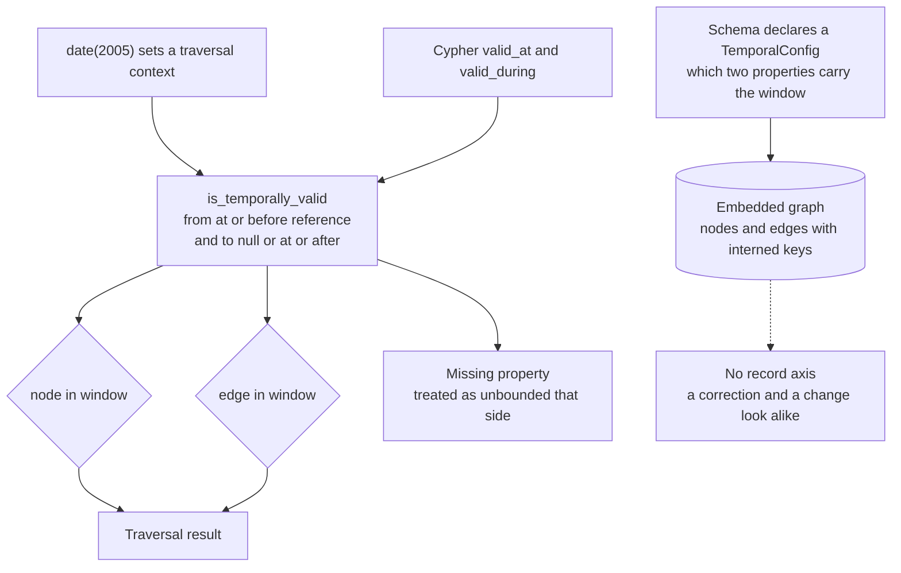

## 1. Executive Summary

KGLite is an MIT-licensed embedded knowledge graph — 362,473 lines of Rust with
4,172 test functions, 2,922 commits since March 2024 — that runs in-process with
no database service, speaks Cypher and a fluent traversal API, and ships a Bolt
server, a C ABI, a Python wheel with no required runtime dependencies, and an MCP
server. The README states the intent that brings it into this corpus: the same
graph should serve *"an application, an analyst, or an LLM agent."*

It is a graph engine rather than a memory system, and the honest way to read it
here is as a substrate — what does it give a memory built on top of it, and what
does it leave to the builder?

One mark. What it gives is **time**, in the form most useful to a traversal: a
context you set once.

```python
temporal_graph.date("2005").select("Field").where({"title": "DRAUGEN"}).traverse("HAS_LICENSEE")
```

The date is not a predicate repeated at every hop. It is a context, and every
node and edge the traversal crosses is checked against it —
`valid_from <= reference AND (valid_to IS NULL OR valid_to >= reference)`, with a
missing bound treated as unbounded on that side. The committed test asserts both
halves of what that must mean: at 2005 the licensee that held the licence from
2000 to 2010 is in the result, and the one that did not is not.

What it does not give is the second axis. The graph records when a fact was true
in the world; nothing records when the graph came to believe it. A correction —
*we were wrong, it was always this* — and a change in the world — *it became this
in March* — are written the same way and read back the same way. This atlas read
[a fork that added exactly that missing axis](../mnestic/) earlier in the same
session, and the contrast is the clearest available statement of what a single
temporal axis can and cannot answer.

## 2. Mental Model

Nodes and edges with interned property keys. Validity is not a built-in column
but a *declaration*: a `TemporalConfig` names which two properties on this graph
carry the start and end of a window, so an existing dataset can be made temporal
without renaming its columns to suit the engine.

Once declared, two things follow. Cypher gains `valid_at(entity, date, 'from',
'to')` and `valid_during(entity, start, end, 'from', 'to')` as scalar functions, so
a query can filter explicitly. And the fluent API gains a temporal context —
`date("2005")` — that the traversal machinery consults on every node and edge it
touches.

For a memory built on this, the useful property is that "what was true then" is a
first-class read. The missing property is that "what we believed then" is not
expressible at all.

## 3. Architecture



## 4. Essential Implementation Paths

- **Declare.** `TemporalConfig` carries the two property names
  (`graph/schema.rs:313-360`), parsed from column types at load so a dataframe
  with its own naming becomes temporal without transformation.
- **Filter.** `is_temporally_valid(properties, config, reference)` is the one
  predicate, with node and edge wrappers over it
  (`graph/features/temporal.rs:15-80`).
- **Traverse in context.** The temporal config travels with the traversal state
  alongside the spatial one (`graph/core/traversal.rs`), so a shifted date applies
  to the whole walk rather than to a single pattern.
- **Query explicitly.** `valid_at` and `valid_during` are registered scalar
  functions in the Cypher executor
  (`languages/cypher/executor/scalar_functions/utility.rs`, with the registry
  beside it), and the planner's cost model knows about them.

## 5. Memory Data Model

There is no memory record here — no status, no confidence, no provenance, no
supersession pointer. That is a legitimate position for an engine and it is worth
stating plainly, because it decides what a memory built on KGLite has to supply
itself.

`trust_state` is withheld because nothing on a node says whether it is believed;
`tombstone` because deletion is graph deletion with nothing keyed on what was
removed; `audit_log` because no table or log records mutations; `scope_enforced`
because the unit of isolation is the process's own graph file, with the MCP
server's workspace modes choosing which graph is served rather than filtering
rows within one.

`bitemporal` is the one that needs its reason spelled out, because the half that
exists is real. A graph can answer *what was true in 2005*. It cannot answer *what
this graph would have said in 2005*, because nothing stamps when a property was
written or when a window was corrected. Closing a validity window and fixing a
window that was wrong are the same edit. For a knowledge graph of licences and
fields — the shape the tests use — that is often enough. For an agent memory that
has to explain why it acted on something last Tuesday, it is the axis that
matters.

## 6. Retrieval Mechanics

Cypher, with a planner and a cost model, plus a fluent API, plus an MCP tool
surface. The temporal behaviour is the part this report is about, and the
design choice worth copying is that the reference date is *state on the
traversal* rather than an argument threaded through every step. A predicate that
has to be repeated at each hop is a predicate that will be omitted at one of
them; a context consulted by the machinery cannot be.

The missing-bound rule is also worth naming: a node with no `valid_from` is
treated as valid from the beginning of time rather than as invalid. For a
partially-populated dataset that is the forgiving choice, and it means a graph
half-annotated with dates answers a temporal query with its undated rows
included. Whether that is right depends on whether undated means *always true* or
*unknown*, and the engine picks the first without comment.

## 7. Write Mechanics

Bulk loading from records and dataframes, with the temporal columns detected at
load. Nothing in the engine performs correction: closing a window is an ordinary
property write. That is consistent with an engine's remit, and it is why the
correction vocabulary this atlas usually looks for — supersession, invalidation,
tombstones — is absent rather than incomplete.

## 8. Agent Integration

The MCP server is the most distinctive part of the repository for this corpus,
and it is about how an agent *discovers* a graph rather than how it remembers.

Three things stand out. The skills layer is carried by the graph itself: a graph
ships skills describing how to query it, resolved against a producer layer and an
operator layer with a stated precedence — the producer describes the shapes its
builder always emits, the graph describes itself, *"and a graph wins a name
collision because it is the more specific statement. Both lose to the operator's
own files."*

Those skills are gated by a predicate evaluator over the *active graph's shape*,
so a skill is offered only when the graph actually has the structure it needs —
which is the difference between a tool list and a tool list that is true of the
data in front of the agent.

And there is a discovery steer written for a failure the authors evidently hit:
lazy-tool-discovery clients that surface only `grep` and `read_source` on a broad
first query and never see the graph tools at all. The steer is folded into the
workspace-mode instructions so every such deployment emits it, rather than being
copy-pasted into each manifest.

The response budget is delegated to an `mcp_methods` dependency, and the
repository keeps contract tests over it that *"prevent a dependency update from
compiling while silently dropping the discovery, non-replay, or
structured-selection behavior KGLite builds on."* Testing a dependency's behaviour
at your own boundary, rather than trusting its version number, is the right
response to relying on someone else's context-budget semantics.

## 9. Reliability, Safety, and Trust

There is little to assess here in the atlas's usual terms, because the engine
takes no position on belief. What it does take a position on is documentation
contracts: `tests/test_docs_contract.py` exists, as do `CYPHER.md`, `FLUENT.md`
and `BENCHMARKS.md` at the repository root, and a `dev-docs` tree beside the
published one.

The temporal predicate's edge cases are handled explicitly rather than by
accident — `Value::Null` and a missing key both mean unbounded, and the date
comparison handles a `DateTime` carrying a `NaiveDate`. A separate index test is
named `temporal_equality_index_admits_the_date_and_its_midnight`, which is the
kind of name that tells you someone was bitten by a date and a datetime comparing
unequal.

The dependency surface is the operational risk: every manifest in the workspace
changed on the day of this reading, so nothing here is outside the cooldown, and
the report is a reading of source rather than of anything installed.

## 10. Tests, Evals, and Benchmarks

4,172 Rust test functions plus a Python suite; nothing was run here. The Python
tests are the ones that exercise the behaviour an embedder sees, and the temporal
file is a good example: fixtures build a small licensing graph, and the
assertions name the party that must appear and the party that must not.

`BENCHMARKS.md` and a `benchmarks` directory are committed; this reading did not
check any published number against them.

## 11. For Your Own Build

- **Make the reference date a context, not an argument.** A temporal predicate
  threaded through every traversal step is a predicate one step will forget. State
  on the traverser is checked by the machinery at every hop by construction.
- **Let the data name its own validity columns.** A `TemporalConfig` naming two
  existing properties turns an existing dataset temporal without a migration;
  fixing the column names in the engine would have required one.
- **Decide what an undated row means, and say so.** Treating a missing
  `valid_from` as *valid from the beginning of time* is a choice, and the opposite
  choice — unknown, therefore excluded — is equally defensible. Silence means every
  embedder discovers it from a surprising result.
- **Test your dependency's behaviour at your own boundary.** A contract test that
  fails when an upgrade drops a behaviour you rely on is cheaper than finding out
  from a user whose agent silently stopped getting structured selections.
- **Ship the skills with the data.** A graph that carries its own query skills,
  gated on a predicate over its actual shape, gives an agent a tool list that is
  true of what is in front of it rather than of what the builder imagined.

## 12. Open Questions

- Is a record axis wanted? Adding *when the graph learned this* alongside *when it
  was true* is the difference between a knowledge graph and one an agent can be
  held to account against.
- Is the unbounded treatment of a missing `valid_from` documented anywhere an
  embedder would find it before relying on it?
- The skills predicate evaluates the active graph's shape. Does it re-evaluate
  when the watcher reloads a changed graph, or is the activation fixed at boot?

## Appendix: File Index

- Temporal: `crates/kglite/src/graph/features/temporal.rs` (the predicate and its
  node and edge wrappers), `crates/kglite/src/graph/schema.rs:313-360`
  (`TemporalConfig` and its parse), `crates/kglite/src/graph/core/traversal.rs`
  (the context on the traversal state),
  `crates/kglite/src/graph/languages/cypher/executor/scalar_functions/utility.rs`
  (`valid_at`, `valid_during`).
- Agent surface: `crates/kglite-mcp-server/src/skills.rs:1-60` (the layer
  precedence and the discovery steer),
  `crates/kglite-mcp-server/src/response_budget_contract.rs:1-20` (the dependency
  contract tests), `crates/kglite-mcp-server/src/modes.rs`.
- Tests: `tests/test_temporal_awareness.py:108-135`, `tests/test_temporal.py`,
  `tests/test_docs_contract.py`,
  `crates/kglite/src/graph/dir_graph/index_predicate_tests.rs:65`.
- Documentation: `CYPHER.md:520-530` and `:938-965` (the temporal functions),
  `FLUENT.md`, `BENCHMARKS.md`.

**Searches recorded for the negative claims**

```sh
grep -rn "transaction_time\|recorded_at\|as_of" crates/kglite/src --include='*.rs'   # 0 — one temporal axis, validity only
grep -rn "status\|confidence\|provenance" crates/kglite/src/graph/schema.rs          # no trust field on a node or edge
grep -rn "tenant\|namespace_id\|owner_id" crates/kglite/src --include='*.rs'         # no row-level scope in the engine
grep -rn "is_temporally_valid" crates/kglite/src --include='*.rs'                    # one predicate, wrapped for nodes and edges
```

## History

**2026-09-17** — [`68bc723a24663d56fb00fe7f5b4b32579a2e2af8`](https://github.com/kkollsga/kglite/commit/68bc723a24663d56fb00fe7f5b4b32579a2e2af8)
— first reading, at the head of `main`, 2,922 commits in. Screened with
`scripts/screen_repo.py` first: every dependency manifest in the workspace,
`Cargo.lock` included, changed on the day of this reading, so the whole surface is
inside the seven-day cooldown. Nothing was installed, built or run — no cargo, no
pip, no server started. One mark. This is an engine rather than a memory system,
and four marks are withheld for absence rather than for a flaw: no trust field on
a node or edge, no mutation log, no row-level scope, and nothing keyed on a
removed value. `bitemporal` is the informative withholding — the validity axis is
real, declared per graph rather than fixed by the engine, and reachable both as a
Cypher function and as a traversal context, but nothing records when the graph
learned a fact, so a correction and a change in the world are written and read
identically.
