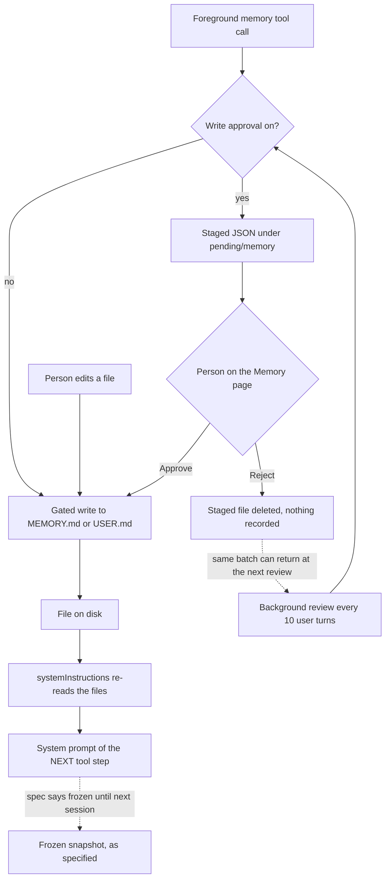

## 1. Executive Summary

Khabeer is an Android application built on the Termux terminal emulator — it keeps Termux's package name, shared user id and GPL-3.0-only licence — with a native agent runtime written in Java inside the app. Its memory is a deliberate port of [Hermes Agent](../hermes-agent/)'s built-in memory, and `docs/MEMORY_SOURCE_OF_TRUTH.md` says so in its first lines: it *"mirrors the Hermes Agent memory system, with exactly two exclusions"*, names the Hermes files it was mapped from, and declares that *"where this doc and code disagree, this doc wins — update the code."*

That makes the report a comparison as much as a reading. What survived the port intact is substantial: two character-capped Markdown files (`MEMORY.md` at 2,200 characters, `USER.md` at 1,375) plus a user-owned `SOUL.md`; a `memory` tool that addresses entries by substring; all-or-nothing operation batches checked against the budget on the final state; a threat-pattern scan with NFKC normalisation on every write; a drift guard that refuses to write a file it no longer round-trips and snapshots it to `.bak.<timestamp>` first; and Hermes's staged write-approval queue, here surfaced as Approve and Reject buttons on the app's Memory page. That queue is the one capability mark this report awards.

What did not survive is the property the Hermes report is titled after. Hermes freezes the memory block into the system prompt at session start so a mid-session write cannot invalidate the provider's prompt cache. Khabeer's spec states the same rule — *"mid-turn `memory` writes persist to disk immediately but NEVER mutate the live prompt snapshot"* — and its code rebuilds the system prompt from the files on disk inside the tool loop. `callAnthropicApi` puts `systemInstructions()` into every request body (`AiRuntimeService.java:2270`), and that call site runs once per step of the loop at `:2191`. A `memory add` at one step is in the system prompt of the next.

Two smaller gaps sit beside it. The load-time fence that replaces a poisoned on-disk entry with a `[BLOCKED: …]` placeholder in the prompt was ported (`AiMemoryStore.java:587-593`), but the Hermes test that asserts it — and that earns Hermes its `negative_eval` mark — was not, and no test in the tree exercises it. And rejecting a staged write deletes the staged file and records nothing, so the background review that proposed it can propose it again every ten turns.

## 2. Mental Model

A fact becomes a belief in Khabeer by being written into one of two small files, and it stops being one when a later write removes the entry that contains it. There is no intermediate state and no record of the transition. Everything else in the design is a gate in front of that write.

Four actors can write. The agent calls the `memory` tool in the foreground. A background review call, fired every tenth user message, returns an operation batch. A person edits a file from the Memory page. And, when the approval toggle is on, a person approving a staged write replays the original arguments through the tool. All four pass the same gates: strict UTF-8 read, threat scan, file lock, drift guard, dedupe, budget check, atomic temp-file-and-rename.

With approval on, the first two actors do not write at all — they stage. A staged write is a JSON file under `pending/memory/`, and it waits there, across restarts, until a person decides. That is a real epistemic step: a proposed memory that is not yet a memory. It is not a state on the memory itself, though. It lives beside the store, it has two exits — applied or deleted — and neither leaves a trace.

Recall has two routes that never meet. The two memory files are always in the system prompt, whole. Everything else — past sessions, compacted history, tool output — is reached only when the model calls `session_search`, which runs against the transcript tables in SQLite.




## 3. Architecture

Everything runs inside one Android application process. There is no server to operate. Memory is three plain-text files in the app's private storage under `$HOME/.khabeer/`, and transcripts live in an app-private SQLite database managed by `AiDatabase`. The agent loop, the provider clients and the tool dispatch are in `AiRuntimeService`, a 4,746-line Android service; the Memory page, the approval list and the editors are in `AiActivity`, at 6,761 lines the largest file in `com/termux/app`.

The Termux half of the tree — `terminal-emulator`, `terminal-view`, `termux-shared` — provides the Linux environment the agent's terminal tool runs commands in. It is not part of the memory system, and this report does not read it.

The cost of standing it up is a signed APK and a provider key. The operational constraint the README spends most words on is the package identity: the app retains `com.termux`, so it cannot be installed beside another Termux build, and builds signed with different keys cannot update each other.

## 4. Essential Implementation Paths

### The memory tool

`AiMemoryStore.tool` (`AiMemoryStore.java:239-258`) dispatches `add`, `replace` and `remove` at `:251-253`, and an `operations[]` array to `applyBatch` at `:348`. Replace and remove match by substring against entries rather than by id (`:449`): zero matches return the current inventory, more than one distinct match returns previews and asks for a more specific string. A batch runs under one file lock, pre-scans every operation's content, checks the budget only against the final state, and aborts whole on the first failure. `MAX_CONSOLIDATION_FAILURES_PER_TURN = 3` (`:31`) turns a fourth overflow or zero-match in one turn into a terminal "stop retrying" response, which is the anti-thrash rule from Hermes ported as a constant.

### Gates on every write

`withFileLock` (`:497`) takes an OS lock on a sibling `.lock` file; `driftErrorIfNeeded` (`:516-532`) refuses a write to a file that no longer parses as clean `§`-delimited entries and writes `<file>.bak.<unix_ts>` before refusing; `dedupe` (`:564`) collapses repeated entries order-preserving; `writeTextAtomic` (`:712`) writes a temporary file and renames it. An unreadable file is never treated as empty, and `unreadableUtf8DoesNotBecomeEmptyStoreOnWrite` and `saveRawRefusesToClearUnreadableFile` pin that.

### Threat scanning

`threatMessage` (`:595`) normalises to NFKC (`:604`), bounds the scan at 64 KiB (`MAX_SCAN_CHARS`, `:41`), and matches prompt-injection, exfiltration and persistence patterns ported from Hermes's `threat_patterns.py`. It runs on add and replace inside batches (`:362`) and on every single-action write. `sanitizeForPrompt` (`:587-593`) runs it again when the prompt is assembled and substitutes *"[BLOCKED: … entry contained a prompt-injection pattern. The raw file is preserved; edit Memory to remove it.]"* for a matching entry.

### Staging and approval

`stageWrite` (`:291-307`) serialises the tool arguments with an `origin` of `foreground` or `background_review` into `pending/memory/<id>.json`. Its two producers are `runMemoryTool` (`AiRuntimeService.java:3638-3641`), when `isMemoryWriteApprovalEnabled()` is true, and `applyReviewOps` (`:4184-4189`), which receives the same flag. The Memory page lists pending items and wires Approve to `approvePending(id)` and Reject to `rejectPending(id)` (`AiActivity.java:2020-2040`). The toggle is a switch on the same page (`AiActivity.java:1732-1733`) backed by a preference that defaults to `false` (`AiProviderConfig.java:113-118`).

### System prompt assembly

`systemPromptSnapshot` (`AiMemoryStore.java:201-217`) reads `SOUL.md`, then renders each enabled file as a block headed with its usage — `MEMORY (your personal notes) [62% — 1,364/2,200 chars]`. Despite the name it holds no state: every call reads the files from disk. `systemInstructions` (`AiRuntimeService.java:4015`) wraps it with the runtime's rules, and it is called from each provider's request builder — `callAnthropicApi` at `:2270`, `callResponsesApi` at `:2869`, `callCodexApi` at `:1846` — and from `refreshSystemMessage` (`:4048`), whose comment says it *"rebuilds the system message at the start of every turn."* The Anthropic builder is called inside the step loop at `:2191`.

### Session history

`AiDatabase` probes whether the device's SQLite can actually use FTS5 by creating, inserting into, matching and dropping a probe table (`fts5Available`, `:279`), because — as the spec records from a MIUI device — some builds parse `CREATE VIRTUAL TABLE` and fail on first use. With FTS5 it maintains `messages_fts` by trigger (`:304-316`) and a trigram table where the tokenizer exists (`:352`); without it, `session_search` falls back to `LIKE` (`:1532`). `sessionSearch` (`:1302`) implements the four modes — discovery, read, scroll, browse. Compaction (`compactSession`, `:930`) archives rows by setting `active=0, compacted=1` and inserts one summary row; it does not delete, and recall reaches the archived rows.

### Background review

Every time the user-message count is a multiple of the configured interval (`AiRuntimeService.java:4101-4103`, default 10 at `AiProviderConfig.java:130`), a quiet call returns `operations[]` and `skill_operations[]`. Memory operations are split by target and handed to `applyReviewOps`, which either stages them or applies them through the ordinary tool, and appends a `memory/reviewResult` event to the run.

## 5. Memory Data Model

The unit is a plain-text entry. Entries are joined by `ENTRY_DELIMITER = "\n§\n"` (`AiMemoryStore.java:32`) and split only on the full delimiter, so a bare `§` inside an entry survives. There are no ids, no timestamps, no provenance, no confidence and no status on an entry; its identity is its text, and it is addressed by a substring of it.

| File | Cap | Writers |
| --- | ---: | --- |
| `MEMORY.md` | 2,200 chars | the `memory` tool, the review batch, a person |
| `USER.md` | 1,375 chars | the `memory` tool, the review batch, a person |
| `SOUL.md` | 4,000 chars | a person only; never a tool target |
| `pending/memory/<id>.json` | none | `stageWrite` |

Caps are characters rather than tokens so they do not depend on the model. A write over the cap is refused with the current usage and the entry inventory so the model can consolidate in the same turn; nothing is silently truncated or evicted.

The transcript is the other store: `messages` rows carry `session_id`, `role`, `content`, timestamps and the `active`, `compacted`, `_compressed_summary` and `rewound` flags that compaction, retry and undo set. Those flags hide rows from replay without deleting them, and `getHistoricalTranscript` (`AiDatabase.java:1285`) reads them back.

## 6. Retrieval Mechanics

There is no retrieval for curated memory. Both files, whole, are in every system prompt, in a fixed order: `SOUL.md`, then the memory blocks, then memory guidance, then session-search guidance, then skills. The only selection is the character cap, applied at write time.

Everything outside the two files is reached by the model's own `session_search` call. Discovery mode ranks newest first, demotes tool-role rows below user and assistant hits (`AiDatabase.java:1417-1454`), returns one hit per lineage root, hydrates the top hit with a surrounding window and returns the rest as anchored snippets. The search includes archived compacted rows by design, so detail a compaction removed from the replay is recoverable, and `compactionTrimsActiveReplayButSessionSearchRecoversHistory` asserts exactly that. It excludes rewound rows (`COALESCE(rewound, 0)=0` at `:1515` and `:1532`).

There is no vector arm, no fusion between the two routes, and no path by which a session-search hit becomes a memory entry other than the model deciding to write one.

## 7. Write Mechanics

A foreground write blocks the turn for the duration of a file lock and an atomic rename on local storage, which is effectively immediate. It is on disk before the tool returns, and — because the prompt is rebuilt from disk on each step — in the model's system prompt at the next step of the same turn on the Anthropic path, and at the next turn on every path that goes through `refreshSystemMessage`. The spec intends the lag to be "until the next session"; the code makes it one step.

With approval on, the lag is however long the staged file waits for a person.

No background pass rewrites the store wholesale. The review call proposes operations, which pass the same substring, budget and scan checks as any other write; it cannot replace a file.

## 8. Agent Integration

Memory is exposed to the model as two tools — `memory` and `session_search` — across every provider dialect the runtime speaks: OpenAI Responses, Chat Completions and Anthropic Messages. When both files are disabled the `memory` tool is hidden; when one is, its target enum narrows. Delegated child agents see the memory block but cannot write to it: `SUBAGENT_BLOCKED_TOOLS` (`AiRuntimeService.java:2969`) holds `memory`, `delegate_task` and `skill_manage`, and `AiSubagentTest` asserts the set.

Hermes's external memory providers — mem0, Honcho, Supermemory and the rest — were excluded from the port on purpose, along with per-user scoping. There is exactly one store per installation.

## 9. Reliability, Safety, and Trust

**The approval queue is a real review surface, off by default, with two sharp edges.** When a person turns on *Require approval before memory writes*, nothing the agent or the review pass proposes reaches the files until someone presses Approve. That is the strongest trust control in the design and it has producers on both automated write paths. The two edges: approval calls `approvePending(id)`, which forwards `true, true` for the store toggles (`AiMemoryStore.java:320-321`), so a staged write to a file the user has since disabled is applied anyway; and the person approving sees `id` and a 140-character single-line rendering of the arguments JSON (`AiActivity.java:2011`), which for an operations batch can hide most of what they are approving.

**The frozen snapshot is specified and not implemented.** The spec's reason for freezing is cache efficiency, and the consequence of not freezing is mostly cost. There is a second consequence. A frozen prompt is also a window in which a write the model just made cannot steer the rest of the same turn; rebuilding each step removes that window, so an entry written at step *k* is instruction-adjacent system-prompt text at step *k + 1*. The threat scan and the `[BLOCKED]` substitution still apply at assembly, so a pattern-matched injection is fenced; one the patterns miss is live immediately.

**Rejection is deletion.** `rejectPending` (`:339-346`) deletes the staged file and returns a success message. There is no record of the rejected value, so the review call — which sees the same transcript and has no knowledge of the rejection — can stage the same operation again at the next interval. The Hermes report records the same absence for Hermes; the port had the staging record in hand and did not keep it.

**Removal leaves nothing.** A `remove` rewrites the file without the entry. There is no tombstone, no history table and no event for manual edits, approvals or rejections. The background review does append `memory/reviewResult` to the run's event log (`AiRuntimeService.java:4163`, `:4190`), and a foreground tool call survives as a tool row in the transcript, but a person's edit, approval or rejection leaves no trace outside a `.bak` file written only on drift. That is why `audit_log` is withheld.

**No scoping, by decision.** The spec's exclusion list removes per-user scoping explicitly. One installation is one memory, which is honest for a phone and worth stating because the app runs arbitrary shell commands and MCP servers alongside it.

## 10. Tests, Evals, and Benchmarks

The unit suite under `app/src/test/java/com/termux/app/` runs in CI (`.github/workflows/run_tests.yml`). I did not build the app or run the suite; everything below is read from the committed test files.

The memory-relevant tests are in two files. `AiMemoryStoreTest` (192 lines) asserts: seeding and prompt injection of both blocks; refusal of a Hermes strict threat pattern at write; an atomic remove-then-add batch that is over budget mid-way and under budget at the end; that unreadable UTF-8 is not treated as an empty store, on both the tool path and a raw save; refusal of an over-limit save with usage and inventory returned; dedupe on save; refusal of a drifted file with a `.bak` written; and staging, approving and rejecting a write. `AiDatabaseMemoryTest` (209 lines) asserts that compaction trims the replay while `session_search` still recovers the archived detail, that tool rows rank below user hits, that sub-agent runs are listed separately, that export carries the transcript markers, and the rewind and retry semantics.

**`negative_eval` is withheld, and the reason is a one-line repair.** The candidate is `rewindHidesTurnsButKeepsAuditAndClamps` (`AiDatabaseMemoryTest.java:124-156`): after undoing one turn it searches for `"second question"` and asserts `0` results. The fixture guarantees material is present — `"first question"` is in the same session — but the test never asserts that a search finds it, so a search returning nothing for every query passes the case. Adding a positive query for `"first question"` beside the negative one would make it a populated-result exclusion. The other absence assertion, in the compaction test, is about the replay window rather than a memory result, and is on the context side of the line.

**The load-time fence is untested.** `sanitizeForPrompt` substitutes `[BLOCKED: …]` for a poisoned entry at assembly, and no test writes a threat pattern to disk and asserts the placeholder in `systemPromptSnapshot` — a search of the test tree for `BLOCKED` or `sanitizeForPrompt` finds only the sub-agent tool list. That is the case that earns [Hermes](../hermes-agent/) its `negative_eval` mark, and it did not come across with the mechanism.

There is no benchmark, no retrieval eval and no paper. The README and the Markdown under `docs/` carry no arXiv, DOI or citation block.

## 11. For Your Own Build

### Steal

- **The approval queue as a page, not a prompt.** Hermes asks inline when a terminal is attached. Khabeer puts every pending write on a list that survives restart, with its origin recorded, which is the right shape for a device where the person is not watching every turn.
- **The FTS5 capability probe.** Create, insert, match and drop before trusting a virtual table, and drop orphan triggers when the table is absent. The spec records the device that taught it: some SQLite builds accept the `CREATE` and fail on first use, and an orphaned insert trigger then aborts every message write.
- **Compaction that archives rather than deletes, with recall reaching the archive.** Replay gets smaller; nothing is lost; the test pins both halves.
- **Refusing an unreadable file instead of treating it as empty**, on every write path, with a test for each.

### Avoid

- **Specifying a frozen snapshot and calling the builder per request.** If the prompt is meant to be stable for a session, hold the rendered block on the session object; a function called `systemPromptSnapshot` that reads from disk will be called from wherever a prompt is needed.
- **Deleting a rejected proposal.** Keep the rejected staged record — its arguments are already a value you can match — and have the review pass consult it before staging.
- **Approving what the approver cannot see.** A 140-character preview of a JSON batch is a signature on a document with most of it folded.

### Fit

This is a reasonable foundation for a single person who wants a mobile agent whose memory they can read, edit and gate, and who is willing to turn the approval switch on. It is a poor foundation for anyone whose reason for the Hermes design was cost: on a pay-per-token provider the memory block is re-sent and, on a cache-keyed provider, re-cached at every write. And it is not a candidate for anything multi-user, which the spec rules out in its first section.

## 12. Open Questions

- Whether the providers the runtime targets cache the system prompt separately from the messages, which decides how much the per-step rebuild costs in practice. I did not measure it.
- Whether the OpenAI Responses and Codex paths are called once per tool step as the Anthropic path is; their builders call `systemInstructions()` the same way, and I traced the loop only for Anthropic.
- Whether a second review pass after a rejection does in fact stage the same operation. The code gives it nothing that would prevent it; whether the model tends to repeat itself is an empirical question.

## Appendix: File Index

- Memory store, gates, threat scan, prompt assembly, staging: `app/src/main/java/com/termux/app/AiMemoryStore.java`.
- Transcripts, FTS5 probe and indexes, session search, compaction, rewind: `app/src/main/java/com/termux/app/AiDatabase.java`.
- Agent loop, provider request builders, memory tool dispatch, background review: `app/src/main/java/com/termux/app/AiRuntimeService.java`.
- Memory page, approval list, editors, toggles: `app/src/main/java/com/termux/app/AiActivity.java`.
- Settings and defaults: `app/src/main/java/com/termux/app/AiProviderConfig.java`.
- Specification: `docs/MEMORY_SOURCE_OF_TRUTH.md`.
- Tests: `app/src/test/java/com/termux/app/AiMemoryStoreTest.java`, `AiDatabaseMemoryTest.java`, `AiSubagentTest.java`.

**Searches recorded for the negative claims**

```sh
rg -n "systemPromptSnapshot\(|systemInstructions\(\)" app/src/main/java   # every caller rebuilds; no cached copy on the session
rg -n "BLOCKED|sanitizeForPrompt" app/src/test                           # only SUBAGENT_BLOCKED_TOOLS: the fence is untested
rg -n "appendEvent|logEvent|audit" app/src/main/java/com/termux/app/AiMemoryStore.java   # 0: the store records no mutation
rg -n "rejected|tombstone|reject" app/src/main/java/com/termux/app/AiMemoryStore.java     # rejectPending, which deletes, and one comment
rg -n -i "arxiv|doi\.org|bibtex|citation" README.md docs/*.md          # 0: no paper (docs/*.csv only lists bundled skill files)
```

## History

**2026-09-11** — [`cd7526219892d097646434e6802f105cc796d87b`](https://github.com/bakka22/khabeer/commit/cd7526219892d097646434e6802f105cc796d87b) — first reading. Screened with `scripts/screen_repo.py`: no auto-running configuration; three build-time execution points, all inside the bundled skill library under `app/src/main/assets/skills/` (a `conftest.py`, a `setup.py` and a LaTeX `Makefile`). Nothing was built, installed or run.
