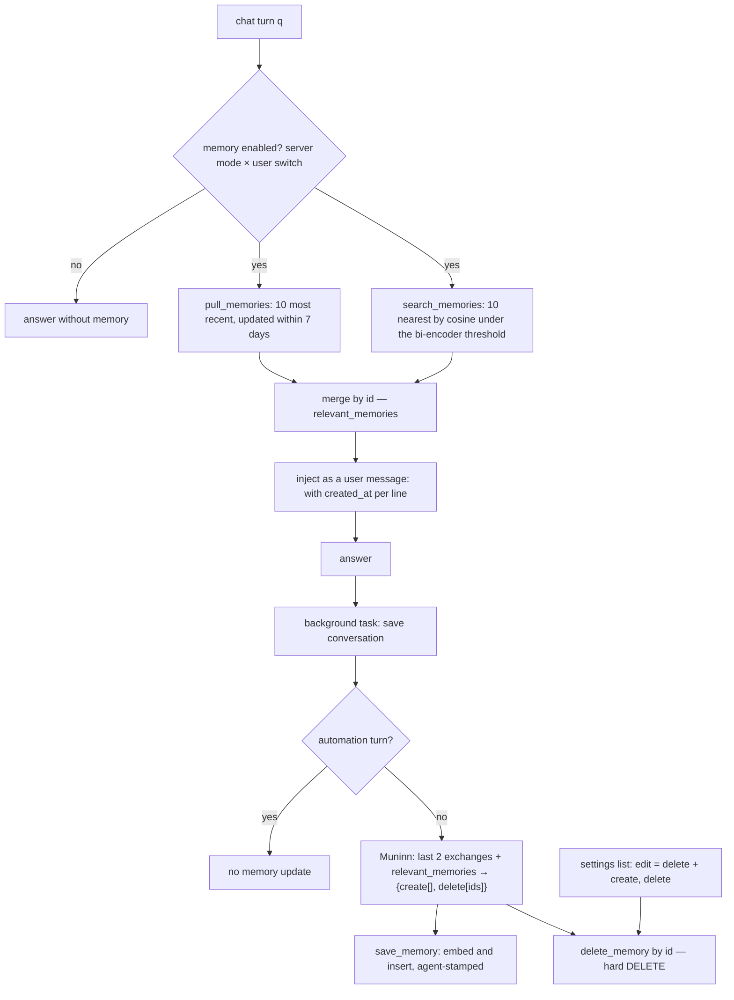

## 1. Executive Summary

Khoj is a self-hostable personal AI — a Django and FastAPI server over
Postgres that indexes a person's documents, chats with local or hosted
models, runs custom agents and scheduled automations, and answers from the
web — and since 3 January 2026 it has a long-term memory: a `UserMemory`
table of facts about the user, written by a prompt that introduces itself as
*"Muninn, the user's memory manager."* AGPL-3.0; 5,180 commits between 4
April 2021 and 1 August 2026 by two principal authors; 34,666 lines of Python
under `src/khoj/`, a Next.js web client, Obsidian, Emacs, desktop and WhatsApp
interfaces, and 223 test functions in 23 files, of which the memory feature
has one file of 23. The screen found a devcontainer and a VS Code settings
file that execute on open, two build-time hooks and five unpinned dependency
surfaces; nothing was inside the seven-day cooldown, and nothing was
installed or run.

The mechanism is small and the report is about its edges. A fact is one
first-person sentence with a pgvector embedding, a user and an optional
agent. After every chat turn that is not an automation, a background task
hands the last two exchanges and the facts that were retrieved for that turn
to the extractor, which answers with a `create` list of new sentences and a
`delete` list of ids; creates are embedded and inserted, deletes are hard
deletes (`routers/helpers.py:994-1082`). On the next turn recall merges the
ten most recent facts of the last seven days with the ten nearest by cosine
to the query (`database/adapters/__init__.py:2292-2353`) and injects them as
a dated list under `<retrieved_memories>` with the instruction *"Ignore them
if they are not relevant"* (`processor/conversation/utils.py:824-830`). The
feature is gated twice — a server mode of disabled, enabled-default-off or
enabled-default-on, and a per-user switch — and every combination has a test.

What is strong is the scoping and its evidence: user and agent are `WHERE`
clauses on both recall arms, a custom agent sees only facts saved under it,
and the isolation tests seed the facts that must stay out and assert on
their text. What is weak follows from one design choice: the extractor's
*"existing facts"* are the retrieved set, not the store, so a fact the query
did not surface cannot be retired and two facts that contradict each other
can coexist until a query happens to pull both; there is no confidence, no
state, no provenance to a conversation, no dedupe and no consolidation; the
API's update is a delete and an insert under a new id; and a delete id that
is not numeric would raise past the one exception the adapter catches, in a
background task nobody awaits.

## 2. Mental Model

A memory is a **fact about the user, in the user's voice**, and nothing
else: the prompt's rules are that each fact is atomic, self-contained and
first-person, that it may concern who the user is, their interests,
circumstances, events and motivations, or anything they asked to have
remembered, and that facts *"no longer true"* must be deleted. There is no
other kind: no summary, no preference type, no episode. Everything else Khoj
persists — the `Entry` rows of indexed documents, the JSON message log of a
`Conversation`, an `Agent`'s persona and knowledge base — is a different
table and a different question.

A fact has one state, present, and two ways to leave it. The model deletes
it by id in the same call that creates its replacement — the prompt's own
example deletes *"I am not interested in sports"* and *"My mother works at the
hospital"* while creating *"My mother works at the hospital and is a
doctor"* — or a person deletes or rewrites it in settings, where a rewrite is
also a delete and a create. Nothing supersedes, expires, decays or archives;
`updated_at` exists and is never distinguished from `created_at` in practice,
because no path updates a row in place.

What the extractor believes about the store is what recall showed it. The
call passes `memories=relevant_memories`, the merged recent-plus-nearest set
for the current turn, as the *existing facts* the prompt may delete
(`routers/helpers.py:1060-1082`). That is the epistemics in one line: a fact
is correctable only while it is retrievable by the conversation that would
correct it, and the seven-day recency arm is what keeps a fresh fact in view
long enough to be contradicted.

Memory is background-managed and user-visible, treated as ground truth when
injected and hedged by an instruction. The model has no tool to search or
write it; the person has a list.

## 3. Architecture

One Python process serves FastAPI routes over a Django ORM against Postgres
with pgvector; the same database holds users, agents, conversations, the
document index and the memories. `UserMemory` (`database/models/__init__.py:855-865`)
and its migration `0099_usermemory.py` (generated 29 August 2025, merged 3
January 2026 in *"Give Khoj Long Term Memories (#1168)"*) add one table;
`UserMemoryAdapters` (`database/adapters/__init__.py:2292-2380`) is the whole
data-access layer — pull, save, search, delete, to_dict. Embeddings come from
the server's configured search model through `state.embeddings_model`, the
same bi-encoder that embeds documents, so a memory's vector and a note's
vector are comparable and a memory records which `search_model` produced it.

The chat path in `routers/api_chat.py` computes `relevant_memories` once per
turn and threads it into every downstream generator in `routers/helpers.py`
— the default answer, research, image and diagram prompts all accept the
list — and `processor/conversation/utils.py` renders it into the message
list. `save_to_conversation_log` in the same module is where the write
happens, called through `asyncio.create_task` after streaming ends. The
web client's settings page (`src/interface/web/app/settings/page.tsx`)
fetches `/api/memories`, renders each row through `userMemory.tsx` with an
input, an update and a delete, and exposes the toggle at
`/api/user/memory`. A Django management command, `manage_memories.py`,
runs the same extractor over recent conversations for named users with a
batch size, a dry run, a checkpoint in `DataStore` and a `--delete` mode.

### Deployment and ergonomics

Postgres with the pgvector extension is required; the compose file runs
`pgvector/pgvector:pg15` beside the server. A chat model is required to
extract anything — the extractor calls the conversation's agent model at
`fast_model=False` — but storing, recalling and injecting need only the
embedding model, which can be local. It runs fully offline with a local
LLM and the bundled sentence-transformer. The table is plain SQL and
repairable by hand; the settings list is the intended repair surface, and
the management command's `--delete --users` is the bulk one.

## 4. Essential Implementation Paths

**Recall and injection.** `api_chat.py:977-983`: if
`ConversationAdapters.ais_memory_enabled(user)`, `pull_memories(user, agent)`
and `search_memories(query=q, user, agent)` are merged into a dict keyed by
id. `ais_memory_enabled` (`adapters/__init__.py:1623-1660`) reads
`ServerChatSettings.memory_mode` and `UserConversationConfig.enable_memory`:
disabled wins, default-off requires an explicit opt-in row, default-on and
no server row default to on. `generate_chatml_messages_with_context`
(`processor/conversation/utils.py:683-835`) appends a user-role message
listing each fact as `- [YYYY-MM-DD HH:MM:SS]: raw`.

**Write.** `save_to_conversation_log` (`utils.py:545-625`) saves the turn,
then — unless `automation_id` is set — calls `ai_update_memories(user,
new_messages, relevant_memories, agent)` (`helpers.py:1044-1082`), which
re-checks the enablement, calls `extract_facts_from_query` with
`construct_chat_history(n=2)` and `to_dict(existing_facts)`, and applies the
result: `save_memory` embeds with the default search model and stamps the
agent when it is not the default; `delete_memory(user, memory_id)` does
`UserMemory.objects.aget(user=user, id=memory_id)` then `adelete()`,
catching only `DoesNotExist`. The prompt (`prompts.py:1308-1375`) is the
whole contract, with one worked example.

**Backfill.** `manage_memories.py`: for each user, conversations updated
within `--lookback-days` (default seven) in batches of ten, each batch run
through `extract_facts_from_query` and saved with `--apply`; a checkpoint
records processed users and conversations so `--resume` skips them.

**API and UI.** `api_memories.py`: `GET` lists `id`, `raw`, `created_at`;
`PUT /{id}` deletes and recreates; `DELETE /{id}` deletes; each verifies the
row belongs to the caller. `api.py:218-232` sets the user switch.

**Tests.** `tests/test_memory_settings.py` — sixteen cases over the mode ×
preference matrix and the config endpoint, seven over pull scoping and
isolation; `tests/helpers.py` provides `acreate_test_memory`.

## 5. Memory Data Model

`UserMemory`: `id`, `created_at`, `updated_at` (from `DbBaseModel`), `user`
FK with cascade, `agent` FK nullable with cascade, `embeddings`
`VectorField(dimensions=None)`, `raw` text, `search_model` FK set-null. No
index is declared on the vector column in the migration; `CosineDistance`
ordering is a full scan under the ORM. Scope is the user, and the agent as
a second axis with an asymmetry: a fact saved under a custom agent is
visible to that agent and to the default agent, never to another custom
agent; a fact saved under the default agent carries `agent = NULL` and is
visible to the default agent only. Provenance is the user, the agent and
the embedding model — not the conversation or the turn. Time is
`created_at`, shown to the model, and `updated_at`, used as the recency
window's field but equal to `created_at` on every row because nothing
updates one. There is no validity, version, correction chain, TTL or
pinning.

The two neighbours in the schema are worth naming so the boundary is
clear. `Entry` (`models/__init__.py:768-800`) is the document index — raw
and compiled text, an embedding, a file source, a hash — and is what
*"chat with your notes"* retrieves; `Conversation` holds the message log
as JSON with per-message context, online results and a train of thought.
Neither is a memory the model can correct, and neither reaches the
extractor except as the last two exchanges of the current conversation.

## 6. Retrieval Mechanics

Two arms, no fusion. The recency arm sorts by `created_at` descending over
rows whose `updated_at` is within seven days and takes ten. The semantic
arm embeds the query with the default search model, annotates
`CosineDistance("embeddings", embedded_query)`, orders ascending, filters
`distance <= bi_encoder_confidence_threshold` when the model configures
one, and takes ten. The union is deduplicated by id and injected in that
order — recent first, then nearest — with no budget beyond twenty rows and
no ranking across the two. There is no lexical arm, no reranker, no query
rewriting and no tool: the model cannot ask for more, and the same twenty
rows serve every generator in the turn.

The failure modes are the ones the design invites. Over-recall is bounded
at twenty short lines, so it costs little. Under-recall is structural for
anything older than a week that does not embed near the current query,
and it has a second consequence in section 7. Stale hits are the default
state of a fact that was never contradicted in a retrieving conversation,
softened only by the date on the line and the instruction to ignore.

## 7. Write Mechanics

Extraction is model-driven, deferred and unbudgeted per turn: one call per
non-automation turn, whatever the turn said, with the conversation's own
chat model. The prompt asks for new facts *"related to the user"* and for
deletion of facts *"no longer relevant or true"*, forbids in-place edits,
and returns strict JSON that `clean_json` and a Pydantic model validate; a
reply that does not parse becomes `MemoryUpdates(create=[], delete=[])` and
an error log. Deduplication is left to the model — it is told it *"can
enhance new facts with information from existing facts"* — and nothing
checks a created fact against the store, so a fact restated across two
conversations a month apart is two rows. Conflict handling is the delete
list, which can only name what was retrieved. Agent-generated facts do not
arise as a class: the assistant's replies are in the two-exchange window,
so a fact the assistant asserted can be captured as the user's.

Noisy or adversarial input is not filtered: whatever the user pasted is in
the window the extractor reads, and a document quoted in a turn can become
a first-person fact. Automations are excluded because *"this could get
noisy."*

### Operational cost

Nothing blocks the response: the write runs in a task created after
streaming ends, so the lag before a fact is retrievable is one extraction
call plus one embedding, seconds. The read path adds two queries and one
query embedding per turn and at most twenty lines to the prompt, placed
after the system prompt and before the user message, so it changes the
prefix on every turn whose retrieved set changes. No process re-reads the
store; the management command is the only bulk pass and is operator-run.

## 8. Agent Integration

The model has no memory affordance. Facts arrive as a user-role message it
is asked to weigh, and its only influence on the store is the extractor's
reading of what it and the user said. The person has the settings list,
the toggle, and the same API from any client. Custom agents get their own
facts automatically by running conversations under them, which is the
one place the design gives an operator a handle on scope: a "Chef" agent
never learns what the "Accountant" was told. Automations — scheduled
queries that email their result — read memory and never write it. There
is no session boundary to manage; a conversation is a row, and a new one
starts from the same store.

## 9. Reliability, Safety, and Trust

**Provenance.** A fact knows its user, its agent and its embedding model.
It does not know its conversation, its turn or whether the user or the
assistant said the thing; the management command's backfill produces rows
indistinguishable from live ones.

**Verification and uncertainty.** None. A fact is true because Muninn
wrote it. The hedge is in the prompt at read time.

**Correction reaches only what recall returned.** `ai_update_memories`
passes `relevant_memories` as the existing facts, so the extractor can
delete a stale fact only if the current turn retrieved it. The recency
arm covers a fact for seven days after creation; after that, only a query
that embeds near it brings it back into reach. Two facts that contradict
each other survive until one conversation pulls both.

**Deletion is by model-supplied id.** `delete_memory` receives the strings
in the `delete` list and passes each to `aget(id=…)`; a non-numeric string
raises a `ValueError` the adapter does not catch, in a task nobody awaits,
so the remaining creates and deletes of that update are lost and the
failure is a logged task exception. The prompt's example shows ids, and
nothing else guarantees the model follows it.

**Update is destructive.** `PUT /api/memories/{id}` deletes and recreates,
so an edit changes the id and the `created_at` the model is shown.

**Isolation** is enforced in the adapters and tested; the default agent's
view over every custom agent's facts is by design and documented in the
test name, and a user who keeps a confidential agent should know it.

**Enablement** is tested in all twelve mode-and-preference combinations,
and `ai_update_memories` re-checks it so a turn that started with memory
on cannot write after it was switched off.

**Privacy.** The docs' privacy page describes where embeddings and raw text
live on the hosted service; memories are rows in the same database and the
same shard. The AGPL-3.0 licence applies.

## 10. Tests, Evals, and Benchmarks

Twenty-three tests in `tests/test_memory_settings.py`, run by the
`test.yml` workflow the README badges. Sixteen cover the enablement
matrix and the config endpoint; seven cover scoping: the default agent sees
all, a custom agent sees only its own, an unspecified agent equals the
default, save stamps a custom agent and not the default, users are
isolated, and two custom agents cannot see each other. The negative cases
seed the material that must stay out and assert on its text, with the
default-agent case as the positive control in the same file, which is the
shape the `negative_eval` mark asks for.

Nothing tests the extractor, the prompt, the parse fallback, the delete
path, the recency window, the semantic threshold or the injection format;
`rg -n 'extract_facts_from_query|ai_update_memories|search_memories' tests`
finds only the helper file. There is no retrieval-quality evaluation of
memory, no benchmark and no paper — `rg -n -i 'arxiv|bibtex|citation'
README.md documentation/docs` finds no citation of the memory feature — and
the feature has no page under `documentation/docs/features/`. The tests
one would want first are a case that a fact absent from `relevant_memories`
cannot be deleted, which would document the design's central limit rather
than leave it to a reader, and a case for a non-numeric delete id.

## 11. For Your Own Build

### Steal

- **Scope on both arms and test it with the excluded material present.**
  The isolation tests here seed four facts and assert three are absent by
  text; that is cheap and it is the test most systems in this atlas lack.
- **Gate the feature twice, and re-check at write time.** A server mode with
  a default and a per-user switch, checked again inside the writer so a
  mid-conversation opt-out holds.
- **Keep the extractor's output structured and fail it empty.** A strict
  JSON schema with an empty-lists fallback keeps a bad reply from becoming
  a bad fact, at the cost of losing the good ones in the same reply.
- **Run the writer after the response, not before.** A task created after
  streaming ends costs the user nothing and the fact is live by the next
  turn.

### Avoid

- **Showing the extractor only what recall retrieved.** If deletion is by
  id and the ids come from the retrieved set, the store's contradictions are
  exactly the facts recall did not return. Pass a broader candidate set to
  the corrector than to the prompt, or dedupe on write.
- **Update as delete-plus-insert.** It discards the id, the date and any
  history a later feature would want.
- **Hard deletes driven by model output without a type check.** Validate
  the id before the query, or the whole update dies on one bad string.
- **A recency window as the only path to a fact's correction.** Seven days
  is a guess about how long a fact stays contradictable.

### Fit

This is a memory for a personal assistant with one user per account and a
few agents, where the facts are few, the model is trusted to write them,
and the person is willing to read a list in settings now and then. It is
one table and three functions, which is its virtue: an adopter can read
the whole mechanism in an afternoon and knows exactly what it does not do.
It does not suit anything that needs facts to carry a source, a state or a
validity, anything with many users' facts in one store where a full-scan
cosine query matters, or any deployment where an uncorrected stale fact has
a cost, because correction here depends on the stale fact being retrieved
first. Take the scoping tests and the double gate; build the rest.

## 12. Open Questions

- Whether a production run ever sends a non-numeric delete id, and what
  the task-exception log shows when it does.
- What the hosted service sets `memory_mode` to, and how many users have
  opted out; the default in code is enabled-default-on.
- Whether the `agent` FK cascade means deleting a custom agent silently
  deletes the facts it accumulated, which the model and the tests suggest
  and no test asserts.
- Whether an index on `embeddings` exists on the hosted database; the
  migration declares none.
- Why the migration is dated 29 August 2025 and the feature merged on 3
  January 2026, and what changed in the design in between.

## Appendix: File Index

- Schema and adapters: `src/khoj/database/models/__init__.py:481-520`
  (`MemoryMode`), `:645` (`enable_memory`), `:855-865` (`UserMemory`),
  `src/khoj/database/migrations/0099_usermemory.py`,
  `src/khoj/database/adapters/__init__.py:1623-1660` (`ais_memory_enabled`),
  `:2292-2380` (`UserMemoryAdapters`).
- Write path: `src/khoj/routers/helpers.py:987-1082` (`MemoryUpdates`,
  `extract_facts_from_query`, `ai_update_memories`),
  `src/khoj/processor/conversation/prompts.py:1308-1375` (the Muninn
  prompt), `src/khoj/processor/conversation/utils.py:545-625`
  (`save_to_conversation_log`), `src/khoj/database/management/commands/manage_memories.py`.
- Retrieval and injection: `src/khoj/routers/api_chat.py:977-983`,
  `src/khoj/processor/conversation/utils.py:824-830`, `:323-340`
  (`construct_chat_history`).
- API and UI: `src/khoj/routers/api_memories.py`, `src/khoj/routers/api.py:218-232`,
  `src/interface/web/app/settings/page.tsx:344-372,655-720`,
  `src/interface/web/app/components/userMemory/userMemory.tsx`.
- Tests: `tests/test_memory_settings.py`, `tests/helpers.py`.
- Searches behind the absence claims: `rg -n 'UserMemory' src/khoj --glob '!*/migrations/*'`
  (models, adapters, `api_memories.py`, `api_chat.py`, `helpers.py`,
  `utils.py`, `manage_memories.py`, `tests/`);
  `rg -n 'objects\.filter\(.*UserMemory|UserMemory\.objects' src/khoj`
  (every read carries `user=`); `rg -n 'update\(|\.save\(' src/khoj/database/adapters/__init__.py`
  within the `UserMemoryAdapters` class (none — no in-place update);
  `rg -n -i 'tombstone|supersed|archived|confidence' src/khoj/database/models/__init__.py`
  (no hits on `UserMemory`); `rg -n 'extract_facts_from_query|ai_update_memories|search_memories' tests`
  (helpers only); `ls documentation/docs/features | rg -i memor` (none);
  `rg -n -i 'arxiv|bibtex|citation' README.md documentation/docs` (none).

## History

**2026-09-07** — [`ae229ca894c0b80ad84664afcfdde523b5e87057`](https://github.com/khoj-ai/khoj/commit/ae229ca894c0b80ad84664afcfdde523b5e87057) — first reading, at the head of `master`, 5,180 commits in, the last dated 1 August 2026. The screen found a devcontainer and a VS Code settings file that execute on open and five unpinned surfaces; nothing was in the seven-day cooldown and nothing was installed or run. Two marks: `scope_enforced` for user and agent as filters on both recall arms, `negative_eval` for the isolation cases that seed the excluded facts. `human_review` withheld: the settings list edits and deletes live facts and adjudicates no candidate. `trust_state`, `tombstone`, `bitemporal` and `audit_log` withheld: a fact has no state, deletion leaves no record, the only times are record times, and nothing logs a mutation.
