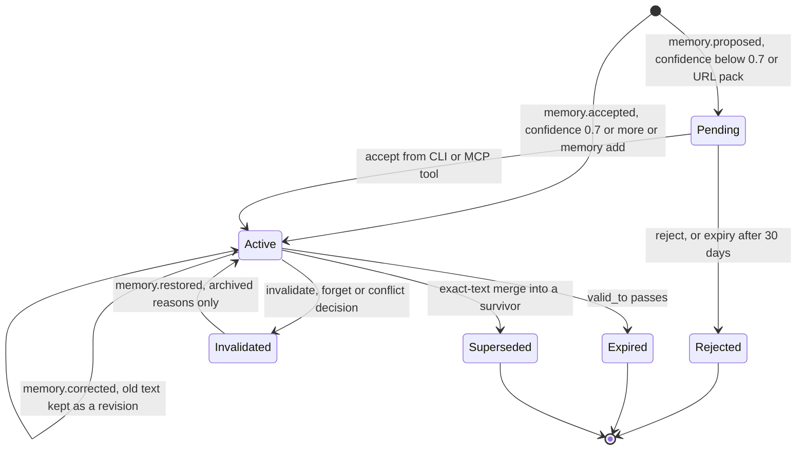

## 1. Executive Summary

Kimetsu is a memory sidecar for coding agents: one Rust binary, one SQLite
file per project and one per user, wired into Claude Code and four other
hosts through hooks and an MCP server. It stores lessons — conventions,
failure patterns, commands, preferences, facts — retrieves them with a
model-free hybrid broker, and injects them before a task.

What is notable is the discipline around the store. Every memory mutation is
an event, the tables are a projection, and a rebuild refuses to complete if
replay would lose a row. A correction keeps the old text as a revision and
resets the evidence that belonged to it. A citation credits only the revision
the model was shown.

What is weak is who holds the gates. The review queue, the conflict queue and
invalidation are all verbs on the agent's own MCP surface, on by default. The
producer picks the confidence number that decides whether review happens.

Four marks: `trust_state` on the proposal queue, `bitemporal` on the validity
bounds and the revision table, `audit_log` on the events table, and
`negative_eval` on the session-start preference profile. Section 9 names the
three withheld.

The benchmark table in the README — LoCoMo, LongMemEval, BEAM — has no harness
in this tree. `.gitignore:35-39` says the orchestrator lives in a private
repository cloned at `./bench/`. The retrieval-quality and answerability
audits under `docs/audits/` are committed with their fixtures and scripts.

## 2. Mental Model

A memory is a short natural-language lesson with a kind, a scope, a
confidence and a validity window. It becomes a belief one of two ways. A
direct write — `kimetsu brain memory add`, the MCP `kimetsu_brain_memory_add`
tool, or any lesson whose producer states confidence 0.7 or more — emits
`memory.accepted` and is retrievable on the next read. Anything below 0.7,
every proposal from the coding pipeline, any pack fetched from a URL, and any
cluster reflection emits `memory.proposed` and waits as a `pending` row in `memory_proposals`, visible to nothing but the
review listing (`project.rs:1341-1349`).

It stops being one in five ways, each an event. `memory.invalidated` retires
it with a reason; `forgotten` reasons are archival and can be restored.
`memory.superseded` points it at a survivor after an exact-text merge. A past
`valid_to` expires it. A conflict decision of `kept_new` or `kept_existing`
invalidates the loser. And `memory.corrected` replaces its text in place while
the previous text survives as a revision with a known time and an effective
time.

Nothing decides truth. Two memories whose embeddings exceed cosine 0.8 with
different text are recorded as a conflict pair and both stay active; the
module header still describes an automatic winner, but the function it
documents records and returns zero resolutions (`conflict.rs:18-26` against
`conflict.rs:564-600`). Usefulness, not truth, is what the system learns: a
memory the model cites before a successful run gains a full point, one merely
retrieved gains a tenth.

Memory is hybrid-controlled. The agent writes and curates through tools, a
session-end distiller writes on its own, and a person has the same verbs on
the CLI.

## 3. Architecture

Seven crates. `kimetsu-core` holds config, paths, ids and the event type.
`kimetsu-brain` is the memory: schema, projector, broker, lifecycle, sync,
packs. `kimetsu-cli` is the `kimetsu` binary, hooks and the distiller.
`kimetsu-chat` holds the MCP server, the host bridge and a terminal REPL.
`kimetsu-agent` is its own coding pipeline and model providers.
`kimetsu-remote` serves brains over HTTP MCP. `kimetsu-e2e` is an integration
suite.

Persistence is SQLite in WAL mode with a 15-second busy timeout
(`schema.rs:67-69`). `events` is the durable log and carries an origin and a
hybrid logical clock per row; `memories`, `memories_fts`, `memory_edges`,
`memory_entities`, `memory_facts`, `memory_revisions`, `memory_citations` and
the proposal and conflict tables are projections that `rebuild_in_place`
recreates by replay (`projector.rs:112-143`). Writes serialize through
`with_write_txn`, a manual `BEGIN IMMEDIATE` with retry on `SQLITE_BUSY`
(`projector.rs:40-71`), plus a per-project lock file.

Two build flavours exist. The lean build uses a no-op embedder and FTS5 only.
The `embeddings` feature adds fastembed BGE-small, an ANN index and optional
cross-encoder rerankers, served by a warm embedder daemon so hooks stay fast.
The npm quickstart switches to the embeddings flavour.

### Deployment and ergonomics

Nothing else has to run. `npm install -g kimetsu-ai` or `cargo install`, then
`kimetsu setup --host claude-code` writes hooks and the MCP entry. No API key
is needed to store or retrieve; the distiller and `kimetsu ask` need a
configured model. The store is a SQLite file that `sqlite3` can open, and the
event log makes a damaged projection repairable with `kimetsu brain rebuild`.
Kimetsu Remote is one more binary with a data directory and a token file.

## 4. Essential Implementation Paths

**Capture.** `add_memory_with_validity` redacts secrets, routes `global_user`
to the user brain, then `add_memory_inner` deduplicates on scope, kind and
normalized text among active rows and emits `run.started`,
`memory.accepted`, `run.finished` (`project.rs:776-1081`). It then embeds,
applies a rarity bonus, records similarity conflicts and links graph edges.
`propose_or_merge_memory_with_validity` is the confidence-gated entry the MCP
record tool and the distiller use (`project.rs:1305-1349`).

**Distillation.** `run_session_end_hook` reads the transcript path from the
SessionEnd payload, asks a configured cheap model for at most three lessons,
passes each through a quality gate, and records it (`distiller.rs:410-540`,
`:747-765`). The same hook captures a work episode for resume.

**Retrieval.** `retrieve_context_with_embedder_and_backend` collects memory
candidates from the configured backend — `graph-lite` by default — across the
project and user brains, adds query-route boosts, repo-file and manifest
candidates, applies lexical and semantic floors, scores, penalizes the older
of two near-duplicates, runs MMR, abstains on weak evidence and packs to half
the token budget (`context.rs:707-1110`).

**Correction and deletion.** `edit_memory` emits `memory.corrected`, which
freezes the current revision and resets confidence, use count, citations and
query routes when the text changed (`projector.rs:2748-2828`).
`invalidate_memory`, `reject_proposal` and `accept_proposal` sit at
`project.rs:1873-2167`. `resolve_conflict` emits `conflict.resolved`, and its
projection invalidates the loser directly (`conflict.rs:660-747`).

**Sync.** `sync.rs` replicates allowlisted events between machines through a
shared directory, deduplicated by event id and replayed in HLC order.

**Tests.** Inline `#[cfg(test)]` modules in nearly every file, plus
`kimetsu-e2e/tests/` and `kimetsu-cli/tests/cli_smoke.rs`.

## 5. Memory Data Model

`memories` carries `memory_id`, `scope`, `kind`, `text`, `normalized_text`,
`confidence`, `source_event_id`, `provenance_snapshot_json`, `created_at`,
`last_used_at`, `last_useful_at`, `use_count`, `usefulness_score`,
`invalidated_at`, `invalidated_reason`, `superseded_by`, `valid_from`,
`valid_to`, `embedding` and `embedding_model` (`schema.rs:114-129` and the
migrations after it).

Scope is `global_user`, `project`, `repo` or `run`, and it is a weight —
1.0 for run down to 0.5 for global user — in the composite score
(`context.rs:2412-2420`). No read filters on it. The boundary that holds is
physical: a project database, a user database, and on the remote server a
directory per repository.

Provenance is a JSON snapshot whose `source` maps to five classes in
`trust.rs:97-107`. Only three are produced: `pack` by `packs.rs:643`,
`staple` by `reinforce.rs:189`, and everything else falls through to
`local`. The distiller writes through `add_memory`, whose default snapshot is
`manual_cli` (`packs.rs:255-272`), so model-distilled lessons are classed as
local and the `distilled` and `remote` multipliers have no producer.

`memory_revisions` holds text, kind, `known_at`, `effective_at` and the
evidence counts frozen at retirement; a `corpus_revision` counter bumped by
triggers invalidates cached indexes across processes (`schema.rs:694-704`).
`memory_facts` is a rebuildable projection of explicitly scoped configuration
claims bound to a claim revision, used by the opt-in answerability guard.

Supersession has no timestamp column; its time exists only on the
`memory.superseded` event.

## 6. Retrieval Mechanics

Retrieval is automatic on every prompt through the `UserPromptSubmit` hook,
and tool-mediated through `kimetsu_brain_context`. Every memory read — FTS,
ANN, recency fallback, graph expansion, digest, profile — carries the same
predicate: not invalidated, not superseded, inside its validity window
(`context.rs:1578-1595`, `backend.rs:411-414`, `digest.rs:373-378`,
`user_profile.rs:69-75`).

Candidates are scored on relevance, confidence, freshness and scope, with
weights that shift by task kind and stage. Relevance is multiplied by a
usefulness term with half-life decay on `last_useful_at` and by the
provenance multiplier, 0.85 for packs to 1.0 for local
(`context.rs:1789-1794`). Graph-lite adds up to 12 neighbours within two hops
of the flat seeds, decayed by 0.6 per hop.

Three guards keep noise out. An IDF-weighted lexical coverage floor drops a
memory whose only matching tokens are corpus-ubiquitous. A cosine floor drops
weak semantic matches on embeddings builds. An absolute abstention gate
returns an empty bundle when the best raw cosine sits below its threshold
(`context.rs:1017-1045`). The packer spends half the request budget on
capsules and records the rest as excluded.

Over-recall is bounded; under-recall is the stated weak spot, which the
preference profile works around by skipping retrieval and injecting the top
eight preferences at warm start (`user_profile.rs:1-37`).

## 7. Write Mechanics

Writes are hot-path and explicit through tools, or background through the
SessionEnd distiller and the coding pipeline's proposal stage. Deduplication
is exact on normalized text among active rows only. There is no update-merge:
related claims are recorded as a conflict pair and both kept. A pack import
with `--mode replace` invalidates every active memory in the pack's scopes
before loading.

Secrets are redacted before any event is stored, and the projector re-redacts
payloads of memory events on replay (`projector.rs:322-339`). The
distiller's quality gate drops a lesson for length, a transience marker or an
exact duplicate and checks nothing else (`distiller.rs:168-230`); quarantine
of URL packs is the only origin gate. At read time the injected block is
framed as prior conclusions to verify against the working tree
(`framing.rs:42-60`).

### Operational cost

A direct write blocks on one embedding and a top-3 conflict scan, no model
call. The distiller runs at session end and costs one cheap-model call per
session. A new memory is retrievable on the next read, since the projection is
written in the same transaction as the event. Background upkeep is spawned
detached by hooks when a pass is overdue, and none of its passes calls a
model. Injection per prompt is bounded by the request budget and
`max_capsules`, and it arrives through the per-prompt hook rather than the
system prompt.

## 8. Agent Integration

`kimetsu setup --host claude-code` writes five hook events: `SessionStart`
runs a daemon warm-up and the warm start, `UserPromptSubmit` runs the context
hook, `Stop` cues harvesting, `SessionEnd` runs the distiller, and with the
proactive option Bash `PreToolUse` and `PostToolUse` surface known pitfalls
(`bridge.rs:2672-2740`). Hosts without a session-start event get the warm
start on the first prompt.

The MCP server exposes retrieval, recording, citation and a full curation
set: list, add, proposals, accept, reject, invalidate, blame, conflicts,
conflict-resolve, prune, reindex, model-set (`mcp_server.rs:294-445`). Sixteen
of them are gated as privileged writes, and the gate is open by default on a
local install because the config field defaults to true
(`mcp_server.rs:450-508`, `config.rs:272-282`). The remote server exposes a
subset that still includes accept, reject, invalidate and conflict-resolve,
and denies all writes unless an environment variable enables them.

The agent is expected to call `kimetsu_brain_cite` when a memory helped; that
citation is what drives usefulness.

## 9. Reliability, Safety, and Trust

**Provenance and correction are the strong half.** Every mutation has an
event with an origin and an HLC. A rebuild that would drop any existing row
rolls back with an error rather than completing (`projector.rs:136-142`). A
citation carries the revision id it was exposed to, and the projector ignores
it if the memory was corrected since (`projector.rs:375-420`).

**Review is not separated from the producer.** `human_review` is withheld. The
approve verb `kimetsu_brain_memory_accept` is registered on the agent's tool
surface beside `kimetsu_brain_record`, and the privileged-write gate that
guards it defaults open locally. Both projectors stamp `decided_by = 'cli'`
as a literal whatever the caller (`projector.rs:966`, `:1053-1058`). The
conflict queue is resolved by the same agent-reachable verb, and an open
conflict withholds neither memory.

**The trust mark is real and narrow.** `trust_state` is awarded because a
pending or rejected proposal is outside every read. The producer sets the
number that decides admission: the MCP record tool defaults confidence to
0.8 and the distiller defaults an omitted confidence to 0.7, so the common
path skips the queue. Only the coding pipeline always proposes. The user brain has no
queue at all. `trust.rs` states in its own header that provenance never
blocks retrieval.

**Tombstone — withheld, with a near-miss.** Rejection is keyed on
`proposal_id`, invalidation on `memory_id`, and the write-path deduplication
checks only active rows, so the same text re-proposed after rejection or
re-added after invalidation is admitted again (`project.rs:872-887`). The one
value-keyed check is incidental: the coding pipeline's proposal filter reads
normalized text from the 200 newest `memories` rows with no status predicate,
so an invalidated lesson blocks its own re-proposal there and nowhere else
(`kimetsu-agent/src/pipeline.rs:2347-2358`, `:1564-1573`).

**`scope_enforced` — withheld.** The boundary is a physical partition, and
the stored `scope` is a ranking weight.

**Replication drops two decisions.** `SYNC_ALLOWED_KINDS` lists eight memory
kinds and omits `conflict.resolved` and `memory.temporal`
(`sync.rs:71-80`). A conflict decision invalidates its loser only through the
`conflict.resolved` projection, so on a synced peer the rejected claim stays
active. A validity stamp written by `mark_memory_temporal` stays local too.

**The as-of view cannot place a merge.** `memories_at` ignores
`superseded_by` because no supersession time is stored, so a merged member
appears believed at every date after its creation, and `belief_delta` never
reports a merge as a retirement (`bitemporal.rs:80-100`, test at `:392`).

## 10. Tests, Evals, and Benchmarks

The suite is large and aimed at the mechanisms: replay determinism, rebuild
refusal, revision binding of citations, archive and restore under replay,
quarantine, answerability. CI runs it twice, lean and with embeddings, single
threaded (`.github/workflows/ci.yml:86-120`). I ran nothing, so the pass
state is the project's claim, not mine.

The `negative_eval` mark rests on the preference profile tests at
`user_profile.rs:207-247`, where a control survives and the retired, expired
and future rows do not. The broker's own invalidation test asserts presence
before and absence after, but the after-set holds no control.

`fixtures/eval-retrieval.json` holds 42 memories and 26 cases with relevant
and stale keys, scored by `eval.rs` including a stale-hit rate.
`docs/audits/2026-09-07-*` commit fixtures, scripts, frozen validation sets
and summaries for the retrieval-quality and structured-facts measurements; the
answerability numbers in `docs/answerability.md` are stated as synthetic and
not a new overall score.

No LoCoMo, LongMemEval or BEAM harness or result file is in the tree. The
audit at `docs/audits/2026-09-04-agent-memory-audit.md:163` cites
`bench/src/drivers/longmemeval.rs`, a path under the ignored private checkout.
The linked benchmark page on kimetsu.dev gives sample sizes and names no
public harness location. No paper describes the system; the arXiv ids in the
tree cite other work.

Missing: a sync test in which a conflict decision reaches a peer, a
tombstone-style test that re-proposes rejected text, and an as-of test across
a merge that expects the member to retire.

## 11. For Your Own Build

### Steal

- Make the event table the only write path and the tables a projection, then
  make rebuild refuse to finish if replay would drop a row that exists.
- Bind each citation to the revision the model was shown, and discard credit
  when the text has changed since.
- On a text correction, freeze the old revision's evidence and reset the
  live row's counts; a new claim has not earned the old one's usefulness.
- Write the status predicate once and repeat it on every read path, including
  the session-start assembler and the graph expansion.
- Quarantine by origin at import, defaulting on for anything fetched over the
  network.

### Avoid

- A confidence threshold the producer sets as the review gate; the producer
  will clear it.
- An approve verb in the same tool registry as the write verb, behind a gate
  that defaults open.
- A replication allowlist maintained separately from the projector's
  dispatch; a new state-changing event kind silently stays local.
- A provenance classifier whose unknown case maps to the most trusted class,
  with writers that never stamp the less trusted ones.

### Fit

For one developer who wants local, offline, inspectable memory for Claude Code
or Codex, this is a strong single-binary choice, and the event log makes it
safer to run than most stores of its size. A team sharing a brain through
sync or Remote should treat conflict decisions as machine-local and review as
advisory. Anyone who needs memory a person must approve has to turn
`mcp_write_tools` off and curate from the CLI, and accept that the
distiller still writes past the queue.

## 12. Open Questions

- Whether the private benchmark harness reproduces the README numbers, and
  which build, reader and settings produced each.
- Whether any host other than Claude Code receives the SessionEnd distiller.
- How the HLC order behaves when two machines' clocks disagree badly, beyond
  the concurrent-supersede case `sync_conflicts` records.
- Whether the remote server's per-repo tokens are ever issued to agents rather
  than people, which decides who can accept proposals there.

## Appendix: File Index

- **Storage/schema:** `crates/kimetsu-brain/src/schema.rs`,
  `migrate.rs`, `projector.rs`, `crates/kimetsu-core/src/memory.rs`,
  `crates/kimetsu-core/src/event.rs`.
- **Write path:** `crates/kimetsu-brain/src/project.rs`, `user_brain.rs`,
  `packs.rs`, `redact.rs`, `crates/kimetsu-cli/src/distiller.rs`,
  `crates/kimetsu-agent/src/pipeline.rs`.
- **Retrieval path:** `crates/kimetsu-brain/src/context.rs`, `backend.rs`,
  `graph.rs`, `ann.rs`, `embeddings.rs`, `trust.rs`, `reinforce.rs`.
- **Context assembly:** `digest.rs`, `user_profile.rs`, `episode.rs`,
  `crates/kimetsu-cli/src/commands/hooks.rs`.
- **Correction and lifecycle:** `conflict.rs`, `consolidate.rs`,
  `lifecycle.rs`, `maintenance.rs`, `bitemporal.rs`, `fact_store.rs`.
- **Background:** `maintain.rs`, `sync.rs`.
- **MCP/API:** `crates/kimetsu-chat/src/mcp_server.rs`, `bridge.rs`,
  `crates/kimetsu-remote/src/catalog.rs`, `auth.rs`.
- **Tests/evals:** `hardening_evidence_tests.rs`, inline test modules,
  `crates/kimetsu-e2e/tests/`, `fixtures/eval-retrieval.json`,
  `docs/audits/`.

### Recorded searches

Checked against the checkout at the pinned revision.

- `grep -rnE 'DELETE FROM events|UPDATE events' crates --include='*.rs'` — production hits only at `maintenance.rs:253` (telemetry kinds), `schema.rs:514` (HLC backfill) and `projector.rs:126` (revision binding on replay); the rest are tests.
- `grep -rnE '"source"\s*:\s*"' crates --include='*.rs'` — producers of `pack`, `staple`, `manual_cli`, `user_brain`, `memory_proposal`, `event`; `distiller`, `remote`, `sync` and `org` appear only in `trust.rs` tests.
- `grep -rn "'rejected'\|invalidated_at IS NOT NULL\|tombstone" crates --include='*.rs'` — no write path consults a rejected proposal or an invalidated row's text before admitting a memory.
- `grep -n 'conflict.resolved\|memory.temporal' crates/kimetsu-brain/src/sync.rs` — no match.
- `grep -rn 'superseded_at' crates --include='*.rs'` — no match.
- `grep -rn 'memories_at\b\|memories_as_of' crates --include='*.rs'` — `memories_at` called outside `bitemporal.rs` only from `projector.rs` tests; the CLI calls `memories_as_of`.
- `grep -rliE 'locomo' . --exclude-dir=.git` — README, CHANGELOG, `scoring.rs`, `context.rs`; no harness. `ls bench` — absent.
- `grep -rliE 'arxiv|bibtex|@article|@misc|doi\.org|CITATION' . --exclude-dir=.git` — matches are the citation feature and four arXiv ids citing other work; no `CITATION.cff`.

## History

**2026-09-30** — [`b5705fb201140696b739daac3de6ff1b8656716f`](https://github.com/RodCor/kimetsu/commit/b5705fb201140696b739daac3de6ff1b8656716f) — first reading, at the head of `main`, a commit dated 10 September 2026. Four marks: `trust_state`, `bitemporal`, `audit_log`, `negative_eval`. Screened before reading: one auto-run surface (`.githooks/pre-commit`, inert until `core.hooksPath` is set), two build-time execution points (`crates/kimetsu-cli/build.rs`, an npm `prepublishOnly`), no dependency file inside the cooldown — every file in a depth-1 clone dates to the tip, which is 20 days old — one floating surface, and no agent-instruction files. Read with `grep` and `sed`; nothing installed, built or run.
