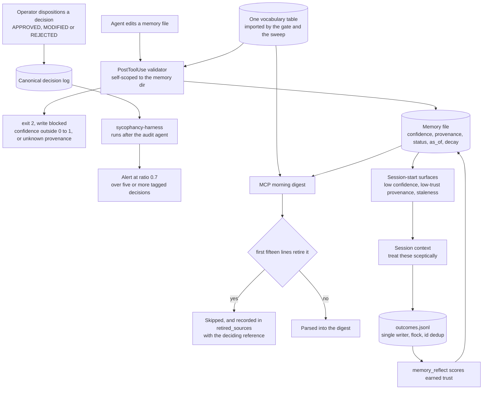

## 1. Executive Summary

Kipi System is an MIT-licensed personal operating system for a founder — 218,595
lines of Python across 622 files, 1,222 commits since March 2026, 228 test files
and 3,536 test functions — packaged as a Claude Code plugin with an MCP server,
session-start hooks, committed git hooks and a fleet of instances cloned from one
skeleton. The memory is markdown files with frontmatter, plus JSON and JSONL
ledgers.

It is also, in part, the author's actual business memory: relationships, a
founder profile, market intelligence. This report describes the machinery and not
its contents.

Two marks. The reason to read the repository is not one of them, and it is worth
describing before the withdrawal that follows. Every decision carries an origin
tag, and an assistant-proposed decision records what the operator did with it:
approved, modified, or rejected. Then the system does something unusual — it
computes how often the answer was *approved*, and treats a high number as a
defect.

`sycophancy-harness.py` runs **after** the agent that audits for sycophancy, and
says why:

> Validates the agent's output and runs independent deterministic checks the
> agent cannot reliably perform (because the agent itself is sycophantic).

It alerts when the approval ratio reaches 0.7 across at least five tagged
decisions, citing [Chandra et al. (2026)](https://arxiv.org/abs/2602.19141) on
sycophancy and delusional spiraling. And the commit that made it runnable on its
own carries the measurement that forced it: the check *"only ever ran behind
/q-morning's bus file while an instance sat at pi~=0.88 with nothing able to
notice."*

An oversight mechanism that measures whether the oversight is real, finds its own
rate at 0.88, and publishes the number, is a different kind of artifact from a
review queue.

**And it is not `human_review`, which the 2026-09-19 re-read withdrew.** The
origin tag is the state the mark would rest on, and the assistant writes it. The
decision log is markdown, the format is a template in
`q-system/canonical/decisions.md:5-14`, and the rules that govern who writes what
are `.claude/rules/sycophancy-core.md` and `auto-detection.md` — instructions to
the agent, which is the rubric's *"a status the producer can write"* beside its
*"prose"* shape. Nothing verifies that a row tagged
`[CLAUDE-RECOMMENDED -> APPROVED]` was approved by anyone; the harness parses the
tags and computes their ratio, which audits the *distribution* of what the
assistant recorded rather than the authorship of any row. That is a real and
uncommon check and it is measuring a different thing. The honest reading is that
this system instruments its own sycophancy well and has no gate a memory waits
behind.

## 2. Mental Model

Memory here is files a person and an agent both edit, so every mechanism is
either a gate on the write or a filter on what gets assembled for the read.

Four independent axes ride on a memory file's frontmatter, and keeping them
independent is the design:

- `confidence`, a number in zero to one;
- `provenance`, one of `explicit_statement`, `inferred`, `corrected`,
  `validated`, `observed`, `imported`;
- `status`, `current` or `superseded`, with `superseded_by` and `supersedes`
  naming the other memory by slug;
- `as_of`, the date the claim was actually true.

The reason for the first two is recorded as a scar: *"kipi auto-memory stored
facts with no certainty signal, so a model-inferred guess and a founder-stated
fact were byte-indistinguishable at recall."* Those are different failures — one
is uncertainty, the other is origin — and collapsing them into a single score
loses the distinction that matters when the memory turns out to be wrong.

A fifth axis is derived rather than declared: **earned trust**, scored from an
append-only log of how each recalled memory actually performed.

## 3. Architecture



## 4. Essential Implementation Paths

- **Gate the write.** `memory-confidence-validator.py` is a PostToolUse hook
  scoped by path substring to the auto-memory directory; every other path exits
  zero fast. A `confidence` outside zero to one or a `provenance` outside the enum
  exits 2, which blocks the write and feeds stderr back to the model. Absent
  fields pass — the fields are optional.
- **Share the vocabulary.** `memory_conventions.py` and
  `provenance_vocabulary.py` are each one table with two readers, the write-side
  hook and the sweep, with a literal fallback for an instance mid-update and a
  paired test asserting the fallback matches the table.
- **Retire on read.** `_retirement` in the MCP's `morning_init.py` reads the first
  fifteen lines only, matches `status: superseded` or an uppercase `SUPERSEDED`
  banner, and returns the deciding `ASK-nnn` reference. The caller skips that
  source and records the retirement.
- **Annotate on read.** `memory-confidence-surface.py` scans at session start and
  prints a warning block for memories below the 0.5 confidence threshold or whose
  provenance is `inferred` or `observed`, *"so the model treats those memories
  skeptically"*. It always exits zero and never blocks.
- **Score what worked.** `memory_outcomes.record_outcome` is the single writer of
  `outcomes.jsonl`, appending `useful`, `dead_end` or `corrected` events;
  `memory_reflect.py` reads the log and promotes a memory to *preferred* on a
  corroboration gate counting distinct useful outcomes.

## 5. Memory Data Model

The unit is a markdown file whose frontmatter carries the four axes above. Two
decisions in `memory_conventions.py` are worth quoting because they are the kind
of thing usually left implicit.

On correction versus deletion:

> A memory that turns out to be WRONG is superseded, not deleted. Deletion stays
> reserved for a memory that was NEVER true (a mis-file, a test artifact), where
> there is no successor to point at and nothing to learn from the correction.

On the default for the hundred files that predate the convention:

> a convention that made them all invalid on day one would be a gate
> unsatisfiable for its own population — which is how a gate gets switched off and
> then protects nothing.

And on `as_of`, which is a validity axis stated as one:

> `as_of` means "when the claim was actually true", which is NOT the file's mtime:
> a memory rewritten for formatting today can still be as-of a fact verified three
> months ago. Callers that judge staleness must use this and never the filesystem
> timestamp.

That is a genuine valid-time axis held apart from the record axis, and it is used
— the lint skips non-current memories and flags a current one whose `as_of`
predates the cutoff. What is missing is the other half: nothing reads the store
*as of* a past date, so there is no way to ask what this system believed last
March. `bitemporal` is withheld on that, with the axis present and named.

## 6. Retrieval Mechanics

Two read paths, and they answer the trust axes differently.

**The digest withholds.** The MCP's `canonical_digest` walks the canonical
sources and, for each, checks retirement before parsing. The fifteen-line window
is the detail that makes it work: a retired document's body is usually *about*
the retirement, so a whole-file scan would let a live document that merely
discusses a retirement retire itself. The banner regex is uppercase-only for the
same reason — *"a banner, not prose"*.

What happens to the retired source is the part worth copying. It is not silently
dropped, and it does not produce a warning either, because warnings in this
system mean a missing file. It is recorded:

```python
digest["retired_sources"][key] = retirement
continue
```

with the deciding `ASK-nnn`, *"so a consumer can tell empty-because-retired from
empty-because-none."* An empty field that says why it is empty is rare anywhere
in this corpus, and it is exactly what a downstream agent needs in order not to
go looking for the content again.

**The surfaces annotate.** The confidence, scores and freshness hooks do not
remove anything. They print a block into session context naming the memories
whose confidence is low or whose provenance is `inferred` or `observed`, and tell
the model to verify before asserting. That is a weaker mechanism than withholding
and an honest one: these memories may still be true, and the system's own
framing is *"the recall-side push; the validator is the write-side gate."*

## 7. Write Mechanics

The validator is a blocking hook, which is the strongest available shape for a
harness rule: a write that declares a confidence of 1.5 or a provenance of
`guessed` does not land, and the reason is returned to the model rather than to a
log nobody reads.

Its header also carries the best scar in the repository, and it is the one this
atlas has [written about separately][second-copy]:

> this set was hardcoded here, and three days later a second lint shipped a
> DIFFERENT vocabulary for the same idea. Nothing collided, because their file
> scopes differ, so the drift was invisible rather than absent.

*Invisible rather than absent* is the precise statement of why a duplicated rule
is dangerous even when nothing has broken yet. The fix is the one this corpus
keeps arriving at from both directions: one table, read at runtime by every
consumer, with the inevitable literal fallback pinned by a test that asserts it
still matches.

The outcome log is the other write path and it is unusually careful for a
personal tool. `record_outcome` is the single writer; deduplication is by a
caller-supplied `event_id` because the corroboration gate counts *distinct*
useful outcomes and a replayed event must not count twice; an flock makes
check-then-append atomic; a prior truncated line without a trailing newline is
normalised under the same lock so the new record cannot be concatenated onto it
and lost; and one `_is_valid_event` predicate gates both the dedup set and the
read, so a parseable-but-incomplete line neither pollutes deduplication nor comes
back as an event. Each of those is attributed in the docstring to the review
finding that produced it.

## 8. Agent Integration

This repository is installed into a harness, which is why the screening flagged
four auto-run surfaces: a plugin marketplace manifest, `.mcp.json`, committed git
hooks, and `.claude/settings.json` with SessionStart, UserPromptSubmit,
PreToolUse, PostToolUse and Stop hooks. Nothing here was executed; the files were
read as data.

The settings file is worth reading as a design artifact. Its deny list blocks
`sudo`, `rm -rf`, `git push --force`, `git reset --hard`, `git rebase`,
`chmod 777`, `curl * | bash`, and reads and edits of `.env`, `credentials*`,
`*.pem` and `*.key`. That is a considered list.

It is also advisory, because the allow list grants `Bash(python3:*)`,
`Bash(node:*)` and `Bash(npx:*)`. An interpreter on the allow-list reaches
everything the deny-list forbids — a Python one-liner can unlink a tree or read a
key file without the string `rm` or `.env` appearing in the command. This atlas
has [met the same shape before](../diffmem/), where a command allowlist was
satisfied by a prefix check while the real execution happened one layer down. The
right reading is that the deny list documents intent and catches accidents, and
that the interpreters are the actual privilege boundary.

The SessionStart chain runs eleven commands, and eight of them end in
`2>/dev/null || true`. A memory surface that starts failing — a renamed path, a
syntax error after an edit — stops producing its block and the session looks
normal. The two hooks that do not swallow their errors are the git health check
and `session-start.py`.

## 9. Reliability, Safety, and Trust

The sycophancy machinery is the reason this report exists, so it is worth being
precise about what it does.

The system already records who originated each decision. `[USER-DIRECTED]` means
the operator said it; `[SYSTEM-INFERRED]` means the system derived it; and
`[CLAUDE-RECOMMENDED -> APPROVED | MODIFIED | REJECTED]` records that the
assistant proposed something and what the operator then did with it. Those three
dispositions are defined in the rule file, in the operator's terms: approved,
changed it, declined it.

Recording the disposition is the ordinary half. The unusual half is computing the
ratio. If nearly every assistant recommendation is approved unmodified, the
approval is not evidence of judgement, and a memory built from those decisions is
a record of the model's suggestions with a human signature on it. The harness
makes that measurable, sets a threshold at 0.7 with a minimum of five tagged
decisions so a small sample cannot trip it, and — critically — does not ask the
LLM audit agent for the number, because *"the agent itself is sycophantic."* The
deterministic check exists precisely where self-assessment is least reliable.

The measurement it reports on itself is 0.88, on an instance where the check
could not run because it sat behind a pipeline artifact.

Three other things belong in this section.

**`audit_log` is withheld, and not for want of append-only ledgers.** There are
two, both good. `outcomes.jsonl` records how each recalled memory performed —
which is a feedback log, the half of the pattern this atlas's definition
explicitly excludes. `judgments.jsonl` is append-only and hash-chained, with
`sequence` and `prev_receipt_sha256`, an exclusive lock held across read, build,
append and anchor because *"capture is a read-modify-append"* and one interleaved
triage would break the chain, and corrections appended as superseding receipts
rather than edits. But those receipts *are* the stored unit, not a record of
changes to some other store: an append-only store is not an audit log of itself.
Either ledger's mechanics would clear the bar if it were pointed at memory
mutations.

**`tombstone` is withheld by the project's own rule.** Deletion is reserved for a
memory that was never true, and nothing is keyed on the removed content, so the
same claim written again is simply a new memory.

**The repository is one person's memory as well as its machinery.** Canonical
files hold relationships, a founder profile including stated accommodations, and
market intelligence. That is the author's choice to publish and not this report's
subject; it is worth noting because anyone cloning this as a template inherits a
layout where personal content and enforcement code live in the same tree, and the
`.claude/settings.json` deny list on `.env` and credentials does not cover the
canonical markdown.

## 10. Tests, Evals, and Benchmarks

228 test files and 3,536 test functions; nothing was run here. The pairing is
consistent — `memory-lint.py` has `test_memory_lint.py`,
`memory-confidence-validator.py` has both `test_memory_confidence_validator.py`
and `test_memory_confidence_wiring.py`, and the wiring test is the one that
matters most: a validator that is correct but not registered as a hook protects
nothing.

The morning-init tests are the strongest set, and they read as a record of
production failures rather than a coverage exercise: a retired source shipping as
live content, a section split that treated every heading as a peer so a section
with nested children parsed to an empty body, a last-match-wins assignment that
overwrote a section's items with another section's. Each names its incident by
reference in the docstring.

One test refuses to invent its fixture:

> A fixture written from memory would test the author's belief about the
> template; this file IS the template every instance ships with, so it is the
> only input that can prove the parser stopped recording it.

Reading the repository's own shipped canonical file as the test input, rather
than a hand-written approximation of it, is a small discipline that catches the
case where the parser and the template drift apart.

## 11. For Your Own Build

- **Record the disposition, then measure the distribution.** "A human approved
  it" is only oversight if the human sometimes does not. One ratio over a tagged
  decision log turns a governance claim into a number that can fail.
- **Do not ask the model to audit the failure mode it has.** The deterministic
  harness runs after the agent and re-derives the number independently. Any
  self-assessment of sycophancy, calibration or bias needs a check outside the
  thing being assessed.
- **An absence should say why it is absent.** `retired_sources` costs one
  dictionary entry and distinguishes "this was retired, here is the decision"
  from "there was nothing" — which is the difference between a consumer that
  moves on and one that goes looking again.
- **Scope a retirement marker to a header window.** A retired document usually
  discusses its own retirement. Matching anywhere in the body makes every
  document about deprecation self-deprecating.
- **Separate certainty from origin.** A confidence score cannot express "the
  founder said this" versus "the model inferred it", and at recall those need
  different treatment even at the same confidence.
- **Make the grandfather default explicit.** Turning on a convention that every
  existing file violates produces a gate people switch off. Absent means
  `current`, and the lint reports the gap as "add on next edit".
- **An interpreter on the allow list is the allow list.** A deny-list of
  dangerous commands beside `Bash(python3:*)` documents intent; it does not
  constrain.

## 12. Open Questions

- What is the current approval ratio across instances? The harness makes it
  computable and the repository records one historical value; nothing in the tree
  publishes a series.
- `as_of` is a real validity axis with no as-of read. Is a "what did we believe
  in March" query intended, or is the axis only there to drive staleness?
- The confidence and provenance surfaces annotate rather than withhold. Is there
  a threshold at which a low-trust memory should be kept out of context entirely,
  and would the operator want to be told when that happened?

## Appendix: File Index

- Conventions: `q-system/.q-system/scripts/memory_conventions.py:26-60`
  (`STATUS_VALUES`, `DEFAULT_STATUS`, `effective_status`, `as_of_date`),
  `provenance_vocabulary.py`.
- Write gate: `q-system/.q-system/scripts/memory-confidence-validator.py:1-60`.
- Sweep: `q-system/.q-system/scripts/memory-lint.py:195-215`.
- Surfaces: `q-system/.q-system/scripts/memory-confidence-surface.py:1-35`,
  `memory-scores-surface.py`, `memory-freshness-check.py`.
- Digest and retirement:
  `plugins/kipi-core/kipi-mcp/src/kipi_mcp/morning_init.py:188-197`, `:434-441`,
  `:462-498`.
- Outcome log: `q-system/.q-system/scripts/memory_outcomes.py:1-28`,
  `memory_reflect.py`.
- Judgment receipts: `plugins/prd-os/scripts/judgment_compiler.py:1-30`,
  `:228-250`, `:1465-1469`.
- Sycophancy: `q-system/.q-system/sycophancy-harness.py:1-60`,
  `.claude/rules/sycophancy-core.md:28-30`, `q-system/canonical/decisions.md:9`.
- Harness surfaces: `.claude/settings.json` (permissions at 2-58, hooks from 70),
  `.mcp.json`, `.githooks/`, `.claude-plugin/marketplace.json`.
- Tests: `plugins/kipi-core/kipi-mcp/tests/test_morning_init.py:257-300`,
  `q-system/.q-system/scripts/test_memory_confidence_wiring.py`,
  `test_memory_lint.py`, `test_memory_outcomes.py`.

**Searches recorded for the negative claims**

```sh
grep -rn "effective_status" --include='*.py' . | grep -v test_    # the sweep only; the digest matches the marker itself
grep -rn "superseded" --include='*.py' . -l                      # write gate, sweep, MCP digest, judgment compiler
grep -rn "as_of" --include='*.py' . | grep -i "query\|as-of read"  # 0 — the axis drives staleness, nothing reads at a past date
grep -rn "CLAUDE-RECOMMENDED ->" --include='*.md' .claude/ q-system/canonical/   # the vocabulary and the log header
grep -c "|| true" .claude/settings.json                          # eight of eleven SessionStart commands swallow failure
```

## History

**2026-09-19** — re-pinned to [`fb098216a6cba5d58c82a6b6c08b535bb068efdd`](https://github.com/assafkip/kipi-system/commit/fb098216a6cba5d58c82a6b6c08b535bb068efdd). **`human_review` is withdrawn; two marks stand.** The first reading was made on 2026-09-17, a day before the rubric narrowed, and it awarded the mark for the origin tag plus the harness that audits it. Re-tested: the origin tag is written by the assistant. The decision log is markdown with a template at `q-system/canonical/decisions.md:5-14`, and what governs its writing is `.claude/rules/sycophancy-core.md` and `auto-detection.md` — rule files addressed to the agent. So the row that says `[CLAUDE-RECOMMENDED -> APPROVED]` is the producer's own claim about a person, which is the rubric's *"status the producer can write"* on top of its *"prose"* shape, and nothing in the tree verifies it. `sycophancy-harness.py` keeps its description: it runs after the audit agent *"because the agent itself is sycophantic"*, alerts at an approval ratio of 0.7 across five or more tagged decisions, and was extracted standalone on 2026-07-01 after an instance sat at 0.88 with nothing able to notice. It audits the distribution of what was recorded, not who recorded it. `trust_state` and `negative_eval` re-verified. Screened again first; nothing installed or run.

**2026-09-17** — [`30b51f1f11e76352c90b12ea198d037688105f45`](https://github.com/assafkip/kipi-system/commit/30b51f1f11e76352c90b12ea198d037688105f45)
— first reading, at the head of `main`, 1,222 commits in. Screened with
`scripts/screen_repo.py` first: four auto-run surfaces — a Claude Code plugin
marketplace manifest, `.mcp.json` declaring three npx-launched servers,
`.claude/settings.json` with five hook families, and committed git hooks — four
pytest `conftest.py` collection hooks, and two dependency files changed inside the
seven-day cooldown. All four auto-run surfaces were read as data and none was
executed; nothing was installed, built or run, and `AGENTS.md` and `CLAUDE.md`
were read as data rather than as instructions. Three marks. `bitemporal` is
withheld with its axis present: `as_of` is a validity date explicitly held apart
from the file's mtime, and nothing reads the store as of a past date. `audit_log`
is withheld on the definition rather than on an absence — `outcomes.jsonl` is a
feedback log, which the mark excludes, and `judgments.jsonl` is append-only and
hash-chained but its receipts are the stored unit rather than a record of changes
to another store. `tombstone` is withheld by the project's own stated rule:
deletion is reserved for a memory that was never true, and nothing is keyed on
removed content. `scope_enforced` is withheld because instance separation is by
directory, with no predicate in a read.

[second-copy]: https://github.com/neoneye/agent-memory-atlas/blob/main/notes/2026-09-16-the-second-copy-of-the-rule.md
