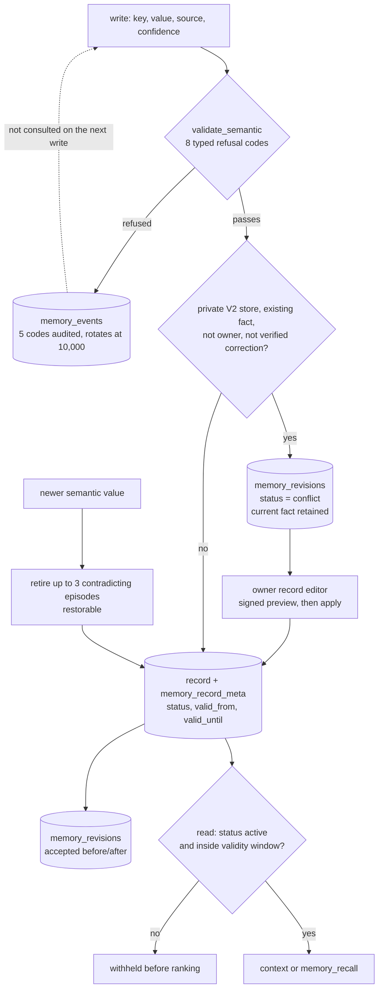

## 1. Executive Summary

Kiro Crew is a local development workspace from the Kiro team — desktop app, web
dashboard, CLI, Slack, Discord and Telegram bridges — that runs unattended tasks
and scheduled jobs on your own hardware. Apache-2.0, 6,247 commits since 1 June
2026, about 1,560 Python modules under `src/kiro_crew/` beside 2,544 files under
`test/`. The README's claim is memory: *"persistent, self-learning, and
self-evolving… remembers across sessions."*

The memory is now two generations in one package. **V1** is the global store every
install already runs: `preferences.md`, `projects.md` and dated `history/` files
with an FTS5 index (`src/kiro_crew/memory.py`), and a structured `memory.db` —
semantic key-value rows, episodic fragments with embeddings, lessons, and an
events table — behind `VectorMemoryStore` (`src/kiro_crew/vector_memory.py`,
7,033 lines). **V2** is a private store per Crew Member: new members get one
automatically, an existing member moves only when the owner chooses *Create
private memory*, and a member's process reaches its store through a
process-protected binding and a signed proof rather than a caller-selected
session header. V2 execution also requires the OS filesystem sandbox. Both
generations share the record metadata, revision journal and editor described
below.

**The write gate is still the reason to read it.** A semantic write passes an
ordered chain in `validate_semantic` (`vector_memory.py:1678`), and every
refusal is a typed `SemanticRejectCode` (`:189`):

| Code | Refuses |
| --- | --- |
| `key_format` | a key that is not `^[a-z][a-z0-9_.]*[a-z0-9]$`, or over 100 chars |
| `allowlist_reject` | a key outside the configured prefixes |
| `reserved_prefix` | a `system.` key from any source but `user_explicit` |
| `low_confidence` | confidence below 0.8, unless the source is `user_explicit` |
| `value_empty` | a null or empty value |
| `value_size` | a value over 4,096 bytes |
| `injection_blocked` | a value matching the prompt-injection patterns |
| `conflict_skip` | a write the conflict resolver declines against the existing value |

Five of the eight are `_AUDITABLE_REJECT_CODES` (`:307`) and land in the
`memory_events` table; `injection_blocked` and `reserved_prefix` are the security
codes. Episodic text is screened for injection too, because *"a poisoned turn
could persist steering instructions that get re-injected into future
contexts"*, and the rejected text passes through `redact_and_truncate` before its
audit snippet is stored (`:3075-3092`), with the dashboard redacting every memory
event again before returning it.

**What changed since the first reading is that a memory now has a status, a
validity window and a revision history.** `memory_record_meta` gives every fact,
directive and episode a `status` — `active`, `superseded`, `expired`,
`forgotten` — plus `valid_from`, `valid_until`, `observed_at`, `source_ref`,
`subject`, `predicate` and `scope`, and `memory_revisions` journals every
accepted mutation with its before and after snapshots. The read path drops any
record that is not active or is outside its window before ranking
(`_ineligible_ids`, `:2125`). In a private store, a non-owner change to an
existing fact that no verified correction backs is not applied: it becomes a
`conflict` proposal *"saved for review"* while the current fact is retained
(`:2267-2292`), and the owner resolves it in the record editor.

**The gap the first reading named has narrowed from one side.** Refusals are
still recorded and not consulted: nothing reads `memory_events` before a write,
so a value blocked as an injection is re-screened by the same pattern list when
it returns. Conflict proposals, by contrast, are deduplicated on their exact
proposed value and base revision (`memory_record_metadata.py:428`), so the same
disputed change does not queue twice — but that is a check against the proposal
queue, not a refusal keyed on a rejected value.

## 2. Mental Model

A memory becomes a belief by surviving the gate, and stops being one by a status
change rather than a deletion. The gate decides at the door; the status decides
at every read; the revision journal remembers both sides of every accepted
change.

The dotted edge is still the finding the first reading made. The proposal path is
the new one: in a private store, a disputed change waits for a person instead of
landing.

## 3. Architecture

**Runtime.** A Python backend (`src/kiro_crew/`) with an aiohttp dashboard, an
Electron desktop app and a React web UI under `website/`, a CLI, and channel
bridges. Everything runs on the operator's own hardware.

**Stores.** The global V1 store lives under `~/.kiro/crew/`: `memory.db` in SQLite
WAL with `semantic_memory`, `episodic_memories`, `memory_events` and
`schema_version`, an optional FAISS index, and the markdown workspace with its FTS5
index. Each private member store is its own directory under the `memory_stores/`
fence, carrying a manifest with a durable store and owner identity; a raw open
refuses a lost or changed manifest. Opening an existing V1 database adds the
shared `memory_record_meta` and `memory_revisions` tables and reconciles record
identities, so V1 keeps its rows, algorithms and prompt behaviour but not
byte-identical files.

**Which store a surface reaches.** The dashboard chat turn, delegated runs,
member-owned scheduled jobs and the channel dispatchers resolve the session's
recorded binding; jobs without member ownership, the heartbeat, the webhook
runner and the task runner read the global store, and the specification lists
that backlog under *"What is NOT isolated yet"*, pinned by
`test_memory_store_seam.EXPECTED_BACKLOG`. The owner's dashboard Memory panel
reaches any declared store through `?store=`; the memory graph, promotion,
migration and import routes remain global-only.

**Background work.** Consolidation (V1 replaces preferences and projects; V2 keeps
them owner-managed), episodic retirement on semantic change, automatic backups
that cover a whole member store, `rotate_events` past 10,000 rows, and a self-heal
path over the memory database.

### Deployment and ergonomics

One machine, one install, no services to stand up. FAISS and embeddings are
optional, with FTS5 as the documented fallback. The markdown half is still three
kinds of file a person can open. The structured half is meant to be edited
through the dashboard's record editor, which previews a change as a signed token
over a selector and applies it inside one SQLite transaction
(`src/kiro_crew/memory_edit.py:470`, `:620`).

## 4. Essential Implementation Paths

- **Write gate:** `vector_memory.py` — `SemanticRejectCode` `:189`, audited and
  security code sets `:307`/`:315`, `validate_semantic` `:1678`,
  `log_reject_event` `:1760`, `_write_semantic` `:2198` with the private-store
  proposal branch at `:2267-2292`, episodic screening and redacted snippet at
  `:3075-3092`.
- **Record metadata and journal:** `src/kiro_crew/memory_record_metadata.py` —
  statuses `:107`, schema `:133-153`, `_append_revision` `:251`, the V1
  accepted-history cap `:285`, `propose_conflict` `:428`, `eligible` `:468`,
  `verified_correction` `:35`.
- **Read eligibility:** `vector_memory.py` — `_ineligible_ids` `:2125` and
  `_eligible_rows` `:2151`; raw-cosine admission at `:3354`; lessons with the
  repository gate in `get_lessons_context` `:5385`.
- **Retirement and restore:** `_retire_stale_episodic` `:2529`,
  `get_retired_episodic` `:4020`, `restore_episodic` `:4056`.
- **Scope:** `src/kiro_crew/project_scope.py:100` `project_scope_satisfied`;
  member bindings in `src/kiro_crew/member_memory_auth.py`.
- **Editor:** `src/kiro_crew/memory_edit.py` and
  `src/kiro_crew/dashboard/handlers/memory_edit.py`.
- **Specification:** `docs/system-specs/modules/memory-skills-hooks.md`, 4,783
  lines, which states each contract with the test that pins it.

## 5. Memory Data Model

`semantic_memory` is still `key`, `value_json`, `confidence`, `source`,
timestamps and `is_deleted`; `episodic_memories` is still id, conversation,
text, embedding, tags, importance and `is_deleted`. `memory_events` keeps
`event_type`, `memory_type`, `memory_key`, `old_value`, `new_value`, `source`,
`created_at`.

`memory_record_meta` is the new layer over both, keyed on a lineage-independent
record id: `kind` (fact, directive, episode), `revision`, `category`, `subject`,
`predicate`, `scope`, **`status`**, **`valid_from`**, **`valid_until`**,
`observed_at`, `source_ref`, a content hash and extracted email addresses. A
unique index allows one *active* fact per `(scope, subject, predicate)`, so an
explicit canonical identity cannot hold two live values. `normalize_metadata`
refuses an unknown field or status and a window whose end is not after its
start.

`memory_revisions` carries `record_id`, `revision`,
`base_revision`, `status` (`accepted` or `conflict`), `operation`, `source`,
`before_json`, `after_json` and metadata. V1 keeps the latest 20 accepted
snapshots per record and deletes older ones in the same transaction; V2 keeps
all of them.

**Provenance is still a `source` string with real authority.** `user_explicit`
bypasses the confidence floor and alone writes `system.`; in a private store it
is also what lets a change to an existing fact apply without review. A verified
correction is the other route: `verified_correction` accepts a change only when
the user's own latest turn contains an explicit literal replacement — *"replace
X with Y"*, *"use Y instead of X"*, or the Chinese equivalents — and binds it to
the pre-extraction revision, leaving *"ambiguous natural language"* as a
proposal.

`valid_from` and `valid_until` are a validity interval checked against the
current time on every read. No reader asks for an earlier instant — `eligible`
takes a `now` that every caller leaves at its default — so there is no as-of
query.

## 6. Retrieval Mechanics

A fresh V1 session reads preferences, projects, decayed daily history, semantic
memory, query-ranked episodic memory and lessons. V2 session context reads
essential anchors and query-free scoped lessons; its semantic and episodic
fragments come only through an explicit `memory_recall` operation, and time
decay applies only in V1.

Every structured read now filters on eligibility before ranking and capping:
`_ineligible_ids` selects the records whose status is not `active` or that carry
a window, and drops those `eligible` refuses, *"so validity is evaluated again on
every recall"*.

The admission rule from the first reading stands: relevance admission reads the
**raw** cosine and decay is applied afterwards for ranking (`:3354`). The
thresholds are 0.55, relaxed to 0.42 past 300 characters, and the constant's
comment is now more candid than *"(empirical)"*: measured over the real embedder,
*"the relevant and irrelevant cosine distributions OVERLAP, so no threshold
separates them"*, and both branches sit looser than the best achievable cut.

**Lessons carry a repository scope, and the gate fails closed.** A lesson may
store `repo_scope`, a path fragment that identifies a repository by something it
contains. `get_lessons_context` withholds a scoped lesson unless
`project_scope_satisfied(scope, project_dir)` holds for the session's active
project, and *"omitting it withholds every scoped lesson"*. A present but
unusable scope is withheld rather than treated as global. Unscoped lessons reach
every session by design. `project_scope.py` states the weakness plainly: a
fragment many repositories contain — `src`, `docs` — matches all of them, so the
precision of the boundary is the author's.

## 7. Write Mechanics

Writes are synchronous and gated as in section 1. Conflict resolution in
`_write_semantic` is serialized, and a declined overwrite records a
`conflict_skip` event with both values.

**In a private store, a disputed change becomes a proposal.** When the store runs
the V2 policy, a change to an existing fact's value or metadata from any source
other than `user_explicit`, and not backed by a verified correction, is persisted
by `propose_conflict` as a `memory_revisions` row with status `conflict`, the
current fact is retained, and the caller is told *"Conflicting update saved for
review"*. The owner's record editor folds any pending proposal ids for the
record into the signed preview's digest, so *"a proposal arriving after review
must not be silently dismissed"*, and applying a `set` resolves them. In the
global V1 store the conflict resolver still simply declines.

**Accepted changes are journaled atomically with the write.** `sync_record`
appends the before and after snapshots in the caller's transaction and raises on
invalid metadata or a duplicate active identity, so the physical write rolls back
with it.

**Retirement is bounded and reversible.** When a semantic value changes, V2
retires at most three episodes whose text asserts the old value against the full
key (`_MAX_EPISODIC_RETIRED_PER_WRITE`), and marks them `superseded`; nothing
hard-deletes an episode, `get_retired_episodic` lists retirements with the key
that caused each, and `restore_episodic` clears the tombstone in place. A user's
own delete is not offered for restoration.

**The audit table is still bounded.** `rotate_events` deletes the oldest
`memory_events` rows past 10,000; the specification notes it is *"the sole hard
`DELETE`"* in the module.

## 8. Agent Integration

Desktop app, dashboard, CLI, Slack, Discord and Telegram, plus Crew Apps. The
model's authority over structured memory is narrow: allow-listed prefixes, no
`system.` writes, the 0.8 floor, and in a private store no silent change to an
existing fact. Private provider startup requires a backend in the private-memory
MCP allow-list — Kiro, Claude Code and KAS — and an enforced OS sandbox;
unverifiable internal calls return `403 member_session_unverified` and never fall
back to the global store.

The dashboard is a review surface in two senses. It renders every declared
store's documents, rows and events for the owner, with delete, retired-restore
and backup routes; and it hosts the record editor, where proposals wait and a
correction is previewed before it is applied.

## 9. Reliability, Safety, and Trust

**`trust_state` — earned.** `memory_record_meta.status` is a stored four-value
field — `active`, `superseded`, `expired`, `forgotten` — moved by supersession
(`vector_memory.py:2522`), forgetting and the owner's editor, and read on every
structured recall, where any non-active record is withheld before ranking.

**`scope_enforced` — earned, on lessons.** `repo_scope` is stored with the lesson
and applied on the injection read by `project_scope_satisfied`, failing closed
when the session has no project; `test/test_lesson_project_scope.py` asserts a
scoped lesson reaches its repository and is absent outside it and when the
project is unknown. The member stores are a different kind of boundary — separate
databases behind a protected binding — which is a partition and would not carry
the mark on its own. Semantic and episodic rows carry no scope predicate on the
read, and the `scope` column in `memory_record_meta` is part of a fact's identity,
not a filter.

**`audit_log` — earned.** `memory_events` records mutations with both values and
five refusal codes, rotating at 10,000 rows. `memory_revisions` beside it is the
fuller journal — every accepted mutation with before and after, and every
proposal — kept in full for V2 and capped at 20 accepted snapshots per record in
V1.

**`human_review` — earned.** The owner reviews and resolves conflict proposals
in the record editor, previews every bulk or single correction before applying
it, deletes and restores through the dashboard, and alone chooses when a member
gets a private store.

**`negative_eval` — earned.** `test_memory_graph.py` asserts an AWS example key
id is absent from a graph node title; `test_perf_memory_quickwins.py` asserts an
embedding BLOB never reaches a search result and a tombstoned row is excluded;
`test_lesson_project_scope.py:303` asserts a scoped lesson's text is absent from
context outside its repository beside the in-repository control.

**`tombstone` — not earned.** Refusals carry the refused value in `new_value` and
nothing reads it on the write path; conflict proposals are deduplicated by exact
value, which prevents a second identical proposal and does not refuse a value.

**`bitemporal` — not earned.** The validity window is real and checked on every
read, but only against the current instant.

Other observations:

- **The trust boundary for `user_explicit` is still a string** at the store API.
  The member binding and proof gate decide *which* store a process reaches; they
  do not verify that a write claiming the privileged source came from the owner.
- **The injection pattern list is still unmeasured**, and it gates both stores.
- **V1 history is pruned by design.** An upgrade removes accepted snapshots
  beyond 20 per record, and the specification advises exporting needed evidence
  first.

## 10. Tests, Evals, and Benchmarks

2,544 files under `test/`, 73 of them memory-named, and nothing was run for this
review. The names track contracts: `test_member_memory_ownership.py` (distinct
stores for members sharing a slug, a broken binding never selecting the global
store), `test_member_memory_denial_audit.py`, `test_memory_lineage_drift.py`,
`test_memory_edit.py`, `test_episodic_retirement.py`,
`test_lesson_project_scope.py`, `test_memory_multistore_stress.py`.

**There is now a memory benchmark in CI.** `.github/workflows/memory-benchmark.yml`
runs nightly, driven by `scripts/ci-member-memory-benchmark.py`, and
`docs/task-specs/2026/09/memory-v2/algorithm-effectiveness-report.md` reports the
V1-versus-V2 algorithm results. The handoff document beside it is unusually
careful about what that evidence is: the algorithm corpus *"is synthetic and is
not a held-out V1/V2 comparison"*, and the committed result JSON *"is an
integrity fixture… not a new measurement"*.

**The admission threshold is measured and reported as loose.** The specification
section *"The admission gate is a loose cut, not a tuned one"* carries the
harness and the overlap between relevant and irrelevant cosine distributions that
the constant's comment summarises.

What is still not established: the injection pattern list's false-positive and
false-negative rates.

## 11. For Your Own Build

### Steal

- **Type your refusals.** Eight named codes turn "the write didn't happen" into
  distinct, loggable facts a dashboard can count.
- **Redact the audit record of hostile input, twice.** Scrub the snippet before
  persisting it, and redact events again before returning them to the UI.
- **Park a disputed change instead of applying it.** Keep the current fact,
  journal the proposal against its base revision, dedupe it by value, and make
  the reviewer's preview fail if a new proposal arrived since.
- **Accept a correction only when the user said it literally.** Bind it to the
  revision the model saw, reject it across a newer user turn, and leave
  paraphrase as a proposal.
- **Check validity at read time, not in a sweep.** A status and a window
  evaluated on every recall cannot lag behind a background job.
- **Fail a scope gate closed when the scope is unknown.** A scoped lesson with no
  project withheld is the safe default; a present-but-unusable scope withheld is
  the one people forget.
- **Admit on the raw score, rank on the decayed one**, and write down when the
  threshold does not actually separate the distributions.
- **Make a heuristic deletion reversible and bounded**, and keep a user's own
  delete out of the restore list.

### Avoid

- **Recording a refusal you never consult.** The refused value is in
  `memory_events` and no write reads it.
- **A privilege boundary made of a source string.** Store isolation is now
  cryptographic; the `user_explicit` exemption inside a store is not.
- **A path-fragment scope without a distinctiveness check.** `src` satisfies
  every repository.
- **Pruning history on upgrade.** Capping V1 accepted snapshots at 20 is
  documented, and it still removes evidence an operator may want.

### Fit

This suits a single operator running a workspace, now including several members
with private memories, who wants memory that is governed rather than
accumulated. It is a whole workspace, not a library: `vector_memory.py` is 7,033
lines coupled to the app's config, bindings and dashboard, so reuse means porting
ideas. Walk away if you need semantic or episodic rows filtered by a scope
predicate inside one store; isolation between members is by separate stores, and
within a store only lessons are scoped.

## 12. Open Questions

- **How good is the injection pattern list?** It gates both stores and its error
  rates are unreported.
- **Does anything verify a `user_explicit` claim inside a store?** The binding
  proof selects the store; the exemption is still a string.
- **How long do conflict proposals wait in practice**, and does anything surface a
  backlog to the owner outside the editor?
- **Will the unowned surfaces move to member stores?** The backlog is pinned in a
  test; the specification argues several belong on the global store.
- **Do the markdown half and the structured half ever disagree?** Nothing was
  found reconciling preferences held in both.

## Appendix: File Index

**Stores and schema**
- `src/kiro_crew/vector_memory.py` — `VectorMemoryStore`, tables at `:543`-`:559`,
  FAISS, events
- `src/kiro_crew/memory.py` — markdown workspace and FTS5
- `src/kiro_crew/memory_record_metadata.py` — status, validity, revisions,
  proposals, verified corrections
- `src/kiro_crew/memory_schema.py`, `memory_stores.py`, `memory_startup.py`

**Write gate**
- `src/kiro_crew/vector_memory.py:189`, `:307`, `:1678`, `:1760`, `:2198`,
  `:2267-2292`, `:3075-3092`
- `src/kiro_crew/vector_memory_constants.py` — `_contains_injection`

**Read path**
- `src/kiro_crew/vector_memory.py:2125` eligibility, `:3354` raw-cosine
  admission, `:5385` lessons and the repository gate
- `src/kiro_crew/project_scope.py:100`

**Members and review**
- `src/kiro_crew/member_memory_auth.py`, `member_memory_backup.py`
- `src/kiro_crew/memory_edit.py`, `src/kiro_crew/dashboard/handlers/memory_edit.py`,
  `memory_admin.py`, `memory.py`

**Tests and evaluation**
- `test/test_memory_graph.py`, `test_perf_memory_quickwins.py`,
  `test_lesson_project_scope.py`, `test_member_memory_ownership.py`,
  `test_episodic_retirement.py`, `test_memory_edit.py`
- `.github/workflows/memory-benchmark.yml`, `scripts/ci-member-memory-benchmark.py`,
  `docs/task-specs/2026/09/memory-v2/`
- `docs/system-specs/modules/memory-skills-hooks.md`

## History

**2026-09-19** — re-pinned to [`a170442fad0413f541a7b255e7d9a8a4bde44dda`](https://github.com/kirodotdev/KiroCrew/commit/a170442fad0413f541a7b255e7d9a8a4bde44dda), 209 commits on. All five marks stand; every record's anchors moved with the tree and were re-verified rather than carried. `human_review` was producer-tested rather than assumed, because the corpus-wide re-test of that mark keeps withdrawing it from systems whose approve verb sits on the agent's own surface. Here three separate things keep it off: `source="user_explicit"`, the value that skips the proposal branch, is passed by exactly two callers and both are owner surfaces — `apply_edit` and the dashboard's delete handler — so it is stamped rather than supplied; resolving a proposal needs an HMAC-SHA256 token compared with `hmac.compare_digest` against a server-side secret, behind handlers that open with `require_owner_dashboard_request`; and the MCP surface has `memory_mode` and `memory_store` and no edit verb. The record now names the evidence door too, which is the stronger one: a `CorrectionEvidence` has to quote the key, the exact old value, the new value and the current revision. Screened again first; nothing was installed and no suite was run.

**2026-09-15** — [`534b003ee9550ecfa83b8c8428794323a97ce9d9`](https://github.com/kirodotdev/KiroCrew/commit/534b003ee9550ecfa83b8c8428794323a97ce9d9) — 4,641 commits on, 2026-09-15. Read from a blobless sparse checkout of the memory modules, their tests, the memory specification and the benchmark workflow. The screen ran on that checkout plus the root manifests: one unpinned surface, one dependency surface inside the cooldown, and `AGENTS.md` and `CLAUDE.md` addressed to a reading agent, read as data; build-time execution points were not re-counted, and nothing was installed, built or run. The memory grew from ~3,300 lines to ~15,600 and gained a second generation: private V2 stores per Crew Member behind protected bindings and the OS sandbox, a record-metadata layer with status and validity windows read on every recall, a revision journal, conflict proposals for the owner, bounded reversible episodic retirement, lessons gated by repository scope, an eighth refusal code, and a nightly memory benchmark. The body is rewritten around that. `trust_state` added on the record status; `scope_enforced` added on the lesson repository gate, with member stores noted as a partition; `audit_log`, `human_review` and `negative_eval` kept with evidence records. The redacted-snippet mechanism stands, now through `redact_and_truncate`, with the dashboard redacting events again. Five marks.

**2026-08-06** — [`429cbad8cdb7bfbf4c10f6343374565832b176d2`](https://github.com/kirodotdev/KiroCrew/commit/429cbad8cdb7bfbf4c10f6343374565832b176d2) — first reading. Screened before reading: 0 auto-run surfaces, 7 build-time exec paths, 5 unpinned dependency surfaces with seven inside the seven-day cooldown, plus `AGENTS.md` and `CLAUDE.md` addressed to a reading agent. Both read as data; nothing was installed, built or run. The report covers the memory subsystem, not the desktop app, the scheduler or the Apps platform.
