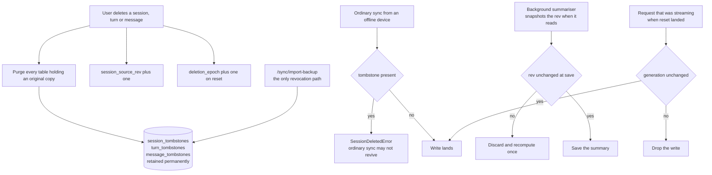

## 1. Executive Summary

kiwi-mem is an AGPL-3.0 personal memory gateway — 33,801 lines of Python across
33 files, 156 commits since April 2026, Postgres-backed, sitting in front of an
OpenAI- or Anthropic-format provider with an MCP server and an admin panel
beside it. The codebase and its documentation are in Chinese; translations below
are mine and marked.

One mark. The project key is bound in the SQL of both retrieval arms, and the
branch that matters is the one for a caller who names no project: it narrows to
`AND m.project_id IS NULL` rather than dropping the clause. A global search
cannot see project memories because the absent case is a predicate, not an
omission.

What distinguishes the system is not retrieval, though. It is **forgetting**,
and the amount of engineering spent on it is unusual. Three tombstone tables at
session, turn and message granularity, retained permanently, with the reason
stated (translated):

> All three kinds of tombstone are retained permanently — no expiry, and this
> release does no garbage collection on them — because what they answer is
> "may this still be written". Once they expire, a device that has been offline a
> long time could re-plant the body text the user deleted. The only place in the
> whole repository that revokes a tombstone is `_restore_conversation_tx`
> (`/sync/import-backup`): restoring a backup is the user explicitly saying
> "bring it back"; ordinary sync can never resurrect.

Beside them sit two counters for the races a delete creates: a per-session source
revision so a background summariser discards a result derived from material
deleted while it was working, and a global reset generation for requests that
were still streaming when the user cleared everything and so had left no trace in
any table to purge.

And then the finding. The conversation-scope predicate is a named constant
because copies drift, and a committed test enforces that by counting occurrences
in the source:

```python
hand_written = re.findall(r"scope_known = TRUE AND project_id IS NULL", db_source)
require(len(hand_written) == 1, ...)
```

One copy — the definition. The guard is a literal regex, and `database.py:1630`
writes the same predicate as `scope_known IS TRUE AND project_id IS NULL`, SQL's
other spelling of the same test, in a diagnostics count. It agrees today, it is
in a statistics query rather than a retrieval path, and it is invisible to the
guard written to prevent exactly it.

## 2. Mental Model

Two stores, one database. Conversations are a ledger of what was said; memories
are what an extractor kept. A nightly *dream* pass merges, softens and deletes
memories, writing a run log with counts and a narrative.

Scope is a project id, nullable, where null means global. The conversation side
carries a second axis that the memory side does not: `scope_known`, a boolean
recording whether the row's project attribution is *known at all*. That gives
three states — known-global, known-project, and unknown — and the global
predicate admits only the first.

Deletion is the third system, and it is the one with the most thought in it. A
delete must remove every original copy, block resurrection by a peer, and
invalidate anything derived from what it removed.

## 3. Architecture



## 4. Essential Implementation Paths

- **Search.** `search_memories` runs a keyword arm and a vector arm and fuses
  them, passing `project_id` into both. Each builds its own predicate:
  `AND (m.project_id IS NULL OR m.project_id = $n)` when a project is named,
  `AND m.project_id IS NULL` when none is (`database.py:3141-3230`, `:2721-2760`).
- **Global conversations.** `CONVERSATIONS_GLOBAL_SCOPE` is the single expression
  every consumer is told to reference (`database.py:1079`).
- **Delete.** A purge across the ledger, chat messages, compression summaries,
  file chunks and comments, then a tombstone row at the right granularity, then a
  bump of the session's source revision.
- **Refuse a resurrection.** `SessionDeletedError` — docstring translated: *"this
  conversation has been permanently deleted; the ordinary sync channel must not
  revive it"* — is raised when a write arrives for a tombstoned session.
- **Invalidate derived work.** A background task snapshots `session_source_rev`
  when it reads its material and re-compares under the same locks before saving;
  a mismatch means the material changed, so the result is discarded and recomputed
  once.

## 5. Memory Data Model

`memories` grew by migration and the columns show it: content, importance, an
embedding added at v3.0, a title at v3.2, a `memory_type` of fragment, daily
digest or digested at v3.3, then a category, an emotional weight, an access count
with the hashes of the queries that reached it, an `is_permanent` flag, and a
`resolution` defaulting to 1.0 that the dream pass lowers when it *softens* a
memory rather than deleting it.

Softening rather than deleting is a real idea — a memory that loses resolution is
still there and returns less sharply — and it is a score, not a state. `trust_state`
is withheld on that: nothing on the row is a discrete status that withholds it
from a read, and `is_permanent` works the other way, exempting a row from batch
deletion rather than gating retrieval.

`tombstone` is withheld too, and this is the closest call in the report. The three
tombstone tables are consulted on the *write* path — their stated purpose is to
answer "may this still be written" — which is the hard half of the mark. What they
are keyed on is session, turn and message identity. Delete a message and no peer
can re-plant that message; write the same sentence again as a new message and
nothing stands in the way. The atlas's mark is for a record keyed on the value,
and this is a very good record keyed on the row.

## 6. Retrieval Mechanics

Two arms, fused, with heat parameters over access counts and recency, and the
project predicate compiled into both statements rather than applied afterwards.

The conversation side is where the scope thinking is sharpest. `scope_known`
exists because a row whose project attribution was never established is not the
same as a row known to be global, and the comment says so (translated):

> The single decision expression for a global event. TRUE and non-null (project
> conversations, including rows whose project was later deleted) and FALSE and
> null (attribution unknown) both fail it, so neither enters the global loop.
> Consumers must all reference this constant and must not hand-write the
> condition in place, to avoid drift across sites.

Two good decisions in one paragraph: unknown attribution fails closed rather than
falling into the global bucket, and the rule is centralised with the reason given.

## 7. Write Mechanics

The gateway extracts memories from conversation and the dream pass reworks them
nightly, logging each run with counts of memories processed, deleted, merged and
softened, scenes created and updated, links created, a narrative, and
`interrupted_at_memory_id` so an interrupted pass can resume where it stopped.

`dream_logs` is a run record rather than a ledger — its `status` is updated in
place and it counts rather than enumerates — so `audit_log` is withheld. It
records that eleven memories were deleted, not which ones, which is the
difference between a report and an account.

## 8. Agent Integration

An OpenAI-compatible endpoint, so any client that speaks that protocol gets the
memory layer without knowing it is there; an MCP server for tools; an admin panel
for provider configuration, which the README explains is the only way to
configure an Anthropic-native provider.

The `KNOWN_ISSUES.md` file is worth naming as an artifact in its own right. It
registers findings from a code audit that the team *deliberately did not fix in
this batch*, sorted into design trade-offs, low-risk technical debt, and items
needing a product decision, with a note that fixed high-severity items live in
git history and are not listed, and a caution that the line numbers are
approximate after later edits so the reader should navigate by function name. A
register of what you decided not to fix, with the reason and the category, is
rarer than a changelog and more useful to someone deciding whether to deploy.

## 9. Reliability, Safety, and Trust

The delete story is the strongest engineering here, and its three parts answer
three genuinely different failure modes:

- **A peer that was offline.** Permanent tombstones, because an expiring one lets
  an old device re-plant deleted text. One revocation path, and it is the one
  where the user explicitly asked for the data back.
- **A background job holding stale material.** The source revision is snapshotted
  at read and re-compared under the same locks before the save, so a summary
  derived from a message deleted mid-computation is discarded rather than
  written.
- **A request that left no trace to purge.** The reset generation catches the
  in-flight case the tables cannot: a session the server had just created and was
  still streaming when the user reset everything.

The safety suite is 8,179 lines and asserts against source text as well as
behaviour. Its structural contracts include that every ledger `DELETE FROM
conversations` is scoped by `session_id`, that advisory locks appear only inside
an explicit transaction helper, and — unusually — that the English README does not
claim built-in authentication, which is a committed test that the documentation
does not overstate the security posture. Much of the rest asserts that content
never reaches a log: a memory log must not carry the content, the no-vector path
must not leak it, a raw extraction response must not appear, and an older
truncated-content log line is asserted gone by searching the source for the slice
expression that produced it.

Which brings the scope guard back into focus. The instruction *not to hand-write
the predicate* is enforced by counting one literal string, and the same predicate
appears once more in the source spelled `IS TRUE` instead of `= TRUE`. The
consequence today is nil — it is a diagnostics count and the two spellings agree
in Postgres — and that is exactly why it survived: this atlas has [collected the
same shape elsewhere][second-copy], where the copy that goes wrong is reliably the
one no test covers. A guard that matches a string rather than a parsed predicate
protects against the copy someone pastes, not the copy someone retypes.

`negative_eval` is withheld, on a distinction rather than an absence. The suite is
full of must-not assertions, and they are about content not reaching logs,
identifiers not appearing in responses, and rows not surviving a purge — with
genuine controls, including a batch delete where the locked row is asserted to
survive while its unlocked neighbour is asserted gone. None of them asserts that
particular material must not come back from a *query*.

## 10. Tests, Evals, and Benchmarks

Fourteen files under `scripts/` named `test_*`, 12,534 lines in total, run as
scripts with a `require()` harness rather than under a framework; nothing was run
here. They are not uniform — `test_mcp_recall.py` carries no assertions at all,
while `test_kiwi_prep_01.py` has 114 and `test_kiwi_safety_sync.py` is the
8,179-line suite described above.

No benchmark, no retrieval eval, and no measured claim about memory quality in
the README — which is at least consistent: the project does not publish a number
it has not measured.

## 11. For Your Own Build

- **Make a tombstone permanent, and name the one path that may revoke it.** An
  expiring deletion marker is a resurrection waiting for a device that was offline
  long enough. One documented revocation route — the user explicitly restoring a
  backup — is both the exception users want and the only one they expect.
- **A delete has to invalidate work in flight, not just rows at rest.** A revision
  counter checked under the same lock before a background save is a few lines and
  closes the window where a summary of deleted material gets written after the
  delete succeeded.
- **Count a generation for the requests that left no trace.** A reset cannot purge
  a session that did not exist yet when it ran. Comparing a generation at write
  time catches exactly the case the tables cannot.
- **Let unknown attribution fail closed.** Three states — known-global,
  known-project, unknown — with the global predicate admitting only the first, is
  strictly better than a boolean that has to decide what an unclassified row is.
- **If you forbid a second copy, match the predicate, not the string.** A regex
  over one spelling passes while `IS TRUE` sits beside `= TRUE`. Normalise
  whitespace and both spellings before counting, or move the predicate somewhere a
  copy cannot compile.
- **Publish what you decided not to fix.** A register of audit findings left open,
  with each one's category and reason, tells an evaluator more than a list of
  what was closed.

## 12. Open Questions

- Is `resolution` read anywhere at retrieval, or does softening only affect what
  the dream pass does next? A sharpness that nothing ranks on is a stored score
  with no consumer.
- The tombstones key on message identity. Is re-sending the same sentence as a new
  message intended to be allowed, or is that the gap a content key would close?
- `dream_logs` counts memories deleted per run. Would naming them — the way the
  tombstones name sessions — make the dream pass's policy testable after the fact?

## Appendix: File Index

- Schema: `database.py:114-160` (`memories` and its migrations), `:441-470`
  (`dream_logs`), `:605-650` (the three tombstone tables, `session_source_rev`,
  `deletion_epoch`, with the retention comment above them), `:727-735` (the
  project column and its partial index).
- Scope: `database.py:1079` (`CONVERSATIONS_GLOBAL_SCOPE` and its comment),
  `:1624-1634` (the diagnostics count with the second spelling), `:2721-2760` and `:3141-3230`
  (the two retrieval arms and their project predicates).
- Deletion: `database.py:1083` (`SessionDeletedError`), `:2426-2500` (the memory
  delete paths).
- Tests: `scripts/test_kiwi_safety_sync.py:4164-4180` (the structural contracts,
  including the scope-predicate count), `:560-600` (the locked-row survivor pair),
  `:369-420` (the log-leak assertions), `:379` (the README claim assertion).
- Documentation: `KNOWN_ISSUES.md`, `README.md`, `README_EN.md`, `CHANGELOG.md`.

**Searches recorded for the negative claims**

```sh
grep -rn "scope_known IS TRUE AND project_id IS NULL\|scope_known = TRUE AND project_id IS NULL" --include='*.py' .
  # 4: the constant, the guard's regex, one test string, and the diagnostics count in the other spelling
grep -rn "CONVERSATIONS_GLOBAL_SCOPE" --include='*.py' .    # 3: definition, one test use, the guard
grep -c "assert" scripts/test_*.py                          # uneven: 114, 36, 20 … and 0 in test_mcp_recall.py
grep -n "CREATE TABLE" database.py                          # no per-mutation ledger; dream_logs is a run record
grep -rn "status" database.py | grep memories               # no discrete status on a memory row
```

## History

**2026-09-17** — [`b01a0c506f4f10f90f30d408c0291f16720f0718`](https://github.com/LucieEveille/kiwi-mem/commit/b01a0c506f4f10f90f30d408c0291f16720f0718)
— first reading, at the head of `main`, 156 commits in. Screened with
`scripts/screen_repo.py` first: no auto-run surface, no build-time execution path,
one unpinned dependency surface, one file inside the seven-day cooldown, and
`AGENTS.md` and `CLAUDE.md` read as data rather than as instructions. Nothing was
installed, built or run — no pip, no Docker, no database started. The repository
is AGPL-3.0 with no rider. One mark. `tombstone` is withheld on the key rather
than on the mechanism: the three tombstone tables are consulted on the write path
and retained permanently, which is the hard half, but they are keyed on session,
turn and message identity rather than on the content, so the same text written
under a new id meets nothing. `trust_state` is withheld because the row carries
scores — importance, emotional weight, a resolution that softening lowers — and no
discrete status that withholds it from a read. `audit_log` is withheld because
`dream_logs` is a mutable run record that counts deletions rather than naming
them. `negative_eval` is withheld on a distinction: the suite's many must-not
assertions cover log leakage, identifier exposure and purge completeness, not
what a query may return. Quotations from the source are translated from Chinese.

[second-copy]: https://github.com/neoneye/agent-memory-atlas/blob/main/notes/2026-09-16-the-second-copy-of-the-rule.md
