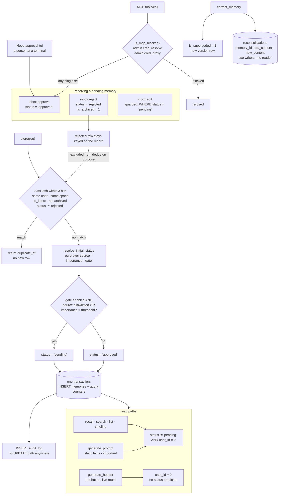

## 1. Executive Summary

Kleos is a self-hosted Rust server that stores agent memories in SQLite and
retrieves them through full-text search, a 1024-dimension vector index and a
graph of entities, communities and PageRank scores. Twenty-five workspace crates
ship as one binary with an HTTP API, an MCP server, a CLI, a terminal approval
UI and a desktop GUI. The README opens by refusing the category — *"Kleos is not
a memory engine. Calling it one is like calling a brain a hard drive."*

**Four marks.** `trust_state`, `scope_enforced`, `audit_log` and
`negative_eval`. The mechanism worth reading here is the optional review
gate, and what is worth reading about it is where it stops.

A memory can be stored `pending` instead of `approved`, and `pending` withholds
it from recall, search, listing, timeline and the generated prompt. The decision
is resolved once, before the write, by a pure function over
`(source, importance, gate config)`, and passed into the insert so the row and
the returned `StoreResult.pending` cannot disagree. It is off by default and the
code says so in the comment beside it.

**What it does not do is keep the producing agent out of the approval.**
`inbox.approve` is a registered route. The MCP server advertises a curated list
of tools, but `tools/call` does not dispatch from that list — it resolves any
route name against the full registry and refuses only two, both of them
credential routes. So a model that knows the name can call `inbox_approve` on
its own pending memory, and the terminal approval UI is the second door the
rubric warns about rather than the first one closing. `human_review` is
withheld on exactly that.

The second gap is quieter. `prompts.rs` builds generated prompt material from
three queries; two carry `status != 'pending'` with a comment explaining that
pending memories must not surface, and the third — the attribution header,
served from a live route — carries no status predicate at all.

## 2. Mental Model

A memory is a row of text with a lifecycle bolted to it on several independent
axes, and reads compose predicates across all of them.

`is_forgotten` is deletion. `is_archived` is retirement. `is_latest` and
`version` are supersession. `is_consolidated` marks material a background pass
has folded into a summary. `status` is review. None of these subsumes another,
and a read path is correct only if it names every axis it cares about — which is
why the interesting defects in this codebase are all predicates that are present
in one query and absent in its sibling.

## 3. Architecture

One binary, one SQLite file. `rusqlite` with `deadpool-sqlite` pooling, writes
serialized through a writer transaction, reads through a pool. No Python
anywhere, which the README makes a badge of.

## 4. Essential Implementation Paths

**The gate decision** — `kleos-lib/src/memory/mod.rs:813-836`.
`resolve_initial_status` is pure over `(source, importance, enabled, sources,
importance_threshold)` and returns `"approved"` immediately when the gate is
off. Its doc comment states the default-preserving intent. The caller at `:646`
resolves it *before* opening the transaction and passes it in, with a comment
recording why: *"so the INSERT and the returned StoreResult.pending cannot
disagree."*

**The deduplicate** — `mod.rs:578-600`. A SimHash fingerprint within a Hamming
distance of 3 against live rows for the same `user_id` and the same `space_id`,
ordered `id DESC` for an early exit. The comment above it records a fixed
defect worth repeating: the query formerly carried `LIMIT 1000` and therefore
*"silently re-stored duplicates of anything older than the newest thousand
memories."* A capped sweep that could never reach its own backlog.

**The rejected-row exclusion** — same query. `is_archived = 0 AND status !=
'rejected'`, under a comment saying a new store *"must not be treated as a
duplicate of a rejected memory (which would boost the rejected row instead of
storing the fresh content)."* The consequence is deliberate and is also the
reason `tombstone` is withheld: content a reviewer rejected can be stored again
as a fresh row.

**The MCP dispatch** — `kleos-mcp/src/tools.rs:165-177`. `registry()` builds
`tools/list` from `DAILY_TOOL_NAMES`, a curated allow-list. `dispatch()` calls
`resolve_tool_name(name)` against the whole route registry and refuses only
`is_mcp_blocked(name)`, which tests membership of
`MCP_BLOCKED_ROUTES = ["admin.cred_resolve", "admin.cred_proxy"]`
(`kleos-client/src/routes.rs:96`). The comment states the intent exactly —
secret-bearing routes *"are dispatchable by name even though they are absent
from the curated tools/list"* — so the wider dispatch is by design and the
refusal was scoped to credentials.

## 5. Memory Data Model

One `memories` table carrying the content, `category`, `source`, `importance`,
`tags`, a 1024-float embedding blob, and the five independent lifecycle axes of
section 2. Supersession is `root_memory_id` plus `version` plus `is_latest`.
Scope is `user_id` and a nullable `space_id`.

`status` is the review axis: `pending`, `approved`, `rejected`. Transitions live
in `kleos-lib/src/inbox.rs` — `:96` approves, `:119` rejects and archives in the
same statement, and `:215` edits under `WHERE ... AND status = 'pending'`, so an
edit cannot reach a memory that has already been decided.

`reconsolidations` records a correction as `(memory_id, old_content,
new_content, reason, user_id, created_at)`. It has two writers,
`intelligence/correction.rs:66` and `intelligence/reconsolidation.rs:183`, an
index on `memory_id`, and **no reader anywhere in the workspace**.

## 6. Retrieval Mechanics

Three arms compose: FTS5 over a `memories_fts` shadow table, cosine over the
1024-dimension vectors, and a graph layer with entity links, community
detection and PageRank. Ranking folds in an FSRS-derived `decay_score`, so a
memory fades when it is not recalled.

The listed read paths compose `status != 'pending'` with `user_id = ?` and the
liveness flags — `mod.rs:1059` for list, `:1135` for the timeline, `:1224` and
`:1233` for the space-scoped reads. The predicate is a **deny-list**: it names
the one status to exclude rather than the statuses to admit, so a status value
added later is readable by default until every one of these sites is revisited.

## 7. Write Mechanics

`store` normalizes tags, infers a category when the caller passes `general`,
resolves the gate status, then does the quota check, the insert and the counter
updates inside one transaction. `enforce_quota_in_tx` runs inside the
writer-serialized transaction rather than before it, so two concurrent stores
cannot both pass a check against the same pre-write total.

Correction is `correct_memory`: store a new version, mark the original
`is_superseded = 1`, write the reconsolidation row.

## 8. Agent Integration

An MCP server over stdio and HTTP, an HTTP API, a CLI, a sidecar, and
`kleos-approval-tui` — a terminal UI for working the pending inbox.

The curated `tools/list` is a real design decision: names are normalized from
`memory.store` to `memory_store` because *"strict MCP clients (VS Code) reject
dot-notation names and silently drop those tools"*, and the unit test beside it
asserts every advertised name is dot-free, unique, and resolvable back to a
route. The list is careful about what it shows. It is not what governs what can
be called.

## 9. Reliability, Safety, and Trust

**`trust_state`.** `status` is a discrete field, not a score, and `pending`
withholds the memory from being treated as true on every listed read path. That
is the definition.

**`scope_enforced`.** `user_id` composes into the recall, search, list,
timeline, prompt and graph queries, and `space_id` scopes the dedup. A migration
even installs a trigger refusing a memory link whose two endpoints have
different owners (`db/migrations.rs:1754`).

**`audit_log`.** `audit.rs:86` and `:123` are the only writers and both are
`INSERT`. There is no `UPDATE` against the table anywhere in the workspace. The
one `DELETE` is a 90-day retention sweep in `admin/mod.rs:106`, which is a
retention rule rather than a rewrite.

**`human_review` is withheld.** The gate holds a memory in `pending` until
something resolves it, and `kleos-approval-tui` is a person doing that. But the
mark asks that the resolver be *an actor the producing agent cannot be*, and
`inbox.approve` is dispatchable over MCP by name. Nothing in the dispatch path
consults the curated list, and the block-list holds two credential routes. The
approval UI is a second door; it does not close the first.

**`tombstone` is withheld**, on two independent grounds. A rejection sets
`status = 'rejected'` on the row — keyed on the record, not the value — and the
dedup query then excludes rejected rows on purpose, so identical content stored
again becomes a fresh row rather than being recognised. And the table that does
hold the rejected text, `reconsolidations`, is never read.

**`bitemporal` is withheld.** `created_at` and `updated_at` are both record
time; `forget_after` is an expiry, not a validity bound. There is no axis for
when a fact was true as distinct from when it was written.

## 10. Tests, Evals, and Benchmarks

A Rust test suite across the workspace, plus CI at `.github/workflows/ci.yml`
and a clippy workflow. Nothing was installed and no suite was run for this
reading; what follows is read from the committed cases.

`kleos-lib/tests/read_isolation_a1.rs` is the strongest file for this atlas's
purposes. Its header states the design — the tests *"run against one monolith
database"* — and it asserts that one user's material does not appear in
another's results across four surfaces: `generate_prompt`, `generate_header`,
`pack`, and contradiction detection. Those are negative assertions on a read
path, which is the strict reading of `negative_eval`.

`kleos-lib/tests/store_dedup.rs` pairs `same_space_near_duplicate_collapses`
with `different_space_is_not_deduped` — the second asserting that a boundary is
*not* crossed, with `assert_eq!(b.duplicate_of, None)`. A scope-boundary
must-not beside the positive case is the harder version of this test and the
one worth copying.

What is not tested is the gap in section 1: no case asserts that a `pending`
memory is absent from `generate_header`, which is the read path that lacks the
predicate.

## 11. For Your Own Build

### Steal

- **Resolve a gate decision once, before the write, in a pure function.**
  `resolve_initial_status` takes the config as arguments rather than reading the
  environment, so it is testable without process state, and the row and the
  returned flag come from the same value.
- **Put the quota check inside the writer transaction.** Two stores cannot both
  pass a check against the same pre-write total.
- **Pair every dedup test with a boundary test.** `different_space_is_not_deduped`
  is what stops a dedup predicate widening silently.
- **Say in the comment why a row is excluded.** The dedup's rejected-row
  exclusion reads as an oversight until the comment explains it is not.

### Avoid

- **An allow-list for the listing and a deny-list for the dispatch.** If
  `tools/list` is curated and `tools/call` resolves anything, the curation is
  documentation. Dispatch from the same list you advertise, or make the refusal
  the allow-list's complement.
- **A deny-list status predicate.** `status != 'pending'` admits every status
  invented after it. `status = 'approved'` fails closed.
- **A history table nothing reads.** `reconsolidations` costs two writes and an
  index on every correction and answers no question, because no query names it.

### Fit

Take Kleos if you want a single self-hosted binary with real retrieval breadth
and are willing to run the review gate yourself — and if you do turn it on,
restrict MCP at the transport rather than trusting the advertised tool list.

## 12. Open Questions

- `inbox.approve` is dispatchable over MCP. Is the curated `tools/list` meant to
  be the security boundary, or is the boundary meant to be elsewhere — and if
  elsewhere, where?
- `generate_header` omits the review-gate predicate its two sibling queries
  carry and document. Deliberate, because an attribution header is not recall,
  or missed?
- `reconsolidations` has two writers and no reader. Is it intended as an export
  surface, or as the input to a correction-aware dedup that has not been built?
- The status predicate is written as a deny-list in every read path. Was
  `!= 'pending'` chosen over `= 'approved'` to keep legacy rows with a null or
  absent status readable?

## Appendix: File Index

| Path | What it holds |
| --- | --- |
| `kleos-lib/src/memory/mod.rs` | `store`, `resolve_initial_status`, the dedup query, the listed read predicates |
| `kleos-lib/src/inbox.rs` | approve, reject and the pending-guarded edit |
| `kleos-lib/src/prompts.rs` | three prompt queries; two carry the gate predicate and one does not |
| `kleos-lib/src/audit.rs` | the two `INSERT`s that are the whole audit writer |
| `kleos-lib/src/intelligence/correction.rs` | supersession plus the reconsolidation row |
| `kleos-lib/src/memory/simhash.rs` | the 64-bit fingerprint and Hamming threshold |
| `kleos-mcp/src/tools.rs` | `registry()` over the curated list, `dispatch()` over the registry |
| `kleos-client/src/routes.rs` | the route table, `MCP_BLOCKED_ROUTES`, `is_mcp_blocked` |
| `kleos-lib/tests/read_isolation_a1.rs` | cross-user must-not assertions on four read surfaces |
| `kleos-lib/tests/store_dedup.rs` | the dedup case and its scope-boundary counterpart |

## Appendix: Recorded Searches

Run from the root of the checkout at the pinned commit.

| Claim | Command | Result at this pin |
| --- | --- | --- |
| Nothing reads `reconsolidations` | `grep -rn "reconsolidations" --include='*.rs' .` | Two `INSERT`s, the `CREATE TABLE`, its index, and migration bookkeeping. No `SELECT` |
| `inbox.approve` is not blocked from MCP | read `kleos-client/src/routes.rs:96` | `MCP_BLOCKED_ROUTES = ["admin.cred_resolve", "admin.cred_proxy"]` |
| No approve verb is advertised | `grep -rn -i 'approve\|reject\|pending' kleos-mcp/src/*.rs` | Only two comments about rejecting dot-notation *names* |
| `generate_header` is wired, not dead code | `grep -rn "generate_header" --include='*.rs' .` | Called from `kleos-server/src/routes/prompts/mod.rs:611` and from the isolation test |
| The audit log has no update path | `grep -rn "audit_log" --include='*.rs' kleos-lib/src` | Two `INSERT`s; one `DELETE` at `admin/mod.rs:106`, a 90-day retention sweep |
| The licence carries no rider | `wc -l LICENSE`; `grep -i 'anthropic\|analys\|benchmark' LICENSE` | 91 lines of stock Elastic License 2.0; no match |

## History

**2026-09-20** — [`7ce95482242ded53e9a9d9ae1221024ab77a0145`](https://github.com/Ghost-Frame/Kleos/commit/7ce95482242ded53e9a9d9ae1221024ab77a0145) — first reading, at 984 files across 25 workspace crates. Screened before reading: two auto-run surfaces (committed `.githooks/`, inert unless `core.hooksPath` points at them, and a `hooks/` directory holding only a README), one build-time execution point, three unpinned manifests, nothing inside the seven-day cooldown; nothing was installed, built or run. Elastic License 2.0, read in full for a rider and carrying none. Four marks: `trust_state`, `scope_enforced`, `audit_log`, `negative_eval`. `human_review` is withheld although the review gate is otherwise careful at every other point, because `inbox.approve` is dispatchable over MCP by name and the curated `tools/list` governs only what is advertised. `tombstone` and `bitemporal` are withheld, each for a reason recorded in section 9.
