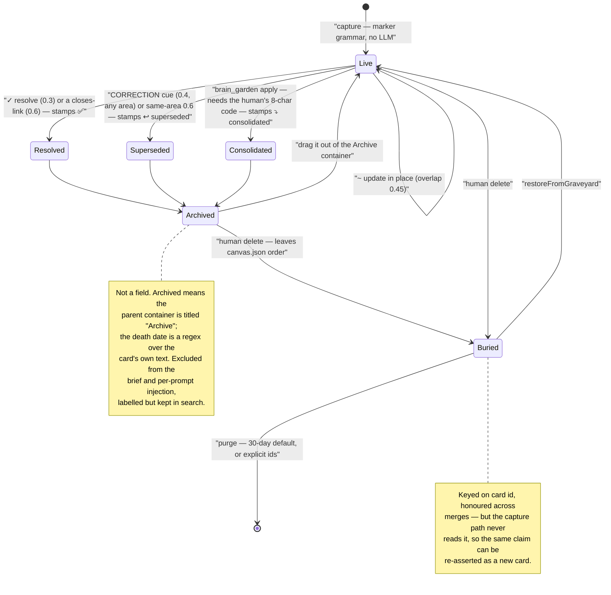

## 1. Executive Summary

Klypix MCP is a shared project brain for multi-agent coding: 23,372 lines of
JavaScript across `src/` and `bin/`, Apache-2.0, 174 commits since 8 June 2026,
published to npm as `klypix-mcp` and packaged for Smithery. It is not an agent
runtime. It is one file — `brain.klypix`, a ZIP of JSON committed beside your
code — that several coding agents read and write over MCP, holding the
decisions, corrections, open questions and standing rules a project has
accumulated. Versions up to 1.28.0 were MIT; 1.29.0 onward is Apache-2.0, and
the `LICENSE` and `NOTICE` files are both present in the tree.

The premise is a real gap and stated plainly: *"Codex does not know what Claude
learned an hour ago."* Every harness in this atlas that carries memory carries it
for itself. Klypix's answer is a format rather than a service — a plain ZIP any
tool can parse, with the parser shipped under the same permissive licence — so
the memory outlives not just the session but the vendor.

**The central design fact, and the one everything else follows from, is that a
card has no status field.** A memory is a text item on a spatial canvas. Whether
it is current, superseded, resolved or consolidated is decided by two things: the
title of the container it sits in, and a marker stamped into its own prose.
`isArchived` is literally `/^archive$/i.test(c.area || '')`, repeated at each of
roughly thirty read paths. A death date for time-travel queries is recovered with
`/(?:↩︎ superseded|↩ superseded|✅|⤵ consolidated) (\d{4}-\d{2}-\d{2})/` over the
card body. This is an epistemic state machine implemented in regular expressions
and spatial containment, and it is simultaneously the design's best and worst
property: it is why a human can fix a wrong belief by dragging a rectangle, and
why renaming one container would make every archived decision read as current
fact.

What is strongest here is the discipline around claims. The benchmark ships in
the package and **runs a negative control before the real measurement** — writers
that bypass the lock go first, and if they fail to lose anything the run reports
`inconclusive` rather than a pass. `brain_garden` cannot archive anything without
an eight-character approval code derived from the exact candidate set and the
day, deliberately never shown to the model, obtained by a human running a
separate CLI. `test/archived-visibility.mjs` asserts that the session brief and
the per-prompt recall path *refuse* to inject an archived card while search
deliberately still returns one, labelled — a distinction between recall surfaces
and injection surfaces that most of this corpus does not draw at all. The
README's own "Current limitations" section names twelve gaps, and eleven of the
twelve are accurate — the exception being a caveat about the write lock that is
more pessimistic than the code (section 7).

What is weakest is reach. The features that make the trust story work are
concentrated on one host. The git-blob drift check on evidence anchors
(`computeFreshness`) is called from exactly one file, `src/global-brain-hook.mjs`,
the Claude Code hook — no MCP tool computes freshness. The append-only capture
ledger is written by that same hook and by nothing else, so a `brain_note` from
Cursor mutates the brain and leaves no event record. The cross-project registry
that `search_all_brains` reads is written only there too, which the README states
and which the code confirms: a Codex-only or Cursor-only setup gets a silent
empty result. The integration table promises nine hosts; the epistemic machinery
serves one.

## 2. Mental Model

A memory is a **card**: one text item in a canvas, belonging to an **area** (the
container it sits inside), and carrying a small set of structured side-fields
parsed off its text at capture — `evidence` (a list of `{kind, ref, oid}`),
`closes:`, `verify:`, plus `createdBy`, `createdVia` and `author` for provenance.
Everything else about a card's meaning, including its entire lifecycle, lives in
the prose.

Capture is a marker grammar, not an extraction model. There is no LLM anywhere on
the write path; the only model in the system is the agent already talking to the
user. An agent writes `🧠 BRAIN [Area]: <decision>` in its transcript, or calls
`brain_note`, and a prefix character selects the transition: `?` opens a
question, `!` records a milestone, `+` or 🛠 defines a standing skill, `✓`
resolves an open card, `~` updates one in place. A decision whose text contains
the case-sensitive cue `CORRECTION`, `OBSOLETE` or `was WRONG` supersedes its
stale counterpart across areas.

Those transitions are gated by named overlap thresholds, all of them in
`captureIntoBrain` at `src/klypix-format.mjs:3401`: `SUPERSEDE_AT` 0.6 for a
plain same-area supersede, `CORRECTION_SUPERSEDE_AT` 0.4 for the cue-gated
cross-area one, `RESOLVE_AT` 0.3 with a ±0.1 near-tie band capped at three,
`UPDATE_AT` 0.45, `CLOSE_COVER_AT` 0.6, `QUESTION_MERGE_AT` 0.6.
`docs/BRAIN_THRESHOLDS.md` tabulates every one against its file and calls itself
*"the coherence contract"*. That document's header is stamped `v1.18.0` and the
package is at 1.65.0 — but each constant listed in it still matches the code at
this commit, so the version stamp is stale and the contract is not, which is the
less common of the two ways a document like that goes wrong.

**A card dies by being moved and stamped, never by being edited into silence.** A
supersede archives the old card — reparents it into a container titled `Archive`
— prepends `↩︎ superseded <date>` to its text, and draws a `superseded by` arrow
to the new one. The gardener's consolidation does the same with `⤵ consolidated
<date>`. A `✓` resolve stamps `✅`. Every later read reconstructs the state by
matching those strings and that container title. Deletion is a separate and
stronger act: `brain-graveyard.mjs` moves the bytes to `graveyard/`, removes the
id from `canvas.json.order` entirely, and records it in `graveyard.json`. The
module's header explains why archival could not be reused for this — archived
cards are still in `order`, still render, and *"`brain_ask` includes archived
cards by design"* — so routing deletes there would make a deleted card visibly
reappear.

The graveyard is honoured across merges, which is more than most bins manage: a
`merge-brains.mjs` comment records that before it existed, syncing with a peer
who still had the card *"and it came straight back"*. But it is keyed on card
**id**, and the capture path never consults it. Nothing stops an agent from
writing the same rejected decision again tomorrow as a fresh card, and nothing
would recognise it. This is the closest the corpus gets to a
[rejected-value tombstone](../../patterns/rejected-value-tombstone/) without
being one: durable, human-authored, merge-propagating, and about a *row* rather
than a *value*.

Trust is otherwise deliberately thin, and the system says so. `brain_challenge`
argues back against a proposed decision using only deterministic evidence —
explicit correction cues and opposite-polarity word pairs — and its own
documentation states the limit: *"Silence means no contradiction signal was
found — not verified consistency."* The one place a claim is checked against
reality is the `ev:` anchor, which records a `file:line` plus the git blob OID at
capture time, so a later read can flag that the cited code moved. The README is
precise about what that proves: *"It detects that the code changed — never that
the claim became false."*

## 3. Architecture

Nothing has to be running. A brain is a file in a repository, and every mechanism
in the package operates on that file directly.

**Storage.** `brain.klypix` is a ZIP (`FORMAT.md` v4) containing `manifest.json`,
`canvas.json`, `items/<shard>/<id>.json` one file per card, an optional `assets/`
tree, and — once anything is deleted — `graveyard.json` plus `graveyard/`. Item
geometry lives in `canvas.json.positions` rather than in the item file, so moving
a card never rewrites its content. A brain is distinguished from a plain canvas
by `manifest.kind === "brain"` or a `brain.*` basename, and only a brain gets the
stricter semantics: union-merge on save under a capture lock, tombstone-only
deletes.

**Processes.** The MCP entry point (`bin/klypix-mcp.mjs`) is a stdio
**supervisor** that holds the host-owned connection open while a replaceable
worker (`bin/klypix-worker.mjs`) serves the 21 tools. A staged update is
hash-verified, initialised in parallel, checked for backward-compatible tool
schemas and handed the current `brain_sync` task scope before the supervisor
switches between requests; a breaking candidate is rejected while the old worker
keeps serving. This is the only genuinely long-lived process, and its only
network activity is one npm version check per machine per 24 hours, disabled by
`KLYPIX_AUTO_UPDATE=0`.

**Retrieval stack.** Lexical scoring is pure JavaScript over the parsed struct.
The optional semantic arm dynamically imports `@huggingface/transformers` — which
is a **devDependency, not a dependency**, so an ordinary install genuinely cannot
reach it — and runs `Xenova/bge-small-en-v1.5` on device, with
`Xenova/ms-marco-MiniLM-L-6-v2` available as a cross-encoder reranker behind
`KLYPIX_RERANK=1`, off by default because the README records that it *"reduced
precision and added latency"* on the frozen evaluation. `src/semantic-memory.mjs`
implements a bounded runtime: models load only when semantic work is requested,
native inference is serialised per process, and loaded models retire after an
idle interval. Every failure path degrades to lexical rather than erroring.

**Sidecars.** Three JSONL files sit outside the brain and matter to the analysis:
`<project>/.claude/brain-capture-log.jsonl` (the capture ledger, ring-capped at
1000 entries), `~/.claude/project-brain/.hook-health.jsonl` (write outcomes,
capped at 500), and `~/.claude/project-brain/live-ledger.jsonl` (in-flight
cross-session signals). Restore points — whole-file snapshots taken before every
brain write — live under `~/.claude/project-brain/history/`, deliberately never
beside the brain so nothing lands in git.

### Deployment and ergonomics

The floor is a single file and no install: `parseKlypix` is exported, the format
is documented, and `npx klypix-read <file>` prints a brain as markdown. There is
no database, no queue, no vector service, no API key, and no network call needed
to store or retrieve anything. Offline is the default rather than a degraded
mode, and the one thing that degrades without the optional model — semantic
ranking — degrades to lexical rather than to nothing.

The cost is elsewhere. `npx klypix-mcp install` writes into the home directory:
the engine and runtime into `~/.claude/project-brain`, four hooks into
`~/.claude/settings.json` (*"written even if Claude Code is not installed"*), a
guidance block into `~/.codex/AGENTS.md`, and Codex's MCP connection into
`<cwd>/.codex/config.toml` while removing any global entry. `npx klypix-mcp link`
writes fourteen hash-stamped files into each project for the other hosts.
`link --check` audits without writing and exits non-zero on drift, and
`uninstall --check` produces a full inventory first — but uninstall is
machine-global, and the per-project files must be removed one project at a time
with `uninstall unlink`.

The store is repairable by hand in the strongest sense available: `unzip` it and
edit JSON. That is worth more here than usual, because the lifecycle states are
strings a human can read and correct with a text editor.

## 4. Essential Implementation Paths

- **Capture (automatic).** `src/global-brain-hook.mjs`, Claude Code Stop hook →
  marker scan → `splitMarkerSuffixes` peels `closes:` / `ev:` / `verify:` →
  `doCapture` under the cross-process lock → `captureIntoBrain` →
  `tidyBrain` → `atomicWrite`. `appendJsonl(LEDGER, …)` records the decision list.
- **Capture (explicit).** `brain_note` in `bin/klypix-worker.mjs` → `opBrainNote`
  in `src/klypix-core.mjs` → `withCanvasWriteLock` → the same
  `captureIntoBrain`. Identical engine, no ledger entry.
- **Lifecycle transitions.** `captureIntoBrain`, `src/klypix-format.mjs:3401`
  onward — resolve, update, question-merge, supersede and `closes:` each with
  their own threshold and their own guards (🛠 skills are excluded from fuzzy
  resolve and from supersede; `closes:` collapses to the single best match above
  four).
- **Retrieval, whole-brain.** `rankForQuestion`, `src/klypix-format.mjs:1898` —
  lexical scoring, then reciprocal-rank fusion with the semantic arm, then
  correction and fulfilment overlays.
- **Retrieval, per-prompt.** `scoreCardsAgainstQuery` via `promptRetrieve` in the
  hook, `topK=5`, `minScore=3`.
- **Context assembly.** `structToBrief` (`BUDGET_CHARS` 13,500, written to
  `.claude/brain-brief.md`) and `structToUltraBrief` (`ULTRA_BUDGET_CHARS` 1,800,
  the SessionStart stdout tier). `statusContextToMarkdown` computes a status
  section with a 4,200-character budget that structural lines bypass.
- **Correction detection.** `detectContradictions` and `correctionOverlaysFor`,
  both keyed on `hasCorrectionCue` — the same case-sensitive predicate used at
  capture, deliberately shared so the three surfaces cannot disagree.
- **Delete and restore.** `src/brain-graveyard.mjs` — `restoreFromGraveyard`,
  `purgeGraveyard`, `listGraveyard`; `src/brain-history.mjs` for whole-file
  restore points.
- **Merge.** `src/merge-brains.mjs` (`sameMeaning` as the single semantic
  comparator) and `src/klypix-merge-driver.mjs` (the git driver).
- **Verification against code.** `computeFreshness`, `evidenceGitPath`,
  `gitBlobOid` — all three in `src/global-brain-hook.mjs`, all three reachable
  only from it.
- **Coordination.** `src/agent-presence.mjs`, `src/mcp-presence.mjs` (the
  `brain_sync` Context Gateway), `src/presence-relay.mjs` (frames only, no
  transport).
- **Human gate.** `gardenApprovalCode` and `opBrainGarden`,
  `src/klypix-core.mjs:758` and `:820`; the human half is
  `bin/klypix-worker.mjs:148`.
- **Tests.** 57 `.mjs` files under `test/`, 53 chained in `npm test`.

## 5. Memory Data Model

A card's on-disk JSON is small: `type` (one of eleven strings, of which `text` is
the memory-bearing one), `content`, presentation fields, and provenance —
`createdBy` (`user | agent`), `createdVia` (which harness captured it), and
`author`, resolved from `git config user.name` so brain attribution matches
commit attribution. Capture adds `evidence`, `closes` and `verify` where the
markers supplied them. `updatedAt` is documented as **volatile** and excluded
from every comparison by `sameMeaning`, after a byte-compare in the merge engine
*"spawned conflict twins for cards nobody touched"*.

Everything genuinely epistemic is outside that schema. The area is the parent
container's title, resolved through `canvas.json.positions[id].parentId`. The
lifecycle state is a stamp in `content`. The correction chain is an arrow in
`canvas.json.connections` with `relationship: "conflicts_with"` or
`label: "superseded by"`. The dismissal of a false-positive contradiction is
another arrow, `relationship: "not_contradiction"`, persisted so the pair never
resurfaces — a nice detail: a *negative* human judgement is durable state here,
even though a negative judgement about a claim's content is not.

**Scoping is the file.** There is no user, tenant, agent or session key stored on
a card and none applied as a read filter. One brain per project directory is the
whole boundary, which is the same call as [Graphify](../graphify/)'s
`graphify-out/` and [Engram Alpha](../engram-alpha/)'s one-graph-per-directory.
`search_all_brains` crosses the boundary deliberately, reading
`~/.claude/project-brain/registry.json` — and the A2A face gates that one skill
behind an explicit `--allow-cross-project` flag, which is the only place in the
system where a scope decision is enforced rather than assumed.

Temporal fields are `createdAt` and the volatile `updatedAt`, plus the dated
death stamps parsed out of text. That supports `as_of` time travel over a single
axis: `rankForQuestion` drops cards created after the cut-off, and drops archived
cards whose death date is at or before it, keeping an archived card only if it
*demonstrably outlived* the cut-off. An undated stamp is excluded —
"precision-first, so a 'what was true then' answer never asserts a since-dead
fact". Correction overlays are suppressed entirely in time-travel mode, because
*"a correction is a PRESENT fact"* and importing a 2026-05 corrector into a
2026-02 query would contaminate it. This is a careful reconstruction of past
belief, and it is transaction time only — nothing records when a fact was true in
the world as distinct from when the project recorded it, so it is not
[bi-temporal](../../patterns/bi-temporal-fact-validity/).

## 6. Retrieval Mechanics

`rankForQuestion` is the whole-brain path. Query tokens are split into content
and status tokens first, so that *"'remaining' must never lexically select the
stale cards that say 'remaining:'"* — a status-shaped question is answered from a
computed section rather than by keyword-matching the word. Lexical scoring
weights title and tag hits at 3 and body hits at `min(1, 6/log2(bodyWords))`, so
a long card cannot win on surface area.

When the embedder is present the two arms are combined by **reciprocal-rank
fusion**, and the comment explaining why is the right one: different embedding
families have incompatible score distributions, so `sem*10 + lex` lets *"lexical
noise erase a much better model"* and breaks on every model upgrade. The
semantic term is `100/(61 + rank)`. The lexical term is `15/(61 + rank)` — **and
it is added only when the query carries an exact identifier, path, version or
commit-shaped anchor**, because otherwise *"fresh keyword noise displaced the
correct paraphrase even with a tiny weight."* That is a sharper answer than the
usual fixed-weight hybrid: lexical is not a co-equal arm, it is a precision
escape hatch for the queries where exact match is the point. Compare
[hybrid retrieval fusion](../../patterns/hybrid-retrieval-fusion/), where the
common shape is a constant blend.

Archived cards are demoted rather than excluded — `-1.5` in the lexical path,
`-0.1` after fusion — because *"history matters for 'what did we…'"*. The
exclusions happen further down the pipe, on the injection surfaces, which is the
distinction this design gets right and most do not.

Three overlay passes then run over the top-k only, never over the brain: a
**correction overlay** attaches a stale card's live corrector so the agent
answers from the correction; a **fulfilment overlay** hints that a shipped
milestone probably closed an open question; an **obsolescence overlay** warns
that a standing skill asserts a limitation a newer milestone appears to have
removed. All three are hedged in the rendered text, all three respect persisted
human dismissals, and the second and third are explicitly `unconfirmed`. Each
carries a dated incident in its comment — the 🛠️↔🏁 pass exists because *"'Chat
has no tools' kept outranking the same-day milestone that shipped chat tools, and
an agent asserted the limitation to the founder as current fact."*

**The rule worth stealing outright is about truncation.** In
`statusContextToMarkdown`, headers, counts and overflow notices go through
`pushAlways` and bypass the character budget entirely, under a stated law: *"a
warning is never subject to the budget/width it warns about."* The incident that
produced it is recorded inline — nine of twenty-seven open items rendered with
the "…and N more" line itself cut by the same budget, under a header telling the
agent to answer from this section first, and the answer was wrong. A truncated
list that does not say it is truncated is not a shorter answer; it is a false
one. [token-optimizer](../token-optimizer/) reaches the same conclusion from the
other direction with its dropped-project disclosure.

Failure modes worth naming: the correction machinery is entirely lexical, so a
correction that shares no vocabulary with the card it corrects will not fire at
any threshold — and `brain_challenge` will return silence, which the tool
description is careful to say does not mean consistency. The `#auto`-harvested
ship cards are gated behind an entity-token requirement precisely because
generic work verbs were producing noise. And `search_canvases` is a plain
substring scan with no ranking at all, three points for a title hit and one for a
body hit — the cross-canvas surface is much weaker than the in-brain one.

## 7. Write Mechanics

**No LLM runs on the write path.** This is the strongest form of
[zero-LLM capture](../../patterns/zero-llm-capture/) in the local coding-agent
family: the model that decides what is worth remembering is the agent already in
the conversation, and what it hands over is a marked line of text. The engine's
job is to place that line correctly — dedupe it, decide whether it resolves,
updates or supersedes something, draw the arrow, and write the file.

Writes block, and briefly. Every path is read-modify-write, so two layers of
locking are required and both are present: an in-process promise chain keyed on
the resolved path (`withWriteLock`), because *"five parallel `opAddToCanvas`
calls reported five successes and left ONE card on disk"*, and a cross-process
advisory file lock shared with the hooks and the desktop app
(`src/brain-write-lock.mjs`, 60 tries × 60 ms, heartbeat-refreshed and
token-checked on release). A write is a temp file plus an atomic rename, so a
crash mid-write leaves the previous good file intact.

**On lock timeout the two paths differ, and the README describes only one of
them.** The MCP tools fail closed and say so: *"Nothing was overwritten; retry
the same operation."* The Claude Code hook also fails closed, but better — it
queues the batch durably to `pendingCaptures`, advances its dedup state, logs
`lock-timeout — batch QUEUED for the next capture; brain untouched`, and the next
capture drains the queue **under the lock** and clears by id so a peer's batch
cannot be lost or landed twice. The README's limitations section instead says the
lock is *"fail-open past ~3.6 seconds"* and that *"sustained contention can still
lose an update"*. At this commit the code is stricter than the caveat: neither
path proceeds without the lock. A caveat that overstates the risk is the right
direction for one to be wrong in, but it is still wrong.

Lag before a memory is retrievable is effectively zero for the lexical path — the
file is the index. The semantic path re-embeds lazily on the next query, with a
model-keyed, atomically-written cache; an update schedules one detached
single-writer cache migration so the first query after a model upgrade does not
pay a multi-minute re-index. **No background pass rewrites the store.** The
gardener is the only thing that rewrites in bulk and it cannot run unattended.

Deletion has three tiers, and they are properly distinguished: archive
(reparent + stamp, still in `order`, still searchable), bury (out of `order`,
into `graveyard/`, restorable, 30-day default retention), and purge (bytes gone
from the working file — with the caller told, correctly, that this *"cannot
remove them from git history"*). Above all of it sit restore points: the previous
bytes of the brain, snapshotted before every write, deduped and throttled to one
a minute — **except that a write which removes cards is never throttled**,
"because that is the case they exist for." Retention is the newest 20 plus one
per day for 14 days. A snapshot that cannot be written is logged and skipped
rather than blocking the save. Ordinary canvases get none of this, on the stated
reasoning that a brain is the file where *"one human made every mark and saw
every change"* is not true.

Nothing filters malicious input. A card is whatever text an agent wrote, and the
brief injects cards into the next session's context. The provenance stamp records
which agent wrote it, and the KLYPIX app renders that as a badge, but there is no
trust tier and no sanitisation — the model reading the brief is reading text some
other model wrote, unlabelled as such.

## 8. Agent Integration

Twenty-one MCP tools, verified by counting `server.registerTool` and
`registerAppTool` in `bin/klypix-worker.mjs`. (The README's tool table lists all
twenty-one; a sentence directly beneath it says *"Exactly 19,
machine-verifiable"* — the sentence is stale, and `brain_doctor`'s own regex,
which counts the same two registration forms, would report 21.)

Integration depth is stratified honestly, and the README's own table is the best
short statement of it. Claude Code gets four lifecycle hooks: a session-start
brief, per-prompt task-ranked recall, and automatic capture at turn end. Codex
gets native MCP plus presence, with six optional lifecycle hooks behind
`--codex-hooks` that Codex itself must approve — and **even with them on, the
Codex hook never writes the brain**, which the code confirms. Cursor, Cline,
Copilot, Gemini CLI, Antigravity, Windsurf, Aider and Claude Desktop get a rules
file and, mostly, an MCP config: the model must call `brain_sync` to get context
and `brain_note` to record anything. The README states that only the
config-writing side is tested for those hosts and their host-side behaviour is
unverified. That is the correct thing to say and almost nobody says it.

The agency split is well drawn. `brain_doctor`, `brain_lens`, `brain_insights`
and `brain_reconcile` are read-only. `brain_garden`, `brain_reconcile` and
`brain_connect` propose before they apply. `brain_garden` cannot apply at all
without a human's code. `brain_reconcile` *only* proposes stale-versus-correction
pairs — it never retires anything itself, and its instruction text tells the
agent how to hand a false positive back as a persisted `not_contradiction`
dismissal.

`brain_sync` is the portable substitute for lifecycle hooks: one call returns a
bounded task capsule, the peers currently active on this project, exact-path
overlap between declared file sets, and any one-time messages. The coordination
half is outside this atlas's scope but the honesty about it is not — overlap
matching is exact-path, both sides must have declared, nothing is blocked, and
*"one severity string in the payload reads `blocking`; the mechanism is not."*

## 9. Reliability, Safety, and Trust

**Provenance** is recorded on every card and split usefully: `createdBy` says
*what* wrote it (user or agent), `createdVia` says *which* harness, and `author`
says *whose* machine, resolved from git config so it matches commit attribution.

**Verification against the subject** is the `ev:` anchor: a `file:line` reference
plus `git rev-parse HEAD:<path>` at capture, recomputed on read to flag drift.
`test/evidence-anchors.mjs` builds a real git fixture and asserts the failure
directions — a deleted, renamed or unresolvable path must go visibly stale rather
than *"inherit its old OID as a green check"*, an absolute path outside the
repository is rejected, and line or column suffixes do not change the resolved
blob. This is another instance of
[verify memory against its subject](../../patterns/) and among the cheapest, but
its reach is the narrowest of them: it is opt-in per card, needs the author to have
written the anchor, and `computeFreshness` is called from the Claude Code hook
alone.

**Concurrency** is the area with the most engineering behind it, and the
benchmark is the evidence rather than the prose (see section 10). The advisory
lock is heartbeat-refreshed with a token-checked release so a crashed holder does
not wedge the file; both write layers are required and the code says why; the git
merge driver asserts before returning that the merged brain still contains every
surviving card from both sides and *refuses* rather than hand back a result that
lost one; and a machine without the driver installed degrades to git's ordinary
binary conflict, which is safe rather than corrupting.

**The audit surface exists and is narrow.** `.claude/brain-capture-log.jsonl` is
an append-only record of every capture decision — `add-decision`, `resolve`,
`update`, `commit`, and the negative ones, `skipped-seen` and `skipped-example` —
with a timestamp, area and preview. Two limits matter and neither is stated in
the README. It is ring-capped at 1000 entries, so it is a rolling window rather
than a history. And it is written by `global-brain-hook.mjs` only: an explicit
`brain_note` from any of the eight other supported hosts mutates the brain and
appends nothing. The mark is granted because the mechanism is real and named;
the caveat is that on most of the supported surface it does not run.

**The human review gate is one of the strongest in this corpus**, and its own
comment records why it needed to be. `brain_garden`'s apply *"used to be a bare
flag the dry-run TEXT invited the agent to set — a model-proposes-model-approves
loop with zero human in it."* Now `apply: true` is refused unless `approve`
matches `gardenApprovalCode(areas)`: a SHA-1 of the sorted candidate card ids
plus the ISO date, truncated to eight characters, **never printed in the tool
response**. The human obtains it by running `npx klypix-mcp garden-code` in the
project after reviewing the plan. Two properties follow for free and both are
load-bearing: an agent that never showed the human the plan cannot get the code,
and the code expires when the candidate set or the day changes, so a stale
approval cannot be replayed against a different set of cards.

**Where uncertainty is representable and where it is not.** The system can say
*this card was superseded on this date*, *this cited file has moved*, *this claim
is over six hours old and status-shaped, so here is the probe command to check it
yourself*, and *these two cards may contradict — a human should decide*. It
cannot say *this card is probably wrong*. There is no confidence, no trust tier,
and no state between live and archived. The `⏱️ LAST KNOWN` decay stamp
(`DECAY_STALE_MS`, six hours) is the nearest thing, and it is scoped narrowly to
fast-decaying status claims rather than to belief in general.

**Privacy and injection.** The engine makes no network calls and sends no
telemetry; the single exception is the supervisor's daily npm check, disabled by
one environment variable. The cross-machine presence relay ships as frames with a
symmetric default-off consent gate and no transport at all — carrying them is the
proprietary app's job — so with this package alone, coordination cannot leave the
machine. Against prompt-injected false memories there is nothing: a card is text
an agent wrote, the brief injects it, and no surface labels it as
model-authored input the way [token-optimizer](../token-optimizer/) does.

## 10. Tests, Evals, and Benchmarks

57 test files, 10,520 lines, 53 of them chained in `npm test` — and here the
README is stale in the other direction, claiming *"49 test files, 45 of them in
the `npm test` chain"*. The suite is plain Node with no framework, each file
printing `[ok]` lines and exiting non-zero. `test/` is excluded from the
published tarball, but `.github/workflows/publish.yml` runs a `gate` job that
asserts the chain is intact and runs it before `publish`, which declares
`needs: gate`.

**The benchmark is the artifact worth studying, and it does the thing this atlas
almost never finds.** `npx klypix-mcp bench` measures concurrent-write safety
across real OS processes, coordination latency, a 1,000-query soak with drift
measurement, and crash safety under SIGKILL — and before any of it, **it runs a
negative control**: ten writers that bypass the lock, which is the behaviour that
existed before the lock protocol. The committed `BENCHMARKS.md` records that
control attempting 22 cards and losing 17, then the real run losing none of its
46.
*"If the control ever loses nothing, the run reports **inconclusive** instead of a
pass."* A no-loss number from a harness that cannot detect loss is not evidence,
and this is the only committed benchmark in the corpus that says so and then
implements it. The soak reports first-decile against last-decile p50 so a brain
that slows as it grows would show it, and the "What these numbers are not"
section rules out model quality and hosted services. The one flaw is freshness:
the committed table is stamped 1.58.0 against a package at 1.65.0, so the
artifact is seven minor versions behind the code that would reproduce it.

**Negative evaluations are present and precise.**
`test/archived-visibility.mjs` asserts that `structToBrief` *"still excludes
archived cards entirely"* and that per-prompt recall *"still refuses to inject an
archived card"*, while simultaneously asserting that `read_canvas` and
`search_canvases` **do** return the archived card, labelled `⛔ archived`. The
header states the policy the tests encode — *"the fix is LABELLING, not
hiding"* — and names the three high-traffic read paths that failed it, including
that KLYPIX's own brain *"announced '2013 cards' for 1605 live."* That is a
negative eval that also draws the recall-versus-injection line, which is a
sharper thing than either half alone.

Beyond that, `test/concurrent-writes.mjs` and `test/lock-interop.mjs` cover the
locking, `test/merge-brains.mjs` and `test/git-tools.mjs` drive a real `git
merge` through the driver, `test/brain-graveyard.mjs` and
`test/brain-history.mjs` cover the two delete tiers, `test/claim-engine.mjs`
reproduces a dated field incident end to end, and `test/cli-args.mjs` exists
because `link --check` once *"dropped `--check` and wrote anyway"*. Several test
files are named for the incident that produced them —
`field-report-2026-07-04.mjs`, `overlay-recency-2026-07-12.mjs` — which makes the
suite legible as a record of what actually broke.

**There is no paper.** Grepping the README, `docs/` and every root markdown file
for `arxiv`, `bibtex`, `@article`, `@misc`, `Citation` and `doi` returns nothing
relevant, and there is no `CITATION.cff`. Nothing here is published or peer
reviewed, and the README says so.

**The retrieval-quality numbers are not reproducible from this repository, and it
says that too.** Recall of 73% with one search round, and a ranker improvement
from recall@5 of 15% to 40%, are both reported with n=20 on the project's own
brain with self-authored, LLM-judged questions — and then: *"The eval harness is
not in this repo. It lives in the private KLYPIX desktop repository. The numbers
above are ours to defend, not yours to reproduce from here."* The atlas records
[published benchmark numbers without committed artifacts](../../compare/#published-benchmark-numbers-without-committed-artifacts) as a
recurring failure; this is the same absence with the disclosure attached, which
is the difference between an unverifiable claim and a misleading one. The
regression is published beside the wins — contextual prefixes on short cards made
things worse — and so is the decision to disable the reranker by default because
of it.

What is missing that would matter before trusting this at scale: nothing tests
the lifecycle regexes against a renamed container, which is the single-point
failure of the whole state model; nothing tests that a buried card's *claim*
cannot be re-captured, because nothing prevents it; and the retrieval quality
evaluation, the one measurement that would tell an adopter whether the brief is
worth its tokens, is the only one held privately.

## 11. For Your Own Build

### Steal

- **Run the negative control first, and let it invalidate the run.** Before
  reporting that a lock lost nothing, run writers without the lock and check that
  the harness can *see* a loss; report `inconclusive` if it cannot. This costs a
  few seconds and converts a number into evidence.
- **Derive the approval token from the exact thing being approved.** Hashing the
  candidate set plus the day, and withholding the result from the model, gets two
  properties from one line: an agent that skipped the review cannot obtain the
  code, and an approval issued for one candidate set cannot be replayed against
  another.
- **Separate recall surfaces from injection surfaces, and test both directions.**
  Retired material should stay findable and labelled when a human or an agent
  asks *what did we try*, and be hard-excluded from anything auto-injected. Assert
  both — the exclusion and the labelled inclusion — or a later refactor will
  collapse them into one policy.
- **Exempt the truncation notice from the budget it describes.** Any bounded
  context assembly needs structural lines — headers, counts, "…and N more" —
  outside the budget, or a partial list eventually renders as a complete one.
- **Make lexical a precision escape hatch, not a co-equal arm.** Adding the
  lexical rank term only when the query contains an identifier, path or version
  is a cheaper fix for keyword noise than tuning a blend weight, and it survives
  a model upgrade.
- **Version the volatile fields out of your comparator.** One exported
  `sameMeaning` used by the merge driver, the tombstone check and the conflict
  detector prevents a re-save from reading as an edit; three ad-hoc comparators
  guarantee they will disagree.

### Avoid

- **Do not encode epistemic state in the text of the memory.** Klypix works
  because the regexes are shared through one reader and documented in one table —
  and it still needed a test to catch three high-traffic read paths that rendered
  a superseded decision byte-for-byte identically to a current one. A field costs
  nothing and cannot be broken by renaming a folder.
- **Do not let a bin substitute for a tombstone.** A durable, merge-propagating
  record of *which row* a human deleted still permits the same claim to arrive
  tomorrow as a new row. If re-assertion is what you want to prevent, key the
  record on the value.
- **Do not build the trust machinery into one host's adapter.** Freshness
  checking, the mutation ledger and the cross-project registry are all real,
  well-tested mechanisms that eight of nine supported hosts never reach. An
  integration table that promises nine hosts and a trust story that serves one is
  the gap an adopter will discover after committing.
- **Do not describe your own safety property more pessimistically than the code.**
  The README's fail-open lock caveat is not what the code does. Wrong in the safe
  direction is still a caveat a reader will design around.

### Fit

This suits a small team, or one developer running several agents, that already
treats the repository as the unit of truth and wants project *intent* versioned
the way code is. The maintenance budget it assumes is essentially zero — no
service, no key, no migration, one file per project — and the recovery story
(three delete tiers, restore points before every write, a merge that refuses to
lose a card) is stronger than the store's size would suggest. If you use Claude
Code as your primary harness, you get the whole design; the other hosts join a
shared file, which is still the thing nothing else offers.

Walk away if your memory needs to be multi-user or multi-tenant. There is no
scope key, no auth boundary, and coordination is not merely machine-local but
OS-user-local; two developers on two machines share the brain only through git,
and see none of each other's sessions. Walk away also if you need to represent
graded belief. A card is current or it is archived, and the only thing that
knows which is a string. And be clear that the inspection surface the design
leans on — *"a brain nobody can inspect is a database with good marketing"* — is
a proprietary Windows application. The format, the server and the hooks are
Apache-2.0 and genuinely work without it, but the human half of the co-ownership
story is not in this repository.

## 12. Open Questions

- What happens to every read path if a user renames the `Archive` container in
  the desktop app? `isArchived` is a literal match on the title at roughly thirty
  call sites, so the expected result is that every archived card silently reads
  as current. Nothing in `test/` covers it, and confirming the app's behaviour
  needs the proprietary application.
- Does the private eval harness measure anything about the *brief* — whether the
  ~1.8 KB session-start tier changes what an agent does — or only about
  `brain_ask` retrieval? The published numbers are all recall figures.
- How often does the lexical-only correction machinery miss a genuine
  contradiction? The thresholds are tuned on the project's own brain, and
  `brain_challenge`'s silence is indistinguishable from consistency by design.
- Does the graveyard grow without bound in practice? Retention defaults to 30
  days but `purgeGraveyard` is only invoked when a caller asks; nothing in the
  package schedules it.
- Has the A2A face been exercised against any third-party client? The README says
  no, and the adversarial smoke test in the chain only exercises the server
  against itself.

## Appendix: File Index

- **Format and storage** — `FORMAT.md`, `src/klypix-format.mjs` (parser, capture
  engine, ranking, briefs — 334 KB, the core of the system),
  `src/klypix-core.mjs` (tool operations, write locking, garden gate).
- **Write path** — `src/global-brain-hook.mjs` (Claude Code hooks, marker scan,
  freshness, ledger), `src/brain-write-lock.mjs`, `src/brain-note.mjs`,
  `src/brain-git-hook.mjs`, `src/codex-brain-hook.mjs`.
- **Retrieval** — `rankForQuestion` and `scoreCardsAgainstQuery` in
  `src/klypix-format.mjs`; `src/semantic-memory.mjs`, `src/brain-semantic.mjs`.
- **Correction and lifecycle** — `captureIntoBrain`, `detectContradictions`,
  `correctionOverlaysFor` in `src/klypix-format.mjs`; `docs/BRAIN_THRESHOLDS.md`.
- **Delete and recovery** — `src/brain-graveyard.mjs`, `src/brain-history.mjs`,
  `src/merge-brains.mjs`, `src/klypix-merge-driver.mjs`.
- **Coordination** — `src/agent-presence.mjs`, `src/mcp-presence.mjs`,
  `src/presence-relay.mjs`, `src/mcp-supervisor.mjs`.
- **Integration** — `bin/klypix-worker.mjs` (21 tools), `src/agent-rules.mjs`
  (the fourteen projected files), `src/brain-doctor.mjs`, `smithery.yaml`.
- **Tests and benchmarks** — `test/archived-visibility.mjs`,
  `test/evidence-anchors.mjs`, `test/concurrent-writes.mjs`,
  `test/brain-graveyard.mjs`, `test/claim-engine.mjs`, `src/bench.mjs`,
  `BENCHMARKS.md`.

## History

**2026-08-10** — [`9b1542691ea6c47b03826454f574818721cbeb5a`](https://github.com/dahshanlabs/klypix-mcp/commit/9b1542691ea6c47b03826454f574818721cbeb5a) —
first reading, at 174 commits. Screened before reading: 1 auto-run surface
(`smithery.yaml`, a stdio start command naming `bin/klypix-mcp.mjs`), 2 dependency
surfaces inside the seven-day cooldown (`package.json` changed 2 days before the
read, `package-lock.json` 3), 6 floating ranges against a present lockfile;
nothing was installed and nothing was executed. Every claim here comes from
reading the tree — including the benchmark, whose committed `BENCHMARKS.md` was
inspected rather than reproduced.
