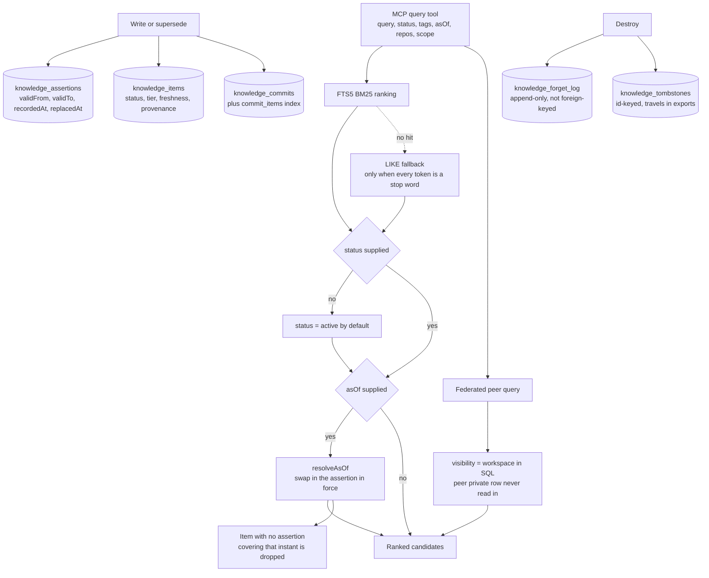

## 1. Executive Summary

Knowl is an Apache-2.0 knowledge store for coding agents — 65,422 lines of
TypeScript in `src` against 74,258 lines in `tests`, 442 test files, 3,686 test
cases, 1,171 commits since June 2026 — reached over 28 MCP tools or a CLI, with
one SQLite database per project.

Five marks, which is rare, and each one is visible in code *and* in a test rather
than in a schema alone.

The design claim is narrow and stated up front: when a fact is replaced, the old
one is retired instead of competing with the new one. The interesting part is
that the repository carries the evidence for it, as a committed ablation in
MemoryAgentBench's own harness — a supersession-on run and a supersession-off run
over the same 100 questions.

And the file that explains those runs contains the single best sentence about
measurement in this corpus. On why the losing arm is kept forever:

> **Published ablation, OFF arm.** Doubles as the control: if this stops looking
> bad, the metric has broken rather than the product improved.

That is a negative control aimed at the *instrument* rather than at the system.
Almost every project here that measures itself keeps only the number that
flatters it; this one keeps the number that must stay ugly, and says what its
staying ugly is evidence of.

The same file tells a reader how to misread it — *"Compare the `retrieval`,
`embedding` and `supersede` fields, not the filenames"* — and records a
regression the project reported against itself and then withdrew, because the two
runs differed by code state rather than by retrieval mode. *"There was no
regression."*

## 2. Mental Model

An atom is a claim with a lifecycle, and the schema's discipline is that the
lifecycle is not one column pretending to be four.

- `status` — `active | deprecated | rejected | archived | superseded` — decides
  whether an ordinary read may return it.
- `freshness` — `fresh | stale | needs_review` — is what an automatic drift check
  flips when the files an item cites move.
- `confidence` is a number.
- `tier` — `asserted | verified` — is standing earned by confirmed use, with
  `tierSince` recording when the current tier began so a reset restarts the climb.
- `provenance` — `observed | user_stated | inferred` — is where it came from.

Beneath the atom sits `knowledge_assertions`, which is where the temporal work
happens: an atom's *current text* lives on the row, and the history of what it
said and when lives in assertions carrying both a validity interval and a record
interval.

Scope is two-level and physical as well as logical: one database per project,
and within a workspace an atom is either `repo`-private or `workspace`-visible,
with the visibility predicate applied in SQL on the cross-repo path.

## 3. Architecture



## 4. Essential Implementation Paths

- **Read.** `queryKnowledgeCandidates` runs FTS5 first and returns its candidates;
  the `LIKE` fallback below it carries a measurement of when it is actually
  reached, and a correction of a previous comment that claimed otherwise. The
  status default is the `else` branch of one `if`
  (`src/store/queries.ts:152-230`).
- **As-of.** `resolveAsOf` maps each candidate through
  `findAssertionAsOf(item.id, asOf)` and substitutes the historical content and
  confidence, dropping candidates with no assertion covering that instant
  (`queries.ts:269-282`, `assertions.ts:43-51`).
- **Supersede.** `replaceCurrentAssertion` finds the open assertion, stamps
  `validTo` and `replacedAt` on it, and inserts the successor — in one
  client-level transaction (`assertions.ts:25-36`).
- **Cross-repo.** `listWorkspaceVisibleSkillItems` and `queryFederated` put
  `visibility = 'workspace'` in the SQL, deliberately as a sibling of the
  index-scoped local function rather than an option on it, so a peer database is
  never opened on the mid-turn path (`repository.ts:582-605`).
- **Destroy.** `deleteKnowledgeItem` reads the row first, deletes it, writes the
  forget-log entry and records the id-keyed tombstone
  (`repository.ts:671-700`).

## 5. Memory Data Model

`knowledge_items` is the densest schema this atlas has read that still explains
itself, and the comments are about *fingerprint membership* — which is the
question most schemas leave implicit.

Two hashes, not one:

> Fingerprint of the fields that decide lifecycle rather than content: status,
> freshness, supersession, owner, visibility. Separate from `content_hash`
> because the two diverge independently, and an import classifying on content
> alone skipped every lifecycle change.

And a field deliberately *outside* that fingerprint, with the reasoning:

> Authorship is a fact about how the row came to exist and never changes after
> the write; the lifecycle fingerprint tracks what an import or a sync has to
> reconcile, and including a field that cannot diverge would make every atom
> written across repos look changed to a peer that has the same one.

`lastDriftAt` carries the other half of the same discipline — a column that is
explicitly *not* a ranking input: *"this column is read by nothing at retrieval
time, so it costs no ranking of its own."* A schema that says which of its columns
the ranker may not see is doing something most do not.

`knowledge_assertions` is the bitemporal table: `validFrom` and `validTo` for the
world, `recordedAt` and `replacedAt` for the store, with an index for each axis.
An item may have at most one open assertion — `createCurrentAssertion` throws if
one exists — so the valid-time line is a chain rather than a set.

## 6. Retrieval Mechanics

The default read returns only `active` items. That is the whole of the
`trust_state` mark and it is one line, which is the point: a five-value status is
worth nothing unless a read consults it, and here the consulting is the default
rather than an option a caller has to remember.

The as-of path is the part worth studying. An `asOf` query does not select
differently; it takes the same ranked candidates and resolves each one through
its assertion history. The comment explains why, and names the bug that taught
them:

> An `asOf` query used to compute these and throw them away, dropping to the
> whole-phrase LIKE below — so "auth token expire" missed "Auth token TTL is
> fifteen minutes", one filler word from a match... Historical resolution is a
> filter over the same candidates, not a reason to select them differently.

That is the correct architecture for time travel over a ranked store, stated
crisply, and arrived at by using the feature rather than by reasoning about it.

The federated path applies its predicate in SQL, and the comment is explicit that
this is about what enters the process, not about what is shown: *"a peer's
repo-private row is never read into this process at all."* A filter applied after
a fetch protects a response; a filter in the query protects the process.

## 7. Write Mechanics

Supersession happens at write time, decided by a `conflictKey` with a
`conflictScope` and a `conflictExclusive` flag on the atom. When the store is not
confident that a new fact replaces an old one, the README says it leaves both
active and hands the user a `knowl supersede` command — a deferral to a person
rather than a guess, which is the right default for an operation whose failure
mode is deleting a true claim.

Destruction is where the design is most careful, and the reasoning is in
`forget-log.ts`:

> GC computes a precise reason per candidate — "State item stale for 47 days and
> never retrieved" — reports it in the run result, and then drops it: the
> tombstone was written with the hardcoded literal `'purged'`, so every purge in
> the store said the same word. The deciding numbers existed for the length of one
> function call. That makes a collection policy unfalsifiable after the fact.

So the forget log exists to make the collector's own policy testable against what
it did. The separation from the tombstone is argued rather than assumed: the
tombstone travels in exports and is merged by a monotonic upsert, so putting
usage numbers there would push local retrieval telemetry into every export and
let a peer's import overwrite this machine's audit trail *"with its own — or with
nulls."* Two records, one portable and one local, because they answer different
questions and have different threat models.

`tombstone` is nonetheless withheld. `knowledge_tombstones` is keyed on the item
id — its job is to stop an import resurrecting a deleted row — so the same
content written again under a fresh id meets no record of its own rejection. It
is the most legitimate id-keyed deletion marker in the corpus and it is still not
a value-keyed one.

## 8. Agent Integration

28 MCP tools, and the tool surface is costed: a note explains that fetch-by-id is
a parameter rather than a thirty-first tool because *"the tool list already costs
~6,700 tokens per session."* The same note gives the reason the parameter exists
at all — 262 atoms on a real store exceed the content ceiling, and
*"truncation with no way to read the rest is not disclosure, it is loss with a
warning label."*

The workspace surface tells an agent what it may reach without quoting it: the
session card names the linked repos and says their workspace-visible knowledge is
searchable, with `repos` as the filter. Naming the peers without their content is
a deliberate middle ground between hiding the workspace and spending context on
it.

## 9. Reliability, Safety, and Trust

The measurement discipline is the reason this report runs long, so it is worth
laying out what is actually committed and what the headline compresses.

The README's claim is *"Turn that off and retrieval drops from 98% to 47%"*, and
both numbers are in the tree: `cr-sh-6k-supersede-on.json` reports a top-one
accuracy of 0.98 with 2 stale leaks, `cr-sh-6k-supersede-off.json` reports 0.47
with 62. The claim is real and checkable, which already puts it ahead of most
performance claims this atlas reads.

What the headline compresses is which slice it is. Reading all four ablation
pairs in the directory:

| Instance | supersede on | supersede off | stale leaks on → off |
|---|---|---|---|
| single-hop 6k | 0.98 | 0.47 | 2 → 62 |
| single-hop 262k | 0.87 | 0.42 | 5 → 28 |
| multi-hop 6k | 0.00 | 0.00 | 0 → 29 |
| multi-hop 262k | 0.02 | 0.01 | 0 → 1 |

The published figure is the best of the four. At 262k the same ablation is 87 to
42, and on the multi-hop instances top-one accuracy is at or near zero in *both*
arms — the mechanism cannot rescue a question type the retrieval does not answer.
The repository does not hide this: the scaling section of the results README
walks the corpus sizes and the files are all committed under names that say what
they are.

And the effect that holds across every pair is not accuracy, it is stale leaks:
62 → 2, 28 → 5, 29 → 0, 1 → 0. Supersession's robust, measured contribution is
that fewer retired facts come back, including on the instances where nothing
improves the answer. That is the more defensible version of the claim and it is
the one the data supports everywhere.

Three more things in that results README deserve copying:

- **A stated misreading trap.** *"A filename says what the run was *for*; only
  those fields say what it actually did."*
- **A withdrawn regression.** A run's 26 stale leaks were read as a regression
  against 3 until someone noticed it predated the flag. *"There was no
  regression."*
- **A rule about arithmetic across runs.** The default embedding preset changed on
  a known date and moved two instances *in opposite directions from each other*,
  so: *"Never subtract across two runs whose `embedding` differs or is absent."*

Alongside this sits `benchmarks/accuracy/preregistration.json`, dated
2026-07-13, declaring the protocol's objective, what is in scope, and — unusually
— what is excluded from the leaderboard: latency, throughput, RAM, storage size,
token usage, cost and setup effort. Preregistering what you will *not* claim
credit for is a practice this corpus has not seen before.

The test suite carries more lines than the source, and the mutation-testing
configuration is honest about its own limits: sixteen suites that assert against a
built bundle are excluded from mutation runs because nothing rebuilds the bundle
between mutants, so *"their exclusion is not a shortcut — it is the measured
reason mutation scores for this repo must be read as covering the in-process
surface only."*

`human_review` is withheld. The `knowl supersede` hand-off is a person deciding a
conflict the store would not guess at, which is close — but no field records who
decided, and the `tier` promotion to `verified` is earned by counted confirmations
rather than by an approver.

## 10. Tests, Evals, and Benchmarks

442 test files, 3,686 cases, and 74,258 lines of test code against 65,422 of
source; nothing was run here. The workspace suites are the ones that matter for
the marks, and they are built as small real stores — two project directories, a
manifest, two repos joined to a workspace — rather than as mocks, which is why
the private-row exclusion is a meaningful assertion rather than a check on a stub.

The federated suite also pins the contracts around the exclusion: a named repo
holding nothing returns an empty array under its own key rather than an empty
object, *"asking about `b` by name and getting `{}` back cannot be told apart from
asking and getting no response at all"*; a repo name that matches nothing is
reported rather than quietly not searched; an absent peer is reported rather than
swallowed; and the peer database is asserted byte-identical after the query.

Two benchmark harnesses are committed with their data and results — the
MemoryAgentBench conflict-resolution instances, and an accuracy protocol with a
preregistration and a `systems.lock.json`.

## 11. For Your Own Build

- **Keep the losing arm, and say what its losing proves.** An ablation's off arm
  retained as a permanent control turns a marketing number into a regression test
  on the instrument: if the bad arm stops looking bad, the metric broke.
- **Write down how to misread your own results.** Filenames drift from what a run
  did. A results log that names the three fields that actually identify a run —
  and forbids subtracting across runs that differ in them — prevents the
  comparison that produces a phantom regression.
- **Resolve history as a filter over the same candidates.** Selecting differently
  for an as-of query means the historical path silently uses a worse matcher, and
  nobody notices because the results look plausible.
- **Split the record that travels from the record that stays.** One is merged by
  peers and must be small and monotonic; the other is local audit and must be
  complete. Merging them lets an import overwrite your own history with nulls.
- **Say which columns the ranker may not read.** A drift timestamp that exists for
  promotion and is explicitly absent from retrieval cannot accidentally become a
  ranking signal in someone's next patch.
- **Two hashes when two things diverge independently.** Classifying an import on
  content alone skipped every lifecycle change here; the fix was a second
  fingerprint over exactly the fields that decide lifecycle.

## 12. Open Questions

- Multi-hop top-one accuracy is at or near zero in both ablation arms. Is that a
  property of the benchmark instance, the retriever, or the atom granularity?
- The tombstone that travels is id-keyed. Is a content-keyed record of a rejected
  claim wanted, or is re-asserting a retired fact considered legitimate?
- `knowl supersede` hands a conflict to a person. Would recording who resolved it
  — and when — be useful for the same falsifiability reason the forget log exists?

## Appendix: File Index

- Schema: `src/store/schema.ts:4-73` (`knowledge_items`, the two hashes, the
  `writtenBy` note, `lastDriftAt`), `:75-93` (commits and the commit-items index),
  `:95-105` (assertions), `:108-130` (evidence), `:139-153` (`knowledge_access`),
  `:283-305` (cloud publish gate and the never-publish list).
- Queries: `src/store/queries.ts:143-230` (the status default, the visibility
  filter, the measured LIKE fallback), `:269-282` (`resolveAsOf`).
- Assertions: `src/store/assertions.ts` — `createCurrentAssertion` (14-22),
  `replaceCurrentAssertion` (24-36), `findAssertionAsOf` (43-51).
- Repository: `src/store/repository.ts:582-605` (workspace-visible SQL),
  `:609-651` (`createKnowledgeCommit`), `:671-700` (delete, forget log,
  tombstone).
- Forget log and tombstones: `src/store/forget-log.ts:1-40`,
  `src/store/tombstones.ts`.
- MCP: `src/mcp/tools.ts:804-936` (fetch-by-id, `asOf`), `:606-613` (the workspace
  card).
- Benchmarks: `benchmarks/memoryagentbench/results/README.md` (the misreading
  trap, the withdrawn regression, the embedding rule, the ablation table),
  `results/cr-sh-6k-supersede-{on,off}.json`,
  `results/cr-sh-262k-supersede-{on,off}.json`,
  `results/cr-mh-6k-supersede-{on,off}.json`,
  `benchmarks/accuracy/preregistration.json`.
- Tests: `tests/workspace/federated-query.test.ts:102-160`,
  `tests/workspace/federated-scope.test.ts:90-150`,
  `vitest.mutation.config.ts:5-25`.

**Searches recorded for the negative claims**

```sh
python3 - <<'PY'   # every committed ablation pair, read from the result files
import json,glob,os
for f in sorted(glob.glob('benchmarks/memoryagentbench/results/*.json')):
    d=json.load(open(f)); r=d.get('report',{})
    print(os.path.basename(f), d.get('supersede'), r.get('topOneAccuracy'), r.get('staleLeaks'))
PY
grep -rn "visibility, 'workspace')" src --include='*.ts'      # 1 — the cross-repo predicate
grep -rn "knowledge_tombstones" src --include='*.ts'          # keyed on item id; no content key anywhere
grep -rn "createKnowledgeCommit(" src --include='*.ts'        # derive, merge, promote, blast-radius, tier
grep -rn "approver\|approved_by\|reviewed_by" src --include='*.ts'   # 0 — no stored approver
```

## History

**2026-09-19** — [`9065ed1fb083cab500dc4930d92ce20fae5e9a2d`](https://github.com/dat999zx/knowl/commit/9065ed1fb083cab500dc4930d92ce20fae5e9a2d) — `trust_state` re-tested. The default branch is exactly where the record said (`src/store/queries.ts:192-197`) and it is the whole mechanism. Two things are added. The five-value vocabulary is a comment on a plain text column, not a CHECK — `src/store/schema.ts` carries no constraint anywhere — so nothing stops a sixth value being written. What saves that is the polarity of the default: because the else branch tests equality with `active` rather than excluding a denylist, an unexpected value is withheld instead of admitted. The same argument inspeximus reached after a bug, arrived at here by the shape of the construction. And the standing axis is auditable in a way the record did not say: promotion and demotion are each written as a knowledge commit carrying before and after images (`src/store/tier.ts:56-58`, `:66-68`), not a silent field update — the discipline osiris applies to `set_status`. Promotion requires confirmed useful feedback, a tier that is not already verified, and `confirmedDaysSinceTierBegan` clearing a threshold measured from `tierSince`, which is what makes the reset claim true rather than aspirational. Screened again first; nothing was installed and no suite was run.

**2026-09-17** — [`f2252db376fb42f76f5795b3e38d89ed9970a080`](https://github.com/dat999zx/knowl/commit/f2252db376fb42f76f5795b3e38d89ed9970a080)
— first reading, at the head of `main`, 1,171 commits in. Screened with
`scripts/screen_repo.py` first: three auto-run surfaces, one build-time execution
path, 32 floating dependency ranges behind a committed lockfile, four files
changed inside the seven-day cooldown, and `CLAUDE.md` read as data. Nothing was
installed, built or run — no npm, no vitest, no benchmark executed; the committed
result files were read as data. Five marks. `tombstone` is withheld with the
mechanism present and well argued: `knowledge_tombstones` is keyed on the item id
so an import cannot resurrect a deleted row, which is a different guarantee from a
record keyed on the value. `human_review` is withheld because the `knowl
supersede` hand-off records no decider and the `verified` tier is earned by
counted confirmations rather than granted by a person. The published 98-to-47
ablation figure was checked against the committed runs and is the single-hop 6k
pair; the same ablation at 262k is 87 to 42, and both multi-hop pairs sit at or
near zero top-one accuracy in both arms, while the stale-leak reduction holds
across all four.
