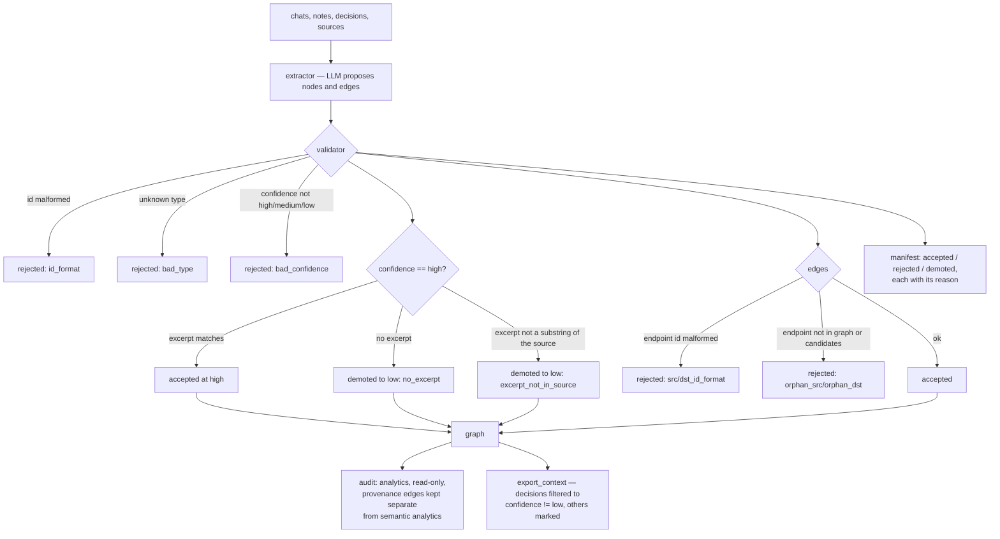

## 1. Executive Summary

knowledge-worker builds "a personal knowledge graph that survives between AI
conversations" — local, user-centred rather than conversation-centred, and
**"provenance-or-bust"**.

**That phrase is a code comment above a real check.**
`mygraph/validator.py`:

```python
# provenance-or-bust: high → must have excerpt + must substring-match source
excerpt = (node.get("excerpt") or "").strip()
if node["confidence"] == "high":
    if not excerpt:
        node["confidence"] = "low"
        manifest.demoted_nodes.append((node, "no_excerpt"))
    elif _norm(excerpt) not in src_norm:
        node["confidence"] = "low"
        manifest.demoted_nodes.append((node, "excerpt_not_in_source"))
```

**This is a fabricated-quote detector.** An LLM asked to extract claims with
supporting evidence will, reliably, produce claims whose supporting excerpt it
invented — paraphrased, merged from two places, or simply made up. Normalising
the excerpt and checking it is a substring of the source catches exactly that
class of failure, cheaply and deterministically, with no second model call.

**And the response is demotion, not rejection.** A claim whose excerpt does not
check out may still be true; what it is not is *evidenced*. Dropping it would
lose information; keeping it at `high` would launder an invention into the
graph. Moving it to `low` and recording why is the third option, and it is the
right one.

**Every validation pass produces a manifest** — `accepted_nodes`,
`rejected_nodes` with a reason, `demoted_nodes` with a reason, and the same for
edges — so an extraction run is auditable after the fact rather than a silent
transformation.

**And the check is not the last gate — a person is.** `ingest` runs the
validator, then hands every surviving candidate to `review()`, which prints it
and waits: accept, reject, edit, skip or quit, one node at a time. An edit goes
back through `validate()` against the same source before it can be accepted, so
the substring check runs on the human's excerpt too. Every verdict — including
the rejections and the skips — is appended to `eval_record.jsonl` with the
candidate id, the source, the extractor's confidence and the edit if there was
one. That combination, a deterministic evidence check under a per-item human
gate over an append-only record of both, is what three of this report's marks
rest on, and it is the shape most extraction pipelines in this atlas skip
entirely.

## 2. Mental Model

Chats, notes, decisions and sources are extracted into typed nodes and edges,
each carrying a confidence. A validator gates them into the graph. Analytics then
report what matters, what connects and what is weak, and a context export feeds a
filtered subset back to an AI session.



## 3. Architecture

`mygraph/` is a CLI-shaped package: `extractor` and `extractor_openai`,
`validator`, `ingest`, `merge`, `review`, `check`, `discover`, `deep_dive`,
`audit`, `memory_audit`, `eval_log`, `export_context`, `owl_io`, `viz`,
`mygraph`. Plus an `ollama_proxy/`.

The documentation set is larger than the code: `SPEC.md`, `DESIGN.md`,
`knowledge_worker_principles.md`, `AGENTS.md`, `CLAUDE.md`, plus
`docs/COMPETITIVE_ANALYSIS.md` and `docs/BENCHMARKS.md`. The README also places
the project inside a family of related repositories — a compression layer, an
interop protocol, an eval harness — and links them, which is more context than
most projects give about where they sit.

7,500 lines of Python, 8 test files.

## 4. Essential Implementation Paths

**Validate** — `mygraph/validator.py` (node checks `:85-94`, the
provenance-or-bust block `:95-102`, edge checks including orphan endpoints
`:108-127`, the manifest assembly `:129-132`).

**Export** — `mygraph/export_context.py` (the decision filter `:54-55`, the
confidence markers `:49`, `:70`, `:98`).

**Audit** — `mygraph/memory_audit.py` (the read-only, deterministic contract
`:1-11`).

## 5. Memory Data Model

Typed nodes with an id matching a regex, a type from a closed set, a confidence
in `{high, medium, low}` and an optional excerpt; typed edges with their own
closed type set and endpoints that must resolve.

**Confidence here is a genuine trust state rather than a score.** It is a
three-valued enum, it is *set by the system* on the evidence rather than reported
by the extractor and believed, and it changes what the memory is used for
(section 6). A `low` claim exists, is browsable, and is kept out of the material
an AI session sees.

The `owl_io` module means the graph imports and exports OWL, so the ontology is a
portable artifact rather than an internal convention.

## 6. Retrieval Mechanics

`export_context.py` builds the material an AI session receives, and the filter is
one line:

```python
# Decisions (high confidence only to keep it tight)
decisions = [n for n in by_type("decision") if n.get("confidence") != "low"]
```

with a `conf_marker` appended to other node types so the model sees the
confidence alongside the claim rather than having it silently applied.

**Filtering decisions but marking everything else is a defensible split.** A
decision presented to an AI as context will be acted on, so a weakly-evidenced
one should not appear; a weakly-evidenced observation is still worth seeing if
its uncertainty is visible. Whether the line belongs exactly there is arguable —
what matters is that the choice is explicit and one line, so it can be moved.

**No scope key on a read path**; the graph is one person's, local.

## 7. Write Mechanics

Extraction proposes, the validator disposes. The rejection reasons are
enumerated — `id_format`, `bad_type:<t>`, `bad_confidence`,
`src_id_format`, `dst_id_format`, `orphan_src:<id>`, `orphan_dst:<id>` — and the
demotion reasons are `no_excerpt` and `excerpt_not_in_source`.

**The orphan-edge check resolves against both the existing graph and the current
candidate set** (`ep not in g.nodes and ep not in candidate_ids`), so an edge
pointing at a node that was itself rejected in this same batch is dropped rather
than left dangling. That ordering is easy to get wrong and produces exactly the
kind of graph corruption that surfaces months later.

## 8. Agent Integration

A CLI (`mykg audit …`), an Ollama proxy, and context export as the interface to a
chat session — the model is *given* a filtered brief rather than querying the
store, which suits a graph small enough to summarise and keeps the retrieval
decision on the human's side.

## 9. Reliability, Safety, and Trust

**Trust state.** Three values, assigned by the system on evidence, demoted when
the evidence fails, and applied as a filter rather than a weight:
`export_context.py:55` builds the decision list as
`[n for n in by_type("decision") if n.get("confidence") != "low"]`, so a demoted
decision is dropped from what the next session reads.

**Human review — the gate is per node and it is the main path.** `review()` is
called from `ingest.py:140` on every ingest. Each candidate node is printed and
the person answers `[a]ccept [r]eject [e]dit [s]kip [q]uit`; `e` opens the payload
in `$EDITOR`, and the edited node is put back through `validate()` against the
source before a second accept prompt — so a person cannot hand-write an excerpt
into a high-confidence claim without the substring check running on it. Only
accepted nodes reach the graph, and an edge survives only if both its endpoints
did. `auto_accept_high` and `auto_accept_all` exist as flags; the gate is what
runs without them.

**Audit log — on the eval record, with its framing stated.** `eval_log.append`
opens `eval_record.jsonl` in append mode, stamps a UTC timestamp and writes one
line; nothing in the tree opens it any other way. What lands there is not only
checks: every review verdict with the candidate id, the source, the extractor's
confidence and the user's edit; an `extract_manifest` and an `ingest_complete`
per source; `merge_body_conflict` and `merge_edge_skipped` from the merge path.
That is a durable append-only record of what happened to the graph, which is the
mark. Two things to know about it. The module frames the file as training data —
*"the v1 corpus that v2+ will use for prompt refinement / edge weighting / RL"* —
rather than as an audit surface, and **nothing in the repository reads it**: every
reference is an append. `docs/STORAGE_DECISION.md` gives it the role explicitly,
listing JSONL as the *"append-only event stream: reviews, evals, analyzer runs,
replay logs"* beside JSON-LD as the source of truth.

**Tombstone — no, and the near-miss is one query wide.** A `reject` verdict is
written to the log with the candidate id, and the next ingest of the same source
decides what to re-offer from `_already_merged_ids`, which reads `MENTIONED_IN`
edges *in the graph*. A rejected candidate has no such edge, so it is presented
again — and the record of the person having refused it sits in a file nothing
opens. The rejection is also keyed on the candidate id rather than on the value,
which is the second reason the mark does not apply.

**Bitemporal, scope, negative eval — no.** The graph is one file per user, which
is a partition rather than a key on a record; nothing stores when a claim was
true separately from when it was written; and the committed validator case
asserts that a fabricated excerpt *is* demoted rather than that anything is kept
out of a result.

**The limit of the check is worth stating precisely.** Substring matching catches
*invention* — an excerpt that does not exist in the source. It does not catch
*misquotation in context*: a real sentence lifted from a passage that reverses
it, or a fragment that means something different in isolation. "I would never use
MongoDB for this" contains "use MongoDB for this", and a claim excerpting the
fragment passes. Catching that needs the surrounding span, not a substring test —
storing the offset rather than the text would make it possible.

The other quiet consequence: normalisation is what makes the check work across
whitespace and punctuation differences, and every normalisation loosens the test
slightly. `_norm` is where the strictness of "provenance-or-bust" is actually
set.

## 10. Tests, Evals, and Benchmarks

**71 test functions across 7 files** against 7,548 lines of Python, plus
`docs/BENCHMARKS.md` described as "the offline demo-graph checks" and an
`eval_log.py` module.

One validator branch is pinned:
`test_validation_report_records_demotions_for_bad_high_confidence_excerpt`
generates a real candidate set, rewrites one node to `high` with the excerpt
`"this excerpt is not in the source"`, and asserts an `excerpt_not_in_source`
demotion appears in the manifest. Its sibling asserts the unmodified set
validates with zero rejections, which is the positive control the first one needs.

The other branches still write themselves from the reason strings the code
emits: a node with no excerpt, one whose excerpt matches only after
normalisation, an edge to a rejected candidate, an edge to an existing node. And
nothing covers the review gate at all — no test drives `review()` with a scripted
answer sequence, so the accept/reject/edit path that decides what enters the
graph is the least-tested code with the most authority over it.

`docs/COMPETITIVE_ANALYSIS.md` positions the project in a category matrix — the
README summarises it as a "chat-to-wiki system" that "keeps reasoning local,
reviewable, and tied to literal provenance excerpts before claims become durable
graph knowledge". That sentence is an accurate description of the validator,
which is a better outcome than most competitive-analysis documents manage.

**I ran nothing.**

## 11. For Your Own Build

### Steal

- **Require an excerpt for a high-confidence claim, and check it against the
  source.** An LLM extracting evidence will invent it; a substring test catches
  the invention deterministically, with no second model call.
- **Demote rather than reject.** A claim whose evidence does not check out may
  still be true — it is not *evidenced*. Dropping it loses information, keeping
  it at high launders an invention; `low` with a reason is the third option.
- **Record the reason with the demotion.** `no_excerpt` and
  `excerpt_not_in_source` are different failures and want different fixes.
- **Return a manifest from every validation pass.** Accepted, rejected and
  demoted, each with its reason, turns extraction from a silent transformation
  into an auditable one.
- **Enumerate rejection reasons as strings.** `bad_type:<t>`, `orphan_src:<id>` —
  they document the contract and give tests an assertion target.
- **Resolve edge endpoints against existing nodes *and* the current candidate
  set.** An edge to a node rejected in the same batch must go too, and getting
  the ordering wrong produces dangling references that surface much later.
- **Filter what the model is given, mark what it sees.** Decisions gated on
  confidence, other nodes annotated with theirs, in one readable line.
- **Keep provenance edges out of the semantic analytics.** Counting a
  "supported-by" edge as a conceptual connection inflates every centrality
  measure in the graph.

### Avoid

- **Do not mistake substring matching for quotation checking.** It catches
  invention, not a real fragment lifted from a passage that reverses it. Storing
  the source offset instead of the text would let you check the surrounding
  span.
- **Do not leave the validator untested.** It is the component that decides what
  becomes durable knowledge, its branches are enumerable, and it already returns
  the exact object a test would assert on.

### Fit

A good fit for someone who wants a reviewable personal graph rather than an
automatic memory — the export-a-brief model keeps the human in the retrieval
decision, and OWL import/export means the graph is not trapped.

`mygraph/validator.py` is worth reading whatever you build. Forty lines that
decide what an LLM is allowed to make durable, with every rejection and demotion
named.

## 12. Open Questions

- **What does `_norm` normalise?** It sets the actual strictness of the
  provenance check.
- **Does `review.py` surface the demoted set?** That is the natural place for a
  human pass over weak claims.
- **Are medium-confidence claims ever promoted?** Demotion is implemented; the
  reverse path was not found.
- **What is in `docs/BENCHMARKS.md`'s demo-graph checks?** Described as offline;
  results were not read.

## Appendix: File Index

**Validator** — `mygraph/validator.py` (node id, type and confidence checks
`:85-94`, the provenance-or-bust block with both demotion reasons `:95-102`,
candidate tracking `:103-106`, edge type and confidence checks `:108-116`,
endpoint format and orphan checks `:117-127`, the returned manifest `:129-132`)

**Export** — `mygraph/export_context.py` (confidence markers `:49`, `:70`, `:98`,
the decision filter `:54-55`)

**Analytics** — `mygraph/memory_audit.py` (the read-only deterministic contract
and the provenance/semantic separation `:1-11`), `mygraph/audit.py`,
`mygraph/eval_log.py`

**Pipeline** — `mygraph/extractor.py`, `extractor_openai.py`, `ingest.py`,
`merge.py`, `review.py`, `check.py`, `discover.py`, `deep_dive.py`,
`owl_io.py`, `viz.py`, `ollama_proxy/`

**Review and the log** — `mygraph/review.py` (the per-node prompt `:113-137`, the
editor path and its re-validation `:118-131`, the verdict records `:134-138`, the
append loop `:147-148`), `mygraph/eval_log.py` (`append` `:24-27`),
`mygraph/ingest.py:140` (the one caller of `review`)

**Documentation** — `SPEC.md`, `DESIGN.md`, `knowledge_worker_principles.md`,
`docs/COMPETITIVE_ANALYSIS.md`, `docs/BENCHMARKS.md`, `docs/STORAGE_DECISION.md`

## Appendix: Recorded Searches

Run from the root of the checkout at the pinned commit.

| Claim | Command | Result at this pin |
| --- | --- | --- |
| The review gate is on the main path | `grep -rn "review(" --include="*.py" mygraph` | One caller, `ingest.py:140` |
| The eval record is append-only | `grep -rn "EVAL_LOG\|eval_record.jsonl" --include="*.py" mygraph` | Every open is mode `"a"`; no read anywhere |
| Nothing consults a rejection before re-offering | read `_already_merged_ids` at `mygraph/review.py:67-75` | It reads `MENTIONED_IN` edges in the graph, which a rejected candidate never gets |
| No validity time separate from record time | `grep -rniE "valid_from\|valid_to\|as_of\|observed_at" --include="*.py" mygraph` | Nothing |
| Test tree size | `grep -rc "def test_" tests/*.py` summed | 71 functions across 7 files, over 7,548 lines of Python |

## History

**2026-09-11** — [`bbb46379be2a8c45b20627fba30ffb8c98d1adc1`](https://github.com/rahulmranga/knowledge-worker/commit/bbb46379be2a8c45b20627fba30ffb8c98d1adc1) — re-read, 22 files and 1,777 insertions past the previous pin in a single commit, most of it documentation and an example graph. **Two marks added, both first-reading misses rather than upstream changes.** The first reading said *"tombstone, bitemporal, scope, human review, negative eval — no, though `review.py` exists and a human-in-the-loop review step is the natural home for the demoted set"* — the file was listed in the appendix and never opened. `review()` is called from `ingest.py:140` on every ingest, prints each candidate node, and waits for accept, reject, edit, skip or quit; an edit is put back through `validate()` against the source before a second prompt, and only accepted nodes reach the graph. That is `human_review`. `audit_log` was withheld on the reasoning that the manifest is per-run and `memory_audit.py` is analytics — both true, and both beside the point, because `eval_log.append` writes `eval_record.jsonl` in append mode with every review verdict, extract manifest, ingest completion, merge conflict and skipped edge. Its two limits are stated in the report: the module frames the file as an RL corpus rather than an audit surface, and nothing in the tree reads it. `tombstone` stays withheld and the near-miss is now precise: a `reject` verdict is recorded, and the next ingest of the same source decides what to re-offer from `MENTIONED_IN` edges in the graph, which a rejected candidate never acquired. **The store changed format**: JSON-LD is the canonical local graph as of v0.8.0, with a published context vocabulary and a `docs/STORAGE_DECISION.md` naming JSONL as the append-only event layer beside it. Validator and export line numbers re-verified unchanged. Test tree 71 functions across 7 files; nothing covers `review()`. Screened before reading: four dependency manifests inside the cooldown, seven unpinned ranges, and two agent-instruction files read as data; nothing was installed or run.


**2026-08-09** — [`1d94dedf12a0a7a3623ee21d0ac0d773cf4ce858`](https://github.com/rahulmranga/knowledge-worker/commit/1d94dedf12a0a7a3623ee21d0ac0d773cf4ce858) — first reading. Screened before reading; the tree was read, never installed, and no check was run.
