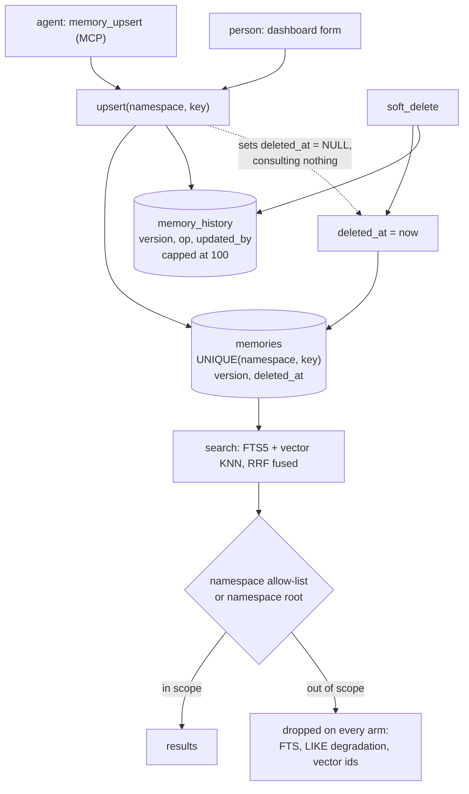

## 1. Executive Summary

kube-coder is a Helm chart that turns a Kubernetes cluster into a fleet of
browser-reachable dev workspaces — code-server, a persistent tmux, an in-pod
browser, and pluggable coding agents, one pod per developer. MIT, 752 commits.
Most of it is infrastructure. The part this atlas reads is
`charts/workspace/memory/` — 3,101 lines of Python plus a 575-line MCP server,
covered by 223 test cases across nine test files.

**One SQLite file per workspace, two entry points.** The dashboard reaches it
over HTTP on the pod; Claude reaches it through an MCP stdio server spawned per
session. WAL mode and `BEGIN IMMEDIATE` retries keep the two writers safe. The
file lives on the pod's persistent volume, so memory survives tab closes and pod
restarts.

**The scope enforcement is the reason to read this report.** A row is keyed
`UNIQUE(namespace, key)`, and `search` is a hybrid — FTS5 always, fused by
normalized reciprocal-rank with a `sqlite-vec` KNN pass when the extension and an
embedding provider are both present. The namespace filter is applied to **every**
arm, and the docstring says why: the allow-list and the namespace root are
enforced on the FTS pass, on the LIKE degradation, and on the vector-only ids
loaded by `_fetch_by_ids`, *"so a high-scoring out-of-scope memory can never be
fused back in."*

That is the failure mode a hybrid retriever invites — scope the arm you thought
about, fuse the one you did not — and it is named and closed here rather than
discovered later.

**The injection position is considered rather than default.** Three modes exist.
On-demand `memory_*` MCP calls are the supported default. Task creation can
prefix the top-K (default 8) most relevant memories, with a per-task *"Don't
inject memories"* toggle that force-disables it. And a `UserPromptSubmit` hook
that prepended a block to *every* prompt still ships — **disabled**, with
`seed_claude_config.py` stripping the entry from `settings.json` on every boot,
kept only for anyone who wants to wire it manually. A project that built
automatic injection, retired it, and then actively removes it on each start has
taken a position most systems here leave implicit.

**Four of seven marks**, and the one that is missing matters most. `soft_delete`
sets `deleted_at` and appends a history row recording the removal. `upsert` on
the same `(namespace, key)` sets `deleted_at=NULL`. So a deleted memory is
revived by writing it again, and the audit trail that already records the
deletion is not consulted on the way in.

## 2. Mental Model

A memory is a value under a key inside a namespace. It is written by an agent
tool call or by a person in the dashboard, versioned on every change, and read
back by a hybrid search that will not cross the namespace boundary the caller
was given. Nothing decays, nothing consolidates, nothing rewrites it in the
background.

The shape worth drawing is the loop between deletion and re-assertion, because
every other part of the lifecycle is recorded and this one is not consulted.

## 3. Architecture

Nothing new runs for memory: it is a SQLite file at
`/home/dev/.claude-memory/memory.db` on the workspace's PVC, an MCP server
started by `claude` per session, and a handful of routes on the pod's existing
HTTP server. The `memory/` Python package is imported by both.

The operator cost is the workspace, not the memory — one namespace, ingress, TLS
certificate, PVC and OAuth allowlist per developer, all from the chart.

## 4. Essential Implementation Paths

- **Write.** `MemoryManager.upsert` validates namespace, key, value, tags and
  kind, clamps `importance` and `confidence`, summarizes long values once into a
  derived column, inserts or updates, bumps `version`, appends to
  `memory_history`, and prunes that history to the last 100 versions.
- **Delete.** `soft_delete` sets `deleted_at` and appends a history row.
- **Read.** `search` runs FTS5, optionally a vector KNN, fuses by normalized RRF,
  and applies the namespace predicate on each arm.
- **Inject.** `top_for_prompt` picks the top-K and `format_injection_block`
  renders `<workspace_memories>`, used only when a task opts in.
- **Relate.** `link` / `unlink` / `relations` / `neighbors` maintain a graph over
  memories, surfaced in the dashboard.

## 5. Memory Data Model

`memories` carries namespace, key, value, a derived summary, kind, tags,
`importance`, `confidence`, source, `created_at`, `updated_at`,
`last_accessed_at`, `access_count`, a monotonic `version`, `expires_at` and
`deleted_at`, unique on `(namespace, key)`.

`memory_history` carries `memory_id`, `version`, the value, tags, importance,
confidence, `updated_at`, **`updated_by`** and **`op`** — a per-memory mutation
log with the operation and the actor. That earns `audit_log`, with one property
stated rather than glossed: `_prune_history` keeps the newest
`HISTORY_CAP_PER_MEMORY = 100` versions per memory and deletes the rest, so the
record is bounded rather than append-only forever.

There is no epistemic status. `confidence` is a float used in ranking, `kind` is
a taxonomy (`semantic` by default), and no value of either withholds a row from
being returned. `expires_at` is a TTL, and there is no validity time separate
from record time — the history gives versions of the record, not the period a
claim was true, so `bitemporal` is withheld.

## 6. Retrieval Mechanics

FTS5 always runs. When `sqlite-vec`, the `vec_memories` table and an embedding
provider are all present, a vector KNN pass is fused with the FTS results by
normalized reciprocal-rank fusion; when any is missing the method *"degrades to
the Phase-1 FTS-only ranking with identical output"* — a stated equivalence,
which is more than most optional-vector designs offer.

**The scope logic is the strongest thing in this report and it is worth stating
precisely.** `namespaces` is an exact-match allow-list. `namespace_scope` is a
namespace *root* that also matches everything nested under it, plus
`ALWAYS_IN_SCOPE_ROOTS = ('user',)` — so a project-scoped chat can still reach
`user.name`. Relevance leads the ranking; the caller's own scope only wins
**ties** against the always-included roots.

Both are applied on every retrieval path. The docstring names all three: the FTS
pass, the LIKE degradation, and the vector-only hits loaded by `_fetch_by_ids`.
The reason is the one that catches people: in a fused retriever, a filter applied
to one arm is not applied to the result.

## 7. Write Mechanics

Synchronous and explicit. Nothing extracts memories from a conversation, and no
background pass rewrites the store; an embeddings worker drains a pending queue,
and that is the only asynchronous work.

Write-time summarization is a small good decision: a long value is condensed
**once**, at write, into a derived column, *"instead of hard-cutting the value
mid-sentence on every prompt"*, and the original is stored untouched. It is
best-effort by construction — the summarizer swallows failures and returns
`None`, and a NULL summary simply means readers fall back to the full value.

## 8. Agent Integration

`memory_*` tools over MCP stdio, registered in `~/.claude.json` by the pod's
entrypoint alongside `playwright` and `sequential-thinking`. The dashboard's
Memory tab is the human surface: a create/edit form over the same rows, a
relation graph, per-relation unlink scoped to the source, and an import drawer.
That is an editing surface rather than an approval queue — nothing is held
pending a decision — and it earns `human_review` on the "adjudicates after it
takes effect" half of the definition.

## 9. Reliability, Safety, and Trust

Concurrency is handled deliberately: WAL plus `BEGIN IMMEDIATE` retries for two
writers on one file, and a schema-repair step that re-asserts an index shape at
open rather than inside a numbered migration, with the reasoning committed —
version-gating it would skip exactly the databases left broken by an intermediate
build, *"and that database is exactly the one that needs healing."* Re-asserting
an invariant at open instead of once at migration is a pattern worth borrowing.

The gap is deletion. `soft_delete` records the removal in history with an `op`
and an actor, and `upsert` clears `deleted_at` without reading it. The store
therefore knows a value was deleted and does not use that knowledge when the same
key is written again — the record-keyed deletion this atlas's
[rejected-value tombstone](../../patterns/rejected-value-tombstone/) page exists
to distinguish from a value-keyed one. Here it is one step from being closed,
because the history row already exists and is already keyed to the memory.

Note also that identity is `(namespace, key)`, not content: a corrected fact
written under a *different* key coexists with the old one, and nothing detects
the contradiction.

## 10. Tests, Evals, and Benchmarks

223 test cases across nine memory test files: scope, lifecycle, the MCP surface,
the pending embeddings queue, rollback compatibility, summarization, and the DB
path. There is no paper. The repository links an external
`kubecoder-bench` for aider-polyglot coding scores, which measures the agent
rather than the memory; no memory evaluation is committed here.

**`memory_scope_test.py` is a genuine negative retrieval suite and an adversarial
one.** Beyond asserting that a sibling project is out of scope and that scoped
injection excludes other projects, it attacks the escapes: a namespace that
*shares a prefix* with the scoped root must not match, a scope containing SQL
`LIKE` wildcards must be escaped, and a literal underscore must stay literal.
Then it asserts the same boundary separately on the LIKE degradation path and on
the vector-only hits, and that a user scope is *"not widened back out"*.

Testing the wildcard-escaping of your own scope predicate is rare. Most negative
suites in this corpus assert the happy-path boundary and stop.

I did not run the suite.

## 11. For Your Own Build

### Steal

- **Apply the scope predicate to every arm of a fused retriever, and name them.**
  FTS, the fallback, and the vector ids are three code paths; a filter on one is
  not a filter on the result. The docstring here lists all three, which is how
  the next person keeps it true.
- **Attack your own scope key in tests.** Prefix-sharing siblings, `LIKE`
  wildcards, a literal underscore. A scope filter fails at its escapes, not at
  its centre.
- **Let relevance lead and scope break ties.** A project-scoped question that
  needs `user.name` should still reach it; making the caller's scope win only
  *ties* against always-included roots is a cheap, legible rule.
- **Summarize at write, once.** A derived column beats truncating a value
  mid-sentence on every prompt, and a NULL summary falling back to the full value
  makes the summarizer safe to fail.
- **Re-assert schema invariants at open, not in a numbered migration.** A
  database left at an intermediate version skips the migration that would fix it,
  which is exactly the one that needs fixing.
- **Ship the injection hook disabled if you have decided against it.** Keeping
  the script and stripping the config entry on every boot states the position and
  still lets someone opt in.

### Avoid

- **An upsert that clears the deletion flag it wrote.** `deleted_at=NULL` on
  re-write makes deletion a suggestion. The history row recording the delete is
  already there; consulting it is the difference between a soft delete and a
  refusal.
- **A bounded audit used as an unbounded one.** 100 versions per memory is a
  sensible cap, and it means "why does it believe this" has a horizon. Say which
  it is before relying on it.
- **Identity on `(namespace, key)` with no contradiction detection.** The same
  fact under two keys is two live memories, and nothing notices.

### Fit

Take the retrieval layer if you are building anything that fuses a lexical and a
vector arm behind a tenant or project boundary. The scope handling and its tests
are the most careful treatment of that specific problem in this corpus, and they
are ~3,100 readable lines against SQLite with no service to run.

Walk away if you need correction that binds, an epistemic state, or validity
time — none is present, and the deletion behaviour would surprise anyone who
assumed a soft delete stays deleted. And take the whole thing only if you want
the workspace platform around it: this memory is a per-pod component, not a
library you would vendor on its own.

## 12. Open Questions

- `soft_delete` already writes a history row with an `op`. What is the intended
  behaviour when the same key is upserted afterwards — is the revival deliberate,
  and if so is it documented anywhere a user of the dashboard would see?
- The history cap is 100 versions per memory. What is the intended answer to
  "who changed this and why" for a memory edited more than a hundred times?
- Identity is `(namespace, key)`. What stops the same fact being written under
  two keys, and is that a case anyone has hit?
- The per-prompt injection hook was built and retired. What was measured or
  observed that decided it, and is the top-K-at-task-creation path measured
  against no injection at all?
- `ALWAYS_IN_SCOPE_ROOTS` is `('user',)`. What happens to a shared workspace where
  two people's memories would both want that root?

## Appendix: File Index

**Memory**
- `charts/workspace/memory/store.py` — schema, migrations, the index-shape repair
  re-asserted at open
- `charts/workspace/memory/manager.py` — `upsert`, `update_partial`,
  `soft_delete`, `search`, the scope predicate, `top_for_prompt`, the relation
  graph, `_prune_history`
- `charts/workspace/memory/embeddings.py`, `embeddings_worker.py`, `sync.py`,
  `summarize.py`
- `charts/workspace/mcp_memory.py` — the stdio MCP server
- `charts/workspace/memory_inject_hook.py` — the per-prompt hook that ships
  disabled

**Surfaces**
- `charts/workspace/web/src/routes/memory/` — the dashboard tab and relation
  graph
- `docs/persistent-memory.md` — the subsystem's own documentation, accurate
  against the code read here

**Tests**
- `charts/workspace/tests/memory_scope_test.py` — the negative suite, including
  the wildcard and prefix-sibling cases
- `charts/workspace/tests/memory_lifecycle_test.py`, `mcp_memory_test.py`,
  `memory_pending_queue_test.py`, `memory_rollback_compat_test.py` and four more

## History

**2026-08-16** — [`1a9008facf0776165c26ff8ba80ceff999b4504c`](https://github.com/imran31415/kube-coder/commit/1a9008facf0776165c26ff8ba80ceff999b4504c) — First reading, at 752 commits. Screened first: 0 auto-run surfaces, 1 build-time execution path (`Makefile`), 6 manifests inside the seven-day cooldown; nothing was installed, built or run. Four marks — `scope_enforced`, `audit_log`, `human_review`, `negative_eval`. Three withheld and stated in place: no epistemic status (`confidence` is a ranking float), no validity time separate from record time, and no rejected-value tombstone — `soft_delete` writes the removal into `memory_history` and `upsert` sets `deleted_at=NULL` without consulting it, so re-writing the same `(namespace, key)` revives a deleted memory. No paper; the linked `kubecoder-bench` measures the agent rather than the memory.
