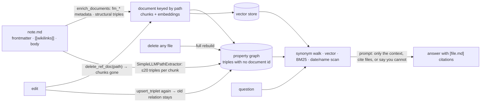

## 1. Executive Summary

Kwipu is a local Graph RAG over a folder of Markdown notes, built for an
Obsidian vault and indifferent to whether it is one. MIT; 22 commits between
21 April and 18 May 2026 by two authors, nothing since; 1,273 lines in
`geode_graph.py`, 436 in `lang_config.py`, 99 in `kwipu_mcp_server.py`;
Python 3.11 on LlamaIndex with Ollama for both the generation and the
embedding model. The screen found no auto-run surface and one unpinned
manifest — six requirements with no version at all — and nothing was
installed or run.

The memory is a LlamaIndex `PropertyGraphIndex` persisted to
`storage_graph/` (`geode_graph.py:91`). A note becomes a document keyed by
its path, its frontmatter becomes `fm_*` metadata, and three kinds of triple
land in the graph: from every `[[wikilink]]` a `(note, relation, target)`
whose relation is inferred from the line around the link by per-language
patterns (`:397-422`, `lang_config.py:170-322`); from frontmatter keys in
six languages a fixed relation — `ruolo` and `role` and `rolle` all become
*Has role* (`:426-516`); and from each chunk up to twenty triples a model
extracts under a prompt that wants proper nouns (`:822-834`). The first two
cost no model call and are injected after the model's pass by
`upsert_triplet` (`:745-753`). Retrieval is four sub-retrievers under one
query engine (`:857-912`): a synonym retriever that asks the model for
fifteen keywords and walks the graph three hops (normal mode only), a
vector retriever over the chunks with the same depth, a BM25 pass written
by hand over every text node in the graph (`:165-268`), and a scan that
adds three for a date token, two for a temporal word, one per token on a
tag line and one and a half for a capitalised name (`:271-334`). The
synthesis prompt uses only the context, cites file names in brackets, and
answers *"I don't have enough information in your local files"* when it
cannot (`:115-138`).

The finding is in the update path. A modified note is handled by
`update_document` (`:701-743`): delete the document by its path with
`delete_ref_doc`, read it again, insert it, and re-upsert its structural
triples. The chunks and embeddings that carried the old text go with the
document. The wikilink and frontmatter triples do not: `upsert_triplet`
takes a subject, a relation and an object and no document id, so a link the
edit removed stays as a relation in the graph, and the same is true of a
frontmatter value that changed. The code says as much about deletion —
*"Deletions require full rebuild (can't selectively remove all related
triples)"* (`:1080`) — and the full rebuild a deleted file forces is the
one path that drops a triple. Over MCP there is no watcher at all
(`kwipu_mcp_server.py` constructs the engine and no `FileWatcher`), so an
agent reads the vault as it stood at its first query for the life of the
server process.

No mark. Nothing here is a tombstone, a state, a validity time, a scope key,
an audit record, a review surface or a negative test, and the design does
not reach for any of them: it is a reader over notes a person keeps
elsewhere, and its correctness rests on the notes.

## 2. Mental Model

A belief here is a note. It enters the store when the folder is built or
when the watcher sees a file appear, and it enters in three forms at once:
as chunks a vector search can find, as text a keyword search can score, and
as triples a graph walk can follow. The triples are the interesting part,
because two of the three kinds are written by code that reads the note's
own structure — the link `[[Alice]]` on a line containing *works with*
becomes *(note, Works with, Alice)* by a regular expression, and
`role: engineer` becomes *(note, Has role, engineer)* by a table — and only
the third kind is a model's guess.

A belief is *used* when a question's retrievers reach it: by meaning, by
word, by date or name, or by walking from an entity the model named. The
four result sets are handed to a synthesis prompt that may say only what
they say, and the answer names the files it drew on.

A belief stops being used in two ways, and they are not symmetric. Its text
stops when the note is edited: the document is deleted by path and
re-inserted, and the old chunks are gone. Its structure does not stop then:
the triples the old text produced were upserted with no document behind
them, and an edit that removes a link or changes a frontmatter value leaves
the old relation in place beside the new one. Only a deletion — of any
file, anywhere in the folder — rebuilds the whole graph and drops what no
note still asserts. There is no way to correct one fact, no record that a
fact was removed, and no time on a fact except a frontmatter date copied as
a string.



## 3. Architecture

Three files. `geode_graph.py` holds the engine class `WritHerGraphRAG`
(`:566`), the two hand-written retrievers, the frontmatter and wikilink
extractors, the watcher, the Ollama preflight and the Rich terminal loop.
`lang_config.py` holds the multilingual apparatus: stop words for six
languages (`:15`), month names and a date regex (`:81,:386-421`), temporal
keywords (`:123`), the relation patterns per language (`:170`) with a
fallback per language (`:312`), a tokenizer over Latin letters and digits
(`:345`) and a language detector by stop-word hits (`:362`).
`kwipu_mcp_server.py` wraps the engine in FastMCP with one tool.

Running it means Ollama on the machine with a generation model and
`nomic-embed-text` pulled; the preflight (`:1113-1169`) checks the daemon
and both models and prints the `ollama pull` lines it wants. The generation
model defaults to `gpt-oss:20b-cloud` (`:88`), an Ollama cloud-routed id,
so the README's *"no data leaves your machine"* holds only once the default
is overridden with `--llm-model`; the README itself suggests building with
the cloud model and querying with a local one. Storage is whatever
LlamaIndex's `StorageContext.persist` writes under `storage_graph/` — the
default in-process graph, document and vector stores, serialised as JSON —
plus the manifest and the hash cache. Nothing listens on a port; the MCP
server speaks stdio.

### Deployment and ergonomics

`pip install -r requirements.txt`, two `ollama pull`s, drop notes into
`knowledge_base/`, run the script. The first build calls the model once per
chunk and prints an estimate of one to three minutes per three documents
(`:777-781`). Changing the embedding model afterwards is refused by the
manifest check until `storage_graph/` is deleted (`:607-640`); changing the
generation model is allowed with a note. There is no configuration file:
the knowledge and storage directories are constants at the top of the
module.

## 4. Essential Implementation Paths

- **Build.** `_build_index_unlocked` (`:756-855`) reads the folder
  recursively with `filename_as_id=True`, runs `enrich_documents`
  (`:518-547`) — `parse_frontmatter` (`:373-395`) copies scalar keys to
  `fm_*` metadata, `extract_wikilink_triples` and
  `extract_frontmatter_triples` produce the structural triples, deduplicated
  case-insensitively (`:549-563`) — then builds the `PropertyGraphIndex`
  with a `SimpleLLMPathExtractor` whose `parse_triplets` (`:798-820`) reads
  one triple per line, drops any part over 128 bytes and capitalises each,
  and an `ImplicitPathExtractor`. The structural triples are injected
  afterwards, the store persisted, the manifest written.
- **Infer a relation.** `infer_relation` (`lang_config.py:424`) detects
  the language of the line, tries that language's `RELATION_PATTERNS` and
  returns the first match, else the language's `FALLBACK_RELATION`.
- **Query.** `ask` (`:914-943`) takes the read lock, rebuilds the
  retrievers under the write lock if anything marked them dirty, and calls
  the query engine. `_build_retrievers` (`:857-912`) assembles the four
  sub-retrievers; the BM25 retriever computes IDF over every text node on
  its first call and caches it for its lifetime (`:178-204`), so an
  incremental insert, which marks the retrievers dirty, gets a fresh
  instance and fresh statistics.
- **Watch.** `FileWatcher` (`:988-1110`) debounces five seconds, hashes the
  file and ignores an event whose MD5 matches the cache (`:1027-1038`),
  then routes: deletions rebuild everything (`:1080-1085`), modifications
  call `update_document`, creations call `insert_document`. The hash cache
  persists in `storage_graph/.file_hashes.json` (`:949-985`).
- **Serve.** `query_graph(question)` (`kwipu_mcp_server.py:81-92`) builds
  the engine lazily in fast mode (`:72`) — no synonym retriever, no model
  call before synthesis — and returns the response as a string. The
  server changes its working directory to its own location so the two
  constants resolve (`:41`).

## 5. Memory Data Model

The document is LlamaIndex's, with the note's path as its id and its
frontmatter flattened onto `metadata` under `fm_` prefixes — a list joined
with commas, a scalar stringified (`:531-536`). Chunks are LlamaIndex text
nodes carrying the same metadata and an embedding. A triple is
`(subject, relation, object)` with nothing else: no source document, no
time, no confidence. The three producers are distinguishable only by
shape — a structural triple's subject is a file stem and its relation comes
from a fixed vocabulary (*Has role*, *Belongs to*, *Participates in*, *Has
status*, *Has responsible*, *Has license*, *Located at*, *Has tag*, *Has
participant*, *Has date*, *Has budget*, *Has duration*, and the per-language
relation patterns); a model triple is three capitalised strings. The
manifest is `{embed_model, llm_model, version}`; the hash cache maps path
to MD5.

## 6. Retrieval Mechanics

The synonym retriever asks the generation model for up to fifteen
keywords — names, titled names, abbreviations, multilingual variants,
separated by `^` — and walks the graph from matching entities to depth
three with text included (`:871-889`); it is the one retriever that costs a
model call per query and the one the MCP server never runs. The vector
retriever embeds the question, takes twenty nearest chunks and expands each
through the graph to depth three (`:892-899`). The BM25 retriever tokenises
every text node in the graph store, scores with `k1 = 1.5` and `b = 0.75`
and returns eight (`:165-268`). The temporal retriever returns eight from a
score that is additive over date tokens, temporal keywords, tag or date
lines and capitalised tokens longer than four characters (`:271-334`); its
gate is `not is_temporal_query and not query_tokens` (`:291`), which fails
only for a question with no tokens at all, so it runs on every real
question and doubles as a proper-name retriever. The query engine merges
the four lists and synthesises under the prompt; nothing reranks across
retrievers beyond what LlamaIndex's engine does with the union, and no
threshold is applied to any score.

## 7. Write Mechanics

A write blocks whichever thread holds it — the REPL blocks the person, the
watcher runs on its own thread behind a read-write lock (`:340-367`) — and
a note is retrievable after the debounce, the hash check and the insert,
which for one note is the model's extraction over its chunks plus a
persist of the whole store. A full rebuild rewrites everything, and it
happens on the first run, on any load error, on any incremental error
(`:692-698`, `:735-741`) and on any deletion. Nothing consolidates,
summarises or ages a note.

The asymmetry to hold onto: `update_document` removes the old document and
its chunks by path and then re-upserts the structural triples; nothing
between those two steps removes the triples the old text produced, because
nothing recorded which document produced them. A link removed from a note
is still a relation in the graph, reachable by the synonym walk and the
vector retriever's graph expansion, until a deletion somewhere in the
folder forces the rebuild.

### Operational cost

One model call per chunk to build, one per query in normal mode and none
before synthesis in fast mode, one embedding per chunk and per question;
every retrieval scans every text node twice in Python (BM25 and the
temporal scan), which is fine for a vault of hundreds of notes and is not
indexed for one of tens of thousands.

## 8. Agent Integration

An agent gets one tool, `query_graph`, over stdio MCP, and receives an
answer string with bracketed file names; it never sees a chunk, a triple or
a score, and it cannot add, edit or remove a note through the tool. The
server is constructed with `fast_mode=True` and without a watcher, so what
the agent can reach is the graph as persisted when the server first
answered, plus whatever the REPL — if it is also running against the same
`storage_graph/` — has written since, subject to the two processes not
racing on the JSON files, which nothing here coordinates. The human's
surface is the REPL and the notes themselves; Obsidian is a convention of
the folder, not an integration.

## 9. Reliability, Safety, and Trust

**Tombstone — withheld.** A removed note is not recorded; the rebuild that
follows drops it, and a removed link is not dropped at all.

**Trust state — withheld.** A triple carries no state and no provenance; a
model's guess and a frontmatter fact are the same shape in the same store.

**Bitemporal — withheld.** The only time is a frontmatter date copied into a
*Has date* triple and into text the temporal scan matches; nothing records
when a note was indexed or when a fact held.

**Scope — withheld.** One folder, one graph, one process, and the MCP tool
serves the whole graph to whichever client is attached; there is no user,
agent or namespace anywhere in the code.

**Audit log — withheld.** The hash cache and the manifest describe the
index, not its mutations.

**Human review — withheld.** The person edits notes in an editor; nothing
in Kwipu shows a triple or lets one be corrected.

**Negative evaluation — withheld.** There is no test.

**What is guarded.** The manifest check refuses to load an index built with
a different embedding model, which prevents a mixed vector space silently;
the MD5 cache keeps an editor's repeated saves from rebuilding; the prompt
tells the model to omit rather than guess and to say when the files do not
answer. The generation model's default is a cloud-routed id, so the local
guarantee depends on a flag.

## 10. Tests, Evals, and Benchmarks

None. No file under the repository is a test, and no README line cites a
benchmark or a paper; the README's *"anti-hallucination prompt"* is a claim
about the prompt's wording. Eight example notes under
`knowledge_base/examples/` — people, a project, a licence, a meeting — are
the whole fixture, and nothing runs against them.

## 11. For Your Own Build

### Steal

- **Triples from structure before triples from a model.** A wikilink and a
  frontmatter key are facts the note's author asserted; extracting them in
  code, in six languages, gives the graph a floor the model cannot lower.
- **A manifest that refuses the wrong embedding model.** One JSON file and
  one check keep an index from mixing vector spaces after a config change.
- **Rule seven.** A synthesis prompt that names the sentence to say when
  the context does not answer is cheap and testable.

### Avoid

- **Triples with no document behind them.** Anything upserted without a
  provenance key cannot be removed when its source changes; the price is
  paid at every edit and paid in full at every delete.
- **Deletion as a rebuild.** A vault of a thousand notes rebuilds through a
  thousand model calls because one file was removed.
- **A server that stops watching.** An MCP process that indexes once serves
  an agent a vault frozen at its first question.
- **A retriever named for a gate it does not have.** The temporal scan runs
  on every question and rewards capitalised tokens; its name promises
  selectivity its predicate does not enforce.

### Fit

For a person with an Obsidian vault of a few hundred notes who wants to ask
it questions locally and get file-cited answers, this is a small, readable
script that does that, and the structural extraction is a better idea than
most vault-RAG projects have. It is not memory an agent maintains: the
agent cannot write, the store cannot be corrected below the note, and what
the agent reads over MCP does not follow the vault. Anyone who edits notes
often should expect stale relations until they delete something, and
anyone with a large vault should expect every query to scan every chunk in
Python. The project has been quiet since May 2026.

## 12. Open Questions

- Does LlamaIndex's `delete_ref_doc` on a property graph index remove the
  entity nodes the model extracted from the deleted document's chunks, or
  only the chunk nodes and their `MENTIONS` relations? The code treats the
  answer as *not enough* for deletions and *enough* for edits, and the two
  cannot both be right for the model's triples.
- What does the union of four retrievers look like at the prompt — is the
  synthesis seeing forty-plus nodes with duplicates across retrievers, and
  does the engine dedupe them by id when the hand-written retrievers mint
  `TextNode`s from graph node ids?
- Does the REPL's watcher and a concurrently running MCP server corrupt
  `storage_graph/` when both persist? Nothing locks the files.

## Appendix: File Index

| Path | Lines | What it holds |
| --- | --- | --- |
| `geode_graph.py` | 1,273 | Constants and prompt (`:88-138`), `BM25ChunkRetriever` (`:165`), `TemporalMetadataRetriever` (`:271`), `ReadWriteLock` (`:340`), frontmatter and wikilink extraction (`:369-563`), `WritHerGraphRAG` (`:566-943`), hash cache and `FileWatcher` (`:949-1110`), Ollama preflight (`:1113`), REPL (`:1171`) |
| `lang_config.py` | 436 | Stop words, month names, temporal keywords, relation patterns and fallbacks per language, `tokenize`, `detect_language`, `extract_date_tokens`, `infer_relation` |
| `kwipu_mcp_server.py` | 99 | FastMCP server, lazy engine in fast mode (`:72`), `query_graph` (`:81-92`) |
| `requirements.txt` | 8 | Six unpinned requirements, `rich`, `mcp` |
| `knowledge_base/examples/` | 8 files | The example vault |

Searches behind the absence claims above, run from the repository root:

```sh
rg -n 'delete_ref_doc|delete_triplet|delete_node' geode_graph.py     # one hit, :720 — nothing deletes a triple
rg -n 'upsert_triplet' geode_graph.py                                 # :752 — subject, relation, object; no document id
rg -c 'Observer|FileWatcher' kwipu_mcp_server.py                      # 0: no watcher over MCP
rg -c -i 'user_id|namespace|tenant|scope' geode_graph.py kwipu_mcp_server.py   # 0: no scope
rg -c -i 'created_at|updated_at|timestamp' geode_graph.py             # 0: no record time on anything
find . -name 'test*' -not -path './.git/*'                            # none
rg -c -i 'arxiv|doi\.org|citation' README.md                          # 0: no paper
```

## History

**2026-09-07** — [`908f0e4e300578a22c5fadd4538f75ff7ccfc0b6`](https://github.com/benmaster82/Kwipu/commit/908f0e4e300578a22c5fadd4538f75ff7ccfc0b6) — first reading, at the head of `main`, the last commit of 18 May 2026. Screened first: no auto-run surface, no build-time execution, one unpinned manifest with six requirements carrying no version; nothing installed or run, the read made from a full clone. No mark; the finding is the structural triple that outlives its link. LlamaIndex's own behaviour under `delete_ref_doc` was not read — the open question says which claim depends on it.
