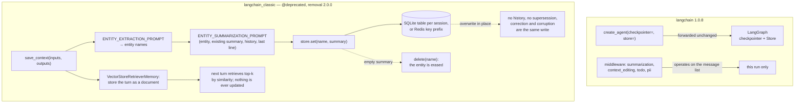

## 1. Executive Summary

LangChain named this field's vocabulary. `ConversationBufferMemory`,
`ConversationSummaryMemory`, `ConversationTokenBufferMemory`,
`ConversationEntityMemory` — the terms that organize every agent-memory tutorial
written since 2023, including the
[cookbook](https://github.com/NirDiamant/Agent_Memory_Techniques) whose reading
list produced this report, are LangChain class names.

At this commit the framework has removed all of them. `langchain` is at version
1.0.8 and contains **no memory implementation at all**: `store` appears in
`libs/langchain_v1/langchain/agents/factory.py` as a parameter forwarded to
LangGraph and nowhere else. The ten classic classes survive in a separate
package, `langchain_classic`, each carrying
`@deprecated(since="0.3.1", removal="2.0.0")` and an addendum pointing at
`create_agent` with checkpointing or [LangGraph's](../langgraph/) Store API.

That makes this an unusual subject: a report on a memory layer that its authors
concluded should not be part of an agent framework. It is worth writing because
the split they drew is precisely the one this atlas draws, and they drew it with
a package boundary.

Seven of the ten classic classes are **conversation-window management** — buffer,
window, summary, summary-buffer, token-buffer, combined, readonly — and nothing
in them outlives the process. They are out of this atlas's scope and always
were, which is exactly why naming them "memory" caused a decade of confusion
about what the word means. Three were genuinely memory:
`ConversationEntityMemory` with SQLite, Redis or Upstash entity stores;
`VectorStoreRetrieverMemory`, which writes each turn into a vector store and
retrieves the relevant past on the next; and `ConversationKGMemory`, which at
this commit is a 23-line import shim forwarding to `langchain_community`.

The interesting mechanism is the entity store, and its interesting property is
its scoping. `SQLiteEntityStore` realizes a session as **its own table** —
`f"{table_name}_{session_id}"`, created on construction — and enforces that both
components be valid Python identifiers. Isolation by DDL rather than by a
predicate is genuinely leak-proof and genuinely does not scale, and it is the
only design in this atlas that makes that trade.

The weaknesses are what you would expect of code under a removal notice: the
entity summarizer overwrites in place with no history, an empty summary silently
deletes the entity it describes, and every extraction and summarization call is
synchronous on the turn.

## 2. Mental Model

Two answers, because the two packages disagree about whether memory exists.

**In `langchain` 1.x**, a memory is nothing. The framework has no memory unit, no
store and no state machine. `create_agent` accepts a `checkpointer` (thread
state, LangGraph's) and a `store` (cross-thread memory, LangGraph's) and passes
both straight through. Its own contribution to context is middleware:
`summarization.py` compresses the message list, `context_editing.py` prunes it,
`todo.py` keeps a task list in graph state, `pii.py` redacts. All four operate on
the current run. Nothing of theirs survives it.

**In `langchain_classic`**, a memory is one of two things.

An **entity summary** is a string keyed by an entity name, held in a
`BaseEntityStore` with a five-method interface — `get`, `set`, `delete`,
`exists`, `clear`. Its lifecycle:

```text
turn arrives
  -> ENTITY_EXTRACTION_PROMPT over the recent buffer  -> a list of entity names
  -> for each name: ENTITY_SUMMARIZATION_PROMPT with (entity, existing summary,
                    history, last line)               -> a new summary
  -> store.set(name, new_summary)                     -> overwrites, no history
```

The summarization prompt is the whole epistemic policy, and it is a good one for
five lines of English. It instructs the model to include "only facts that are
relayed in the last line of conversation about the provided entity", and — the
load-bearing sentence — "If there is no new information about the provided entity
or the information is not worth noting (not an important or relevant fact to
remember long-term), return the existing summary unchanged." A no-op is an
explicitly permitted outcome, which is more than many extractors in this atlas
allow.

What the design has no answer for is *disagreement*. There is one slot per
entity, the new summary replaces the old, and nothing records what the old one
said or that anything changed. A correction and a corruption are the same
operation. Deletion has one path and it is a trap: `set(key, value)` begins
`if not value: return self.delete(key)`, so a summarizer that returns an empty
string — the natural output when a model decides there is nothing to say —
erases everything known about that entity.

A **retrieved turn** is the other unit: `VectorStoreRetrieverMemory` writes the
input/output pair of every turn as a document and, on the next turn, retrieves
top-k by similarity to the current input. There is no extraction and no
lifecycle at all — documents accumulate, nothing is ever updated, and the class
exposes no delete.

Neither unit has a status, a confidence, a timestamp or a provenance link, so
there is no trust model to describe in either package.



## 3. Architecture

A monorepo. The parts that bear on memory:

- **`libs/langchain_v1/langchain/`** — the 1.x package. `agents/factory.py`
  (`create_agent`, the `store` and `checkpointer` pass-through) and
  `agents/middleware/` with 22 modules, four of them context-related:
  `summarization.py` (910 lines), `pii.py` (878), `todo.py` (357),
  `context_editing.py` (298).
- **`libs/langchain/langchain_classic/memory/`** — 2,201 lines across eighteen
  files. `entity.py` is 629 of them; `prompt.py` (164) holds the extraction and
  summarization templates; `vectorstore.py` (125) and
  `vectorstore_token_buffer_memory.py` (183) are the vector-backed pair;
  `buffer.py`, `buffer_window.py`, `summary.py`, `summary_buffer.py`,
  `token_buffer.py`, `combined.py`, `readonly.py`, `simple.py` are window
  management; `kg.py`, `motorhead_memory.py` and `zep_memory.py` are 23-line
  import shims to `langchain_community`.
- **`libs/core/`** — `BaseStore`, `VectorStore`, `BaseChatMessageHistory`: the
  interfaces the above bind to.

Nothing here is a service. Everything is a library class the application
constructs and passes to a chain or an agent.

### Deployment and ergonomics

- **Version 1 needs nothing** and stores nothing. Durability means bringing
  LangGraph and one of its backends, which is a different package with its own
  deployment story.
- **`SQLiteEntityStore` needs a file path** and creates its own table on
  construction. `RedisEntityStore` and `UpstashRedisEntityStore` need a Redis
  URL or an Upstash token; both key by `f"{prefix}:{session_id}:{key}"`, and
  the Redis one applies a TTL.
- **`VectorStoreRetrieverMemory` needs whatever the vector store needs**, which
  in practice means an embedding provider and therefore an API key.
- **The SQLite store is inspectable and repairable** — a two-column
  `(key TEXT PRIMARY KEY, value TEXT)` table per session, readable with any
  SQLite client.
- Install is `pip install langchain` for a framework with no memory, or
  `pip install langchain-classic` for one that emits a `LangChainDeprecationWarning`
  on every class you construct.

The screen of this checkout found three auto-run surfaces, 42 dependency
surfaces inside the seven-day cooldown, 40 build-time execution points across
109 files, and `AGENTS.md`/`CLAUDE.md` — agent-directed instructions, read here
as data. Zero unpinned surfaces: the monorepo is fully lockfiled, which is
better than almost anything else in this atlas. Nothing was installed or run.

## 4. Essential Implementation Paths

- **Write (entity)** — `ConversationEntityMemory.save_context()` in
  `langchain_classic/memory/entity.py`. Calls `super().save_context()` to append
  to the chat buffer, then for each entity in `self.entity_cache` runs an
  `LLMChain` over `ENTITY_SUMMARIZATION_PROMPT` and calls
  `self.entity_store.set(entity, output.strip())`.
- **Extraction** — `load_memory_variables()` in the same class runs
  `ENTITY_EXTRACTION_PROMPT` over the last `k` turns, splits the result on
  commas, and populates `entity_cache` — so **extraction happens on the read
  path and summarization on the write path**, one turn apart.
- **Prompts** — `_DEFAULT_ENTITY_EXTRACTION_TEMPLATE` and
  `_DEFAULT_ENTITY_SUMMARIZATION_TEMPLATE` in
  `langchain_classic/memory/prompt.py:88`.
- **Entity store interface** — `BaseEntityStore` at `entity.py:41`: `get`,
  `set`, `delete`, `exists`, `clear`.
- **SQLite backend** — `SQLiteEntityStore` at `entity.py:358`. Validates
  `table_name.isidentifier()` and `session_id.isidentifier()`, connects, and
  calls `_create_table_if_not_exists()` for `f"{table_name}_{session_id}"`.
- **Delete-by-emptiness** — `SQLiteEntityStore.set()` at `entity.py:437`:
  `if not value: return self.delete(key)`.
- **Vector write** — `VectorStoreRetrieverMemory.save_context()` in
  `memory/vectorstore.py`, which formats the input/output pair into a `Document`
  and calls `retriever.add_documents`.
- **Vector read** — `load_memory_variables()` in the same file: the input string
  is the query, `retriever.invoke` returns documents, and
  `_documents_to_memory_variables` joins their `page_content` with newlines.
- **Version 1 pass-through** — `create_agent(..., store=...)` in
  `libs/langchain_v1/langchain/agents/factory.py:782`, forwarded to `compile()`
  at `:1847`.
- **Tests** — `libs/langchain/tests/unit_tests/memory/` and
  `tests/integration_tests/memory/`.

## 5. Memory Data Model

`SQLiteEntityStore`:

```sql
CREATE TABLE IF NOT EXISTS "<table_name>_<session_id>" (
    key   TEXT PRIMARY KEY,   -- the entity name, as the extractor wrote it
    value TEXT                -- the LLM-maintained summary
)
```

Two columns. No timestamp, no version, no source, no confidence, no type. An
entity's identity is the string a language model produced when asked to list
entities — so "Deven", "deven" and "Deven Smith" are three entities, and nothing
merges them. `RedisEntityStore` is the same model under
`f"{prefix}:{session_id}:{key}"` with a TTL; `InMemoryEntityStore` is a dict.

**Scoping is by table**, and it is worth dwelling on because nothing else in
this atlas does it. `full_table_name` is `f"{table_name}_{session_id}"`, the
table is created in `__init__`, and every statement targets that one name. There
is no `WHERE session_id = ?` anywhere, because there is no `session_id` column:
one session's rows are physically unreachable from another session's queries.
That is the strongest isolation available short of separate databases, and the
cost is a `CREATE TABLE` per session in a single SQLite file — a thousand users
is a thousand tables, and `sqlite_master` becomes the user directory.

The identifier constraint follows from it and is the sharp edge:
`session_id.isidentifier()` rejects the two things a session id usually is. A
UUID (`3f2a-…`) fails on the hyphens; an email fails on `@` and `.`. Callers must
mangle their real key into a Python identifier and remember the mapping.

`clear()` is the one method that does not quote the table name —
`f"DELETE FROM {self.full_table_name}"`, where the other four use
`f'… "{self.full_table_name}" …'`. Both components are validated identifiers so
this is not an injection, but it is the only inconsistency in an otherwise
carefully quoted class, and it is the method that deletes everything.

`VectorStoreRetrieverMemory` has no schema of its own: it writes
`Document(page_content=…)` and inherits whatever the bound vector store records.
Which means it also inherits *no scoping at all* — the class has no session,
user or namespace concept, so two users sharing a vector store share memories
unless the application partitions the store itself.

## 6. Retrieval Mechanics

Two mechanisms, neither ranked.

**Entity memory** does exact key lookup. `load_memory_variables` runs the
extraction prompt over the last `k` turns, then calls `entity_store.get(entity)`
for each returned name and assembles a `{entity: summary}` dict into the prompt.
There is no similarity, no partial match and no fallback: if the extractor
writes "Deven Smith" and the store holds "Deven", the lookup misses and the
model is told nothing is known. Retrieval quality is entirely a function of
whether two separate LLM calls, on different turns, produced the same string.

**Vector memory** does top-k cosine over documents whose text is the formatted
input/output pair of a past turn, with the current input as the query. `top_k`
belongs to the retriever, not the memory. `vectorstore_token_buffer_memory.py`
adds the one refinement in the family: it keeps recent turns verbatim in a
buffer and only flushes older ones into the vector store once a token budget is
exceeded, so retrieval covers the distant past while the near past stays exact.

Neither path budgets tokens on the read side, formats context beyond a join, or
does anything about over-recall. Both are automatic in the sense that a chain
calls them without the model asking — the model has no memory tool and no way to
query.

The failure mode specific to entity memory is worth naming because it is
structural rather than incidental: **an entity summary grows monotonically in a
fixed slot.** The summarizer is asked to update a summary with new facts and to
return it unchanged when there is nothing to add, but nothing bounds its length
and nothing removes stale facts, so a frequently discussed entity accumulates a
paragraph that is injected in full on every turn that mentions it.

## 7. Write Mechanics

Everything is synchronous and on the turn. `ConversationEntityMemory` makes one
extraction call when the prompt is assembled and one summarization call **per
extracted entity** when the turn completes. A turn mentioning four entities
costs five LLM round trips beyond the response itself, serially, with the user
waiting. Lag before a memory is retrievable is zero — the store is written
before `save_context` returns — which is the compensating property, and the
reason this design felt reasonable in 2023 and does not now.

Update is overwrite. `set(entity, summary)` replaces the row; the previous
summary is not kept anywhere. There is no append, no versioning, no diff and no
audit. Conflict handling is whatever the summarizer decides when it sees the old
summary and the new line together — which is a real mechanism, and undermined by
the fact that its output has nowhere to express uncertainty.

Deduplication does not exist for either unit. Entity keys dedupe by exact
string; vector-store documents never dedupe at all, so a user repeating
themselves fills the index with near-identical turns that will all rank together
on the next similar query.

No content filtering of any kind. Whatever the extractor names becomes a key,
and whatever the summarizer writes becomes the value.

No background pass exists in either package. Nothing re-reads the store, nothing
expires (except the Redis backend's TTL), nothing consolidates.

Version 1's middleware is the only place a write-side cost model appears, and it
is about the window rather than the store: `summarization.py` compresses the
message list when it grows, `context_editing.py` prunes tool results. Both
rewrite what the model sees on the next call and neither persists anything.

## 8. Agent Integration

In `langchain_classic` the integration point is `BaseMemory`, a two-method
interface — `load_memory_variables(inputs)` and `save_context(inputs, outputs)`
— that a chain calls around every invocation. The agent has no agency: it cannot
save, search, correct or delete, and it does not know memory exists. Memory is
something the framework does to the prompt.

`ReadOnlySharedMemory` (`readonly.py`, 24 lines) is the one concession — a
wrapper whose `save_context` is a no-op, so a sub-chain can read shared memory
without writing to it. Small, and the right primitive for multi-chain setups.

In `langchain` 1.x the integration point is `store=` on `create_agent`, which
means the integration story is [LangGraph's](../langgraph/): `get_store()` in a
node, `InjectedStore` on a tool. LangChain contributes middleware and no memory
tools.

Session lifecycle is the caller's in both. `session_id` is a constructor
argument on the entity stores and nothing rotates, expires or migrates it.
Nothing handles a compaction boundary, because in the classic package the
summary *is* the compaction and in v1 the summarization middleware discards what
it compresses.

## 9. Reliability, Safety, and Trust

Provenance is absent. An entity summary is a string; nothing records which turn
produced it, which model wrote it, or when. Two consecutive writes are
indistinguishable from one, and there is no way to ask what the store held
before the most recent write.

The trust surface is a language model with write access to a key-value store, in
a loop, with no validation. A conversation that talks about an entity can set
that entity's summary to anything, and the next turn will inject it as
established fact. There is no confidence field, no verification step and no way
to mark something unverified — so a prompt-injected assertion and a user's
statement of fact are the same row.

Three concrete hazards, in decreasing order of how likely they are to bite:

**An empty summary erases the entity.** `if not value: return self.delete(key)`
treats a falsy summary as a deletion request. The summarization prompt tells the
model to return the existing summary unchanged when there is nothing new — but a
model that instead returns an empty string, or whitespace that `.strip()`
reduces to empty, silently destroys everything known about that entity, with no
error and no log line.

**Overwrite has no floor.** A summarizer that misreads the last line and rewrites
a paragraph of accumulated knowledge into one wrong sentence has committed, and
nothing anywhere retains the old text.

**`clear()` is unquoted.** Bounded by the identifier validation in `__init__`,
but the asymmetry with the other four methods is the kind that survives a
refactor of the validation and becomes real.

Multi-tenancy is genuinely good in the entity stores and genuinely absent in
`VectorStoreRetrieverMemory`, which has no tenant concept at all. Concurrency is
unhandled: two writers to one entity are last-write-wins with no detection, and
`SQLiteEntityStore` holds a single `sqlite3` connection created in `__init__`
with no thread guard.

The one thing version 1 adds to this picture is `pii.py`, an 878-line middleware
that detects and redacts personal data in message content — including in
streaming deltas, with a lookback buffer so patterns straddling chunk boundaries
are caught. It is real engineering, and it protects the transcript rather than a
store, because there is no longer a store to protect.

## 10. Tests, Evals, and Benchmarks

Unit tests live in `libs/langchain/tests/unit_tests/memory/` and cover the
buffer classes, combined memory and the summary-buffer token accounting;
integration tests under `tests/integration_tests/memory/` exercise the backends.
Coverage of the window-management classes is better than coverage of the durable
ones, which inverts the priority a memory reader would want.

There is no eval harness, no retrieval-quality measurement, no benchmark, and no
dataset anywhere in the memory packages. Nothing measures whether the entity
extractor and the entity-store keys agree, which is the failure this design
turns on. Nothing asserts that a deleted entity stays deleted, or that a
`session_id` cannot reach another session's table — both of which would be short
tests against a real property this code has.

The absence is unsurprising for deprecated code and worth stating plainly
anyway: the most influential memory API in the ecosystem shipped without a
measurement of whether it recalled anything.

## 11. For Your Own Build

### Steal

**Draw the boundary in the package structure.** Splitting `langchain` from
`langchain_classic`, and delegating durable memory to a separate library with
its own contract, is a stronger statement than any amount of documentation about
what "memory" means. If your framework has both a context-window manager and a
store, do not let them share a base class.

**Let the extractor return "no change" explicitly.** "If there is no new
information about the provided entity or the information is not worth noting,
return the existing summary unchanged" is one sentence, and it is the difference
between a summarizer that consolidates and one that churns.

**Scope by container when the tenant count is small and the isolation matters.**
A table per session cannot leak across sessions, because there is no query that
spans them. For a handful of long-lived tenants with a hard boundary, this beats
a `WHERE` clause someone can forget.

**Give sub-agents a read-only view of shared memory.** `ReadOnlySharedMemory` is
24 lines and prevents an entire class of multi-agent write contention.

**Buffer recent turns verbatim and flush older ones into the index on a token
budget.** `VectorStoreRetrieverMemory` alone loses exactness for the near past;
the token-buffer variant keeps both, and the rule is a threshold rather than a
policy.

### Avoid

**Do not overload an empty value as a delete.** `if not value: delete(key)` puts
the destruction of a record behind the most common accidental output of a
language model. Deletion should require saying so.

**Do not key memory on a string a model produced.** Exact-match lookup between
two independent LLM calls — one that names entities, one that looks them up —
fails whenever the model is inconsistent about capitalization or completeness,
and the failure is silent: the store returns nothing and the agent behaves as
though it never knew.

**Do not overwrite a summary with no history.** One slot per entity means a
correction and a corruption are the same write, and nothing can tell you which
one happened.

**Do not require your scope key to be a programming-language identifier.** Real
session ids are UUIDs and email addresses. A constraint inherited from how the
storage happens to be named forces every caller to invent a mangling.

**Do not make a per-entity LLM call synchronous on the turn.** Extraction plus
one summarization per entity is unbounded latency proportional to how
interesting the sentence was.

### Fit

Nobody should build on `langchain_classic.memory`. It is deprecated with a
removal version attached, its durable classes are the least tested, and the
official replacement is a different package.

The value here is as a reference: a reader designing entity memory should read
`prompt.py` for the two prompts and `entity.py` for the store interface, both of
which are small, clear and widely copied. The five-method `BaseEntityStore` in
particular is the right shape for a pluggable memory backend and has aged better
than the class using it.

And a reader choosing a framework should read the deprecation notice as the
recommendation it is. LangChain's answer to "how should my agent remember" is
now "use a store that is not ours" — which is a defensible conclusion for a
framework and a reason to evaluate the store on its own terms rather than
inheriting it by accident.

## 12. Open Questions

- Is `langchain_classic` maintained, or frozen until 2.0.0 removes it? The
  deprecation names a removal version; nothing states a support policy.
- Was the `clear()` quoting inconsistency deliberate? Every neighbouring method
  carries a `noqa: S608` comment and quotes the identifier.
- Does any first-party guidance exist for migrating a `ConversationEntityMemory`
  deployment to LangGraph's Store? The addendum links two documentation pages;
  neither is in this tree.
- How do the `langchain_community` shims — `kg.py`, `motorhead_memory.py`,
  `zep_memory.py` — behave at their own current commits? They are 23-line
  re-exports here and their implementations live in another repository.
- Does `SQLiteEntityStore` see production use with high session counts, and what
  happens to a SQLite file with tens of thousands of tables? Nothing in the tree
  bounds it.

## Appendix: File Index

**Durable memory (deprecated)**

- `libs/langchain/langchain_classic/memory/entity.py` — `BaseEntityStore`, `InMemoryEntityStore`, `RedisEntityStore`, `UpstashRedisEntityStore`, `SQLiteEntityStore`, `ConversationEntityMemory`.
- `libs/langchain/langchain_classic/memory/prompt.py` — `ENTITY_EXTRACTION_PROMPT`, `ENTITY_SUMMARIZATION_PROMPT`.
- `libs/langchain/langchain_classic/memory/vectorstore.py` — `VectorStoreRetrieverMemory`.
- `libs/langchain/langchain_classic/memory/vectorstore_token_buffer_memory.py` — the buffer-then-flush variant.
- `libs/langchain/langchain_classic/memory/kg.py`, `motorhead_memory.py`, `zep_memory.py` — import shims to `langchain_community`.

**Window management (out of scope, listed for the boundary)**

- `buffer.py`, `buffer_window.py`, `summary.py`, `summary_buffer.py`, `token_buffer.py`, `combined.py`, `readonly.py`, `simple.py`.

**Version 1**

- `libs/langchain_v1/langchain/agents/factory.py` — `create_agent`, the `store`/`checkpointer` pass-through.
- `libs/langchain_v1/langchain/agents/middleware/summarization.py`, `context_editing.py`, `todo.py`, `pii.py`.

**Interfaces**

- `libs/langchain/langchain_classic/base_memory.py` — `BaseMemory`.
- `libs/core/` — `VectorStore`, `BaseChatMessageHistory`.

**Tests**

- `libs/langchain/tests/unit_tests/memory/`, `libs/langchain/tests/integration_tests/memory/`.

## History

**2026-08-14** — [`f9ee55d94c8c2e61b14391d4f4f5dfd491bbd2f5`](https://github.com/langchain-ai/langchain/commit/f9ee55d94c8c2e61b14391d4f4f5dfd491bbd2f5) — first reading, with `langchain` at version 1.0.8. Screened before opening: three auto-run surfaces, 42 dependency surfaces inside the cooldown, 40 build-time execution points, zero unpinned surfaces, and two agent-instruction files read as data. Nothing was installed or run.
