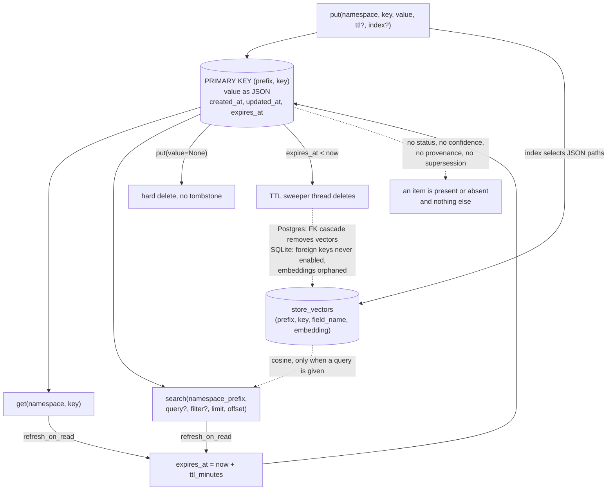

## 1. Executive Summary

LangGraph is an agent runtime, and most of it is out of this atlas's scope. Two
of its persistence layers are not, and telling them apart is the first thing a
reader needs.

The **checkpointer** (`BaseCheckpointSaver`) snapshots graph state per thread so
a run can be resumed, time-travelled or replayed. That is session state: durable
across processes, but scoped to one conversation and not a claim anybody
believes. The **store** (`BaseStore`) is the long-term memory: a hierarchical
namespace tuple, a key, a JSON value, `created_at`/`updated_at`, optional TTL,
and optional semantic search over selected fields. It survives threads, users
and deployments, and it is what LangGraph means when its documentation says
"memory". The store is the subject here.

It is a good design, and deliberately unopinionated. There is no extraction, no
consolidation, no scoring, no forgetting policy and no notion of what a memory
*is* — you write dicts under namespaces and read them back by prefix, filter or
similarity. Everything this atlas usually analyses as memory semantics is left
to the application. What LangGraph provides is the substrate, and the substrate
gets two things right that most do not: **the scope is half the primary key**,
so a read cannot omit it, and **TTL refreshes on read**, so a last-touched
expiry falls out of ordinary use rather than needing a job.

The finding worth the report is a mismatch. LangGraph ships
`langgraph-checkpoint-conformance`, a published, installable, capability-aware
conformance suite so that anyone writing a third-party `BaseCheckpointSaver` can
prove it satisfies the contract — nine capabilities, five mandatory, a report
generator, the whole apparatus. Nothing equivalent exists for `BaseStore`. And
the store is where the three first-party backends visibly disagree with each
other: on whether `created_at` survives an update (Postgres yes, SQLite and
in-memory no), and on whether deleting an item deletes its embeddings (Postgres
yes by an enforced foreign key, SQLite no because the identical `ON DELETE
CASCADE` is declared and SQLite's foreign keys are never switched on). Both are
in the half of the persistence layer that has no spec to fail — as is a third,
smaller one in section 6, where Postgres sizes its vector-search candidate pool
against how many vectors an item can carry and SQLite multiplies by a constant 2.

## 2. Mental Model

A memory is an `Item`: `{namespace: tuple[str, ...], key: str, value: dict,
created_at, updated_at}`. That is the whole ontology. LangGraph takes no
position on whether the dict is a fact, a preference, a summary, a document or
a scratch note; `value`'s keys are filterable and its selected paths are
embeddable, and beyond that it is opaque.

Consequently there is **no epistemic state machine to describe**, and that is
the honest finding rather than a gap in the reading. An item is present or
absent. It has no status, no confidence, no provenance, no supersession chain,
and no relationship to any other item. Nothing marks a claim as candidate,
verified or rejected, so a wrong value is corrected only by an application
writing the same `(namespace, key)` again — and the old value is gone, not
superseded.

The three ways an item can stop existing are all destructive:

```text
put(ns, key, value)         ->  present
put(ns, key, None)          ->  hard delete, row removed
                                (this is what .delete() compiles to)
ttl elapses without a read  ->  omit_expired hides it, sweeper deletes it
```

There is one temporal mechanism and it is a good one: **TTL is refreshed on
read**, controlled by `TTLConfig.refresh_on_read` (default true) and overridable
per operation with `refresh_ttl`. A memory nobody has consulted for `default_ttl`
minutes expires; a memory that keeps being retrieved never does. That is
last-touched decay obtained for free from ordinary traffic, without a
background scorer and without an LLM deciding what matters — the cheapest useful
forgetting policy in this atlas, and the one most systems here reimplement badly.
Its limit is that it decays by *access recency alone*: an item read once a month
because it is genuinely needed once a month survives, and so does an item read
constantly because it sits in a namespace someone scans on every turn.

`created_at` and `updated_at` are both record time. Nothing tracks when the
content was true, so the `bitemporal` mark is withheld.



## 3. Architecture

The store is defined in `langgraph-checkpoint` and implemented three times.

- **`libs/checkpoint/langgraph/store/base/__init__.py`** (1,322 lines) — the
  contract: `Item`, `SearchItem`, the five op types (`GetOp`, `SearchOp`,
  `PutOp`, `ListNamespacesOp`, `MatchCondition`), `TTLConfig`, `IndexConfig`,
  and `BaseStore` with `get`/`search`/`put`/`delete`/`list_namespaces` layered
  over one abstract `batch(ops)`.
- **`store/base/embed.py`** (433 lines) — `get_text_at_path`, a small JSON-path
  evaluator supporting `field`, `parent.child`, `array[*].field` and
  `context[0].text`, plus `ensure_embeddings` which resolves a provider string
  like `"openai:text-embedding-3-small"`.
- **`store/base/batch.py`** (371 lines) — `AsyncBatchedBaseStore`, which
  coalesces concurrent operations into one `abatch` call.
- **`store/memory/__init__.py`** (592 lines) — `InMemoryStore`: nested dicts,
  brute-force cosine.
- **`libs/checkpoint-postgres/.../store/postgres/base.py`** (1,480 lines) —
  Postgres with pgvector, HNSW or IVFFlat, cosine / L2 / inner-product distance.
- **`libs/checkpoint-sqlite/.../store/sqlite/base.py`** (1,514 lines) — SQLite,
  embeddings as BLOBs with the distance computed by `vec_distance_cosine` /
  `_L2` / `_L1` from the **sqlite-vec loadable extension**, loaded at `setup()`
  under `enable_load_extension` (`:1097-1099`) and only when an `IndexConfig`
  is present. The one Python function registered on the connection
  (`conn.create_function`, `:870`) is the namespace matcher, not the metric.

Two SQL tables in both server backends: `store (prefix, key, value, created_at,
updated_at, expires_at, ttl_minutes)` with `PRIMARY KEY (prefix, key)`, and
`store_vectors (prefix, key, field_name, embedding, …)` with `PRIMARY KEY
(prefix, key, field_name)` and a foreign key back to `store`. One item can carry
several embeddings — one per indexed JSON path — and search deduplicates them
back to one row per key: SQLite with a `ROW_NUMBER()` window function, Postgres
with `DISTINCT ON`. The two do not agree on how much they fetch before that
step, which §6 takes up.

The store reaches a graph three ways: `compile(store=…)` or `@entrypoint(store=…)`
at build time, `get_store()` from inside a node (a contextvar, so Python ≥ 3.11
for async), and `Annotated[BaseStore, InjectedStore()]` on a tool argument,
which `ToolNode` fills in and strips from the schema the model sees.

**No memory tools are prebuilt.** `langgraph-prebuilt` ships the injection
machinery and not a single `save_memory` or `search_memory` tool; every
application writes its own.

### Deployment and ergonomics

- **Nothing has to be running for the default.** `InMemoryStore()` needs no
  service and no key, and dies with the process — fine for tests, not memory.
- **Durability means Postgres or SQLite.** SQLite is a file; Postgres needs
  pgvector for semantic search and `CREATE INDEX CONCURRENTLY` at setup.
- **Semantic search requires an embedding provider**, so the moment you turn it
  on there is an API key and a per-write network call in the path. Without
  `IndexConfig` the store is a filtered key-value scan and needs no key at all —
  a genuinely usable degraded mode rather than a broken one.
- **The store is inspectable and repairable by hand**: two ordinary tables, or
  one SQLite file, with values as JSON.
- Install is `pip install langgraph-checkpoint-postgres` or `-sqlite`; first run
  is `store.setup()`.

The screen of this checkout found no auto-run surfaces, 41 dependency surfaces
inside the seven-day cooldown, 15 build-time execution points and 17 unpinned
surfaces across 86 files, plus `AGENTS.md` and `CLAUDE.md` — agent-directed
instruction files, read here as data. Nothing was installed and nothing was run.

## 4. Essential Implementation Paths

- **Write** — `BaseStore.put()` at `store/base/__init__.py:856`. Validates the
  namespace, resolves the TTL against `ttl_config`, raises if a TTL is given to
  a backend whose `supports_ttl` is false, and emits one `PutOp` into `batch()`.
- **Delete** — `BaseStore.delete()` at `:937`, whose entire body is
  `self.batch([PutOp(namespace, str(key), None, ttl=None)])`. A delete is a put
  of `None`; backends branch on `op.value is None`.
- **Read by key** — `get()` at `:756`, one `GetOp` carrying the resolved
  `refresh_ttl`.
- **Search** — `search()` at `:779`. `namespace_prefix` is positional-only and
  required; `query`, `filter`, `limit`, `offset` and `refresh_ttl` are keyword.
- **Namespace listing** — `list_namespaces()` at `:946`, with prefix and suffix
  `MatchCondition`s and a `max_depth` truncation.
- **Namespace validation** — `_validate_namespace()` at `:1263`: rejects empty
  tuples, non-string labels, empty labels, labels containing `.`, and any
  namespace whose first label is `langgraph` — a reserved root.
- **Text extraction for embedding** — `get_text_at_path()` in
  `store/base/embed.py`, driven by `IndexConfig.fields` (default `["$"]`, the
  whole document) and overridable per put with `index=[…]` or disabled with
  `index=False`.
- **Postgres upsert** — `_prepare_batch_PUT_queries` at
  `store/postgres/base.py:311`, whose `INSERT … ON CONFLICT (prefix, key) DO
  UPDATE SET value, updated_at, expires_at, ttl_minutes` is at `:404`.
- **SQLite upsert** — `store/sqlite/base.py:421`: `INSERT OR REPLACE INTO store
  (…, created_at, updated_at, …) VALUES (…, CURRENT_TIMESTAMP,
  CURRENT_TIMESTAMP, …)`.
- **TTL sweeper** — `sweep_ttl()` and `start_ttl_sweeper()` at
  `store/postgres/base.py:834` and `store/sqlite/base.py:1129` and `:1145`, a daemon thread
  issuing `DELETE FROM store WHERE expires_at IS NOT NULL AND expires_at < NOW()`
  on an interval.
- **Read-time TTL refresh** — the `UPDATE store SET expires_at = NOW() +
  (s.ttl_minutes || ' minutes')::interval` folded into the get and search
  queries at `store/postgres/base.py:285` and `:573`.
- **Tool injection** — `InjectedStore` at `prebuilt/tool_node.py:1829` and the
  injection walk at `:2016`.
- **Checkpointer conformance** — `libs/checkpoint-conformance/`, with
  `capabilities.py`, `validate.py`, `report.py` and ten spec modules.

## 5. Memory Data Model

```sql
CREATE TABLE store (
    prefix      text NOT NULL,   -- the namespace tuple, joined
    key         text NOT NULL,
    value       jsonb NOT NULL,
    created_at  timestamptz DEFAULT CURRENT_TIMESTAMP,
    updated_at  timestamptz DEFAULT CURRENT_TIMESTAMP,
    expires_at  timestamptz,
    ttl_minutes int,          -- REAL on SQLite
    PRIMARY KEY (prefix, key)
);

CREATE TABLE store_vectors (
    prefix text, key text, field_name text, embedding vector(N),
    created_at timestamptz, updated_at timestamptz,
    PRIMARY KEY (prefix, key, field_name),
    FOREIGN KEY (prefix, key) REFERENCES store(prefix, key) ON DELETE CASCADE
);
```

**Scoping is structural, and this is the design's best decision.** The namespace
is not a column you may remember to filter on — it is the left half of the
primary key, it is a required argument on `get`, `put`, `delete` and `search`,
and it is validated on the way in. A read that omits the scope does not compile.
That is what earns `scope_enforced`, and the reserved `langgraph` root is a nice
extra: the framework keeps a private namespace and refuses to let applications
write into it.

The hierarchy is a tuple, so `("memories", "user_123", "preferences")` is a real
tree, and `list_namespaces` can enumerate it with prefix and suffix matching and
a depth cap. Applications get per-user, per-org, per-agent or per-topic
partitioning by naming convention, with the framework enforcing the shape but
not the meaning.

Metadata and provenance are whatever the application puts in `value`. There is
no author field, no source, no version and no correction chain. `created_at` and
`updated_at` are the only structure the framework adds — which makes the
following worth stating precisely.

**The three backends disagree on `created_at` across an update.** Postgres's
`ON CONFLICT DO UPDATE` sets `value`, `updated_at`, `expires_at` and
`ttl_minutes`, and leaves `created_at` alone, so the original creation time
survives. SQLite uses `INSERT OR REPLACE` — which deletes the row and inserts a
new one — with `CURRENT_TIMESTAMP` in the `created_at` position, so it resets.
`InMemoryStore._apply_put_ops` constructs a fresh `Item` with
`created_at=datetime.now(timezone.utc)`, so it resets too. The base class
documents the field as "Timestamp of item creation". An application that ages
memories by `created_at` gets true ages on Postgres and false ones on the two
backends people develop against.

## 6. Retrieval Mechanics

There are two read paths and they are not a hybrid.

Without a `query`, `search` is a filtered scan: namespace-prefix match, optional
`filter` on `value`'s keys — supporting `$eq`, `$ne`, `$gt`, `$gte`, `$lt`,
`$lte` — ordered by `updated_at DESC`, with `limit` and `offset`. No relevance,
no text matching.

With a `query`, the same prefix and filter constrain a cosine ranking over
`store_vectors`. Because one item can have several embeddings — one per indexed
path — the query scores all of them and then collapses to one row per key. **The
two SQL backends do that differently, and only one of them sizes the fetch
against how many vectors an item can have.**

On SQLite the inner `scored` CTE takes `ORDER BY score DESC LIMIT ?`
(`store/sqlite/base.py:546-547`) with `op.limit * 2` bound into it (`:565`,
commented "Expanded limit for better results"), and a `ranked` CTE keeps
`ROW_NUMBER() OVER (PARTITION BY prefix, key ORDER BY score DESC)` (`:551`)
filtered to `WHERE rn = 1` (`:556`). The
factor 2 is a constant and the number of vectors per item is not: an item
indexed across many fields can occupy several of those `2 × limit` slots with
duplicates of itself and push a distinct item out of the result set entirely.
The failure is silent — the caller gets `limit` results and no signal that the
candidate pool was crowded.

On Postgres the same shape is sized instead of guessed:
`expanded_limit = (op.limit * vectors_per_doc_estimate * 2) + 1`
(`store/postgres/base.py:506`), where `vectors_per_doc_estimate` is
`__estimated_num_vectors`, computed at config time in `_ensure_index_config`
(`:1473`) by summing the tokenized path count over `IndexConfig.fields`.
Deduplication is
`SELECT DISTINCT ON (scored.prefix, scored.key) … ORDER BY prefix, key, neg_score ASC`
(`:528`).
Because the estimate is the per-item vector ceiling the config permits, the
crowding case is materially mitigated rather than merely made less likely.

SQLite computes the same `__estimated_num_vectors` (`store/sqlite/base.py:1507`)
and does not use it in the search. Porting one expression would close the gap.

There is **no lexical arm** — no BM25, no full-text index, no trigram fallback —
so an exact-token query (an error code, an identifier, a filename) has only
embedding similarity to find it with, and only if the field was indexed. Nothing
reranks, nothing fuses, and there is no query transformation.

Retrieval is entirely application-driven. LangGraph will not inject anything: a
node or a tool must call `search` and decide what to do with the result, and
there is no token budget, no context formatter and no automatic assembly. That
is consistent with the framework's position — it owns the substrate, the
application owns the policy — and it means none of the ranking failure modes
this atlas usually catalogues are LangGraph's to have.

The one it does have is the field-selection cliff. `IndexConfig.fields`
defaults to `["$"]`, embedding the entire JSON document as one vector. For an
item that is one sentence this is right; for an item that is a sentence plus
fifteen metadata keys, the metadata dominates the vector and semantic search
quietly stops working. Per-put `index=["text"]` fixes it, and nothing warns you.

## 7. Write Mechanics

Writes are synchronous. `put()` builds a `PutOp` and calls `batch()`, which
issues SQL immediately; when indexing is configured, the embedding call happens
inside the same operation, so **a node writing a memory blocks on an embedding
round trip**. `AsyncBatchedBaseStore` coalesces concurrent operations into one
`abatch`, which amortizes but does not remove the wait.

The lag before a memory is retrievable is therefore zero — read-your-writes is
immediate, in the same transaction — which is unusual in this atlas and worth
crediting: most systems here defer extraction and owe the caller a poll loop.
The price is that the write path has an LLM-provider dependency on it.

Update is upsert by `(namespace, key)`. There is no append mode, no versioning
and no merge: writing the same key replaces the value wholesale, and the
previous value is unrecoverable. A caller wanting history must encode it in the
key.

Deletion is a hard delete. `delete()` is a `PutOp` with `value=None`; Postgres
and SQLite issue `DELETE FROM store WHERE prefix = ? AND key IN (…)`, and
`InMemoryStore` pops from a dict. Nothing records that a key existed, so
`tombstone` is withheld — an application that re-derives a deleted memory from
the same source will write it straight back.

**The delete is complete on Postgres and incomplete on SQLite.** Both declare
`FOREIGN KEY (prefix, key) REFERENCES store(prefix, key) ON DELETE CASCADE` on
`store_vectors`. Postgres enforces it, so removing an item removes its
embeddings. SQLite enforces foreign keys only when `PRAGMA foreign_keys = ON`
is issued per connection, and that pragma appears nowhere in
`libs/checkpoint-sqlite`, so the cascade never fires: every deleted and every
TTL-swept item leaves its embeddings behind in `store_vectors` forever. The
consequences are bounded but real — the search query joins `store` to
`store_vectors`, so orphans cannot surface deleted content, but they are the
largest rows in the database, they grow without limit, and `sweep_ttl()` returns
a deleted-row count that does not include them. A SQLite store running a TTL
policy for a year is mostly embeddings of things it has forgotten.

There is no deduplication, no conflict detection, no consolidation pass and no
filtering of written content. The background work in the system is exactly one
thing: the TTL sweeper thread.

## 8. Agent Integration

Three ways in, and the differences matter for how much agency the model gets.

`compile(store=…)` binds a store to a graph; `get_store()` reads it from a
contextvar inside a node — documented as unavailable for async on Python < 3.11,
which is the kind of caveat that becomes a production bug report.
`Annotated[BaseStore, InjectedStore()]` on a tool parameter causes `ToolNode` to
pass the store at call time and to strip the argument from the schema the model
sees, so a tool can touch memory without the model knowing the store exists.

That last mechanism is the interesting one, because it decides where memory
policy lives. With `InjectedStore`, the application author writes a tool with a
narrow signature — `save_preference(text: str)` — and the namespace, the key
scheme and the TTL are chosen in code the model cannot influence. The model
gets agency over *content* and none over *scope*, which is the correct split and
the one most MCP memory servers get wrong by exposing a namespace parameter.

Against that: **LangGraph ships no memory tools at all.** There is no
`save_memory`, no `search_memory`, no profile updater, no summarizer — the
prebuilt package contains the injection plumbing and nothing to plug into it.
Every application invents its own tool surface, its own namespace convention and
its own decision about when to write. The framework's memory story is
consequently a substrate plus documentation, and two teams using it will not
have built the same thing.

Session lifecycle is the checkpointer's, not the store's, and the two are
deliberately unconnected: nothing summarizes a thread into the store at a
compaction boundary, and nothing garbage-collects store items when their thread
is deleted. `delete_thread` removes checkpoints; anything the application wrote
to the store on that thread's behalf stays.

## 9. Reliability, Safety, and Trust

Provenance is the application's problem. An `Item` carries no author, no source
and no run id, so a memory written by a tool the model called and a memory
written by an administrator are indistinguishable once stored. There is no
representation of uncertainty and no way to mark a value as unverified, which
means a prompt-injected memory — a tool call the model was talked into making —
lands in the store as an ordinary item and reads back with the same authority as
any other. Nothing in the framework mitigates this; the `InjectedStore` pattern
limits the *scope* an attacker can reach, not the *content* they can write into
the scope they have.

The scoping guarantees are structural and good, with one gap. Namespace is part
of the key, required on reads, validated for shape, and the `langgraph` root is
reserved. But namespaces are caller-supplied strings, and nothing binds a
namespace to an authenticated identity — a node that computes
`("memories", user_id)` from state will read whatever `user_id` the state
contains. The framework makes it impossible to *forget* the scope and does not
make it hard to *forge* one.

Concurrency is handled at the SQL level by upsert, so two writers to one key
produce last-write-wins with no detection. The batching layer deduplicates
operations within a batch. The TTL sweeper runs in a daemon thread whose
lifecycle the application owns; nothing restarts it if it dies, and a store
configured with `default_ttl` but never `start_ttl_sweeper()` will hide expired
items only if `omit_expired` is set, and otherwise will keep serving them.

That last combination deserves naming: `TTLConfig` has both `omit_expired`
(filter at read time) and `sweep_interval_minutes` (delete on a timer), both
default off, and `default_ttl` works without either. A store can therefore be
configured to expire memories and, absent a second and third opt-in, expire
nothing at all — the `expires_at` column fills in and no read or sweep ever
consults it.

Backup and replication are the database's. Data-loss risk is ordinary.

## 10. Tests, Evals, and Benchmarks

Test coverage of the store is substantial and backend-parallel: 24 tests in
`libs/checkpoint/tests/test_store.py`, 31 plus 22 async in
`libs/checkpoint-postgres/tests/`, 37 plus 18 async in
`libs/checkpoint-sqlite/tests/`, and 4 SDK integration tests. These cover
round-trips, namespace listing with prefix and suffix matching, filter
operators, TTL refresh, vector search and batching.

**The conformance suite is the artifact worth studying, and it is pointed at the
checkpointer.** `langgraph-checkpoint-conformance` is a separately published
package that a third-party persistence implementer installs, registers their
class with via `@checkpointer_test`, and runs `validate()` against. It defines
nine capabilities as an enum — `PUT`, `PUT_WRITES`, `GET_TUPLE`, `LIST`,
`DELETE_THREAD` as `BASE_CAPABILITIES`, and `DELETE_FOR_RUNS`, `COPY_THREAD`,
`PRUNE`, `DELTA_CHANNEL_HISTORY` as `EXTENDED_CAPABILITIES` — detects which the
implementation supports by looking for the async method, runs the matching spec
modules, and emits a report. Its README describes validating "blob round-trips,
metadata preservation, namespace isolation, incremental channel updates".

That is the shape this atlas keeps arguing for: a contract expressed as runnable
tests with stable capability names, so an implementation's claim can be checked
rather than believed. It is unusual and it is well built.

And `BaseStore` has none of it. There is no store conformance package, no
capability enum for `supports_ttl` or vector search, and no portable suite a
third-party store implementer can run. The three first-party backends are each
tested against their own file, in parallel test suites that were written
separately — which is exactly how two of them came to reset `created_at` on
update while the third preserves it, and how one of them came to leave orphaned
embeddings behind a foreign key it declares and does not enforce. Both are
one-line assertions in a shared suite; neither has a place to live.

No benchmarks. No retrieval-quality evaluation of any kind — no dataset, no
recall measurement, no negative case asserting that a deleted or scoped-out item
must not be returned. That is defensible for a substrate whose ranking is
"cosine over what you told us to embed", but it means the framework makes no
measured claim about retrieval and a reader should not infer one.

## 11. For Your Own Build

### Steal

**Put the scope in the primary key.** `PRIMARY KEY (prefix, key)`, with the
namespace as a required positional argument on every read, converts
cross-tenant leakage from a filter someone forgot into an argument the
call site cannot omit. It costs nothing and it is the single highest-value
line in this design.

**Refresh TTL on read, and make it configurable per operation.** Last-touched
expiry gives you a forgetting policy driven by real usage, with no scorer, no
LLM and no background pass to tune. `refresh_ttl=False` on a bulk export or an
admin scan then keeps housekeeping traffic from resurrecting dead memories —
which is the detail that makes the pattern usable rather than a footgun.

**Ship a conformance suite for every interface you expect others to implement.**
Not a test helper: a published package with a capability enum, detection, and a
report. `@checkpointer_test` plus `validate()` is the whole developer
experience, and it converts "our store is compatible" from a claim into a run.

**Inject the store into tools and strip it from the schema.** `InjectedStore`
lets the model choose what to save and never what scope to save it under. Expose
`save_note(text)`, not `save(namespace, key, value)`.

**Let semantic search be optional.** Without `IndexConfig` the store is a
filtered key-value scan that needs no embedding provider and no API key. A
memory layer that still works with the model provider unreachable is worth
designing for.

### Avoid

**Do not test parallel backends with parallel test suites.** Divergence is the
default outcome, and it shows up in exactly the places nobody thought to assert:
a timestamp's semantics across an update, whether a delete reaches the sidecar
table, how many candidates a vector search fetches before it deduplicates. That
third one is the instructive shape — the same module computes the quantity one
backend uses to size the fetch and the other backend ignores it, so the
divergence is not a missing feature but an unasserted one. One shared suite run
against every implementation is the only thing that holds them together.

**Do not declare a constraint the engine will not enforce.** `ON DELETE CASCADE`
in a SQLite schema is documentation until `PRAGMA foreign_keys = ON` is issued
on the connection, and the failure is silent, cumulative and invisible until
someone measures the database.

**Do not let expiry require three opt-ins.** A TTL that is set, not swept and
not filtered is a column that fills in while nothing expires. Pick a default
that means what the feature's name says.

**Do not default a semantic index to "embed the whole document".** It is right
for one-sentence items and quietly wrong for anything with metadata, and the
degradation looks like bad search rather than bad configuration.

**Do not make a delete a `put(None)` without deciding what it means.** It is a
tidy way to route one op type, and it means the layer that would record a
tombstone never sees a distinct delete to record.

### Fit

This suits a team that already knows what its memories are and wants somebody
else to own the table, the migrations, the TTL thread and the pgvector index. It
does not decide anything for you: no extraction, no consolidation, no
correction, no trust. If you are hoping to get memory *semantics* from your
agent framework, this is not that, and building them on top is most of the work
the systems in this atlas exist to do.

It fits worst where scope must be trustworthy rather than merely mandatory —
namespaces are strings a node computes, so a genuine multi-tenant boundary needs
a layer above this one. And a reader deploying on SQLite specifically should
plan for the divergences in sections 5, 6 and 7 rather than assume the backends
are interchangeable, which is what a substrate with three implementations
otherwise invites you to assume.

## 12. Open Questions

- Is the `created_at` divergence intentional? Nothing documents per-backend
  timestamp semantics, and the base class's docstring describes one behaviour.
- Is `PRAGMA foreign_keys` set anywhere outside `libs/checkpoint-sqlite` — by a
  connection factory a caller is expected to supply? Nothing in the package
  requires it, and the schema's cascade reads as though it were.
- Why does the SQLite vector search CTE fetch a flat `limit * 2` before
  deduplicating, when the same module already computes
  `__estimated_num_vectors` and Postgres multiplies by it? Both were written
  against the same contract; nothing in the tree says whether the SQLite
  constant predates the Postgres expression or was chosen against it.
- Is a store conformance suite planned? The checkpointer package's structure
  would transfer almost unchanged.
- Does LangGraph Platform's hosted store share these implementations, or is it a
  fourth backend with its own semantics? Not answerable from this tree.

## Appendix: File Index

**Contract and data model**

- `libs/checkpoint/langgraph/store/base/__init__.py` — `Item`, `SearchItem`, `GetOp`, `SearchOp`, `PutOp`, `ListNamespacesOp`, `TTLConfig`, `IndexConfig`, `BaseStore`, `_validate_namespace`.
- `libs/checkpoint/langgraph/store/base/embed.py` — `get_text_at_path`, `tokenize_path`, `ensure_embeddings`.
- `libs/checkpoint/langgraph/store/base/batch.py` — `AsyncBatchedBaseStore`.

**Backends**

- `libs/checkpoint/langgraph/store/memory/__init__.py` — `InMemoryStore`, `_apply_put_ops`.
- `libs/checkpoint-postgres/langgraph/store/postgres/base.py` — schema, upsert, vector search, `sweep_ttl`, `start_ttl_sweeper`.
- `libs/checkpoint-sqlite/langgraph/store/sqlite/base.py` — `MIGRATIONS`, `VECTOR_MIGRATIONS`, `INSERT OR REPLACE`, the namespace-match user function.

**Agent integration**

- `libs/langgraph/langgraph/config.py` — `get_store()`.
- `libs/langgraph/langgraph/graph/state.py` — `compile(store=…)`.
- `libs/prebuilt/langgraph/prebuilt/tool_node.py` — `InjectedStore`, `ToolNode` injection.

**Conformance (checkpointer)**

- `libs/checkpoint-conformance/langgraph/checkpoint/conformance/capabilities.py` — the `Capability` enum and detection.
- `libs/checkpoint-conformance/langgraph/checkpoint/conformance/validate.py`, `report.py`.
- `libs/checkpoint-conformance/langgraph/checkpoint/conformance/spec/` — ten spec modules.

**Tests**

- `libs/checkpoint/tests/test_store.py`, `libs/checkpoint-postgres/tests/test_store.py` and `test_async_store.py`, `libs/checkpoint-sqlite/tests/test_store.py` and `test_async_store.py`.

## History

**2026-08-31** — [`644815f9e5bc52ad8f7a5227a456227e9c3e639b`](https://github.com/langchain-ai/langgraph/commit/644815f9e5bc52ad8f7a5227a456227e9c3e639b) — audited at the same pin; no mark moved. One matrix field changed, and both headline findings — the `created_at` divergence across the three backends, and `ON DELETE CASCADE` declared in checkpoint-sqlite with `PRAGMA foreign_keys` appearing nowhere in the package — hold as written.

The material correction is an attribution. Section 6 described the vector-search dedup and oversample as the store's, when the two SQL backends do it differently. `ROW_NUMBER() OVER (PARTITION BY prefix, key ORDER BY score DESC)` and the flat `op.limit * 2` fetch commented "Expanded limit for better results" exist only in `store/sqlite/base.py` (`:551`, `:565`). Postgres computes `expanded_limit = (op.limit * vectors_per_doc_estimate * 2) + 1` (`store/postgres/base.py:506`) off `__estimated_num_vectors` — the tokenized path count over `IndexConfig.fields`, set in `_ensure_index_config` — and dedupes with `SELECT DISTINCT ON (prefix, key)`. So the stated failure mode, an item embedded across many fields crowding distinct items out of the candidate pool, is real on SQLite and materially mitigated on Postgres. The section 12 open question inherited the error and asked why nothing bounds the fetch; on Postgres something does. The sharper question is that `store/sqlite/base.py:1507` computes the same estimate and the search does not use it. That divergence is now a third entry in the sections-5-and-7 list, and the section 11 Avoid bullet on parallel suites gains its most instructive example: not a missing feature but an unasserted one.

Section 3 said the SQLite backend computes distance "in a registered user function". It does not: `vec_distance_cosine` / `_L2` / `_L1` come from the **sqlite-vec loadable extension**, loaded in `setup()` at `sqlite/base.py:1097-1099` and only when an `IndexConfig` is present. The single `conn.create_function` call on the connection (`:870`) registers the namespace matcher, which the appendix already described correctly.

Three citations were off: `_prepare_batch_PUT_queries` is defined at `postgres/base.py:311` and its quoted `ON CONFLICT` SQL is at `:404`, not `:402`; SQLite's `sweep_ttl` is `:1129` and `start_ttl_sweeper` `:1145`. The section 5 schema sketch showed `ttl_minutes real`, which is SQLite's type — Postgres declares it `INT`.

**2026-08-14** — [`644815f9e5bc52ad8f7a5227a456227e9c3e639b`](https://github.com/langchain-ai/langgraph/commit/644815f9e5bc52ad8f7a5227a456227e9c3e639b) — first reading, at a commit dated 11 August 2026. Screened before opening: no auto-run surfaces, 41 dependency surfaces inside the cooldown, 15 build-time execution points, 17 unpinned surfaces, and two agent-instruction files read as data. Nothing was installed or run; the backend divergences in sections 5 and 7 were read from the SQL and the pragma's absence, not observed in a running store.
