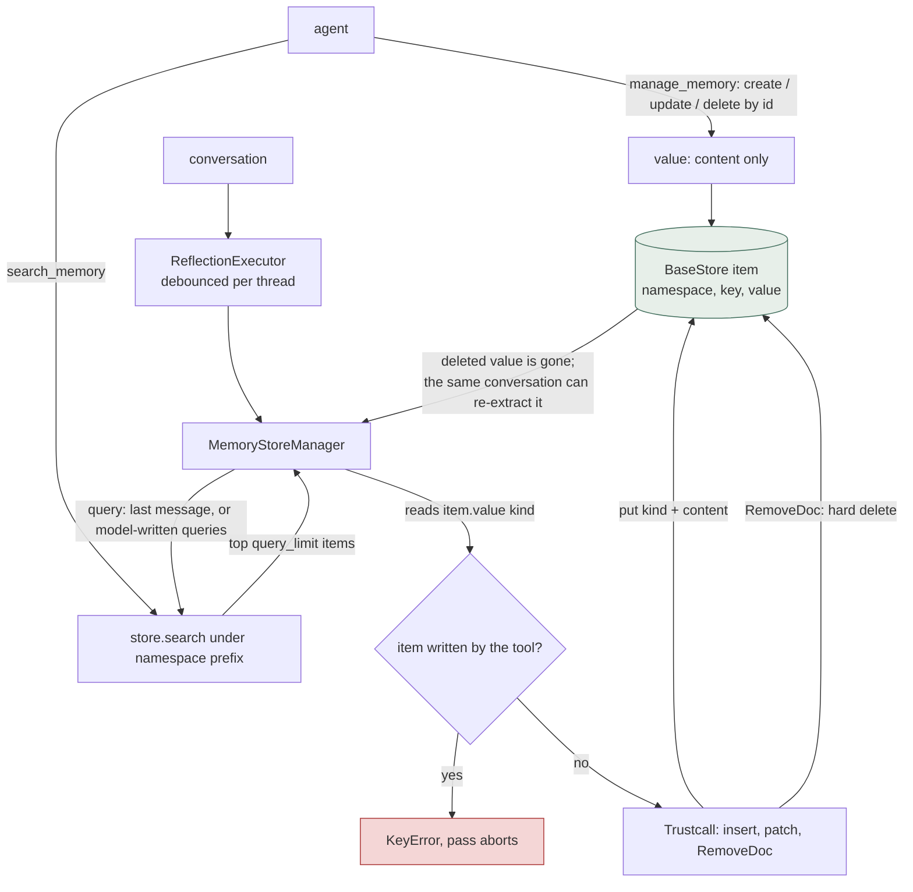
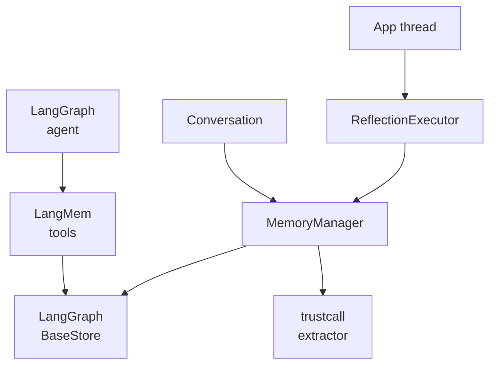

## 1. Executive Summary

LangMem is a set of LangGraph primitives for agent memory: two agent tools that
create, update, delete and search items in a LangGraph `BaseStore`, a background
manager that asks a model to insert, patch or remove memories through Trustcall,
and an executor that defers that pass. The notable property is the namespace
template, which fills the store namespace from run configuration and raises
rather than widening when a key is missing. The weak side is everything the store
does not do for it: no history, no provenance, no status, hard deletes, and no
committed test of any memory behaviour.

The package also carries prompt optimization (`src/langmem/prompts/`) and
message summarization (`src/langmem/short_term/`). The summarizer keeps a
running summary in graph state; it manages the context window and is not memory
in the sense this report covers. Persistence, indexing and ranking belong to
whichever `BaseStore` the application binds, so the scope boundary is a LangMem
value applied by a LangGraph predicate.

The tool path and the manager path cannot share a namespace subtree. The tool
writes `{"content": …}`, and the manager indexes `item.value["kind"]` on every
item it retrieves, so a manager whose search reaches a tool-written item raises
`KeyError` ([section 7](#7-write-mechanics)).

## 2. Mental Model

A memory is one store item: a namespace tuple, a key, and a JSON value. Nothing
on the item says where it came from or whether it is believed. It becomes a
memory when a tool call or the manager puts it, changes when either overwrites
the value at the same key, and stops existing when either deletes the key.
There is no intermediate state and no record of the value it replaced.

Two owners write. The agent decides in the hot path through `manage_memory`; a
model decides in the background through `MemoryStoreManager`, which reads the
top few existing items in its namespace and lets Trustcall return insert, patch
and `RemoveDoc` operations. The manager's instructions ask the model to caveat
uncertain memories *"with confidence levels (p(x))"*, and that confidence lives
only in the text it writes (`src/langmem/knowledge/extraction.py:185-206`).

Because a delete removes the row and nothing keeps the value, a fact the manager
removed, or that a caller removed through `MemoryStoreManager.delete`, can be
inserted again by the next pass over a conversation that still states it.

## 3. Architecture

LangMem is a library. It runs inside the caller's LangGraph process and
resolves the store from the runtime (`get_store()`) or from a `store=` argument
(`src/langmem/knowledge/tools.py:489-497`).

- `BaseStore` provides persistence and search: `InMemoryStore` in
  langgraph-checkpoint, `PostgresStore` in langgraph-checkpoint-postgres, or
  the store LangGraph Platform manages.
- `trustcall.create_extractor` turns model tool calls into insert, patch and
  delete operations over JSON documents.
- `RemoteReflectionExecutor` submits runs through the LangGraph SDK client.

### Deployment and ergonomics

Nothing has to run beyond the application: `InMemoryStore` works with no
database, and a semantic index needs an embedding provider. The manager needs a
chat model on every pass, so storing anything through it needs an API key; the
tools do not. `pip install langmem` resolves `langgraph>=0.6.0,<2` and
`langgraph-checkpoint>=2.0.12` with no upper bound on the second; on 8 September
2026 that was langgraph 1.2.11 and langgraph-checkpoint 4.2.0, the versions
`uv.lock` pins. langgraph-checkpoint-postgres is not a dependency and is
whatever the application installs.

The repository's own `langgraph.json` deploys two example graphs and an auth
handler. `src/langmem/graphs/semantic.py:27-37` assigns the manager twice, and
the surviving one writes to the literal namespace `("project", "team_1")`.
`src/langmem/graphs/auth.py:69-80` rewrites the namespace of each store request
from a non-Studio user to begin with that user's identity.

## 4. Essential Implementation Paths

**Hot-path write.** `create_manage_memory_tool()` validates the action against
`actions_permitted`, rejects an id on create and requires one on update or
delete, resolves the namespace, then calls `store.delete` or `store.put` with
`{"content": …}` (`src/langmem/knowledge/tools.py:263-337`). An update to an id
that does not exist creates it.

**Hot-path search.** `create_search_memory_tool()` resolves the namespace on
each call and passes the model's `query`, `filter`, `limit` and `offset` to
`store.search` (`src/langmem/knowledge/tools.py:433-474`). The namespace is not
a tool argument.

**Extraction.** `MemoryManager` builds one Trustcall extractor per step, adds a
`Done` tool from the second step, and returns `ExtractedMemory(id, content)`
tuples, including unchanged existing ones (`src/langmem/knowledge/extraction.py:217-339`).

**Background persistence.** `MemoryStoreManager.ainvoke` searches the
namespace, runs the manager and any configured phases, then writes changed items
back to their original namespace and key and deletes removed ones
(`src/langmem/knowledge/extraction.py:1006-1137`).

**Deferral.** `LocalReflectionExecutor` keeps a `PriorityQueue` in process and a
non-daemon worker thread; a submit for a thread id with a pending task cancels
that task (`src/langmem/reflection.py:254-329`, `:401-471`).
`RemoteReflectionExecutor` calls `runs.create` with
`multitask_strategy="rollback"` (`src/langmem/reflection.py:161-198`).

**Tests.** `tests/test_docstring_examples.py` and the two summarization suites
under `tests/short_term/`.

## 5. Memory Data Model

LangMem defines no persistent schema. The store item is LangGraph's: namespace
tuple, key, value, `created_at`, `updated_at`, and a score on search results.

- Tool items: `{"content": <schema instance, dumped to JSON>}`, keyed by a
  `uuid4` (`src/langmem/knowledge/tools.py:297-302`). The default schema is `str`.
- Manager items: `{"kind": <schema class name>, "content": …}`, keyed by the
  Trustcall document id, with a profile default at key `"default"`
  (`src/langmem/knowledge/extraction.py:1040-1056`, `:1100-1130`). The default
  schema is `Memory(content: str)` (`:86-93`).

Scope is the namespace. `NamespaceTemplate` replaces each `{var}` segment with
`configurable[var]` and raises `ConfigurationError` when one is missing
(`src/langmem/utils.py:58-91`). That exception subclasses `BaseException` so
the `ToolNode` error handler does not catch it and hand it back to the model
(`src/langmem/errors.py:1-6`).

The namespace is a prefix. The in-memory store compares tuples element-wise and
the Postgres store matches the path exactly or with a `.` separator, so a search
at `("memories", "{org_id}")` returns every user's items beneath that org, which
`docs/docs/guides/dynamically_configure_namespaces.md` offers as a pattern.

## 6. Retrieval Mechanics

The tools pass straight through: one `store.search` call, whatever ranking the
store applies, JSON-serialised results (`src/langmem/knowledge/tools.py:436-474`).

The manager chooses its own queries. With no `query_model` it searches with
dilated windows of the conversation, and the window count is
`query_limit // 4`; at the default `query_limit=5` that is one query made of the
last message alone (`src/langmem/knowledge/extraction.py:1031-1037`,
`src/langmem/utils.py:103-119`). With a `query_model`, the model writes parallel
search calls. Results are deduplicated by namespace and key, sorted by score and
cut to `query_limit` (`:992-1004`). The docstring says a `None` query model
falls back to the primary model (`:1708-1710`); the code falls back to the
windows.

`create_memory_searcher` is the same shape as a runnable: a model writes search
calls and the results are merged and sorted (`src/langmem/knowledge/extraction.py:695-816`).

There is no token budget, no temporal filter and no status filter on any read,
since there is no status to filter on. Retrieval quality is the store's.

## 7. Write Mechanics

Tool writes are synchronous and land on the next read. Manager writes cost at least one
model call per step, plus one per configured phase, plus one for the optional
query model. Under `ReflectionExecutor` they run after `after_seconds`, so a
memory is retrievable only once that delay and those calls finish. No pass
rewrites the whole store; each pass touches at most the `query_limit` items it
retrieved and whatever it inserts.

**Deletes.** `create_memory_manager` and `create_memory_store_manager` default
`enable_deletes=False` (`src/langmem/knowledge/extraction.py:544`, `:1675`). The
`MemoryStoreManager` constructor defaults it to `True` (`:845`), and a phase
without the key deletes (`:988`). The `create_memory_store_manager` docstring
says *"Defaults to True"* over a `False` default (`:1706-1707`).

**Overwrite, not history.** An update is a `put` of the new value at the old key.
The same docstring says the manager *"maintains a versioned history of all
changes"* (`:1685`); no code path keeps a prior value.

**The two writers in one namespace.** `ainvoke` builds its existing-memory list
with `item.value["kind"]` (`:1066`, and `:1210` in `invoke`). A tool-written item
has no `kind`, so a manager whose search reaches one raises `KeyError`. The
public `search` and `get` methods tolerate the missing key through
`_coerce_value` (`:1285-1295`). No documentation example puts both on one
namespace.

**Debounce replaces.** A resubmit for the same thread cancels the pending task
and queues the new payload (`src/langmem/reflection.py:308-328`). The executor
does not merge payloads, so the debounce holds the whole conversation only if
the caller submits the whole conversation; `docs/docs/guides/delayed_processing.md`
submits the latest exchange alone.

## 8. Agent Integration

- `create_manage_memory_tool(...)`: agent-callable create, update and delete,
  narrowed with `actions_permitted`.
- `create_search_memory_tool(...)`: agent-callable recall.
- `create_memory_manager(...)`: extraction over messages, returning memories
  without storing them.
- `create_memory_store_manager(...)`: the same, persisted to the store.
- `create_memory_searcher(...)`: a model-driven search pipeline.
- `ReflectionExecutor(...)`: local or remote deferral.

The agent has full write authority in its namespace. The tool description tells
it to call the tool proactively, including when a memory is *"incorrect or
outdated"* (`src/langmem/knowledge/tools.py:28-32`), and nothing on the tool
surface waits for anyone. Nothing injects memory into the prompt; the
application searches and formats, or the agent calls the search tool.

## 9. Reliability, Safety, and Trust

**Scope is only as strong as `configurable`.** The template refuses a missing
key, and every LangMem read carries the resolved namespace. The value is
whatever the caller supplied, and the README's first example uses the fixed
namespace `("memories",)`, which every user shares.

**The predicate belongs to the engine.** Before langgraph-checkpoint-postgres
3.1.1, released 30 July 2026, `PostgresStore` searched with `prefix LIKE
'<path>%'`, unanchored and unescaped, so `("memories", "al")` also read
`("memories", "alice")` and `_` matched any character. The latest release on
8 September 2026, 3.1.2, anchors the segment and escapes both
metacharacters (`libs/checkpoint-postgres/langgraph/store/postgres/base.py:1294-1308`
at `checkpointpostgres==3.1.2`). LangMem does not constrain that package.

**Remote runs drop the caller's configuration.** `RemoteReflectionExecutor`
sends only `thread_id` and a `namespace` key (`src/langmem/reflection.py:186-191`),
and the only reader of `configurable["namespace"]` is `prompts/stateful.py`,
which nothing imports. A remote manager's template resolves from whatever the
server puts in `configurable`.

**Deletion is hard.** The tool's delete becomes a `PutOp` with no value; the
in-memory store pops the item and its vectors, and Postgres deletes the row with
`store_vectors` following through `ON DELETE CASCADE`. Nothing records the
removed value, so a later extraction can restore it.

**Durability.** The local queue and worker live in process memory; pending
reflections are lost on a crash and drained on orderly shutdown
(`src/langmem/reflection.py:451-471`).

**Provenance and injection.** Items carry no source, thread or author. Whatever
the model extracts is stored as it wrote it.

## 10. Tests, Evals, and Benchmarks

Two suites exist, and neither is about long-term memory.

`tests/short_term/test_summarization.py` and its async twin hold 30 test
functions on the summarizer's message handling.

`tests/test_docstring_examples.py` collects Python blocks from function
docstrings under `src/`, the README and `docs/docs/`, and `exec`s them. A case
fails only if a block raises. The visitor handles `FunctionDef` alone, so class
docstrings, including `NamespaceTemplate`'s examples, and `async def` docstrings
are not collected (`tests/test_docstring_examples.py:97-128`). The examples call
Anthropic and OpenAI models, and `make doctest` starts a `langgraph dev` server
first. The one workflow that installs pytest, `deploy_docs.yml`, lints and
builds the documentation and does not run it.

No test asserts a resolved namespace, a cross-namespace miss, the manager's
insert, patch or delete decisions, or the tool-and-manager namespace conflict.
`pyproject.toml` lists `evals/gen` as a uv workspace member and the tree has no
`evals/` directory. No paper accompanies the repository.

Tests to require before relying on it: a write under one `user_id` and a search
under another; a template with a missing key; a manager pass over a namespace
holding a tool-written item; a deleted fact re-stated in the next conversation.

## 11. For Your Own Build

### Steal

- Resolve the scope key from run configuration, never from a tool argument, and
  make a missing key an exception that the tool runtime cannot turn into a retry.
- Keep the namespace off the agent's tool schema entirely, so the model cannot
  name another scope even by mistake.
- Narrow the agent's write verbs per tool with an `actions_permitted` tuple that
  also shapes the tool description.
- Debounce background extraction per thread, cancelling the pending pass.

### Avoid

- Two writers with different value shapes in one store. Give every item one
  envelope, or give each writer a namespace the other cannot reach.
- Prefix-scoped reads without saying so. A subtree boundary is a design choice;
  an undocumented one is a leak waiting on a shorter template.
- Confidence requested in prompt text. It cannot be filtered on, and the next
  pass may rewrite it.
- Docstrings that describe history and defaults the code does not have.

### Fit

LangMem suits a team on LangGraph that wants the agent to hold its own memory,
will choose and operate the store, and will write the policy itself. It asks
little: no service, no schema, a tool list. It is the wrong base for anyone who
needs to explain or undo a memory, because the store it writes to keeps
neither. The background manager is the half to treat as an example rather than a
component, given the item-shape conflict and the untested extraction. Teams off
LangGraph gain little, since the tools are thin and the scope predicate is the
engine's.

## 12. Open Questions

- Whether langgraph-api applies `auth.on.store` handlers to a graph's
  in-process store calls, or only to the HTTP store API; the answer decides
  whether `graphs/auth.py` scopes what `graphs/semantic.py` writes.
- Which keys LangGraph Platform puts in `configurable` for a run created by
  `RemoteReflectionExecutor`, and whether `langgraph_user_id` is among them.
- `LocalReflectionExecutor` built without `store=` resolves a store at submit,
  does not assign it, and the worker overrides the runtime's store with
  `self._store` (`src/langmem/reflection.py:295-306`, `:424-431`); whether the
  documented `ReflectionExecutor(memory_manager)` persists anything was not run.
- How retrieval quality varies across `BaseStore` implementations and index
  configurations.

## Appendix: File Index

- Namespace template: `src/langmem/utils.py`, `src/langmem/errors.py`.
- Memory tools: `src/langmem/knowledge/tools.py`.
- Extraction and store manager: `src/langmem/knowledge/extraction.py`.
- Reflection executor: `src/langmem/reflection.py`.
- Example deployment: `langgraph.json`, `src/langmem/graphs/semantic.py`,
  `src/langmem/graphs/prompts.py`, `src/langmem/graphs/auth.py`.
- Unreached: `src/langmem/graph_rag.py` is comments only;
  `src/langmem/prompts/_layers.py` and `src/langmem/prompts/stateful.py` are
  imported by nothing.
- Short-term summarization: `src/langmem/short_term/summarization.py`.
- Tests: `tests/test_docstring_examples.py`, `tests/short_term/`.
- Engine, at `checkpoint==4.2.0` and `checkpointpostgres==3.1.2` in
  langchain-ai/langgraph: `libs/checkpoint/langgraph/store/memory/__init__.py`,
  `libs/checkpoint-postgres/langgraph/store/postgres/base.py`.

## Appendix: Recorded Searches

Run in a full clone at the pinned revision, from the repository root, and in a
depth-1 clone of langchain-ai/langgraph at the tags named.

| Claim | Check | Result at this pin |
| --- | --- | --- |
| No tombstone, status, validity time, audit record or review state | `rg -n -i 'tombstone\|reject\|suppress\|verified\|candidate\|status\|valid_from\|valid_at\|bitemporal\|audit\|approve\|review\|interrupt' src` | HTTP status codes in `graphs/auth.py`, commented-out entity candidates in `graph_rag.py`, a `status` filter value in two docstring examples, and the gradient optimizer's prompt text |
| Confidence exists only as prompt text | `rg -n -i 'confidence\|provenance\|source_' src/langmem/knowledge` | `extraction.py:191` and `:203`, both inside `_MEMORY_INSTRUCTIONS` |
| No code keeps a prior value | `rg -n 'versioned\|history' src/langmem/knowledge` | `extraction.py:1685`, a docstring, and `:1734`, a Mermaid label |
| `ainvoke` and `invoke` read `kind` without a guard | `rg -n 'value\["kind"\]' src` | `extraction.py:1066`, `:1109`, `:1210`, `:1251`; and `:1290`, behind the check at `:1288` |
| `configurable["namespace"]` has one reader, unimported | `rg -n 'configurable"\]\["namespace' src`, then `rg -n '(_layers\|stateful)' src` | `prompts/stateful.py:20`; the second search returns nothing |
| `graph_rag.py` has no code | `rg -n -v '^\s*(#\|$)' src/langmem/graph_rag.py` | nothing |
| No test touches the memory tools, the manager or the template | `rg -n 'NamespaceTemplate\|MemoryStoreManager\|create_memory_store_manager\|create_search_memory_tool\|manage_memory' tests` | nothing |
| The harness collects function docstrings only | `rg -n 'def visit_' tests/test_docstring_examples.py` | `visit_FunctionDef` and `visit_ClassDef`; no `visit_AsyncFunctionDef` |
| No CI step runs pytest | `rg -n 'pytest\|doctest' .github/workflows` | `deploy_docs.yml:52-53`, package installs only |
| No `evals/` directory at the pin | `git ls-tree -d HEAD evals` | nothing |
| Postgres prefix predicate before and at the resolved release | `curl` of `libs/checkpoint-postgres/langgraph/store/postgres/base.py` at `checkpointpostgres==3.1.0` and `==3.1.2`, then `rg -n 'prefix LIKE'` | `store.prefix LIKE %s` with `f"{path}%"` at 3.1.0; `_namespace_prefix_condition` with an escaped `path.%` at 3.1.2 |

## History

**2026-09-30** — [`9d033b47d9ce53e37e92c92241b0496c0278932e`](https://github.com/langchain-ai/langmem/commit/9d033b47d9ce53e37e92c92241b0496c0278932e) — audit at the same commit, which is upstream HEAD. `scope_enforced` holds, re-read into langgraph-checkpoint 4.2.0 and checkpoint-postgres 3.1.2; its record said tests cover namespace substitution, and none asserts it. Three published claims were wrong: a background extraction restating what the agent deleted through its tool, where the manager raises `KeyError` on tool-written items ([section 7](#7-write-mechanics)); `graph_rag.py` as an extra, where it is comments only; paths prefixed `langmem/`. Added: the manager's default query is the last message, the Postgres prefix predicate was unanchored before 30 July 2026, and remote reflection drops the caller's configuration ([section 9](#9-reliability-safety-and-trust)). Screen: no auto-run surface, two build-time execution points, nothing inside the cooldown; nothing installed, built or run.

**2026-09-15** — [`9d033b47d9ce53e37e92c92241b0496c0278932e`](https://github.com/langchain-ai/langmem/commit/9d033b47d9ce53e37e92c92241b0496c0278932e) — second reading, eight commits on: dependency modernisation, a tornado bump, Dependabot alert fixes and documentation formatting. `src/` did not change. Screened again: no auto-run surface, two build-time execution points, nothing inside the cooldown; nothing was installed and nothing was run. `scope_enforced` was re-tested at the producer and holds, and now carries the evidence record it had been asserted without — including that a namespace template with a missing configuration key raises rather than widening.

**2026-08-06** — [`7c7ebf36b5e1697001f92eed77c43e3d541decd7`](https://github.com/langchain-ai/langmem/commit/7c7ebf36b5e1697001f92eed77c43e3d541decd7) — 10 commits on, and the entire diff is `uv.lock`: 155 insertions, 153 deletions, one file. No Python changed. The mechanism is unchanged and no published claim is stale. Screened again: `uv.lock` moved within the seven-day cooldown, so nothing was installed; 2 build-time exec paths.

**2026-07-26** — [`c01e273b94aa4c06e41d0ed1ccce0db17de2bc11`](https://github.com/langchain-ai/langmem/commit/c01e273b94aa4c06e41d0ed1ccce0db17de2bc11) — first reading.
