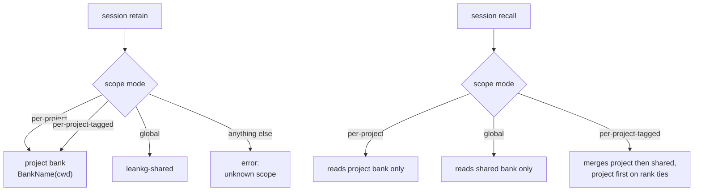

## 1. Executive Summary

LeanKG is an Apache-2.0 code knowledge graph for coding agents — 97,573 lines of
Go across 625 commits, serving 30 actions behind three MCP tools — and the reason
it is in this atlas is the memory layer beside the graph. `internal/memory`
(1,922 lines) keeps a project-anchored tree of plain markdown under
`<project>/.leankg/memory`: bounded `MEMORY.md` and `USER.md` core files,
unbounded `topics/*.md`, mnemopi-compatible JSONL transcript banks, and an FTS5
index in its own SQLite file. The graph is derived from source and is not memory;
the markdown tree is written by the agent, survives the session, and can be
scoped, searched and deleted.

Two marks. `scope_enforced` for a boundary enforced twice over — a bank-routing
matrix with three modes, and a path resolver that refuses absolutes, `..`
segments, anything outside a three-shape allowlist, and symlinks that escape the
root in either direction. `negative_eval` for an end-to-end test that writes a
global memory and a project memory and then asserts each is invisible to the
other's read, with the merged read returning exactly two rows as the control.

**The line worth carrying away is a comment in `scope.go`.** LeanKG's memory
layer is a port of a Rust implementation that was removed at a parity cutover,
and the port did not reproduce one of its behaviours:

> Unlike the reference — which silently fell back to per-project for ANY unknown
> string — an unrecognized scope is an error: a typo must not quietly retarget a
> session's memories.

A scope argument that falls back on a typo does not fail; it writes somewhere
else and reads from somewhere else, and both look like working. Turning that into
an error is a one-line change and the kind this corpus finds most often *after*
it has cost somebody a memory.

## 2. Mental Model

Two stores that do not mix. The knowledge graph is built from the repository and
rebuilt from it — losing it costs an index. The memory tree is what the agent
wrote and nothing else can regenerate — losing it costs the memory. The code
keeps them in separate files under separate roots, and the FTS5 index is
explicitly *"its own sqlite file, not the store"*, so the searchable copy is
derived and the markdown is authoritative.

Within the memory tree there are two tiers with different rules. `MEMORY.md` and
`USER.md` are core files bounded at `CoreFileBytes = 2200`, and the bound is
enforced by refusal: *"Writes that would push a core file past this size fail
with `ErrOverflow` rather than truncating."* `topics/*.md` are unbounded. The
split means the always-loaded part has a hard ceiling while the recallable part
does not, which is the right way round — a budget belongs on what is injected,
not on what is kept.



## 3. Architecture

One Go module. `internal/memory` holds the markdown layer, its scope matrix, the
FTS5 side index and the JSONL bank adapter. Around it sit the graph packages —
`graph`, `index`, `ontology`, `orgknowledge`, `prdindex` — plus `mcp`, `rest`,
`rpc`, `session` and a `ui-v2` front end. The README records that the Rust engine
was removed at a parity cutover and the whole engine is now the root Go module.

The agent surface is deliberately narrow: three MCP tools — `import`, `query`,
`status` — serving 30 actions, against peers the README counts at roughly one to
seventeen raw tools. Whether that is better for an agent is a design argument the
report does not settle, but it is a real and unusual choice.

## 4. Essential Implementation Paths

- **Resolve.** Every read and write goes through `Memory.resolve`
  (`internal/memory/memory.go:113-153`): empty path rejected, absolute path
  rejected, any `..` segment rejected, then an allowlist of exactly three shapes
  — `MEMORY.md`, `USER.md`, `topics/<name>.md` with no nested slash — then
  `EvalSymlinks` on the parent and a symlink check on the file itself, refusing
  a dangling or escaping link *"rather than create through it"*.
- **Write.** `Create`, `StrReplace`, `Insert` — `bound()` refuses a core-file
  write past 2,200 bytes with `ErrOverflow`; `replaceOnce` refuses an ambiguous
  replacement rather than picking an occurrence.
- **Search.** `memory_index` is an FTS5 virtual table over `(path, body)` with
  `unicode61` tokenisation, in `index.db` beside the tree.
- **Session recall.** `SessionRecall(scope, cwd, bank, query, limit)` resolves
  the read banks from the scope mode, merges in mode order, and drops
  zero-match rows — *"zero-match entries never surface"*.
- **Inject.** `InjectBlock(entries, limit, tokenBudget)` renders a `<memories>`
  block, default limit 8 and budget 5,000, and when the budget runs out
  mid-entry it drops the remaining entries whole — *"never a truncated
  half-memory"* — returning `""` on an empty result so the caller omits the
  block rather than injecting an empty one.

## 5. Memory Data Model

A memory is a markdown file. The core files are whole documents bounded by byte
count; topic notes are whole documents unbounded. The bank rows are JSONL
entries in a mnemopi-compatible format, carrying content, a session key and a
rank position — there is no status field, no confidence, no supersession pointer
and no validity interval anywhere in the layer. A correction is an edit through
`StrReplace` or a `Delete`, and `Delete` removes the file and its index rows.

That absence is the report's main negative finding and is stated rather than
implied: a search of `internal/memory` for a status vocabulary — draft, pending,
approved, verified, rejected — returns nothing, so `trust_state` is withheld;
`Delete` erases with no record keyed on what was removed, so `tombstone` is
withheld; there is no approval surface, so `human_review` is withheld; and the
only journal in the layer is SQLite's own WAL pragma, so `audit_log` is withheld.
This is a memory that can be written, scoped, searched and removed, and cannot be
doubted.

## 6. Retrieval Mechanics

FTS5 over `(path, body)` for the markdown tree, and a unique-query-token overlap
for the bank rows, with zero-match rows filtered before they reach a caller. The
merge for `per-project-tagged` is ordered rather than scored: project rows come
before shared rows on rank ties, which the end-to-end test asserts by content.

The injection contract is where the care shows. A cap on entries *and* a token
budget, entries dropped whole rather than truncated, and an empty result
rendering as no block at all. Three separate decisions, each of which this corpus
has seen go the other way: a limit with no budget, a budget that cuts mid-record,
and an empty `<memories>` block that teaches a model the store is empty when the
filter was simply narrow.

## 7. Write Mechanics

`StrReplace` is unique-substring replacement — `replaceOnce` returns an error
when the old text appears more than once, so an edit that could land in two
places lands in neither. `bound` refuses rather than truncates on the core files.
`Rename` moves the file and updates the index rows together. `Delete` removes the
file then the rows.

Nothing in the layer is transactional across the file and the index: the file
operation happens first and the index update second, so a crash between them
leaves an index row for a file that is gone. The FTS index is derived and
rebuildable, which is the right side of that failure to be on, and the package
comment says the index is not the store.

## 8. Agent Integration

MCP with three tools over 30 actions, a REST surface, an RPC surface and a
session layer. `LEANKG_PROJECT_DIRS` serves several projects from one HTTP
server with a per-request `project` argument, which makes the bank scope the
thing separating one project's memories from another's on a shared endpoint.

`AGENTS.md`, `CLAUDE.md` and `GEMINI.md` are all present and were read as data.

## 9. Reliability, Safety, and Trust

**Scope enforced — awarded, and enforced in two independent places.** The bank
matrix routes a write to the project bank or the shared bank and decides which
banks a read merges, and `ParseScope` refuses an unrecognised mode instead of
falling back — the behaviour change from the Rust reference the port called out
by name. Underneath it, `resolve` bounds every path operation to the memory root:
absolutes and `..` rejected before anything touches the filesystem, a
three-shape allowlist, `EvalSymlinks` on the parent directory, and an `Lstat`
plus resolve on the file so a symlink pointing out of the root is refused rather
than followed. `TestSymlinkEscapeRejected` and `TestPathValidation` pin both
halves.

**Negative eval — awarded.** `TestSessionScopesEndToEnd`
(`internal/memory/memory_test.go:511-573`) writes one global memory mentioning
postgres and one project memory mentioning redis, then asserts the shared bank
file does not contain `redis` at all, that a per-project recall for `postgres`
returns zero rows, and that a global recall for `redis` returns zero rows. The
control is in the same test: the tagged read returns exactly two rows with redis
first and postgres second, so the corpus is proven populated and neither
exclusion can pass on an empty store. `TestRecallZeroMatchFiltered` sits beside
it.

**Trust state, tombstone, human review, audit log — withheld, and the reason is
the same one four times.** This layer has no epistemic vocabulary. A memory is a
file; it is current because it is there. There is no status to move a memory
between, no record of a value that was rejected, no surface on which a person
approves anything, and no append-only log of what changed — SQLite's WAL is a
durability mechanism, not a mutation record. The design is coherent: it is a
scratchpad with a search index and a boundary, and it does not pretend to be a
ledger.

**What the bounds get right.** Three separate refusals rather than three silent
accommodations — an overflowing core write fails rather than truncating, an
ambiguous replacement fails rather than choosing, and an exhausted injection
budget drops whole entries rather than cutting one in half. Each of those is a
place where the accommodating version would have produced a plausible wrong
result instead of an error.

## 10. Tests, Evals, and Benchmarks

1,077 test functions across `internal/` and `cmd/`; eighteen of them in the
memory package, named for the property each pins — path validation, symlink
escape, core-file overflow, ambiguous replace, FTS round trip, deterministic bank
names, cursor resume, zero-match filtering, scope parsing, the scopes
end-to-end, injection budgets, and that a session makes no writes to `$HOME`.

**The engine benchmark is rigorous and measures the wrong thing for the headline
claim.** `benchmark/ab/REPORT.md` compares the removed Rust binary against the Go
engine on a synthetic 100-file corpus, and its provenance discipline is worth
copying: both arms pinned to commits, the corpus generated by a committed script,
medians over at least three trials per arm, and a harness that *"refuses"* a run
whose pins cannot be resolved to 40-hex commits and a 64-hex prompt-template
hash before any row lands. That is a performance comparison between two
implementations of the same engine.

**The published cost claim is a different claim and is not reproducible from this
tree.** The README's header and its comparison table both state *"−65% tokens,
−85% tool calls"*. `benchmarks/cross_tool/` is the harness that would produce it
— `run_one.sh`, `run_arm.sh`, `run_repo.sh`, `aggregate.py`, `score.py`,
`clone_repos.py`, `repos.yaml`, a Makefile and an MCP install script, comparing a
fixed `claude -p` agent with and without LeanKG across seven real repositories,
with the metric sources named per column and medians matching the methodology it
benchmarks against. No result file is committed, and the directory's `.gitignore`
excludes the cloned repos and the scratch transcripts rather than a results file,
so the absence is not a gitignore artefact.

The only committed A/B token measurement in the tree points the other way and is
archived: `docs/archive/analysis/ab-testing-results-2026-04-08.md` reports seven
test cases, **0 of 7** showing token savings, a total overhead of **+41,048
tokens**, and LeanKG winning 2 of 7 on F1 with 5 ties — its own stated finding
being *"better context correctness ... but at a token overhead"*, with the note
that the deduplication optimisations *"may not be fully deployed"*. That run
predates the parity cutover and the three-tool consolidation by five months, so
it is not evidence that the current claim is false. It is the only number of its
kind a reader of this repository can check, and it disagrees with the header.

**No paper describes this system.** A search for `arxiv`, `bibtex`, `@article`,
`@misc`, `citation` and `doi.org` across the markdown and manifests returns
nothing, and `find . -iname 'CITATION*'` returns nothing.

## 11. For Your Own Build

- **Make an unknown scope an error.** The one-line difference between this port
  and its reference is the difference between a typo that fails and a typo that
  writes a session's memories somewhere else and reads an empty result back.
- **Bound the always-loaded tier and leave the recallable tier unbounded.** A
  2,200-byte ceiling on the core files with an unbounded topics directory puts
  the budget where the cost is.
- **Refuse rather than accommodate, in all three places.** Overflow fails instead
  of truncating; an ambiguous replacement fails instead of choosing; an exhausted
  injection budget drops whole entries instead of half of one.
- **Return no block rather than an empty one.** `InjectBlock` renders `""` on an
  empty result, so a model is never shown an empty `<memories>` section it will
  read as *there is nothing*.
- **Keep the search index out of the store.** The package comment says the FTS5
  file is *"its own sqlite file, not the store"*, which is what makes the
  non-transactional file-then-index write acceptable: the derived half is the
  half that can be rebuilt.
- **Pin both arms of a benchmark and refuse a run that cannot be pinned.** The
  A/B harness will not record a row whose commits and prompt hash do not resolve.

## 12. Open Questions

- The `−65% tokens / −85% tool calls` headline has a complete harness and no
  committed result, and the only committed token A/B in the tree reports an
  overhead. Running `benchmarks/cross_tool` and committing the aggregate would
  settle it in one direction or the other.
- The file operation and the index update are not transactional. The index is
  rebuildable, so the exposure is a stale row rather than a lost memory, but
  nothing in the layer detects or repairs the gap.
- A shared HTTP server with `LEANKG_PROJECT_DIRS` makes the bank scope the only
  separation between projects, and the scope arrives as a request argument. The
  memory layer validates the value; it does not establish who may ask for it.

## Appendix: File Index

- Memory layer: `internal/memory/memory.go` — package comment and layout (1-13),
  `CoreFileBytes` (26), `Open` (67), `resolve` (113-153), `within` (156),
  `Snapshot` (163), `Create` (216), `StrReplace` (232), `Insert` (256),
  `Delete` (289), `Rename` (302), `replaceOnce` (323), `bound` (332).
- Scope matrix: `internal/memory/scope.go` — `SharedBank` (11), `ParseScope`
  (29-40) with the divergence comment, `WriteBank` (55).
- Banks and injection: `internal/memory/banks.go` — `InjectBlock` (542-560),
  zero-match filtering (485).
- Search: `internal/memory/search.go:29` — the FTS5 virtual table.
- Tests: `internal/memory/memory_test.go` — 18 cases, `TestPathValidation` (41),
  `TestSymlinkEscapeRejected` (63), `TestCoreFileOverflow` (84),
  `TestAmbiguousReplace` (115), `TestRecallZeroMatchFiltered` (356),
  `TestParseScopeModes` (390), `TestSessionScopesEndToEnd` (511),
  `TestInjectBlockBudgets` (613), `TestSessionHermeticNoHomeWrites` (640).
- Benchmarks: `benchmark/ab/REPORT.md` and `harness.go` (Rust vs Go, pinned);
  `benchmarks/cross_tool/` (the token/tool-call harness, no committed result);
  `docs/archive/analysis/ab-testing-results-2026-04-08.md` (archived, +41,048
  tokens).

**Searches recorded for the negative claims**

```sh
grep -rniE 'status.*=.*"(draft|pending|approved|verified|rejected)"|approv' --include='*.go' internal/memory/  # 0: no epistemic vocabulary, no approval surface
grep -rniE 'audit|journal|event.?log' --include='*.go' internal/memory/   # 1 hit, the SQLite WAL pragma in search.go:20
find benchmarks/cross_tool -type f                                        # harness complete, no result file; .gitignore excludes repos/ and scratch/ only
grep -riE 'arxiv|bibtex|@article|@misc|citation|doi\.org' --include='*.md' --include='*.toml' .   # 0
find . -iname 'CITATION*' -not -path './.git/*'                           # 0
```

## History

**2026-09-17** — [`fabca1fe07982fe0d53f941cdc38a3357f5cd830`](https://github.com/FreePeak/LeanKG/commit/fabca1fe07982fe0d53f941cdc38a3357f5cd830) — first reading, at the head of `main`, 625 commits in. Screened with `scripts/screen_repo.py` first: one auto-run surface, two build-time execution paths, two manifests inside the seven-day cooldown, one unpinned surface, and three agent-directed files (`AGENTS.md`, `CLAUDE.md`, `GEMINI.md`) read as data. Nothing was installed, built or run — no `go build`, no `make`, no npm. Two marks, both on the memory layer rather than the knowledge graph, which is derived from source and is not agent memory. The four withheld marks are stated in section 9 with the one reason they share. The README's `−65% tokens / −85% tool calls` claim was checked against the tree rather than repeated: the harness is committed and complete, no result is, and the only committed token A/B is an archived April run reporting an overhead.
