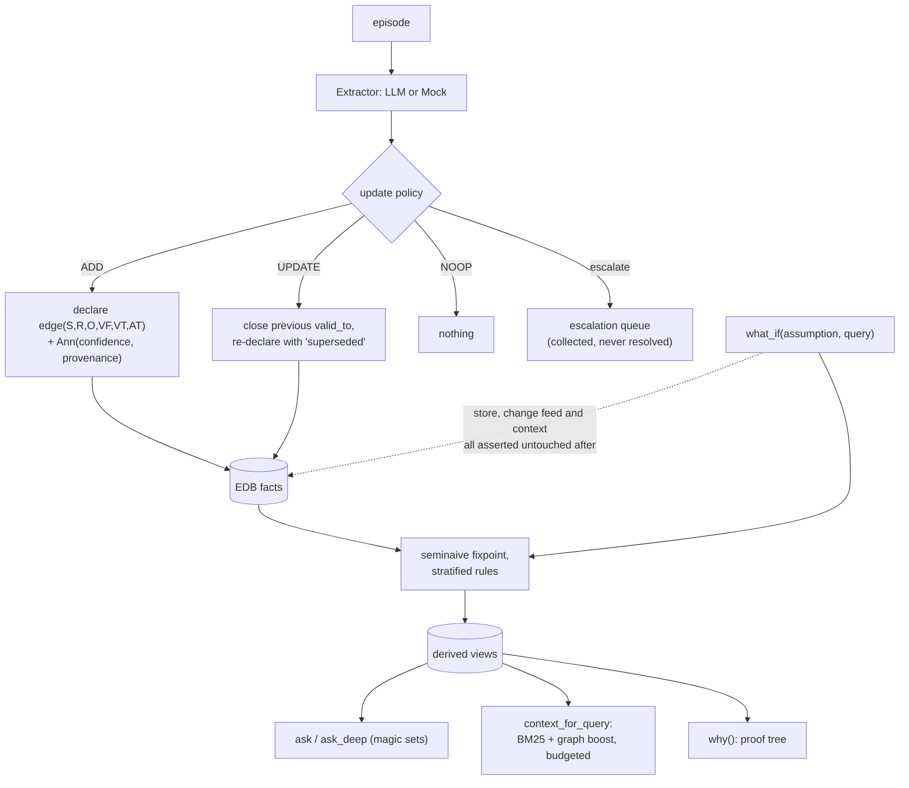

## 1. Executive Summary

Lemmalog is a Datalog engine for agent memory — about 11,700 lines of Rust, a
runtime-parsed stratified interpreter with seminaive fixpoint, semiring
annotations, magic-sets demand evaluation, proof trees and an MCP server. Its
thesis is stated plainly in the README:

> an agent's memory should be a deductive database — the agent builds a
> *verifiable model of what it knows* and mechanically reasons over how that
> knowledge changes, rather than "remembering better" than a vector store.

Memory here *is* a logic program rather than a store a program queries. Base facts
are asserted at the extraction boundary; rules derive closures, temporal
projections, contradiction candidates and relevance diffusion; each turn updates
derived views incrementally rather than re-deriving them.

**One mark**, and the reason is not that the engine is thin. It is that the
epistemics here are *continuous and structural* rather than discrete: confidence
is a semiring annotation fused by a product t-norm, provenance is a set union of
episode ids, and neither is a status a memory can be in. The rubric asks for
discrete state, an enforced scope key, an append-only mutation record — and this
design answers those questions with algebra instead.

**The finding worth the reading is a gap between the status table and the shipped
code**, and it is worth stating carefully because the project's status table is
otherwise unusually honest — twenty-seven rows marked shipped and one marked
`🚧 future phases`, for leapfrog triejoins and DBSP streaming.

One row reads:

> | Bi-temporal facts via `valid_from`/`valid_to`/`asserted_at` columns + `now()` | ✅ |

The engine does support it: arity is arbitrary, `now()` is a builtin parsed in
`src/ast.rs:246`, and a user writing their own rules could put a transaction time
in a position and query it. What ships in the agent layer does not. `assert_open`
(`src/agent.rs:503-513`) builds a six-position tuple:

```rust
Value::Int(self.engine.now),    // valid_from
Value::Int(i64::MAX),           // valid_to
Value::Int(self.engine.now),    // asserted_at
```

`valid_from` and `asserted_at` receive **the same value on every assertion**, and
the one shipped temporal rule discards the position entirely:

```prolog
current(E,R,O) :- edge(E,R,O,VF,VT,_), now(T), VF =< T, T < VT.
```

The `_` is `asserted_at`, and it is the only rule in the tree that reads `edge`.
Both `query("edge", ...)` calls pass `None` for that position. So through
`AgentMemory` a caller cannot record that something was true from January but
learned in August, and cannot ask what the store believed in August. The column
is there; the second clock is not running.

**`bitemporal` is withheld** on that basis — the same test this atlas applied to
two other systems today, in both directions.

## 2. Mental Model

Memory is a stratified logic program, and the interesting operations are
derivation, retraction and hypothesis.



## 3. Architecture

A crate. No service, no database: facts are interned into an in-process store with
per-position secondary indexes and WAM-style trail backtracking, snapshotted to
disk as episodes, EDB facts and rules with the derived views rebuilt on load.

Distribution is four surfaces over the same engine — the Rust library, an MCP
server behind `--features mcp`, a REPL, and an agent skill directory.

The screen is clean: no auto-run surface, no build-time execution, and a
`Cargo.lock` unchanged for eleven days. That is unusual enough in this corpus to
record.

## 4. Essential Implementation Paths

- **Engine** — `src/eval.rs` (1,972 lines: fixpoint, deltas, retraction),
  `src/ast.rs` (parser, `now` builtin at 246), `src/semantics.rs`,
  `src/magic.rs` (demand evaluation), `src/intern.rs`.
- **Agent facade** — `src/agent.rs`: the policy comment (7, 420), the shipped
  `current` rule (341), exclusive-predicate close-out (472-484),
  `assert_open` (503-513), escalation queue (322, 330, 388).
- **Canonicalization** — `src/canonical.rs`; the rule set is quoted in the README.
- **Retrieval** — `src/retrieval.rs`, `src/session.rs`.
- **Evaluation** — `src/scenario.rs` (`run_eval`), `src/longmemeval.rs`,
  `src/bin/lemmalog-bench.rs`.
- **Design document** — `datalog-context-engine-design.md:78-100` (the eight-column
  tuple the agent layer ships six of).

## 5. Memory Data Model

The design document specifies eight positions — entity, relation, object,
`valid_from`, `valid_to`, `asserted_at`, confidence, provenance — with the last
two as semiring annotations rather than columns. In the shipped agent layer the
tuple is six positions and the annotations live in `Ann`, which is the cleaner
arrangement and matches the design's own note that annotations *"live in a
semiring/lattice, not ad-hoc columns"*.

Confidence fuses by a product t-norm; provenance is set union over episode ids, so
*"every derived fact answers 'why do I believe this'"*. **`trust_state` is
withheld**: a confidence in [0,1] is a score, and nothing here is a discrete
status that withholds a fact from a reader.

**`tombstone` is withheld**, and the supersession is worth describing because it is
careful. When an exclusive predicate gets a new value, the old edge is retracted
and immediately re-declared with `valid_to` closed to now and a provenance
annotation of `superseded` (`src/agent.rs:478-482`). The old value is kept, dated
and labelled — which is more than most manage — and nothing is keyed on the
rejected value, so the same triple asserted again is a new open edge.

## 6. Retrieval Mechanics

Three surfaces. `ask` is a read-only Datalog query; `ask_deep` uses magic sets so a
point query does not force a full fixpoint; `context_for_query` assembles a
budgeted context with BM25 plus entity and graph boosting, and a
`ContextAssembler` that puts distilled material at the top and verbatim provenance
at the bottom.

`why()` returns a proof tree with cycle protection — the answer to "why do I
believe this" is a derivation rather than a citation, which is a different and
stronger thing than most provenance in this corpus.

**`scope_enforced` is withheld** for absence. There is no principal, tenant or
agent key on a tuple and no predicate on any read:

```sh
grep -rn "tenant\|agent_id\|principal" src/*.rs
```

Nothing at the pinned commit. One store per process is the model.

## 7. Write Mechanics

An `Extractor` trait sits at the ingestion boundary with a memoized mock and an
LLM implementation, and a deterministic policy chooses ADD, UPDATE, NOOP or
escalate.

**Escalation is the honest branch and the incomplete one.** A conflicting value on
an exclusive predicate escalates rather than silently overwriting, which is the
right instinct — and the escalations land in a `Vec<String>` exposed by
`m.escalations()` that nothing resolves. The examples print the queue. There is no
operation to accept, reject or clear an escalation, so **`human_review` is
withheld**: the decision is deferred to an embedder who is handed a list.

Maintenance runs on a time advance — the source calls it *"the sleep-time slot"* —
rather than on a timer, so a caller controls when derived views catch up.

## 8. Agent Integration

An MCP server exposing the engine as tools, plus a REPL and a skill directory. The
agent-facing contract is Datalog: an agent that can write a rule gets the whole
engine, including `why` and `what_if`.

## 9. Reliability, Safety, and Trust

Two design decisions stand out.

**Identity conflicts derive a fact instead of merging.** The canonicalization rules
are star-shaped — the LLM proposes `alias(Local, Canonical)` edges and Datalog
derives the closure — and topology violations, a local with two canonicals or a
name that is both local and canonical, produce `alias_conflict` facts rather than
collapsing two entities into one. Merging identities is the irreversible error in
an entity resolver, and refusing to guess is the correct failure.

**The hypothetical is provably clean.** `what_if` evaluates a query under an
assumed fact and restores the store byte-identically, and the test asserts not just
that the store is unchanged but that the change feed recorded nothing and the
assembled context does not mention the assumption. A lookahead that leaked into
the change log would corrupt every downstream incremental view.

What is absent is governance. No scope, no discrete status, no review resolution,
and no append-only record of mutations — the epoch change-log is a delta feed over
derived views, which is a materialisation mechanism rather than an audit of what
changed and why. **`audit_log` is withheld** on that distinction; provenance
answers *why do I believe this*, which is a different and arguably better question,
and not the one the mark asks.

## 10. Tests, Evals, and Benchmarks

The suite is the clearest evidence of how seriously the engine is taken. Beyond the unit tests,
the status table claims **differential testing — 450 random programs checked
against a naive fixpoint oracle, plus parser fuzzing**, which is the right way to
test a Datalog implementation and is rare at this scale of project.

`src/scenario.rs::run_eval` is a synthetic harness reporting accuracy, tokens and
latency against ground truth, and `src/longmemeval.rs` plus
`src/bin/lemmalog-bench.rs` wire the engine to an external benchmark. No committed
result file was found for either.

The case that earns `negative_eval` is described in section 9 and the frontmatter.

No paper and no `CITATION.cff`; the design document is the closest thing and it is
a design document rather than an evaluation.

Nothing was run. The screen is clean, so the reason is budget rather than caution
— `cargo test` on an 11,700-line crate would have been safe here, and the claims
about tests in this report are claims about their committed source.

## 11. For Your Own Build

### Steal

**Make a hypothetical prove it left nothing behind.** Asserting that the store is
unchanged is the obvious half. Asserting that the *change feed* recorded nothing
and the *assembled context* does not mention the assumption is the half that
catches a leak into downstream incremental views.

**Derive a conflict fact instead of merging identities.** `alias_conflict` for a
local with two canonicals is a refusal to guess, and it is the error that cannot be
undone once made.

**Answer "why" with a derivation, not a citation.** A proof tree with cycle
protection tells a reader how a belief was reached; a list of source ids tells them
where to look.

**Keep the superseded tuple, dated and labelled.** Closing `valid_to` and
re-declaring with a `superseded` provenance annotation costs one write and keeps
the history queryable.

**Publish a status table with a row that says not yet.** One `🚧` among
twenty-seven `✅` is what makes the twenty-seven readable.

### Avoid

**Shipping a transaction-time column your writer sets to the valid time.** The
position exists, every assertion fills it with the same clock, and the only rule
that reads `edge` discards it. A reader of the status table would reasonably
believe they can ask what the store knew last month, and through the agent facade
they cannot.

**Collecting escalations nobody can resolve.** A queue with no accept or reject
operation is a list of unfinished decisions that grows.

### Fit

This suits someone who wants agent memory to be inspectable and mechanically
reasoned about — who would rather debug a rule than a ranking function, and who
values a proof tree over a similarity score. As a piece of engineering the design holds
together unusually well end to end.

It is the wrong fit where memory must be scoped between principals, where a wrong
belief must be recorded as wrong rather than dated out, or where the team cannot
write Datalog — the rules *are* the memory, and that is the cost as well as the
idea.

## 12. Open Questions

- **Will the agent layer use the third clock?** The position is allocated and
  every assertion fills it with `valid_from`; one changed argument and one rule
  would make the design's bitemporal claim true at the facade.
- **What resolves an escalation?** The queue is exposed and there is no operation
  on it.
- **Are the 450 differential programs committed?** The status row claims them; a
  seed and a runner in the tree would make the claim reproducible.
- **Does `why()` survive supersession?** A proof tree over a closed edge is the
  interesting case for an auditor and was not traced here.

## Appendix: File Index

**Engine**

- `src/eval.rs`, `src/ast.rs` (`now` builtin at 246), `src/semantics.rs`,
  `src/magic.rs`, `src/intern.rs`, `src/canonical.rs`

**Agent layer**

- `src/agent.rs` — policy comment (7, 420), `current` rule (341), exclusive
  close-out (472-484), `assert_open` (503-513), escalations (322, 330, 388)

**Retrieval and evaluation**

- `src/retrieval.rs`, `src/session.rs`, `src/scenario.rs`, `src/longmemeval.rs`,
  `src/bin/lemmalog-bench.rs`, `src/bin/lemmalog-mcp.rs`

**Design**

- `datalog-context-engine-design.md` — the eight-position tuple (78-100)
- `README.md` — the status table (20-53)

**Tests**

- `tests/agent_test.rs` — `what_if` cleanliness (228-241), escalations (43, 70)
- `tests/canonical_test.rs` — alias conflicts (75-85), retraction collapse (88+)
- `tests/agg_test.rs`

### Commands behind the absence claims

```sh
grep -rn "asserted_at" . --include="*.rs" --include="*.md"
grep -rn "edge(" src/agent.rs
grep -rn "tenant\|agent_id\|principal" src/*.rs
grep -rn -i "arxiv\|bibtex\|@article\|citation\|doi" README.md
```

## History

**2026-09-13** — [`74d428a2497066795f6328946457f22d713fcbd5`](https://github.com/JordyZomer/lemmalog/commit/74d428a2497066795f6328946457f22d713fcbd5) — first reading. The screen is clean: no auto-run surface, no build-time execution point, and a `Cargo.lock` unchanged for eleven days. Nothing was run all the same, so every claim about a test here is a claim about its committed source. One mark. `negative_eval` is earned on a `what_if` case that proves the assumption derived a closure before asserting the store, the change feed and the assembled context are each untouched. `bitemporal` is withheld against a `✅` in the project's status table, and the distinction is the same one applied to two other systems in this corpus on the same day: the engine supports the axis and the shipped agent layer sets `asserted_at` to the same value as `valid_from` on every assertion, while the one rule that reads `edge` discards the position. `audit_log` is withheld because provenance answers why a fact is believed rather than recording what changed; `human_review` because escalations are collected and never resolved.
