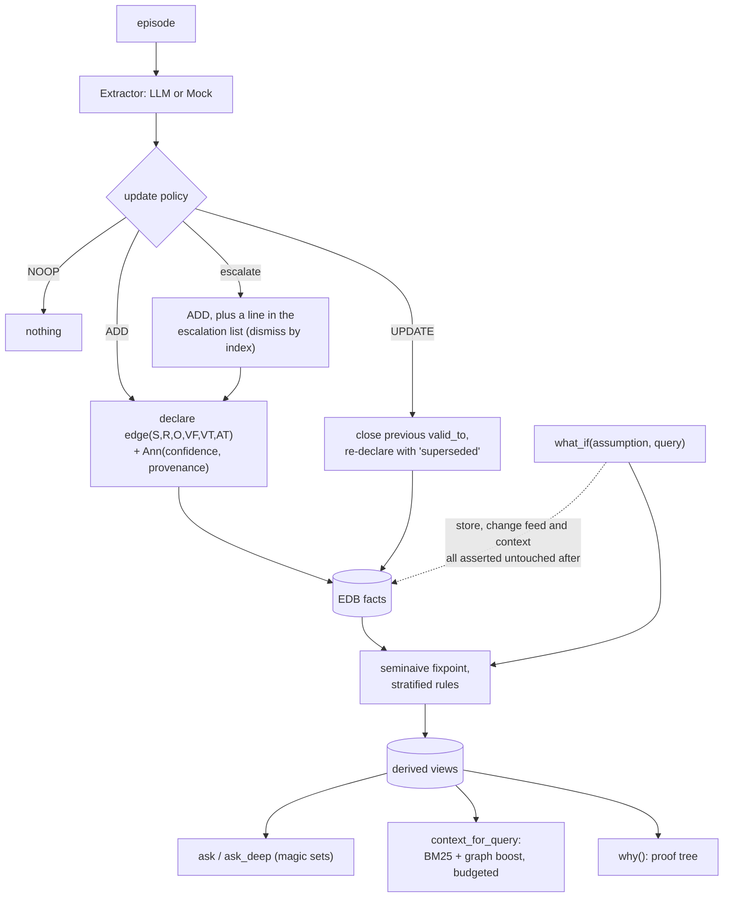

## 1. Executive Summary

Lemmalog is a Datalog engine for agent memory: a runtime-parsed stratified
interpreter with seminaive fixpoint, semiring annotations, magic-sets demand
evaluation, proof trees and an MCP server. Its strongest parts are a
hypothetical that provably leaves no trace and identity conflicts that derive a
fact instead of merging. Its weak part is the second clock: the writer fills the
transaction-time position with the valid time, so the store cannot say when it
learned something.

Its thesis is stated plainly in the README:

> an agent's memory should be a deductive database — the agent builds a
> *verifiable model of what it knows* and mechanically reasons over how that
> knowledge changes, rather than "remembering better" than a vector store.

Memory here *is* a logic program rather than a store a program queries. Base facts
are asserted at the extraction boundary; rules derive closures, temporal
projections, contradiction candidates and relevance diffusion; each turn updates
derived views incrementally rather than re-deriving them.

**One mark**, and the reason is not that the engine is thin. The epistemics here
are *continuous and structural* rather than discrete: confidence is a semiring
annotation fused by a product t-norm, provenance is a set union of episode ids,
and neither is a status a memory can be in. The rubric asks for discrete state,
an enforced scope key, an append-only mutation record — and this design answers
those questions with algebra instead.

**The central finding is a gap between the status table and the shipped code.**
The table is otherwise careful: thirty-one rows marked shipped and one marked
`🚧 future phases`, for leapfrog triejoins and DBSP streaming. One row reads:

> | Bi-temporal facts via `valid_from`/`valid_to`/`asserted_at` columns + `now()` | ✅ |

The engine supports it: arity is arbitrary, `now()` is a builtin parsed in
`src/ast.rs:281`, and a user writing their own rules could put a transaction time
in a position and query it. What ships does not. `assert_open`
(`src/agent.rs:527-537`) builds a six-position tuple:

```rust
Value::Int(self.engine.now),    // valid_from
Value::Int(i64::MAX),           // valid_to
Value::Int(self.engine.now),    // asserted_at
```

`valid_from` and `asserted_at` receive **the same value on every assertion**, and
the one temporal rule `DEFAULT_RULES` installs discards the position
(`src/agent.rs:346`):

```prolog
current(E,R,O) :- edge(E,R,O,VF,VT,_), now(T), VF =< T, T < VT.
```

The `_` is `asserted_at`. It is the only rule over `edge` in `src/agent.rs`, and
both `query("edge", ...)` calls there pass `None` for that position. The
position is read only where the two values cannot differ: a `conflict` rule in
`examples/agent_memory.rs:29` over the raw `Engine`, whose ingest writes the same
`ts` into both, and the benchmark harnesses' date rendering.

**The MCP server keeps two clocks apart, and neither is record time.** Its module
comment and the skill call the design bitemporal (`src/bin/lemmalog-mcp.rs:16-21`,
`skills/lemmalog/SKILL.md:164`). An `observe` takes `ts` as valid-from,
defaulting to the wall clock, and every read syncs `now` forward to the wall
clock (`sync_clock`, line 223). That is valid time and query time.

A backdated `observe` sets the engine clock to `ts` (`src/agent.rs:574`), so
`asserted_at` receives the backdated value. The handler then computes
`wall_clock()` and writes it nowhere (`src/bin/lemmalog-mcp.rs:296-303`). A fact
recorded in September about January carries January in both positions. Through
`AgentMemory` or the MCP server a caller cannot ask what the store believed in
August. **`bitemporal` is withheld** on that basis: the column is there, and the
second clock is not running.

## 2. Mental Model

Memory is a stratified logic program, and the interesting operations are
derivation, retraction and hypothesis.



## 3. Architecture

A crate. No service, no database: facts are interned into an in-process store with
per-position secondary indexes and WAM-style trail backtracking, snapshotted to
disk as episodes, EDB facts, rules and escalations with the derived views rebuilt
on load.

Distribution is five surfaces over the same engine — the Rust library, an MCP
server behind `--features mcp`, a CLI, a REPL, and an agent skill directory.
`scripts/install.sh` builds the MCP binary, registers it with whichever of the
`claude` and `kimi` CLIs it finds, and installs the skill; it runs only when
invoked. The README warns that the MCP server and the CLI hold separate
in-process copies of one snapshot file and must not write at the same time.

The annotation type is a trait parameter (`Engine<A = Ann>`, `src/eval.rs:529`),
with `Ann` as the default carrier. The screen is clean: no auto-run surface, no
build-time execution, and a `Cargo.lock` last changed on 2 September 2026.

## 4. Essential Implementation Paths

- **Engine** — `src/eval.rs` (2,223 lines: fixpoint, deltas, retraction, the
  `Annotation` trait at 82, `hypothetical` at 640), `src/ast.rs` (parser, `now`
  builtin at 281), `src/semantics.rs`, `src/magic.rs` (demand evaluation),
  `src/intern.rs`.
- **Agent facade** — `src/agent.rs`: the policy comment (7, 425), the default
  `current` rule (346), exclusive-predicate close-out (491-503), the escalating
  ADD (506-520), `assert_open` (527-537), the escalation list (327, 335, 393)
  and `resolve_escalation` (553).
- **MCP server** — `src/bin/lemmalog-mcp.rs`: `wall_clock` (207), `sync_clock`
  (223), the `observe` handler (292-303), the save-on-mutate list (671-678).
- **Canonicalization** — `src/canonical.rs`; the rule set is quoted in the README.
- **Retrieval** — `src/retrieval.rs`, `src/session.rs`.
- **Evaluation** — `src/scenario.rs` (`run_eval`), `src/longmemeval.rs`,
  `src/bin/lemmalog-bench.rs`, `benchmarks/memeval_adapter.py`,
  `benchmarks/loss_analysis.py`.
- **Design document** — `datalog-context-engine-design.md:78-100` (the eight-column
  tuple the agent layer ships six of).

## 5. Memory Data Model

The design document specifies eight positions — entity, relation, object,
`valid_from`, `valid_to`, `asserted_at`, confidence, provenance — with the last
two as semiring annotations rather than columns. In the shipped agent layer the
tuple is six positions and the annotations live in `Ann`, which is the cleaner
arrangement and matches the design's own note that annotations *"live in a
semiring/lattice, not ad-hoc columns"*.

Confidence fuses by a product t-norm; provenance is set union over episode ids, so
*"every derived fact answers 'why do I believe this'"*. The `Annotation` trait
makes the carrier replaceable, and `tests/annotation_test.rs` drives the fixpoint
at a carrier the evaluator cannot interpret. **`trust_state` is withheld**: a
confidence in [0,1] is a score, and no shipped carrier holds a discrete status
that withholds a fact from a reader.

**`tombstone` is withheld**, and the supersession is careful. When an exclusive
predicate gets a new value, the old edge is retracted and immediately re-declared
with `valid_to` closed to now and a provenance annotation of `superseded`
(`src/agent.rs:496-501`). The old value is kept, dated and labelled — which is
more than most manage — and nothing is keyed on the rejected value, so the same
triple asserted again is a new open edge.

## 6. Retrieval Mechanics

Three surfaces. `ask` is a read-only Datalog query; `ask_deep` uses magic sets so a
point query does not force a full fixpoint; `context_for_query` assembles a
budgeted context with BM25 plus entity and graph boosting, and a
`ContextAssembler` that puts distilled material at the top and verbatim provenance
at the bottom.

`why()` returns a proof tree with cycle protection — the answer to "why do I
believe this" is a derivation rather than a citation, which is a different and
stronger thing than a list of source ids.

**`scope_enforced` is withheld** for absence. There is no principal, tenant or
agent key on a tuple and no predicate on any read:

```sh
grep -rn "tenant\|agent_id\|principal" src/*.rs src/bin/*.rs
```

Nothing at the pinned commit. One store per process is the model.

## 7. Write Mechanics

An `Extractor` trait sits at the ingestion boundary with a memoized mock and an
LLM implementation, and a deterministic policy chooses ADD, UPDATE, NOOP or
escalate. Through MCP the host model extracts, and `observe_extracted` applies
the same policy to its line-protocol facts.

**Escalation records a conflict and admits the fact anyway.** A second value on a
predicate that is neither exclusive nor multi-valued is asserted as an open edge beside the first, and a line
naming both goes into a `Vec<String>` (`src/agent.rs:506-520`). The only
operation on the list is `resolve_escalation(idx)`, which removes the line by
index and touches no fact; its doc comment reads *"agent resolved it
out-of-band"* (`src/agent.rs:553`). The MCP server shows up to three lines in the
`observe` response and registers no tool that lists or dismisses them.

**`human_review` is withheld**: no memory waits on a decision, since both values
are open from the moment of the write, and the one dismissal verb is a library call on the caller's
own handle.

Maintenance runs on a time advance — the source calls it *"the sleep-time slot"* —
rather than on a timer, so a caller controls when derived views catch up. The MCP
`observe` handler advances the clock to the wall clock and maintains before it
returns, so a fact is queryable on the next call.

## 8. Agent Integration

An MCP server exposing the engine as fifteen tools, plus a CLI, a REPL and a skill
directory. The agent-facing contract is Datalog: an agent that can write a rule
gets the whole engine, including `why` and `what_if`.

The server re-saves the snapshot after `observe`, `retract`, `install_rules`,
`uninstall` and `canonicalize` (`src/bin/lemmalog-mcp.rs:671-678`), and ignores a
failed save. `retract` joined that list on 15 September 2026; before then a
retraction came back on the next server start. Rule installs report any predicate
another batch also defines, because Datalog unions the two definitions rather
than replacing one (`batch_conflicts`, `src/agent.rs:602`).

## 9. Reliability, Safety, and Trust

Two design decisions stand out.

**Identity conflicts derive a fact instead of merging.** The canonicalization rules
are star-shaped — the LLM proposes `alias(Local, Canonical)` edges and Datalog
derives the closure — and topology violations, a local with two canonicals or a
name that is both local and canonical, produce `alias_conflict` facts rather than
collapsing two entities into one. Merging identities is the irreversible error in
an entity resolver, and refusing to guess is the correct failure.

**The hypothetical is provably clean.** `what_if` evaluates a query under an
assumed fact and restores the store byte-identically from clones of the
relations, the change log and the feed (`src/eval.rs:640-677`). The test asserts
not just that the store is unchanged but that the change feed recorded nothing
and the assembled context does not mention the assumption. A lookahead that
leaked into the change log would corrupt every downstream incremental view.

What is absent is governance. No scope, no discrete status, and no review that
gates admission.

**`audit_log` is withheld.** The streaming feed records `Added` for base and
derived facts, `Retracted` for base removals and `Cleared` for rebuilt relations,
each with an epoch (`src/eval.rs:238-256`). It lives in the process: `save()`
writes episodes, rules, escalations and surviving facts and not the feed
(`src/agent.rs:1121`), so after a restart a retracted row has no trace. It also
carries no cause. Provenance answers *why do I believe this*, a different
question from what changed.

## 10. Tests, Evals, and Benchmarks

The suite is the clearest evidence of how seriously the engine is taken.
`tests/differential_test.rs` checks 300 seeded random stratified programs
against a brute-force fixpoint oracle and 150 more for incremental against
from-scratch agreement, plus 2,000 parser fuzz cases (lines 327-405). That is the
status table's *"450 random programs"*, committed with deterministic seeds. The
first check also runs every program at a second annotation carrier and asserts
both derive the same fact set.

`src/scenario.rs::run_eval` is a synthetic harness reporting accuracy, tokens and
latency against ground truth, and `src/longmemeval.rs` plus
`src/bin/lemmalog-bench.rs` wire the engine to external benchmarks.

The README publishes results from them: a 30-question LongMemEval oracle-split
table, MemEval F1 0.487 ± 0.011 over three runs on 102 questions, and LoCoMo F1
0.573 ± 0.002 over three runs on 1,986 questions. No run output is committed.
`benchmarks/memeval_adapter.py` runs inside the external MemEval harness and
defaults to a binary at an absolute path on the author's machine. The README
gives the MemEval accuracy two ways, 0.566 ± 0.009 at line 335 and
0.585 ± 0.005 at line 441.

The case that earns `negative_eval` is described in section 9 and the frontmatter.

No paper and no `CITATION.cff`; the design document is the closest thing and it is
a design document rather than an evaluation.

Nothing was run. The screen is clean, so the reason is budget rather than caution,
and the claims about tests in this report are claims about their committed
source.

## 11. For Your Own Build

### Steal

**Make a hypothetical prove it left nothing behind.** Asserting that the store is
unchanged is the obvious half. Asserting that the *change feed* recorded nothing
and the *assembled context* does not mention the assumption is the half that
catches a leak into downstream incremental views.

**Derive a conflict fact instead of merging identities.** `alias_conflict` for a
local with two canonicals is a refusal to guess, and it is the error that cannot be
undone once made.

**Answer "why" with a derivation, not a citation.** A proof tree with cycle
protection tells a reader how a belief was reached; a list of source ids tells them
where to look.

**Keep the superseded tuple, dated and labelled.** Closing `valid_to` and
re-declaring with a `superseded` provenance annotation costs one write and keeps
the history queryable.

**Test the engine against an oracle with committed seeds.** 450 generated
programs checked against a brute-force fixpoint make a soundness claim
reproducible, and the README names a real bug the harness caught.

### Avoid

**Shipping a transaction-time column your writer sets to the valid time.** The
position exists, every assertion fills it with the same clock, and the default
rule over `edge` discards it. A backdated MCP write makes the loss concrete: the
wall-clock time is computed in the handler and dropped. A reader of the status
table would reasonably believe they can ask what the store knew last month, and
through the agent facade they cannot.

**Recording a conflict and admitting both values.** An escalation that leaves
both edges open and offers only a dismissal by index is a note, not a decision.

### Fit

This suits someone who wants agent memory to be inspectable and mechanically
reasoned about — who would rather debug a rule than a ranking function, and who
values a proof tree over a similarity score. As a piece of engineering the design holds
together unusually well end to end.

It is the wrong fit where memory must be scoped between principals, where a wrong
belief must be recorded as wrong rather than dated out, or where the team cannot
write Datalog — the rules *are* the memory, and that is the cost as well as the
idea.

## 12. Open Questions

- **Will the writer use the third clock?** The position is allocated and every
  assertion fills it with `valid_from`. Passing the wall clock into `assert_open`
  from the MCP handler would make the skill's bitemporal description true.
- **What should an escalation do to the facts?** The list records a conflict and
  admits both values; nothing chooses between them.
- **Does `why()` survive supersession?** A proof tree over a closed edge is the
  interesting case for an auditor and was not traced here.

## Appendix: File Index

**Engine**

- `src/eval.rs` (`Annotation` trait at 82, change feed at 238-256, `hypothetical`
  at 640-677), `src/ast.rs` (`now` builtin at 281), `src/semantics.rs`,
  `src/magic.rs`, `src/intern.rs`, `src/canonical.rs`

**Agent layer**

- `src/agent.rs` — policy comment (7, 425), `current` rule (346), exclusive
  close-out (491-503), escalating ADD (506-520), `assert_open` (527-537),
  escalations (327, 335, 393), `resolve_escalation` (553), `observe_extracted`
  (569-590), `save` (1121)

**MCP server**

- `src/bin/lemmalog-mcp.rs` — bitemporal comment (16-21), `wall_clock` (207),
  `sync_clock` (223), `observe` handler (292-303), save-on-mutate (671-678)
- `skills/lemmalog/SKILL.md` — the two-clocks note (164)
- `scripts/install.sh`

**Retrieval and evaluation**

- `src/retrieval.rs`, `src/session.rs`, `src/scenario.rs`, `src/longmemeval.rs`,
  `src/bin/lemmalog-bench.rs`, `benchmarks/memeval_adapter.py`,
  `benchmarks/loss_analysis.py`

**Design**

- `datalog-context-engine-design.md` — the eight-position tuple (78-100)
- `README.md` — the status table (20-53), benchmark results (186-445)

**Tests**

- `tests/agent_test.rs` — `what_if` cleanliness (254-268), escalations (46,
  74-81)
- `tests/canonical_test.rs` — alias conflicts (93-105), retraction collapse (108+)
- `tests/differential_test.rs` — oracle (327), incremental (360), parser fuzz
  (400)
- `tests/annotation_test.rs`, `tests/agg_test.rs`

### Commands behind the absence claims

```sh
grep -rn "asserted_at" . --include="*.rs" --include="*.md"
grep -rn "edge(" src/agent.rs
grep -rn 'key\[5\]\|k\[5\]' src
grep -rn "tenant\|agent_id\|principal" src/*.rs src/bin/*.rs
grep -rn "resolve_escalation\|escalations" src
grep -n "feed\|FACT\|ESC" src/agent.rs
git ls-files | grep -v '\.rs$'
grep -rn -i "arxiv\|bibtex\|@article\|citation\|doi" README.md
```

## History

**2026-09-26** — [`b8e24dbd80df61b7c6f1757dd77342a6228a6f84`](https://github.com/JordyZomer/lemmalog/commit/b8e24dbd80df61b7c6f1757dd77342a6228a6f84) — 13 commits on: an annotation-type parameter, an MCP clock that syncs reads to the wall clock, persistence after `retract`, and shadow-rule warnings. Screened again from a full clone: clean. Nothing installed, built or run. No mark moved; `bitemporal` stays withheld because a backdated MCP write puts the backdated time in `asserted_at` too ([section 1](#1-executive-summary)). Corrected: `resolve_escalation` existed at the first pin and the escalating ADD leaves both values open ([section 7](#7-write-mechanics)); the 450 differential programs were committed with seeds ([section 10](#10-tests-evals-and-benchmarks)); the status table has thirty-one shipped rows, not twenty-seven; an example rule does read `asserted_at`; the change feed records base additions and retractions, and is not persisted ([section 9](#9-reliability-safety-and-trust)). Added: the README's benchmark results.

**2026-09-13** — [`74d428a2497066795f6328946457f22d713fcbd5`](https://github.com/JordyZomer/lemmalog/commit/74d428a2497066795f6328946457f22d713fcbd5) — first reading. The screen is clean: no auto-run surface, no build-time execution point, and a `Cargo.lock` unchanged for eleven days. Nothing was run all the same, so every claim about a test here is a claim about its committed source. One mark. `negative_eval` is earned on a `what_if` case that proves the assumption derived a closure before asserting the store, the change feed and the assembled context are each untouched. `bitemporal` is withheld against a `✅` in the project's status table, and the distinction is the same one applied to two other systems in this corpus on the same day: the engine supports the axis and the shipped agent layer sets `asserted_at` to the same value as `valid_from` on every assertion, while the one rule that reads `edge` discards the position. `audit_log` is withheld because provenance answers why a fact is believed rather than recording what changed; `human_review` because escalations are collected and never resolved.
