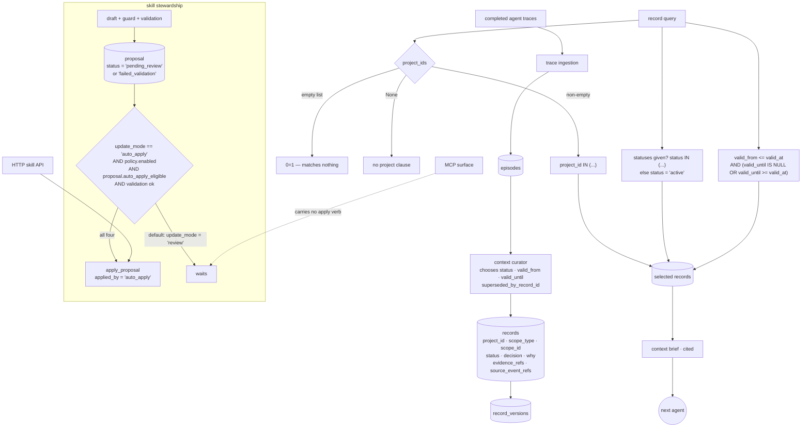

## 1. Executive Summary

Lerim sits above finished agent traces and compiles them into records a later
agent can read before starting work — decisions with their alternatives and
consequences, episodes with what happened and what came of it, each carrying
the session and the events it was derived from. Python, SQLite, Apache 2.0,
with an MCP server, an HTTP API and a dashboard.

**Four marks:** `bitemporal`, `scope_enforced`, `human_review` and
`negative_eval`.

Two of them rest on the same habit, which is worth stating before the
mechanisms: **this codebase tests the case where being wrong is quiet.** An
empty project list could reasonably filter nothing and return everything; here
it compiles to `0=1` and the test that proves it is named
`test_empty_project_ids_fail_closed`. An as-of query could reasonably drop rows
that have since been archived; here it keeps them, because a record archived
today was live at the date being asked about, and that test is named
`test_valid_at_includes_archived_rows_without_include_archived`.

`trust_state` is withheld, and the reason is the sharpest thing in the report.
A record's `status` is `active` or `archived` — a lifecycle pair, not an
epistemic one. There is no state meaning *recorded but not believed*. What
judgement exists lives in `decision` and `why`, prose columns a model wrote and
nothing reads back as a condition.

## 2. Mental Model

A trace is ingested into episodes. A curator agent turns episodes into records,
choosing each record's status, its validity window and whether it supersedes
another. A record is then retrievable by project, by kind, by role, and as of a
moment in world time.

Two clocks. `created_at` and `updated_at` say when the store learned something;
`valid_from` and `valid_until` say when it was true. The read path composes both.

## 3. Architecture



## 4. Essential Implementation Paths

**The scope tri-state** — `src/lerim/context/store.py:3265-3270`.

```python
if project_ids:
    clauses.append(f"{prefix}project_id IN ({placeholders})")
elif project_ids is not None:
    clauses.append("0=1")
```

Three cases, deliberately distinguished: a list of projects filters to them,
`None` means no project clause at all, and an **empty list matches nothing**.
The third is the one that usually goes wrong, because an empty `IN` list and an
absent filter are easy to conflate and the failure is silent and total.

**The status default** — `:3279-3284`. Explicit statuses become
`status IN (...)`; otherwise, unless `include_archived`, the clause is
`status = 'active'`. An allow-list rather than a `!=`, so a status added later
is hidden rather than surfaced.

**The validity window** — `:3306-3307` and `:3366-3367`, `valid_from <= ?` and
`(valid_until IS NULL OR valid_until >= ?)`, with the effective moment resolved
once by `_effective_current_valid_at(valid_at, include_archived, statuses)` so
the time and the status filters are decided together rather than separately.

**The proposal gate** — `src/lerim/skill_stewardship/pipeline.py:105-122` and
`:405-413`. A validated draft is saved with `status = "pending_review"`; an
invalid one with `"failed_validation"`. Auto-apply requires all four of
`update_mode == "auto_apply"`, `policy.enabled`, `proposal.auto_apply_eligible`,
and validation passing unless the policy waives it. `update_mode` defaults to
`'review'` in the table definition and again in the schema.

## 5. Memory Data Model

One `records` table holding the compiled unit: `kind`, `record_role`, a title
and body under `CHECK (length(trim(...)) > 0)`, the status, the two time pairs,
`superseded_by_record_id` as a self-referencing foreign key, and the derivation
— `source_session_id`, `source_event_refs`, `evidence_refs`. Beside the
mechanical fields sit the reasoning ones: `decision`, `why`, `alternatives`,
`consequences`, `user_intent`, `what_happened`, `outcomes`.

`record_versions` keeps prior versions. `scope_type` and `scope_id` reference a
`scopes` table.

## 6. Retrieval Mechanics

Filters compose over kind, role, status, source profile, source session,
project and the validity window, feeding a context brief that cites what it
drew on.

## 7. Write Mechanics

The curator supplies a payload and `operations.py:233-242` normalizes it:
`status` defaults to `active` when absent, and `valid_from`, `valid_until` and
`superseded_by_record_id` are carried through only when non-empty. So
supersession, archival and the validity window are three independent decisions
a model makes per record, rather than one implying the others.

## 8. Agent Integration

An MCP server, an HTTP server with a skill API, a Next.js dashboard, and
adapters for several agent runtimes.

## 9. Reliability, Safety, and Trust

**`bitemporal`.** Two axes, both written and both read. The as-of path is not a
decoration: `test_valid_at_includes_archived_rows_without_include_archived`
pins the semantic that makes it worth having — asking what was true in February
must return a record archived in April, because archival is a fact about now
and the question was about then.

**`scope_enforced`.** `project_id` composes into the record filter, and the
empty case fails closed on the write path too, raising `record_out_of_scope`.
Worth recording: `scope_type` and `scope_id` are columns with a foreign key and
the general record filter does not compose them — the scope that is enforced on
retrieval is the project.

**`human_review`.** A skill proposal is saved `pending_review` and waits.
`update_mode` defaults to `'review'` in both the schema and the table, auto-apply
needs four conditions, and the application is attributed —
`applied_by="auto_apply"` when the policy fires. The mark rests partly on reach:
`apply_proposal` is reachable from the pipeline and the HTTP skill API, and the
MCP tool surface carries no verb for it.

**`negative_eval`** — section 10.

**`trust_state` is withheld.** `active` and `archived` are a retention pair.
Nothing expresses *recorded but not believed*: a record is live or it is not,
and the epistemic content — `decision`, `why`, `alternatives` — is prose a model
wrote, which no query reads as a condition. A record the curator half-doubts has
the same standing in a brief as one it is certain of.

**`tombstone` is withheld.** `superseded_by_record_id` points at a replacement
and is keyed on the record. Nothing is keyed on the value, so the same claim
arriving from a later trace is compiled afresh.

**`audit_log` is withheld.** `record_versions` keeps prior versions of a record,
which is history rather than an append-only log of mutations with their actor;
the proposal table records `applied_by`, but only for skill patches.

## 10. Tests, Evals, and Benchmarks

157 test files across unit, integration, smoke and e2e directories, with a
`benchmarks/` tree beside them. Nothing was installed and nothing was run.

The mark rests on assertions that name the failure they prevent:

- `tests/unit/context/test_store.py:1284-1297`,
  `test_empty_project_ids_fail_closed` — an empty project list raises
  `record_out_of_scope` on a write, and the record is then re-fetched to assert
  it was not modified. The name is the specification.
- `tests/unit/test_run_clinic.py:102` —
  `assert archived["record_id"] not in {record["record_id"] for record in data.records}`,
  an archived record must not come back in a result set.
- `tests/unit/context/test_store.py:1902`,
  `test_valid_at_includes_archived_rows_without_include_archived` — the
  converse, and the harder one: an as-of read must *not* apply the archived
  filter, because the two questions are about different moments.

That pair is what makes the bitemporal implementation credible. One test alone
could be satisfied by a filter that is always on or always off; together they
pin the condition.

No paper.

## 11. For Your Own Build

### Steal

- **Distinguish "no scope given" from "an empty scope".** `None` and `[]` are
  different questions, and conflating them turns a filter into a pass-through.
  Compile the empty case to `0=1` and name the test after the behaviour.
- **Decide the as-of moment and the status filter together.** One helper
  resolving both is why an as-of read can correctly ignore `include_archived`
  instead of accidentally inheriting it.
- **Keep supersession, archival and validity as three fields.** A model that
  supersedes a record has not necessarily said the old one was never true, and
  three columns let it say which it meant.
- **Attribute the application.** `applied_by="auto_apply"` is one string, and
  it is the difference between knowing a patch was reviewed and assuming it.

### Avoid

- **Reasoning stored only as prose.** `decision`, `why`, `alternatives` and
  `consequences` carry the reasoning this system exists to preserve, and no
  query can act on them; a confidence or a status derived from them would let a brief
  say which of two conflicting records to prefer.
- **Two scope columns where one is enforced.** `scope_type`/`scope_id` exist,
  are foreign-keyed, and are not in the general record filter — which invites a
  later reader to assume they are.

### Fit

Take it if you have finished agent traces and want the next agent to start from
compiled, cited context rather than a transcript. Take the store's filter
builder whatever else you do.

## 12. Open Questions

- `scope_type` and `scope_id` are foreign-keyed and absent from the record
  filter. Are they a labelling dimension, or a retrieval boundary not yet wired?
- The curator sets `status`, `valid_until` and `superseded_by_record_id`
  independently. What reconciles a record superseded but left `active`?
- `decision` and `why` are prose. Is a derived confidence intended, and what
  would a brief do with two records that disagree?
- Auto-apply is off by default and attributed when it fires. Is there a
  deployment where the reviewing principal is verified rather than assumed?

## Appendix: File Index

| Path | What it holds |
| --- | --- |
| `src/lerim/context/store.py` | the schema, the filter builder, the scope tri-state and the validity clauses |
| `src/lerim/context/retrieval.py` | the read surface that passes `project_ids` down |
| `src/lerim/agents/context_curator/operations.py` | payload normalization and the three independent lifecycle fields |
| `src/lerim/agents/trace_ingestion/persistence.py` | where an ingested episode may carry its own `valid_from` |
| `src/lerim/skill_stewardship/pipeline.py` | the proposal status, and the four-condition auto-apply |
| `src/lerim/skill_stewardship/patching.py` | `apply_proposal` and the `applied_by` attribution |
| `tests/unit/context/test_store.py` | the fail-closed and as-of cases |

## Appendix: Recorded Searches

Run from the root of the checkout at the pinned commit.

| Claim | Command | Result at this pin |
| --- | --- | --- |
| The empty scope fails closed | read `src/lerim/context/store.py:3265-3270` | `if project_ids:` filters, `elif project_ids is not None:` appends `0=1` |
| `scope_type`/`scope_id` are not in the record filter | `grep -n "scope_id\|scope_type\|project_id" src/lerim/context/store.py \| grep -iE "clauses\|WHERE"` | `project_id IN (...)` at `:2667`, `:3267`, `:3332`; `scope_type`/`scope_id` appear only in one episode-lookup at `:2830` |
| Validity is read, not only stored | same grep for `valid_from`/`valid_until` | `:3306-3307` and `:3366-3367` compose the window |
| `valid_from` has a producer other than creation time | `grep -rn "valid_from" --include='*.py' src \| grep -v context/store.py` | An ingested episode may carry one (`agents/trace_ingestion/persistence.py:364`) and the curator may set one (`context_curator/schemas.py:28`); otherwise it falls back to `effective_created_at` at `store.py:1757` |
| Review is the default | `grep -rn "update_mode" src/lerim/skill_stewardship` | `DEFAULT 'review'` in the table (`repository.py:62`) and `= "review"` in the schema (`schemas.py:103`) |
| The MCP surface has no apply verb | `grep -rn "proposal" src/lerim/mcp_server.py` | Nothing; `apply_proposal` is reached from the pipeline and `server/skill_api.py:163` |
| No tombstone vocabulary | `grep -rli "tombstone\|retract" --include='*.py' src` | Nothing for either |

## History

**2026-09-20** — [`5fed45a55e587d2844e3c408e937ee3e5fd178ba`](https://github.com/kargarisaac/lerim/commit/5fed45a55e587d2844e3c408e937ee3e5fd178ba) — first reading, at 653 files. Screened before reading; nothing was installed and nothing was run, so the `benchmarks/` tree was read rather than executed. Apache 2.0. Four marks: `bitemporal`, `scope_enforced`, `human_review`, `negative_eval`. `trust_state` is withheld because `active`/`archived` is a retention pair and the reasoning fields are prose no query reads as a condition; `tombstone` because supersession is keyed on the record; `audit_log` because `record_versions` is version history rather than a mutation log with an actor. Each withholding rests on a search recorded in the appendix.
