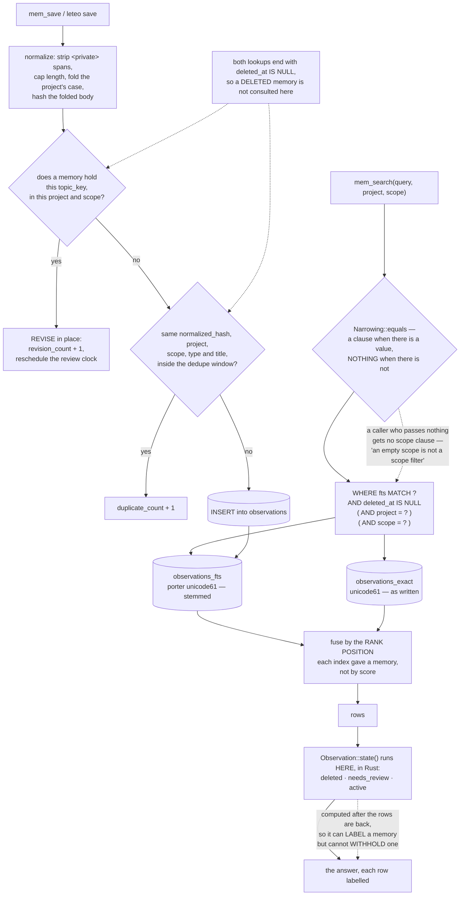

## 1. Executive Summary

Leteo is "[l]iving memory for AI agents. Light. Local. Yours." — MIT, Rust,
version 0.2.1, 73,418 lines across 121 files, giving a coding agent "persistent
memory, contextual retrieval, and continuous cognition" from one local SQLite
file with no embedding model and no network in the memory path.

**The thing worth reading here is the commentary, and it is unusual enough to
lead with.** Most codebases record what a decision was. This one records what it
cost to find out, in numbers, and names the bug that motivated it. The migration
that adds a second full-text index does not say "added an exact index"; it says
what each tokenizer can and cannot do, and what the pair measured:

> "a question with two of six words re-inflected is answered 63% of the time
> here and 0% by the same store searched without a stemmer."
>
> "quoting six words straight out of a memory finds it first 78% of the time,
> against 84% unstemmed. Both are real, they pull in opposite directions, and no
> single tokenizer has both — the tokenizer is a property of the table."

So there are two indexes and the search reads both, fused by the rank position
each gave a memory rather than by score, which the same comment measures at
84.3% on quoted words and 37.0% on re-inflected ones against 78.0% and 37.3%
from the stemmed index alone. The cost is stated in the same breath: 5.1 MB of
index on a 46 MB store, 228 ms to build once, 0.03 ms on a search, and 0.04 ms —
three per cent — on saving a memory. A reader can disagree with the trade
because the trade is on the page.

**The recurring bug this project has learned to name is a rule written in more
than one place.** It appears again and again in the comments, each time with the
damage:

> "`REVIEW_WINDOWS` itself was consolidated after a third hand-written copy of
> these names let `policy` keep a window nothing could fire."
>
> "This is the fourth vocabulary to be consolidated for the same reason."
>
> "a hand-written copy with `ifnull(project, '')` where `Narrowing` writes
> `project =` was measured for an afternoon before anybody noticed the product
> never issues it."

That last one is the sharpest, because the duplicate was in a *measurement
tool*: a benchmark that wrote its own copy of the search query was measuring a
search the product does not run. The fix was to pass the real query's weights in
rather than let the tool restate them.

**The same discipline explains why the scope predicate is shaped the way it
is, and why this report awards no marks.** `Narrowing::equals` writes
`AND <column> = ?n` when there is a value "and nothing at all when there is not —
never a clause that has to be true for every row", and the reason is a query
plan, measured:

> "A column inside a disjunction with a parameter is therefore not a usable
> index term at plan time, and the plan it settles on is the one that works
> whichever way the parameter goes: `SCAN`. … On a store of 3,587 memories that
> is 5.7 ms against 0.015 ms, and the session-opening context pays it four times
> over."

That is a good reason to build SQL per call. It also means the scope is a
narrowing *argument*: a caller who passes nothing gets no scope clause, and the
test suite pins exactly that — `"an empty scope is not a scope filter"`, with
`"a real scope narrows"` beside it as the control that stops the first assertion
passing by doing nothing. A predicate a caller may omit is not a boundary the
store enforces, so `scope_enforced` is withheld on the shape of the query rather
than on a missing feature.

**The epistemic fields are all one step short of doing work.** A memory's state
is computed rather than stored: `Observation::state()` returns `deleted`,
`needs_review` or `active` by looking at `deleted_at` and comparing
`review_after` to the clock, in Rust, after the rows are already back from
SQLite. It can label a result and cannot withhold one. The only predicate that
withholds anything is `deleted_at IS NULL`. And the relation row that carries a
judgement records `marked_by_actor`, `marked_by_kind` and `marked_by_model` — the
provenance shape this atlas rewards, because it says *what kind of thing* decided
— but every shipped writer supplies `"agent"` or `'system'`. The field built to
tell a person from a machine has no path that writes a person.

**Deletion is keyed on the row, not the claim.** Both dedup lookups end with
`AND deleted_at IS NULL`, so a memory somebody deleted is invisible to the two
checks that would otherwise notice the same thing being written again. The
prompt side comes closer than anything else here: `apply_prompt_upsert_tx`
reads `prompt_deletions` *before* accepting an incoming prompt and drops the
write when the arriving copy is not newer than the deletion. That is a deletion
consulted on the write path, which most of this corpus does not manage — but it
is keyed on the `sync_id`, so it settles a race between replicas about one row
rather than remembering that a claim was rejected.

## 2. Mental Model

Leteo is a lexical memory with no model in the loop, and almost every question
about it resolves by asking whether a thing is a column or a computation.

Columns withhold: `deleted_at IS NULL` is in the SQL, so a deleted memory does
not come back. Computations describe: `state()` runs after the query, so
`needs_review` reaches the caller as a label on a row that was already returned.
The scope sits in between — it is a column, and it is in the SQL only when the
caller supplied a value.



## 3. Architecture

| Area | Role |
| --- | --- |
| `src/store/` | The SQLite layer: observations, prompts, sessions, relations, search, wire and diagnostics, with `Narrowing` and the column lists shared across them |
| `src/memory/` | The model, the normalisation rules, the review windows and the relation vocabulary |
| `src/mcp/` | Twenty-two tools — the agent's surface |
| `src/cli/` | Some thirty subcommands, including `doctor`, `conflicts` and `timeline` |
| `src/hooks/` | Session-start and session-end hooks that assemble the opening context |
| `src/sync/`, `src/cloud/` | An outbox of mutations, a chunked transfer, and an optional cloud server |
| `migrations/` | Four baseline files plus one, each carrying the argument for what it does |

## 4. Essential Implementation Paths

- `src/store/mod.rs:194-231` — `Narrowing`, and the plan argument that shapes it.
- `src/store/search.rs:47-57` — the fused-search SQL, with type, project and scope each behind an `IS NULL` disjunction.
- `src/store/observations.rs:228-270` — the topic-key revision lookup and the hash dedup lookup, both ending `AND deleted_at IS NULL`.
- `src/memory/model.rs:105-122` — `state()`, computed from `deleted_at` and the review clock.
- `src/memory/rules.rs:78-110` — `REVIEW_WINDOWS` and the calendar-month rule, with the three disagreeing copies it replaced.
- `src/store/relations.rs:375-400` — the judgement write, recording actor, kind and model.
- `src/store/wire.rs:400-430` — the prompt tombstone consulted before a synced write is accepted.
- `src/store/wire.rs:610-631` — the journal prune, and why the outbox is not a record.
- `migrations/0001_baseline_after_the_tables.sql` — the second index, with its measurements.

## 5. Memory Data Model

An observation carries `type`, `title`, `content`, `tool_name`, `project`,
`scope` (defaulting to `project`), `topic_key`, `normalized_hash`,
`revision_count`, `duplicate_count`, `last_seen_at`, `pinned`, `review_after`,
`expires_at`, `created_at`, `updated_at` and `deleted_at`. The vector column
inherited from the upstream schema is annotated as never written: "Leteo does
not embed anything."

`type` is a write-time genre rather than an epistemic status, and it is the
input to the review clock: `REVIEW_WINDOWS` gives `decision` six months,
`policy` twelve and `preference` three, and every other kind none, because most
kinds do not go stale. The window is counted in calendar months rather than
thirty-day months, on the stated ground that "a decision is good for six months,
not for a hundred and eighty days" — a distinction that had produced a four-day
disagreement between three copies of the same rule.

A relation row is the other memory unit: a `relation` verb, a `reason`,
`evidence`, a `confidence`, a `judgment_status`, the actor, kind and model that
marked it, and a supersession pointer.

Every timestamp is a record time. There is no validity interval and no as-of
read, so `bitemporal` is withheld on an absence.

## 6. Retrieval Mechanics

Search is BM25 over two FTS5 external-content indexes of the same rows, fused by
the position each index gave a memory rather than by combining scores — the
choice the migration measures. The weights are a single constant passed into the
query builder rather than restated by each caller, which is the fix for the
benchmark that had been measuring a query nobody issued.

`deleted_at IS NULL` is in every listing. Type, project and scope are each
behind `(?n IS NULL OR column = ?n)` in the raw SQL, and the `Narrowing` builder
used by the other reads omits the clause entirely instead. A relation-aware
candidate search additionally excludes memories already related to the one in
hand, which is an existence test rather than a status test.

## 7. Write Mechanics

A save normalises first: `<private>` spans are stripped by regex before storage,
the body is capped, and the project name is case-folded — the last because a
prompt arriving over the sync wire once kept its spelling, so `Leteo` never
matched the `leteo` every query narrows by and "that prompt was invisible to the
opening context for ever."

Then three outcomes in order. A memory holding the same `topic_key` in the same
project and scope is revised in place with `revision_count` incremented and its
review clock rescheduled. Otherwise an identical `normalized_hash` with the same
project, scope, type and title inside a configurable window increments
`duplicate_count`. Otherwise a new row is inserted.

Both lookups end `AND deleted_at IS NULL`.

## 8. Agent Integration

Twenty-two MCP tools cover saving, searching, context assembly, pinning,
reviewing, judging relations, comparing, timelines, stats and a doctor. The CLI
covers the same ground for a person, plus `conflicts`, `export`, an Obsidian
export, a terminal UI and the setup module that writes configuration for several
agent clients at install time.

`mem_review` lists memories due for review and marks one reviewed. `mem_judge`
records a verdict on a relation. Both are agent-facing, which is what decides the
review mark below.

## 9. Reliability, Safety, and Trust

**Trust state — withheld, on a derived state.** `state()` is computed per row as
it is serialised. Nothing in SQL consults it, and nothing can, because it does
not exist until the rows are already back. `needs_review` therefore reaches an
agent as a label beside a memory that was returned anyway.

**Scope enforced — withheld, on an omittable predicate.** The clause is present
when a value is supplied and absent when it is not, for a measured query-plan
reason. The test suite documents the consequence rather than guarding against
it, asserting that an empty scope is not a scope filter and that a real one
narrows.

**Human review — withheld, on the producer.** The provenance triple on a
judgement is the right shape, and `marked_by_kind` exists precisely to say what
kind of thing decided. Every production writer supplies `"agent"`, except the
system path which writes `'system'` with `marked_by_actor = 'leteo'`. A search
across the tree finds no path that records a person.

**Tombstone — withheld, and the prompt path is the near miss.** A deleted
observation is excluded from both dedup lookups, so the same content can be
written back with nothing to notice. `prompt_deletions` is consulted on the
write path and does drop an incoming copy that is not newer than the deletion,
which is more than most stores here do — but it is keyed on the row's identity,
so it arbitrates replication rather than remembering a rejected claim.

**Audit log — withheld.** `sync_mutations` is an append-only journal of entity,
operation and payload, and it is pruned: acknowledged rows older than a
retention window are deleted, because "an unpruned journal roughly doubles the
size of the database" and the window "leaves a few days of history for anyone
debugging a sync problem." That is an outbox, honestly described as one.

**Negative evaluation — withheld.** The exclusion tests are count comparisons —
a filtered count must be smaller than an unfiltered one — rather than assertions
that a named memory does not come back. The one test that does assert
non-leakage, `mutation_scoping_fails_closed_on_an_empty_allowlist`, has both
halves the mark wants, including the control that the scoped project has rows to
return; it is `#[ignore]`d behind a PostgreSQL the repository does not provide,
and it asserts over a mutation listing rather than a memory retrieval.

**What is genuinely defended** is the content itself: `<private>` spans are
stripped before storage, and tests assert the secret is absent from the stored
body, from a generated summary and from the replicated copy.

## 10. Tests, Evals, and Benchmarks

748 test attributes across the tree, thirteen of them `#[ignore]`d — eleven in
the cloud-store file, which needs an external database. The retrieval numbers
quoted in the migrations come from a measurement harness under `tools/`, and the
comment beside the search query records why that harness now takes the product's
own weights as an argument: a tool that restates the query measures a search
nobody runs.

## 11. For Your Own Build

- **Put the measurement in the comment.** Two indexes with their survival rates,
  a clause shape with its millisecond cost, a review window with the four-day
  disagreement that motivated folding three copies into one. Every one of those
  is a decision a reader can check rather than accept.
- **Never let a measurement tool restate the query.** Pass the real one's
  parameters in. An afternoon of benchmarking a query the product does not issue
  is the cheapest version of this lesson.
- **Write the clause or write nothing.** `(?1 IS NULL OR col = ?1)` costs the
  plan its index, because SQLite chooses before it knows the binding. Building
  the SQL per call trades one prepared shape for two the statement cache holds.
- **Decide whether a state is a column or a computation before you name it.** A
  computed `needs_review` can label and cannot filter; if you want it to
  withhold, it has to be in the query.
- **If you record who decided, make sure something can record a person.** A
  `marked_by_kind` whose every writer is a machine is a column that will look
  like provenance in a year's time and answer nothing.

## 12. Open Questions

- Is a scope meant to be mandatory anywhere? The default is `project`, and the
  narrowing builder makes omission the caller's choice; which of the two is the
  intended contract is not written down.
- Will a person ever be a judge? The relation schema is ready for it — actor,
  kind and model — and the CLI lists and shows conflicts without a verb to
  settle one.
- Should a deleted memory block its own re-derivation? Dropping `deleted_at IS
  NULL` from the dedup lookups would do it, at the cost of surfacing a deleted
  row to the writer.
- What is `expires_at` for? It sits on every observation and no read path in
  this reading consults it.

## Appendix: File Index

| Path | What lives there |
| --- | --- |
| `src/store/mod.rs` | `Narrowing`, the shared column lists, and the BM25 weight constant |
| `src/store/search.rs` | The fused-search SQL and the two-index query |
| `src/store/observations.rs` | The save path: revision, duplicate count, insert, and the review reschedule |
| `src/store/relations.rs` | Judgement writes with actor, kind and model; the conflicts listing |
| `src/store/wire.rs` | The sync apply path, the prompt tombstone consult, and the journal prune |
| `src/memory/model.rs` | `Observation`, and `state()` |
| `src/memory/rules.rs` | `REVIEW_WINDOWS`, the calendar-month rule, and the relation vocabulary |
| `src/memory/normalize.rs` | The `<private>` regex, the hash, and the field normalisation |
| `src/mcp/tools.rs` | The twenty-two tools |
| `migrations/0001_baseline_after_the_tables.sql` | The second full-text index with its measurements |
| `src/store/tests/search.rs` | The blank-versus-real narrowing test and its control |
| `src/cloud/cloudstore/tests.rs` | The scoping test, behind an external database |

Searches behind the absence claims above, run from the repository root:

```sh
grep -rn 'marked_by_kind' src --include='*.rs'          # every writer supplies "agent"; one system path writes 'system'
grep -rn 'valid_from\|valid_to\|as_of' src --include='*.rs'   # no validity axis; the hits are an effective_query and a port helper
grep -rn 'judgment_status' src --include='*.rs'         # serialised and listed; no retrieval path filters on it
grep -rn 'DELETE FROM sync_mutations' src --include='*.rs'    # the retention prune
```

## History

**2026-09-16** — [`f49917e4b9ffdf842e8f656a82867098487f789a`](https://github.com/asanabrial/leteo/commit/f49917e4b9ffdf842e8f656a82867098487f789a) — first reading, at a commit dated 13 September 2026. Screened before opening, from a shallow clone: thirteen files scanned, two auto-run surfaces, no build-time execution point and no unpinned dependency surface, with seven dependency files inside the seven-day cooldown and `Cargo.lock` present. `AGENTS.md` and `CLAUDE.md` are addressed to a reading agent and were recorded as data. Nothing was installed, built or run, and no benchmark was reproduced — the retrieval figures quoted are the project's own, from the migration comments that publish them.
