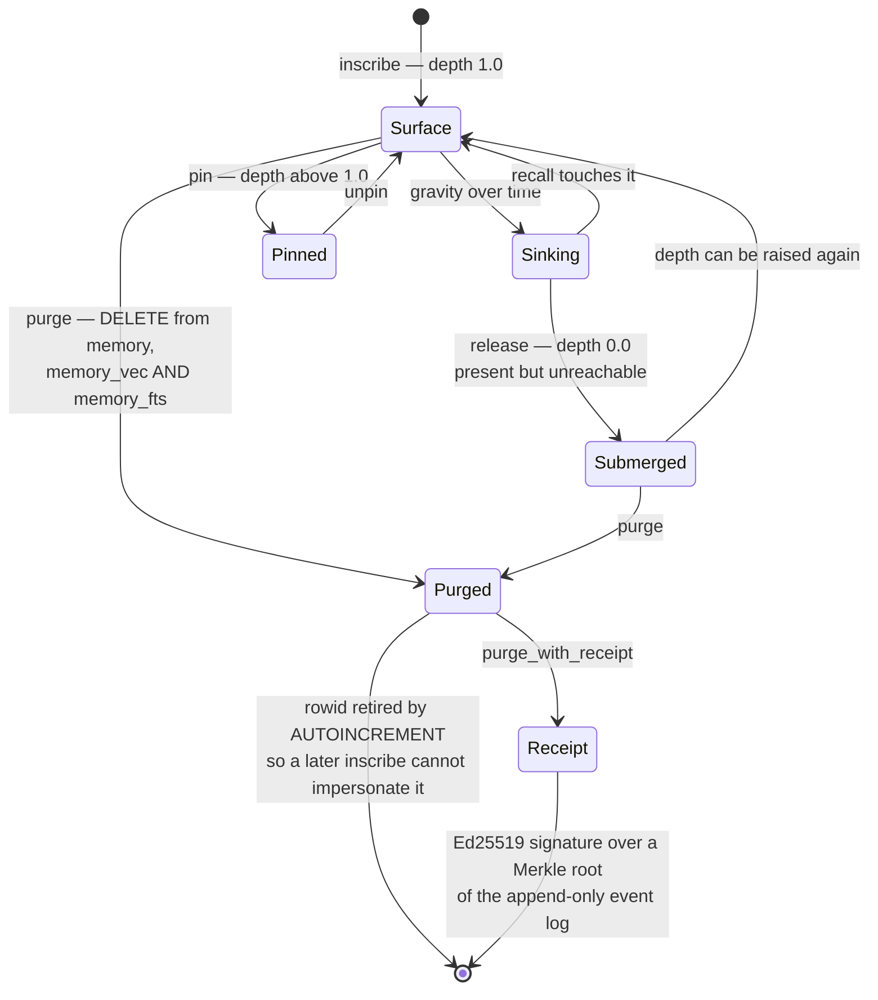

## 1. Executive Summary

Lethe is an MIT-licensed SQLite memory system of about 2,900 lines, shipped with
ForgetEval — an 11,000-line benchmark harness with adapters for six systems —
as the artifact behind *Control-Plane Placement Shapes Forgetting*
([arXiv:2606.15903](https://arxiv.org/abs/2606.15903), Dongxu Yang, June 2026).
It is the first system in this atlas built primarily around the control plane
rather than the recall plane, and the paper's framing is one this atlas has been
making report by report: recall is *"extensively benchmarked"* and the operations
that mutate memory — *"supersede, release, purge"* — are *"largely untested"*.

**The design collapses status into geometry.** `schema.sql` opens with *"ONE
physical axis: depth ∈ ℝ"*. A memory at depth 1.0 was just inscribed; between 0
and 1 it is sinking under gravity; at **depth 0 it is submerged — present but
unreachable**; above 1 it is pinned. There are no status enums, no `active`
boolean and no trust states: releasing a memory means setting a float to zero,
and pinning means pushing it above one. That is the opposite of
[TokenMizer](../tokenmizer/)'s eight discrete statuses, and it buys a property
discrete states cannot — every intermediate position is expressible, so decay,
release and promotion are the same operation at different magnitudes.

**Purge reaches every substrate, and the schema is arranged so it must.** The
FTS5 index carries a comment explaining the choice: *"Not contentless because we
want DELETE to work directly."* A contentless FTS5 table is the efficient
default and would have left purged text recoverable from the index; the
inefficient option was taken so that `_purge` can run three deletes — `memory`,
`memory_vec`, `memory_fts` — and be done. That is step 9 of this atlas's
[deletion test](../../benchmarks/) satisfied by construction rather than by a
sweep.

**And the deletion is provable afterwards.** `purge_with_receipt` issues an
Ed25519-signed statement that *"at time T, this system acknowledged the deletion
of records with these text hashes, when the event log's Merkle root was R"*. The
root commits to the whole append-only event log including the purge events, so
tampering with any earlier event changes the recomputed root and invalidates the
receipt. A verifier without database access can check non-forgery and that the
claimed records were purged; with database access, that the log has not been
rewritten. The OWASP security survey the atlas reviewed defines Verified
Forgetting formally and marks it *"no existing literature"*. This is it,
implemented, in 231 lines.

The care extends to detail. The schema uses `AUTOINCREMENT` specifically to keep
purged rowids out of SQLite's reuse pool, under a comment naming the invariant it
protects: *"a row erased at t0 can never be impersonated by a later inscribe
sharing its id"* — Proposition 1 in the paper. Almost nothing in this atlas
reasons about identity impersonation *after* erasure.

## 2. Mental Model

Reachability is a continuous quantity and everything acts on it. Gravity sinks a
memory over time; `surrender` pushes it down; `pin` holds it up; release is depth
zero; purge removes the row entirely. `recall` returns what is above water, and
`recall(at=T)` **reconstructs depth at T from the event log** and returns what
was above water then — time travel over reachability, which is possible only
because the event log records `depth_before` and `depth_after` on every mutation.

There is no epistemic layer at all. Nothing marks a memory doubtful, rejected or
verified; a memory is deep or shallow, and depth is about *findability* rather
than *truth*. The `trust_state` mark is withheld on the rubric's own terms — a
float is not a state — and it is worth saying that the omission is coherent
here: a system whose subject is deletion durability has chosen not to model
belief, and says so by having one column.

## 3. Architecture

One SQLite file, three tables kept in sync by the application: `memory` for
rows, `memory_vec` (a `vec0` virtual table) for embeddings, `memory_fts` (FTS5,
porter unicode61) for lexical search. The event table is append-only and indexed
three ways — by memory and time, by kind and time, and by time — because it is
read for time travel, for ForgetEval and for receipts.

`cryptography` is an optional dependency (`pip install 'lethe[crypto]'`), so the
receipt path degrades to unavailable rather than to unsigned.

## 4. Essential Implementation Paths

- `lethe/schema.sql` — the depth axis, the three tables, the event log, and the
  two comments that carry the design's invariants.
- `lethe/core.py` (789) — `inscribe`, `recall`, `surrender`, `_supersede`,
  `_edit`, `_purge`, `purge_with_receipt`, `pin`, `consolidate`, `blame`.
- `lethe/receipt.py` (231) — Merkle root, Ed25519 sign and verify.
- `bench/forgeteval/adapter.py` (936) — the six adapters.
- `bench/forgeteval/adversarial.py` (2,093) and `adversarial_generated.py`
  (2,324) — the 385-case surface.

## 5. Memory Data Model

`memory` is `rowid`, `text`, `depth`, `created_at`, `last_access`,
`access_count`, `meta`. `event` is `id`, `memory_id`, `kind`, `depth_before`,
`depth_after`, `timestamp`, `meta`.

Recording the depth on both sides of every mutation is what makes the log
replayable, and it is the difference between an audit that says *something
changed* and one that can reconstruct the state. Every clock is a record clock —
there is no validity time — so the mark is withheld even though the time-travel
query looks like bi-temporality from a distance. `recall(at=T)` answers "what was
findable then", not "what was true then".

**There is no scope key anywhere** — no user, agent, session or tenant column in
the schema or the API. One store, one owner, like [OptMem](../optmem/), and
calling that a deficiency would be a category error.

## 6. Retrieval Mechanics

Hybrid vector and BM25 fused by reciprocal rank, with two deliberate escape
hatches. `hybrid=False` drops the BM25 leg. `lexical=True` forces pure BM25 with
the reasoning written down: it is *"the right primitive for identifier lookup
(emails, API keys, names), where vector similarity blurs near-paraphrases that
are semantically distinct"*. That sentence is also the diagnosis behind the
paper's headline weakness — Lethe scores 5% on identifier obfuscation and 0% on
cross-lingual identifiers without a model in the loop.

`blame(query)` returns `BlameEntry` records — why a given recall surfaced what it
did.

## 7. Write Mechanics

`inscribe` and `inscribe_many` write; the control-plane verbs mutate depth or
remove. Every one logs an event before acting, so the log leads the state.

`purge_with_receipt` snapshots the texts **before** deleting and filters to rows
that actually exist, with a comment saying why: *"The receipt must reflect what
was truly purged, not what"* was asked for. A receipt that certified a deletion
that did not happen would be worse than no receipt.

`consolidate` and gravity are the background shape, though both run on demand
rather than on a schedule.

## 8. Agent Integration

A CLI and an MCP server, plus five worked recipes that are unusually well chosen
for this atlas's concerns: OTP TTL, **GDPR purge receipt**, **belief revision**,
pin preferences, and **time-travel debug**. A repository whose examples are a
right-to-erasure flow and a belief revision is a repository that knows what its
mechanism is for.

## 9. Reliability, Safety, and Trust

**`audit_log` is earned** on the `event` table — append-only, named, in the
system's own store, carrying `depth_before` and `depth_after` per mutation, and
load-bearing for three separate features rather than written and ignored.

**`negative_eval` is earned emphatically.** ForgetEval is a committed benchmark
whose entire premise is asserting that released, superseded and purged content is
*not* returned, across 385 adversarial cases in ten categories — substring traps,
prefix collisions, paraphrase supersession, negation, temporal qualifiers, shared
attributes, compound facts, identifier obfuscation, cross-lingual identifiers and
recursive supersession. Most negative suites in this atlas are a handful of
assertions; this is the column's subject built out as a research artifact.

**No tombstone, and it is the sharpest near-miss in the corpus.** `_purge`
deletes the row and its two index entries; nothing prevents the same text being
inscribed again a minute later. And the material for the block already exists —
`purge_with_receipt` computes a `text_hash` for every purged record and signs it.
A system that hashes the values it deleted, for the purpose of proving they were
deleted, is one lookup away from refusing to store them again. It does not do
that lookup, so Lethe can *prove* a value was forgotten and cannot *keep* it
forgotten.

**No trust state, no bi-temporality, no scope, no human review** — all coherent
with the design, as above.

## 10. Tests, Evals, and Benchmarks

`tests/test_depth.py` holds 22 functions, none run here. The real evaluation is
ForgetEval, and it is examined on the [benchmarks page](../../benchmarks/) rather
than here, with two findings worth naming in both places.

**The reporting is unusually disciplined.** The three deterministic systems land
in a 63–68% band that the README reads as *"mutually overlapping Wilson CIs — the
bench reads the trade-off, not a winner"*, and **Lethe places third of the three
at 63.4%, behind Mem0 at 68.3%**. A benchmark whose author's own system does not
win, reported with confidence intervals and an explicit refusal to declare a
winner, is the opposite of the vendor-run comparisons this atlas has had to
discount elsewhere.

**One row is wrong, and it is about a system this atlas has read.** MemPalace
scores 0/385, and the adapter's docstring says *"MemPalace is verbatim-everything:
it does NOT support delete, update, or supersede"*, raising `NotImplementedError`
for all three. At MemPalace's own pinned commit its MCP server exposes
`delete_drawer`, `delete_by_source` and `delete_hallway`. The primitives exist;
what does not exist is a *content-addressed* one — ForgetEval's contract is
`purge(query)`, and MemPalace deletes by drawer id and by source file, so wiring
it needs a search-then-delete bridge. "Harder to wire" and "has no delete
primitive" are different claims, and the adapter makes the second.

The 385 cases and their oracle labels are committed; the scored results are not,
living instead in a README table. That is a better position than most — a reader
can re-run and get their own numbers — and it is still a claim rather than an
artifact.

## 11. For Your Own Build

### Steal

- **Make your lexical index non-contentless so DELETE reaches it.** One comment,
  one storage decision, and the substrate that most often survives a deletion
  stops surviving it.
- **Retire the id, not just the row.** `AUTOINCREMENT` keeping purged rowids out
  of the reuse pool means a later write cannot impersonate an erased record.
  Nothing else in this atlas defends against that.
- **Log `before` and `after` on every mutation.** It is the difference between an
  audit that says something changed and a log you can replay into past state.
- **Sign the deletion.** A Merkle root over the event log plus an Ed25519
  signature turns "we deleted it" from an assertion into something a third party
  can check without your database.
- **Snapshot what you are about to delete, and filter to what exists.** A receipt
  must describe what was purged, not what was requested.
- **Ship the escape hatch for identifier lookup.** Pure BM25 when the query is an
  email or an API key, because vector similarity blurs exactly the distinctions
  that matter there.
- **Publish a benchmark your own system loses.** Third of three, with confidence
  intervals and no declared winner, is what makes the other numbers credible.

### Avoid

- **Hashing what you deleted and not checking it on write.** The tombstone is
  already computed. Consulting it before `inscribe` is a `SELECT`.
- **Asserting a system's design from an adapter you could not wire.** The
  MemPalace row is a measurement of the adapter, and it is reported as a property
  of the library.

### Fit

Take Lethe if deletion has to be *provable* — a right-to-erasure flow, a
regulated store, anything where "we removed it" needs to survive a challenge. It
is the only system in this atlas that can hand you an artifact a third party can
verify, and the recipes show the author knows that is the point.

Look elsewhere for multi-tenancy, for belief, or for scale: there is no scope key
at all, no trust state, and the store is one SQLite file with an application-synced
vector index.

## 12. Open Questions

- **What does the receipt cost at volume?** A Merkle root over the entire event
  log is recomputed per receipt, and nothing here measures it as the log grows.
- **Does anyone verify a receipt?** `verify_receipt` exists; whether the recipes
  or a downstream consumer exercise it was not traced.
- **Would the hash check work?** Consulting purged `text_hash` values on inscribe
  is the obvious next step, and the paper's identifier-obfuscation and
  cross-lingual results suggest exact hashing would miss the interesting attacks
  — which is an argument for the LLM hook the paper already recommends.
- **How does depth behave over a long store?** Gravity plus consolidation with no
  scheduled pass means the shape of a year-old store was not established.

## Appendix: File Index

| Path | Lines | What it holds |
| --- | --- | --- |
| `bench/forgeteval/adversarial_generated.py` | 2,324 | LLM-drafted adversarial cases |
| `bench/forgeteval/adversarial.py` | 2,093 | Hand-crafted adversarial cases |
| `bench/forgeteval/adapter.py` | 936 | Six adapters and the control-plane contract |
| `lethe/core.py` | 789 | Inscribe, recall, the control-plane verbs, blame |
| `bench/forgeteval/generate.py` | 599 | Case generation |
| `lethe/cli.py` | 473 | CLI |
| `lethe/receipt.py` | 231 | Merkle root, Ed25519 sign and verify |
| `lethe/schema.sql` | — | The depth axis, three synced indexes, the event log |
| `recipes/` | — | OTP TTL, GDPR purge receipt, belief revision, time travel |
