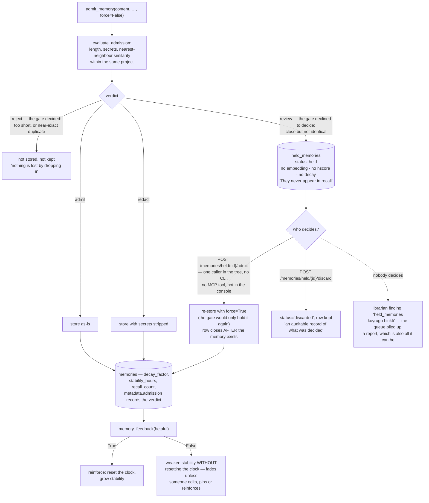

## 1. Executive Summary

LEVH is a local-first memory layer — "Memory that forgets like you do — unless it
matters" — AGPL-3.0-or-later, Python, version 2.31.0, 54,347 lines of which
26,342 are Python, with 896 test functions across ninety-six files, on PyPI, with
an MCP server, an HTTP API, a React console and connectors for Notion, GitHub,
email, calendar and local files. Comments are in English and Turkish.

The pitch is forgetting: every memory carries its own decay factor and a
stability in hours, recall reinforces, and ranking is an H(x,ψ) over similarity,
decay, importance and frequency. The second pitch is sharing — one SQLite file
that any number of MCP-speaking agents open as separate processes, so "an agent
never re-solves a problem another agent already closed".

The part worth the visit is neither. It is the admission gate, and one
distinction inside it.

**A refusal to store and a refusal to judge are different things.** The gate
returns one of four verdicts — admit, redact, review, reject — and the docstring
insists the last two not share a path:

> "``review`` and ``reject`` are not the same refusal and must not share a path.
> ``reject`` is the gate deciding — too short, or a near-exact duplicate of
> something already remembered, so nothing is lost by dropping it. ``review`` is
> the gate declining to decide: the candidate is close to an existing memory but
> not identical, which is exactly the case where the difference may be the part
> worth keeping. Discarding it would throw away content on the strength of a
> judgement the gate itself refused to make."

Most admission filters in this corpus have two outcomes, in and out, and a
near-duplicate goes out. This one has a third state with a table behind it, and
the schema comment says what happened before that table existed:

> "Without it the verdict had no store behind it and the content was dropped,
> which is the one thing a memory layer must not do quietly."

A held candidate is explicitly not a memory — no embedding, no H-score, no decay
— and "one becomes a memory only when a human admits it". The implementation
holds the line in the places that matter: admission re-stores with `force=True`
because "[t]he decision being recorded here is the human's, and it overrides the
gate by design"; the held row closes only after the memory exists, since "losing
it here would reintroduce exactly the bug this table was added to fix"; a discard
leaves the row standing "so the queue is an auditable record of what was decided
rather than only of what is still waiting"; and the transition is a compare-and-set
that answers `already_decided` to the second caller.

That is the mark, and it is a well-built one.

**And nothing shipped can drain the queue.** `admit_held_memory` and
`discard_held_memory` have exactly one caller each — an HTTP route. There is no
CLI command for them, no MCP tool, and the React console shows the queue only as
a number inside the admission-gate settings panel. To decide a candidate a person
must call the API by hand with an id that no shipped client lists.

Everything else in the product counts the queue and none of it can act: capture
prints "Held for review: N", connector sync and export report a `held` total, and
the librarian raises a finding when the backlog crosses a threshold — a finding
whose own text says these are the near-duplicates the gate asked a human to judge,
and that if they are not decided "hafızaya hiç girmezler", they never enter memory
at all. A watcher warning about a queue with no drain is the shape of the gap.

The distance between the design and the product is small and specific: one list
view and two buttons, or one CLI subcommand. Until then, a verdict the gate was
careful not to guess at becomes content that sits undecided — better than
dropping it silently, which is what the table was built to stop, and not yet the
review loop the schema describes.

Two marks were considered and withheld. `project` is an optional argument to
`recall`, defaulted to `None` and omittable, so it is a filter a caller may pass
rather than a predicate the store enforces. And `test_a_held_candidate_is_not_a_memory`
asserts `(await engine.recall(NORMAL, top_k=5)).memories == []` — a genuine
must-not-retrieve assertion — but its control lives in the next test rather than
beside it, which is the same shape this atlas declined for [Engram Format](../engram-format/).

## 2. Mental Model

A **memory** decays unless something reinforces it.

A **verdict** is one of four, and two of them mean "no" for different reasons.

A **held candidate** is content nobody has judged yet. It is not a memory and it
is not gone.

A **finding** is a report. Nothing acts on it by itself.

## 3. Architecture

| Area | Role |
| --- | --- |
| `core/engine/ingest.py` | The gate, the hold queue, the admit and discard decisions |
| `core/engine/recall.py` | Filters before ranking, pinned handling |
| `core/engine/decay.py` | Decay, reinforcement, SM-2 feedback, the review queue |
| `core/hscore.py` | H(x,ψ) = α·(1−similarity) + β·(1−decay) + γ·(1−importance) + δ·(1−frequency) |
| `core/db/schema.py` | One file holding every table and its reasoning |
| `core/librarian/` | Watches, and writes findings it cannot act on |
| `routes/`, `tools/` | The HTTP API and the MCP tool surface |
| `connectors/` | Notion, GitHub, email, calendar, local files |

## 4. Essential Implementation Paths

`core/engine/ingest.py:56-140` — the four verdicts and where each goes.

`core/engine/ingest.py:196-252` — admit and discard, and the ordering comment
that explains why the row closes last.

`core/db/schema.py:151-204` — the held queue and the findings table, each with a
comment stating what it refuses to do.

## 5. Memory Data Model

One `memories` table with a decay factor, a stability in hours and a recall count
beside the usual fields, plus `pinned` as an exemption. Around it: `entities` and
`memory_entities`; `memory_conflict_candidates` with a status of
`open|dismissed|confirmed|resolved`, labelled in the schema as a "review signal,
never a verdict"; `attachments` whose status flips to `missing` or `changed` when
a verify pass finds the file gone or its hash changed; `memory_trust_scores`,
described as a "deterministic reliability signal, NOT truth" with a breakdown per
component; and `violations`, an incident log recording which learned rule was
broken, from what, and whether it still stands.

The habit across all of these is the same and it is the project's best trait: a
table comment that says what the table is *not* for.

## 6. Retrieval Mechanics

Vector similarity, then H(x,ψ) ranking, with filters applied before ranking so a
filtered recall still returns a full set rather than the survivors of a
truncation. `project` is one of those filters, and it is an argument with a
`None` default.

## 7. Write Mechanics

The gate, then a store that records the verdict in `metadata.admission` —
including `forced`, set when a human overrode a review or reject. A memory's
provenance therefore carries not just where it came from but whether the gate
wanted it.

Feedback is SM-2 shaped with one asymmetry worth copying: `helpful=False` weakens
stability *without* resetting the decay clock, so a memory judged wrong fades
quickly rather than being refreshed by the act of being judged. A test pins the
matching invariant — "negative feedback is not a successful recall".

## 8. Agent Integration

MCP tools with a role profile (`admit_memory` is `admin`), an HTTP API, and a
React console. The concurrency claim — many agent processes, one SQLite file — has
a test of its own asserting no own-write vanishes from recall under concurrent
load.

## 9. Reliability, Safety, and Trust

Secrets are redacted at the gate rather than after storage. Attachments are
verified by hash and a mismatch raises a conflict candidate rather than silently
updating. Findings are fingerprinted so one recurring problem is one row with a
rising count, and the schema states the boundary: "Nothing in this table reaches
the outside world (a GitHub issue, say) without an explicit human step."

That restraint is consistent and deliberate. Its cost is visible here: a system
this careful to require a human step needs to give the human a place to take it.

## 10. Tests, Evals, and Benchmarks

896 test functions across ninety-six files, including a dedicated held-queue suite
whose test names read as the specification — a review verdict holds the content
instead of dropping it, a held candidate is not a memory, a rejected candidate is
still dropped, admitting reproduces the original memory, a candidate can only be
decided once. One assertion carries a comment that is the whole history: "The
whole defect in one assertion: 'not stored' used to also mean 'gone'."

## 11. For Your Own Build

Separate the two refusals. "I decided no" and "I will not decide" are different
answers and they deserve different destinations. Almost every admission filter in
this corpus collapses them, and the collapse is silent.

Close the row after the write, not before. The two-line comment explaining that
ordering is worth more than the code it guards.

Ship the surface for the human step. A queue that only a hand-written HTTP call
can drain will not be drained, and a watcher that reports the backlog is not a
substitute for a button.

Weaken without resetting. Negative feedback that touches the decay clock rewards
a memory for being wrong.

## 12. Open Questions

Whether a held candidate expires. Nothing was found that ages the queue out, and
the librarian finding suggests the expected end state is a person acting.

Whether a discarded candidate is consulted on a later write. The row is kept —
which is what a value-keyed tombstone would need — but no read of `status='discarded'`
was found on the write path.

Which client was expected to list the queue. The routes, the counts and the
finding all assume one exists.

## Appendix: File Index

| Path | What to read it for |
| --- | --- |
| `server/core/engine/ingest.py:56-140` | Four verdicts, and why two of them differ |
| `server/core/engine/ingest.py:196-252` | The human decision, and the ordering that protects it |
| `server/core/db/schema.py:151-178` | A queue that states what it is not |
| `server/core/db/schema.py:185-204` | A findings table that refuses to act |
| `server/core/engine/decay.py:36-60` | Weakening without resetting the clock |
| `tests/test_admission_held_queue.py:85-180` | The defect, in test names |

## History

**2026-09-19** — re-pinned to [`9bdcb25f52387814f389c7cf816959b297d74d59`](https://github.com/ali-ulu/levh/commit/9bdcb25f52387814f389c7cf816959b297d74d59), 13 commits on. The mark stands. Its anchors were re-resolved — the `held_memories` table and the comment block that states its invariant now run `schema.py:168-195`, and `admit_held_memory` and `discard_held_memory` are at `ingest.py:196` and `:238` — and the record gained the half of the producer test it was missing. The previous version established that each has exactly one caller, an HTTP route; what it did not check is whether the agent reaches that surface. It does not: `server/mcp_stdio.py` contains neither `admit` nor `held`, so the stdio tools the agent is given carry no verb that resolves a held candidate. The compare-and-set in `held.py:77` is unchanged. Screened again first; nothing was installed and no suite was run.

**2026-09-16** — [`6802ac81397abdf596cf8392b54dee461ec54226`](https://github.com/ali-ulu/levh/commit/6802ac81397abdf596cf8392b54dee461ec54226) — first reading, at a commit dated 16 September 2026. Screened before opening, from a shallow clone: six files scanned, no auto-run surfaces, one build-time execution point, two unpinned surfaces and three dependency files inside the seven-day cooldown. Nothing was installed, built or run.
