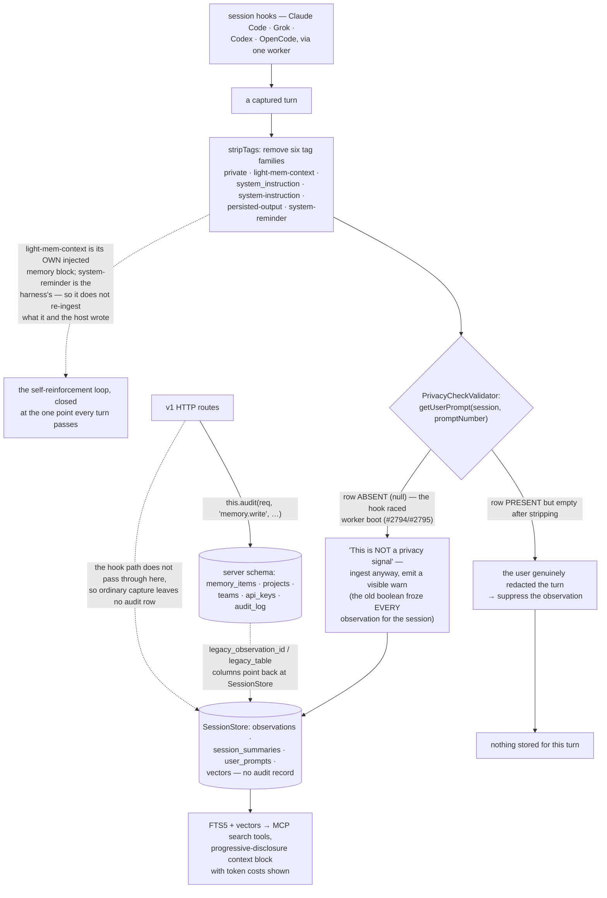

## 1. Executive Summary

light-mem is "[l]ightweight persistent memory for Claude Code, Grok, Codex, and
OpenCode" — Apache-2.0, TypeScript, Node 24+, 74,394 lines with 1,778 test cases
across 153 test files, installed with `npx light-mem install` or from the Claude
Code plugin marketplace. Session hooks capture turns into a shared worker, a
context block is injected into new sessions, and MCP search tools plus a web
viewer on the worker port let a person or an agent go back through it.

Two decisions are worth the visit, and both are about what *not* to store.

**Redaction happens before storage, and it strips more than the privacy tag.**
`stripTags` removes six tag families in one pass:

```
private · light-mem-context · system_instruction ·
system-instruction · persisted-output · system-reminder
```

The privacy one is the advertised feature — wrap a message in `<private>` and it
never lands. The two that matter more are `light-mem-context`, which is the
tool's own injected memory block, and `system-reminder`, which is the harness's.
Stripping both means the system does not re-ingest what it and the host put into
the prompt in the first place. That loop — an agent reading its own prior memory,
restating it, and storing the restatement as a fresh observation — is the
self-reinforcement failure [OWASP's memory guard](../agent-memory-guard/)
describes as a threat, and most systems in this corpus meet it only after it has
already compounded. Here it is closed by a regular expression in a utility
module, at the one point every captured turn passes through.

**And an absent prompt is distinguished from a redacted one.** The privacy check
used to be a boolean, and the docstring says what that cost:

> "Distinguishes two cases the old boolean check conflated (#2794): The
> `user_prompts` row is ABSENT (getUserPrompt → null): session-init never
> persisted the prompt for this session (e.g. the UserPromptSubmit hook raced
> worker boot, #2795). This is NOT a privacy signal — treating it as 'private'
> silently freezes EVERY observation for the session. Allow ingestion and emit a
> visible warn. The row is PRESENT but empty after privacy stripping
> (''/whitespace): the user genuinely redacted the turn → suppress."

Absence of evidence read as evidence of absence, found in production, named with
two issue numbers, and split into two paths with a warning on the one that used
to be silent. This atlas keeps finding the unfixed version of that mistake; this
is the fixed one, with its history attached.

The direction it fails in is worth stating plainly, because the project chose it:
when the row is missing because of a race, the turn is ingested. That is right
for a memory tool whose failure mode was freezing an entire session, and it is
wrong if the missing row was the redacted one. The code makes the trade loudly
rather than quietly, which is the part to copy.

No marks, and the reason is structural. **There are two stores and only one is
audited.** The store the hooks write — `observations`, `session_summaries`,
`user_prompts`, `vectors` in `SessionStore` — has no mutation record. The
`audit_log` table, with an actor type of `user | api_key | system`, an action and
a target, belongs to the newer server schema alongside `memory_items`, `projects`,
`teams` and scoped `api_keys`, and is written from the v1 HTTP route layer. Those
two schemas are bridged by `legacy_observation_id` and `legacy_table` columns
whose existence says which one came first. So an agent's ordinary capture — the
product's main path — leaves no audit row, and the mark is withheld rather than
awarded to a layer the hooks do not use.

Nothing else here is epistemic either: `memory_items.kind` is a write-time genre
of `observation | summary | prompt | manual`, no status withholds a record from a
read, and nothing supersedes or retires a claim. The privacy work is real and
happens earlier than a filter could; it is not a filter, so it earns no
filtering mark.

One small discrepancy for a reader checking versions: the README badge advertises
13.7.4 and `package.json` says 0.3.3.

## 2. Mental Model

A **turn** is captured automatically, and passes one stripper on the way in.

A **stripped-empty prompt** means the user redacted it. A **missing** prompt row
means something went wrong.

Its **own context block** is not input.



## 3. Architecture

| Area | Role |
| --- | --- |
| `src/hooks`, `src/cli/handlers` | The harness hooks and their handlers |
| `src/services/worker` | The shared worker, its HTTP routes and validators |
| `src/services/sqlite/SessionStore.ts` | Observations, summaries, prompts, vectors |
| `src/storage/sqlite/` | The newer server schema: memory items, teams, keys, audit |
| `src/utils/tag-stripping.ts` | The six tag families, in one regular expression |
| `src/ui`, `src/servers` | The web viewer and the MCP surface |

## 4. Essential Implementation Paths

`src/utils/tag-stripping.ts:1-45` — the list, and why two of the names are the
interesting ones.

`src/services/worker/validation/PrivacyCheckValidator.ts:1-45` — two cases a
boolean conflated.

`src/storage/sqlite/schema.ts:85-150` — the newer schema, and the legacy columns
that date it.

## 5. Memory Data Model

Observations with a title, subtitle, narrative, text, facts, concepts, files read
and files modified — a richer capture than most hook-driven tools, and the basis
for the citation feature that lets a later session reference a past observation
by id. The server schema mirrors those columns on `memory_items` and adds a
`memory_sources` row per item with a `source_type` constrained to
`observation | session_summary | user_prompt | manual | import`.

## 6. Retrieval Mechanics

FTS5 with a vector table beside it, surfaced as MCP search tools and as a
progressive-disclosure context block that shows what each layer costs in tokens.
Making the token price of injected context visible to the person configuring it
is a small and unusual courtesy.

## 7. Write Mechanics

Automatic, off the hook path, through the worker. The stripper is the only gate,
and it is a good one; there is no de-duplication, no supersession and no conflict
handling, so a fact restated across sessions is stored as many times as it is
said.

## 8. Agent Integration

Four hosts through one worker, a plugin marketplace entry, and an explicit note
that `npm install -g` gets the library only and not the hooks. The screening pass
flags what that implies: a plugin manifest, harness hook settings and
agent-instruction files are all part of the distribution, which is expected for
this class of tool and worth knowing before installing it.

## 9. Reliability, Safety, and Trust

The write-time redaction is the trust story and it is well placed. What is
missing is any record of what changed: neither store versions a memory, and the
audit log that exists does not cover the path the hooks use.

## 10. Tests, Evals, and Benchmarks

1,778 test cases across 153 files, including a tag-stripping suite that pairs
each removal with an assertion that the surrounding public text survived — the
right shape, at the unit level. Nothing was installed or run for this reading.

## 11. For Your Own Build

Strip your own context block back out. If you inject memory into a prompt and
then capture that prompt, you are storing your own output as an observation; one
tag name in the stripper list prevents it.

Distinguish missing from redacted. A boolean that reads "no prompt" as "private"
will silently stop recording an entire session, and the silence is what makes it
expensive.

Redact before storing, not before serving. Text that never enters the store
cannot leak from it, and no later read path has to remember a filter.

And when you choose a failure direction, write down which way you chose. This
code ingests on a missing row and says so in a warning; the alternative is
defensible too, and only one of them is documented.

## 12. Open Questions

Whether the two stores are converging. The `legacy_*` columns suggest a
migration in progress; which one wins was not established.

Whether the audit log is reachable in the default install. The v1 routes are a
server surface, and whether a local single-user install exercises them was not
traced.

What the version badge refers to. The README advertises 13.7.4 against a
`package.json` at 0.3.3.

## Appendix: File Index

| Path | What to read it for |
| --- | --- |
| `src/utils/tag-stripping.ts:1-45` | Six tag families, two of them its own |
| `src/services/worker/validation/PrivacyCheckValidator.ts:1-45` | Absent is not redacted |
| `src/storage/sqlite/schema.ts:85-150` | A newer schema, and the columns that date it |
| `src/services/sqlite/SessionStore.ts:195-215` | The store the hooks actually write |

## History

**2026-09-16** — [`6c96cb651749d0456d40424242985e76e5bc5edc`](https://github.com/DevEstacion/light-mem/commit/6c96cb651749d0456d40424242985e76e5bc5edc) — first reading, at a commit dated 16 September 2026. Screened before opening, from a shallow clone: eleven files scanned, three auto-run surfaces (a plugin manifest, harness hook settings and agent-instruction files), one build-time execution point, two unpinned surfaces and three dependency files inside the seven-day cooldown. Nothing was installed, built or run.
