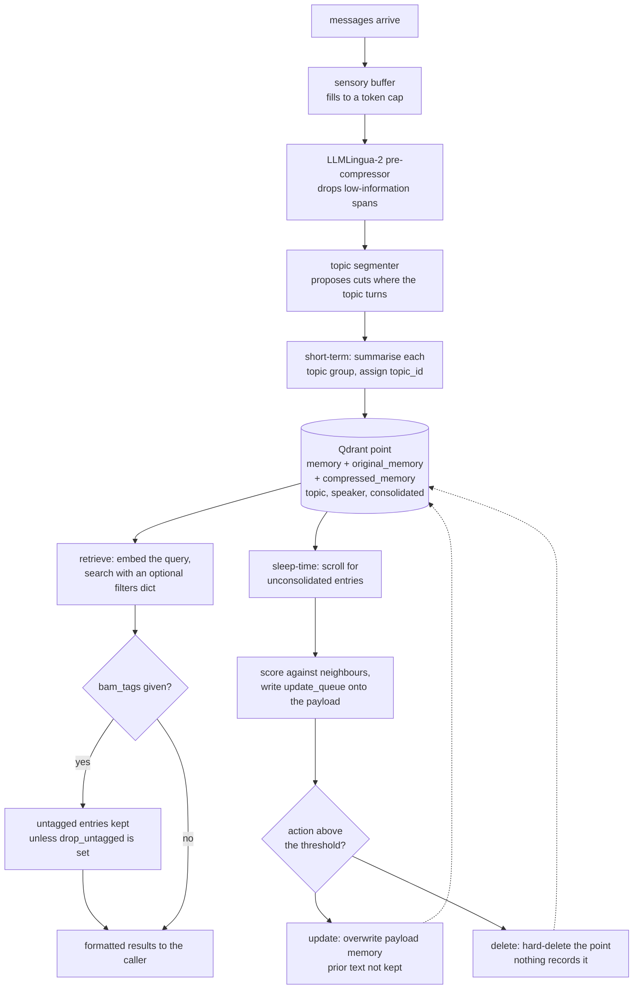

## 1. Executive Summary

LightMem is the reference implementation of *LightMem: Lightweight and Efficient
Memory-Augmented Generation* ([arXiv:2510.18866](https://arxiv.org/abs/2510.18866),
submitted 21 October 2025, ICLR 2026), from ZJU-NLP. Its argument is about cost
rather than recall quality: existing memory systems *"often introduce
substantial time and computational overhead"*, and the fix is to filter hard
before storing and to move consolidation off the request path entirely.

MIT; 306 commits between 11 June 2025 and 5 September 2026 from twenty-three
authors; 98,482 lines of Python across three sibling packages — `lightmem`
(43,466), `em2mem` (51,630) and `fluxmem` (3,386), each with its own README —
of which this report reads `lightmem`, the one the paper describes. The screen
found no auto-run surface, one build-time execution path, four unpinned
dependency surfaces including a `requirements.txt` with twenty-six unversioned
entries, and nothing inside the seven-day cooldown; nothing was installed or run.

**The mechanism is a three-stage ladder taken from Atkinson-Shiffrin.** A
sensory buffer accumulates messages to a token cap; an LLMLingua-2 pre-compressor
and a topic segmenter cut the buffer into topic groups and throw away what they
judge irrelevant; a short-term stage summarises each group; the result is
embedded into Qdrant. Then, offline, a sleep-time update scores each entry
against its neighbours, builds an `update_queue` on its payload, and applies a
rewrite or a delete.

**Both the original and the compressed text stay on the row.** The payload
carries `memory`, `original_memory` and `compressed_memory` together. For a
system whose central move is discarding, keeping the lineage of what was
discarded is the right instinct, and it makes a compression decision checkable
after the fact.

**It carries no capability marks, and that is a description rather than a
verdict.** The payload has no status, no confidence, no owner key and no
validity interval. `consolidated` is a boolean the consolidation scan reads to
find work. `memory_class`, `category` and `subcategory` are write-time genres.
`speaker_id` and `speaker_name` are recorded and nothing filters on them. The
one filter that exists — `filter_by_tags` against environment tags — keeps
untagged entries by default, documented as being *"for backward
compatibility"* during migration.

**The offline update is the part to read before adopting.**
`offline_update_all_entries` applies `delete` by hard-deleting the Qdrant point
and `update` by assigning `new_payload["memory"] = updated_entry.get(
"new_memory")` and overwriting. Nothing records the prior text, nothing records
that a delete happened, and `original_memory` on the surviving row still refers
to *its own* pre-compression text rather than to whatever was merged into it. A
consolidation that merges two facts wrongly leaves no trace in the store.

**The efficiency claims are large and their harness is committed without a
result.** The paper reports up to 7.7% / 29.3% QA-accuracy gains on LongMemEval
and LoCoMo, with total token reductions up to 38× / 20.9× and online-only
reductions up to 106× / 117×. `experiments/locomo/` and
`experiments/longmemeval/` hold the runner scripts, the judge and the
retrievers; no result file for either benchmark is in the tree.

## 2. Mental Model

The design starts from a claim about where memory systems waste money: they
embed and store everything, then pay an LLM at read time to make sense of the
pile. LightMem inverts that. The filtering happens first, on a stream, with a
small model.

Messages land in a sensory buffer that grows to a token cap. When it is full, a
compressor and a segmenter look at the buffer together: the compressor drops
what it judges low-information, and the segmenter proposes cuts where the topic
changes. What comes out is a set of topic groups rather than a set of turns.

Each group is summarised into a short-term memory with a topic id and a summary,
then embedded and written. That is the whole online path, and it deliberately
contains no consolidation, no conflict check and no update.

Consolidation is a separate act on a separate clock — the paper's *sleep-time
update*. It scans for unconsolidated entries, scores each against its
neighbours, and writes a queue of proposed actions onto the entry itself. A
later pass reads the queue and applies the ones above a threshold: rewrite the
memory text, or delete the point. The design's bet is that this is the right
place for the expensive work, because nobody is waiting for it.

What the model has no representation for is doubt. There is no state that says a
memory is unverified, no confidence, nothing that records that a fact was
retired. The ladder describes how information gets *smaller*; it does not
describe how it gets *less true*.



## 3. Architecture

A Python library, not a service. `LightMemory` (`src/lightmem/memory/lightmem.py`,
879 lines) is the entry point, constructed directly or through `from_config`.
Everything below it is a factory with pluggable implementations:
`memory_buffer`, `memory_manager`, `pre_compressor`, `retriever`,
`text_embedder`, `multimodal_embedder`, `topic_segmenter`.

Several of those factories currently have one implementation each — the
embedding retriever is Qdrant, the pre-compressor is LLMLingua-2 beside an
entropy-based variant, the topic segmenter is LLMLingua-2. The factory shape is
an invitation rather than a claim of breadth.

The repository is three systems in one tree. `src/em2mem/` is 51,630 lines with
its own `EM2Mem.md` and a VLM2Vec embedding subdirectory; `src/fluxmem/` is
3,386 lines with `FluxMem.md`; `StructMem.md` sits at the root describing a
fourth. A reader looking for the paper's system should be clear that
`src/lightmem/` is it, and that the other packages are separate work sharing a
repository.

Beside the library sit `experiments/` (egolife, locomo, longmemeval), `mcp/`,
`web/` with a React frontend, `tutorial-notebooks/` and `dataset/`.

## 4. Essential Implementation Paths

- **Buffer and cut.** `SenMemBufferManager.add_messages(messages, segmenter,
  embedder)` accumulates to `max_tokens` and returns segments; the sole test
  file exercises the oversized-single-message case.
- **Write.** `LightMemory.add_memory` (`lightmem.py:204-395`) → compress and
  segment → summarise → embed → collision-safe id (`while
  self.embedding_retriever.exists(ids): ids = str(uuid.uuid4())`) → build the
  payload at `:420-437` → `embedding_retriever.insert`.
- **Retrieve.** `LightMemory.retrieve` (`:646-710`) → embed the query →
  `embedding_retriever.search(query_vector, limit, filters, return_full=True)`
  → optional `filter_by_tags(query, results, environment_tags,
  drop_untagged_on_tag_filter)` → format each hit as a string carrying
  `time_stamp`, `weekday` and `memory`.
- **Queue the update.** `construct_update_queue_all_entries(top_k=20,
  keep_top_n=10)` (`:459-540`) → for each entry, find neighbours, build an
  `update_queue`, write it back into a copied payload.
- **Apply the update.** `offline_update_all_entries(score_threshold=0.9)`
  (`:541-645`) → per entry, if the action is `delete`,
  `embedding_retriever.delete(eid)`; if `update`, set
  `new_payload["memory"]` and call `embedding_retriever.update`.
- **Account.** `get_token_statistics` (`:711-751`) reports what each stage
  spent, backed by `memory_toolkits/token_monitor.py`.

## 5. Memory Data Model

One Qdrant point per memory. The payload is fourteen fields plus an optional
fifteenth, and it is worth listing because what is present and absent is the
report's finding.

**Present.** `memory` — the stored text. `original_memory` and
`compressed_memory` — the lineage of the compression that produced it.
`time_stamp`, `float_time_stamp` and `weekday` — record time in three
representations, the last of which is unusual and is used in the formatted
retrieval output. `topic_id`, `topic_summary`, `category`, `subcategory`,
`memory_class` — the topical organisation the second stage produces.
`speaker_id` and `speaker_name` — who said it. `consolidated` — a boolean.
`bam_tags` — present only when environment tags were supplied at write.

**Absent.** No status, so nothing distinguishes a candidate from a confirmed
memory. No confidence. No owner, tenant, session or project key. No validity
interval — a search of the package for `valid_from`, `valid_to` and `as_of`
returns nothing. No supersession pointer and no deletion marker.

`consolidated` deserves a note because it looks like a state and is not one. The
consolidation pass calls `retriever.scroll` for entries where it is false, uses
them to find work, and sets it true when done (`utils.py:586-595`). It is a
processing flag on a background pass, not something the read path consults, and
it cannot turn out to be false in the way a claim can.

Keeping `original_memory` beside `compressed_memory` is the model's best idea. A
system whose thesis is aggressive discarding should let a reader see what was
discarded, and this one does — at the row level.

## 6. Retrieval Mechanics

Embed the query with the configured text embedder, search Qdrant with a limit
and an optional `filters` dict passed straight through, return full payloads.
There is no hybrid arm, no rerank, no graph walk: retrieval is vector similarity
over the compressed, topic-summarised entries, and the design's argument is that
the work done at write time is what makes that sufficient.

The one post-filter is `filter_by_tags` (`utils.py:905-960`), and its defaults
matter. `drop_untagged_on_tag_filter` is `False`, so an entry with no tags is
kept even when the caller supplies environment tags — the docstring says
untagged memories pass *"during migration"* and that keeping them is the
backward-compatible default. The default matcher is binary: *"scores are binary:
`1.0` means at least one tag overlaps, not vector similarity."*

So the filter fails open. A caller who supplies environment tags to narrow a
result gets the tagged matches *plus* everything untagged, unless they also pass
`boundmem_drop_untagged=True`. For a filter whose purpose is to keep
out-of-context memories out, a permissive default is the wrong direction, and it
is the reason this is not a scope mechanism in the sense the atlas means.

Results are formatted as strings carrying the timestamp, the weekday and the
memory text, so the caller receives prose rather than structured rows.

## 7. Write Mechanics

The online write path is the paper's efficiency claim made concrete. Messages go
into a buffer; when the token cap is reached, a small model — LLMLingua-2 rather
than the generation model — compresses and segments; a summarisation produces
one memory per topic group; that is embedded and inserted. No consolidation, no
conflict detection, no LLM call on the generation model.

Ids are content-derived with a collision guard: `while
self.embedding_retriever.exists(ids): ids = str(uuid.uuid4())`. That prevents an
overwrite and also means re-adding identical content produces a second point
rather than being idempotent.

**The offline path is where the risk sits.**
`construct_update_queue_all_entries` scores an entry against its top neighbours
and writes an `update_queue` onto its own payload — an interesting choice, since
the proposal lives on the row it concerns rather than in a separate queue.
`offline_update_all_entries` then applies actions above a score threshold
defaulting to 0.9, in a thread pool with a write lock:

- `delete` → `embedding_retriever.delete(eid)`. The point is gone. No tombstone,
  no archive, no log line.
- `update` → `new_payload["memory"] = updated_entry.get("new_memory")`, then
  `embedding_retriever.update`. The prior text is overwritten. `original_memory`
  and `compressed_memory` still describe *this row's own* compression, not what
  the update merged into it, so the lineage the model otherwise keeps carefully
  does not extend across a consolidation.

The consequence is that the pass with the most judgement in it — deciding two
memories say the same thing, or that one is wrong — is the pass that leaves no
evidence. A wrong merge is invisible from the store afterwards.

## 8. Agent Integration

A library first: `LightMemory(config)` or `LightMemory.from_config(dict)`, then
`add_memory`, `retrieve`, `summarize`, `offline_update`. An `mcp/` directory
provides a server surface, `web/` a React frontend, and `tutorial-notebooks/`
worked examples.

Model backends reach OpenAI, DeepSeek, Ollama and vLLM, which is consistent with
a research artifact meant to be reproduced on local hardware as well as against
hosted APIs. `memory_toolkits/token_monitor.py` and `get_token_statistics` make
the cost of each stage visible from inside the library — a good thing to ship
when the paper's headline is cost.

There is no notion of a caller identity anywhere in the integration surface. One
`LightMemory` instance is one collection is one undifferentiated memory, which
is the right scope for the single-agent benchmark shape the paper measures and
the wrong one for anything multi-user.

## 9. Reliability, Safety, and Trust

**No capability marks, and each absence is a specific one.**

**Trust state — no.** The payload has no status and no confidence. `consolidated`
is a processing flag the background scan reads to find work; `memory_class`,
`category` and `subcategory` are write-time genres assigned by the summariser.
None of them can turn out to be false, and none is consulted to decide whether a
memory may be returned.

**Tombstone — no.** The offline update hard-deletes. Nothing records the deleted
value, and re-adding the same content later produces a new point.

**Bitemporal — no.** Three representations of one record time.

**Scope — no.** `speaker_id` and `speaker_name` are stored and never filtered
on; a search of the package for a user, session, agent or tenant key returns
nothing. The `bam_tags` filter is the nearest mechanism and it keeps untagged
entries by default, so it narrows rather than partitions.

**Audit log — no.** No append-only record exists; the extensive `logger` calls
throughout `lightmem.py` write to a Python logger with a per-call id, which is
diagnostics rather than a durable record of mutations.

**Human review — no.** No surface shows a person a memory or an update proposal.
The `update_queue` written onto each payload is the closest artifact — it is a
list of proposed actions sitting on the row, and a reviewer could in principle
read it before `offline_update_all_entries` applies it, but nothing in the
repository presents it for that.

**Negative evaluation — no.** The repository contains one test file, 49 lines,
with two cases about the sensory buffer's handling of an oversized message.

**The honest framing.** This is a research artifact whose contribution is
measured in tokens and API calls, not in epistemic machinery, and it does not
claim otherwise. The absence of a status or a scope key is not a defect against
the paper's argument. It is a fact a reader considering it as a production
memory needs, because the paper's efficiency numbers are the reason someone
would reach for it and the missing machinery is what they would have to build.

## 10. Tests, Evals, and Benchmarks

**One test file.** `tests/test_sensory_memory.py`, 49 lines, two cases against
`SenMemBufferManager` with a fake tokenizer, segmenter and embedder — that an
oversized single user message is consumed, and the buffer state afterwards. That
is the whole committed suite against 98,482 lines of Python.

**The paper.** [arXiv:2510.18866](https://arxiv.org/abs/2510.18866), submitted
21 October 2025, ICLR 2026. It describes the three-stage Atkinson-Shiffrin
organisation this report traces in code — sensory filtering and topic grouping,
topic-aware short-term consolidation, and *"long-term memory with sleep-time
update"* that *"employs an offline procedure that decouples consolidation from
online inference."* The mapping between the paper's stages and the packages
here is direct, which is not always true of a reference implementation.

Its reported results, on LongMemEval and LoCoMo with GPT and Qwen backbones: QA
accuracy improved *"by up to 7.7% / 29.3%"*, total token usage reduced *"by up
to 38x / 20.9x"* and API calls *"by up to 30x / 55.5x"*, with purely online
test-time costs *"up to 106x / 117x token reduction and 159x / 310x fewer API
calls."* The abstract states no ablation.

**What is committed and what is not.** `experiments/locomo/` holds
`add_locomo.py`, `search_locomo.py`, `llm_judge.py`, `retrievers.py` and a
readme; `experiments/longmemeval/` holds `run_lightmem_gpt.py`,
`run_lightmem_qwen.py`, `offline_update.py` and a readme; `experiments/egolife/`
is a third. **No result file for any of the three is in the tree** — no scores,
no run logs, no judge output. The harness to reproduce is present and the
numbers are not, so a reader wanting to check the headline must run it.

That is a more reproducible position than a committed score with no harness, and
it is worth stating precisely: the claim about this repository is that no result
is committed to it, not that the evaluation was not performed.

## 11. For Your Own Build

### Steal

- **Filter before you store, with a small model.** Running LLMLingua-2
  compression and topic segmentation over a buffered stream, and storing one
  summarised memory per topic group, moves the cost to a place where it is paid
  once and by a cheap model.
- **Keep the original beside the compressed.** `original_memory` and
  `compressed_memory` on the same row make a discard decision reviewable, which
  is the minimum a system that discards aggressively owes its user.
- **Decouple consolidation from inference as a design property, not a
  schedule.** The online path here contains no update by construction, so the
  latency claim does not depend on a worker keeping up.
- **Ship the token accounting inside the library.** `token_monitor` and
  `get_token_statistics` let an adopter reproduce the efficiency argument on
  their own traffic instead of trusting a table.

### Avoid

- **A consolidation pass that hard-deletes and rewrites in place.** The one step
  with the most judgement leaves the least evidence: a wrong merge overwrites
  the text and a wrong delete removes the row, with nothing recorded either way.
  A prior-text column or an archive would cost little.
- **A context filter that fails open.** `drop_untagged_on_tag_filter=False`
  means supplying environment tags adds untagged entries to the result rather
  than restricting it. A permissive default for a migration is reasonable; a
  permissive default that stays is a filter people will believe in wrongly.
- **A queue stored on the row it proposes to change.** Writing `update_queue`
  into the entry's own payload is neat and means a partially applied pass leaves
  stale proposals on rows that have already been rewritten.

### Fit

LightMem suits someone reproducing or extending the paper, or someone whose
memory problem really is cost — a single agent, one user, long conversations,
where the bill for embedding and re-reading everything is the thing that hurts.
The three-stage design is a genuine contribution and the code follows the paper
closely enough to be worth reading alongside it. It is not a production memory
for anything multi-user: there is no scope key, so one instance is one shared
pool; there is no status, so nothing can be marked doubtful; and the
consolidation pass will silently rewrite or remove entries with no record. A
team that wants the efficiency ladder should expect to add the epistemic layer
themselves, and should treat the single test file as an accurate signal of how
much of that layer is currently load-bearing.

## 12. Open Questions

- Should the offline update keep the prior text? The payload already carries two
  historical forms of the memory; a third would make consolidation reviewable.
- Will `drop_untagged_on_tag_filter` default to `True` once migration is done?
  The docstring frames the permissive default as temporary.
- What is the relationship between `lightmem`, `em2mem` and `fluxmem` in one
  repository — successive papers, or components meant to compose?
- Are the LoCoMo and LongMemEval results reproducible from the committed
  scripts alone, or is there configuration the readmes assume?

## Appendix: File Index

| Path | Lines | What it holds |
| --- | --- | --- |
| `src/lightmem/` | 43,466 | The package the paper describes |
| `src/lightmem/memory/lightmem.py` | 879 | `LightMemory`: `add_memory` (204-395), the payload (420-437), the update queue (459-540), the offline apply (541-645), `retrieve` (646-710), `get_token_statistics` (711-751), `summarize` (752) |
| `src/lightmem/memory/utils.py` | — | The memory dataclass, the consolidation scan (586-595), `filter_by_tags` (905-960) |
| `src/lightmem/factory/` | — | `memory_buffer`, `pre_compressor` (LLMLingua-2 and an entropy variant), `topic_segmenter`, `retriever/embeddingretriever/qdrant.py`, `text_embedder`, `multimodal_embedder` |
| `src/lightmem/memory_toolkits/` | — | `memory_construction`, `memory_search`, `memory_evaluation`, `token_monitor`, `monkey_patch`, inference backends and operators |
| `src/em2mem/`, `src/fluxmem/` | 51,630, 3,386 | Sibling systems in the same repository, with their own READMEs; not the subject of this report |
| `experiments/locomo/`, `longmemeval/`, `egolife/` | — | Runner scripts, judge and retrievers; no result file |
| `tests/test_sensory_memory.py` | 49 | The entire committed test suite: two cases on the sensory buffer |
| `mcp/`, `web/`, `tutorial-notebooks/`, `dataset/` | — | Server surface, React frontend, worked examples, data |

Searches behind the absence claims above, run from the repository root:

```sh
rg -n 'valid_from|valid_to|valid_time|as_of' src/lightmem                # none: three representations of one record time
rg -n 'user_id|session_id|agent_id|tenant' src/lightmem/memory/lightmem.py  # none: no caller identity anywhere
rg -n 'speaker_id' src/lightmem | rg -n 'filter|where|=='                # stored on the payload, never filtered on
rg -n 'status|confidence' src/lightmem/memory/lightmem.py                 # one hit, on the tag-filter result object
rg -l 'audit|\.jsonl' src/lightmem                                       # none: logging only, no durable mutation record
find tests -name '*.py' | xargs wc -l                                    # 49 lines, one file
find experiments -name '*.json' -o -name '*result*'                      # none: harnesses committed, no scores
```

## History

**2026-09-10** — [`8449d574df6bae1bdf3314a1564da65e2f37e046`](https://github.com/zjunlp/LightMem/commit/8449d574df6bae1bdf3314a1564da65e2f37e046) — first reading, at the head of `main`, the last commit of 5 September 2026. Screened before reading: no auto-run surface, one build-time execution path, four unpinned dependency surfaces including a `requirements.txt` with twenty-six unversioned entries, and nothing inside the seven-day cooldown; nothing was installed or run, and the read was made from a full clone. No marks. The paper ([arXiv:2510.18866](https://arxiv.org/abs/2510.18866), ICLR 2026) was read for its abstract and reported results and its stages were traced against the code; the claim recorded here is that no benchmark result is committed to this repository, not that the evaluation was not performed. The reading covered the `lightmem` package only — `em2mem` and `fluxmem` are separate systems sharing the tree and are named rather than analysed.
