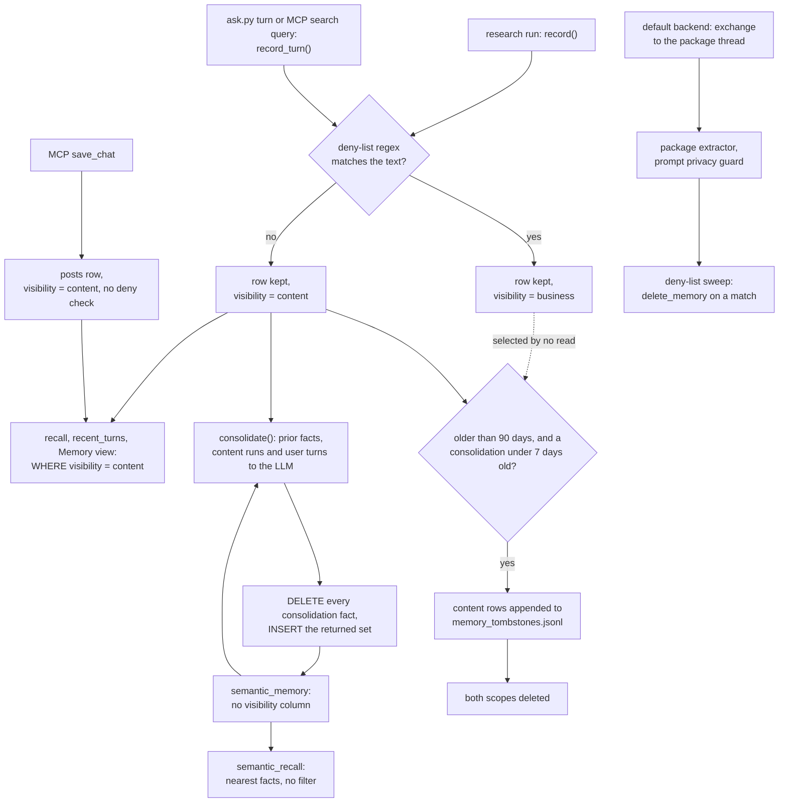

## 1. Executive Summary

second-brain is a single-user personal knowledge base on Oracle AI Database
26ai. Loaders pull a creator's posts, transcripts, notes and AI chats into one
`posts` model. A research agent answers over them and writes each run to an
episodic table, a nightly LLM pass distills those runs into semantic facts, and
an MCP server exposes it all to Claude, ChatGPT and a phone.

What is notable is how privacy is enforced in the memory layer. A deterministic
regex deny-list runs at write time and tags a run or a dialogue turn
`business`; every read of those tables filters to `content` in SQL. The raw log
expires after 90 days only while consolidation is demonstrably running.

What is weak is the distilled layer. Each consolidation deletes every fact and
inserts the model's new set, with nothing comparing the two.

**Two backends, one of them uninspectable.** The default memory core is Oracle's
`oracleagentmemory` package (`oracle/agent/oamp_memory.py`), selected unless
`MEMORY_BACKEND=custom` or `LLM_PROVIDER=ollama`
(`oracle/agent/research_agent.py:29-50`). Its 26.6.0 release on PyPI ships
wheels only, with no sdist and no source repository in its metadata; its design
is described in [arXiv:2607.13157](https://arxiv.org/abs/2607.13157) (Alake et
al., 14 July 2026). This report reads the in-tree code: the hand-built
`custom` backend, the episodic and procedural layers both backends use, and the
privacy sweep this repository runs over the package's table.

**Scope.** The loaders, the wiki compiler and the Notion and social integrations
are a content pipeline and are covered only where they write rows the memory
reads. The memory is the four tables in `oracle/schema/02`, `03`, `05` and `06`,
and the MCP write tools that the tool descriptions present as *"remember
that…"*.

Two marks: `scope_enforced` on the sensitivity key, and `negative_eval` on the
privacy tests with positive controls. Section 9 names the five withheld.

## 2. Mental Model

**Episodic memory is ground truth about what the agent did.** `record` writes
one `agent_memory` row per research run: the question, the answer's first 500
characters, an outcome of `success` or `failure`, a reward of 1.0 or 0.0, and a
`detail` naming the sources the answer used (`oracle/agent/research_agent.py:337-351`).
Outcome is `success` when the answer opened or named a source, not when it was
right. A row stops being a belief only when it expires.

**The sensitivity tag is decided once, at write time.** `record` and
`record_turn` call `violates_privacy` on the text and write `business` on a
match (`oracle/agent/memory.py:21-23`; `conversation.py:18-19`). The patterns
are money amounts, money words within 40 characters of a digit, contract
vocabulary and banking terms, extended by comma-separated regexes in
`OAMP_DENY_EXTRA` (`oamp_memory.py:71-88`). A business row is kept, and no read
path in the tree selects it.

**Semantic memory is a snapshot, not a set of records.** `consolidate` feeds the
previous facts, 80 recent content titles, 30 content-scope runs and 30
content-scope user turns to the model, asks for the full updated set of about
40 facts, then deletes every `source = 'consolidation'` row and inserts the
answer in one transaction (`semantic_memory.py:48-114`). A fact has no identity
across runs. It survives only if the model repeats it, and it dies when the
model omits it.

**Nothing is held as uncertain.** The verification pass rewrites an unsupported
claim with the literal marker *(unverified)* in the answer text
(`research_agent.py:90-99`), and the consolidator prompt says not to promote
such claims (`semantic_memory.py:30-34`). That is an instruction to a model, not
a state on a row.

## 3. Architecture

Everything lives in one Oracle schema, `CCC`, applied by `oracle/bootstrap.sh`
from ten SQL files. The embedding model is MiniLM L12 loaded into the database
as ONNX (`oracle/setup/01_load_onnx_model.sql`), so every INSERT computes its
vector with `VECTOR_EMBEDDING(MINILM USING … AS DATA)` and search needs no API
key. Recall is exact `VECTOR_DISTANCE` without an index; an HNSW index is an
optional setup step (`oracle/schema/02_agent_memory.sql:33-35`).

The Python is a set of modules under `oracle/agent/` and scripts under
`scripts/`, with no package or service boundary. The MCP server
(`oracle/agent/mcp_server.py`) runs over stdio or as a hosted Starlette app
(`mcp_http.py`) behind WorkOS OAuth with an allowlist that refuses to start
unconfigured (`mcp_server.py:43-58`). A read-only web UI is served from the
same app and is off by default (`webui.py:1-20`).

Background work is one scheduled script, `scripts/sync.py`, whose step list runs
loaders, reconcile, wiki refresh, `Consolidate`, `Memory expiry --apply` and
`Memory review --write` in order, and appends `OAMP privacy sweep` when the
backend resolves to the package (`scripts/sync.py:35-75`). A step's failure is
recorded and the sync continues.

The default backend hands conversational and semantic memory to
`OracleAgentMemory`, constructed over the repository's connection pool with the
in-database embedder, `SearchStrategy.HYBRID` and the privacy rule passed as
`memory_extraction_custom_instructions` (`oamp_memory.py:148-169`). The package
creates its own `BRAIN_*` tables. Episodic and procedural memory stay in this
repository's tables on both backends (`oamp_memory.py:8-20`).

### Deployment and ergonomics

The documented path is Colima, the Oracle 26ai Free container, a Python 3.12
venv, `download-model.sh` and `bootstrap.sh`, on Apple Silicon. Search needs no
LLM; consolidation, verification and the package's extraction need one, from
Anthropic, OpenAI or Ollama. Fully local runs are possible on Ollama, which
selects the custom backend. The store is plain SQL and readable by hand. The
repository's own guidance is to fix a wrong memory with SQL.

## 4. Essential Implementation Paths

**Episodic write.** `run_research` ends with `record(conn, "research", question,
answer[:500], "research", outcome, reward, detail)`
(`research_agent.py:349-351`). `record` clamps each column, tags visibility and
inserts with the embedding of `task | action | detail` (`memory.py:10-37`).

**Episodic recall.** `recall` orders content-scope rows by cosine distance and
returns the top k (`memory.py:40-59`). `run_research` recalls three and injects
their `detail` lines as *"Prior research notes (episodic)"*
(`research_agent.py:259-273`).

**Dialogue.** `record_turn` computes `seq` as `MAX(seq)+1` for the session and
inserts (`conversation.py:14-29`). `recent_turns` returns the last twelve
content-scope turns in order (`:32-46`). Callers are `ask.py:31-34`, the demos,
and `_log_query`, which writes every first-page MCP search query as a user turn
in an `mcp-<date>` session unless `MCP_READONLY` or `MCP_LOG_QUERIES=0`
(`mcp_server.py:214-232`).

**Consolidation.** Triggered from `run_research` after five new runs on the
custom backend (`research_agent.py:216-238`) and daily by `scripts/consolidate.py`
on both. `consolidate` builds the prompt from content-scope inputs, calls
`llm.structured` with a JSON schema, then deletes and reinserts inside a
try/rollback (`semantic_memory.py:48-114`).

**Semantic recall.** `semantic_recall` returns the nearest facts with no filter
(`semantic_memory.py:138-154`). On the default backend `recall_facts` searches
the package with `user_id` and `exact_user_match=True`, then appends up to three
consolidated facts whose first 60 characters are new (`oamp_memory.py:172-193`).

**Procedural.** `seed_tools` MERGEs the agent's tool list into
`procedural_memory` once per process, and `select_tools` ranks tools by
distance to the question; the result is a hint line in the prompt
(`procedural.py:12-60`; `research_agent.py:195-213`).

**Package exchange.** `record_exchange` appends the Q/A pair to a process-wide
thread, then calls `enforce_privacy(conn, hours=1)` over the package's memory
table (`oamp_memory.py:196-217`).

**Expiry.** `memory_expire.main` counts rows older than
`MEMORY_RETENTION_DAYS` (default 90), refuses with exit 1 unless the newest
consolidation fact is at most seven days old, appends content-scope rows to
`exports/memory_tombstones.jsonl`, then deletes old rows from both raw tables in
one transaction (`scripts/memory_expire.py:52-147`).

**MCP writes.** `ingest_note` inserts a `note` post and paragraph chunks
(`mcp_server.py:653-713`); `save_chat` inserts a `chat_capture` post with
`visibility` set to the literal `'content'` (`:715-785`, the INSERT at `:748-752`).
Both are registered only when `MCP_READONLY` is unset.

## 5. Memory Data Model

| Table | Key columns | Scope key | Written by |
| --- | --- | --- | --- |
| `agent_memory` | `run_id`, `task`, `action`, `tool`, `outcome` (`CHECK` success or failure), `reward`, `detail`, `embedding`, `created_at` | `visibility` | `memory.record` |
| `semantic_memory` | `fact`, `category`, `source` default `consolidation`, `embedding`, `created_at` | none | `consolidate` only |
| `conversations` | `session_id`, `seq`, `role`, `content`, `created_at` | `visibility` | `conversation.record_turn` |
| `procedural_memory` | `name` unique, `description`, `schema_json`, `kind`, `embedding` | none | `procedural.seed_tools` |

Schemas are `oracle/schema/02_agent_memory.sql:12-27`,
`03_semantic_memory.sql:9-16`, `05_conversational_memory.sql:7-17` and
`06_procedural_memory.sql:8-15`. The `tool_stats` view aggregates outcomes per
tool over all of `agent_memory` without the visibility predicate; it returns
tool names and counts, not text (`02_agent_memory.sql:39-45`).

**One time axis.** Each table has a `created_at` and nothing else; consolidation
regenerates every fact's `created_at`, so a fact's age is the age of the last
run.

**No provenance on facts.** A semantic fact does not record which runs, turns or
titles produced it. The prompt asks for facts *"directly supported by the
inputs"* (`semantic_memory.py:30-34`), and nothing checks it.

**`posts.visibility` has three values in use**: `content`, `business` and
`archived` (`oracle/schema/01_content_duality.sql:42`), set by the LLM
classifier over chat platforms (`scripts/classify_private.py:74-106`) or by
loaders.

## 6. Retrieval Mechanics

Memory recall is pure vector: exact cosine distance between the in-database
embedding of the question and each row, ordered and cut at k, with the
visibility predicate in the same `WHERE`. There is no threshold, so the top
three episodic rows are injected however distant.

Content retrieval is hybrid. `search_content` unions posts, chunks and wiki
pages by vector distance, `_lexical_posts` ranks posts by how many of up to
eight query terms appear in a `LIKE` match, and `search_hybrid` collapses each
list to one entry per document before summing weighted reciprocal-rank scores
with `C=60` (`content.py:12-198`). Source weights favour published posts (1.15)
over notes (1.0), script drafts (0.85) and imported chats (0.75)
(`content.py:121-149`). Wiki pages enter the vector arm with no visibility
predicate (`content.py:39-44`). `get_wiki_page` re-checks each citation's
visibility at read time, because a post can be reclassified after the page was
compiled (`content.py:218-230`).

The injected block per research run is three episodic details, five facts and a
tool hint, prepended to the user message (`research_agent.py:259-273`). It is
bounded by k, not by tokens.

## 7. Write Mechanics

Writes are synchronous SQL on the agent's path; the embedding is computed inside
the INSERT. On the custom backend a run is retrievable at once, and every fifth
run triggers a synchronous consolidation call before `run_research` returns.

**Consolidation is a wholesale rewrite.** The delete-then-insert sits in one
transaction with a rollback, so a failed call leaves the old facts
(`semantic_memory.py:97-113`). A call that succeeds with a short or empty list
replaces the set with it; nothing compares the new count or content to the old.
The expiry step's licence reads `MAX(created_at)` of those facts, so an emptied
set blocks rotation (`scripts/memory_expire.py:73-82`), and nothing else notices.

**Correction is by prompt.** The consolidator is told that *"a user correction
of an earlier answer outranks the prior fact it contradicts"*
(`semantic_memory.py:24-26`). A person who deletes a wrong fact with SQL removes
it from the prior-facts input; the runs and turns it came from stay for up to 90
days, and the next consolidation can derive it again.

**The deny-list is the only filter on memory writes.** Content that is private
but matches no pattern — a health question, a client name — is stored as
`content`. The chat-capture module states a broader personal-life boundary and
unit-tests it (`oracle/agent/chat_capture.py:1-61`), and `should_capture` has no
caller in this tree.

**`save_chat` skips the deny-list.** It writes the summary and key points as
`content` directly (`mcp_server.py:748-752`), while `digest_agent.save_note`
runs the same deny-list before writing a note (`digest_agent.py:52-55`).
`classify_private.py` covers only `claude`, `claude_code` and `chatgpt` posts
(`:77-78`), and `security_check.py` checks only `note` posts against the
deny-list (`:165-172`). A saved chat that mentions a fee is therefore searchable.

**Reloads reset tags.** Chat loaders delete a platform's posts and reinsert them
at the default `content` (`scripts/chatgpt.py:88`). `sync.py` re-runs the
classifier before the wiki and consolidation steps when more than 50 chats exist
and none is tagged (`scripts/sync.py:76-95`).

### Operational cost

- Write: one INSERT with an in-database embedding; no LLM on the custom
  backend except the consolidation every fifth run. On the default backend the
  package's extractor runs per exchange, followed by a deny-list scan of the
  last hour's package memories.
- Background: one consolidation call per day over bounded inputs (80 titles, 30
  runs, 30 turns, the prior facts), `max_tokens=8192`. Expiry and review are
  SQL.
- Read: three runs, five facts and a tool hint per question, prepended to the
  user turn after the system prompt, so the system prefix stays cacheable.

## 8. Agent Integration

The MCP server registers ten read tools (`search`, `fetch`, `overview`,
`list_agents`, `source_status`, `wiki`, `topics`, `recent`, `by_series`,
`related`) and, unless `MCP_READONLY=1`, two write tools. `test_brain.py`
asserts eight of them are registered and that both write tools disappear under
`MCP_READONLY=1` (`tests/test_brain.py:331-355`). No MCP tool reads or
writes `agent_memory`, `semantic_memory` or `procedural_memory`; those are used
by the research agent and shown by the web UI.

Four MCP prompts — `research_brief`, `interview_prep`, `caption_pack`,
`weekly_review` — are playbooks the client model executes with the read tools
(`mcp_server.py:787-878`). An MCP client's memory writes are therefore content
rows, not agent memory.

The research agent is Claude-specific (`MODEL = "claude-opus-4-8"` with
server-side web search, `research_agent.py:52`, `:188`). Memory is injected, not
tool-mediated: the agent does not choose to recall.

## 9. Reliability, Safety, and Trust

**The write-time tag is a stronger control than the prompt it backs.** The
package's extraction receives the privacy rule as instructions, and the source
comments record that a contract term once survived it (`oamp_memory.py:41-44`,
`:64-70`). The regex sweep that follows deletes matches through the package's
own `delete_memory` (`:91-115`). It runs over the last hour after each exchange
and over everything in the daily sync.

**Whether the inline sweep sees the new memories is not established here.**
`record_exchange` sweeps immediately after `add_messages` without waiting,
while `tests/eval_oamp.py:121` calls `wait_for_memory_extraction()` before
searching. If extraction is asynchronous in 26.6.0, a violating memory can be
searchable until the daily sweep. The package source was not read.

**Deletion reaches the raw tables and the local archive, not the facts.** Expiry
deletes business rows outright and does not archive them
(`memory_expire.py:85-97`), which is the correct direction for a privacy floor.
Facts distilled from a run outlive it by design.

**Prompt injection.** Tool results are framed as data in the system prompt
(`research_agent.py:69-71`), and MCP search results say the same, except for
notes titled *"WORKFLOW:"*, which the tool description tells the client to
follow (`mcp_server.py:255-257`). Anything that can write a note can publish a
procedure the client is told to run.

**Single user.** `BRAIN_USER` defaults to `me` (`oamp_memory.py:38`). No row in
the custom tables carries a user, and the hosted server admits the allowlisted
identities to the same data.

Capability marks:

- `scope_enforced` — awarded; the sensitivity key on episodic, dialogue and
  content rows is applied in every read of them. It is a sensitivity class, not
  an owner, and the limits are in the evidence record.
- `negative_eval` — awarded; evidence in section 10.
- `tombstone` — withheld. `exports/memory_tombstones.jsonl` is an archive of
  expired content rows, written so a person can restore them
  (`memory_expire.py:85-115`); nothing reads it to refuse a value. The deny-list
  is keyed on categories of text, not on a rejected value, and lives in code and
  an environment variable.
- `trust_state` — withheld. No memory table has a status column. The
  *(unverified)* marker is text inside an answer.
- `bitemporal` — withheld. One `created_at` per row.
- `audit_log` — withheld. The archive records one deletion path and only
  content rows, without a deletion time; `exports/loop_ledger.jsonl` records
  LLM token spend (`oracle/agent/llm.py:34-60`); consolidation's rewrite leaves
  no record.
- `human_review` — withheld. `memory_review.py` is report-only and its own
  docstring says a person retires rows by SQL (`scripts/memory_review.py:35-38`);
  that is editing after the fact. The web UI accepts only GET and HEAD
  (`webui.py:276-277`).

## 10. Tests, Evals, and Benchmarks

Nothing was built or run for this report; everything below is from reading the
tests at the pin.

**The negative cases.** `test_episodic_memory_privacy_filter` records a
business memory mentioning a $5,000 fee and a content memory, asserts `recall`
queried with the business token returns no row containing it and `recall` for
the content token does, then that `list_recent` holds the content probe and not
the business one (`tests/test_brain.py:239-267`).
`test_conversation_privacy_filter` asserts the working-memory window holds the
control turn and not the rate turn (`:270-287`). Both assert a positive before
or beside the negative. `test_related_posts_visibility_and_shape`,
`test_graph_data_visibility` and `test_related_topics_visibility` do the same
for content reads (`:99-211`).

**Adjacent, off the read path.** `test_consolidation_inputs_are_content_scope`
stubs the LLM, captures the consolidation prompt, and asserts business probes
are absent from it and content probes present (`:687-728`).
`test_memory_expiry_tombstone_is_content_scope` asserts the archive holds content
rows and not the business one (`:528-560`).

**How the suite runs.** `test_brain.py` connects to the live database, has a
standalone runner, and counts a `SkipTest` only for empty tables
(`:19-24`, `:1377-1394`). The tree has no `.github/` directory, so no committed
CI runs it.

**Evals.** `eval_oamp.py` runs seven probes against the package. Its scope probe
asserts another user's Monday memory is absent from a search with
`exact_user_match=True`, with no assertion that the same search returns the
evaluated user's Thursday memory, so an empty result passes
(`tests/eval_oamp.py:162-172`). `eval_retrieval.py` supports
`forbid_title_contains` cases, and `tests/golden_retrieval.json` holds two
positive cases and no negative one.

**No paper for this repository.** A grep for arxiv, bibtex, citation blocks and
DOIs found none. The package's paper is cited in section 1 and makes claims
about the package, not this code.

**Missing.** No test covers `save_chat` visibility, an empty consolidation
result, or the inline sweep's timing.

## 11. For Your Own Build

### Steal

- **Decide sensitivity at write time with a deterministic check, and filter it
  in the query.** A regex that fires on money amounts is crude, and it is the
  same on every run; a prompt instruction was not.
- **Put the sweep behind the prompt.** When a model is told not to store a
  category, scan what it stored for that category and delete it.
- **License deletion with evidence that the distiller ran.** Expiry here
  refuses unless a consolidation happened within seven days, so a broken
  distiller cannot let the raw log rotate away unread.
- **Do not archive what you quarantined.** Restorable deletion and a privacy
  floor pull in opposite directions; this code picks per row.
- **Re-check derived citations at read time** when the source's visibility can
  change after the derivation.

### Avoid

- **Rewriting the whole fact set from one model call without a diff.** Keep
  fact identities, or at least refuse a result that drops most of the set.
- **Two write paths into one table with different privacy checks.** `save_chat`
  and `digest_agent.save_note` both write searchable posts; one runs the
  deny-list.
- **A label keyed on the row when rows are rebuilt.** Delete-and-reload loaders
  return every private chat to the default until a classifier runs.
- **A negative probe without a positive in the same query.**

### Fit

This is a well-instrumented reference build for one person who wants their own
content and chats searchable from any assistant, and who will run Oracle to get
in-database embeddings. The memory is secondary to the content brain: four
small tables, a nightly distillation and a privacy discipline that is more
careful than the retrieval. A reader who needs correctable facts, provenance or
several users should take the sensitivity pattern and the expiry licence and
build the fact layer differently. A reader who cannot inspect the default
backend's package should run `MEMORY_BACKEND=custom`.

## 12. Open Questions

- Is `oracleagentmemory` extraction synchronous inside `add_messages` in 26.6.0?
  The inline sweep's value depends on it.
- Does the private companion repository the README describes call
  `should_capture`, and does the hosted deployment run the classifier over
  `chat_capture` posts?
- How often does consolidation shrink the fact set in practice?
- Does the package's `delete_memory` remove the row's embedding from its hybrid
  index at once?

## Appendix: File Index

- **Schema:** `oracle/schema/01_content_duality.sql`,
  `02_agent_memory.sql`, `03_semantic_memory.sql`,
  `05_conversational_memory.sql`, `06_procedural_memory.sql`.
- **Memory layer:** `oracle/agent/memory.py`, `semantic_memory.py`,
  `conversation.py`, `procedural.py`, `oamp_memory.py`.
- **Agent:** `oracle/agent/research_agent.py`, `ask.py`, `digest_agent.py`.
- **Content retrieval:** `oracle/agent/content.py`, `wiki.py`.
- **MCP and UI:** `oracle/agent/mcp_server.py`, `mcp_http.py`, `webui.py`.
- **Background:** `scripts/sync.py`, `consolidate.py`, `memory_expire.py`,
  `memory_review.py`, `oamp_sweep.py`, `classify_private.py`,
  `security_check.py`.
- **Unwired:** `oracle/agent/chat_capture.py`.
- **Tests:** `tests/test_brain.py`, `tests/eval_oamp.py`,
  `tests/eval_retrieval.py`, `tests/golden_retrieval.json`.

### Recorded searches

Checked against the checkout at the pinned revision.

- `rg -n 'should_capture|import chat_capture|from chat_capture' -g '!tests/*'` — only the definition in `oracle/agent/chat_capture.py`.
- `rg -n 'violates_privacy|enforce_privacy' --type py` — callers in `memory.py`, `conversation.py`, `digest_agent.py`, `oamp_memory.py`, `security_check.py` and tests; none in `mcp_server.py`.
- `rg -n "chat_capture'" --type py` — only `mcp_server.py:741-750`; `classify_private.py` selects `('claude','claude_code','chatgpt')`.
- `rg -n -i 'semantic_memory' --type py` — one writer, `semantic_memory.consolidate`; no read filters on a scope column.
- `rg -n -i 'from\s+agent_memory|from\s+conversations|tool_stats' --type py -g '!tests/*'` — every text read filters visibility; `tool_stats` and the watchdog scans do not.
- `rg -n -i "status|approv|pending|candidate|verified|reject" oracle/schema/*.sql` — only `deals.status` and a sync-run comment; no memory status column.
- `grep -rniE 'arxiv|bibtex|@article|@misc|doi\.org|citation\.cff' . --exclude-dir=.git` — no match; no `CITATION` file.
- `grep -rniE 'renamed|formerly' . --exclude-dir=.git` — one unrelated match in `docs/LOOP_ENGINEERING.md`.
- `ls .github` — no such directory.

## History

**2026-09-30** — [`4890df9fe9e4ebbea8fc1ad34ec39c22594188f7`](https://github.com/LindaHaviv/second-brain/commit/4890df9fe9e4ebbea8fc1ad34ec39c22594188f7) — first reading, at the head of `main`, a commit dated 20 September 2026. Two marks, `scope_enforced` and `negative_eval`. Screened before reading: one auto-run surface (`.claude/settings.json`, a PreToolUse hook that blocks agent edits to `.env` files), no build-time execution, nothing inside the cooldown, one unpinned surface (`oracle/agent/requirements.txt`), and `AGENTS.md` and `CLAUDE.md` recorded as data. Read with `grep` and `sed`; nothing installed, built or run. The default backend's `oracleagentmemory` package was not read.
